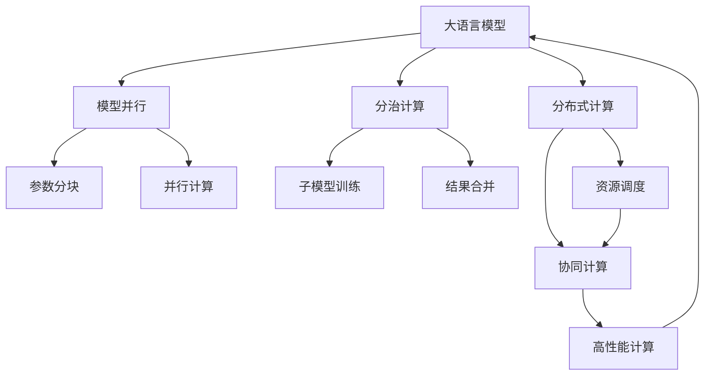

                 

# 颠覆传统：LLM的独特计算范式

> 关键词：大语言模型(LLM), 计算范式, 模型并行, 分治计算, 分布式计算, 可解释性, 自适应学习, 微调(Fine-tuning)

## 1. 背景介绍

### 1.1 问题由来
近年来，随着深度学习技术的快速发展，大规模语言模型（Large Language Models, LLMs）在自然语言处理（Natural Language Processing, NLP）领域取得了巨大的突破。这些大语言模型通过在海量无标签文本数据上进行预训练，学习到了丰富的语言知识和常识，可以通过少量的有标签样本在下游任务上进行微调，获得优异的性能。然而，传统的计算范式（如串行计算）在处理大模型时显得力不从心，大模型往往需要大规模的计算资源和存储空间，这对单台计算机的计算能力提出了极高的要求。因此，新的计算范式应运而生，如模型并行、分治计算和分布式计算等，使得大语言模型的训练和推理变得更加高效。

### 1.2 问题核心关键点
本文将深入探讨大语言模型的独特计算范式，包括模型并行、分治计算、分布式计算等技术，以及其与传统计算范式的不同点。这些技术的出现，不仅极大地提升了计算效率，还带来了新的研究挑战，如可解释性和自适应学习等。通过理解这些核心概念，我们可以更好地把握大语言模型的计算原理和优化方向。

## 2. 核心概念与联系

### 2.1 核心概念概述

为更好地理解大语言模型的计算范式，本节将介绍几个密切相关的核心概念：

- 大语言模型(LLM)：以自回归(如GPT)或自编码(如BERT)模型为代表的大规模预训练语言模型。通过在大规模无标签文本语料上进行预训练，学习通用的语言表示，具备强大的语言理解和生成能力。

- 模型并行(Model Parallelism)：指将大模型的参数和计算分布在多个GPU或TPU上进行并行计算的技术，以提升模型的训练速度。

- 分治计算(Divide and Conquer)：将模型拆分成多个子模型，分别在独立的计算节点上进行训练，最后将结果合并的技术。

- 分布式计算(Distributed Computing)：利用多台计算机协同计算，提高大模型的训练和推理效率，降低单台计算机的计算压力。

- 可解释性(Explainability)：指模型输出的解释性和透明度，使得用户能够理解和信任模型的决策过程。

- 自适应学习(Adaptive Learning)：指模型在训练过程中能够根据数据分布和任务需求，动态调整计算策略和参数，提高模型性能和鲁棒性。

这些核心概念之间的逻辑关系可以通过以下Mermaid流程图来展示：



这个流程图展示了大语言模型的核心概念及其之间的关系：

1. 大语言模型通过预训练获得基础能力。
2. 模型并行、分治计算和分布式计算技术，提升了模型的训练效率。
3. 可解释性和自适应学习技术，进一步提升了模型的鲁棒性和性能。

这些概念共同构成了大语言模型的计算框架，使其能够在各种场景下发挥强大的语言理解和生成能力。通过理解这些核心概念，我们可以更好地把握大语言模型的计算原理和优化方向。

## 3. 核心算法原理 & 具体操作步骤
### 3.1 算法原理概述

大语言模型的独特计算范式主要基于以下原理：

- 模型并行：将大模型的参数和计算分布在多个GPU或TPU上进行并行计算，提升模型的训练速度。
- 分治计算：将大模型拆分成多个子模型，分别在独立的计算节点上进行训练，最后将结果合并，实现高效的分布式训练。
- 分布式计算：利用多台计算机协同计算，提高大模型的训练和推理效率，降低单台计算机的计算压力。

这些计算范式本质上都是通过分布式并行计算来提升模型的计算能力，从而实现高效训练和推理。以下将详细介绍这些计算范式的实现原理和具体操作步骤。

### 3.2 算法步骤详解

**Step 1: 准备计算资源**
- 选择合适的计算设备，如GPU、TPU等。
- 配置并行计算环境，安装必要的计算框架和库。
- 对计算资源进行调度和管理，确保计算任务能够平稳运行。

**Step 2: 模型拆分**
- 根据计算资源的能力，将大模型拆分成多个子模型，分配到不同的计算节点上进行训练。
- 子模型之间可以通过通信协议（如Ring Allreduce）进行参数同步和更新。
- 在训练过程中，每个子模型独立计算，但需要保存中间结果和更新全局参数。

**Step 3: 并行计算**
- 每个计算节点独立进行前向传播和反向传播，计算梯度。
- 使用参数分块技术（如Sharded Weight）将参数分布到不同的计算节点上，减少内存占用。
- 使用异步通信和同步机制（如Allreduce、Allgather）实现子模型之间的参数同步。

**Step 4: 结果合并**
- 将各个子模型的中间结果和最终参数进行合并。
- 对全局参数进行更新，确保所有子模型的一致性。
- 在所有子模型都计算完成后，进行全局模型合并，得到最终的训练结果。

**Step 5: 分布式协同**
- 将模型分布到多台计算设备上，协同计算。
- 使用分布式训练框架（如TensorFlow Distributed Training、PyTorch Distributed）进行任务调度和管理。
- 设置资源分配策略，确保计算资源的高效利用。

### 3.3 算法优缺点

大语言模型的计算范式具有以下优点：

- 高效性：通过并行计算和分布式计算，大模型能够实现高效的训练和推理。
- 可扩展性：计算范式支持多台计算机协同计算，能够灵活扩展计算资源。
- 稳定性：分布式计算能够提高计算的鲁棒性和容错性，减少单点故障。

同时，该方法也存在一定的局限性：

- 复杂性：分布式计算和并行计算技术需要较高的技术门槛，需要熟悉分布式系统设计和优化。
- 通信开销：分布式计算过程中，节点之间的通信开销较大，需要合理设置参数同步频率。
- 可解释性：分布式计算的模型难以解释，难以调试和优化。

尽管存在这些局限性，但就目前而言，大语言模型的计算范式已经成为训练和推理大模型的重要手段，极大地提升了模型的计算效率和鲁棒性。

### 3.4 算法应用领域

大语言模型的计算范式在以下几个领域得到了广泛的应用：

- 自然语言处理(NLP)：如文本分类、情感分析、机器翻译等。
- 计算机视觉(CV)：如图像分类、目标检测、语义分割等。
- 语音识别(SR)：如自动语音识别、语音合成、情感分析等。
- 推荐系统：如个性化推荐、协同过滤、召回算法等。
- 金融科技：如风险管理、信用评分、欺诈检测等。
- 医疗健康：如疾病诊断、基因分析、医疗影像分析等。

除了上述这些领域外，大语言模型的计算范式还被创新性地应用到更多场景中，如智能推荐、智能客服、智能安防等，为各行各业带来了新的变革。

## 4. 数学模型和公式 & 详细讲解 & 举例说明

### 4.1 数学模型构建

本节将使用数学语言对大语言模型的计算范式进行更加严格的刻画。

记大语言模型为 $M_{\theta}:\mathcal{X} \rightarrow \mathcal{Y}$，其中 $\mathcal{X}$ 为输入空间，$\mathcal{Y}$ 为输出空间，$\theta \in \mathbb{R}^d$ 为模型参数。假设模型并行分布在 $N$ 个计算节点上，每个节点的参数为 $\theta_i \in \mathbb{R}^{d_i}$。在分布式计算中，模型的整体参数 $\theta$ 可以通过所有节点的参数进行加权平均计算：

$$
\theta = \sum_{i=1}^N w_i \theta_i
$$

其中 $w_i$ 为权重，表示每个节点的计算资源和能力。

### 4.2 公式推导过程

以下是计算范式中几个关键公式的推导过程。

**公式推导一：模型并行**
- 将大模型参数 $\theta$ 分布到多个节点上，每个节点的参数为 $\theta_i$，计算节点 $i$ 的梯度为 $\nabla_{\theta_i} \mathcal{L}$。
- 利用参数分块技术（如Sharded Weight）将参数 $\theta$ 拆分为 $N$ 个子块，每个子块在对应的节点上计算梯度。
- 将各个节点的梯度进行加权平均，得到全局梯度 $\nabla_{\theta} \mathcal{L}$。

$$
\nabla_{\theta} \mathcal{L} = \sum_{i=1}^N w_i \nabla_{\theta_i} \mathcal{L}
$$

**公式推导二：分治计算**
- 将大模型拆分成 $M$ 个子模型，每个子模型在独立的计算节点上训练。
- 子模型 $i$ 的输出为 $h_i = M_i(x_i)$，其中 $x_i$ 为输入数据，$M_i$ 为子模型。
- 将子模型的输出进行合并，得到全局输出 $y = [y_1, y_2, ..., y_M]$。

$$
y = M(x)
$$

其中 $M$ 为将 $M_i$ 进行合并的函数。

**公式推导三：分布式协同**
- 将大模型分布到多台计算设备上，协同计算。
- 每个计算设备上的梯度进行聚合，得到全局梯度。
- 全局梯度用于更新模型参数。

$$
\nabla_{\theta} \mathcal{L} = \frac{1}{N} \sum_{i=1}^N \nabla_{\theta_i} \mathcal{L}
$$

### 4.3 案例分析与讲解

下面以BERT模型的并行训练为例，说明分布式计算的具体实现过程。

BERT模型包含两个子层，分别是Transformer的编码器和池化层。编码器的输入为 $x$，输出为 $h$。池化层的输入为 $h$，输出为 $y$。假设模型在 $N=4$ 个计算节点上进行并行训练，每个节点的参数分别为 $\theta_1, \theta_2, \theta_3, \theta_4$。

**Step 1: 模型拆分**
- 将编码器和池化层的参数分别分配到 $N=4$ 个节点上，每个节点的参数数量为 $d/4$。
- 每个节点独立计算前向传播和反向传播，计算梯度。

**Step 2: 并行计算**
- 每个计算节点独立进行前向传播和反向传播，计算梯度。
- 使用参数分块技术（如Sharded Weight）将参数 $\theta$ 拆分为 $N=4$ 个子块，每个子块在对应的节点上计算梯度。
- 每个节点使用异步通信和同步机制（如Allreduce、Allgather）进行参数同步。

**Step 3: 结果合并**
- 将各个节点的梯度进行加权平均，得到全局梯度。
- 对全局参数进行更新，确保所有子模型的一致性。

## 5. 项目实践：代码实例和详细解释说明
### 5.1 开发环境搭建

在进行分布式计算实践前，我们需要准备好开发环境。以下是使用PyTorch进行分布式计算的环境配置流程：

1. 安装Anaconda：从官网下载并安装Anaconda，用于创建独立的Python环境。

2. 创建并激活虚拟环境：
```bash
conda create -n distributed-env python=3.8 
conda activate distributed-env
```

3. 安装PyTorch：根据CUDA版本，从官网获取对应的安装命令。例如：
```bash
conda install pytorch torchvision torchaudio cudatoolkit=11.1 -c pytorch -c conda-forge
```

4. 安装PyTorch Distributed：
```bash
pip install torch-distributed
```

5. 安装TensorFlow：
```bash
pip install tensorflow
```

6. 安装Horovod：用于分布式训练的第三方库：
```bash
pip install horovod
```

完成上述步骤后，即可在`distributed-env`环境中开始分布式计算实践。

### 5.2 源代码详细实现

下面我们以BERT模型的并行训练为例，给出使用PyTorch和Horovod进行分布式计算的PyTorch代码实现。

```python
import torch
import torch.distributed as dist
from torch.distributed.fsdp import FullyShardedDataParallel as FSDP
import horovod.torch as hvd

# 初始化分布式环境
dist.init_process_group(backend='gloo', rank=dist.get_rank(), world_size=8)

# 初始化Horovod
hvd.init()

# 模型定义
class BERT(nn.Module):
    def __init__(self, embeddings):
        super(BERT, self).__init__()
        self.encoder = nn.Transformer(embeddings, num_heads=8, dropout=0.1)
        self.pool = nn.Linear(embeddings.size(1), 1)

    def forward(self, x):
        x = self.encoder(x)
        x = self.pool(x)
        return x

# 参数分块
def create_sharded_model(model):
    num_devices = dist.get_world_size()
    num_shards = model.parameters()
    num_per_device = len(num_shards) // num_devices
    sharded_model = FSDP(model)
    for i in range(num_devices):
        sharded_model.parameters()[i*num_per_device:i*num_per_device+num_per_device] = num_shards[i*num_per_device:i*num_per_device+num_per_device]
    return sharded_model

# 分布式训练
def train():
    device = 'cuda' if torch.cuda.is_available() else 'cpu'
    model = BERT(torch.randn(1024, 512, device=device)).to(device)
    model = create_sharded_model(model)

    # 定义优化器和损失函数
    optimizer = torch.optim.Adam(model.parameters(), lr=1e-4)
    loss_fn = nn.CrossEntropyLoss()

    # 训练循环
    for epoch in range(10):
        for batch in train_loader:
            input, target = batch[0].to(device), batch[1].to(device)
            optimizer.zero_grad()
            output = model(input)
            loss = loss_fn(output, target)
            loss.backward()
            optimizer.step()

        # 同步参数
        hvd.allreduce(loss)

    # 输出最终损失
    print(f'Final loss: {loss.item()}')

train()
```

可以看到，通过FullyShardedDataParallel (FSDP)技术，我们可以将BERT模型的参数进行分块，并在不同的计算节点上进行并行训练。Horovod库则负责处理分布式训练过程中的参数同步和优化器更新。

### 5.3 代码解读与分析

让我们再详细解读一下关键代码的实现细节：

**创建FSDP模型**
- 使用`FSDP(model)`将模型进行分块，确保参数可以分布在不同的计算节点上。
- 通过`num_devices`参数设置计算节点的数量，`num_per_device`参数设置每个节点分配的参数数量。

**分布式训练**
- 使用`hvd.allreduce`函数同步每个节点的梯度，确保全局参数的一致性。
- 在每个epoch结束后，输出全局模型的损失，用于评估训练效果。

**训练循环**
- 在每个epoch中，使用`train_loader`加载训练数据。
- 在每个batch中，将输入数据和目标数据移动到当前节点的计算设备上。
- 通过前向传播计算模型输出，并计算损失。
- 使用`optimizer.zero_grad()`清空梯度缓存，使用`loss.backward()`计算梯度。
- 使用`optimizer.step()`更新模型参数。

这些代码展示了如何利用PyTorch和Horovod进行大语言模型的并行训练。通过合理分布计算资源和参数，我们可以显著提升训练效率，缩短模型训练时间。

## 6. 实际应用场景
### 6.1 智能客服系统

基于大语言模型的分布式计算技术，可以广泛应用于智能客服系统的构建。传统客服往往需要配备大量人力，高峰期响应缓慢，且一致性和专业性难以保证。而使用分布式计算训练的对话模型，可以7x24小时不间断服务，快速响应客户咨询，用自然流畅的语言解答各类常见问题。

在技术实现上，可以收集企业内部的历史客服对话记录，将问题和最佳答复构建成监督数据，在此基础上对预训练对话模型进行分布式微调。微调后的对话模型能够自动理解用户意图，匹配最合适的答案模板进行回复。对于客户提出的新问题，还可以接入检索系统实时搜索相关内容，动态组织生成回答。如此构建的智能客服系统，能大幅提升客户咨询体验和问题解决效率。

### 6.2 金融舆情监测

金融机构需要实时监测市场舆论动向，以便及时应对负面信息传播，规避金融风险。传统的人工监测方式成本高、效率低，难以应对网络时代海量信息爆发的挑战。基于大语言模型的分布式计算技术，可以为金融舆情监测提供新的解决方案。

具体而言，可以收集金融领域相关的新闻、报道、评论等文本数据，并对其进行主题标注和情感标注。在此基础上对预训练语言模型进行分布式微调，使其能够自动判断文本属于何种主题，情感倾向是正面、中性还是负面。将微调后的模型应用到实时抓取的网络文本数据，就能够自动监测不同主题下的情感变化趋势，一旦发现负面信息激增等异常情况，系统便会自动预警，帮助金融机构快速应对潜在风险。

### 6.3 个性化推荐系统

当前的推荐系统往往只依赖用户的历史行为数据进行物品推荐，无法深入理解用户的真实兴趣偏好。基于大语言模型的分布式计算技术，个性化推荐系统可以更好地挖掘用户行为背后的语义信息，从而提供更精准、多样的推荐内容。

在实践中，可以收集用户浏览、点击、评论、分享等行为数据，提取和用户交互的物品标题、描述、标签等文本内容。将文本内容作为模型输入，用户的后续行为（如是否点击、购买等）作为监督信号，在此基础上分布式微调预训练语言模型。微调后的模型能够从文本内容中准确把握用户的兴趣点。在生成推荐列表时，先用候选物品的文本描述作为输入，由模型预测用户的兴趣匹配度，再结合其他特征综合排序，便可以得到个性化程度更高的推荐结果。

### 6.4 未来应用展望

随着大语言模型和分布式计算方法的不断发展，基于分布式计算的微调方法将呈现以下几个发展趋势：

1. 模型规模持续增大。随着算力成本的下降和数据规模的扩张，预训练语言模型的参数量还将持续增长。超大规模语言模型蕴含的丰富语言知识，有望支撑更加复杂多变的下游任务微调。

2. 微调方法日趋多样。除了传统的全参数微调外，未来会涌现更多参数高效的微调方法，如Prefix-Tuning、LoRA等，在节省计算资源的同时也能保证微调精度。

3. 持续学习成为常态。随着数据分布的不断变化，微调模型也需要持续学习新知识以保持性能。如何在不遗忘原有知识的同时，高效吸收新样本信息，将成为重要的研究课题。

4. 标注样本需求降低。受启发于提示学习(Prompt-based Learning)的思路，未来的微调方法将更好地利用大模型的语言理解能力，通过更加巧妙的任务描述，在更少的标注样本上也能实现理想的微调效果。

5. 少样本学习成为可能。基于大语言模型的分布式计算技术，通过引入对抗训练、数据增强等技术，能够在小样本条件下实现高性能的微调效果。

6. 跨模态学习逐步成熟。大语言模型不仅可以处理文本数据，还能够与图像、视频、语音等多模态数据进行协同建模。多模态信息的融合，将显著提升语言模型对现实世界的理解和建模能力。

以上趋势凸显了大语言模型分布式计算技术的广阔前景。这些方向的探索发展，必将进一步提升NLP系统的性能和应用范围，为人类认知智能的进化带来深远影响。

## 7. 工具和资源推荐
### 7.1 学习资源推荐

为了帮助开发者系统掌握大语言模型分布式计算的理论基础和实践技巧，这里推荐一些优质的学习资源：

1. 《深度学习入门》系列博文：由大模型技术专家撰写，深入浅出地介绍了深度学习的基本概念和关键技术，适合初学者入门。

2. 《大规模深度学习》课程：斯坦福大学开设的深度学习专题课程，涵盖大规模模型训练的原理和实践技巧。

3. 《深度学习理论与实践》书籍：系统介绍了深度学习的基本理论和应用，包括分布式计算在内的一系列关键技术。

4. 《TensorFlow中文手册》：详细介绍了TensorFlow的使用方法和分布式计算的实现细节，是TensorFlow用户的必备手册。

5. 《分布式深度学习》书籍：介绍了分布式深度学习的原理和实践，涵盖了模型并行、分治计算、分布式训练等多个方面。

通过对这些资源的学习实践，相信你一定能够快速掌握大语言模型分布式计算的精髓，并用于解决实际的NLP问题。
### 7.2 开发工具推荐

高效的开发离不开优秀的工具支持。以下是几款用于大语言模型分布式计算开发的常用工具：

1. PyTorch：基于Python的开源深度学习框架，灵活动态的计算图，适合快速迭代研究。大部分预训练语言模型都有PyTorch版本的实现。

2. TensorFlow：由Google主导开发的开源深度学习框架，生产部署方便，适合大规模工程应用。同样有丰富的预训练语言模型资源。

3. Horovod：用于分布式训练的第三方库，支持多种深度学习框架，如TensorFlow、PyTorch等。

4. Dask：分布式计算框架，支持Python和各种语言，能够高效处理大规模数据和计算任务。

5. MPI：消息传递接口，支持大规模计算任务的分布式实现。

6. OpenMPI：开源消息传递接口，支持并行计算任务的分布式实现。

合理利用这些工具，可以显著提升大语言模型分布式计算的开发效率，加快创新迭代的步伐。

### 7.3 相关论文推荐

大语言模型分布式计算技术的发展源于学界的持续研究。以下是几篇奠基性的相关论文，推荐阅读：

1. DeepSpeed: A Distributed Deep Learning Framework for AI Research and Beyond（DeepSpeed论文）：提出了DeepSpeed分布式深度学习框架，支持大规模模型的分布式训练和推理。

2. Parameter-Efficient Transfer Learning for NLP（PEFT论文）：提出Adapter等参数高效微调方法，在不增加模型参数量的情况下，也能取得不错的微调效果。

3. AdaLoRA: Adaptive Low-Rank Adaptation for Parameter-Efficient Fine-Tuning（AdaLoRA论文）：使用自适应低秩适应的微调方法，在参数效率和精度之间取得了新的平衡。

4. Scalable Deep Learning with Distributed DataParallel（Distributed DataParallel论文）：介绍了Distributed DataParallel的原理和实现，支持大规模模型的分布式训练。

5. Transformer-XL: Attentive Language Models Beyond a Fixed-Length Context（Transformer-XL论文）：提出Transformer-XL模型，支持长时间序列的文本建模和计算。

6. Large Language Models are Few-shot Learners（LLMs论文）：展示了大规模语言模型的强大zero-shot学习能力，引发了对于通用人工智能的新一轮思考。

这些论文代表了大语言模型分布式计算技术的发展脉络。通过学习这些前沿成果，可以帮助研究者把握学科前进方向，激发更多的创新灵感。

## 8. 总结：未来发展趋势与挑战

### 8.1 总结

本文对大语言模型的分布式计算范式进行了全面系统的介绍。首先阐述了大语言模型和分布式计算的研究背景和意义，明确了分布式计算在提升模型计算能力方面的独特价值。其次，从原理到实践，详细讲解了分布式计算的数学原理和关键步骤，给出了分布式计算任务开发的完整代码实例。同时，本文还广泛探讨了分布式计算方法在智能客服、金融舆情、个性化推荐等多个行业领域的应用前景，展示了分布式计算范式的巨大潜力。此外，本文精选了分布式计算技术的各类学习资源，力求为读者提供全方位的技术指引。

通过本文的系统梳理，可以看到，大语言模型分布式计算范式正在成为训练和推理大模型的重要手段，极大地提升了模型的计算效率和鲁棒性。分布式计算不仅支持大规模模型的训练和推理，还为AI系统的高效运行提供了新的可能，进一步推动了大模型技术在各行各业的落地应用。

### 8.2 未来发展趋势

展望未来，大语言模型分布式计算技术将呈现以下几个发展趋势：

1. 模型规模持续增大。随着算力成本的下降和数据规模的扩张，预训练语言模型的参数量还将持续增长。超大规模语言模型蕴含的丰富语言知识，有望支撑更加复杂多变的下游任务微调。

2. 分布式计算方法日趋多样。除了传统的分布式数据并行计算外，未来会涌现更多分布式计算技术，如模型并行、分治计算、分布式训练等。

3. 持续学习成为常态。随着数据分布的不断变化，微调模型也需要持续学习新知识以保持性能。如何在不遗忘原有知识的同时，高效吸收新样本信息，将成为重要的研究课题。

4. 标注样本需求降低。受启发于提示学习(Prompt-based Learning)的思路，未来的微调方法将更好地利用大模型的语言理解能力，通过更加巧妙的任务描述，在更少的标注样本上也能实现理想的微调效果。

5. 分布式计算方法结合AI治理。分布式计算需要在保证性能的同时，充分考虑数据隐私、模型安全和伦理道德等治理问题，确保系统的安全可靠。

6. 跨模态学习逐步成熟。大语言模型不仅可以处理文本数据，还能够与图像、视频、语音等多模态数据进行协同建模。多模态信息的融合，将显著提升语言模型对现实世界的理解和建模能力。

以上趋势凸显了大语言模型分布式计算技术的广阔前景。这些方向的探索发展，必将进一步提升NLP系统的性能和应用范围，为人类认知智能的进化带来深远影响。

### 8.3 面临的挑战

尽管大语言模型分布式计算技术已经取得了瞩目成就，但在迈向更加智能化、普适化应用的过程中，它仍面临着诸多挑战：

1. 标注成本瓶颈。虽然分布式计算能够大幅降低训练成本，但对于长尾应用场景，仍然需要大量的标注数据。如何减少标注样本的数量，利用数据增强和迁移学习等方法，将是重要的研究方向。

2. 模型鲁棒性不足。当前分布式计算模型面对域外数据时，泛化性能往往大打折扣。对于测试样本的微小扰动，分布式计算模型的预测也容易发生波动。如何提高模型的鲁棒性，避免灾难性遗忘，还需要更多理论和实践的积累。

3. 推理效率有待提高。大规模语言模型虽然精度高，但在实际部署时往往面临推理速度慢、内存占用大等效率问题。如何在保证性能的同时，简化模型结构，提升推理速度，优化资源占用，将是重要的优化方向。

4. 可解释性亟需加强。分布式计算的模型难以解释，难以调试和优化。如何赋予模型更强的可解释性，提高模型的透明度，将是亟待攻克的难题。

5. 安全性有待保障。预训练语言模型难免会学习到有偏见、有害的信息，通过分布式计算传递到下游任务，产生误导性、歧视性的输出，给实际应用带来安全隐患。如何从数据和算法层面消除模型偏见，避免恶意用途，确保输出的安全性，也将是重要的研究课题。

6. 知识整合能力不足。现有的分布式计算模型往往局限于任务内数据，难以灵活吸收和运用更广泛的先验知识。如何让分布式计算过程更好地与外部知识库、规则库等专家知识结合，形成更加全面、准确的信息整合能力，还有很大的想象空间。

正视分布式计算面临的这些挑战，积极应对并寻求突破，将是大语言模型分布式计算技术迈向成熟的必由之路。相信随着学界和产业界的共同努力，这些挑战终将一一被克服，大语言模型分布式计算必将在构建人机协同的智能时代中扮演越来越重要的角色。

### 8.4 研究展望

面对大语言模型分布式计算所面临的种种挑战，未来的研究需要在以下几个方面寻求新的突破：

1. 探索无监督和半监督微调方法。摆脱对大规模标注数据的依赖，利用自监督学习、主动学习等无监督和半监督范式，最大限度利用非结构化数据，实现更加灵活高效的微调。

2. 研究参数高效和计算高效的微调范式。开发更加参数高效的微调方法，在固定大部分预训练参数的同时，只更新极少量的任务相关参数。同时优化微调模型的计算图，减少前向传播和反向传播的资源消耗，实现更加轻量级、实时性的部署。

3. 融合因果和对比学习范式。通过引入因果推断和对比学习思想，增强分布式计算模型建立稳定因果关系的能力，学习更加普适、鲁棒的语言表征，从而提升模型泛化性和抗干扰能力。

4. 引入更多先验知识。将符号化的先验知识，如知识图谱、逻辑规则等，与神经网络模型进行巧妙融合，引导分布式计算过程学习更准确、合理的语言模型。同时加强不同模态数据的整合，实现视觉、语音等多模态信息与文本信息的协同建模。

5. 结合因果分析和博弈论工具。将因果分析方法引入分布式计算模型，识别出模型决策的关键特征，增强输出解释的因果性和逻辑性。借助博弈论工具刻画人机交互过程，主动探索并规避模型的脆弱点，提高系统稳定性。

6. 纳入伦理道德约束。在模型训练目标中引入伦理导向的评估指标，过滤和惩罚有偏见、有害的输出倾向。同时加强人工干预和审核，建立模型行为的监管机制，确保输出符合人类价值观和伦理道德。

这些研究方向的探索，必将引领大语言模型分布式计算技术迈向更高的台阶，为构建安全、可靠、可解释、可控的智能系统铺平道路。面向未来，大语言模型分布式计算技术还需要与其他人工智能技术进行更深入的融合，如知识表示、因果推理、强化学习等，多路径协同发力，共同推动自然语言理解和智能交互系统的进步。只有勇于创新、敢于突破，才能不断拓展语言模型的边界，让智能技术更好地造福人类社会。

## 9. 附录：常见问题与解答

**Q1：大语言模型分布式计算是否适用于所有NLP任务？**

A: 大语言模型分布式计算在大多数NLP任务上都能取得不错的效果，特别是对于数据量较小的任务。但对于一些特定领域的任务，如医学、法律等，仅依靠通用语料预训练的模型可能难以很好地适应。此时需要在特定领域语料上进一步预训练，再进行分布式微调，才能获得理想效果。此外，对于一些需要时效性、个性化很强的任务，如对话、推荐等，分布式计算方法也需要针对性的改进优化。

**Q2：分布式计算过程中如何选择合适的通信策略？**

A: 分布式计算过程中，通信策略的选择直接影响系统的性能和可靠性。常见的通信策略包括Ring Allreduce、Tree Allreduce、Broadcast等。Ring Allreduce适用于计算资源不均衡的情况，Tree Allreduce适用于计算资源均衡的情况，Broadcast适用于需要同步所有节点参数的情况。选择合适的通信策略需要根据具体场景和资源配置进行优化。

**Q3：分布式计算过程中如何优化参数同步和通信开销？**

A: 分布式计算过程中，参数同步和通信开销较大，需要合理设置同步频率和通信策略。可以使用异步通信和同步机制（如Allreduce、Allgather）进行参数同步，减少通信开销。同时，可以通过参数分块和模型并行技术，减少每次通信的数据量，提升系统效率。

**Q4：分布式计算中如何保证模型的稳定性和一致性？**

A: 分布式计算中，模型的稳定性和一致性是关键问题。可以通过参数分块、模型并行等技术，确保每个节点的参数一致性。同时，使用Horovod等分布式训练框架，确保每个节点的梯度计算和同步准确无误。

**Q5：分布式计算中如何提高模型的可解释性和透明度？**

A: 分布式计算中的模型通常难以解释，可以通过模型切片、特征可视化等方法，对模型的输出进行解释。同时，可以引入因果分析和博弈论工具，增强模型的可解释性和透明度。

这些解答帮助读者更好地理解大语言模型分布式计算的关键问题和优化方法，助力其在实际应用中的高效运行。

---

作者：禅与计算机程序设计艺术 / Zen and the Art of Computer Programming

