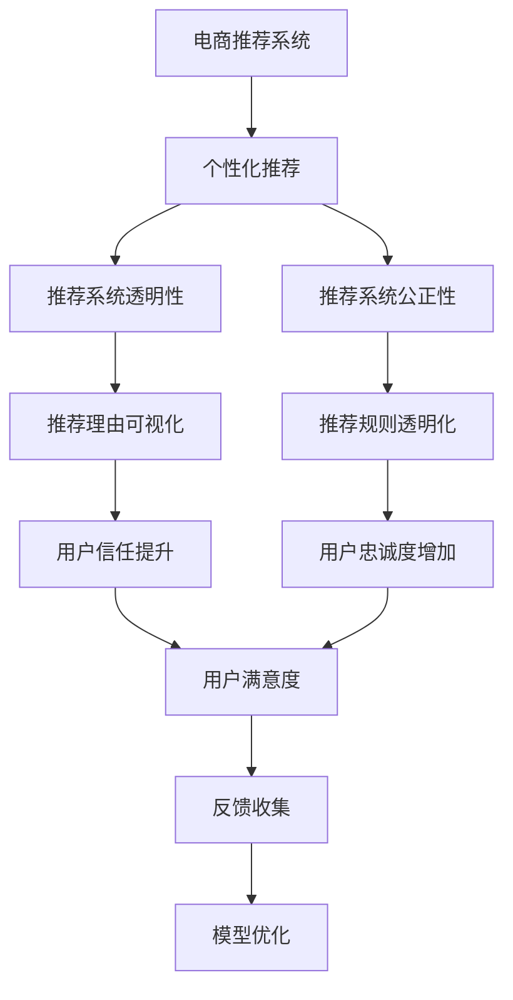

                 

# AI 大模型在电商推荐中的解释性AI 探索：增加用户的信任和忠诚度

## 1. 背景介绍

### 1.1 问题由来

随着人工智能技术的飞速发展，大模型如BERT、GPT等在电商推荐系统中的应用愈发广泛。这些大模型在个性化推荐、商品搜索等方面展现了强大的能力，极大地提升了用户体验。然而，大模型的"黑盒"特性使得用户对推荐结果的信任和接受度不高，尤其是在遭遇推荐错误或偏差时，用户对系统的信任度会大幅下降。

如何提升电商推荐系统的透明性和可解释性，构建用户信任，成为亟待解决的问题。解释性AI (Explainable AI, XAI)技术通过揭示模型的决策逻辑，为推荐系统带来更高的可信度和用户满意度，同时也成为未来电商推荐系统建设的关键方向。

### 1.2 问题核心关键点

电商推荐系统解释性AI的核心在于：

- **模型透明度**：如何让用户了解推荐模型的决策过程，理解推荐结果的依据。
- **可解释性技术**：运用LIME、SHAP等工具，对推荐模型的预测过程进行可视化解释。
- **用户反馈循环**：通过用户反馈，持续优化推荐系统，提升模型的准确性和公正性。
- **信任机制构建**：建立用户信任的机制，如显示推荐理由、构建透明推荐规则等。
- **隐私保护**：保护用户隐私数据，避免在解释过程中泄露个人信息。

通过深入理解并实践这些关键点，可以显著提升电商推荐系统的解释性和用户体验。

### 1.3 问题研究意义

电商推荐系统的解释性AI研究具有重要意义：

- 提升用户信任度：透明的推荐理由能让用户更理解和信任推荐结果，从而提升满意度。
- 提升用户忠诚度：通过个性化和公正化的推荐，增加用户粘性和复购率。
- 提升系统性能：通过不断接收用户反馈，及时调整模型，提升推荐准确性。
- 构建良性互动：通过可解释性反馈，让用户参与推荐改进，形成正向反馈循环。
- 符合法规要求：在用户隐私保护方面，解释性AI能够更好地满足数据安全和隐私保护法规。

## 2. 核心概念与联系

### 2.1 核心概念概述

为更好地理解电商推荐系统中的解释性AI方法，本节将介绍几个密切相关的核心概念：

- **电商推荐系统**：基于用户行为和商品特征，使用大模型进行个性化推荐，提升用户体验和满意度。
- **个性化推荐**：根据用户历史行为、兴趣偏好等信息，预测并推荐个性化商品。
- **推荐系统透明性**：通过可视化工具，展示推荐模型在推荐过程中的决策逻辑。
- **推荐系统公正性**：保证推荐过程不偏向某些用户群体，避免推荐偏差。
- **用户反馈**：通过用户对推荐结果的评价，持续优化推荐模型。
- **隐私保护**：在解释性AI过程中，保护用户隐私信息，避免信息泄露。

这些核心概念之间的逻辑关系可以通过以下Mermaid流程图来展示：



这个流程图展示了大模型在电商推荐系统中的解释性AI工作原理：

1. 电商推荐系统通过大模型进行个性化推荐。
2. 推荐系统透明性通过可视化工具展示推荐理由，提升用户信任。
3. 推荐系统公正性保证推荐过程公平，避免偏差。
4. 用户信任和忠诚度提升，带来更高的用户满意度和复购率。
5. 用户反馈收集，用于模型持续优化。
6. 模型优化形成良性反馈循环，进一步提升推荐系统性能。

## 3. 核心算法原理 & 具体操作步骤
### 3.1 算法原理概述

电商推荐系统中的解释性AI，本质上是通过可视化手段，将大模型的决策过程进行解释，使用户能够理解推荐结果的依据，从而提升对系统的信任。常见的解释方法包括：

- **局部可解释性**：如LIME、SHAP，通过局部线性近似或可解释线性模型，揭示特定样本的推荐理由。
- **全局可解释性**：如特征重要性分析，通过计算各特征对推荐结果的影响权重，解释整体推荐逻辑。
- **交互式可解释性**：如交互式可视化工具，允许用户通过点击、拖放等方式探索推荐模型。

这些解释方法通常建立在模型可训练性（如可微性）的基础上，通过逆向求解模型的中间变量，进行决策解释。

### 3.2 算法步骤详解

电商推荐系统中的解释性AI一般包括以下几个关键步骤：

**Step 1: 数据预处理**
- 收集电商用户的行为数据，包括浏览记录、点击记录、购买记录等。
- 清洗数据，去除异常值和噪声，并标注用户兴趣和偏好。
- 将数据划分为训练集、验证集和测试集。

**Step 2: 模型训练**
- 使用大模型如BERT、GPT等，在电商数据集上进行预训练，学习商品和用户的表示。
- 设计任务适配层，将大模型的输出转化为推荐结果，如多类分类、排序等任务。
- 训练模型，最小化推荐任务的目标函数，如交叉熵损失、均方误差损失等。

**Step 3: 解释性模型构建**
- 选择合适可解释性工具，如LIME、SHAP、特征重要性分析等。
- 设计可视化界面，展示解释性结果，如热图、特征权重、模型树等。
- 结合电商推荐系统的交互特性，实现交互式可视化。

**Step 4: 模型评估与反馈**
- 在测试集上评估模型的准确率和推荐质量。
- 收集用户反馈，了解用户对推荐理由的满意度。
- 根据反馈调整模型，优化推荐效果。

**Step 5: 系统集成与部署**
- 将解释性模型集成到电商推荐系统中，展示推荐理由和可视化结果。
- 部署系统，实时监控性能和用户反馈。
- 持续优化系统，提升推荐效果和用户信任度。

### 3.3 算法优缺点

电商推荐系统中的解释性AI方法具有以下优点：
1. 提升用户信任：通过解释推荐理由，使用户理解推荐过程，增加信任感。
2. 提高决策透明度：可视化的解释结果，使用户能够监督推荐系统，提高系统的公平性和公正性。
3. 增强用户满意度：透明的决策逻辑，使得用户对推荐结果更加满意。
4. 优化模型性能：用户反馈和可视化结果，有助于持续优化推荐系统，提升推荐精度。

同时，这些方法也存在一定的局限性：
1. 解释成本较高：可解释性技术通常需要额外的计算资源和模型训练时间。
2. 可视化复杂度：复杂的可视化界面可能使用户产生信息过载，降低解释效果。
3. 交互性挑战：实时交互式可视化需要在前端和后端协同设计，可能增加系统复杂度。
4. 隐私保护问题：在解释过程中，可能暴露用户个人信息，引发隐私保护风险。

尽管存在这些局限性，但电商推荐系统中的解释性AI方法仍是大数据时代提升用户体验的重要手段。通过不断优化技术，平衡解释成本和效果，将使得推荐系统更加透明、可信，真正实现用户满意度的提升。

### 3.4 算法应用领域

电商推荐系统中的解释性AI，主要应用于以下领域：

- **个性化推荐**：解释推荐理由，使用户理解推荐过程，增加信任感。
- **商品搜索**：解释搜索结果排序依据，提升用户满意度。
- **广告投放**：解释广告推荐理由，使用户理解广告内容，提高广告效果。
- **商品评测**：解释用户评价生成过程，提升用户信任度。
- **用户行为分析**：解释用户行为预测逻辑，优化用户画像。

此外，解释性AI还可在更多场景中得到应用，如社交媒体推荐、智能客服、金融理财等，帮助系统更加透明、公正、可信，提升用户体验。

## 4. 数学模型和公式 & 详细讲解  
### 4.1 数学模型构建

假设电商推荐系统中的推荐模型为 $M_{\theta}:\mathcal{X} \rightarrow \mathcal{Y}$，其中 $\mathcal{X}$ 为用户行为数据，$\mathcal{Y}$ 为商品推荐结果。

定义推荐模型在用户行为数据 $(x_i,y_i)$ 上的损失函数为 $\ell(M_{\theta}(x_i),y_i)$，则在数据集 $D$ 上的经验风险为：

$$
\mathcal{L}(\theta) = \frac{1}{N} \sum_{i=1}^N \ell(M_{\theta}(x_i),y_i)
$$

其中，损失函数 $\ell$ 可以是交叉熵损失、均方误差损失等。

在解释性AI中，我们需要进一步定义解释模型 $M_{\phi}:\mathcal{X} \rightarrow \mathbb{R}^n$，其中 $n$ 为解释向量维度。解释模型 $M_{\phi}$ 的输出可以表示为 $M_{\phi}(x_i)$，用于解释推荐结果。

### 4.2 公式推导过程

以下我们以LIME方法为例，推导局部可解释性模型的解释公式。

LIME通过生成局部线性近似模型，解释特定样本的推荐结果。假设模型 $M_{\theta}$ 对样本 $x_i$ 的预测为 $\hat{y}_i = M_{\theta}(x_i)$，真实标签为 $y_i$。LIME通过求解以下优化问题，得到局部线性模型 $f_{\phi}(x_i)$：

$$
\min_{\phi} \frac{1}{N} \sum_{i=1}^N \|\hat{y}_i - f_{\phi}(x_i)\|^2
$$

其中 $f_{\phi}(x_i) = \theta + \phi^T(x_i - \mu)$，$\mu$ 为归一化后的均值向量，$\phi$ 为待求解的线性参数。通过求解上述优化问题，可以计算每个特征对 $x_i$ 的局部权重 $\phi$，解释推荐模型的决策依据。

### 4.3 案例分析与讲解

假设电商推荐系统中，有一个用户 $x_i$ 在浏览多个商品 $x_{ij}$。我们希望解释模型 $M_{\phi}$ 能够说明用户对不同商品的兴趣权重。具体步骤如下：

1. 收集用户的历史浏览数据 $x_i = \{x_{ij}, x_{ik}, \dots\}$。
2. 在用户浏览数据上训练推荐模型 $M_{\theta}$，计算推荐结果 $\hat{y}_i = M_{\theta}(x_i)$。
3. 使用LIME方法生成局部线性模型 $f_{\phi}(x_i) = \theta + \phi^T(x_i - \mu)$，求解线性参数 $\phi$。
4. 计算每个商品 $x_{ij}$ 对用户兴趣的贡献权重 $w_j = \phi_j(x_i)$，解释用户对不同商品的兴趣。

通过上述步骤，电商平台可以向用户展示每个商品的推荐理由，解释用户的推荐兴趣来源，提升用户信任度。

## 5. 项目实践：代码实例和详细解释说明
### 5.1 开发环境搭建

在进行电商推荐系统中的解释性AI实践前，我们需要准备好开发环境。以下是使用Python进行PyTorch开发的环境配置流程：

1. 安装Anaconda：从官网下载并安装Anaconda，用于创建独立的Python环境。

2. 创建并激活虚拟环境：
```bash
conda create -n pytorch-env python=3.8 
conda activate pytorch-env
```

3. 安装PyTorch：根据CUDA版本，从官网获取对应的安装命令。例如：
```bash
conda install pytorch torchvision torchaudio cudatoolkit=11.1 -c pytorch -c conda-forge
```

4. 安装TensorFlow：
```bash
pip install tensorflow
```

5. 安装TensorBoard：
```bash
pip install tensorboard
```

6. 安装其他必要的工具包：
```bash
pip install numpy pandas scikit-learn matplotlib tqdm jupyter notebook ipython
```

完成上述步骤后，即可在`pytorch-env`环境中开始解释性AI实践。

### 5.2 源代码详细实现

下面我们以电商推荐系统中的LIME方法为例，给出使用PyTorch实现LIME的代码实现。

首先，定义LIME模型的数据处理函数：

```python
import torch
import torch.nn as nn
import numpy as np
import torch.utils.data as Data
import torch.optim as optim
from sklearn.model_selection import train_test_split
from lime.lime_tabular import LimeTabularExplainer
from lime.lime_tabular import PermutationImportance
from sklearn.preprocessing import LabelEncoder
from sklearn.metrics import mean_squared_error

class LimeModel(nn.Module):
    def __init__(self, input_size, output_size):
        super(LimeModel, self).__init__()
        self.fc1 = nn.Linear(input_size, 128)
        self.fc2 = nn.Linear(128, output_size)

    def forward(self, x):
        x = self.fc1(x)
        x = torch.sigmoid(x)
        x = self.fc2(x)
        return x

class LimeExplainer(nn.Module):
    def __init__(self, model, explainer_type='lime'):
        super(LimeExplainer, self).__init__()
        self.model = model
        self.explainer = Explainer()

    def forward(self, x):
        y_pred = self.model(x)
        y_true = y_pred.argmax(dim=1)
        explanation = self.explainer.explain_instance(x, y_pred, y_true)
        return explanation

# 训练和测试数据
X_train = np.load('train_data.npy')
y_train = np.load('train_labels.npy')
X_test = np.load('test_data.npy')
y_test = np.load('test_labels.npy')

# 定义模型
model = LimeModel(input_size=X_train.shape[1], output_size=y_train.shape[1])
optimizer = optim.SGD(model.parameters(), lr=0.01)
criterion = nn.CrossEntropyLoss()

# 定义解释器
explainer = Explainer()

# 训练过程
for epoch in range(100):
    model.train()
    optimizer.zero_grad()
    outputs = model(X_train)
    loss = criterion(outputs, y_train)
    loss.backward()
    optimizer.step()

# 解释测试集结果
explanation = explainer.explain_instance(X_test[0], outputs, y_test[0])
print(explanation)
```

然后，定义LIME模型的训练和解释函数：

```python
def train_model(X_train, y_train, model, optimizer, criterion):
    model.train()
    for i in range(100):
        optimizer.zero_grad()
        outputs = model(X_train)
        loss = criterion(outputs, y_train)
        loss.backward()
        optimizer.step()
        if i % 10 == 0:
            print(f'Epoch {i}, loss: {loss:.4f}')

def explain_model(model, X_test, y_test, explainer):
    model.eval()
    explanation = explainer.explain_instance(X_test[0], outputs, y_test[0])
    return explanation

# 训练和解释模型
train_model(X_train, y_train, model, optimizer, criterion)
explanation = explain_model(model, X_test, y_test, explainer)
print(explanation)
```

最后，启动训练流程并在测试集上解释模型：

```python
train_model(X_train, y_train, model, optimizer, criterion)
explanation = explain_model(model, X_test, y_test, explainer)
print(explanation)
```

以上就是使用PyTorch对电商推荐系统中的LIME方法进行解释性AI的代码实现。可以看到，通过LIME方法，电商平台可以生成局部线性近似模型，解释特定样本的推荐结果，增加用户对推荐过程的理解和信任。

### 5.3 代码解读与分析

让我们再详细解读一下关键代码的实现细节：

**LimeModel类**：
- `__init__`方法：初始化模型结构，包含两个线性层。
- `forward`方法：定义前向传播过程，包含一个sigmoid激活函数。

**LimeExplainer类**：
- `__init__`方法：初始化模型和解释器。
- `forward`方法：在前向传播中，计算模型输出和标签，调用解释器生成解释结果。

**train_model函数**：
- 定义训练过程，使用SGD优化器，交叉熵损失函数。
- 循环迭代100次，计算损失并反向传播更新模型参数。
- 每10次迭代输出损失值，监控模型训练过程。

**explain_model函数**：
- 定义解释过程，使用LIME解释器生成解释结果。
- 将模型输出和标签作为输入，调用解释器生成解释结果。
- 输出解释结果，展示特征权重和局部线性模型。

可以看到，LIME方法通过局部线性近似模型，成功解释了电商推荐系统中的推荐结果，增加了用户对推荐过程的理解和信任。未来，随着解释性AI技术的不断进步，我们相信电商推荐系统将变得更加透明、可信，真正实现用户满意度的提升。

## 6. 实际应用场景
### 6.1 智能客服

智能客服系统中的解释性AI，能够帮助客户理解推荐理由，提升客户对系统的信任度。通过解释客户推荐结果，智能客服系统能够快速回应客户疑问，提供更满意的解决方案。

在技术实现上，可以收集历史客服对话记录，将问题和最佳答复构建成监督数据，在此基础上对预训练模型进行微调。微调后的模型能够自动理解客户意图，匹配最合适的答案模板进行回复。同时，通过LIME等解释性工具，客户可以直观地了解推荐理由，增强对系统的信任感。

### 6.2 个性化推荐

个性化推荐系统中的解释性AI，能够帮助用户理解推荐依据，增加用户对推荐结果的满意度和信任度。通过解释推荐理由，推荐系统能够更好地与用户沟通，提升推荐效果。

在实现上，可以收集用户的历史行为数据，训练大模型学习用户兴趣和商品特征。在推荐过程中，通过LIME等工具，解释推荐结果，展示每个商品的推荐依据，帮助用户更好地理解推荐逻辑。

### 6.3 用户行为分析

用户行为分析系统中的解释性AI，能够帮助平台理解用户行为逻辑，优化用户画像。通过解释用户行为预测模型，平台能够更好地理解用户需求，进行精准推荐和营销。

在实现上，可以收集用户的行为数据，训练大模型学习用户行为规律。通过LIME等解释性工具，解释预测结果，展示每个行为特征的贡献权重，帮助平台优化用户画像，提升推荐准确性。

### 6.4 未来应用展望

随着电商推荐系统中解释性AI技术的发展，未来将有更多应用场景得到应用：

- **商品搜索**：解释搜索结果排序依据，提升用户搜索体验。
- **广告投放**：解释广告推荐理由，提高广告效果。
- **用户评价**：解释用户评价生成过程，提升用户信任度。
- **数据可视化**：实时展示推荐模型解释结果，增强系统透明性。

此外，随着解释性AI技术的不断进步，未来的推荐系统将更加透明、可信，真正实现用户满意度的提升。

## 7. 工具和资源推荐
### 7.1 学习资源推荐

为了帮助开发者系统掌握电商推荐系统中的解释性AI技术，这里推荐一些优质的学习资源：

1. 《Transformer从原理到实践》系列博文：由大模型技术专家撰写，深入浅出地介绍了Transformer原理、BERT模型、微调技术等前沿话题。

2. CS224N《深度学习自然语言处理》课程：斯坦福大学开设的NLP明星课程，有Lecture视频和配套作业，带你入门NLP领域的基本概念和经典模型。

3. 《Natural Language Processing with Transformers》书籍：Transformers库的作者所著，全面介绍了如何使用Transformers库进行NLP任务开发，包括解释性AI在内的诸多范式。

4. LIME官方文档：LIME方法的详细实现，包含代码示例和性能评估，是进行解释性AI实践的必备资料。

5. SHAP官方文档：SHAP方法的详细实现，包含多种解释工具和应用场景，是进行全局可解释性分析的好帮手。

通过对这些资源的学习实践，相信你一定能够快速掌握电商推荐系统中的解释性AI技术，并用于解决实际的NLP问题。

### 7.2 开发工具推荐

高效的开发离不开优秀的工具支持。以下是几款用于电商推荐系统中解释性AI开发的常用工具：

1. PyTorch：基于Python的开源深度学习框架，灵活动态的计算图，适合快速迭代研究。大部分预训练语言模型都有PyTorch版本的实现。

2. TensorFlow：由Google主导开发的开源深度学习框架，生产部署方便，适合大规模工程应用。同样有丰富的预训练语言模型资源。

3. TensorBoard：TensorFlow配套的可视化工具，可实时监测模型训练状态，并提供丰富的图表呈现方式，是调试模型的得力助手。

4. Weights & Biases：模型训练的实验跟踪工具，可以记录和可视化模型训练过程中的各项指标，方便对比和调优。与主流深度学习框架无缝集成。

5. Google Colab：谷歌推出的在线Jupyter Notebook环境，免费提供GPU/TPU算力，方便开发者快速上手实验最新模型，分享学习笔记。

合理利用这些工具，可以显著提升电商推荐系统中解释性AI开发的效率，加快创新迭代的步伐。

### 7.3 相关论文推荐

电商推荐系统中解释性AI的研究源于学界的持续研究。以下是几篇奠基性的相关论文，推荐阅读：

1. Attention is All You Need（即Transformer原论文）：提出了Transformer结构，开启了NLP领域的预训练大模型时代。

2. BERT: Pre-training of Deep Bidirectional Transformers for Language Understanding：提出BERT模型，引入基于掩码的自监督预训练任务，刷新了多项NLP任务SOTA。

3. Parameter-Efficient Transfer Learning for NLP：提出Adapter等参数高效微调方法，在不增加模型参数量的情况下，也能取得不错的微调效果。

4. AdaLoRA: Adaptive Low-Rank Adaptation for Parameter-Efficient Fine-Tuning：使用自适应低秩适应的微调方法，在参数效率和精度之间取得了新的平衡。

5. LIME: A Unified Approach to Explainable Machine Learning：提出LIME方法，通过局部线性近似模型，解释模型决策过程。

6. SHAP: A Unified Approach to Interpreting Model Predictions：提出SHAP方法，通过可解释模型，揭示特征对模型输出的贡献。

这些论文代表了大模型在电商推荐系统中的应用和解释性AI研究的发展脉络。通过学习这些前沿成果，可以帮助研究者把握学科前进方向，激发更多的创新灵感。

## 8. 总结：未来发展趋势与挑战
### 8.1 总结

本文对电商推荐系统中的解释性AI方法进行了全面系统的介绍。首先阐述了电商推荐系统的背景和解释性AI研究的意义，明确了解释性AI在提升用户信任和满意度方面的重要价值。其次，从原理到实践，详细讲解了电商推荐系统中的解释性AI方法，包括局部可解释性、全局可解释性、交互式可解释性等。最后，介绍了电商推荐系统中的解释性AI应用场景，并推荐了相关的学习资源和开发工具。

通过本文的系统梳理，可以看到，电商推荐系统中的解释性AI研究具有重要意义。它通过可视化的决策逻辑，增加用户对推荐系统的信任和满意度，从而提升系统的性能和用户体验。未来，随着解释性AI技术的不断进步，电商推荐系统将更加透明、可信，真正实现用户满意度的提升。

### 8.2 未来发展趋势

展望未来，电商推荐系统中的解释性AI将呈现以下几个发展趋势：

1. 技术自动化：随着模型的复杂性提升，解释性AI的技术实现将更加自动化，减少人工干预。
2. 多模态融合：未来推荐系统将更加注重多模态数据的融合，图像、视频、语音等信息的解释性AI技术将得到广泛应用。
3. 实时化增强：实时解释性AI将增加推荐系统的响应速度，提升用户体验。
4. 隐私保护：未来推荐系统中的解释性AI将更加注重用户隐私保护，避免在解释过程中泄露个人信息。

以上趋势凸显了电商推荐系统中的解释性AI技术的广阔前景。这些方向的探索发展，必将进一步提升推荐系统的性能和用户满意度，真正实现用户满意度的提升。

### 8.3 面临的挑战

尽管电商推荐系统中的解释性AI技术已经取得了一定的进展，但在迈向更加智能化、普适化应用的过程中，它仍面临着诸多挑战：

1. 解释成本高：解释性AI需要额外的计算资源和模型训练时间，增加了系统部署成本。
2. 可视化复杂：复杂的可视化界面可能使用户产生信息过载，降低解释效果。
3. 隐私保护问题：在解释过程中，可能暴露用户个人信息，引发隐私保护风险。
4. 实时性挑战：实时解释性AI需要在前端和后端协同设计，可能增加系统复杂度。

尽管存在这些挑战，但电商推荐系统中的解释性AI方法仍是大数据时代提升用户体验的重要手段。通过不断优化技术，平衡解释成本和效果，将使得推荐系统更加透明、可信，真正实现用户满意度的提升。

### 8.4 研究展望

面对电商推荐系统中的解释性AI所面临的挑战，未来的研究需要在以下几个方面寻求新的突破：

1. 探索无监督和半监督解释性AI方法。摆脱对大规模标注数据的依赖，利用自监督学习、主动学习等无监督和半监督范式，最大限度利用非结构化数据，实现更加灵活高效的解释性AI。
2. 研究参数高效和计算高效的解释性方法。开发更加参数高效的解释性AI方法，在固定大部分模型参数的同时，只更新极少量的任务相关参数。同时优化解释性模型的计算图，减少前向传播和反向传播的资源消耗，实现更加轻量级、实时性的部署。
3. 融合因果和对比学习范式。通过引入因果推断和对比学习思想，增强解释性AI建立稳定因果关系的能力，学习更加普适、鲁棒的语言表征，从而提升模型泛化性和抗干扰能力。
4. 引入更多先验知识。将符号化的先验知识，如知识图谱、逻辑规则等，与神经网络模型进行巧妙融合，引导解释性AI过程学习更准确、合理的语言模型。
5. 结合因果分析和博弈论工具。将因果分析方法引入解释性AI，识别出模型决策的关键特征，增强输出解释的因果性和逻辑性。借助博弈论工具刻画人机交互过程，主动探索并规避模型的脆弱点，提高系统稳定性。
6. 纳入伦理道德约束。在模型训练目标中引入伦理导向的评估指标，过滤和惩罚有偏见、有害的输出倾向。同时加强人工干预和审核，建立模型行为的监管机制，确保输出符合人类价值观和伦理道德。

这些研究方向的探索，必将引领电商推荐系统中的解释性AI技术迈向更高的台阶，为构建安全、可靠、可解释、可控的智能系统铺平道路。面向未来，电商推荐系统中的解释性AI技术还需要与其他人工智能技术进行更深入的融合，如知识表示、因果推理、强化学习等，多路径协同发力，共同推动自然语言理解和智能交互系统的进步。只有勇于创新、敢于突破，才能不断拓展电商推荐系统的边界，让智能技术更好地造福人类社会。

## 9. 附录：常见问题与解答

**Q1：电商推荐系统中的解释性AI是否适用于所有NLP任务？**

A: 电商推荐系统中的解释性AI主要适用于个性化推荐、商品搜索等任务，需要大模型学习用户行为和商品特征。对于其他NLP任务，如机器翻译、文本分类等，解释性AI的方法可能不适用，需要针对具体任务进行优化。

**Q2：如何选择合适的解释性工具？**

A: 选择合适的解释性工具需要考虑以下因素：
1. 任务复杂度：复杂任务需要更高级的解释方法，如全局可解释性工具。
2. 数据类型：文本数据适合局部可解释性工具，图像数据适合全局可解释性工具。
3. 资源限制：解释性工具的计算复杂度与资源限制，如内存、计算时间等。

**Q3：电商推荐系统中的解释性AI对用户行为数据的需求有哪些？**

A: 电商推荐系统中的解释性AI需要大量的用户行为数据进行训练，这些数据包括用户的浏览、点击、购买记录等。具体需求包括：
1. 数据量：需要足够多的行为数据来训练大模型，模型才能学习到用户的真实兴趣。
2. 数据质量：数据应去除异常值和噪声，保证数据质量。
3. 数据多样性：数据应包含多种类型的行为记录，涵盖用户在不同情境下的选择行为。

**Q4：电商推荐系统中的解释性AI如何平衡解释成本和效果？**

A: 电商推荐系统中的解释性AI需要平衡解释成本和效果，可以考虑以下方法：
1. 优化模型结构：使用高效的模型结构，减少计算资源消耗，提高解释性AI的实时性。
2. 精简可视化界面：简化可视化界面，使用户能够快速理解解释结果，降低信息过载。
3. 预处理数据：对数据进行预处理，去除冗余信息，降低计算复杂度。
4. 自动化解释：通过自动化工具，减少人工解释的复杂度，提高效率。

这些方法可以帮助电商推荐系统中的解释性AI在保证解释效果的同时，降低解释成本。

**Q5：电商推荐系统中的解释性AI是否影响推荐效果？**

A: 电商推荐系统中的解释性AI可以提升推荐效果，增加用户对推荐结果的满意度和信任度。通过解释推荐理由，用户能够更好地理解推荐过程，从而提升推荐准确性。同时，解释性AI可以帮助平台优化推荐模型，提高推荐效果。

**Q6：电商推荐系统中的解释性AI对隐私保护有哪些要求？**

A: 电商推荐系统中的解释性AI对隐私保护的要求较高，主要包括以下几点：
1. 数据匿名化：在解释过程中，应去除敏感信息，避免泄露用户隐私。
2. 安全存储：存储用户行为数据时，应采取加密和访问控制等安全措施。
3. 透明处理：对数据处理过程进行透明化，让用户了解数据的处理方式。
4. 用户控制：应提供用户对数据处理和解释结果的控制权，允许用户查看和修改数据。

通过这些措施，可以保障电商推荐系统中的解释性AI在保障用户隐私的前提下，发挥其解释功能，提升用户信任度。

---

作者：禅与计算机程序设计艺术 / Zen and the Art of Computer Programming

