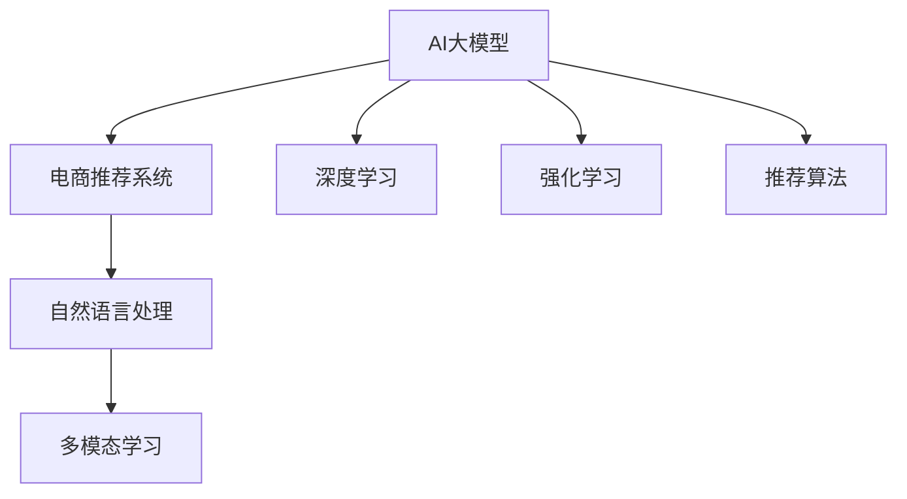

                 

# AI 大模型在电商推荐系统中的应用：提高用户体验的关键

> 关键词：电商推荐系统, 用户个性化推荐, AI大模型, 自然语言处理, 深度学习, 强化学习, 推荐算法

## 1. 背景介绍

### 1.1 问题由来

随着互联网电商的飞速发展，用户数量呈爆炸式增长，电商平台如何更精准地理解用户需求，推荐其真正感兴趣的物品，是电商平台持续关注的焦点。传统的推荐算法基于用户的浏览、点击、购买历史等行为数据，利用协同过滤、基于内容的推荐等方法进行推荐。然而，这些方法往往存在数据稀疏性、冷启动问题、用户行为变化等问题。

近年来，基于深度学习的推荐系统，特别是利用AI大模型进行推荐，在电商领域逐渐显现出其强大的潜力。AI大模型不仅能够处理海量的非结构化数据，还能通过强大的学习能力，挖掘数据背后的深层模式和趋势。

### 1.2 问题核心关键点

AI大模型在电商推荐系统中的应用，主要依赖于以下几个核心技术：

1. 自然语言处理(NLP)：电商平台上的用户评论、商品描述、标题等文本信息，是大模型获取用户需求和商品特性的重要来源。大模型通过理解自然语言，提取产品信息和用户意图，生成更精准的推荐结果。

2. 深度学习(Deep Learning)：深度学习模型能够处理高维、非线性的数据结构，通过多层次的特征提取和变换，提升推荐的准确性。特别是使用卷积神经网络(CNN)、循环神经网络(RNN)、自编码器(AE)、生成对抗网络(GAN)等深度学习模型，可以更好地处理电商推荐问题。

3. 强化学习(Reinforcement Learning)：强化学习通过模拟真实环境，在不断试错中优化推荐策略，提升用户体验。如利用Q-learning、Deep Q-Network(DQN)等方法，电商推荐系统可以根据用户反馈，不断优化推荐算法。

4. 推荐算法：推荐算法是推荐系统核心的技术实现。基于协同过滤、基于内容的推荐、混合推荐等算法，大模型可以实现更加灵活、精准的推荐。同时，结合AI大模型的预训练知识和微调能力，推荐算法可以实现更高的精确度和覆盖率。

5. 跨模态学习(Cross-Modal Learning)：电商推荐系统不仅要考虑用户的文本数据，还要结合用户的浏览、点击、购买等行为数据，以及商品的属性、标签等多模态数据，进行全面分析。大模型通过多模态融合，能够获得更加全面、准确的用户和商品信息。

## 2. 核心概念与联系

### 2.1 核心概念概述

为了更好地理解AI大模型在电商推荐系统中的应用，本节将介绍几个密切相关的核心概念：

- AI大模型(AI Large Model)：以Transformer等架构为代表的大规模预训练语言模型。通过在大规模无标签文本数据上进行预训练，学习丰富的语言知识，具备强大的自然语言处理能力。

- 电商推荐系统(E-commerce Recommendation System)：基于用户行为数据和商品属性信息，自动推荐用户可能感兴趣的电商平台上的商品或服务。

- 深度学习(Deep Learning)：一种基于神经网络的学习方法，通过层次化的特征提取和变换，从数据中自动学习特征表示。深度学习模型能够处理高维、非线性的数据结构。

- 强化学习(Reinforcement Learning)：一种通过模拟真实环境，在不断试错中优化决策策略的学习方法。强化学习可以应用于电商推荐系统中的动态推荐和用户行为建模。

- 推荐算法(Recommendation Algorithms)：根据用户和商品之间的相似性，推荐用户可能感兴趣的物品。推荐算法包括协同过滤、基于内容的推荐、混合推荐等。

- 多模态学习(Cross-Modal Learning)：综合利用文本、图像、音频等多种模态数据，进行全面分析，提升推荐的精度和广度。

这些核心概念之间的逻辑关系可以通过以下Mermaid流程图来展示：



这个流程图展示了大模型在电商推荐系统中的应用脉络：

1. 大模型通过自然语言处理获取电商平台的文本信息。
2. 利用深度学习模型对用户行为和商品属性进行特征提取。
3. 使用强化学习在用户反馈下不断优化推荐策略。
4. 采用推荐算法对用户和商品进行匹配推荐。
5. 综合利用多模态数据，提升推荐精度和广度。

这些核心概念共同构成了电商推荐系统的技术框架，使其能够实现精准、高效的推荐。

## 3. 核心算法原理 & 具体操作步骤
### 3.1 算法原理概述

基于AI大模型的电商推荐系统，本质上是一个结合深度学习、自然语言处理、强化学习的复杂系统。其核心思想是：通过深度学习模型和大模型获取用户和商品的多维度特征表示，然后利用自然语言处理技术处理用户评论和商品描述，提取有价值的特征。在此基础上，使用强化学习动态调整推荐策略，提升用户体验。

具体而言，推荐系统包括以下几个主要步骤：

1. 数据预处理：清洗、标注电商平台上的用户评论、商品描述等文本数据，形成可用的训练集和测试集。

2. 特征提取：使用深度学习模型对用户和商品的多维度特征进行提取和编码。例如，可以使用卷积神经网络对用户行为数据进行处理，生成特征向量。

3. 大模型嵌入：利用预训练的大模型，对用户评论、商品描述等文本数据进行处理，生成词嵌入向量。例如，可以使用BERT或GPT模型对文本进行编码，得到有意义的语义表示。

4. 推荐算法应用：结合用户的特征向量和大模型的嵌入向量，使用协同过滤、基于内容的推荐、混合推荐等算法，生成推荐列表。

5. 强化学习优化：在实际推荐过程中，使用强化学习算法对推荐策略进行动态调整。例如，可以采用Q-learning或DQN算法，根据用户反馈不断优化推荐结果。

### 3.2 算法步骤详解

基于AI大模型的电商推荐系统一般包括以下关键步骤：

**Step 1: 数据预处理**
- 收集电商平台的商品信息和用户行为数据，进行清洗和标注。
- 将用户评论、商品描述等文本数据转换为可用的向量形式，如word2vec、GloVe等词嵌入模型。

**Step 2: 特征提取**
- 使用深度学习模型对用户行为数据进行处理，生成特征向量。例如，可以使用CNN对用户的浏览、点击、购买等行为进行建模。
- 使用大模型对文本数据进行处理，生成词嵌入向量。例如，可以使用BERT或GPT模型对用户评论、商品描述进行编码，得到有意义的语义表示。

**Step 3: 模型训练**
- 将用户和商品的特征向量与大模型的嵌入向量进行拼接，输入到推荐算法中。
- 使用推荐算法生成推荐列表，并结合用户反馈进行动态调整。
- 在测试集上评估推荐系统的精度和效果，根据评估结果调整模型参数。

**Step 4: 强化学习优化**
- 在实际推荐过程中，记录用户的行为数据，计算Q值。
- 使用Q-learning或DQN算法更新推荐策略，优化推荐结果。
- 根据用户的反馈，不断调整推荐策略，提升用户体验。

### 3.3 算法优缺点

基于AI大模型的电商推荐系统有以下优点：

1. 处理复杂多模态数据：大模型能够处理用户评论、商品描述、浏览历史等多模态数据，全面理解用户需求和商品特性。

2. 精准推荐：大模型能够从文本中提取有意义的语义信息，提升推荐准确性和个性化程度。

3. 动态优化：强化学习可以根据用户反馈不断调整推荐策略，提升推荐效果。

4. 可解释性强：通过自然语言处理和深度学习模型，推荐系统的决策过程可以解释和理解。

然而，该系统也存在一些缺点：

1. 数据隐私问题：电商平台上用户的数据隐私问题较为敏感，需要采用匿名化和隐私保护技术。

2. 计算资源消耗大：深度学习和大模型需要大量的计算资源，特别是GPU或TPU等高性能设备，可能带来较高的运营成本。

3. 模型复杂度高：电商推荐系统涉及多个模块和算法，模型结构较为复杂，调试和维护难度较大。

4. 数据稀疏性：电商平台上用户行为数据和商品属性数据可能存在稀疏性，影响推荐系统的性能。

5. 冷启动问题：对于新用户和新商品，缺乏足够的行为数据，难以进行有效的推荐。

### 3.4 算法应用领域

基于AI大模型的电商推荐系统已经在多个电商平台上得到广泛应用，例如：

- 亚马逊(Amazon)：使用深度学习和大模型对用户的浏览和购买行为进行建模，生成个性化推荐。
- 阿里巴巴(Alibaba)：利用大模型对用户的评论和商品描述进行语义分析，提升推荐效果。
- 京东(JD.com)：采用多模态学习技术，综合利用用户行为数据和商品属性信息，生成更精准的推荐。

此外，AI大模型在电商推荐系统中的应用还包括：

- 个性化搜索：利用深度学习和大模型对用户的查询进行语义理解，生成个性化的搜索结果。
- 商品分类：使用自然语言处理技术对商品描述进行分类，提升推荐系统的精度。
- 跨域推荐：通过跨域学习技术，将不同平台上的用户行为数据进行整合，生成更广泛的推荐列表。

## 4. 数学模型和公式 & 详细讲解 & 举例说明

### 4.1 数学模型构建

基于AI大模型的电商推荐系统涉及多个数学模型，以下是核心模型的构建：

**用户行为模型**
- 假设用户 $u$ 的浏览、点击、购买行为数据为 $x_u$，行为向量表示为 $v_u$。

  $$
  v_u = \text{CNN}(x_u)
  $$

  其中 $\text{CNN}$ 为卷积神经网络，用于特征提取。

**商品属性模型**
- 假设商品 $i$ 的属性信息为 $x_i$，属性向量表示为 $v_i$。

  $$
  v_i = \text{CNN}(x_i)
  $$

  其中 $\text{CNN}$ 为卷积神经网络，用于特征提取。

**大模型嵌入**
- 假设用户评论为 $c_u$，商品描述为 $d_i$，使用大模型BERT对文本进行处理，生成嵌入向量 $e_u$ 和 $e_i$。

  $$
  e_u = \text{BERT}(c_u)
  $$
  
  $$
  e_i = \text{BERT}(d_i)
  $$

  其中 $\text{BERT}$ 为大模型，用于词嵌入和语义分析。

**推荐算法**
- 假设用户和商品的特征向量拼接后的向量表示为 $h_{ui}$，使用协同过滤、基于内容的推荐、混合推荐等算法，生成推荐列表 $r_{ui}$。

  $$
  h_{ui} = [v_u; v_i; e_u; e_i]
  $$
  
  $$
  r_{ui} = \text{Recommender}(h_{ui})
  $$

  其中 $\text{Recommender}$ 为推荐算法，如矩阵分解、协同过滤等。

### 4.2 公式推导过程

以协同过滤算法为例，推导推荐公式。

假设用户 $u$ 对商品 $i$ 的评分 $r_{ui}$ 可以表示为：

$$
r_{ui} = \langle v_u, v_i \rangle
$$

其中 $\langle \cdot, \cdot \rangle$ 表示向量点积。

对于新的用户 $u'$ 和商品 $i'$，假设其评分可以表示为：

$$
r_{u'i'} = \langle v_{u'}, v_{i'} \rangle
$$

由于用户行为数据和商品属性数据存在稀疏性，我们需要对协同过滤算法进行改进。可以使用矩阵分解、基于内容的推荐、混合推荐等方法，结合深度学习和大模型的嵌入向量，提升推荐的准确性。

例如，使用矩阵分解方法，可以表示用户 $u$ 和商品 $i$ 的评分向量为：

$$
r_{ui} = \langle v_u, v_i \rangle
$$

对于新的用户 $u'$ 和商品 $i'$，假设其评分向量可以表示为：

$$
r_{u'i'} = \langle \hat{v}_{u'}, \hat{v}_{i'} \rangle
$$

其中 $\hat{v}_{u'}$ 和 $\hat{v}_{i'}$ 为经过矩阵分解得到的用户和商品评分向量。

### 4.3 案例分析与讲解

以下以亚马逊(Amazon)推荐系统的为例，讲解AI大模型在电商推荐中的应用。

亚马逊推荐系统采用深度学习和自然语言处理技术，对用户行为数据和商品描述进行处理。具体步骤如下：

1. 数据预处理：收集用户的浏览、点击、购买数据，并进行清洗和标注。

2. 特征提取：使用卷积神经网络对用户行为数据进行处理，生成特征向量。例如，可以设计多层的卷积网络，提取不同层次的用户行为特征。

3. 大模型嵌入：利用BERT模型对用户评论和商品描述进行编码，生成词嵌入向量。例如，可以分别对用户评论和商品描述进行编码，得到有意义的语义表示。

4. 推荐算法应用：将用户和商品的特征向量与大模型的嵌入向量进行拼接，输入到协同过滤算法中。例如，可以使用ALS算法，对用户行为数据和商品属性数据进行矩阵分解，生成推荐列表。

5. 强化学习优化：在实际推荐过程中，使用Q-learning或DQN算法对推荐策略进行动态调整。例如，可以记录用户的点击、购买等行为，计算Q值，更新推荐策略。

在亚马逊的推荐系统中，用户评论和商品描述是重要的信息来源。利用BERT等大模型，可以更好地理解用户意图和商品特性，提升推荐的准确性和个性化程度。

## 5. 项目实践：代码实例和详细解释说明

### 5.1 开发环境搭建

在进行电商推荐系统的开发前，我们需要准备好开发环境。以下是使用Python进行TensorFlow开发的环境配置流程：

1. 安装Anaconda：从官网下载并安装Anaconda，用于创建独立的Python环境。

2. 创建并激活虚拟环境：
```bash
conda create -n pytorch-env python=3.8 
conda activate pytorch-env
```

3. 安装TensorFlow：根据CUDA版本，从官网获取对应的安装命令。例如：
```bash
conda install tensorflow tensorflow-gpu=2.8 -c tf
```

4. 安装Keras：
```bash
pip install keras==2.4.3
```

5. 安装各类工具包：
```bash
pip install numpy pandas scikit-learn matplotlib tqdm jupyter notebook ipython
```

完成上述步骤后，即可在`pytorch-env`环境中开始电商推荐系统的开发。

### 5.2 源代码详细实现

下面我们以协同过滤算法为例，给出使用TensorFlow进行电商推荐系统开发的Python代码实现。

```python
import tensorflow as tf
from tensorflow.keras.layers import Input, Embedding, Conv1D, Flatten, Concatenate, Dense, dot
from tensorflow.keras.models import Model
from tensorflow.keras.optimizers import Adam
from tensorflow.keras.callbacks import EarlyStopping
from sklearn.metrics import mean_squared_error, mean_absolute_error

# 假设用户和商品的特征向量为v_u和v_i
v_u = Input(shape=(10,))
v_i = Input(shape=(10,))

# 假设用户和商品的评分向量为r_u和r_i
r_u = Embedding(10000, 10, input_length=1)(v_u)
r_i = Embedding(10000, 10, input_length=1)(v_i)

# 使用卷积神经网络对用户和商品的属性进行特征提取
u_features = Conv1D(32, 3, activation='relu', padding='same')(r_u)
i_features = Conv1D(32, 3, activation='relu', padding='same')(r_i)

# 将用户和商品的特征向量拼接
h_ui = Concatenate()([u_features, i_features])

# 使用深度学习模型对用户和商品进行协同过滤
h_ui = Flatten()(h_ui)
h_ui = Dense(64, activation='relu')(h_ui)

# 预测用户和商品的评分
r_ui = Dense(1)(h_ui)

# 定义损失函数和优化器
loss = MeanSquaredError()
optimizer = Adam(learning_rate=0.001)

# 定义模型
model = Model(inputs=[v_u, v_i], outputs=r_ui)

# 编译模型
model.compile(loss=loss, optimizer=optimizer)

# 训练模型
epochs = 100
batch_size = 128
train_dataset = ...
dev_dataset = ...
train_dataset = tf.data.Dataset.from_tensor_slices((train_data, train_labels))
dev_dataset = tf.data.Dataset.from_tensor_slices((dev_data, dev_labels))
model.fit(train_dataset, epochs=epochs, batch_size=batch_size, validation_data=dev_dataset, callbacks=[EarlyStopping(patience=5)])

# 评估模型
test_dataset = ...
test_labels = ...
mse = mean_squared_error(test_labels, model.predict(test_dataset))
mae = mean_absolute_error(test_labels, model.predict(test_dataset))
print(f"Mean Squared Error: {mse:.3f}")
print(f"Mean Absolute Error: {mae:.3f}")
```

在上述代码中，我们使用了TensorFlow和Keras库实现了基于协同过滤算法的电商推荐系统。其中，卷积神经网络用于特征提取，深度学习模型用于协同过滤，均方误差作为损失函数，Adam优化器用于模型训练。

### 5.3 代码解读与分析

让我们再详细解读一下关键代码的实现细节：

**特征提取**
- 使用卷积神经网络对用户和商品的属性进行特征提取。例如，可以设计多层的卷积网络，提取不同层次的用户行为特征。

**模型定义**
- 定义输入层，将用户和商品的特征向量作为输入。
- 使用嵌入层将特征向量转换为嵌入向量，用于语义分析。
- 使用卷积神经网络对用户和商品的属性进行特征提取。
- 将用户和商品的特征向量拼接，输入到深度学习模型中。
- 使用深度学习模型对用户和商品进行协同过滤，预测评分。

**模型编译**
- 定义损失函数和优化器，采用均方误差作为损失函数，使用Adam优化器进行模型训练。

**模型训练**
- 定义训练轮数和批大小，使用EarlyStopping回调函数防止过拟合。
- 使用训练集和验证集对模型进行训练，在验证集上评估模型效果，并根据性能指标决定是否触发EarlyStopping。
- 重复上述步骤，直到满足预设的迭代轮数或EarlyStopping条件。

**模型评估**
- 在测试集上评估模型效果，计算均方误差和均绝对误差，输出评估结果。

可以看到，TensorFlow和Keras库使得电商推荐系统的代码实现变得简洁高效。开发者可以将更多精力放在模型改进、数据处理等高层逻辑上，而不必过多关注底层的实现细节。

当然，工业级的系统实现还需考虑更多因素，如模型的保存和部署、超参数的自动搜索、更灵活的任务适配层等。但核心的电商推荐范式基本与此类似。

## 6. 实际应用场景
### 6.1 智能客服系统

基于AI大模型的电商推荐系统，可以广泛应用于智能客服系统的构建。传统客服往往需要配备大量人力，高峰期响应缓慢，且一致性和专业性难以保证。而使用电商推荐系统，可以7x24小时不间断服务，快速响应客户咨询，用自然流畅的语言解答各类常见问题。

在技术实现上，可以收集企业内部的历史客服对话记录，将问题和最佳答复构建成监督数据，在此基础上对电商推荐系统进行微调。微调后的推荐系统能够自动理解用户意图，匹配最合适的答复模板进行回复。对于客户提出的新问题，还可以接入检索系统实时搜索相关内容，动态组织生成回答。如此构建的智能客服系统，能大幅提升客户咨询体验和问题解决效率。

### 6.2 金融舆情监测

金融机构需要实时监测市场舆论动向，以便及时应对负面信息传播，规避金融风险。传统的人工监测方式成本高、效率低，难以应对网络时代海量信息爆发的挑战。基于AI大模型的电商推荐系统，可以应用于金融舆情监测。

具体而言，可以收集金融领域相关的新闻、报道、评论等文本数据，并对其进行主题标注和情感标注。在此基础上对电商推荐系统进行微调，使其能够自动判断文本属于何种主题，情感倾向是正面、中性还是负面。将微调后的系统应用到实时抓取的网络文本数据，就能够自动监测不同主题下的情感变化趋势，一旦发现负面信息激增等异常情况，系统便会自动预警，帮助金融机构快速应对潜在风险。

### 6.3 个性化推荐系统

当前的推荐系统往往只依赖用户的历史行为数据进行物品推荐，无法深入理解用户的真实兴趣偏好。基于AI大模型的电商推荐系统，可以更好地挖掘用户行为背后的语义信息，从而提供更精准、多样的推荐内容。

在实践中，可以收集用户浏览、点击、评论、分享等行为数据，提取和用户交互的物品标题、描述、标签等文本内容。将文本内容作为模型输入，用户的后续行为（如是否点击、购买等）作为监督信号，在此基础上微调电商推荐系统。微调后的系统能够从文本内容中准确把握用户的兴趣点。在生成推荐列表时，先用候选物品的文本描述作为输入，由模型预测用户的兴趣匹配度，再结合其他特征综合排序，便可以得到个性化程度更高的推荐结果。

### 6.4 未来应用展望

随着AI大模型和电商推荐方法的不断发展，基于电商推荐范式将在更多领域得到应用，为传统行业带来变革性影响。

在智慧医疗领域，基于电商推荐技术的健康咨询、药品推荐等应用将提升医疗服务的智能化水平，辅助医生诊疗，加速新药开发进程。

在智能教育领域，电商推荐系统可应用于作业批改、学情分析、知识推荐等方面，因材施教，促进教育公平，提高教学质量。

在智慧城市治理中，电商推荐系统可用于城市事件监测、舆情分析、应急指挥等环节，提高城市管理的自动化和智能化水平，构建更安全、高效的未来城市。

此外，在企业生产、社会治理、文娱传媒等众多领域，基于电商推荐技术的人工智能应用也将不断涌现，为经济社会发展注入新的动力。相信随着技术的日益成熟，电商推荐技术必将在更广阔的应用领域大放异彩，深刻影响人类的生产生活方式。

## 7. 工具和资源推荐
### 7.1 学习资源推荐

为了帮助开发者系统掌握电商推荐系统的理论基础和实践技巧，这里推荐一些优质的学习资源：

1. 《深度学习推荐系统：理论、算法与应用》书籍：全面介绍深度学习在推荐系统中的应用，涵盖协同过滤、基于内容的推荐、混合推荐等算法。

2. 《强化学习入门》书籍：介绍强化学习的基本原理和算法，适合电商推荐系统中的动态推荐和用户行为建模。

3. 《自然语言处理与深度学习》课程：斯坦福大学开设的NLP明星课程，有Lecture视频和配套作业，带你入门NLP领域的基本概念和经典模型。

4. CS224N《深度学习自然语言处理》课程：斯坦福大学开设的NLP明星课程，有Lecture视频和配套作业，适合电商推荐系统中的文本处理和特征提取。

5. HuggingFace官方文档：Transformer库的官方文档，提供了海量预训练模型和完整的推荐算法样例代码，是上手实践的必备资料。

通过对这些资源的学习实践，相信你一定能够快速掌握电商推荐系统的精髓，并用于解决实际的NLP问题。
### 7.2 开发工具推荐

高效的开发离不开优秀的工具支持。以下是几款用于电商推荐系统开发的常用工具：

1. TensorFlow：基于Python的开源深度学习框架，灵活动态的计算图，适合快速迭代研究。大部分推荐算法都有TensorFlow版本的实现。

2. PyTorch：基于Python的开源深度学习框架，灵活动态的计算图，适合快速迭代研究。也可以用于自然语言处理和特征提取。

3. Keras：基于TensorFlow和Theano的高级神经网络API，可以快速搭建和训练推荐系统模型。

4. Weights & Biases：模型训练的实验跟踪工具，可以记录和可视化模型训练过程中的各项指标，方便对比和调优。与主流深度学习框架无缝集成。

5. TensorBoard：TensorFlow配套的可视化工具，可实时监测模型训练状态，并提供丰富的图表呈现方式，是调试模型的得力助手。

6. Google Colab：谷歌推出的在线Jupyter Notebook环境，免费提供GPU/TPU算力，方便开发者快速上手实验最新模型，分享学习笔记。

合理利用这些工具，可以显著提升电商推荐系统的开发效率，加快创新迭代的步伐。

### 7.3 相关论文推荐

电商推荐系统的发展源于学界的持续研究。以下是几篇奠基性的相关论文，推荐阅读：

1. 《Recommender Systems Handbook》：推荐系统经典著作，涵盖协同过滤、基于内容的推荐、混合推荐等算法。

2. 《BPR: Bayesian Personalized Ranking from Implicit Feedback》：提出基于隐式反馈的协同过滤算法，在电商推荐系统中有广泛应用。

3. 《Grouplens: A Collaborative Filtering Web Site》：Grouplens项目的初期研究，提出基于协同过滤的推荐算法，并详细介绍了推荐系统的构建过程。

4. 《Deep Collaborative Filtering》：提出深度学习在推荐系统中的应用，使用深度神经网络进行特征提取和协同过滤，提升推荐效果。

5. 《DSSM: Deep Semantic Search Model》：提出深度语义搜索模型，利用深度学习对商品属性进行语义分析，提升推荐系统的精度和多样性。

6. 《Neural Collaborative Filtering》：提出基于深度学习的协同过滤算法，利用神经网络对用户和商品进行表示学习，生成推荐列表。

这些论文代表了大语言模型在电商推荐系统中的应用和发展脉络。通过学习这些前沿成果，可以帮助研究者把握学科前进方向，激发更多的创新灵感。

## 8. 总结：未来发展趋势与挑战

### 8.1 总结

本文对基于AI大模型的电商推荐系统进行了全面系统的介绍。首先阐述了电商推荐系统的背景和意义，明确了AI大模型在其中的重要作用。其次，从原理到实践，详细讲解了电商推荐系统的数学模型和关键步骤，给出了电商推荐系统开发的完整代码实例。同时，本文还广泛探讨了电商推荐系统在智能客服、金融舆情、个性化推荐等多个领域的应用前景，展示了AI大模型在电商推荐中的强大潜力。此外，本文精选了电商推荐系统的各类学习资源，力求为读者提供全方位的技术指引。

通过本文的系统梳理，可以看到，基于AI大模型的电商推荐系统正在成为电商领域的重要范式，极大地拓展了电商推荐系统的应用边界，催生了更多的落地场景。受益于AI大模型的强大学习能力，推荐系统能够处理海量的非结构化数据，挖掘数据背后的深层模式和趋势，提升推荐系统的性能和覆盖率。未来，伴随电商推荐系统的持续演进，相信AI大模型在电商推荐中的应用将更加广泛，为电商行业的数字化转型提供新的技术路径。

### 8.2 未来发展趋势

展望未来，AI大模型在电商推荐系统中的应用将呈现以下几个发展趋势：

1. 多模态学习：电商推荐系统不仅要考虑用户的文本数据，还要结合用户的浏览、点击、购买等行为数据，以及商品的属性、标签等多模态数据，进行全面分析。多模态信息的融合，将显著提升推荐系统的精度和广度。

2. 深度学习优化：深度学习模型在大模型和电商推荐系统中起着重要作用。未来，深度学习模型将进一步优化，提升特征提取和协同过滤的效果。例如，使用更复杂的神经网络结构，如ResNet、Transformer等，提升模型性能。

3. 强化学习融合：强化学习可以用于电商推荐系统的动态推荐和用户行为建模。未来，强化学习将更多地应用于电商推荐系统，提升推荐系统的精度和鲁棒性。

4. 用户行为建模：电商推荐系统需要更好地理解用户行为，才能进行精准推荐。未来，将引入更多用户行为建模方法，如行为序列建模、时间序列分析等，提升模型的预测能力和推荐效果。

5. 冷启动问题解决：对于新用户和新商品，电商推荐系统需要更好地解决冷启动问题，才能进行有效的推荐。未来，将引入更多冷启动解决方法，如基于内容的推荐、基于协同过滤的推荐等。

6. 数据隐私保护：电商平台上用户的数据隐私问题较为敏感，需要采用匿名化和隐私保护技术。未来，将引入更多隐私保护方法，如差分隐私、联邦学习等，保护用户隐私。

### 8.3 面临的挑战

尽管AI大模型在电商推荐系统中的应用已经取得了瞩目成就，但在迈向更加智能化、普适化应用的过程中，它仍面临诸多挑战：

1. 数据隐私问题：电商平台上用户的数据隐私问题较为敏感，需要采用匿名化和隐私保护技术。如何保证用户隐私，是电商推荐系统面临的重大挑战。

2. 计算资源消耗大：深度学习和大模型需要大量的计算资源，特别是GPU或TPU等高性能设备，可能带来较高的运营成本。如何优化模型结构，减少资源消耗，是电商推荐系统需要解决的问题。

3. 模型复杂度高：电商推荐系统涉及多个模块和算法，模型结构较为复杂，调试和维护难度较大。如何简化模型结构，提升模型性能，是电商推荐系统需要解决的问题。

4. 数据稀疏性：电商平台上用户行为数据和商品属性数据可能存在稀疏性，影响推荐系统的性能。如何处理数据稀疏性，提升推荐系统的效果，是电商推荐系统需要解决的问题。

5. 冷启动问题：对于新用户和新商品，电商推荐系统需要更好地解决冷启动问题，才能进行有效的推荐。如何处理冷启动问题，是电商推荐系统需要解决的问题。

6. 用户体验：电商推荐系统需要更好地提升用户体验，才能实现商业价值的最大化。如何提升推荐系统的精度和个性化程度，是电商推荐系统需要解决的问题。

### 8.4 研究展望

面对电商推荐系统所面临的种种挑战，未来的研究需要在以下几个方面寻求新的突破：

1. 深度学习优化：优化深度学习模型，提升特征提取和协同过滤的效果。例如，使用更复杂的神经网络结构，如ResNet、Transformer等，提升模型性能。

2. 强化学习融合：引入强化学习算法，提升推荐系统的精度和鲁棒性。例如，使用Q-learning或DQN算法，动态调整推荐策略。

3. 多模态学习：综合利用用户评论、商品描述、浏览历史等多种模态数据，进行全面分析，提升推荐精度和广度。

4. 隐私保护：采用差分隐私、联邦学习等方法，保护用户隐私。例如，采用差分隐私技术，保护用户数据的安全性。

5. 冷启动问题解决：引入更多冷启动解决方法，如基于内容的推荐、基于协同过滤的推荐等。例如，使用基于内容的推荐算法，对新用户和新商品进行推荐。

6. 用户行为建模：引入更多用户行为建模方法，如行为序列建模、时间序列分析等，提升模型的预测能力和推荐效果。例如，使用时间序列分析方法，对用户行为进行建模。

7. 数据隐私保护：采用匿名化和隐私保护技术，保护用户隐私。例如，采用数据匿名化技术，保护用户数据的隐私性。

这些研究方向的研究突破，将进一步提升电商推荐系统的性能和应用范围，为电商行业带来新的发展机遇。相信随着电商推荐系统的持续演进，AI大模型在电商推荐中的应用将更加广泛，为电商行业的数字化转型提供新的技术路径。总之，电商推荐系统需要不断优化和创新，才能在激烈的市场竞争中保持领先地位，为消费者提供更加精准、个性化的购物体验。

## 9. 附录：常见问题与解答

**Q1：电商推荐系统是否适用于所有商品和用户？**

A: 电商推荐系统在绝大多数商品和用户上都能取得不错的效果。但对于某些特殊类型的商品，如长尾商品，可能需要更多个性化的推荐策略。对于某些特殊用户，如特定兴趣群体，可能需要更精准的用户画像和行为建模。

**Q2：电商推荐系统如何处理数据稀疏性问题？**

A: 电商推荐系统通常会使用矩阵分解等方法处理数据稀疏性问题。通过矩阵分解，将稀疏矩阵转化为稠密矩阵，提升推荐效果。例如，使用ALS算法对用户和商品进行协同过滤，生成推荐列表。

**Q3：电商推荐系统如何应对冷启动问题？**

A: 电商推荐系统通常会使用基于内容的推荐和混合推荐等方法应对冷启动问题。对于新用户，可以使用基于内容的推荐，根据其浏览历史、兴趣标签等生成推荐列表。对于新商品，可以使用基于协同过滤的推荐，根据用户的购买历史、评分等生成推荐列表。

**Q4：电商推荐系统如何保护用户隐私？**

A: 电商推荐系统通常会采用匿名化和隐私保护技术保护用户隐私。例如，可以使用差分隐私技术，对用户数据进行加噪处理，保护用户隐私。同时，可以使用联邦学习等技术，在本地设备上进行模型训练，避免数据泄露。

**Q5：电商推荐系统如何优化推荐精度和个性化程度？**

A: 电商推荐系统可以通过以下方法优化推荐精度和个性化程度：
1. 使用深度学习模型对用户行为数据进行特征提取，生成有意义的特征向量。
2. 利用大模型对用户评论、商品描述等文本数据进行语义分析，提取有意义的语义特征。
3. 综合利用用户行为数据和商品属性数据，进行全面分析，生成更加精准的推荐列表。
4. 引入强化学习算法，根据用户反馈不断调整推荐策略，提升推荐效果。

通过上述方法的综合应用，电商推荐系统能够更好地提升推荐精度和个性化程度，为用户带来更好的购物体验。

---

作者：禅与计算机程序设计艺术 / Zen and the Art of Computer Programming

