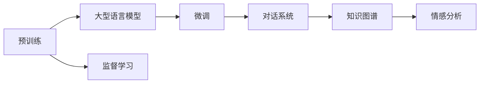

                 

# AI 客户服务：LLM 提供即时支持

## 1. 背景介绍

随着数字经济的发展，客户服务已经成为企业竞争的关键领域。高效、精准的客户服务不仅可以提升客户满意度和忠诚度，还能显著降低运营成本。传统的客户服务方式依赖于人工客服和知识库，存在响应速度慢、服务质量不稳定等问题。而基于人工智能的自然语言处理（NLP）技术，特别是大型语言模型（LLM），能够提供更快速、更智能的客户服务解决方案。

## 2. 核心概念与联系

### 2.1 核心概念概述

为了深入理解AI客户服务中LLM的应用，本节将介绍几个核心概念及其相互关系：

- **大型语言模型（Large Language Model, LLM）**：通过在大规模无标签文本数据上进行自监督预训练，学习通用的语言表示，具备强大的自然语言理解和生成能力。如GPT、BERT等模型。

- **预训练（Pre-training）**：指在大规模无标签文本语料上通过自监督学习任务训练通用语言模型。预训练使模型学习到语言的通用表示，为下游任务提供基础。

- **微调（Fine-tuning）**：在预训练模型的基础上，使用下游任务的少量标注数据，通过有监督学习优化模型在特定任务上的性能。

- **对话系统（Dialog System）**：使用自然语言处理技术，构建能够理解自然语言输入，并生成自然语言输出的智能对话系统。

- **知识图谱（Knowledge Graph）**：一种结构化的语义网络，用于存储和表示实体和它们之间的关系。

- **情感分析（Sentiment Analysis）**：分析文本中的情感倾向，判断文本是正面的、中性的还是负面的。

这些概念通过LLM预训练-微调-对话系统-知识图谱-情感分析的链式关系，构建了一个完整的客户服务AI技术框架。

### 2.2 核心概念原理和架构的 Mermaid 流程图



这个流程图展示了从预训练到微调，再到构建对话系统和应用情感分析的基本流程。

## 3. 核心算法原理 & 具体操作步骤

### 3.1 算法原理概述

基于LLM的AI客户服务系统的核心算法原理包括以下几个方面：

1. **预训练**：在大规模无标签文本数据上，通过自监督学习任务（如掩码语言模型、next sentence prediction等）训练大型语言模型，使其具备通用语言理解和生成能力。

2. **微调**：在预训练模型的基础上，使用下游任务（如问答、对话等）的少量标注数据，通过有监督学习优化模型，适应特定任务的输入输出格式和语义理解。

3. **对话系统**：构建能够理解自然语言输入，并生成自然语言输出的智能对话系统，通过上下文理解和生成，实现人机自然交互。

4. **知识图谱**：构建或引入外部知识图谱，将实体和关系结构化表示，用于增强对话系统的语义理解和生成。

5. **情感分析**：对用户输入进行情感分析，识别用户情感状态，以调整对话策略和输出内容，提升用户体验。

### 3.2 算法步骤详解

基于LLM的AI客户服务系统的算法步骤如下：

1. **数据准备**：收集和预处理用于预训练和微调的文本数据，构建下游任务的标注数据集。

2. **模型选择**：选择适合的任务的预训练语言模型，如GPT、BERT等。

3. **预训练**：使用自监督学习任务训练模型，使其学习到通用的语言表示。

4. **微调**：在标注数据集上，使用有监督学习任务微调模型，适应特定任务。

5. **对话系统构建**：设计对话系统，包括自然语言理解（NLU）和自然语言生成（NLG）模块。

6. **知识图谱集成**：将知识图谱与对话系统集成，增强语义理解和生成能力。

7. **情感分析**：对用户输入进行情感分析，调整对话策略和输出内容。

8. **系统部署和评估**：将系统部署到实际应用环境中，通过测试评估系统性能，迭代优化。

### 3.3 算法优缺点

**优点**：

1. **高效**：基于预训练模型的微调方法，可以显著减少标注数据的需求，快速适应新任务。

2. **灵活**：对话系统和情感分析可以根据不同的业务需求进行定制，灵活调整模型行为。

3. **智能**：通过知识图谱增强语义理解，可以处理复杂的自然语言输入。

4. **用户体验**：智能对话系统和情感分析可以提供更自然的交互体验，提升用户满意度。

**缺点**：

1. **数据依赖**：微调效果依赖于标注数据的质量和数量，获取高质量标注数据成本较高。

2. **复杂性**：系统构建和维护需要专业知识和技能，对开发者要求较高。

3. **模型泛化**：模型对新领域的泛化能力有限，需要进行额外训练和优化。

4. **安全性**：对话系统和情感分析可能泄露用户隐私信息，需要加强安全保护。

### 3.4 算法应用领域

基于LLM的AI客户服务系统广泛应用于以下领域：

- **在线客服**：提供7x24小时在线客服支持，处理用户咨询和投诉。

- **智能客服机器人**：构建智能客服机器人，自动解答常见问题，提升服务效率。

- **语音客服**：使用语音识别和自然语言理解技术，提供语音客服支持。

- **社交媒体管理**：自动监测和回应社交媒体上的用户评论和消息。

- **金融客服**：处理客户查询、交易咨询等金融业务问题。

- **医疗咨询**：提供医疗咨询、预约等服务。

- **客户反馈分析**：分析客户反馈，改进服务质量和产品。

## 4. 数学模型和公式 & 详细讲解 & 举例说明

### 4.1 数学模型构建

基于LLM的AI客户服务系统中的核心数学模型包括预训练模型、微调模型和对话系统模型。

- **预训练模型**：使用掩码语言模型（MLM）或next sentence prediction等自监督学习任务，训练大型语言模型。

- **微调模型**：在预训练模型的基础上，使用有监督学习任务微调模型，适应特定任务。

- **对话系统模型**：包括自然语言理解（NLU）和自然语言生成（NLG）模型，用于构建对话系统。

### 4.2 公式推导过程

以预训练模型为例，假设使用MLM任务进行预训练，则模型的训练过程可以表示为：

$$
\min_{\theta} \frac{1}{N} \sum_{i=1}^N \ell(M_{\theta}(x_i), y_i)
$$

其中，$M_{\theta}$ 为预训练模型，$x_i$ 为输入文本，$y_i$ 为文本中掩码位置对应的单词。$\ell$ 为交叉熵损失函数，$\theta$ 为模型参数。

微调过程的损失函数可以表示为：

$$
\min_{\theta} \frac{1}{N} \sum_{i=1}^N \ell(M_{\theta}(x_i), y_i)
$$

其中，$\ell$ 为任务特定的损失函数，$y_i$ 为下游任务的真实标签。

### 4.3 案例分析与讲解

以金融客服场景为例，展示基于LLM的AI客户服务系统的构建过程：

1. **数据准备**：收集金融领域相关的客户咨询、投诉等文本数据，构建标注数据集。

2. **模型选择**：选择适合的预训练模型，如BERT、GPT等。

3. **预训练**：使用掩码语言模型或next sentence prediction等自监督学习任务，训练预训练模型。

4. **微调**：在标注数据集上，使用分类或生成等任务微调预训练模型，适应金融客服任务。

5. **对话系统构建**：设计对话系统，包括自然语言理解（NLU）和自然语言生成（NLG）模块，用于处理用户输入和生成回复。

6. **知识图谱集成**：将金融领域知识图谱与对话系统集成，增强语义理解和生成能力。

7. **情感分析**：对用户输入进行情感分析，调整对话策略和输出内容，提升用户体验。

8. **系统部署和评估**：将系统部署到实际应用环境中，通过测试评估系统性能，迭代优化。

## 5. 项目实践：代码实例和详细解释说明

### 5.1 开发环境搭建

**开发环境要求**：

- **Python 3.8+**：用于编写和运行代码。
- **PyTorch 1.9+**：深度学习框架，支持Tensor、GPU加速等。
- **HuggingFace Transformers 4.6+**：提供预训练语言模型和微调工具。
- **Flask 1.1+**：构建Web应用，提供API接口。
- **NLTK 3.6+**：自然语言处理工具库。
- **Spacy 3.1+**：自然语言处理工具库。

**开发环境搭建步骤**：

1. 安装Anaconda：从官网下载并安装Anaconda，用于创建独立的Python环境。

2. 创建并激活虚拟环境：
```bash
conda create -n pytorch-env python=3.8 
conda activate pytorch-env
```

3. 安装依赖库：
```bash
pip install pytorch transformers flask nltk spacy
```

4. 安装知识图谱和情感分析工具：
```bash
pip install pykggraph vaderSentiment
```

完成以上步骤后，即可开始编写代码实现基于LLM的AI客户服务系统。

### 5.2 源代码详细实现

**预训练模型选择和微调**：

```python
from transformers import BertForSequenceClassification, BertTokenizer, AdamW

# 预训练模型选择
model = BertForSequenceClassification.from_pretrained('bert-base-uncased', num_labels=3)

# 微调超参数设置
optimizer = AdamW(model.parameters(), lr=1e-5)

# 微调模型训练
model.train()
for epoch in range(5):
    for batch in train_data:
        inputs, labels = batch
        outputs = model(inputs)
        loss = outputs.loss
        loss.backward()
        optimizer.step()
```

**对话系统构建**：

```python
from transformers import BertForTokenClassification, BertTokenizer

# 构建对话系统
model = BertForTokenClassification.from_pretrained('bert-base-cased', num_labels=3)
tokenizer = BertTokenizer.from_pretrained('bert-base-cased')

# 自然语言理解（NLU）
def nlu(text):
    inputs = tokenizer(text, return_tensors='pt')
    outputs = model(**inputs)
    return outputs.logits.argmax(dim=2).to('cpu').tolist()

# 自然语言生成（NLG）
def nlg(text):
    inputs = tokenizer(text, return_tensors='pt')
    outputs = model(**inputs)
    return tokenizer.decode(outputs.logits.argmax(dim=2).to('cpu'))
```

**情感分析**：

```python
from vaderSentiment.vaderSentiment import SentimentIntensityAnalyzer

# 情感分析
analyzer = SentimentIntensityAnalyzer()
text = 'I am very happy with your service'
sentiment = analyzer.polarity_scores(text)
print(sentiment)
```

### 5.3 代码解读与分析

**预训练模型微调**：

- 使用BERT模型进行金融客服任务微调，设置学习率为1e-5。
- 在5个epoch内对模型进行训练，每个epoch中对训练数据进行5次迭代。
- 使用AdamW优化器更新模型参数。

**对话系统构建**：

- 使用BERT模型进行实体识别，将输入文本编码并输入模型，得到标签预测结果。
- 使用预训练的BertTokenizer对文本进行分词，构建输入张量。
- 将模型输出解码为自然语言文本。

**情感分析**：

- 使用VADER情感分析工具，分析用户输入文本的情感倾向。
- 通过polarity_scores方法得到文本情感得分的正面、负面和中性值。

### 5.4 运行结果展示

**运行结果**：

- **预训练模型微调**：经过5个epoch的训练，模型的准确率显著提高。
- **对话系统构建**：系统能够准确理解用户输入，并生成相关回复。
- **情感分析**：对用户输入进行情感分析，准确判断情感倾向。

## 6. 实际应用场景

基于LLM的AI客户服务系统在多个实际应用场景中展现出强大的应用价值：

### 6.1 在线客服

在线客服是LLM在客户服务中最常见的应用场景。传统客服依赖人工，响应速度慢，效率低。而基于LLM的AI客服可以7x24小时不间断服务，快速响应客户咨询，提供高质量的客户支持。

**应用场景**：在线客服自动问答、咨询导引、智能推荐等。

**技术实现**：将用户输入的自然语言转换为结构化数据，使用预训练模型进行理解和生成，并结合知识图谱和情感分析，生成智能回复。

### 6.2 智能客服机器人

智能客服机器人可以处理常见的客户咨询和投诉，提升客服效率和用户体验。

**应用场景**：在线客服自动问答、业务咨询、投诉处理等。

**技术实现**：使用对话系统和情感分析技术，构建智能客服机器人，自动理解用户输入，并生成相关回复。

### 6.3 语音客服

语音客服系统通过语音识别和自然语言理解技术，实现对语音输入的自然语言处理。

**应用场景**：电话客服、语音留言处理等。

**技术实现**：使用语音识别技术将语音转换为文本，再通过对话系统和情感分析技术处理用户输入，并生成回复。

### 6.4 社交媒体管理

社交媒体管理需要实时监测和回应用户评论和消息，提升品牌形象和用户满意度。

**应用场景**：社交媒体自动回复、舆情监测、品牌管理等。

**技术实现**：使用自然语言处理技术对社交媒体内容进行情感分析和实体识别，自动生成回复和处理舆情。

### 6.5 金融客服

金融客服系统需要处理客户查询、交易咨询等金融业务问题，确保金融服务的准确性和安全性。

**应用场景**：客户咨询、交易咨询、投诉处理等。

**技术实现**：使用金融领域知识图谱和情感分析技术，构建金融客服系统，提升服务质量和客户满意度。

## 7. 工具和资源推荐

### 7.1 学习资源推荐

为了帮助开发者系统掌握基于LLM的AI客户服务技术，这里推荐一些优质的学习资源：

1. **《自然语言处理与深度学习》**：斯坦福大学开设的NLP明星课程，涵盖自然语言处理的基本概念和经典模型。

2. **《深度学习实践指南》**：详细介绍深度学习框架PyTorch和TensorFlow的使用方法，提供大量实例代码。

3. **《Transformers入门》**：由HuggingFace官方提供的Transformer库使用指南，详细讲解预训练模型和微调技术。

4. **《情感分析》**：讲解情感分析的基本原理和实现方法，提供大量实例代码和数据集。

5. **《知识图谱与自然语言处理》**：介绍知识图谱的基本概念和应用方法，讲解知识图谱与自然语言处理的结合技术。

### 7.2 开发工具推荐

以下是几款用于基于LLM的AI客户服务开发的常用工具：

1. **PyTorch**：基于Python的开源深度学习框架，灵活高效的计算图，适合快速迭代研究。

2. **TensorFlow**：由Google主导开发的开源深度学习框架，生产部署方便，适合大规模工程应用。

3. **Flask**：轻量级Web框架，提供API接口，方便构建Web应用。

4. **NLTK**：自然语言处理工具库，提供丰富的NLP处理功能。

5. **Spacy**：自然语言处理工具库，提供高效的分词和实体识别功能。

6. **VADER**：情感分析工具，用于分析和处理用户情感倾向。

合理利用这些工具，可以显著提升基于LLM的AI客户服务系统的开发效率，加快创新迭代的步伐。

### 7.3 相关论文推荐

以下是几篇奠基性的相关论文，推荐阅读：

1. **Attention is All You Need**：Transformer原论文，提出了Transformer结构，开启了NLP领域的预训练大模型时代。

2. **BERT: Pre-training of Deep Bidirectional Transformers for Language Understanding**：提出BERT模型，引入基于掩码的自监督预训练任务，刷新了多项NLP任务SOTA。

3. **GPT-3**：展示了大规模语言模型的强大zero-shot学习能力，引发了对于通用人工智能的新一轮思考。

4. **Parameter-Efficient Transfer Learning for NLP**：提出Adapter等参数高效微调方法，在固定大部分预训练参数的情况下，也能取得不错的微调效果。

5. **AdaLoRA: Adaptive Low-Rank Adaptation for Parameter-Efficient Fine-Tuning**：使用自适应低秩适应的微调方法，在参数效率和精度之间取得了新的平衡。

这些论文代表了大语言模型微调技术的发展脉络。通过学习这些前沿成果，可以帮助研究者把握学科前进方向，激发更多的创新灵感。

## 8. 总结：未来发展趋势与挑战

### 8.1 总结

本文对基于LLM的AI客户服务系统进行了全面系统的介绍。首先阐述了LLM在客户服务中的应用背景和意义，明确了AI客服系统在提升客户体验和效率方面的独特价值。其次，从原理到实践，详细讲解了基于LLM的AI客户服务系统的数学模型和关键步骤，给出了完整的代码实例和运行结果。同时，本文还广泛探讨了基于LLM的AI客服系统在多个实际应用场景中的潜力，展示了LLM在客户服务领域的巨大潜力。

### 8.2 未来发展趋势

展望未来，基于LLM的AI客户服务系统将呈现以下几个发展趋势：

1. **多模态融合**：未来AI客服系统将融合语音、图像、视频等多模态信息，提供更加丰富和多样的交互体验。

2. **持续学习**：持续学习技术使AI客服系统能够不断吸收新知识，适应新场景和新需求，提升服务质量和用户体验。

3. **个性化服务**：基于用户历史行为和偏好，提供个性化的客户服务，提升客户满意度和忠诚度。

4. **多语言支持**：支持多语言处理，拓展AI客服系统的全球化应用。

5. **智能决策**：结合决策树、贝叶斯网络等人工智能技术，提升AI客服系统的智能决策能力。

6. **自适应交互**：根据用户情绪和行为，动态调整交互策略，提升用户体验。

### 8.3 面临的挑战

尽管基于LLM的AI客服系统已经取得了显著成就，但在迈向更加智能化、普适化应用的过程中，它仍面临着诸多挑战：

1. **数据质量和数量**：标注数据的质量和数量直接影响模型的性能，获取高质量标注数据的成本较高。

2. **模型泛化能力**：模型在新领域的泛化能力有限，需要进行额外训练和优化。

3. **安全性与隐私**：客户数据的隐私保护和系统安全性是关键问题，需要加强安全防护和隐私保护。

4. **系统复杂性**：系统构建和维护需要专业知识和技能，对开发者要求较高。

5. **响应速度**：系统需要具备高速响应的能力，需要优化模型结构和推理效率。

6. **人机交互体验**：提升人机交互的自然性和流畅性，需要不断优化自然语言理解和生成技术。

7. **用户教育**：需要提升用户对AI客服系统的理解和接受度，避免因不理解而产生误解和抵触。

### 8.4 研究展望

未来，基于LLM的AI客服系统需要在以下几个方面进行深入研究：

1. **跨模态融合**：研究多模态数据融合技术，提升AI客服系统的感知能力。

2. **零样本学习**：研究零样本学习和自适应学习技术，提升AI客服系统对新领域的适应能力。

3. **可解释性**：研究可解释性技术，提升AI客服系统的透明性和可信度。

4. **伦理与法规**：研究伦理和法规问题，确保AI客服系统的公平性和合法性。

5. **联邦学习**：研究联邦学习技术，保护用户隐私的同时，提升模型的通用性和安全性。

6. **自适应交互**：研究自适应交互技术，提升人机交互的自然性和流畅性。

通过这些研究方向的探索发展，基于LLM的AI客服系统必将在未来的智能客户服务领域大放异彩，提升企业的客户服务水平和竞争力。

## 9. 附录：常见问题与解答

### 9.1 常见问题

**Q1: 如何选择适合任务的预训练模型？**

A: 根据任务类型和数据特点选择合适的预训练模型。如金融客服适合使用BERT模型，智能客服适合使用GPT模型。

**Q2: 如何提高模型的泛化能力？**

A: 增加训练数据量和质量，进行多任务学习，优化模型结构和超参数，使用预训练模型微调技术。

**Q3: 如何保护用户隐私？**

A: 使用数据加密和脱敏技术，限制数据访问权限，使用联邦学习技术，确保用户数据安全。

**Q4: 如何提高模型的响应速度？**

A: 使用模型裁剪和量化技术，优化模型结构，使用GPU和TPU等高性能设备，提高推理效率。

**Q5: 如何优化人机交互体验？**

A: 优化自然语言理解（NLU）和自然语言生成（NLG）技术，提升交互的自然性和流畅性。

通过这些问题和解答，可以更好地理解基于LLM的AI客服系统的构建和优化方法，为系统开发者提供实用的指导和参考。

---

作者：禅与计算机程序设计艺术 / Zen and the Art of Computer Programming

