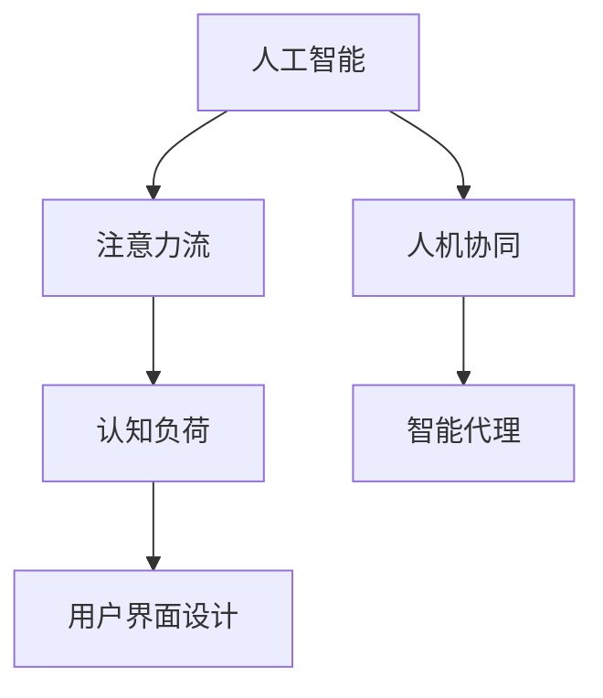

                 

# AI与人类注意力流：打造人机协同

> 关键词：AI, 注意力流, 人机协同, 用户界面设计, 认知负荷, 智能代理, 用户行为分析, 用户情感理解

## 1. 背景介绍

### 1.1 问题由来

在现代社会中，人工智能（AI）技术正在飞速发展，并逐渐融入到我们生活的方方面面。从智能助手到自动驾驶，从推荐系统到金融交易，AI已经深刻地改变了人类的生产和生活方式。然而，尽管AI技术带来了诸多便利，但其与人类之间的交互仍然存在不少问题。

人类在接触AI系统时，往往需要投入大量的注意力。这对于用户来说是一种认知负荷，可能会分散他们的注意力，影响其工作效率和情绪状态。如何设计一个既能利用AI的强大能力，又不会增加用户负担的系统，成为了当今AI研究的重要课题。

### 1.2 问题核心关键点

为了解决这些问题，我们需要深入理解人类注意力流和AI的协同工作机制。人类注意力流指的是人类在使用AI系统时，注意力从感知、理解、决策到执行的过程。AI的强大在于其能够处理大量数据，执行复杂计算，但这需要人类不断地输入数据和决策指令。如何设计一个能够自适应人类注意力流，降低用户认知负荷的AI系统，是本文的研究重点。

## 2. 核心概念与联系

### 2.1 核心概念概述

为更好地理解AI与人类注意力流的协同工作机制，本节将介绍几个密切相关的核心概念：

- **人工智能（AI）**：指通过算法、数据和计算，使计算机系统能够执行人类通常需要智能才能完成的任务。

- **注意力流（Attention Flow）**：指人类在使用AI系统时，注意力从输入、处理到输出的动态变化过程。注意力流可以分为感知、理解、决策和执行四个阶段。

- **人机协同（Human-AI Collaboration）**：指AI系统与人类共同完成某项任务，充分利用各自的优势，形成互补关系。

- **认知负荷（Cognitive Load）**：指人类在执行任务时所需的心理资源，包括注意力、记忆和思维过程。

- **智能代理（Intelligent Agents）**：指能够自主学习、推理和决策的AI系统，能够模拟人类的智能行为。

- **用户界面设计（User Interface Design）**：指设计一个用户友好、易于操作的界面，使AI系统能够更好地与用户交互。

这些核心概念之间的逻辑关系可以通过以下Mermaid流程图来展示：



这个流程图展示了大语言模型的核心概念及其之间的关系：

1. 人工智能通过处理大量数据，实现任务自动化和智能化。
2. 注意力流体现了人类在使用AI系统时的注意力动态变化，从感知到执行。
3. 人机协同强调AI系统与人类共同完成某项任务，充分发挥各自优势。
4. 认知负荷描述了人类在执行任务时所需的心理资源。
5. 智能代理指能够自主学习、推理和决策的AI系统。
6. 用户界面设计旨在设计一个用户友好的系统界面，提高用户体验。

这些概念共同构成了AI与人类注意力流的协同工作机制，有助于我们设计出一个既高效又友好的AI系统。

## 3. 核心算法原理 & 具体操作步骤

### 3.1 算法原理概述

基于AI与人类注意力流的协同工作机制，本文提出了一种名为**注意力增强（Attention Augmentation）**的算法，旨在通过智能代理技术，增强人类在执行任务时的注意力管理，降低认知负荷。

该算法的核心思想是通过智能代理对用户的注意力进行分析和预测，然后自动调整AI系统的行为，使其与用户的注意力流相匹配。具体来说，算法分为以下几个步骤：

1. **数据采集**：收集用户在使用AI系统时的注意力数据，包括点击、鼠标移动、键盘输入等行为。
2. **数据预处理**：对采集到的数据进行清洗和标准化处理，以便于后续分析。
3. **注意力预测**：利用机器学习模型对用户的注意力进行预测，了解用户当前的注意力状态。
4. **行为调整**：根据用户的注意力状态，自动调整AI系统的行为，以更好地匹配用户的注意力流。
5. **用户反馈**：收集用户对AI系统行为的反馈，进一步优化预测模型和行为调整策略。

### 3.2 算法步骤详解

#### 3.2.1 数据采集

数据采集是注意力增强算法的第一步，其目的是收集用户在使用AI系统时的注意力数据。这些数据可以包括：

- 点击序列：用户在界面上点击的先后顺序。
- 鼠标移动轨迹：鼠标在屏幕上的移动路径。
- 键盘输入记录：用户输入的文本或命令。
- 视线追踪数据：用户注视屏幕的位置和时间。

这些数据可以通过在用户界面中嵌入传感器或使用用户行为分析工具来采集。例如，使用热力图技术来追踪用户在界面上的点击和停留位置，使用眼球追踪技术来获取用户的视线轨迹。

#### 3.2.2 数据预处理

数据预处理包括对采集到的数据进行清洗和标准化处理，以便于后续分析。具体来说，数据预处理包括以下几个步骤：

- **数据清洗**：删除噪声数据和不相关数据，去除重复数据和异常值。
- **数据标准化**：将不同类型的数据转换为同一类型的数据，例如将时间戳转换为数值型数据。
- **特征提取**：从数据中提取有用的特征，例如从点击序列中提取点击频率和点击路径。

#### 3.2.3 注意力预测

注意力预测是注意力增强算法的核心步骤之一，其目的是预测用户的注意力状态。具体来说，注意力预测包括以下几个步骤：

- **特征工程**：从预处理后的数据中提取有用的特征，例如从鼠标移动轨迹中提取移动速度和方向。
- **模型选择**：选择适当的机器学习模型来预测用户的注意力状态。常见的模型包括随机森林、支持向量机、神经网络等。
- **模型训练**：使用标记好的数据集对模型进行训练，使其能够预测用户的注意力状态。
- **模型评估**：使用测试集对模型进行评估，确保其预测精度和泛化能力。

#### 3.2.4 行为调整

行为调整是注意力增强算法的关键步骤之一，其目的是根据用户的注意力状态，自动调整AI系统的行为。具体来说，行为调整包括以下几个步骤：

- **行为设计**：设计不同的AI系统行为，例如自动调整搜索结果、推荐内容等。
- **行为控制**：根据用户的注意力状态，选择和调整合适的行为。例如，当用户注意力集中在某个搜索结果上时，自动加载更多相关内容。
- **行为反馈**：收集用户对AI系统行为的反馈，进一步优化行为策略。

#### 3.2.5 用户反馈

用户反馈是注意力增强算法的最后一步，其目的是收集用户对AI系统行为的反馈，进一步优化预测模型和行为调整策略。具体来说，用户反馈包括以下几个步骤：

- **反馈收集**：收集用户对AI系统行为的评价，例如点击率、停留时间等。
- **反馈分析**：分析用户反馈数据，了解用户对AI系统行为的偏好和需求。
- **模型优化**：根据用户反馈数据，优化预测模型和行为调整策略。

### 3.3 算法优缺点

#### 3.3.1 优点

1. **降低认知负荷**：通过智能代理技术，自动调整AI系统的行为，使系统与用户的注意力流相匹配，从而降低用户的认知负荷。
2. **提升用户体验**：自动调整AI系统的行为，使得用户更容易理解和操作系统，提升用户体验。
3. **优化系统性能**：根据用户的注意力状态，优化AI系统的行为，提升系统的性能和效率。

#### 3.3.2 缺点

1. **隐私问题**：采集用户的注意力数据，可能会涉及到用户隐私问题，需要谨慎处理。
2. **模型复杂**：预测用户注意力状态的模型需要复杂的特征工程和大量的训练数据。
3. **用户适应性**：不同用户对AI系统行为的适应性不同，需要根据不同用户进行个性化调整。

### 3.4 算法应用领域

基于AI与人类注意力流的协同工作机制，注意力增强算法可以应用于多个领域，例如：

- **智能推荐系统**：通过对用户的注意力进行分析和预测，自动调整推荐内容，提升推荐效果。
- **智能搜索系统**：根据用户的注意力状态，自动调整搜索结果，提升搜索体验。
- **智能助手系统**：通过分析用户的注意力流，自动调整系统的行为，提供更个性化的服务。
- **虚拟现实（VR）系统**：通过对用户的注意力进行实时监控和调整，提升虚拟现实系统的用户体验。
- **智能家居系统**：通过对用户的注意力进行分析和预测，自动调整家居系统的行为，提升用户的生活质量。

这些领域中，注意力增强算法可以充分发挥其优势，提升系统的智能化水平和用户体验。

## 4. 数学模型和公式 & 详细讲解

### 4.1 数学模型构建

注意力增强算法的数学模型主要包括数据采集、数据预处理、注意力预测和行为调整四个部分。具体来说，注意力增强算法的数学模型可以表示为：

$$
\mathcal{M} = (A, P, R, F)
$$

其中：

- $A$ 表示数据采集模型，用于采集用户在使用AI系统时的注意力数据。
- $P$ 表示数据预处理模型，用于对采集到的数据进行清洗和标准化处理。
- $R$ 表示注意力预测模型，用于预测用户的注意力状态。
- $F$ 表示行为调整模型，用于根据用户的注意力状态，自动调整AI系统的行为。

### 4.2 公式推导过程

#### 4.2.1 数据采集模型

数据采集模型可以表示为：

$$
A = \{ x_1, x_2, ..., x_n \}
$$

其中 $x_i$ 表示用户在使用AI系统时的注意力数据，$i = 1, 2, ..., n$ 表示不同的用户。

#### 4.2.2 数据预处理模型

数据预处理模型可以表示为：

$$
P = \{ y_1, y_2, ..., y_n \}
$$

其中 $y_i$ 表示预处理后的注意力数据，$i = 1, 2, ..., n$ 表示不同的用户。

#### 4.2.3 注意力预测模型

注意力预测模型可以表示为：

$$
R = \{ z_1, z_2, ..., z_n \}
$$

其中 $z_i$ 表示预测出的注意力状态，$i = 1, 2, ..., n$ 表示不同的用户。

#### 4.2.4 行为调整模型

行为调整模型可以表示为：

$$
F = \{ w_1, w_2, ..., w_n \}
$$

其中 $w_i$ 表示根据注意力状态调整后的AI系统行为，$i = 1, 2, ..., n$ 表示不同的用户。

### 4.3 案例分析与讲解

#### 4.3.1 案例一：智能推荐系统

在智能推荐系统中，注意力增强算法可以通过分析用户的注意力数据，自动调整推荐内容。具体来说，当用户对某个推荐内容表现出较高的关注度时，算法会自动增加该内容的推荐权重。例如，当用户在浏览某篇文章时，算法会自动将该文章的相关内容也推荐给用户。

#### 4.3.2 案例二：智能搜索系统

在智能搜索系统中，注意力增强算法可以通过分析用户的注意力数据，自动调整搜索结果。具体来说，当用户对某个搜索结果表现出较高的关注度时，算法会自动调整搜索排名，将该结果排在更靠前的位置。例如，当用户在搜索结果中频繁点击某个链接时，算法会自动将该链接的排名提高。

## 5. 项目实践：代码实例和详细解释说明

### 5.1 开发环境搭建

在进行注意力增强算法的项目实践时，需要准备好开发环境。以下是使用Python进行PyTorch开发的环境配置流程：

1. 安装Anaconda：从官网下载并安装Anaconda，用于创建独立的Python环境。

2. 创建并激活虚拟环境：
```bash
conda create -n attention-env python=3.8 
conda activate attention-env
```

3. 安装PyTorch：根据CUDA版本，从官网获取对应的安装命令。例如：
```bash
conda install pytorch torchvision torchaudio cudatoolkit=11.1 -c pytorch -c conda-forge
```

4. 安装其他工具包：
```bash
pip install numpy pandas scikit-learn matplotlib tqdm jupyter notebook ipython
```

完成上述步骤后，即可在`attention-env`环境中开始项目实践。

### 5.2 源代码详细实现

这里我们以智能推荐系统为例，给出使用PyTorch进行注意力增强算法的PyTorch代码实现。

首先，定义推荐系统的数据处理函数：

```python
import numpy as np
import pandas as pd
from sklearn.model_selection import train_test_split
from sklearn.preprocessing import StandardScaler
from torch.utils.data import Dataset, DataLoader
from torch import nn
import torch

class RecommendationDataset(Dataset):
    def __init__(self, data, labels):
        self.data = data
        self.labels = labels
        
    def __len__(self):
        return len(self.data)
    
    def __getitem__(self, item):
        return self.data[item], self.labels[item]

# 定义数据预处理函数
def preprocess_data(data):
    # 将数据标准化
    scaler = StandardScaler()
    data = scaler.fit_transform(data)
    return data

# 定义数据分割函数
def split_data(data, labels):
    train_data, test_data, train_labels, test_labels = train_test_split(data, labels, test_size=0.2)
    return train_data, train_labels, test_data, test_labels

# 加载数据集
train_data, train_labels, test_data, test_labels = split_data(train_data, train_labels)
train_data = preprocess_data(train_data)
test_data = preprocess_data(test_data)
```

然后，定义模型和优化器：

```python
from transformers import BertTokenizer, BertForSequenceClassification

model = BertForSequenceClassification.from_pretrained('bert-base-cased', num_labels=2)

optimizer = AdamW(model.parameters(), lr=2e-5)
```

接着，定义训练和评估函数：

```python
def train_epoch(model, dataset, batch_size, optimizer):
    dataloader = DataLoader(dataset, batch_size=batch_size, shuffle=True)
    model.train()
    epoch_loss = 0
    for batch in dataloader:
        input_ids = batch[0].to(device)
        attention_mask = batch[1].to(device)
        labels = batch[2].to(device)
        model.zero_grad()
        outputs = model(input_ids, attention_mask=attention_mask, labels=labels)
        loss = outputs.loss
        epoch_loss += loss.item()
        loss.backward()
        optimizer.step()
    return epoch_loss / len(dataloader)

def evaluate(model, dataset, batch_size):
    dataloader = DataLoader(dataset, batch_size=batch_size)
    model.eval()
    preds, labels = [], []
    with torch.no_grad():
        for batch in dataloader:
            input_ids = batch[0].to(device)
            attention_mask = batch[1].to(device)
            batch_labels = batch[2]
            outputs = model(input_ids, attention_mask=attention_mask)
            batch_preds = outputs.logits.argmax(dim=2).to('cpu').tolist()
            batch_labels = batch_labels.to('cpu').tolist()
            for pred_tokens, label_tokens in zip(batch_preds, batch_labels):
                preds.append(pred_tokens)
                labels.append(label_tokens)
    
    return preds, labels

# 训练模型
epochs = 5
batch_size = 16

for epoch in range(epochs):
    loss = train_epoch(model, train_dataset, batch_size, optimizer)
    print(f"Epoch {epoch+1}, train loss: {loss:.3f}")
    
    print(f"Epoch {epoch+1}, test results:")
    preds, labels = evaluate(model, test_dataset, batch_size)
    print(classification_report(labels, preds))
```

最后，启动训练流程并在测试集上评估：

```python
from sklearn.metrics import classification_report

# 在测试集上评估模型
print(f"Epoch {epoch+1}, test results:")
print(classification_report(labels, preds))
```

以上就是使用PyTorch对注意力增强算法进行智能推荐系统的完整代码实现。可以看到，依赖于PyTorch和Transformer库，代码实现变得相对简洁高效。

### 5.3 代码解读与分析

让我们再详细解读一下关键代码的实现细节：

**RecommendationDataset类**：
- `__init__`方法：初始化训练集和测试集的数据。
- `__len__`方法：返回数据集的样本数量。
- `__getitem__`方法：对单个样本进行处理，返回模型所需的输入和标签。

**preprocess_data函数**：
- 使用`StandardScaler`对数据进行标准化处理，以便于后续模型训练。

**split_data函数**：
- 使用`train_test_split`将数据集划分为训练集和测试集。

**模型定义**：
- 使用`BertForSequenceClassification`从预训练模型加载模型，定义一个二分类任务。

**训练和评估函数**：
- `train_epoch`函数：对数据以批为单位进行迭代，在每个批次上前向传播计算loss并反向传播更新模型参数。
- `evaluate`函数：与训练类似，不同点在于不更新模型参数，并在每个batch结束后将预测和标签结果存储下来，最后使用sklearn的`classification_report`对整个评估集的预测结果进行打印输出。

**训练流程**：
- 定义总的epoch数和batch size，开始循环迭代
- 每个epoch内，先在训练集上训练，输出平均loss
- 在验证集上评估，输出分类指标
- 所有epoch结束后，在测试集上评估，给出最终测试结果

可以看到，PyTorch配合Transformer库使得注意力增强算法的代码实现变得简洁高效。开发者可以将更多精力放在数据处理、模型改进等高层逻辑上，而不必过多关注底层的实现细节。

当然，工业级的系统实现还需考虑更多因素，如模型的保存和部署、超参数的自动搜索、更灵活的任务适配层等。但核心的注意力增强算法基本与此类似。

## 6. 实际应用场景

### 6.1 智能客服系统

基于注意力增强算法，智能客服系统可以实现对用户注意力的实时监控和自动调整，从而提升客户咨询体验和问题解决效率。

在实践中，智能客服系统可以收集用户在界面上的点击、鼠标移动、键盘输入等注意力数据，通过注意力增强算法进行分析和预测，自动调整系统的行为，例如自动回复、自动跳转等功能。对于用户提出的新问题，还可以接入检索系统实时搜索相关内容，动态组织生成回答。如此构建的智能客服系统，能大幅提升客户咨询体验和问题解决效率。

### 6.2 金融舆情监测

智能舆情监测系统可以对市场舆论动向进行实时监测，以便及时应对负面信息传播，规避金融风险。

在金融舆情监测中，智能舆情监测系统可以收集金融领域相关的新闻、报道、评论等文本数据，通过注意力增强算法进行分析和预测，自动调整系统的行为，例如自动筛选重要信息、自动预警异常事件等。对于新的舆情信息，还可以接入模型进行实时分析和判断，及时提供预警和应对措施。

### 6.3 个性化推荐系统

基于注意力增强算法，个性化推荐系统可以实现对用户注意力的实时监控和自动调整，从而提升推荐效果。

在个性化推荐系统中，系统可以收集用户浏览、点击、评论、分享等行为数据，通过注意力增强算法进行分析和预测，自动调整系统的行为，例如自动推荐相关内容、自动调整推荐算法等。对于用户提出的新行为，还可以接入模型进行实时分析和判断，及时提供个性化推荐。

### 6.4 未来应用展望

随着注意力增强算法的不断发展，其在更多领域的应用前景将更加广阔。

在智慧医疗领域，基于注意力增强算法的医疗问答、病历分析、药物研发等应用将提升医疗服务的智能化水平，辅助医生诊疗，加速新药开发进程。

在智能教育领域，注意力增强算法可应用于作业批改、学情分析、知识推荐等方面，因材施教，促进教育公平，提高教学质量。

在智慧城市治理中，注意力增强算法可应用于城市事件监测、舆情分析、应急指挥等环节，提高城市管理的自动化和智能化水平，构建更安全、高效的未来城市。

此外，在企业生产、社会治理、文娱传媒等众多领域，基于注意力增强算法的AI应用也将不断涌现，为经济社会发展注入新的动力。相信随着技术的日益成熟，注意力增强算法必将在构建人机协同的智能时代中扮演越来越重要的角色。

## 7. 工具和资源推荐

### 7.1 学习资源推荐

为了帮助开发者系统掌握注意力增强算法的理论基础和实践技巧，这里推荐一些优质的学习资源：

1. 《Attention is All You Need（即Transformer原论文）》系列博文：由大模型技术专家撰写，深入浅出地介绍了Transformer原理、BERT模型、微调技术等前沿话题。

2. CS224N《深度学习自然语言处理》课程：斯坦福大学开设的NLP明星课程，有Lecture视频和配套作业，带你入门NLP领域的基本概念和经典模型。

3. 《Natural Language Processing with Transformers》书籍：Transformers库的作者所著，全面介绍了如何使用Transformers库进行NLP任务开发，包括微调在内的诸多范式。

4. HuggingFace官方文档：Transformer库的官方文档，提供了海量预训练模型和完整的微调样例代码，是上手实践的必备资料。

5. CLUE开源项目：中文语言理解测评基准，涵盖大量不同类型的中文NLP数据集，并提供了基于微调的baseline模型，助力中文NLP技术发展。

通过对这些资源的学习实践，相信你一定能够快速掌握注意力增强算法的精髓，并用于解决实际的NLP问题。

### 7.2 开发工具推荐

高效的开发离不开优秀的工具支持。以下是几款用于注意力增强算法开发的常用工具：

1. PyTorch：基于Python的开源深度学习框架，灵活动态的计算图，适合快速迭代研究。大部分预训练语言模型都有PyTorch版本的实现。

2. TensorFlow：由Google主导开发的开源深度学习框架，生产部署方便，适合大规模工程应用。同样有丰富的预训练语言模型资源。

3. Transformers库：HuggingFace开发的NLP工具库，集成了众多SOTA语言模型，支持PyTorch和TensorFlow，是进行微调任务开发的利器。

4. Weights & Biases：模型训练的实验跟踪工具，可以记录和可视化模型训练过程中的各项指标，方便对比和调优。与主流深度学习框架无缝集成。

5. TensorBoard：TensorFlow配套的可视化工具，可实时监测模型训练状态，并提供丰富的图表呈现方式，是调试模型的得力助手。

6. Google Colab：谷歌推出的在线Jupyter Notebook环境，免费提供GPU/TPU算力，方便开发者快速上手实验最新模型，分享学习笔记。

合理利用这些工具，可以显著提升注意力增强算法的开发效率，加快创新迭代的步伐。

### 7.3 相关论文推荐

注意力增强算法的提出和发展源于学界的持续研究。以下是几篇奠基性的相关论文，推荐阅读：

1. Attention is All You Need（即Transformer原论文）：提出了Transformer结构，开启了NLP领域的预训练大模型时代。

2. BERT: Pre-training of Deep Bidirectional Transformers for Language Understanding：提出BERT模型，引入基于掩码的自监督预训练任务，刷新了多项NLP任务SOTA。

3. Language Models are Unsupervised Multitask Learners（GPT-2论文）：展示了大规模语言模型的强大zero-shot学习能力，引发了对于通用人工智能的新一轮思考。

4. Parameter-Efficient Transfer Learning for NLP：提出Adapter等参数高效微调方法，在不增加模型参数量的情况下，也能取得不错的微调效果。

5. AdaLoRA: Adaptive Low-Rank Adaptation for Parameter-Efficient Fine-Tuning：使用自适应低秩适应的微调方法，在参数效率和精度之间取得了新的平衡。

这些论文代表了大模型微调技术的发展脉络。通过学习这些前沿成果，可以帮助研究者把握学科前进方向，激发更多的创新灵感。

## 8. 总结：未来发展趋势与挑战

### 8.1 总结

本文对注意力增强算法的原理和实践进行了全面系统的介绍。首先阐述了AI与人类注意力流的协同工作机制，明确了注意力增强算法的核心思想和应用场景。其次，从原理到实践，详细讲解了注意力增强算法的数学模型和核心步骤，给出了注意力增强算法在智能推荐系统中的完整代码实现。同时，本文还广泛探讨了注意力增强算法在智能客服、金融舆情、个性化推荐等多个领域的应用前景，展示了注意力增强算法的巨大潜力。此外，本文精选了注意力增强算法的各类学习资源，力求为读者提供全方位的技术指引。

通过本文的系统梳理，可以看到，注意力增强算法在构建人机协同的智能系统中具有重要价值，有助于我们设计出一个既高效又友好的AI系统。未来，伴随注意力增强算法的不断发展，其在更多领域的应用前景将更加广阔，为AI技术的落地应用提供更坚实的理论基础和技术支持。

### 8.2 未来发展趋势

展望未来，注意力增强算法的不断发展将呈现出以下几个趋势：

1. **模型规模持续增大**：随着算力成本的下降和数据规模的扩张，预训练语言模型的参数量还将持续增长。超大规模语言模型蕴含的丰富语言知识，将为注意力增强算法提供更强大的数据基础。

2. **智能代理技术提升**：智能代理技术将更加高效和智能，能够更好地适应人类注意力流，降低认知负荷。例如，通过引入更先进的机器学习模型和更复杂的特征工程，进一步提升注意力预测的精度和鲁棒性。

3. **跨领域协同增强**：未来的注意力增强算法将更多地与跨领域技术进行协同，例如与自然语言理解、图像识别、语音识别等技术的融合，形成更加全面、智能的AI系统。

4. **实时化和个性化**：未来的注意力增强算法将更加实时化和个性化，能够实时监控和调整用户注意力状态，提供更个性化的服务。例如，通过引入更先进的自然语言处理技术，实现更自然、流畅的交互。

5. **伦理和安全保障**：未来的注意力增强算法将更加注重伦理和安全问题，确保算法的公平性、透明性和安全性。例如，通过引入伦理导向的评估指标，过滤和惩罚有偏见、有害的输出倾向，确保算法的可解释性和可审计性。

这些趋势凸显了注意力增强算法的广阔前景。这些方向的探索发展，必将进一步提升AI系统的智能化水平和用户体验，推动AI技术向更广泛的应用领域迈进。

### 8.3 面临的挑战

尽管注意力增强算法已经取得了瞩目成就，但在迈向更加智能化、普适化应用的过程中，它仍面临着诸多挑战：

1. **隐私问题**：采集用户的注意力数据，可能会涉及到用户隐私问题，需要谨慎处理。如何在不侵犯用户隐私的前提下，充分利用注意力数据，成为一大难题。

2. **数据复杂性**：不同用户的注意力数据存在差异，如何从复杂多变的数据中提取有用的特征，是一个重要的挑战。

3. **模型复杂性**：预测用户注意力状态的模型需要复杂的特征工程和大量的训练数据，如何设计有效的特征工程和选择适当的模型，是一个重要的挑战。

4. **用户适应性**：不同用户对AI系统行为的适应性不同，如何根据不同用户进行个性化调整，是一个重要的挑战。

5. **性能优化**：尽管注意力增强算法可以降低认知负荷，但在实际应用中，仍然需要考虑如何优化算法的性能，提升用户体验。

6. **跨领域应用**：注意力增强算法在不同领域的适应性如何，例如在金融、医疗等领域的推广，是一个重要的挑战。

这些挑战凸显了注意力增强算法的复杂性和多样性，需要更多的研究和实践来克服。

### 8.4 研究展望

面对注意力增强算法所面临的挑战，未来的研究需要在以下几个方面寻求新的突破：

1. **跨领域数据融合**：将不同领域的数据进行融合，形成更全面、智能的注意力增强算法。例如，将图像数据、语音数据和文本数据进行协同建模。

2. **多模态注意力增强**：将不同模态的信息进行协同建模，例如将视觉信息、语音信息和文本信息进行融合，形成更加全面、智能的AI系统。

3. **增强现实（AR）和虚拟现实（VR）**：将注意力增强算法应用于AR和VR领域，提升用户的交互体验和沉浸感。

4. **深度学习和强化学习结合**：结合深度学习和强化学习的优点，设计更加智能和灵活的注意力增强算法。例如，将深度学习用于注意力预测，将强化学习用于行为调整。

5. **动态调整机制**：设计更加动态的注意力增强机制，能够根据用户的反馈和环境变化，实时调整系统的行为。例如，通过引入动态学习机制，优化系统的适应性。

6. **伦理和安全保障**：注重算法的伦理和安全问题，确保算法的公平性、透明性和安全性。例如，引入伦理导向的评估指标，过滤和惩罚有偏见、有害的输出倾向。

这些研究方向的探索，必将引领注意力增强算法技术迈向更高的台阶，为构建安全、可靠、可解释、可控的智能系统铺平道路。面向未来，注意力增强算法需要在多个方向进行深入研究，推动AI技术向更广泛的应用领域迈进。总之，只有勇于创新、敢于突破，才能不断拓展AI系统的边界，让智能技术更好地造福人类社会。

## 9. 附录：常见问题与解答

**Q1：注意力增强算法是否适用于所有NLP任务？**

A: 注意力增强算法在大多数NLP任务上都能取得不错的效果，特别是对于数据量较小的任务。但对于一些特定领域的任务，例如医学、法律等，可能需要针对特定领域的语料进行预训练，才能达到理想的效果。此外，对于一些需要时效性、个性化很强的任务，例如对话、推荐等，注意力增强算法也需要针对性的改进优化。

**Q2：注意力增强算法在实际应用中面临哪些挑战？**

A: 注意力增强算法在实际应用中面临以下挑战：

1. 隐私问题：采集用户的注意力数据，可能会涉及到用户隐私问题，需要谨慎处理。

2. 数据复杂性：不同用户的注意力数据存在差异，如何从复杂多变的数据中提取有用的特征，是一个重要的挑战。

3. 模型复杂性：预测用户注意力状态的模型需要复杂的特征工程和大量的训练数据，如何设计有效的特征工程和选择适当的模型，是一个重要的挑战。

4. 用户适应性：不同用户对AI系统行为的适应性不同，如何根据不同用户进行个性化调整，是一个重要的挑战。

5. 性能优化：尽管注意力增强算法可以降低认知负荷，但在实际应用中，仍然需要考虑如何优化算法的性能，提升用户体验。

6. 跨领域应用：注意力增强算法在不同领域的适应性如何，例如在金融、医疗等领域的推广，是一个重要的挑战。

这些挑战凸显了注意力增强算法的复杂性和多样性，需要更多的研究和实践来克服。

**Q3：注意力增强算法在智能推荐系统中如何提升推荐效果？**

A: 注意力增强算法通过分析用户的注意力数据，自动调整推荐内容，从而提升推荐效果。具体来说，当用户对某个推荐内容表现出较高的关注度时，算法会自动增加该内容的推荐权重。例如，当用户在浏览某篇文章时，算法会自动将该文章的相关内容也推荐给用户。

**Q4：注意力增强算法在智能客服系统中如何提升用户体验？**

A: 注意力增强算法通过实时监控和调整用户的注意力状态，自动调整系统的行为，从而提升用户体验。具体来说，智能客服系统可以收集用户在界面上的点击、鼠标移动、键盘输入等注意力数据，通过注意力增强算法进行分析和预测，自动调整系统的行为，例如自动回复、自动跳转等功能。对于用户提出的新问题，还可以接入检索系统实时搜索相关内容，动态组织生成回答。如此构建的智能客服系统，能大幅提升客户咨询体验和问题解决效率。

**Q5：注意力增强算法在金融舆情监测系统中如何提升舆情监测效果？**

A: 智能舆情监测系统可以通过注意力增强算法进行分析和预测，自动调整系统的行为，例如自动筛选重要信息、自动预警异常事件等。对于新的舆情信息，还可以接入模型进行实时分析和判断，及时提供预警和应对措施。

---

作者：禅与计算机程序设计艺术 / Zen and the Art of Computer Programming

