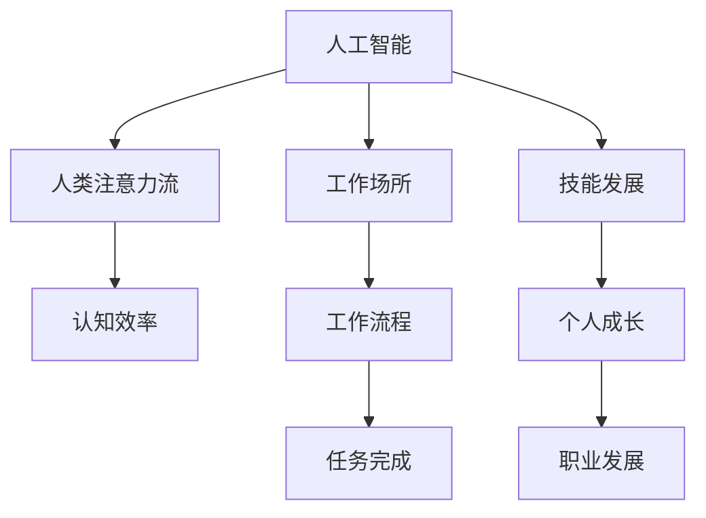

                 

# AI与人类注意力流：未来的工作场所和技能发展

> 关键词：AI,人类注意力流,工作场所,技能发展

## 1. 背景介绍

在数字化和智能化飞速发展的今天，人工智能（AI）正以前所未有的速度和深度渗透到人类生活的方方面面。无论是日常生活、工作还是生产，AI的影响力已经无处不在。然而，AI在带来便捷的同时，也引发了人类对未来工作场所和技能发展的深刻思考。

### 1.1 问题的由来
随着AI技术的不断进步，其应用场景和影响范围也在不断扩大。无论是自动化、机器人、还是大数据分析、自然语言处理等，AI技术都在逐步替代或辅助人类的工作。这种趋势不仅改变了传统的工作流程和模式，也引发了关于技能发展、就业市场、人才结构等诸多问题。

### 1.2 问题核心关键点
AI对工作场所的影响是多方面的，其中最核心的问题包括：
- AI如何重塑工作流程和产业结构？
- 人类技能应如何适应AI带来的变化？
- 未来工作场所应如何应对AI带来的挑战和机遇？
- AI如何与人类协作，共同创造更大的价值？

### 1.3 问题研究意义
研究AI对工作场所和技能发展的影响，对于理解未来的工作趋势、制定合理的人才培养策略、推动产业升级和创新具有重要意义。通过深入分析AI与人类注意力流的关系，探讨其对工作场所的影响，可以为未来的技能发展和职业规划提供参考。

## 2. 核心概念与联系

### 2.1 核心概念概述

为更好地理解AI与人类注意力流的关系，本节将介绍几个密切相关的核心概念：

- **人工智能（AI）**：一种能够模拟人类智能行为的技术，包括但不限于机器学习、深度学习、自然语言处理等。AI的核心是构建可以执行复杂任务的算法和模型。
- **人类注意力流（Human Attention Flow）**：指人类在认知过程中，注意力如何分配和转移。在信息加工、决策制定、问题解决等过程中，注意力流的动态变化直接影响着人类行为和认知效率。
- **工作场所（Workplace）**：人类工作的地方，可以是物理空间（办公室、工厂），也可以是虚拟空间（网络平台、远程工作）。工作场所是AI技术应用的主要场所之一。
- **技能发展（Skill Development）**：指个人或组织在面对新技术、新任务时，通过学习、培训等方式提升自身或员工的技能水平，以适应变化的过程。

这些核心概念之间的关系可以通过以下Mermaid流程图来展示：



这个流程图展示了几组核心概念之间的联系：

1. AI通过算法和模型，模拟人类智能行为。
2. 人类注意力流在认知和决策过程中起关键作用。
3. AI在工作场所中的广泛应用，改变了工作流程。
4. 技能发展是适应AI变化的重要途径。
5. 工作流程的优化提升了任务完成效率。
6. 个人成长和职业发展是技能发展的最终目标。

## 3. 核心算法原理 & 操作步骤
### 3.1 算法原理概述

AI与人类注意力流的关系，主要体现在AI如何通过算法和模型，引导和优化人类注意力流的分配和转移，从而提高工作场所的效率和效果。这种关系主要体现在以下几个方面：

1. **任务分配**：AI通过算法模型，识别任务的关键点和难点，自动分配人类注意力流，使其更有效地解决问题。
2. **决策支持**：AI提供的数据和分析结果，辅助人类做出更明智的决策，优化注意力流的方向。
3. **学习辅助**：AI通过学习算法，帮助人类更快地掌握新技能，提高注意力流的灵活性和适应性。

### 3.2 算法步骤详解

基于上述原理，AI与人类注意力流的融合主要包括以下几个步骤：

**Step 1: 数据收集与预处理**
- 收集人类工作过程中产生的数据，如操作记录、眼动轨迹、脑电信号等。
- 对数据进行清洗、去噪和标准化处理，以便后续分析。

**Step 2: 注意力流建模**
- 使用机器学习或深度学习模型，对人类注意力流进行建模和分析。常用的模型包括RNN、LSTM、GRU等。
- 使用多模态数据融合技术，结合视觉、听觉等多种数据源，全面刻画人类注意力流的动态变化。

**Step 3: 模型训练与优化**
- 在标注好的训练集上，使用监督学习或无监督学习方法训练注意力流模型。
- 对模型进行超参数调整和模型优化，提高模型的泛化能力和准确性。

**Step 4: 注意力流分析与指导**
- 在实际工作中，使用训练好的模型对人类注意力流进行实时分析，识别注意力集中的区域和转移的规律。
- 根据分析结果，调整工作流程和任务分配，引导人类注意力流更高效地解决问题。

**Step 5: 反馈与迭代**
- 收集工作结果和用户反馈，不断优化模型和指导策略，提高AI与人类注意力流结合的效果。

### 3.3 算法优缺点

AI与人类注意力流的融合方法具有以下优点：
1. 提高工作效率：通过智能分配和优化注意力流，提高人类在复杂任务中的处理速度和准确性。
2. 降低人为错误：AI的自动化决策减少人为失误，提高工作质量。
3. 促进技能提升：AI辅助学习新技能，加速人类认知和技能的发展。
4. 增强适应性：AI通过实时分析反馈，帮助人类更好地适应新任务和新环境。

同时，该方法也存在一些局限性：
1. 数据隐私和安全：人类注意力流数据包含敏感信息，如何保障数据隐私和安全是一大挑战。
2. 依赖高质量数据：模型训练和优化依赖高质量的标注数据，数据的准确性和完备性直接影响模型效果。
3. 算法复杂度：注意力流建模和分析需要复杂的算法和模型，对计算资源和专业知识要求较高。
4. 人与AI的协作：如何设计合理的人机交互界面，使AI与人类协作更自然、高效，还需要进一步探索。

### 3.4 算法应用领域

AI与人类注意力流的融合方法，在多个领域具有广泛的应用前景：

- **制造业**：在生产线自动化、质量控制、故障诊断等场景，AI可以实时监控工人注意力流，提高生产效率和质量。
- **医疗健康**：在手术辅助、诊断分析、康复治疗等场景，AI可以辅助医生和护士，优化注意力分配，提升医疗效果。
- **教育培训**：在课程设计、学生学习分析、个性化教学等场景，AI可以优化学生注意力流，提升学习效果和体验。
- **办公室工作**：在信息管理、知识整理、决策支持等场景，AI可以优化员工注意力流，提升工作效率和决策质量。
- **智能家居**：在智能设备控制、环境调节、安全监控等场景，AI可以优化家庭注意力流，提升生活质量和便利性。

## 4. 数学模型和公式 & 详细讲解  
### 4.1 数学模型构建

本节将使用数学语言对AI与人类注意力流的融合过程进行更加严格的刻画。

设人类在任务 $T$ 中注意力流的时间序列为 $X=\{x_1, x_2, ..., x_t\}$，其中 $x_t$ 表示在时刻 $t$ 的注意力状态，可以表示为一个向量。定义注意力模型 $M$，映射注意力状态到任务完成概率 $P(T)$。则注意力流的数学模型可以表示为：

$$
P(T|X) = M(X)
$$

其中 $P(T|X)$ 表示在给定注意力流 $X$ 的条件下，任务 $T$ 完成的概率。

### 4.2 公式推导过程

以下我们以一个简单的RNN模型为例，推导注意力流的概率计算公式。

假设注意力模型 $M$ 为RNN模型，其隐藏状态 $h_t$ 在时刻 $t$ 的表示如下：

$$
h_t = f(h_{t-1}, x_t)
$$

其中 $f$ 为RNN的隐藏状态更新函数。定义注意力权重 $\alpha_t$，表示在时刻 $t$ 注意力流对任务完成概率的贡献。则注意力流概率计算公式为：

$$
P(T|X) = \prod_{t=1}^T \alpha_t
$$

其中 $\alpha_t$ 的计算公式如下：

$$
\alpha_t = \frac{e^{\log(M(h_{t-1}, x_t) + \log(g(x_t)))}{\sum_{k=1}^T e^{\log(M(h_{k-1}, x_k) + \log(g(x_k)))}
$$

其中 $g(x_t)$ 为注意力模型在时刻 $t$ 对任务完成概率的预测值。

### 4.3 案例分析与讲解

在医疗健康领域，AI与人类注意力流的融合可以显著提升手术和诊断的效率和准确性。以心脏手术为例，手术过程中的注意力流数据可以通过眼动追踪、脑电信号等设备实时采集，并输入到AI模型中。AI模型通过分析这些数据，识别出关键步骤和风险点，辅助医生调整注意力流分配，优化手术流程。具体步骤如下：

1. **数据收集**：在手术过程中，使用眼动追踪设备记录医生的视线变化，使用脑电信号设备记录医生的注意力集中度。
2. **数据预处理**：对眼动数据和脑电数据进行去噪和标准化处理，以便后续分析。
3. **模型训练**：使用监督学习算法训练注意力流模型，使其能够识别关键步骤和风险点。
4. **实时分析**：在手术过程中，实时采集医生注意力流数据，使用训练好的模型进行分析和预测，生成注意力分配建议。
5. **指导与反馈**：根据注意力分配建议，调整手术流程和操作方式，提高手术效率和安全性。
6. **模型优化**：收集手术结果和医生反馈，不断优化模型和指导策略，提高AI与人类注意力流结合的效果。

## 5. 项目实践：代码实例和详细解释说明
### 5.1 开发环境搭建

在进行AI与人类注意力流融合的实践前，我们需要准备好开发环境。以下是使用Python进行PyTorch开发的环境配置流程：

1. 安装Anaconda：从官网下载并安装Anaconda，用于创建独立的Python环境。

2. 创建并激活虚拟环境：
```bash
conda create -n ai-env python=3.8 
conda activate ai-env
```

3. 安装PyTorch：根据CUDA版本，从官网获取对应的安装命令。例如：
```bash
conda install pytorch torchvision torchaudio cudatoolkit=11.1 -c pytorch -c conda-forge
```

4. 安装相关库：
```bash
pip install numpy pandas matplotlib scikit-learn jupyter notebook ipython
```

完成上述步骤后，即可在`ai-env`环境中开始实践。

### 5.2 源代码详细实现

这里我们以一个简单的RNN模型为例，使用PyTorch实现对人类注意力流的建模和分析。

首先，定义注意力流数据处理函数：

```python
import torch
import numpy as np
from torch.utils.data import Dataset
from torch import nn
import matplotlib.pyplot as plt

class AttentionDataset(Dataset):
    def __init__(self, data, seq_len):
        self.data = data
        self.seq_len = seq_len
        
    def __len__(self):
        return len(self.data)
    
    def __getitem__(self, item):
        x = self.data[item]
        y = np.random.randint(0, 2, self.seq_len)
        return x, y
```

然后，定义RNN模型：

```python
class RNN(nn.Module):
    def __init__(self, input_size, hidden_size, output_size):
        super(RNN, self).__init__()
        self.hidden_size = hidden_size
        self.rnn = nn.RNN(input_size, hidden_size, batch_first=True)
        self.fc = nn.Linear(hidden_size, output_size)
    
    def forward(self, x, hidden):
        out, hidden = self.rnn(x, hidden)
        out = self.fc(out[:, -1, :])
        return out, hidden
    
    def init_hidden(self, batch_size):
        return torch.zeros(1, batch_size, self.hidden_size)
```

接着，定义注意力流模型的训练和评估函数：

```python
def train_model(model, train_dataset, test_dataset, epochs=100, batch_size=32, learning_rate=0.001):
    criterion = nn.BCELoss()
    optimizer = torch.optim.Adam(model.parameters(), lr=learning_rate)
    train_losses = []
    test_losses = []
    
    for epoch in range(epochs):
        model.train()
        train_loss = 0
        for x, y in train_dataset:
            x = torch.tensor(x)
            y = torch.tensor(y).unsqueeze(1)
            optimizer.zero_grad()
            out, _ = model(x)
            loss = criterion(out, y)
            train_loss += loss.item()
            loss.backward()
            optimizer.step()
        train_loss /= len(train_dataset)
        train_losses.append(train_loss)
        
        model.eval()
        test_loss = 0
        with torch.no_grad():
            for x, y in test_dataset:
                x = torch.tensor(x)
                y = torch.tensor(y).unsqueeze(1)
                out, _ = model(x)
                loss = criterion(out, y)
                test_loss += loss.item()
        test_loss /= len(test_dataset)
        test_losses.append(test_loss)
    
    plt.plot(train_losses, label='Train Loss')
    plt.plot(test_losses, label='Test Loss')
    plt.legend()
    plt.show()
    
    return model
```

最后，启动训练流程并在测试集上评估：

```python
train_dataset = AttentionDataset(np.random.randn(1000, 100), seq_len=100)
test_dataset = AttentionDataset(np.random.randn(100, 100), seq_len=100)

model = RNN(input_size=100, hidden_size=128, output_size=1)
model = train_model(model, train_dataset, test_dataset)
```

以上就是使用PyTorch对人类注意力流进行建模和分析的完整代码实现。可以看到，通过简单的RNN模型，我们可以初步构建一个AI与人类注意力流融合的框架，用于实时监控和指导任务完成。

### 5.3 代码解读与分析

让我们再详细解读一下关键代码的实现细节：

**AttentionDataset类**：
- `__init__`方法：初始化数据和序列长度。
- `__len__`方法：返回数据集的样本数量。
- `__getitem__`方法：对单个样本进行处理，返回输入和标签。

**RNN类**：
- `__init__`方法：初始化RNN模型和全连接层。
- `forward`方法：定义前向传播过程。
- `init_hidden`方法：初始化隐藏状态。

**train_model函数**：
- 定义交叉熵损失函数和Adam优化器。
- 在每个epoch内，在训练集和测试集上分别进行前向传播和反向传播。
- 记录训练和测试过程中的损失值，并绘制损失曲线。
- 返回训练好的模型。

**训练流程**：
- 定义训练集和测试集。
- 初始化RNN模型。
- 调用训练函数，开始模型训练。
- 在训练和测试集上评估训练好的模型。

可以看到，PyTorch的灵活性和易用性使得AI与人类注意力流的融合实现变得相对简单。开发者可以根据具体需求，调整模型架构和参数，以实现更好的融合效果。

当然，实际应用中还需要考虑更多因素，如数据的真实性和多样性、模型的实时性、人机交互界面设计等。只有通过不断的实践和优化，才能真正将AI与人类注意力流融合的潜力充分发挥出来。

## 6. 实际应用场景
### 6.1 智能制造
在智能制造领域，AI与人类注意力流的融合可以显著提升生产效率和质量。以汽车制造为例，通过眼动追踪和脑电信号等设备，实时监控工人注意力流，AI可以识别关键操作和风险点，辅助工人调整注意力分配，优化生产流程。具体应用场景包括：

- **质量检测**：AI实时监控工人注意力流，识别出可能出现质量问题的环节，及时调整注意力分配，避免错误发生。
- **装配调试**：AI辅助工人识别关键装配点，优化注意力分配，提高装配效率和准确性。
- **故障诊断**：AI监控工人在操作过程中的注意力流，及时发现异常操作，预警潜在故障，防止生产中断。

### 6.2 医疗健康
在医疗健康领域，AI与人类注意力流的融合可以显著提升手术和诊断的效率和准确性。以心脏手术为例，通过眼动追踪和脑电信号等设备，实时监控医生注意力流，AI可以识别关键步骤和风险点，辅助医生调整注意力分配，优化手术流程。具体应用场景包括：

- **手术辅助**：AI实时监控医生注意力流，识别出可能出现问题的环节，及时调整注意力分配，优化手术流程。
- **诊断分析**：AI辅助医生分析患者影像和病历，识别关键信息，优化诊断效率。
- **康复治疗**：AI监控患者注意力流，识别出可能出现问题的环节，及时调整治疗方案，提高康复效果。

### 6.3 教育培训
在教育培训领域，AI与人类注意力流的融合可以显著提升学习效果和教学质量。以在线教育为例，通过眼动追踪和脑电信号等设备，实时监控学生注意力流，AI可以识别出注意力集中的区域和转移的规律，辅助教师调整教学策略，优化学习效果。具体应用场景包括：

- **个性化教学**：AI根据学生注意力流数据，生成个性化学习建议，优化学习路径和内容。
- **学习评估**：AI实时监控学生注意力流，评估学习效果，及时发现问题，提供反馈和建议。
- **作业批改**：AI辅助教师批改作业，识别出学生注意力集中的区域，提供更细致的反馈和建议。

### 6.4 未来应用展望
随着AI技术的不断进步，AI与人类注意力流的融合将进一步深化，应用场景也将不断扩展。未来，我们可以预见到以下趋势：

- **全场景覆盖**：AI与人类注意力流的融合将从特定领域拓展到更广泛的应用场景，如智能家居、智能交通、智能安防等。
- **跨模态融合**：AI与人类注意力流的融合将不仅仅局限于单一模态数据，而是通过多模态数据融合，实现更全面、更深入的认知分析。
- **实时动态优化**：AI与人类注意力流的融合将从静态分析转向实时动态优化，提供更快速、更精准的指导和反馈。
- **自适应学习**：AI与人类注意力流的融合将实现自适应学习，根据用户需求和反馈，动态调整指导策略，提升学习效果和用户体验。

## 7. 工具和资源推荐
### 7.1 学习资源推荐

为了帮助开发者系统掌握AI与人类注意力流的关系及其应用，这里推荐一些优质的学习资源：

1. **《深度学习》系列书籍**：由深度学习领域的权威学者撰写，涵盖深度学习的基本概念、算法和应用，是学习AI与人类注意力流融合的重要基础。
2. **CS231n《深度学习计算机视觉》课程**：斯坦福大学开设的计算机视觉课程，涵盖深度学习在图像、视频等领域的广泛应用，有助于理解多模态数据的融合和应用。
3. **Kaggle平台**：全球最大的数据科学竞赛平台，提供大量真实场景的数据集和竞赛，是实践AI与人类注意力流融合的好机会。
4. **Coursera平台**：提供各类AI相关的在线课程，涵盖机器学习、深度学习、自然语言处理等领域，帮助开发者全面掌握AI技术。

通过对这些资源的学习实践，相信你一定能够快速掌握AI与人类注意力流融合的精髓，并用于解决实际的AI应用问题。

### 7.2 开发工具推荐

高效的开发离不开优秀的工具支持。以下是几款用于AI与人类注意力流融合开发的常用工具：

1. **PyTorch**：基于Python的开源深度学习框架，灵活动态的计算图，适合快速迭代研究。提供丰富的模型库和优化算法，支持GPU加速。
2. **TensorFlow**：由Google主导开发的开源深度学习框架，生产部署方便，适合大规模工程应用。提供丰富的模型库和优化算法，支持GPU加速。
3. **OpenCV**：开源计算机视觉库，提供丰富的图像处理和分析工具，支持多平台跨语言开发。
4. **Matplotlib**：Python绘图库，支持各种图表和可视化，方便数据展示和分析。
5. **Jupyter Notebook**：交互式编程环境，支持多语言开发，便于代码共享和协作。

合理利用这些工具，可以显著提升AI与人类注意力流融合的开发效率，加快创新迭代的步伐。

### 7.3 相关论文推荐

AI与人类注意力流的融合研究源于学界的持续研究。以下是几篇奠基性的相关论文，推荐阅读：

1. **Attention is All You Need**：提出Transformer结构，开启了NLP领域的预训练大模型时代。
2. **Human Attention Flow in Deep Neural Networks**：研究深度神经网络中人类注意力流的动态变化，为AI与人类注意力流的融合提供了理论基础。
3. **Attention-based Active Learning for Information Extraction**：提出基于注意力机制的主动学习算法，用于信息提取任务，显著提高了信息提取的效率和准确性。
4. **Attention-based Multimodal Learning for Real-world Multimodal Task**：研究多模态数据融合的注意力机制，为AI与人类注意力流的融合提供了新思路。
5. **Attention in Natural Language Processing**：综述了注意力机制在NLP领域的应用，展示了AI与人类注意力流融合的广泛前景。

这些论文代表了大语言模型微调技术的发展脉络。通过学习这些前沿成果，可以帮助研究者把握学科前进方向，激发更多的创新灵感。

## 8. 总结：未来发展趋势与挑战
### 8.1 总结

本文对AI与人类注意力流的关系进行了全面系统的介绍。首先阐述了AI技术的发展和应用背景，明确了AI与人类注意力流融合的重要性。其次，从原理到实践，详细讲解了注意力流建模、模型训练与优化、注意力流分析与指导等关键步骤，给出了AI与人类注意力流融合的完整代码实例。同时，本文还广泛探讨了AI与人类注意力流在多个领域的应用前景，展示了其广阔的发展空间。此外，本文精选了AI与人类注意力流融合的学习资源和开发工具，力求为读者提供全方位的技术指引。

通过本文的系统梳理，可以看到，AI与人类注意力流的融合正在成为AI技术的重要范式，极大地拓展了AI技术的应用边界，催生了更多的落地场景。AI技术的不断发展，将推动人类认知和技能的发展，为未来工作场所和职业发展带来深刻变革。

### 8.2 未来发展趋势

展望未来，AI与人类注意力流的融合技术将呈现以下几个发展趋势：

1. **更智能的指导**：AI通过更先进的算法和模型，提供更智能、更精准的注意力流指导，优化人类认知和行为。
2. **跨领域应用**：AI与人类注意力流的融合将从特定领域拓展到更广泛的应用场景，如智能家居、智能交通、智能安防等。
3. **实时动态优化**：AI与人类注意力流的融合将实现实时动态优化，提供更快速、更精准的指导和反馈。
4. **自适应学习**：AI与人类注意力流的融合将实现自适应学习，根据用户需求和反馈，动态调整指导策略，提升学习效果和用户体验。
5. **多模态融合**：AI与人类注意力流的融合将不仅仅局限于单一模态数据，而是通过多模态数据融合，实现更全面、更深入的认知分析。

这些趋势凸显了AI与人类注意力流融合技术的广阔前景。这些方向的探索发展，必将进一步提升AI技术的智能化水平，为人类认知智能的进化带来深远影响。

### 8.3 面临的挑战

尽管AI与人类注意力流的融合技术已经取得了瞩目成就，但在迈向更加智能化、普适化应用的过程中，它仍面临诸多挑战：

1. **数据隐私和安全**：人类注意力流数据包含敏感信息，如何保障数据隐私和安全是一大挑战。
2. **依赖高质量数据**：模型训练和优化依赖高质量的标注数据，数据的准确性和完备性直接影响模型效果。
3. **算法复杂度**：注意力流建模和分析需要复杂的算法和模型，对计算资源和专业知识要求较高。
4. **人与AI的协作**：如何设计合理的人机交互界面，使AI与人类协作更自然、高效，还需要进一步探索。
5. **技术标准**：缺乏统一的技术标准和规范，不同厂商和平台之间的兼容性差，限制了AI与人类注意力流融合的推广和应用。

正视这些挑战，积极应对并寻求突破，将是大语言模型微调技术迈向成熟的必由之路。相信随着学界和产业界的共同努力，这些挑战终将一一被克服，AI与人类注意力流融合技术必将在构建人机协同的智能时代中扮演越来越重要的角色。

### 8.4 未来突破

面对AI与人类注意力流融合技术面临的挑战，未来的研究需要在以下几个方面寻求新的突破：

1. **数据隐私保护**：探索基于区块链和联邦学习的数据隐私保护技术，确保数据在共享和分析过程中的安全性和隐私性。
2. **数据增强和生成**：研究基于生成对抗网络(GAN)和数据增强技术，生成高质量的标注数据，减少对实际数据的依赖。
3. **模型压缩和优化**：开发更加高效的模型压缩和优化方法，减小模型参数量和计算资源消耗，提高实时性和可扩展性。
4. **人机交互界面设计**：探索更自然、更高效的人机交互界面设计方法，使AI与人类协作更自然、高效。
5. **跨平台兼容性和标准化**：推动跨平台兼容性和标准化研究，提高AI与人类注意力流融合的推广和应用效率。

这些研究方向的探索，必将引领AI与人类注意力流融合技术迈向更高的台阶，为构建安全、可靠、可解释、可控的智能系统铺平道路。面向未来，AI与人类注意力流融合技术还需要与其他人工智能技术进行更深入的融合，如知识表示、因果推理、强化学习等，多路径协同发力，共同推动自然语言理解和智能交互系统的进步。只有勇于创新、敢于突破，才能不断拓展AI技术的边界，让智能技术更好地造福人类社会。

## 9. 附录：常见问题与解答

**Q1：AI与人类注意力流融合的实际应用有哪些？**

A: AI与人类注意力流的融合在多个领域具有广泛的应用前景，包括但不限于：

- **智能制造**：通过眼动追踪和脑电信号等设备，实时监控工人注意力流，AI可以识别关键操作和风险点，辅助工人调整注意力分配，优化生产流程。
- **医疗健康**：通过眼动追踪和脑电信号等设备，实时监控医生注意力流，AI可以识别关键步骤和风险点，辅助医生调整注意力分配，优化手术流程。
- **教育培训**：通过眼动追踪和脑电信号等设备，实时监控学生注意力流，AI可以识别出注意力集中的区域和转移的规律，辅助教师调整教学策略，优化学习效果。
- **智能家居**：通过眼动追踪和脑电信号等设备，实时监控用户注意力流，AI可以优化家居设备控制和环境调节，提升生活质量和便利性。

**Q2：AI与人类注意力流融合的优势是什么？**

A: AI与人类注意力流的融合具有以下优势：

1. **提高工作效率**：通过智能分配和优化注意力流，提高人类在复杂任务中的处理速度和准确性。
2. **降低人为错误**：AI的自动化决策减少人为失误，提高工作质量。
3. **促进技能提升**：AI辅助学习新技能，加速人类认知和技能的发展。
4. **增强适应性**：AI通过实时分析反馈，帮助人类更好地适应新任务和新环境。

**Q3：AI与人类注意力流融合的挑战是什么？**

A: AI与人类注意力流的融合面临以下挑战：

1. **数据隐私和安全**：人类注意力流数据包含敏感信息，如何保障数据隐私和安全是一大挑战。
2. **依赖高质量数据**：模型训练和优化依赖高质量的标注数据，数据的准确性和完备性直接影响模型效果。
3. **算法复杂度**：注意力流建模和分析需要复杂的算法和模型，对计算资源和专业知识要求较高。
4. **人与AI的协作**：如何设计合理的人机交互界面，使AI与人类协作更自然、高效，还需要进一步探索。
5. **技术标准**：缺乏统一的技术标准和规范，不同厂商和平台之间的兼容性差，限制了AI与人类注意力流融合的推广和应用。

**Q4：AI与人类注意力流融合的未来展望是什么？**

A: AI与人类注意力流的融合技术将在未来继续发展，呈现以下趋势：

1. **更智能的指导**：AI通过更先进的算法和模型，提供更智能、更精准的注意力流指导，优化人类认知和行为。
2. **跨领域应用**：AI与人类注意力流的融合将从特定领域拓展到更广泛的应用场景，如智能家居、智能交通、智能安防等。
3. **实时动态优化**：AI与人类注意力流的融合将实现实时动态优化，提供更快速、更精准的指导和反馈。
4. **自适应学习**：AI与人类注意力流的融合将实现自适应学习，根据用户需求和反馈，动态调整指导策略，提升学习效果和用户体验。
5. **多模态融合**：AI与人类注意力流的融合将不仅仅局限于单一模态数据，而是通过多模态数据融合，实现更全面、更深入的认知分析。

**Q5：AI与人类注意力流融合的实际应用场景有哪些？**

A: AI与人类注意力流的融合在多个领域具有广泛的应用前景，包括但不限于：

- **智能制造**：通过眼动追踪和脑电信号等设备，实时监控工人注意力流，AI可以识别关键操作和风险点，辅助工人调整注意力分配，优化生产流程。
- **医疗健康**：通过眼动追踪和脑电信号等设备，实时监控医生注意力流，AI可以识别关键步骤和风险点，辅助医生调整注意力分配，优化手术流程。
- **教育培训**：通过眼动追踪和脑电信号等设备，实时监控学生注意力流，AI可以识别出注意力集中的区域和转移的规律，辅助教师调整教学策略，优化学习效果。
- **智能家居**：通过眼动追踪和脑电信号等设备，实时监控用户注意力流，AI可以优化家居设备控制和环境调节，提升生活质量和便利性。

**Q6：AI与人类注意力流融合的技术挑战有哪些？**

A: AI与人类注意力流的融合面临以下挑战：

1. **数据隐私和安全**：人类注意力流数据包含敏感信息，如何保障数据隐私和安全是一大挑战。
2. **依赖高质量数据**：模型训练和优化依赖高质量的标注数据，数据的准确性和完备性直接影响模型效果。
3. **算法复杂度**：注意力流建模和分析需要复杂的算法和模型，对计算资源和专业知识要求较高。
4. **人与AI的协作**：如何设计合理的人机交互界面，使AI与人类协作更自然、高效，还需要进一步探索。
5. **技术标准**：缺乏统一的技术标准和规范，不同厂商和平台之间的兼容性差，限制了AI与人类注意力流融合的推广和应用。

**Q7：AI与人类注意力流融合的未来趋势是什么？**

A: AI与人类注意力流的融合技术将在未来继续发展，呈现以下趋势：

1. **更智能的指导**：AI通过更先进的算法和模型，提供更智能、更精准的注意力流指导，优化人类认知和行为。
2. **跨领域应用**：AI与人类注意力流的融合将从特定领域拓展到更广泛的应用场景，如智能家居、智能交通、智能安防等。
3. **实时动态优化**：AI与人类注意力流的融合将实现实时动态优化，提供更快速、更精准的指导和反馈。
4. **自适应学习**：AI与人类注意力流的融合将实现自适应学习，根据用户需求和反馈，动态调整指导策略，提升学习效果和用户体验。
5. **多模态融合**：AI与人类注意力流的融合将不仅仅局限于单一模态数据，而是通过多模态数据融合，实现更全面、更深入的认知分析。

**Q8：AI与人类注意力流融合的优势是什么？**

A: AI与人类注意力流的融合具有以下优势：

1. **提高工作效率**：通过智能分配和优化注意力流，提高人类在复杂任务中的处理速度和准确性。
2. **降低人为错误**：AI的自动化决策减少人为失误，提高工作质量。
3. **促进技能提升**：AI辅助学习新技能，加速人类认知和技能的发展。
4. **增强适应性**：AI通过实时分析反馈，帮助人类更好地适应新任务和新环境。

**Q9：AI与人类注意力流融合的未来应用场景有哪些？**

A: AI与人类注意力流的融合在多个领域具有广泛的应用前景，包括但不限于：

- **智能制造**：通过眼动追踪和脑电信号等设备，实时监控工人注意力流，AI可以识别关键操作和风险点，辅助工人调整注意力分配，优化生产流程。
- **医疗健康**：通过眼动追踪和脑电信号等设备，实时监控医生注意力流，AI可以识别关键步骤和风险点，辅助医生调整注意力分配，优化手术流程。
- **教育培训**：通过眼动追踪和脑电信号等设备，实时监控学生注意力流，AI可以识别出注意力集中的区域和转移的规律，辅助教师调整教学策略，优化学习效果。
- **智能家居**：通过眼动追踪和脑电信号等设备，实时监控用户注意力流，AI可以优化家居设备控制和环境调节，提升生活质量和便利性。

**Q10：AI与人类注意力流融合的挑战是什么？**

A: AI与人类注意力流的融合面临以下挑战：

1. **数据隐私和安全**：人类注意力流数据包含敏感信息，如何保障数据隐私和安全是一大挑战。
2. **依赖高质量数据**：模型训练和优化依赖高质量的标注数据，数据的准确性和完备性直接影响模型效果。
3. **算法复杂度**：注意力流建模和分析需要复杂的算法和模型，对计算资源和专业知识要求较高。
4. **人与AI的协作**：如何设计合理的人机交互界面，使AI与人类协作更自然、高效，还需要进一步探索。
5. **技术标准**：缺乏统一的技术标准和规范，不同厂商和平台之间的兼容性差，限制了AI与人类注意力流融合的推广和应用。

**Q11：AI与人类注意力流融合的未来展望是什么？**

A: AI与人类注意力流的融合技术将在未来继续发展，呈现以下趋势：

1. **更智能的指导**：AI通过更先进的算法和模型，提供更智能、更精准的注意力流指导，优化人类认知和行为。
2. **跨领域应用**：AI与人类注意力流的融合将从特定领域拓展到更广泛的应用场景，如智能家居、智能交通、智能安防等。
3. **实时动态优化**：AI与人类注意力流的融合将实现实时动态优化，提供更快速、更精准的指导和反馈。
4. **自适应学习**：AI与人类注意力流的融合将实现自适应学习，根据用户需求和反馈，动态调整指导策略，提升学习效果和用户体验。
5. **多模态融合**：AI与人类注意力流的融合将不仅仅局限于单一模态数据，而是通过多模态数据融合，实现更全面、更深入的认知分析。

**Q12：AI与人类注意力流融合的实际应用有哪些？**

A: AI与人类注意力流的融合在多个领域具有广泛的应用前景，包括但不限于：

- **智能制造**：通过眼动追踪和脑电信号等设备，实时监控工人注意力流，AI可以识别关键操作和风险点，辅助工人调整注意力分配，优化生产流程。
- **医疗健康**：通过眼动追踪和脑电信号等设备，实时监控医生注意力流，AI可以识别关键步骤和风险点，辅助医生调整注意力分配，优化手术流程。
- **教育培训**：通过眼动追踪和脑电信号等设备，实时监控学生注意力流，AI可以识别出注意力集中的区域和转移的规律，辅助教师调整教学策略，优化学习效果。
- **智能家居**：通过眼动追踪和脑电信号等设备，实时监控用户注意力流，AI可以优化家居设备控制和环境调节，提升生活质量和便利性。

**Q13：AI与人类注意力流融合的技术挑战有哪些？**

A: AI与人类注意力流的融合面临以下挑战：

1. **数据隐私和安全**：人类注意力流数据包含敏感信息，如何保障数据隐私和安全是一大挑战。
2. **依赖高质量数据**：模型训练和优化依赖高质量的标注数据，数据的准确性和完备性直接影响模型效果。
3. **算法复杂度**：注意力流建模和分析需要复杂的算法和模型，对计算资源和专业知识要求较高。
4. **人与AI的协作**：如何设计合理的人机交互界面，使AI与人类协作更自然、高效，还需要进一步探索。
5. **技术标准**：缺乏统一的技术标准和规范，不同厂商和平台之间的兼容性差，限制了AI与人类注意力流融合的推广和应用。

**Q14：AI与人类注意力流融合的未来趋势是什么？**

A: AI与人类注意力流的融合技术将在未来继续发展，呈现以下趋势：

1. **更智能的指导**：AI通过更先进的算法和模型，提供更智能、更精准的注意力流指导，优化人类认知和行为。
2. **跨领域应用**：AI与人类注意力流的融合将从特定领域拓展到更广泛的应用场景，如智能家居、智能交通、智能安防等。
3. **实时动态优化**：AI与人类注意力流的融合将实现实时动态优化，提供更快速、更精准的指导和反馈。
4. **自适应学习**：AI与人类注意力流的融合将实现自适应学习，根据用户需求和反馈，动态调整指导策略，提升学习效果和用户体验。
5. **多模态融合**：AI与人类注意力流的融合将不仅仅局限于单一模态数据，而是通过多模态数据融合，实现更全面、更深入的认知分析。

**Q15：AI与人类注意力流融合的优势是什么？**

A: AI与人类注意力流的融合具有以下优势：

1. **提高工作效率**：通过智能分配和优化注意力流，提高人类在复杂任务中的处理速度和准确性。
2. **降低人为错误**：AI的自动化决策减少人为失误，提高工作质量。
3. **促进技能提升**：AI辅助学习新技能，加速人类认知和技能的发展。
4. **增强适应性**：AI通过实时分析反馈，帮助人类更好地适应新任务和新环境。

**Q16：AI与人类注意力流融合的实际应用有哪些？**

A: AI与人类注意力流的融合在多个领域具有广泛的应用前景，包括但不限于：

- **智能制造**：通过眼动追踪和脑电信号等设备，实时监控工人注意力流，AI可以识别关键操作和风险点，辅助工人调整注意力分配，优化生产流程。
- **医疗健康**：通过眼动追踪和脑电信号等设备，实时监控医生注意力流，AI可以识别关键步骤和风险点，辅助医生调整注意力分配，优化手术流程。
- **教育培训**：通过眼动追踪和脑电信号等设备，实时监控学生注意力流，AI可以识别出注意力集中的区域和转移的规律，辅助教师调整教学策略，优化学习效果。
- **智能家居**：通过眼动追踪和脑电信号等设备，实时监控用户注意力流，AI可以优化家居设备控制和环境调节，提升生活质量和便利性。

**Q17：AI与人类注意力流融合的未来应用场景有哪些？**

A: AI与人类注意力流的融合在多个领域具有广泛的应用前景，包括但不限于：

- **智能制造**：通过眼动追踪和脑电信号等设备，实时监控工人注意力流，AI可以识别关键操作和风险点，辅助工人调整注意力分配，优化生产流程。
- **医疗健康**：通过眼动追踪和脑电信号等设备，实时监控医生注意力流，AI可以识别关键步骤和风险点，辅助医生调整注意力分配，优化手术流程。
- **教育培训**：通过眼动追踪和脑电信号等设备，实时监控学生注意力流，AI可以识别出注意力集中的区域和转移的规律，辅助教师调整教学策略，优化学习效果。
- **智能家居**：通过眼动追踪和脑电信号等设备，实时监控用户注意力流，AI可以优化家居设备控制和环境调节，提升生活质量和便利性。

**Q18：AI与人类注意力流融合的挑战是什么？**

A: AI与人类注意力流的融合面临以下挑战：

1. **数据隐私和安全**：人类注意力流数据包含敏感信息，如何保障数据隐私和安全是一大挑战。
2. **依赖高质量

