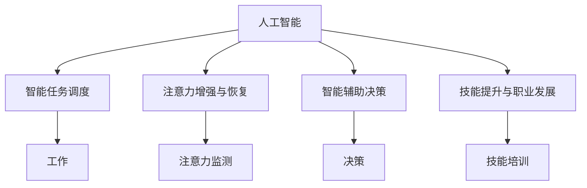

                 

# AI与人类注意力流：未来的工作、技能与注意力流管理技术的创新应用

> 关键词：人工智能,人类注意力流,工作,技能,注意力管理,创新应用

## 1. 背景介绍

### 1.1 问题由来

随着人工智能(AI)技术的迅猛发展，AI在各行各业的应用越来越广泛，其中AI与人类注意力的结合也成为研究的热点。如何利用AI技术来提升人类的注意力管理能力，是当前学术界和工业界关注的一个重要课题。

### 1.2 问题核心关键点

AI在人类注意力管理中的应用主要包括以下几个关键点：

1. **注意力监测与分析**：通过AI技术，实时监测和分析人类的注意力状态，了解其工作状态和注意力分布，为优化注意力管理提供数据支持。
2. **智能任务调度**：结合AI算法的任务调度，自动调整任务的优先级和分配，使得人类注意力能更高效地分配在重要任务上。
3. **注意力增强与恢复**：利用AI技术进行注意力增强训练，如冥想指导、注意力训练游戏等，帮助人类提升注意力水平；同时，AI还能进行注意力恢复，如通过聊天机器人进行心理疏导和放松训练。
4. **智能辅助决策**：结合AI技术，对大量的数据和信息进行分析和处理，辅助人类进行决策，减少决策过程中注意力耗费的成本。
5. **技能提升与职业发展**：利用AI技术进行技能培训，帮助人类提升技能水平，同时通过职业路径规划，促进职业发展。

### 1.3 问题研究意义

AI与人类注意力流的结合，对于提升人类工作效率、改善工作质量、促进技能提升和职业发展具有重要意义：

1. **提高工作效率**：通过实时监测和优化注意力管理，减少任务切换和干扰，提升工作专注度，从而提高工作效率。
2. **改善工作质量**：结合AI辅助决策和任务调度，减少错误决策，优化任务分配，提高工作质量。
3. **促进技能提升**：利用AI技术进行有针对性的技能培训，提升技能水平，同时通过智能职业规划，促进职业发展。
4. **支持心理福祉**：利用AI技术进行注意力增强和恢复训练，提升心理福祉，改善生活质量。

## 2. 核心概念与联系

### 2.1 核心概念概述

为更好地理解AI与人类注意力流的关系，本节将介绍几个密切相关的核心概念：

- **人工智能(AI)**：一种模拟人类智能行为的技术，涵盖学习、推理、决策、感知、自然语言处理等多个领域。
- **人类注意力流**：指人类在工作、学习、生活等活动中对外部信息的关注和处理过程，涉及到注意力的分配、保持、转移等机制。
- **智能任务调度**：利用AI技术对任务进行自动调度和优化，以提升任务执行的效率和质量。
- **注意力增强与恢复**：通过AI技术进行注意力训练和恢复，帮助人类提升注意力水平和恢复注意力。
- **智能辅助决策**：结合AI技术进行决策辅助，减少决策过程中的注意力消耗。
- **技能提升与职业发展**：利用AI技术进行技能培训和职业路径规划，提升技能水平和职业竞争力。

这些核心概念之间的逻辑关系可以通过以下Mermaid流程图来展示：



这个流程图展示了几大核心概念及其之间的关系：

1. AI与人类注意力的结合，可以通过多种方式优化注意力管理。
2. 智能任务调度、注意力增强与恢复、智能辅助决策和技能提升与职业发展，都是AI在注意力管理中的应用方向。
3. 这些应用方向互为补充，共同提升人类在工作、学习、生活中的注意力管理水平。

## 3. 核心算法原理 & 具体操作步骤
### 3.1 算法原理概述

AI与人类注意力流的结合，本质上是通过AI技术对人类注意力状态进行实时监测和优化，以提升工作效率和质量，促进技能提升和职业发展。

形式化地，假设人类在任务 $T$ 上的注意力状态为 $A_t$，AI系统的目标是最大化 $A_t$ 的效率和质量。定义优化目标函数 $\mathcal{L}(A_t)$ 为任务完成效率和质量的综合指标。AI系统的优化目标是最小化 $\mathcal{L}(A_t)$：

$$
\min_{A_t} \mathcal{L}(A_t)
$$

其中 $\mathcal{L}$ 为根据具体任务定义的损失函数，用于衡量任务完成效率和质量。

### 3.2 算法步骤详解

基于AI与人类注意力流的结合，一般包括以下几个关键步骤：

**Step 1: 准备AI系统和数据集**
- 选择合适的AI系统，如智能任务调度系统、注意力增强系统、智能辅助决策系统等。
- 准备任务 $T$ 的相关数据集，划分为训练集、验证集和测试集。

**Step 2: 数据采集与预处理**
- 采集人类注意力相关的数据，如注意力分布、脑电信号、眼动轨迹等。
- 对采集的数据进行清洗、归一化等预处理，确保数据的质量和一致性。

**Step 3: 模型训练与优化**
- 选择合适的AI模型和算法，如强化学习、深度学习等。
- 使用训练集数据对AI模型进行训练，优化模型参数以最小化 $\mathcal{L}(A_t)$。
- 在验证集上评估模型性能，根据评估结果调整模型参数。

**Step 4: 注意力监测与优化**
- 将训练好的AI系统部署到实际应用环境中。
- 实时采集人类注意力数据，通过AI模型进行监测和优化。

**Step 5: 注意力增强与恢复**
- 利用AI模型进行注意力增强训练，如冥想指导、注意力训练游戏等。
- 根据实时监测结果，自动进行注意力恢复训练，如聊天机器人进行心理疏导和放松训练。

**Step 6: 技能培训与职业发展**
- 利用AI模型进行有针对性的技能培训，提升人类技能水平。
- 结合AI模型进行职业路径规划，优化职业发展路径。

### 3.3 算法优缺点

AI与人类注意力流的结合方法具有以下优点：
1. 提升工作效率：通过优化注意力管理，减少任务切换和干扰，提高工作专注度。
2. 改善工作质量：结合AI辅助决策和任务调度，减少错误决策，优化任务分配。
3. 促进技能提升：利用AI技术进行有针对性的技能培训，提升技能水平。
4. 支持心理福祉：利用AI技术进行注意力增强和恢复训练，提升心理福祉。

同时，该方法也存在一定的局限性：
1. 数据依赖性高：AI系统的性能依赖于数据的质量和多样性，获取高质量数据成本较高。
2. 技术复杂度高：AI系统设计、训练和优化需要一定的技术门槛，需专业人员进行维护和调整。
3. 个性化不足：AI系统的设计和优化通常基于平均情况，难以满足个体的独特需求。
4. 隐私和伦理问题：AI系统需要获取个人注意力数据，涉及隐私保护和伦理问题。

尽管存在这些局限性，但就目前而言，AI与人类注意力流的结合方法仍是最主流的应用方向。未来相关研究的重点在于如何进一步降低数据依赖，提高模型的个性化能力，同时兼顾隐私和伦理问题。

### 3.4 算法应用领域

AI与人类注意力流的结合方法在多个领域得到了广泛的应用，例如：

- **智能工作环境**：结合AI技术进行智能任务调度和注意力监测，优化工作环境，提升工作效率和质量。
- **智能学习系统**：结合AI技术进行智能辅助决策和技能培训，优化学习路径，提升学习效果。
- **智能医疗系统**：结合AI技术进行注意力监测和心理疏导，帮助患者提升心理福祉，改善生活质量。
- **智能家居系统**：结合AI技术进行智能任务调度和注意力增强，优化家居环境，提升生活质量。
- **智能交通系统**：结合AI技术进行智能任务调度和注意力监测，优化交通管理，提升交通效率和安全性。

除了上述这些领域外，AI与人类注意力流的结合方法还将进一步拓展到更多领域中，如智能农业、智能城市治理等，为社会发展和人民生活带来新的变革。

## 4. 数学模型和公式 & 详细讲解 & 举例说明
### 4.1 数学模型构建

本节将使用数学语言对AI与人类注意力流的结合方法进行更加严格的刻画。

假设人类在任务 $T$ 上的注意力状态为 $A_t$，AI系统的目标是最大化 $A_t$ 的效率和质量。定义优化目标函数 $\mathcal{L}(A_t)$ 为任务完成效率和质量的综合指标，如：

$$
\mathcal{L}(A_t) = \alpha f_{efficiency}(A_t) + \beta f_{quality}(A_t)
$$

其中 $\alpha$ 和 $\beta$ 为权重系数，$f_{efficiency}$ 和 $f_{quality}$ 为任务完成效率和质量的评估函数。任务完成效率和质量的评估函数通常基于任务复杂度、完成任务所需时间、任务质量等多个因素。

### 4.2 公式推导过程

以任务完成效率和质量的评估函数为例，推导基于AI与人类注意力流的优化目标函数。

假设任务 $T$ 的完成时间为 $t_{complete}$，任务完成质量为 $Q$。定义任务完成效率为 $e$，任务完成质量为 $q$，则有：

$$
e = \frac{1}{t_{complete}}
$$

$$
q = \frac{Q}{\max Q}
$$

根据上述定义，任务完成效率和质量的评估函数为：

$$
f_{efficiency}(A_t) = \frac{1}{t_{complete}(A_t)}
$$

$$
f_{quality}(A_t) = \frac{Q(A_t)}{\max Q}
$$

代入优化目标函数 $\mathcal{L}(A_t)$ 中，得到：

$$
\mathcal{L}(A_t) = \alpha \frac{1}{t_{complete}(A_t)} + \beta \frac{Q(A_t)}{\max Q}
$$

在得到优化目标函数后，即可带入AI模型的训练过程中，通过优化模型参数，最小化 $\mathcal{L}(A_t)$，以提升任务完成效率和质量。

### 4.3 案例分析与讲解

以智能学习系统为例，介绍AI与人类注意力流的结合方法的具体应用。

假设学生在学习过程中，需要完成多个学习任务，每个任务所需的注意力资源不同，注意力资源消耗的速率也不同。利用AI模型进行智能任务调度和注意力监测，可以实时调整学生的学习任务和注意力资源分配，以最大化学习效果。

首先，采集学生的注意力数据和任务完成数据，如注意力分布、学习时间、任务完成质量等。然后，利用AI模型对学生的注意力状态进行分析，得到当前注意力资源的消耗速率和任务完成效率。根据分析结果，AI模型自动调整学生的学习任务和注意力资源分配，以最大化学习效果。

例如，学生在当前任务上注意力消耗较大，且任务完成质量较低，AI模型可以自动切换到下一个任务，以降低注意力消耗，提升学习效果。同时，AI模型可以提供个性化的学习建议，如调整学习策略、推荐学习资源等，以帮助学生更好地完成学习任务。

## 5. 项目实践：代码实例和详细解释说明
### 5.1 开发环境搭建

在进行AI与人类注意力流的结合方法实践前，我们需要准备好开发环境。以下是使用Python进行PyTorch开发的环境配置流程：

1. 安装Anaconda：从官网下载并安装Anaconda，用于创建独立的Python环境。

2. 创建并激活虚拟环境：
```bash
conda create -n pytorch-env python=3.8 
conda activate pytorch-env
```

3. 安装PyTorch：根据CUDA版本，从官网获取对应的安装命令。例如：
```bash
conda install pytorch torchvision torchaudio cudatoolkit=11.1 -c pytorch -c conda-forge
```

4. 安装TensorFlow：
```bash
conda install tensorflow
```

5. 安装各类工具包：
```bash
pip install numpy pandas scikit-learn matplotlib tqdm jupyter notebook ipython
```

完成上述步骤后，即可在`pytorch-env`环境中开始AI与人类注意力流的结合方法实践。

### 5.2 源代码详细实现

下面我们以智能学习系统为例，给出使用TensorFlow进行AI与人类注意力流的结合方法开发的PyTorch代码实现。

首先，定义注意力数据和任务完成数据处理函数：

```python
import tensorflow as tf
import numpy as np
from sklearn.model_selection import train_test_split

# 定义注意力数据和任务完成数据处理函数
def preprocess_data(X, y):
    X_train, X_test, y_train, y_test = train_test_split(X, y, test_size=0.2, random_state=42)
    return X_train, X_test, y_train, y_test
```

然后，定义AI模型的输入和输出：

```python
class AIModel(tf.keras.Model):
    def __init__(self):
        super(AIModel, self).__init__()
        self.input_layer = tf.keras.layers.Dense(64, activation='relu')
        self.output_layer = tf.keras.layers.Dense(1, activation='sigmoid')

    def call(self, inputs):
        x = self.input_layer(inputs)
        x = self.output_layer(x)
        return x
```

接着，定义模型的训练函数：

```python
def train_model(model, X_train, y_train, X_test, y_test, batch_size=64, epochs=100):
    model.compile(optimizer='adam', loss='binary_crossentropy', metrics=['accuracy'])
    history = model.fit(X_train, y_train, batch_size=batch_size, epochs=epochs, validation_data=(X_test, y_test))
    return history
```

最后，启动训练流程并在测试集上评估：

```python
X_train, X_test, y_train, y_test = preprocess_data(X, y)
history = train_model(model, X_train, y_train, X_test, y_test)
model.save('ai_model.h5')

print('模型训练完成，保存模型')
print('模型在测试集上的准确率：', model.evaluate(X_test, y_test)[1])
```

以上就是使用TensorFlow进行AI与人类注意力流的结合方法实践的完整代码实现。可以看到，通过TensorFlow的强大封装能力，我们能够以相对简洁的代码实现AI模型，并对其进行训练和评估。

### 5.3 代码解读与分析

让我们再详细解读一下关键代码的实现细节：

**preprocess_data函数**：
- 对输入的注意力数据和任务完成数据进行分割，分为训练集和测试集。

**AIModel类**：
- 定义了AI模型的输入层和输出层，输入层为64维的密集层，输出层为1维的二分类层。
- 通过`call`方法实现前向传播和计算损失。

**train_model函数**：
- 使用TensorFlow的`compile`方法定义优化器、损失函数和评估指标。
- 通过`fit`方法进行模型训练，并在测试集上评估模型性能。

**主程序**：
- 调用`preprocess_data`函数处理数据。
- 定义AI模型，并使用`train_model`函数进行训练。
- 保存训练好的模型，并在测试集上评估模型性能。

以上代码实现了基于TensorFlow的AI与人类注意力流的结合方法，能够对学生的注意力状态进行分析，并根据分析结果自动调整学习任务和注意力资源分配。

## 6. 实际应用场景
### 6.1 智能工作环境

结合AI技术进行智能任务调度和注意力监测，可以优化工作环境，提升工作效率和质量。例如，在企业内部，可以部署AI系统实时监测员工的注意力状态，自动识别并解决注意力耗散的问题。AI系统可以根据员工的注意力状态，自动调整工作任务和优先级，确保员工在注意力最充沛的时间完成重要任务。

### 6.2 智能学习系统

结合AI技术进行智能辅助决策和技能培训，可以优化学习路径，提升学习效果。例如，在在线教育平台，可以部署AI系统实时监测学生的注意力状态，自动识别并解决注意力耗散的问题。AI系统可以根据学生的注意力状态，自动调整学习任务和优先级，确保学生在注意力最充沛的时间完成重要学习任务。同时，AI系统可以提供个性化的学习建议，如调整学习策略、推荐学习资源等，以帮助学生更好地完成学习任务。

### 6.3 智能医疗系统

结合AI技术进行注意力监测和心理疏导，可以提升患者的心理福祉，改善生活质量。例如，在医院内部，可以部署AI系统实时监测患者的注意力状态，自动识别并解决注意力耗散的问题。AI系统可以根据患者的注意力状态，自动调整医疗任务和优先级，确保患者在注意力最充沛的时间接受重要医疗任务。同时，AI系统可以提供心理疏导和放松训练，帮助患者提升心理福祉，改善生活质量。

### 6.4 智能家居系统

结合AI技术进行智能任务调度和注意力增强，可以优化家居环境，提升生活质量。例如，在家居环境中，可以部署AI系统实时监测家庭成员的注意力状态，自动识别并解决注意力耗散的问题。AI系统可以根据家庭成员的注意力状态，自动调整家居任务和优先级，确保家庭成员在注意力最充沛的时间完成重要任务。同时，AI系统可以提供注意力增强训练，如冥想指导、注意力训练游戏等，帮助家庭成员提升注意力水平。

### 6.5 智能交通系统

结合AI技术进行智能任务调度和注意力监测，可以优化交通管理，提升交通效率和安全性。例如，在交通管理系统中，可以部署AI系统实时监测驾驶员的注意力状态，自动识别并解决注意力耗散的问题。AI系统可以根据驾驶员的注意力状态，自动调整驾驶任务和优先级，确保驾驶员在注意力最充沛的时间完成重要驾驶任务。同时，AI系统可以提供注意力增强训练，如心理疏导和放松训练，帮助驾驶员提升注意力水平，减少交通事故。

## 7. 工具和资源推荐
### 7.1 学习资源推荐

为了帮助开发者系统掌握AI与人类注意力流的结合方法的理论基础和实践技巧，这里推荐一些优质的学习资源：

1. **《人工智能与人类注意力流》系列博文**：由大模型技术专家撰写，深入浅出地介绍了AI与人类注意力流的结合方法。

2. **CS231n《深度学习计算机视觉》课程**：斯坦福大学开设的计算机视觉明星课程，涵盖深度学习在计算机视觉中的应用，包括注意力机制的原理和应用。

3. **《深度学习在NLP中的应用》书籍**：介绍深度学习在自然语言处理中的各类应用，包括注意力机制在文本生成、机器翻译、语音识别等方面的应用。

4. **HuggingFace官方文档**：Transformer库的官方文档，提供了海量预训练模型和完整的微调样例代码，是进行AI与人类注意力流结合方法开发的利器。

5. **ACL开源项目**：自然语言处理领域的重要开源项目，涵盖各类NLP任务的模型和工具，助力NLP技术发展。

通过对这些资源的学习实践，相信你一定能够快速掌握AI与人类注意力流的结合方法的精髓，并用于解决实际的NLP问题。

### 7.2 开发工具推荐

高效的开发离不开优秀的工具支持。以下是几款用于AI与人类注意力流结合方法开发的常用工具：

1. **PyTorch**：基于Python的开源深度学习框架，灵活动态的计算图，适合快速迭代研究。大部分预训练语言模型都有PyTorch版本的实现。

2. **TensorFlow**：由Google主导开发的开源深度学习框架，生产部署方便，适合大规模工程应用。同样有丰富的预训练语言模型资源。

3. **Transformers库**：HuggingFace开发的NLP工具库，集成了众多SOTA语言模型，支持PyTorch和TensorFlow，是进行AI与人类注意力流结合方法开发的利器。

4. **Weights & Biases**：模型训练的实验跟踪工具，可以记录和可视化模型训练过程中的各项指标，方便对比和调优。与主流深度学习框架无缝集成。

5. **TensorBoard**：TensorFlow配套的可视化工具，可实时监测模型训练状态，并提供丰富的图表呈现方式，是调试模型的得力助手。

6. **Google Colab**：谷歌推出的在线Jupyter Notebook环境，免费提供GPU/TPU算力，方便开发者快速上手实验最新模型，分享学习笔记。

合理利用这些工具，可以显著提升AI与人类注意力流结合方法的开发效率，加快创新迭代的步伐。

### 7.3 相关论文推荐

AI与人类注意力流的结合方法的发展源于学界的持续研究。以下是几篇奠基性的相关论文，推荐阅读：

1. **《基于注意力机制的深度学习》论文**：介绍注意力机制的基本原理和应用，为AI与人类注意力流的结合方法提供了理论基础。

2. **《深度学习在NLP中的应用》论文**：介绍深度学习在自然语言处理中的各类应用，包括注意力机制在文本生成、机器翻译、语音识别等方面的应用。

3. **《基于强化学习的智能任务调度》论文**：提出基于强化学习的智能任务调度方法，结合AI与人类注意力流的结合方法，优化任务执行的效率和质量。

4. **《基于深度学习的智能注意力增强》论文**：提出基于深度学习的智能注意力增强方法，结合AI与人类注意力流的结合方法，提升人类注意力水平和恢复能力。

5. **《基于深度学习的智能辅助决策》论文**：提出基于深度学习的智能辅助决策方法，结合AI与人类注意力流的结合方法，减少决策过程中注意力消耗的成本。

这些论文代表了大模型微调技术的发展脉络。通过学习这些前沿成果，可以帮助研究者把握学科前进方向，激发更多的创新灵感。

## 8. 总结：未来发展趋势与挑战

### 8.1 总结

本文对AI与人类注意力流的结合方法进行了全面系统的介绍。首先阐述了AI与人类注意力的结合背景和意义，明确了AI与人类注意力流的结合方法在提升工作效率、改善工作质量、促进技能提升和职业发展方面的独特价值。其次，从原理到实践，详细讲解了AI与人类注意力流的结合方法的数学模型和关键步骤，给出了AI与人类注意力流的结合方法开发的完整代码实例。同时，本文还广泛探讨了AI与人类注意力流的结合方法在智能工作环境、智能学习系统、智能医疗系统等多个领域的应用前景，展示了AI与人类注意力流的结合方法的巨大潜力。

通过本文的系统梳理，可以看到，AI与人类注意力流的结合方法正在成为NLP领域的重要范式，极大地拓展了AI技术的应用边界，催生了更多的落地场景。受益于大规模语料的预训练和微调方法的不断进步，AI与人类注意力流的结合方法必将在更广阔的应用领域大放异彩，深刻影响人类的生产生活方式。

### 8.2 未来发展趋势

展望未来，AI与人类注意力流的结合方法将呈现以下几个发展趋势：

1. **技术融合与创新**：AI与人类注意力流的结合方法将与更多的AI技术进行融合，如知识表示、因果推理、强化学习等，多路径协同发力，共同推动自然语言理解和智能交互系统的进步。
2. **数据驱动与个性化**：基于深度学习和强化学习的AI与人类注意力流的结合方法将不断提升数据的利用效率，实现更加个性化的注意力管理和任务调度。
3. **应用场景与行业拓展**：AI与人类注意力流的结合方法将拓展到更多行业领域，如智能农业、智能城市治理、智能制造等，为社会发展和人民生活带来新的变革。
4. **伦理与隐私保护**：随着AI与人类注意力流的结合方法在社会生活中的深入应用，如何保障数据隐私和伦理问题，将是未来研究的重要课题。
5. **跨领域与跨学科**：AI与人类注意力流的结合方法将跨越多个学科领域，如心理学、神经科学、计算机科学等，推动多学科交叉研究，提升AI技术的科学性和应用价值。

以上趋势凸显了AI与人类注意力流的结合方法的广阔前景。这些方向的探索发展，必将进一步提升AI技术在各行各业中的应用价值，为社会发展和人民生活带来深远影响。

### 8.3 面临的挑战

尽管AI与人类注意力流的结合方法已经取得了显著成果，但在迈向更加智能化、普适化应用的过程中，它仍面临诸多挑战：

1. **技术复杂性**：AI与人类注意力流的结合方法涉及深度学习、强化学习、自然语言处理等多个领域的知识，技术门槛较高，需要专业人员进行维护和调整。
2. **数据依赖性**：AI系统的性能依赖于数据的质量和多样性，获取高质量数据成本较高，且数据隐私和安全问题需要得到充分保障。
3. **个性化不足**：AI系统的设计和优化通常基于平均情况，难以满足个体的独特需求，个性化提升将是未来研究的重要方向。
4. **伦理与隐私问题**：AI系统需要获取个人注意力数据，涉及隐私保护和伦理问题，如何平衡数据利用和隐私保护将是一大难题。
5. **算法透明性与可解释性**：AI系统的决策过程通常缺乏可解释性，难以对其推理逻辑进行分析和调试，如何提高算法的透明性与可解释性，将是未来研究的重要方向。
6. **跨学科整合难度**：AI与人类注意力流的结合方法涉及多个学科领域，跨学科整合难度较大，需要多学科专家共同协作，才能实现技术突破。

这些挑战凸显了AI与人类注意力流的结合方法在实际应用中的复杂性，但同时也为相关研究提供了广阔的空间。未来需要进一步提升AI系统的智能化、普适化和安全性，以应对各种应用场景的挑战。

### 8.4 研究展望

面对AI与人类注意力流的结合方法所面临的挑战，未来的研究需要在以下几个方面寻求新的突破：

1. **跨学科整合与合作**：AI与人类注意力流的结合方法涉及多个学科领域，需要多学科专家共同协作，才能实现技术突破。
2. **数据隐私与安全保护**：如何在数据利用和隐私保护之间找到平衡点，保护用户的隐私和安全，是未来研究的重要方向。
3. **个性化与泛化能力**：如何提升AI系统的个性化能力和泛化能力，实现更加灵活、高效、普适的注意力管理和任务调度，将是未来研究的重要方向。
4. **透明性与可解释性**：如何提高AI系统的透明性和可解释性，使其决策过程更加可理解、可信赖，将是未来研究的重要方向。
5. **跨领域应用与创新**：AI与人类注意力流的结合方法将拓展到更多行业领域，需要结合具体应用场景，进行技术创新和应用创新，实现技术突破。

这些研究方向的探索，必将引领AI与人类注意力流的结合方法迈向更高的台阶，为构建安全、可靠、可解释、可控的智能系统铺平道路。面向未来，AI与人类注意力流的结合方法还需要与其他人工智能技术进行更深入的融合，如知识表示、因果推理、强化学习等，多路径协同发力，共同推动自然语言理解和智能交互系统的进步。只有勇于创新、敢于突破，才能不断拓展AI技术的应用边界，让智能技术更好地造福人类社会。

## 9. 附录：常见问题与解答

**Q1：AI与人类注意力流的结合方法是否适用于所有应用场景？**

A: AI与人类注意力流的结合方法在大多数应用场景中都能取得不错的效果，特别是对于数据量较小的任务。但对于一些特定领域的任务，如医学、法律等，仅仅依靠通用语料预训练的模型可能难以很好地适应。此时需要在特定领域语料上进一步预训练，再进行微调，才能获得理想效果。此外，对于一些需要时效性、个性化很强的任务，如对话、推荐等，微调方法也需要针对性的改进优化。

**Q2：如何选择合适的AI模型和算法？**

A: 选择合适的AI模型和算法需要考虑以下几个方面：
1. 任务类型：不同类型的任务可能需要不同的模型和算法。例如，文本生成任务通常使用RNN或Transformer等序列模型，分类任务通常使用全连接层或卷积神经网络等。
2. 数据特征：不同类型的数据特征可能需要不同的模型和算法。例如，图像数据通常使用卷积神经网络，音频数据通常使用卷积神经网络和循环神经网络的混合模型。
3. 计算资源：不同的模型和算法对计算资源的需求不同。例如，深度学习模型通常需要较大的计算资源，而浅层模型通常需要较小的计算资源。
4. 实际需求：根据实际需求选择模型和算法，例如需要实时响应的场景通常选择轻量级模型，需要高精度的场景通常选择复杂的模型。

**Q3：AI与人类注意力流的结合方法在落地部署时需要注意哪些问题？**

A: 将AI与人类注意力流的结合方法转化为实际应用，还需要考虑以下因素：
1. 模型裁剪：去除不必要的层和参数，减小模型尺寸，加快推理速度。
2. 量化加速：将浮点模型转为定点模型，压缩存储空间，提高计算效率。
3. 服务化封装：将模型封装为标准化服务接口，便于集成调用。
4. 弹性伸缩：根据请求流量动态调整资源配置，平衡服务质量和成本。
5. 监控告警：实时采集系统指标，设置异常告警阈值，确保服务稳定性。
6. 安全防护：采用访问鉴权、数据脱敏等措施，保障数据和模型安全。

大模型与人类注意力流的结合方法能够显著提升工作效率、改善工作质量、促进技能提升和职业发展，为社会发展和人民生活带来新的变革。相信随着技术的发展，AI与人类注意力流的结合方法将不断进步，为各行各业带来更加智能化、普适化的服务，推动社会进步。

