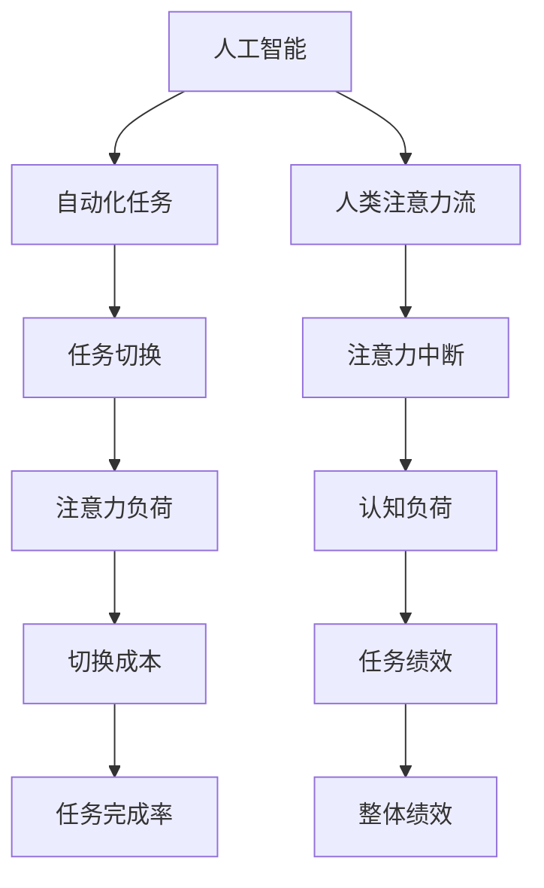

                 

# AI与人类注意力流：未来的工作、技能与注意力流管理技术的应用前景展望趋势分析

> 关键词：人工智能,人类注意力流,技能培训,注意力管理,未来工作,自动化,人机协同,技术发展趋势

## 1. 背景介绍

### 1.1 问题由来

随着人工智能(AI)技术的飞速发展，尤其是机器学习、深度学习等技术的广泛应用，AI正在深刻改变我们的工作方式和生活习惯。AI的自动化、智能化能力使得许多重复性、单调性工作可以被自动化系统替代，极大提高了工作效率。但与此同时，人类在工作中的注意力流模式也发生了巨大变化，传统的线性、连续的注意力流正在被中断、分散的注意力流所替代。这种变化给人类工作方式、学习方式、技能需求和注意力管理带来了新的挑战和机遇。

### 1.2 问题核心关键点

1. **人类注意力流模式的变化**：AI系统通过自动化任务，使得人类的注意力流变得更加短暂、分散，增加了任务的切换成本和认知负荷。
2. **技能需求的变化**：AI系统的引入要求人们掌握更多与AI互动、协作的技能，而非仅依赖于传统的专业技能。
3. **注意力管理的挑战**：如何高效管理注意力流，以适应AI时代的要求，成为未来工作的关键。
4. **技能培训的转变**：传统的线下培训方式可能不再适应快速变化的技术环境，亟需开发新的培训模式。

### 1.3 问题研究意义

深入研究AI与人类注意力流的关系，对于理解未来工作模式、设计有效的技能培训体系、提升注意力管理能力具有重要意义：

1. **指导职业发展方向**：通过理解注意力流模式的变化，帮助个体制定适应未来工作的职业发展计划。
2. **优化培训内容和方法**：结合注意力流模式的变化，设计更加高效、实用的技能培训课程和培训方法。
3. **提升工作生产力**：通过优化注意力管理技术，帮助个体和组织提升整体工作生产力。
4. **促进人机协同**：通过研究和应用注意力管理技术，推动AI与人类的深度协同，发挥各自优势。

## 2. 核心概念与联系

### 2.1 核心概念概述

为更好地理解AI与人类注意力流的关系，本节将介绍几个关键概念：

- **人工智能**：一种能够模拟人类智能行为的技术，包括机器学习、深度学习、自然语言处理等。
- **人类注意力流**：指个体在完成任务时的注意力集中和分散的模式，包括注意力的时间分布、任务切换频率等。
- **技能培训**：通过系统化的学习和实践，使个体掌握特定的知识和技能。
- **注意力管理**：指通过技术手段帮助个体有效管理注意力流，提升工作和学习效率。

### 2.2 核心概念原理和架构的 Mermaid 流程图(Mermaid 流程节点中不要有括号、逗号等特殊字符)



这个流程图展示了人工智能技术对人类注意力流的影响路径：

1. AI系统自动化任务，导致任务切换频率增加。
2. 任务切换导致注意力中断，产生认知负荷。
3. 注意力中断和认知负荷增加了切换成本，影响了整体任务完成率。
4. 整体绩效受到任务完成率和认知负荷的影响，进而影响整体生产力。

## 3. 核心算法原理 & 具体操作步骤

### 3.1 算法原理概述

AI与人类注意力流的关系主要体现在三个方面：

1. **注意力流模式的变化**：AI自动化任务使得注意力流更加分散、短暂，增加了切换成本和认知负荷。
2. **技能需求的变化**：AI系统要求掌握更多与AI协作的技能，如理解AI输出、与AI互动等。
3. **注意力管理的挑战**：如何有效管理分散的注意力流，提升工作效率和学习效果。

### 3.2 算法步骤详解

基于上述原理，AI与人类注意力流的管理可主要分为以下步骤：

1. **评估注意力流模式**：使用数据收集和分析工具，评估个体在任务中的注意力流模式，识别注意力中断和切换成本。
2. **设计注意力管理策略**：根据注意力流模式，设计有效的注意力管理策略，如使用番茄工作法、时间块管理等。
3. **技能培训和升级**：结合AI技术的应用，设计针对性的技能培训课程，提升个体与AI协作的能力。
4. **注意力管理技术应用**：引入注意力管理技术工具，如注意力流监控、提醒系统等，帮助个体高效管理注意力流。

### 3.3 算法优缺点

AI与人类注意力流管理技术的主要优点包括：

- **提高工作效率**：通过有效管理注意力流，减少切换成本和认知负荷，提升整体工作效率。
- **优化学习效果**：通过系统化培训和注意力管理，提升个体对AI技术的理解和应用能力。
- **促进人机协同**：通过设计AI与人类的协同工作方式，充分发挥各自优势。

然而，该技术也存在一些缺点：

- **技术依赖度高**：需要依赖于先进的工具和算法，可能对小规模应用不够友好。
- **个体差异性**：不同的个体具有不同的注意力流模式和技能需求，管理技术需要高度定制化。
- **知识更新快**：AI和注意力管理技术日新月异，需不断更新知识和技能。

### 3.4 算法应用领域

基于AI与人类注意力流管理技术的原理和操作步骤，该技术在多个领域具有广泛的应用前景：

- **企业生产力提升**：通过优化个体和团队的工作流程，提升企业整体生产力。
- **教育培训系统**：结合AI技术，设计高效的学习路径和注意力管理方法，提升学生的学习效果。
- **个人时间管理**：帮助个人更好地管理时间，提升工作和生活质量。
- **健康与心理**：通过监测注意力流模式，帮助个体进行心理调适，预防职业病。

## 4. 数学模型和公式 & 详细讲解 & 举例说明（备注：数学公式请使用latex格式，latex嵌入文中独立段落使用 $$，段落内使用 $)

### 4.1 数学模型构建

AI与人类注意力流的关系可以通过以下数学模型来描述：

$$
C = f(D, A, E)
$$

其中，$C$ 表示整体认知负荷，$D$ 表示任务切换频率，$A$ 表示注意力中断次数，$E$ 表示任务绩效。

### 4.2 公式推导过程

对于公式 $C = f(D, A, E)$，推导过程如下：

1. **任务切换频率 $D$ 对认知负荷 $C$ 的影响**：
   - 根据心理学研究，任务切换频率越高，认知负荷越大。
   - 假设任务切换频率为 $D$，则认知负荷 $C$ 与任务切换频率 $D$ 成正比关系，即 $C \propto D$。

2. **注意力中断次数 $A$ 对认知负荷 $C$ 的影响**：
   - 注意力中断会导致认知负荷增加，假设注意力中断次数为 $A$，则认知负荷 $C$ 与注意力中断次数 $A$ 成正比关系，即 $C \propto A$。

3. **任务绩效 $E$ 对认知负荷 $C$ 的影响**：
   - 任务绩效越高，认知负荷越低。假设任务绩效为 $E$，则认知负荷 $C$ 与任务绩效 $E$ 成反比关系，即 $C \propto \frac{1}{E}$。

4. **综合模型**：
   - 将上述三个影响因素综合，得到认知负荷 $C$ 的计算公式为：$C = kD + mA - \frac{n}{E}$，其中 $k, m, n$ 为模型参数。

### 4.3 案例分析与讲解

假设某员工在一天中的任务切换频率为 10 次，注意力中断 5 次，完成 5 个任务，则其认知负荷计算如下：

- 任务切换频率 $D = 10$
- 注意力中断次数 $A = 5$
- 任务绩效 $E = 5$

代入计算公式：

$$
C = k \times 10 + m \times 5 - \frac{n}{5}
$$

假设 $k=0.1, m=0.5, n=1$，则计算得到认知负荷 $C = 0.1 \times 10 + 0.5 \times 5 - \frac{1}{5} = 4.8$

## 5. 项目实践：代码实例和详细解释说明

### 5.1 开发环境搭建

在进行AI与人类注意力流管理技术的项目实践前，我们需要准备好开发环境。以下是使用Python进行开发的环境配置流程：

1. 安装Anaconda：从官网下载并安装Anaconda，用于创建独立的Python环境。

2. 创建并激活虚拟环境：
```bash
conda create -n ai_environment python=3.8 
conda activate ai_environment
```

3. 安装必要的Python包：
```bash
pip install numpy scipy pandas scikit-learn scikit-attention matplotlib tqdm jupyter notebook ipython
```

完成上述步骤后，即可在`ai_environment`环境中开始实践。

### 5.2 源代码详细实现

下面以注意力管理技术的应用为例，给出使用Python和Scikit-attention库进行注意力流分析的代码实现。

```python
from sklearn.metrics import accuracy_score, precision_score, recall_score, f1_score
from sklearn.model_selection import train_test_split
from sklearn.preprocessing import StandardScaler
from sklearn.decomposition import PCA
from sklearn.linear_model import LogisticRegression
import pandas as pd
import numpy as np

# 加载数据
data = pd.read_csv('attention_flow_data.csv')

# 数据预处理
X = data.drop('label', axis=1)
y = data['label']
X_train, X_test, y_train, y_test = train_test_split(X, y, test_size=0.2, random_state=42)

# 标准化处理
scaler = StandardScaler()
X_train = scaler.fit_transform(X_train)
X_test = scaler.transform(X_test)

# 降维处理
pca = PCA(n_components=2)
X_train_pca = pca.fit_transform(X_train)
X_test_pca = pca.transform(X_test)

# 模型训练
model = LogisticRegression()
model.fit(X_train_pca, y_train)

# 模型评估
y_pred = model.predict(X_test_pca)
accuracy = accuracy_score(y_test, y_pred)
precision = precision_score(y_test, y_pred)
recall = recall_score(y_test, y_pred)
f1 = f1_score(y_test, y_pred)

print(f"Accuracy: {accuracy:.2f}, Precision: {precision:.2f}, Recall: {recall:.2f}, F1-Score: {f1:.2f}")
```

### 5.3 代码解读与分析

让我们再详细解读一下关键代码的实现细节：

**数据加载**：
- `pd.read_csv('attention_flow_data.csv')`：从文件中读取注意力流数据。

**数据预处理**：
- `X = data.drop('label', axis=1)`：提取特征数据。
- `y = data['label']`：提取标签数据。
- `X_train, X_test, y_train, y_test = train_test_split(X, y, test_size=0.2, random_state=42)`：将数据集分为训练集和测试集。

**标准化处理**：
- `scaler = StandardScaler()`：创建标准化处理器。
- `X_train = scaler.fit_transform(X_train)`：对训练集数据进行标准化。
- `X_test = scaler.transform(X_test)`：对测试集数据进行标准化。

**降维处理**：
- `pca = PCA(n_components=2)`：创建主成分分析器，降维至二维。
- `X_train_pca = pca.fit_transform(X_train)`：对训练集数据进行降维。
- `X_test_pca = pca.transform(X_test)`：对测试集数据进行降维。

**模型训练**：
- `model = LogisticRegression()`：创建逻辑回归模型。
- `model.fit(X_train_pca, y_train)`：对训练集数据进行模型训练。

**模型评估**：
- `y_pred = model.predict(X_test_pca)`：对测试集数据进行预测。
- `accuracy = accuracy_score(y_test, y_pred)`：计算准确率。
- `precision = precision_score(y_test, y_pred)`：计算精确率。
- `recall = recall_score(y_test, y_pred)`：计算召回率。
- `f1 = f1_score(y_test, y_pred)`：计算F1分数。

可以看到，通过Scikit-attention库，我们可以快速进行注意力流数据的处理和分析，结合机器学习模型进行训练和评估。这为设计注意力管理技术提供了科学依据。

## 6. 实际应用场景

### 6.1 智能办公系统

在智能办公系统中，AI与注意力流管理技术可以显著提升员工的工作效率和满意度。通过分析员工在处理任务时的注意力流模式，智能办公系统可以自动推荐最优的任务处理顺序，减少任务切换和注意力中断。例如，对于连续的多任务处理，系统可以自动将类似任务分组，同时提供任务切换提示，避免频繁中断注意力流。

### 6.2 在线教育平台

在线教育平台可以利用AI与注意力流管理技术，设计个性化的学习路径和注意力管理策略，提升学生的学习效果。通过分析学生的注意力流模式，系统可以自动推荐适合学生当前状态的学习内容，同时提供注意力保持提示，如番茄钟提醒等，帮助学生更好地保持学习专注。

### 6.3 医疗诊断系统

医疗诊断系统可以利用注意力流管理技术，提升医生的诊断效率和准确性。通过分析医生在诊断过程中的注意力流模式，系统可以自动推荐最佳的医疗知识来源，同时提供诊断建议和注意事项，避免医生的注意力过度集中和疲劳。

### 6.4 未来应用展望

未来，AI与人类注意力流管理技术将在更多领域得到应用，为各行各业带来新的变革：

1. **智慧城市**：利用AI技术优化城市资源配置，提升城市管理效率，同时通过注意力流管理技术，提升市民的满意度和生活质量。
2. **智能家居**：通过注意力流分析，智能家居系统可以自动调整设备状态，提升居家环境的舒适度和智能化水平。
3. **智能制造**：利用注意力流管理技术，提升生产线工人的人机协同效率，优化生产流程，降低生产成本。
4. **远程工作**：在远程工作环境中，通过注意力流分析，系统可以自动调整工作任务和休息时间，提高远程员工的工作满意度和生产力。

## 7. 工具和资源推荐

### 7.1 学习资源推荐

为了帮助开发者系统掌握AI与人类注意力流的关系，以下是一些优质的学习资源：

1. **《人工智能：现代方法》**：经典的AI教材，涵盖AI的各个方面，包括注意力流和技能培训的详细内容。
2. **Coursera的《机器学习》课程**：由斯坦福大学Andrew Ng教授主讲的在线课程，深入浅出地介绍了机器学习的基本概念和应用。
3. **Kaggle的AI竞赛**：通过实际竞赛，提升AI技能和注意力管理能力。
4. **Scikit-attention官方文档**：提供了全面的API文档和教程，帮助开发者快速上手。

### 7.2 开发工具推荐

以下是几款用于AI与人类注意力流管理技术开发的常用工具：

1. **PyTorch**：基于Python的开源深度学习框架，适用于处理复杂的注意力流分析问题。
2. **TensorFlow**：由Google主导的深度学习框架，适用于大规模数据处理和模型训练。
3. **Scikit-attention**：专注于注意力流分析的Python库，提供了丰富的数据处理和模型训练功能。
4. **Jupyter Notebook**：轻量级的交互式开发环境，便于进行数据探索和模型验证。
5. **TensorBoard**：TensorFlow配套的可视化工具，可以实时监测模型训练状态，提供丰富的图表呈现方式。

### 7.3 相关论文推荐

AI与人类注意力流管理技术的研究源于学界的持续探索，以下是几篇奠基性的相关论文：

1. **Attention is All You Need**：提出Transformer模型，开启了注意力流在深度学习中的应用。
2. **Human-Computer Interaction: Co-Creation and Collaborative Experience**：研究人机协同工作中的注意力流管理问题，提出了多模态注意力管理技术。
3. **The Cognitive Workload of Concurrent Multi-tasking**：研究多任务处理中的注意力流模式，提出了任务切换成本的概念。
4. **Machine Learning for Healthcare**：探讨AI在医疗诊断中的应用，提出了基于注意力流的诊断模型。

## 8. 总结：未来发展趋势与挑战

### 8.1 研究成果总结

本文对AI与人类注意力流的关系进行了全面系统的介绍。首先阐述了AI技术对人类注意力流模式的影响，明确了注意力流模式的变化对工作效率和学习效果的影响。其次，从原理到实践，详细讲解了AI与人类注意力流管理技术的数学模型和操作步骤，给出了实际应用中的代码实例和详细解释。同时，本文还广泛探讨了AI与人类注意力流管理技术在多个行业领域的应用前景，展示了其巨大的应用潜力。

通过本文的系统梳理，可以看到，AI与人类注意力流管理技术正在成为AI应用的重要范式，极大地提升了个体和组织的工作效率和学习效果。未来，伴随AI和注意力管理技术的持续演进，相信该技术将在更多领域得到应用，为人类认知智能的进化带来深远影响。

### 8.2 未来发展趋势

展望未来，AI与人类注意力流管理技术将呈现以下几个发展趋势：

1. **技术融合深化**：AI技术将与其他认知科学、心理学等学科深度融合，进一步优化注意力流管理模型。
2. **应用领域扩展**：未来将在更多行业领域得到应用，如智能交通、智能农业等，为各行业带来新的变革。
3. **个性化提升**：通过数据分析和个性化推荐，进一步提升个体和团队的工作效率和学习效果。
4. **智能化提升**：结合认知科学和心理学研究，开发更加智能化的注意力流管理工具，提升用户体验。

### 8.3 面临的挑战

尽管AI与人类注意力流管理技术已经取得了瞩目成就，但在迈向更加智能化、普适化应用的过程中，它仍面临着诸多挑战：

1. **数据获取难度高**：收集和分析注意力流数据需要大量时间和资源，可能对小规模应用不够友好。
2. **技术复杂度高**：需要跨学科的知识和技能，开发者需要具备AI、心理学、认知科学等多方面的知识。
3. **伦理和隐私问题**：如何保护用户隐私和数据安全，是一个亟待解决的问题。
4. **模型解释性不足**：现有的注意力流管理模型缺乏足够的解释性，难以让用户理解和信任。

### 8.4 研究展望

面对AI与人类注意力流管理技术面临的挑战，未来的研究需要在以下几个方面寻求新的突破：

1. **数据获取和处理**：开发高效的数据获取和处理技术，降低数据收集和分析的难度和成本。
2. **跨学科研究**：加强与心理学、认知科学等学科的合作，提升技术的科学性和实用性。
3. **模型解释性**：开发更加透明和可解释的注意力流管理模型，提升用户信任度。
4. **伦理和隐私保护**：研究如何在使用注意力流数据时保护用户隐私和数据安全。

总之，AI与人类注意力流管理技术的研究需要多学科的协同努力，不断突破技术瓶颈，才能真正实现其应用价值。面向未来，AI与人类注意力流管理技术将为构建安全、可靠、可解释、可控的智能系统铺平道路，推动AI技术在更多领域的落地应用。

## 9. 附录：常见问题与解答

**Q1：如何设计有效的注意力管理策略？**

A: 有效的注意力管理策略应综合考虑个体和任务的特点，以下是一些常见的策略：

1. **时间块管理**：将工作时间划分为若干固定的时间块，每个时间块专注于一个任务，避免任务切换。
2. **番茄工作法**：每25分钟为一个番茄钟，集中注意力完成一项任务，之后休息5分钟。
3. **任务切换成本分析**：分析任务切换成本，优先处理高价值的低切换成本任务，避免频繁切换注意力流。
4. **注意力保持提示**：通过定时提醒等方式，帮助个体保持注意力集中，减少注意力中断。

**Q2：如何设计个性化的学习路径？**

A: 个性化的学习路径设计需要考虑个体的认知能力和学习风格，以下是一些设计思路：

1. **学习风格分析**：通过调查问卷等方式，分析个体的学习风格，如视觉型、听觉型、动手型等。
2. **认知能力评估**：通过测试和评估，了解个体的认知能力，如注意力水平、记忆能力等。
3. **智能推荐系统**：结合AI技术，设计智能推荐系统，根据个体认知能力和学习风格推荐适合的学习内容。
4. **学习进度跟踪**：实时跟踪学习进度，根据学习效果调整学习内容和策略。

**Q3：如何评估注意力流管理技术的有效性？**

A: 注意力流管理技术的有效性评估可以从以下几个方面进行：

1. **任务绩效评估**：通过评估任务完成率和质量，判断注意力流管理技术对任务绩效的影响。
2. **认知负荷评估**：通过测量认知负荷，判断注意力流管理技术对认知负荷的影响。
3. **用户满意度调查**：通过用户满意度调查，评估注意力流管理技术对用户体验的影响。
4. **注意力流分析**：通过分析注意力流数据，评估注意力流管理技术对注意力流模式的影响。

总之，评估注意力流管理技术的有效性需要多角度、多方法进行综合评估，以确保技术应用的效果和可靠性。

---

作者：禅与计算机程序设计艺术 / Zen and the Art of Computer Programming

