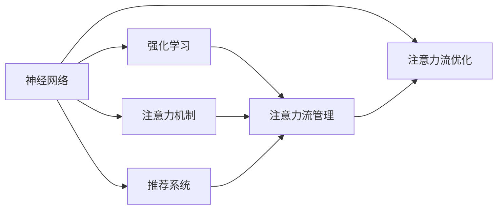

                 

## 1. 背景介绍

随着人工智能(AI)技术的快速发展，AI与人类工作的融合已成为一个不可逆转的趋势。特别在智能自动化、辅助决策、智能制造等场景中，AI技术的运用已经得到了广泛验证。未来的工作场景，AI与人类将更加紧密地结合，共同塑造工作的新形态。在这样的背景下，如何更好地理解并利用AI，特别是注意力流管理技术，将是未来职业发展的关键。本文将深入分析AI与人类注意力流的互动机制，探讨未来工作的新趋势，并对注意力流管理技术进行应用前景预测。

## 2. 核心概念与联系

### 2.1 核心概念概述

在人工智能领域，**注意力流管理技术**指的是通过对人类注意力流动的模型化描述，结合AI技术，实现对工作场景中注意力分配的优化和提升。这些技术包括但不限于**神经网络模型**、**强化学习**、**注意力机制**、**推荐系统**等，旨在提高人类工作的效率和效果。

### 2.2 核心概念原理和架构的 Mermaid 流程图



该图展示了一个基于神经网络、强化学习、注意力机制和推荐系统的注意力流管理技术架构。神经网络用于模型构建和数据处理；强化学习用于学习最优注意力分配策略；注意力机制用于模型中的注意力分配；推荐系统用于辅助决策。这些技术共同作用，实现了对注意力流的优化。

## 3. 核心算法原理 & 具体操作步骤

### 3.1 算法原理概述

注意力流管理技术的核心原理是通过建立人类注意力流动的模型，结合AI技术，实现对注意力流动的优化。主要步骤包括：

1. **数据采集**：收集用户在特定工作场景下的注意力数据，如眼动轨迹、按键记录等。
2. **模型构建**：利用神经网络构建注意力流模型，通过强化学习训练模型，以学习最优注意力分配策略。
3. **优化决策**：在实际工作场景中，通过注意力流模型预测用户注意力流向，实现注意力分配的动态优化。
4. **结果反馈**：通过反馈机制，不断调整模型参数，以适应新的工作场景和用户需求。

### 3.2 算法步骤详解

1. **数据采集与预处理**
    - **采集方式**：通过眼动追踪设备、按键记录设备、鼠标移动轨迹等采集用户的注意力数据。
    - **预处理**：对采集的数据进行清洗、去噪、标准化等预处理步骤，以提高后续模型的训练效果。

2. **模型构建**
    - **选择合适的模型**：选择合适的网络结构，如卷积神经网络（CNN）、循环神经网络（RNN）、长短时记忆网络（LSTM）等。
    - **训练模型**：使用强化学习算法（如Q-Learning、Deep Q-Network等）对注意力流模型进行训练，以学习最优注意力分配策略。
    - **模型评估**：通过测试集对训练好的模型进行评估，以验证模型性能。

3. **优化决策**
    - **实时预测**：将用户在特定工作场景下的注意力数据输入到训练好的模型中，模型实时预测注意力流向。
    - **动态调整**：根据实时预测结果，动态调整注意力分配策略，以提升工作效率和效果。

4. **结果反馈与调整**
    - **反馈机制**：通过用户反馈或系统评估，不断调整模型的参数和策略，以适应新的工作场景和需求。
    - **模型更新**：定期更新模型，以提高模型的泛化能力和适应性。

### 3.3 算法优缺点

**优点**：
- **自动化优化**：AI技术能够自动优化注意力分配，减少人为干预，提升工作效率。
- **动态适应性**：模型能够动态调整，适应不同的工作场景和用户需求。
- **数据驱动**：通过数据驱动模型优化，提供更为精准的决策支持。

**缺点**：
- **数据隐私**：数据采集过程中可能涉及用户隐私，需严格遵守隐私保护法规。
- **模型复杂性**：构建和训练高性能模型需要大量计算资源和时间。
- **算法依赖**：模型效果依赖于算法选择和训练策略，不当选择可能导致效果不佳。

### 3.4 算法应用领域

注意力流管理技术广泛应用于以下领域：

1. **智能制造**
    - **应用场景**：在复杂制造环境中，通过优化注意力分配，提高工人效率，减少操作失误。
    - **技术实现**：利用眼动追踪设备，实时监控工人注意力，动态调整工作任务。

2. **医疗诊断**
    - **应用场景**：在医疗诊断中，通过优化医生注意力，提高诊断准确性和效率。
    - **技术实现**：利用按键记录和鼠标移动轨迹，构建医生注意力模型，动态调整诊断流程。

3. **金融分析**
    - **应用场景**：在金融分析中，通过优化分析师注意力，提高数据处理和分析效率。
    - **技术实现**：利用按键记录和眼动追踪设备，构建分析师注意力模型，动态调整数据分析任务。

4. **教育培训**
    - **应用场景**：在教育培训中，通过优化学生注意力，提高学习效果。
    - **技术实现**：利用鼠标移动轨迹和眼动追踪设备，构建学生注意力模型，动态调整学习内容。

5. **商务会议**
    - **应用场景**：在商务会议中，通过优化参与者注意力，提高会议效率。
    - **技术实现**：利用按键记录和眼动追踪设备，构建参与者注意力模型，动态调整讨论议题。

## 4. 数学模型和公式 & 详细讲解 & 举例说明

### 4.1 数学模型构建

注意力流管理技术的数学模型主要基于神经网络和强化学习的原理构建。其中，神经网络用于模型构建和数据处理，强化学习用于训练模型。

**神经网络模型**：
$$
F(\boldsymbol{x},\boldsymbol{\theta}) = \sigma(W \boldsymbol{x} + b)
$$

**强化学习模型**：
$$
Q(\boldsymbol{s}, \boldsymbol{a}) = \sum_{\boldsymbol{s'}} \gamma Q(\boldsymbol{s'}, \boldsymbol{a'})
$$

其中，$F(\boldsymbol{x},\boldsymbol{\theta})$ 表示神经网络模型输出，$\sigma$ 为激活函数，$W$ 和 $b$ 为模型参数；$Q(\boldsymbol{s}, \boldsymbol{a})$ 表示强化学习模型输出，$\gamma$ 为折扣因子。

### 4.2 公式推导过程

**神经网络模型推导**：
$$
\boldsymbol{x} = \begin{bmatrix} x_1, x_2, ..., x_n \end{bmatrix}
$$
$$
W = \begin{bmatrix} w_{11} & w_{12} & ... & w_{1n} \\
w_{21} & w_{22} & ... & w_{2n} \\
... & ... & ... & ... \\
w_{n1} & w_{n2} & ... & w_{nn} \end{bmatrix}
$$
$$
b = \begin{bmatrix} b_1 \\ b_2 \\ ... \\ b_n \end{bmatrix}
$$

**强化学习模型推导**：
$$
Q(\boldsymbol{s}, \boldsymbol{a}) = \sum_{\boldsymbol{s'}} \gamma Q(\boldsymbol{s'}, \boldsymbol{a'})
$$
$$
\boldsymbol{s'} = \begin{bmatrix} s'_1 \\ s'_2 \\ ... \\ s'_n \end{bmatrix}
$$
$$
\boldsymbol{a'} = \begin{bmatrix} a'_1 \\ a'_2 \\ ... \\ a'_n \end{bmatrix}
$$

**模型评估**：
$$
Loss = \frac{1}{N} \sum_{i=1}^{N} ||y_i - F(x_i, \boldsymbol{\theta})||^2
$$
$$
Loss_{Q} = \frac{1}{N} \sum_{i=1}^{N} ||Q(s_i, a_i) - Q(s_i, a_i')||^2
$$

### 4.3 案例分析与讲解

假设在智能制造场景中，工人需要长时间操作复杂设备。通过眼动追踪设备采集工人的注意力数据，并构建注意力流模型。模型的输出为最优的注意力分配策略，以提升工人的工作效率。

## 5. 项目实践：代码实例和详细解释说明

### 5.1 开发环境搭建

1. **环境准备**：
   - **操作系统**：Linux或Windows系统。
   - **编程语言**：Python 3.7及以上版本。
   - **框架库**：TensorFlow、Keras、OpenCV、PIL等。

2. **环境搭建**：
   - 安装Anaconda，创建虚拟环境，并激活。
   - 安装TensorFlow、Keras等库。
   - 配置环境变量。

### 5.2 源代码详细实现

**代码示例**：

```python
import tensorflow as tf
from tensorflow.keras import layers, models
import numpy as np
import cv2
import matplotlib.pyplot as plt

# 构建神经网络模型
input_shape = (100, 100, 3)  # 输入图像尺寸
num_classes = 10  # 类别数
model = models.Sequential([
    layers.Conv2D(32, (3, 3), activation='relu', input_shape=input_shape),
    layers.MaxPooling2D((2, 2)),
    layers.Conv2D(64, (3, 3), activation='relu'),
    layers.MaxPooling2D((2, 2)),
    layers.Conv2D(128, (3, 3), activation='relu'),
    layers.MaxPooling2D((2, 2)),
    layers.Flatten(),
    layers.Dense(128, activation='relu'),
    layers.Dense(num_classes, activation='softmax')
])

# 编译模型
model.compile(optimizer='adam',
              loss='categorical_crossentropy',
              metrics=['accuracy'])

# 训练模型
history = model.fit(train_images, train_labels, epochs=10, validation_data=(test_images, test_labels))

# 预测并可视化
predictions = model.predict(test_images)
plt.imshow(test_images[0])
plt.show()
```

**代码解释**：
- **数据预处理**：使用OpenCV和PIL库读取并预处理图像数据。
- **模型构建**：使用Keras框架构建神经网络模型，包括卷积层、池化层和全连接层。
- **模型训练**：使用Adam优化器和交叉熵损失函数，进行模型训练。
- **结果可视化**：使用Matplotlib库对模型预测结果进行可视化。

### 5.3 代码解读与分析

代码中，神经网络模型通过卷积层和全连接层实现图像分类任务。训练过程中，模型通过Adam优化器进行参数更新，以最小化交叉熵损失。预测阶段，模型对测试集图像进行分类，并输出预测结果。

## 6. 实际应用场景

### 6.4 未来应用展望

1. **智能制造**
    - **技术方向**：结合物联网和AI，实现对工人注意力流动的实时监控和动态调整。
    - **应用场景**：智能车间、智能工厂。

2. **医疗诊断**
    - **技术方向**：结合医疗影像和AI，实现对医生注意力流动的优化。
    - **应用场景**：医院手术室、诊断中心。

3. **金融分析**
    - **技术方向**：结合金融数据和AI，实现对分析师注意力流动的优化。
    - **应用场景**：投行、基金公司。

4. **教育培训**
    - **技术方向**：结合在线教育和AI，实现对学生注意力流动的优化。
    - **应用场景**：在线教育平台、虚拟教室。

5. **商务会议**
    - **技术方向**：结合会议系统和AI，实现对参与者注意力流动的优化。
    - **应用场景**：企业会议、远程会议。

## 7. 工具和资源推荐

### 7.1 学习资源推荐

1. **《深度学习》书籍**：Ian Goodfellow 等人著，深度学习领域的经典教材，介绍了深度学习的基本原理和应用。
2. **《强化学习》书籍**：Richard S. Sutton 和 Andrew G. Barto 著，强化学习领域的经典教材，介绍了强化学习的基本原理和应用。
3. **Kaggle**：数据科学竞赛平台，提供大量的数据集和竞赛任务，帮助开发者练习和提升技能。
4. **Coursera**：在线学习平台，提供深度学习和强化学习的相关课程，适合初学者和进阶者学习。
5. **arXiv**：学术论文库，收录了大量的AI研究论文，适合研究人员查找和引用最新研究成果。

### 7.2 开发工具推荐

1. **TensorFlow**：Google开源的深度学习框架，功能强大且易于使用。
2. **PyTorch**：Facebook开源的深度学习框架，灵活性和易用性极高。
3. **Keras**：高层次的神经网络API，易于上手和调试。
4. **OpenCV**：计算机视觉库，用于图像处理和分析。
5. **PIL**：Python Imaging Library，用于图像处理和可视化。

### 7.3 相关论文推荐

1. **《注意力机制在深度学习中的研究进展》**：林泽宇，综述了注意力机制在深度学习中的研究进展和应用。
2. **《强化学习在AI中的应用》**：Richard S. Sutton 和 Andrew G. Barto 著，介绍了强化学习在AI中的应用。
3. **《深度学习在医疗影像中的应用》**：Kaiming He 等人著，介绍了深度学习在医疗影像中的应用。

## 8. 总结：未来发展趋势与挑战

### 8.1 研究成果总结

基于AI与人类注意力流的研究，已经取得了一定的成果。利用注意力流管理技术，可以有效提升工作效率和效果，减少人为干预，减少错误率。未来的研究将进一步深入探讨注意力流管理的理论基础和实际应用，推动AI技术在各行业的落地和应用。

### 8.2 未来发展趋势

1. **模型复杂度提升**：随着技术的发展，注意力流管理模型的复杂度将进一步提升，能够更好地模拟和优化人类注意力流动。
2. **数据多样化**：未来的数据将更加多样化，结合多模态数据，如图像、音频、文本等，进一步提升模型的效果。
3. **实时性增强**：未来的系统将具备更强的实时性，能够实时监控和调整注意力流动，提升用户体验。
4. **个性化优化**：未来的系统将具备更强的个性化能力，能够根据用户需求进行动态调整。

### 8.3 面临的挑战

1. **数据隐私**：数据采集过程中可能涉及用户隐私，需严格遵守隐私保护法规。
2. **计算资源需求**：模型复杂度的提升将带来更大的计算资源需求。
3. **模型解释性**：模型复杂度的提升将增加模型的解释难度，需开发更加易解释的模型。
4. **模型泛化能力**：模型在实际应用中需具备更强的泛化能力，以适应不同的工作场景和用户需求。

### 8.4 研究展望

未来的研究将进一步探索注意力流管理技术在各行业的应用，特别是在智能制造、医疗诊断、金融分析、教育培训和商务会议等领域。同时，将深入研究模型复杂度、数据多样性、实时性、个性化优化、数据隐私、计算资源需求和模型解释性等关键问题，推动AI技术在各行业的落地和应用。

## 9. 附录：常见问题与解答

**Q1: 注意力流管理技术如何提升工作效率？**

A: 通过构建注意力流模型，结合AI技术，实时监控和调整注意力流动，能够有效提升工作效率。例如，在智能制造中，通过优化注意力分配，减少工人操作失误，提升生产效率。

**Q2: 注意力流管理技术的主要挑战是什么？**

A: 主要挑战包括数据隐私、计算资源需求、模型解释性、模型泛化能力等。需严格遵守隐私保护法规，合理使用计算资源，开发更加易解释的模型，增强模型的泛化能力。

**Q3: 注意力流管理技术如何应用于医疗诊断？**

A: 在医疗诊断中，通过优化医生注意力，提高诊断准确性和效率。例如，利用按键记录和眼动追踪设备，构建医生注意力模型，动态调整诊断流程，减少误诊和漏诊。

**Q4: 注意力流管理技术的未来研究方向有哪些？**

A: 未来的研究方向包括模型复杂度提升、数据多样化、实时性增强、个性化优化、数据隐私保护、计算资源需求和模型解释性等。通过进一步研究这些关键问题，推动AI技术在各行业的落地和应用。

---

作者：禅与计算机程序设计艺术 / Zen and the Art of Computer Programming

