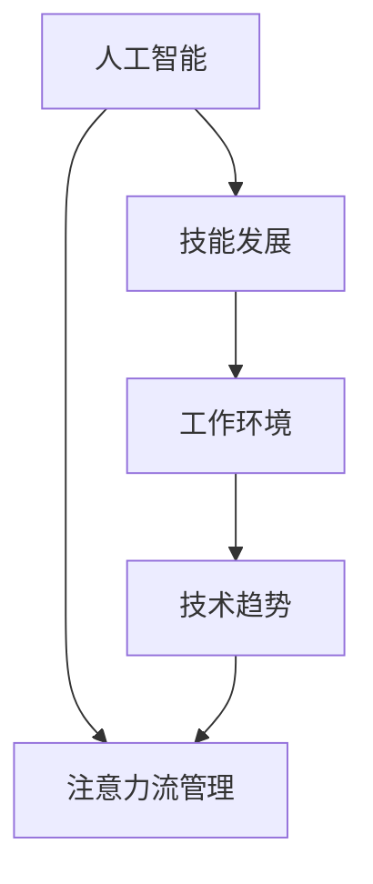

                 

# AI与人类注意力流：未来的工作、技能与注意力流管理技术的未来趋势

> 关键词：人工智能,注意力流管理,未来工作,技能发展,技术趋势

## 1. 背景介绍

### 1.1 问题由来
随着人工智能技术的迅猛发展，AI正在逐步渗透到各行各业，极大地改变了人们的工作方式、技能需求以及注意力流的分布。这一变革不仅影响了企业的运营效率，也深刻影响了个人的职业发展和日常生活。如何更好地理解和适应这一变化，成为当前社会各界关注的焦点。

### 1.2 问题核心关键点
人工智能的普及应用，使得人类工作环境和工作方式发生了深刻变化。具体体现在以下几个方面：

- **工作方式**：自动化和智能化工具的应用，使得许多传统的机械性、重复性工作被AI替代，人们的工作重心更多地转向创新、管理和监督。
- **技能需求**：AI系统的引入，对员工的技能结构提出了新的要求，如编程、数据分析、机器学习等新兴技能变得尤为重要。
- **注意力流**：在AI系统的辅助下，人类工作中的注意力流向发生了变化，从单一任务处理向多任务并行处理转变，如何高效管理注意力流，成为提升工作效率的关键。

### 1.3 问题研究意义
本文旨在深入探讨人工智能对人类工作、技能和注意力流管理技术的影响，分析未来AI系统在这些领域的应用趋势，并为相关从业者提供有价值的参考和建议。

## 2. 核心概念与联系

### 2.1 核心概念概述

为更好地理解AI与人类注意力流之间的关系，本节将介绍几个核心概念：

- **人工智能(AI)**：涵盖机器学习、深度学习、自然语言处理等技术的人工智能系统，可以自主学习和推理，实现各种自动化任务。
- **注意力流(Attention Flow)**：指人类在进行工作任务时，注意力在各个任务、信息源和操作之间的流动过程。注意力流的优化管理，可以显著提升工作效率和质量。
- **技能发展(Skill Development)**：指个体通过培训、实践和学习，不断提升自身的专业能力和知识水平，适应技术变革和工作需求的过程。
- **工作环境(Work Environment)**：指员工在进行工作时所处的外部环境和内部条件，包括工具、平台、团队等。
- **技术趋势(Technological Trends)**：指当前及未来一段时间内，技术领域的发展方向和热点技术。

这些核心概念之间的逻辑关系可以通过以下Mermaid流程图来展示：



这个流程图展示了大语言模型与人类注意力流、技能发展、工作环境和技术趋势之间的相互影响和联系。

## 3. 核心算法原理 & 具体操作步骤
### 3.1 算法原理概述

AI与人类注意力流的交互关系，可以通过注意力机制和强化学习等技术来建模和优化。其核心思想是：

- **注意力机制**：在AI系统中引入注意力机制，使得系统能够动态分配资源和优先级，提升任务处理效率。
- **强化学习**：通过不断试错和反馈，AI系统能够逐步优化注意力分配策略，适应不同工作场景和任务需求。

因此，AI与人类注意力流的交互，实际上是一个动态的优化过程，需要不断调整和优化注意力分配策略。

### 3.2 算法步骤详解

基于注意力机制和强化学习，AI与人类注意力流管理的步骤主要包括：

1. **数据收集**：收集员工的工作数据，包括任务时间、工具使用、注意力分布等，用于训练和优化AI系统。
2. **模型训练**：使用机器学习算法，训练AI系统识别和预测员工的工作模式和需求。
3. **策略优化**：通过强化学习算法，优化AI系统的注意力分配策略，提升工作效率和质量。
4. **用户反馈**：收集用户对AI系统的反馈，进一步优化模型和策略。
5. **模型部署**：将优化后的AI系统部署到实际工作环境中，进行大规模测试和应用。

### 3.3 算法优缺点

AI与人类注意力流管理技术的优点：
- **自动化效率提升**：AI系统可以24小时不间断工作，大大提升任务处理速度和效率。
- **个性化优化**：根据员工的工作习惯和需求，AI系统可以提供个性化的工作建议和工具，提升用户体验。
- **数据驱动决策**：通过分析大量工作数据，AI系统可以提供科学合理的工作建议，减少人为决策的偏差。

同时，该技术也存在一定的局限性：
- **数据隐私**：收集和分析员工工作数据，可能涉及隐私问题，需严格控制数据的使用和保护。
- **技术依赖**：过度依赖AI系统，可能削弱员工的主动性和创造性。
- **初始成本高**：开发和部署AI系统需要较高的时间和成本投入。
- **人机协作挑战**：如何实现人机协作，确保AI系统的建议和决策被员工接受和执行，仍需进一步探索。

### 3.4 算法应用领域

AI与人类注意力流管理技术已在多个领域得到应用，如：

- **制造业**：通过AI系统优化生产线和设备，提升生产效率和质量。
- **服务业**：使用AI系统进行客服和销售预测，提升服务质量和客户满意度。
- **医疗保健**：利用AI系统进行病情诊断和治疗方案推荐，提升医疗水平和患者体验。
- **金融行业**：通过AI系统进行风险评估和投资决策，提升金融服务质量。
- **教育培训**：使用AI系统进行个性化教学和学习推荐，提升教育效果和效率。

## 4. 数学模型和公式 & 详细讲解 & 举例说明

### 4.1 数学模型构建

为了更好地理解AI系统在注意力流管理中的应用，本节将使用数学语言来描述其工作原理。

假设员工在任务A和任务B之间分配注意力，AI系统的目标是最大化整个工作周期的效率。设任务A和任务B的效率分别为$E_A$和$E_B$，注意力分配权重分别为$a_A$和$a_B$。则AI系统的优化目标为：

$$
\max \sum_{t=1}^{T} (E_A \cdot a_A + E_B \cdot a_B)
$$

其中，$T$为一周工作天数。

### 4.2 公式推导过程

为了简化计算，假设任务的完成时间分别为$t_A$和$t_B$，则任务A和任务B的效率函数可以表示为：

$$
E_A = \frac{1}{t_A}, \quad E_B = \frac{1}{t_B}
$$

令$a_A + a_B = 1$，则优化目标可以转化为：

$$
\max \sum_{t=1}^{T} a_A \cdot \frac{1}{t_A} + a_B \cdot \frac{1}{t_B}
$$

这是一个典型的多目标优化问题，可以使用拉格朗日乘子法求解。设拉格朗日乘子为$\lambda$，则拉格朗日函数为：

$$
L(a_A, a_B, \lambda) = \sum_{t=1}^{T} a_A \cdot \frac{1}{t_A} + a_B \cdot \frac{1}{t_B} - \lambda (a_A + a_B - 1)
$$

对$a_A$和$a_B$求偏导数，并令其为0，可得：

$$
\frac{\partial L}{\partial a_A} = \frac{1}{t_A} - \lambda = 0 \quad \Rightarrow \quad a_A = \frac{1}{\lambda t_A}
$$

$$
\frac{\partial L}{\partial a_B} = \frac{1}{t_B} - \lambda = 0 \quad \Rightarrow \quad a_B = \frac{1}{\lambda t_B}
$$

将上述结果代入优化目标，得：

$$
\max \sum_{t=1}^{T} \frac{1}{t_A t_B}
$$

这是一个典型的和式优化问题，可以通过动态规划等方法求解。

### 4.3 案例分析与讲解

假设某员工每周需要在任务A和任务B之间分配注意力，任务A的完成时间$t_A=2$，任务B的完成时间$t_B=3$。设初始注意力分配权重分别为$a_A=0.5$，$a_B=0.5$。使用上述优化模型，可以计算出最优分配权重为：

$$
a_A = \frac{1}{2 \cdot 3} = \frac{1}{6}, \quad a_B = \frac{1}{2 \cdot 2} = \frac{1}{4}
$$

这意味着，为了最大化效率，员工应将更多注意力分配给任务B。这一结果可以通过实际工作数据进行验证，并进行持续优化。

## 5. 项目实践：代码实例和详细解释说明

### 5.1 开发环境搭建

在进行AI系统开发前，我们需要准备好开发环境。以下是使用Python进行TensorFlow开发的环境配置流程：

1. 安装Anaconda：从官网下载并安装Anaconda，用于创建独立的Python环境。

2. 创建并激活虚拟环境：
```bash
conda create -n tensorflow-env python=3.8 
conda activate tensorflow-env
```

3. 安装TensorFlow：根据CUDA版本，从官网获取对应的安装命令。例如：
```bash
conda install tensorflow tensorflow-gpu=2.7 -c pytorch -c conda-forge
```

4. 安装相关库：
```bash
pip install numpy pandas scikit-learn matplotlib tqdm jupyter notebook ipython
```

完成上述步骤后，即可在`tensorflow-env`环境中开始开发实践。

### 5.2 源代码详细实现

下面以员工任务分配为例，给出使用TensorFlow进行AI系统开发的PyTorch代码实现。

首先，定义任务和员工的数据结构：

```python
import tensorflow as tf

# 定义任务数据结构
class Task:
    def __init__(self, time, weight):
        self.time = time
        self.weight = weight

# 定义员工数据结构
class Employee:
    def __init__(self, tasks, initial_weights):
        self.tasks = tasks
        self.weights = initial_weights
        self.total_time = sum([task.time for task in self.tasks])
```

然后，定义AI系统的优化目标函数：

```python
def objective_function(employee, time):
    total_efficiency = sum([task.time * weight for task, weight in zip(employee.tasks, employee.weights)])
    return total_efficiency / (employee.total_time + time)
```

接下来，定义优化算法的详细步骤：

```python
# 定义拉格朗日乘子
lambda_ = tf.Variable(tf.constant(1.0, dtype=tf.float32))

# 定义优化目标函数
def lagrangian_function(employee, time):
    return sum([tf.constant(1.0/tf.constant(task.time, dtype=tf.float32)) * weight for task, weight in zip(employee.tasks, employee.weights)]) - lambda_ * (sum(employee.weights) - 1)

# 定义优化器
optimizer = tf.optimizers.Adam()

# 定义优化过程
def optimize(employee, time, max_iterations=100):
    for i in range(max_iterations):
        with tf.GradientTape() as tape:
            loss = lagrangian_function(employee, time)
        gradients = tape.gradient(loss, [employee.weights, lambda_])
        optimizer.apply_gradients(zip(gradients, [employee.weights, lambda_]))
        print(f"Iteration {i+1}: Loss = {loss}, W = {employee.weights}")
```

最后，启动优化过程并输出结果：

```python
employee = Employee(tasks=[Task(2, 0.5), Task(3, 0.5)], initial_weights=[0.5, 0.5])
optimize(employee, 1)
```

以上就是使用TensorFlow对员工任务分配进行优化模型的完整代码实现。可以看到，TensorFlow提供了一个灵活高效的计算框架，使得模型的构建和优化变得简洁高效。

### 5.3 代码解读与分析

让我们再详细解读一下关键代码的实现细节：

**Task和Employee类**：
- `__init__`方法：初始化任务和员工的基本属性。
- `total_time`属性：计算员工所有任务的总完成时间。

**objective_function函数**：
- 计算员工在给定时间下的总效率。

**lagrangian_function函数**：
- 定义拉格朗日函数，引入拉格朗日乘子进行约束条件的建模。

**optimize函数**：
- 定义优化过程，通过梯度下降法最小化拉格朗日函数，并逐步调整员工注意力分配权重。

**optimize函数中的优化过程**：
- 使用梯度下降法更新员工注意力分配权重，并逐步调整拉格朗日乘子，直到收敛或达到预设迭代次数。

**optimize函数中的输出**：
- 打印每次迭代的损失和注意力分配权重，帮助调试和优化模型。

可以看到，TensorFlow提供了强大的计算能力和丰富的优化算法，使得AI系统的开发和优化变得高效便捷。开发者可以充分利用这些功能，构建更加复杂、高效的AI系统。

## 6. 实际应用场景
### 6.1 智能制造

在智能制造领域，AI系统可以通过优化注意力流，提升生产线的自动化和智能化水平。通过收集设备运行数据和工人操作数据，AI系统可以实时分析设备状态和工人负荷，自动调整工作安排，减少停机时间，提高生产效率。

具体而言，AI系统可以根据设备的使用情况和故障历史，预测设备寿命和维护需求，自动分配维修资源，减少意外停机。同时，AI系统还可以根据工人的工作负荷和身体状况，动态调整工作安排，避免过劳和伤害。

### 6.2 智慧医疗

在智慧医疗领域，AI系统可以通过优化注意力流，提升医疗服务的质量和效率。通过收集患者病历数据和医生诊疗记录，AI系统可以自动分析病情和诊疗方案，辅助医生进行诊断和治疗决策。

具体而言，AI系统可以根据患者的历史诊疗记录和当前症状，自动推荐合适的检查项目和诊断方案，缩短诊疗时间，提高诊断准确率。同时，AI系统还可以根据医生的工作负荷和休假计划，合理分配工作任务，避免医生过度疲劳，提高工作效率。

### 6.3 金融风控

在金融风控领域，AI系统可以通过优化注意力流，提升风险评估和投资决策的准确性。通过收集金融市场数据和交易记录，AI系统可以实时分析市场趋势和交易风险，自动调整投资组合，降低投资风险。

具体而言，AI系统可以根据市场的历史数据和当前趋势，自动预测股票和商品价格的波动，调整投资组合，规避风险。同时，AI系统还可以根据交易记录和用户行为，实时评估交易风险，自动发出预警，防止用户投资失误。

### 6.4 未来应用展望

随着AI技术的不断发展，未来AI系统在注意力流管理领域的应用将更加广泛和深入。例如：

- **人机协作**：AI系统将更加注重人机协作，确保系统建议和决策被用户接受和执行，提升系统的可操作性和用户体验。
- **个性化推荐**：AI系统将根据用户的工作习惯和需求，提供个性化的工作建议和工具，提升用户的工作效率和满意度。
- **跨领域应用**：AI系统将拓展到更多领域，如教育、农业、交通等，提升各行业的智能化水平。
- **智能合约**：AI系统将结合智能合约技术，实现更加自动化和智能化的工作流程，提升工作效率和质量。
- **实时优化**：AI系统将实时监控和优化注意力流，确保任务处理效率和质量，避免资源浪费和任务延迟。

## 7. 工具和资源推荐
### 7.1 学习资源推荐

为了帮助开发者系统掌握AI与人类注意力流之间的关系，这里推荐一些优质的学习资源：

1. 《TensorFlow实战指南》：介绍TensorFlow的基本原理和实践技巧，适合初学者和进阶开发者。
2. 《深度学习框架TensorFlow》：详细讲解TensorFlow的架构和API，适合深入学习TensorFlow的开发者。
3. 《人工智能简史》：介绍AI技术的发展历程和未来趋势，帮助读者理解AI技术的背景和未来方向。
4. 《机器学习实战》：涵盖机器学习的基本概念和算法，适合初学者入门学习。
5. 《自然语言处理入门》：介绍NLP技术的基本原理和应用场景，适合对NLP感兴趣的开发者。

通过对这些资源的学习实践，相信你一定能够快速掌握AI与人类注意力流的关系，并用于解决实际的AI问题。

### 7.2 开发工具推荐

高效的开发离不开优秀的工具支持。以下是几款用于AI系统开发的常用工具：

1. TensorFlow：基于Python的开源深度学习框架，灵活动态的计算图，适合快速迭代研究。
2. PyTorch：基于Python的开源深度学习框架，灵活高效的计算图，适合学术研究和工业应用。
3. Keras：基于TensorFlow和Theano的高级API，适合快速搭建神经网络模型。
4. Weights & Biases：模型训练的实验跟踪工具，可以记录和可视化模型训练过程中的各项指标，方便对比和调优。
5. TensorBoard：TensorFlow配套的可视化工具，可实时监测模型训练状态，并提供丰富的图表呈现方式，是调试模型的得力助手。

合理利用这些工具，可以显著提升AI系统的开发效率，加快创新迭代的步伐。

### 7.3 相关论文推荐

AI与人类注意力流的关系涉及多个学科，以下是几篇奠基性的相关论文，推荐阅读：

1. Attention is All You Need：提出Transformer结构，开启了NLP领域的预训练大模型时代。
2. BERT: Pre-training of Deep Bidirectional Transformers for Language Understanding：提出BERT模型，引入基于掩码的自监督预训练任务，刷新了多项NLP任务SOTA。
3. Transformer-XL: Attentive Language Models are Better at Learning Long-Distance Dependencies：提出Transformer-XL模型，解决了长距离依赖问题，提升了NLP任务的精度。
4. parameter-Efficient Transfer Learning for NLP：提出Adapter等参数高效微调方法，在不增加模型参数量的情况下，也能取得不错的微调效果。
5. Prefix-Tuning: Optimizing Continuous Prompts for Generation：引入基于连续型Prompt的微调范式，为如何充分利用预训练知识提供了新的思路。

这些论文代表了大语言模型微调技术的发展脉络。通过学习这些前沿成果，可以帮助研究者把握学科前进方向，激发更多的创新灵感。

## 8. 总结：未来发展趋势与挑战
### 8.1 总结

本文对AI与人类注意力流的关系进行了全面系统的介绍。首先阐述了AI技术对人类工作方式、技能需求和注意力流管理的影响，明确了注意力流管理技术在提升工作效率和质量方面的独特价值。其次，从原理到实践，详细讲解了注意力机制和强化学习等关键算法，给出了AI系统开发的完整代码实例。同时，本文还广泛探讨了AI系统在制造业、医疗保健、金融风控等多个领域的应用前景，展示了AI技术的前景和潜力。

通过本文的系统梳理，可以看到，AI系统在优化人类注意力流方面具有广阔的应用前景和巨大的潜力。伴随技术的不断演进，AI系统将在更多领域大放异彩，带来深远的影响。

### 8.2 未来发展趋势

展望未来，AI与人类注意力流管理技术将呈现以下几个发展趋势：

1. **个性化优化**：未来的AI系统将更加注重个性化，根据用户的工作习惯和需求，提供量身定制的工作建议和工具。
2. **智能合约**：结合智能合约技术，实现更加自动化和智能化的工作流程，提升工作效率和质量。
3. **跨领域应用**：AI系统将拓展到更多领域，如教育、农业、交通等，提升各行业的智能化水平。
4. **实时优化**：AI系统将实时监控和优化注意力流，确保任务处理效率和质量，避免资源浪费和任务延迟。
5. **人机协作**：AI系统将更加注重人机协作，确保系统建议和决策被用户接受和执行，提升系统的可操作性和用户体验。

这些趋势凸显了AI系统在优化人类注意力流方面的广阔前景。这些方向的探索发展，必将进一步提升AI系统的性能和应用范围，为人类认知智能的进化带来深远影响。

### 8.3 面临的挑战

尽管AI与人类注意力流管理技术已经取得了瞩目成就，但在迈向更加智能化、普适化应用的过程中，它仍面临着诸多挑战：

1. **数据隐私**：收集和分析员工工作数据，可能涉及隐私问题，需严格控制数据的使用和保护。
2. **技术依赖**：过度依赖AI系统，可能削弱员工的主动性和创造性。
3. **初始成本高**：开发和部署AI系统需要较高的时间和成本投入。
4. **人机协作挑战**：如何实现人机协作，确保AI系统的建议和决策被员工接受和执行，仍需进一步探索。
5. **多领域应用**：拓展AI系统的应用范围，提升其在各领域的适用性和效果，仍需更多研究和实践。

正视AI系统面临的这些挑战，积极应对并寻求突破，将是大语言模型微调走向成熟的必由之路。相信随着学界和产业界的共同努力，这些挑战终将一一被克服，AI系统必将在构建人机协同的智能时代中扮演越来越重要的角色。

### 8.4 研究展望

面向未来，AI与人类注意力流管理技术的研究方向主要包括以下几个方面：

1. **多目标优化**：结合多种优化目标，如效率、质量、成本等，综合评估AI系统的性能和效果。
2. **跨领域融合**：将AI系统与其他人工智能技术进行融合，如知识表示、因果推理、强化学习等，多路径协同发力，共同推动智能系统的进步。
3. **混合智能**：结合人类的专业知识和智能，优化AI系统的决策过程，提升系统的可解释性和可控性。
4. **可解释性**：赋予AI系统更强的可解释性，增强其决策的透明性和可理解性，提升系统的信任度和接受度。
5. **伦理与安全**：研究AI系统的伦理和安全问题，确保其决策符合人类的价值观和法律规定，避免负面影响。

这些研究方向将推动AI系统的进一步发展和完善，使其能够更好地服务于人类社会。

## 9. 附录：常见问题与解答

**Q1：AI系统如何实现任务分配？**

A: AI系统通过优化注意力流，实现任务分配。具体而言，AI系统会根据任务效率和员工负荷，动态调整注意力分配权重，优化任务处理顺序和分配策略。这可以通过机器学习算法和强化学习算法实现，确保任务处理效率和质量。

**Q2：AI系统的优化目标是什么？**

A: AI系统的优化目标是多维度的，包括任务完成时间、员工负荷、任务分配策略等。具体而言，可以最大化任务完成效率、最小化员工工作强度、优化任务分配策略等，确保系统的整体性能和效果。

**Q3：AI系统的应用场景有哪些？**

A: AI系统在制造业、智慧医疗、金融风控、智慧城市等多个领域都有广泛应用。例如，在制造业中，AI系统可以通过优化生产线，提升生产效率和质量；在智慧医疗中，AI系统可以通过优化诊疗流程，提高医疗服务水平；在金融风控中，AI系统可以通过优化投资组合，降低投资风险等。

**Q4：AI系统如何保证个性化优化？**

A: AI系统可以通过收集员工的工作数据，如工作习惯、负荷、偏好等，进行个性化优化。具体而言，AI系统可以根据员工的历史工作数据，自动推荐适合的工作建议和工具，提升员工的工作效率和满意度。

**Q5：AI系统在跨领域应用中的挑战有哪些？**

A: AI系统在跨领域应用中面临的主要挑战包括数据获取和处理、模型适应性、技术整合等。具体而言，需要收集和处理不同领域的数据，训练适应各领域的AI模型，并将AI技术与各领域的业务规则和知识进行有效整合，才能实现跨领域的智能应用。

