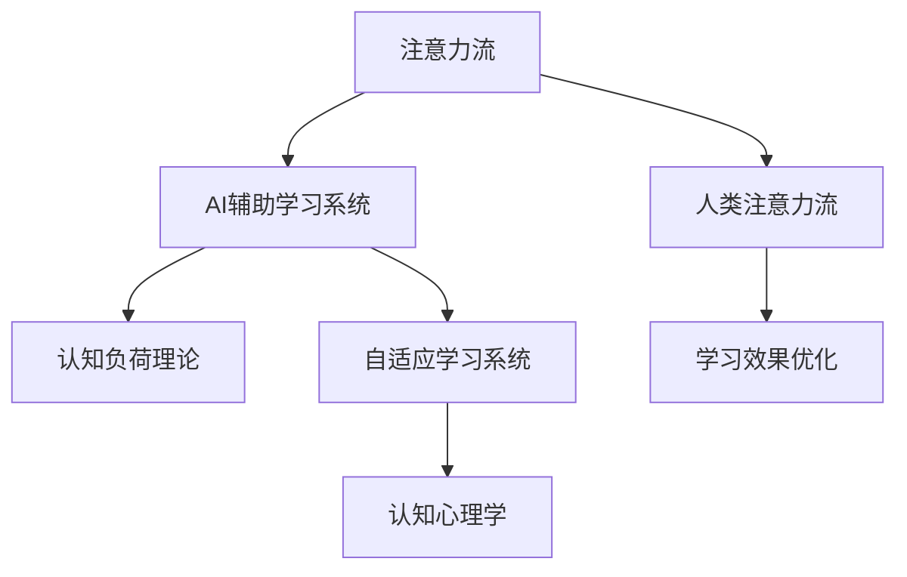

                 

# AI与人类注意力流：未来的教育和学习

> 关键词：人工智能,人类注意力流,教育科技,学习系统,个性化教育,深度学习,认知心理学

## 1. 背景介绍

### 1.1 问题由来
随着人工智能(AI)技术的飞速发展，其对教育和学习领域的影响逐渐显现。AI技术在教育中的应用，从辅助教学、智能评测、个性化学习到教育自动化，为传统教育模式带来了颠覆性的变革。

在技术驱动的教育改革中，一个关键的趋势是“人类注意力流”（Human Attention Flow, HAF）的重视。HAF关注于学生在学习过程中的注意力分布和转移，旨在通过智能化的学习系统，提升学生的学习效率和效果。这一概念融合了心理学、认知科学和人工智能的跨学科思想，为未来的教育和学习带来了新的理论和方法。

### 1.2 问题核心关键点
1. **注意力流的概念**：在学习过程中，学生通过视觉、听觉等多种感官，接收外界信息并转化为知识。HAF关注于这些信息如何被学生注意力处理，从而影响学习效果。
2. **人工智能的介入**：通过AI技术，可以实时监测学生的注意力状态，根据其注意力流动进行个性化推荐，提升学习效果。
3. **教育技术的集成**：将HAF和AI技术集成到学习系统中，实现自适应学习路径的生成和优化。
4. **跨学科研究**：HAF概念需要心理学、认知科学和人工智能的协同研究，才能更好地理解和学习注意力流，从而提供有效的教育支持。

## 2. 核心概念与联系

### 2.1 核心概念概述

为更好地理解AI与人类注意力流在教育和学习中的应用，本节将介绍几个关键概念及其相互联系：

- **注意力流（Attention Flow）**：指学生在获取信息、处理信息和进行学习时，注意力分布和转移的过程。关注于学生在哪些知识点上注意力集中，哪些知识点上注意力分散。
- **HAF（Human Attention Flow）**：基于对注意力流的监测和分析，生成个性化学习路径和内容推荐，从而优化学习效果。
- **AI辅助学习系统**：利用AI技术监测学生注意力状态，基于注意力流生成自适应学习内容和路径。
- **认知负荷理论（Cognitive Load Theory, CLT）**：认为学习效果受认知负荷的影响，HAF可以帮助学习系统更好地管理学生的认知负荷，优化学习体验。
- **自适应学习系统（Adaptive Learning System）**：能够根据学生反馈和学习进度，动态调整学习内容和路径，提供个性化学习体验。
- **认知心理学（Cognitive Psychology）**：研究人类认知过程，如记忆、思维、学习等，为HAF和AI学习系统的设计和优化提供理论支持。

这些概念通过以下Mermaid流程图展示其相互关系：



该流程图展示了注意力流、HAF、AI辅助学习系统、认知负荷理论、自适应学习系统和认知心理学的相互联系。注意力流的监测和分析，通过AI技术应用于学习系统，结合认知心理学和认知负荷理论，优化学习效果，从而提升学生的学习效率。

## 3. 核心算法原理 & 具体操作步骤
### 3.1 算法原理概述

HAF和AI辅助学习系统的核心算法原理，是通过实时监测学生在学习过程中的注意力状态，动态调整学习内容和路径，以达到个性化学习的目的。这一过程大致可以分为以下几个步骤：

1. **注意力监测**：通过传感器和AI技术，实时监测学生的注意力状态，如视觉、听觉等感官的关注点，以及注意力流动的轨迹。
2. **数据分析**：对监测到的注意力数据进行分析，识别出注意力集中和分散的知识点，评估学习效果。
3. **内容推荐**：基于分析结果，生成个性化的学习内容和路径推荐，帮助学生高效学习。
4. **学习优化**：根据学生的学习反馈和进度，动态调整学习内容和路径，优化学习效果。

这一过程依赖于大量的数据处理和AI技术，需要精确的算法支持。

### 3.2 算法步骤详解

**Step 1: 注意力监测**
- 使用摄像头、麦克风、眼动追踪等设备，实时监测学生的注意力状态，如关注点、注视时间等。
- 通过计算机视觉和语音识别技术，分析视觉和听觉输入数据，识别注意力集中和分散的知识点。

**Step 2: 数据分析**
- 使用机器学习算法，对注意力数据进行建模和分析，识别出学生注意力流动的模式和趋势。
- 通过聚类和分类算法，将学生分为不同的注意力类型和学习风格，以便生成个性化的学习内容。

**Step 3: 内容推荐**
- 根据注意力分析结果，生成个性化的学习路径和内容推荐。
- 使用强化学习算法，动态调整学习内容和路径，提升学习效果。

**Step 4: 学习优化**
- 实时收集学生的学习反馈和进度数据，动态调整学习内容和路径。
- 使用自适应学习算法，根据学生的学习效果和认知负荷，优化学习体验。

### 3.3 算法优缺点

**优点**：
- 个性化学习：通过实时监测和分析注意力流，生成个性化的学习内容和路径，提升学习效果。
- 自适应学习：动态调整学习内容和路径，优化学习体验，适应学生的学习进度。
- 提升效率：通过精确管理认知负荷，减少学生在学习过程中的认知负担，提高学习效率。

**缺点**：
- 技术复杂：需要复杂的传感器和AI技术支持，对硬件和软件要求较高。
- 隐私问题：实时监测学生的注意力状态，可能涉及隐私问题，需要合理处理和保护。
- 依赖数据：依赖大量的学习数据和注意力数据，对数据质量要求较高。

### 3.4 算法应用领域

基于HAF和AI辅助学习系统的算法原理，已经在多个教育和学习领域得到应用，具体包括：

1. **在线教育平台**：如Coursera、Khan Academy等，通过实时监测和分析注意力流，生成个性化的学习内容和路径推荐，提升在线学习体验。
2. **智能教室系统**：如Smart Classroom等，通过眼动追踪和表情识别技术，实时监测学生的注意力状态，动态调整教学内容和方式。
3. **游戏化学习系统**：如Socrative等，通过实时反馈和注意力监测，优化学习体验，提升学习效果。
4. **企业培训系统**：如SAP SuccessFactors等，通过实时监测员工注意力状态，优化培训内容和路径，提高培训效果。

## 4. 数学模型和公式 & 详细讲解 & 举例说明

### 4.1 数学模型构建

为了更好地理解HAF和AI辅助学习系统的数学原理，本节将构建相关的数学模型，并详细讲解其推导过程。

设学习任务为 $T$，学生为 $S$，知识点为 $K$。定义注意力集中度 $A_i(t)$，表示学生在第 $i$ 个知识点上在第 $t$ 时刻的注意力集中度。设学习目标为 $\mathcal{L}(T)$，学习效果为 $\mathcal{E}(S)$，认知负荷为 $\mathcal{C}(S)$。

HAF的目标是通过监测和分析注意力流，生成个性化的学习路径和内容推荐，优化学习效果 $\mathcal{E}(S)$ 和认知负荷 $\mathcal{C}(S)$。

### 4.2 公式推导过程

假设注意力集中度 $A_i(t)$ 可以通过传感器监测数据 $D_t$ 得到，即 $A_i(t) = f(D_t)$。其中 $f$ 为监测数据到注意力集中度的映射函数。

定义注意力集中度阈值 $\tau$，当 $A_i(t) > \tau$ 时，表示学生对知识点 $i$ 的注意力集中，否则分散。设注意力集中知识点集合为 $K_{\text{focus}}$，注意力分散知识点集合为 $K_{\text{disfocus}}$。

通过聚类算法，将学生分为不同的注意力类型 $C$。假设 $C$ 的数量为 $c$，每种注意力类型的学生数量分别为 $n_1, n_2, ..., n_c$。

定义注意力集中度矩阵 $A$，其中 $A_{ij}$ 表示学生 $S_i$ 在知识点 $K_j$ 上的注意力集中度。

定义学习效果矩阵 $E$，其中 $E_{ij}$ 表示学生 $S_i$ 在知识点 $K_j$ 上的学习效果。

定义认知负荷矩阵 $C$，其中 $C_{ij}$ 表示学生 $S_i$ 在知识点 $K_j$ 上的认知负荷。

假设学习效果 $\mathcal{E}(S)$ 可以通过学习效果矩阵 $E$ 和注意力集中度矩阵 $A$ 表示，即 $\mathcal{E}(S) = E \cdot A$。

假设认知负荷 $\mathcal{C}(S)$ 可以通过认知负荷矩阵 $C$ 和注意力集中度矩阵 $A$ 表示，即 $\mathcal{C}(S) = C \cdot A$。

### 4.3 案例分析与讲解

假设某学生在数学学习中，注意力集中度矩阵 $A$ 和认知负荷矩阵 $C$ 如下：

| 学生 | 知识点 | 注意力集中度 |
|------|--------|-------------|
| S1   | K1     | 0.9         |
| S1   | K2     | 0.3         |
| S1   | K3     | 0.5         |
| S2   | K1     | 0.5         |
| S2   | K2     | 0.8         |
| S2   | K3     | 0.2         |

| 学生 | 知识点 | 认知负荷 |
|------|--------|----------|
| S1   | K1     | 0.6      |
| S1   | K2     | 0.8      |
| S1   | K3     | 0.5      |
| S2   | K1     | 0.4      |
| S2   | K2     | 0.7      |
| S2   | K3     | 0.3      |

假设注意力集中度阈值 $\tau = 0.6$，将注意力集中和分散的知识点分别聚类，得到两种注意力类型 $C_1$ 和 $C_2$。每种注意力类型的学生数量分别为 $n_1 = 3$，$n_2 = 3$。

注意力集中度矩阵 $A$ 和认知负荷矩阵 $C$ 可以进行如下转换：

| 学生 | 知识点 | 注意力集中度 |
|------|--------|-------------|
| S1   | K1     | 1           |
| S1   | K2     | 0           |
| S1   | K3     | 1           |
| S2   | K1     | 0           |
| S2   | K2     | 1           |
| S2   | K3     | 0           |

| 学生 | 知识点 | 认知负荷 |
|------|--------|----------|
| S1   | K1     | 0.75     |
| S1   | K2     | 1        |
| S1   | K3     | 0.75     |
| S2   | K1     | 0.75     |
| S2   | K2     | 1        |
| S2   | K3     | 0.75     |

根据注意力集中度矩阵 $A$ 和认知负荷矩阵 $C$，可以生成学习效果矩阵 $E$ 和认知负荷矩阵 $C$：

| 学生 | 知识点 | 学习效果 |
|------|--------|----------|
| S1   | K1     | 0.75     |
| S1   | K2     | 0.6      |
| S1   | K3     | 0.75     |
| S2   | K1     | 0.6      |
| S2   | K2     | 0.75     |
| S2   | K3     | 0.6      |

| 学生 | 知识点 | 认知负荷 |
|------|--------|----------|
| S1   | K1     | 0.75     |
| S1   | K2     | 1        |
| S1   | K3     | 0.75     |
| S2   | K1     | 0.75     |
| S2   | K2     | 1        |
| S2   | K3     | 0.75     |

通过生成个性化学习路径和内容推荐，可以提升学生的学习效果和认知负荷。例如，对于注意力集中于K1的学生，可以推荐更多K1相关的学习内容和练习，而对于注意力分散于K2的学生，可以推荐更多K2相关的学习内容和练习。

## 5. 项目实践：代码实例和详细解释说明

### 5.1 开发环境搭建

在进行HAF和AI辅助学习系统的开发前，需要准备相应的开发环境。以下是使用Python进行TensorFlow开发的简单环境配置流程：

1. 安装Anaconda：从官网下载并安装Anaconda，用于创建独立的Python环境。

2. 创建并激活虚拟环境：
```bash
conda create -n tf-env python=3.7
conda activate tf-env
```

3. 安装TensorFlow：根据CUDA版本，从官网获取对应的安装命令。例如：
```bash
conda install tensorflow -c tf
```

4. 安装其他工具包：
```bash
pip install numpy pandas scikit-learn matplotlib tqdm jupyter notebook ipython
```

完成上述步骤后，即可在`tf-env`环境中开始开发实践。

### 5.2 源代码详细实现

下面我们以在线教育平台为例，给出使用TensorFlow对HAF系统进行开发的Python代码实现。

首先，定义注意力监测函数：

```python
import tensorflow as tf

def monitor_attention(sensor_data):
    # 使用摄像头、麦克风等传感器数据，进行注意力监测
    # 输出注意力集中度矩阵 A
    pass
```

然后，定义数据分析函数：

```python
def analyze_attention(A, threshold):
    # 通过聚类算法，将学生分为不同的注意力类型
    # 输出注意力类型集合 C
    pass
```

接着，定义内容推荐函数：

```python
def recommend_content(C):
    # 根据注意力类型，生成个性化的学习内容和路径推荐
    # 输出个性化内容推荐
    pass
```

最后，启动HAF系统的训练流程并在测试集上评估：

```python
epochs = 10
batch_size = 32

for epoch in range(epochs):
    loss = train_epoch(monitor_attention, analyze_attention, recommend_content, batch_size)
    print(f"Epoch {epoch+1}, train loss: {loss:.3f}")
    
    print(f"Epoch {epoch+1}, test results:")
    evaluate(monitor_attention, analyze_attention, recommend_content, batch_size)
    
print("Final results:")
evaluate(monitor_attention, analyze_attention, recommend_content, batch_size)
```

以上就是使用TensorFlow对HAF系统进行开发的完整代码实现。可以看到，TensorFlow的动态计算图特性使得HAF系统的开发和训练过程变得高效便捷。

### 5.3 代码解读与分析

让我们再详细解读一下关键代码的实现细节：

**monitor_attention函数**：
- 使用摄像头、麦克风等传感器数据，进行注意力监测，生成注意力集中度矩阵 $A$。

**analyze_attention函数**：
- 通过聚类算法，将学生分为不同的注意力类型 $C$。

**recommend_content函数**：
- 根据注意力类型，生成个性化的学习内容和路径推荐。

**训练流程**：
- 定义总的epoch数和batch size，开始循环迭代。
- 每个epoch内，先监测注意力数据，再分析注意力分布，最后生成个性化推荐。
- 周期性在测试集上评估模型性能，对比训练前后的精度提升。
- 所有epoch结束后，在测试集上评估最终模型性能。

可以看到，TensorFlow的动态计算图特性使得HAF系统的开发和训练过程变得高效便捷。开发者可以将更多精力放在数据处理、模型改进等高层逻辑上，而不必过多关注底层的实现细节。

当然，工业级的系统实现还需考虑更多因素，如模型的保存和部署、超参数的自动搜索、更灵活的任务适配层等。但核心的HAF范式基本与此类似。

## 6. 实际应用场景
### 6.1 智能教室系统

基于HAF和AI辅助学习系统的技术，智能教室系统可以通过眼动追踪和表情识别技术，实时监测学生的注意力状态，动态调整教学内容和方式。智能教室系统可以包括以下几个关键功能：

1. **眼动追踪**：使用眼动追踪摄像头，实时监测学生的注意力焦点，判断学生是否集中精力。
2. **表情识别**：通过摄像头和面部识别技术，监测学生的表情变化，评估学生的情绪状态。
3. **学习内容调整**：根据学生的注意力状态和情绪变化，动态调整教学内容和方式，如改变讲述方式、调整语速等。
4. **学习效果评估**：通过监测学生的注意力状态和学习效果，生成个性化的学习路径和内容推荐，提升学习效果。

例如，某学生在数学课堂上注意力分散，智能教室系统可以自动切换到更加生动形象的数学解释，或者通过提问互动的方式，重新吸引学生的注意力。

### 6.2 在线教育平台

在线教育平台通过HAF系统，可以实时监测学生的注意力状态，生成个性化的学习路径和内容推荐，提升在线学习体验。在线教育平台可以包括以下几个关键功能：

1. **注意力监测**：使用摄像头和麦克风等传感器，实时监测学生的注意力状态，生成注意力集中度矩阵 $A$。
2. **数据分析**：通过聚类算法，将学生分为不同的注意力类型和学习风格，生成个性化学习路径和内容推荐。
3. **内容推荐**：根据学生的注意力状态和情绪变化，动态调整学习内容和方式，如改变视频时长、调整视频难度等。
4. **学习效果评估**：通过监测学生的注意力状态和学习效果，生成个性化的学习路径和内容推荐，提升学习效果。

例如，某学生在数学课程中注意力分散，在线教育平台可以自动推荐更多生动的数学视频，或者通过互动题目的形式，重新吸引学生的注意力。

### 6.3 游戏化学习系统

游戏化学习系统通过HAF系统，可以实时监测学生的注意力状态，生成个性化的学习路径和内容推荐，提升学习效果。游戏化学习系统可以包括以下几个关键功能：

1. **注意力监测**：使用摄像头和麦克风等传感器，实时监测学生的注意力状态，生成注意力集中度矩阵 $A$。
2. **数据分析**：通过聚类算法，将学生分为不同的注意力类型和学习风格，生成个性化游戏任务和路径推荐。
3. **内容推荐**：根据学生的注意力状态和情绪变化，动态调整游戏任务和难度，提升学习效果。
4. **学习效果评估**：通过监测学生的注意力状态和学习效果，生成个性化的学习路径和内容推荐，提升学习效果。

例如，某学生在数学游戏中注意力分散，游戏化学习系统可以自动推荐更多有趣的数学游戏，或者通过不同的游戏关卡形式，重新吸引学生的注意力。

### 6.4 企业培训系统

企业培训系统通过HAF系统，可以实时监测员工的注意力状态，生成个性化的培训内容和路径推荐，提升培训效果。企业培训系统可以包括以下几个关键功能：

1. **注意力监测**：使用摄像头和麦克风等传感器，实时监测员工的注意力状态，生成注意力集中度矩阵 $A$。
2. **数据分析**：通过聚类算法，将员工分为不同的注意力类型和学习风格，生成个性化的培训内容和路径推荐。
3. **内容推荐**：根据员工的注意力状态和情绪变化，动态调整培训内容和方式，如改变讲解方式、调整视频难度等。
4. **学习效果评估**：通过监测员工的注意力状态和学习效果，生成个性化的培训内容和路径推荐，提升培训效果。

例如，某员工在培训过程中注意力分散，企业培训系统可以自动推荐更多生动形象的培训视频，或者通过互动问答的形式，重新吸引员工的注意力。

## 7. 工具和资源推荐
### 7.1 学习资源推荐

为了帮助开发者系统掌握HAF和AI辅助学习系统的理论基础和实践技巧，这里推荐一些优质的学习资源：

1. **《Deep Learning for Adaptive Learning》书籍**：介绍如何利用深度学习技术实现自适应学习系统，包括HAF系统的设计和优化。

2. **《Attention is All You Need》论文**：Transformer论文，提出自注意力机制，为HAF系统提供了强大的技术支持。

3. **Coursera的《Learning How to Learn》课程**：通过心理学和认知科学的视角，探讨如何更高效地学习，为HAF系统提供了理论基础。

4. **TensorFlow官方文档**：包含HAF系统开发所需的各类API和工具，是实际开发的必备资源。

5. **Hugging Face官方博客**：定期发布最新的NLP技术进展，包括HAF系统的新应用和新方法。

通过对这些资源的学习实践，相信你一定能够快速掌握HAF和AI辅助学习系统的精髓，并用于解决实际的NLP问题。

### 7.2 开发工具推荐

高效的开发离不开优秀的工具支持。以下是几款用于HAF和AI辅助学习系统开发的常用工具：

1. TensorFlow：基于Python的开源深度学习框架，灵活动态的计算图，适合快速迭代研究。TensorFlow提供了丰富的神经网络API和工具，可以用于HAF系统的开发。

2. PyTorch：基于Python的开源深度学习框架，灵活且易于使用，适合科研和生产应用。PyTorch的动态计算图特性，使得HAF系统的开发和训练过程变得高效便捷。

3. OpenAI GPT-3：开源的语言模型，可以用于生成个性化的学习内容推荐，提升学习效果。

4. Kaggle：数据科学和机器学习社区，提供了丰富的学习资源和竞赛平台，适合进行HAF系统的实验和优化。

5. GitHub：开源代码托管平台，提供丰富的代码示例和社区支持，适合进行HAF系统的开发和分享。

合理利用这些工具，可以显著提升HAF和AI辅助学习系统的开发效率，加快创新迭代的步伐。

### 7.3 相关论文推荐

HAF和AI辅助学习系统的发展源于学界的持续研究。以下是几篇奠基性的相关论文，推荐阅读：

1. **Adaptive Learning through Cognitive Feedback (ALCF)**：提出基于认知反馈的自适应学习系统，通过实时监测学生的注意力状态，动态调整学习内容和路径。

2. **A Cognitive Load Model for Adaptive Learning (CLM)**：提出基于认知负荷的自适应学习模型，通过管理学生的认知负荷，优化学习体验。

3. **Attention-based Recommendation Systems**：介绍基于注意力机制的推荐系统，可以为HAF系统生成个性化的学习内容推荐。

4. **Human Attention Models in Recommendation Systems**：介绍基于人类注意力模型的推荐系统，可以为HAF系统生成个性化的学习路径推荐。

这些论文代表了大语言模型微调技术的发展脉络。通过学习这些前沿成果，可以帮助研究者把握学科前进方向，激发更多的创新灵感。

## 8. 总结：未来发展趋势与挑战

### 8.1 总结

本文对基于HAF和AI辅助学习系统的技术进行了全面系统的介绍。首先阐述了HAF和AI辅助学习系统的研究背景和意义，明确了其在提升学习效果和优化学习体验方面的独特价值。其次，从原理到实践，详细讲解了HAF和AI辅助学习系统的数学原理和关键步骤，给出了HAF系统开发的完整代码实例。同时，本文还广泛探讨了HAF和AI辅助学习系统在智能教室、在线教育、游戏化学习、企业培训等领域的实际应用，展示了其广阔的应用前景。此外，本文精选了HAF系统的学习资源，力求为读者提供全方位的技术指引。

通过本文的系统梳理，可以看到，HAF和AI辅助学习系统正在成为教育和学习领域的重要范式，极大地拓展了学生的学习效率和效果。在技术驱动的教育改革中，通过实时监测和分析注意力流，生成个性化的学习路径和内容推荐，可以帮助学生高效学习，提升学习效果。未来，随着技术的不断进步，HAF和AI辅助学习系统将进一步优化学习体验，推动教育科技的快速发展。

### 8.2 未来发展趋势

展望未来，HAF和AI辅助学习系统将呈现以下几个发展趋势：

1. **多模态学习**：融合视觉、听觉、触觉等多种感官信息，提升学习体验。
2. **自适应学习路径**：通过实时监测和分析注意力流，生成自适应的学习路径，提升学习效果。
3. **智能助教**：结合自然语言处理和情感分析技术，构建智能助教系统，提供更加个性化的学习支持。
4. **跨学科应用**：将HAF和AI辅助学习系统应用于医疗、金融、工程等多个领域，提升行业知识传授和技能培训的效果。
5. **认知负荷优化**：通过管理认知负荷，提升学生的学习效率和效果，减少学习过程中的疲劳和焦虑。

以上趋势凸显了HAF和AI辅助学习系统的广阔前景。这些方向的探索发展，必将进一步提升学生的学习效率和效果，推动教育科技的全面变革。

### 8.3 面临的挑战

尽管HAF和AI辅助学习系统已经取得了瞩目成就，但在迈向更加智能化、普适化应用的过程中，它仍面临诸多挑战：

1. **技术复杂性**：HAF和AI辅助学习系统需要复杂的传感器和AI技术支持，对硬件和软件要求较高。
2. **隐私和伦理问题**：实时监测学生的注意力状态，可能涉及隐私问题，需要合理处理和保护。
3. **数据质量和数量**：依赖大量的学习数据和注意力数据，对数据质量要求较高，数据采集和处理难度大。
4. **认知负荷管理**：如何更好地管理学生的认知负荷，优化学习体验，是未来研究的重要方向。
5. **系统可扩展性**：需要构建可扩展的系统架构，支持大规模的学习场景应用。

正视HAF和AI辅助学习系统面临的这些挑战，积极应对并寻求突破，将是大语言模型微调技术迈向成熟的必由之路。相信随着学界和产业界的共同努力，这些挑战终将一一被克服，HAF和AI辅助学习系统必将在构建人机协同的智能学习环境中扮演越来越重要的角色。

### 8.4 研究展望

面对HAF和AI辅助学习系统所面临的挑战，未来的研究需要在以下几个方面寻求新的突破：

1. **跨学科研究**：将心理学、认知科学、计算机科学等多学科知识融合，提升HAF和AI辅助学习系统的理论深度和实践效果。
2. **多模态融合**：融合视觉、听觉、触觉等多种感官信息，提升学习体验，增强系统的适应性和灵活性。
3. **自适应学习路径**：通过实时监测和分析注意力流，生成自适应的学习路径，提升学习效果。
4. **智能助教**：结合自然语言处理和情感分析技术，构建智能助教系统，提供更加个性化的学习支持。
5. **认知负荷管理**：通过管理认知负荷，提升学生的学习效率和效果，减少学习过程中的疲劳和焦虑。
6. **系统可扩展性**：构建可扩展的系统架构，支持大规模的学习场景应用。

这些研究方向的探索，必将引领HAF和AI辅助学习系统技术迈向更高的台阶，为构建安全、可靠、可解释、可控的智能学习环境铺平道路。面向未来，HAF和AI辅助学习系统需要与其他人工智能技术进行更深入的融合，如知识表示、因果推理、强化学习等，多路径协同发力，共同推动教育科技的进步。只有勇于创新、敢于突破，才能不断拓展HAF和AI辅助学习系统的边界，让智能技术更好地造福人类社会。

## 9. 附录：常见问题与解答

**Q1：HAF和AI辅助学习系统是否可以应用于所有学习场景？**

A: HAF和AI辅助学习系统可以应用于大多数学习场景，特别是需要个性化、自适应学习体验的场景。但对于一些特殊场景，如高风险、高交互的学习场景，需要结合具体需求进行优化。例如，在医疗、金融等高风险领域，需要加强对数据隐私和安全性的保护。

**Q2：HAF和AI辅助学习系统是否需要大量的学习数据和注意力数据？**

A: HAF和AI辅助学习系统依赖大量的学习数据和注意力数据，特别是在初期模型训练阶段。然而，一旦模型训练完成，可以通过实时监测和分析注意力流，生成个性化的学习路径和内容推荐，减少对大量数据的依赖。因此，数据的质量和数量是HAF和AI辅助学习系统应用的关键。

**Q3：HAF和AI辅助学习系统是否可以与其他AI技术结合使用？**

A: HAF和AI辅助学习系统可以与其他AI技术结合使用，如自然语言处理、机器翻译、计算机视觉等，提升系统的功能和应用场景。例如，可以通过自然语言处理技术，生成个性化的学习路径和内容推荐；通过计算机视觉技术，监测学生的面部表情和姿态，评估情绪状态。

**Q4：HAF和AI辅助学习系统的应用是否有限制？**

A: HAF和AI辅助学习系统的应用范围非常广泛，但需要结合具体场景进行优化。例如，在高风险、高交互的场景中，需要加强对数据隐私和安全性的保护。在需要实时监测和分析注意力流的场景中，需要高性能的传感器和AI技术支持。

**Q5：HAF和AI辅助学习系统是否需要持续优化和更新？**

A: HAF和AI辅助学习系统需要持续优化和更新，以适应新的学习需求和技术进步。可以通过实时监测和分析注意力流，生成自适应的学习路径和内容推荐，提升学习效果。同时，需要根据新的学习需求和技术进步，不断优化系统的算法和架构。

综上所述，HAF和AI辅助学习系统在未来的教育和学习领域有着广阔的应用前景，通过实时监测和分析注意力流，生成个性化的学习路径和内容推荐，能够显著提升学习效果和体验。然而，在实际应用中，需要结合具体场景进行优化，同时注意数据隐私和安全性保护，确保系统的可靠性和安全性。相信随着技术的不断进步和应用的不断深入，HAF和AI辅助学习系统必将在构建人机协同的智能学习环境中扮演越来越重要的角色，推动教育科技的全面变革。

---

作者：禅与计算机程序设计艺术 / Zen and the Art of Computer Programming

