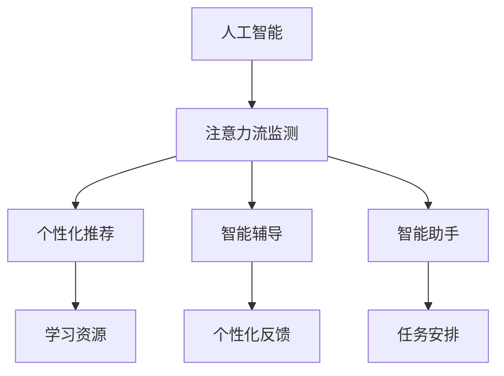

                 

# AI与人类注意力流：未来的教育、工作与AI的融合

## 1. 背景介绍

### 1.1 问题由来

随着人工智能（AI）技术的迅猛发展，其在教育、工作等领域的应用已逐步普及。然而，AI技术对于人类注意力的影响并未得到广泛关注。尤其在当前信息爆炸的时代，如何有效管理人类的注意力流，以适应日益复杂多变的工作和教育环境，是一个亟待解决的问题。

### 1.2 问题核心关键点

人类注意力流（Attention Flow）是指人类在进行学习、工作等活动时，注意力在不同的任务、信息和媒介之间切换的过程。AI技术通过自然语言处理（NLP）、计算机视觉（CV）等技术，可以实时监测和分析人类的注意力流，为个性化推荐、智能辅导、智能助手等应用提供数据支持。

1. **注意力监测**：通过NLP技术，AI可以实时解析人类语言行为，理解其意图和焦点，从而监测注意力流。
2. **个性化推荐**：根据人类当前注意力的焦点，智能推荐学习资源、工作任务、娱乐内容等，提高效率。
3. **智能辅导**：实时分析人类学习进度和错误点，提供个性化的辅导和反馈。
4. **智能助手**：根据人类需求和注意力流，智能安排日程、提醒任务、处理信息等，提升工作效率。

这些应用在教育、工作中的广泛使用，将会深刻改变人类处理信息的方式，提高生产力和学习效率。

### 1.3 问题研究意义

研究AI与人类注意力流的融合，对于提升教育、工作效率，构建人机协同的学习和工作环境，具有重要意义：

1. **提升学习效率**：通过智能推荐和实时辅导，AI能够针对个体需求提供个性化的学习资源，使学习更加高效。
2. **优化工作流程**：智能助手可以优化日常工作安排，减少低效任务，提高工作效率。
3. **增强决策支持**：通过分析注意力流数据，AI能够提供更精准的决策支持，辅助人类决策。
4. **促进人机协同**：人类和AI在注意力流管理上的协同合作，将推动新一轮的工业变革。
5. **改善用户体验**：个性化推荐和智能辅导将提升用户体验，使其更加满意和高效。

## 2. 核心概念与联系

### 2.1 核心概念概述

为更好地理解AI与人类注意力流的融合，本节将介绍几个密切相关的核心概念：

- **人工智能（AI）**：一种能够模拟人类智能行为的计算机系统，包括机器学习、自然语言处理、计算机视觉等技术。
- **注意力流（Attention Flow）**：人类在学习、工作过程中，注意力在不同任务、信息和媒介之间切换的过程。
- **个性化推荐系统（Recommender System）**：根据用户行为和偏好，推荐合适的内容或任务的系统。
- **智能辅导系统（Intelligent Tutoring System）**：利用AI技术，提供个性化学习辅导和反馈的系统。
- **智能助手（Intelligent Assistant）**：通过NLP、CV等技术，辅助人类处理日常任务的系统。

这些核心概念之间的逻辑关系可以通过以下Mermaid流程图来展示：



这个流程图展示了大语言模型的工作原理和优化方向：

1. 人工智能通过监测注意力流，理解用户需求和焦点。
2. 基于这些信息，进行个性化推荐、智能辅导和智能助手服务。
3. 最终，这些服务帮助用户提高学习效率和工作效率。

## 3. 核心算法原理 & 具体操作步骤
### 3.1 算法原理概述

AI与人类注意力流的融合，核心在于通过NLP技术，实时监测和分析人类的语言行为，理解其注意力流。然后，基于这些信息，通过机器学习算法，提供个性化的推荐、辅导和助手服务。

### 3.2 算法步骤详解

基于NLP技术的AI与注意力流的融合过程一般包括以下几个关键步骤：

**Step 1: 数据收集与预处理**
- 收集用户的语言行为数据，如聊天记录、学习记录、任务日志等。
- 对数据进行清洗和预处理，如去除噪声、分词、词性标注等。

**Step 2: 注意力监测**
- 使用NLP技术，对用户的语言行为进行解析，理解其意图和焦点。
- 根据用户的注意力焦点，实时监测其关注的任务、信息和媒介。

**Step 3: 模型训练**
- 设计并训练个性化推荐、智能辅导、智能助手等模型，以用户注意力流为输入，生成个性化推荐和辅导策略。
- 使用机器学习算法（如深度学习、强化学习等），不断优化模型参数，提高预测精度。

**Step 4: 服务部署与评估**
- 将训练好的模型部署到实际应用环境中，实时处理用户请求，提供个性化推荐、智能辅导和智能助手服务。
- 定期评估模型的性能，收集用户反馈，进行模型优化和迭代。

### 3.3 算法优缺点

AI与人类注意力流的融合具有以下优点：
1. 提升效率：通过个性化推荐和智能辅导，用户能够更加高效地完成任务。
2. 个性化服务：基于用户的注意力流，提供量身定制的服务，提升用户体验。
3. 实时反馈：能够实时监测和分析用户的注意力流，提供及时的支持和优化。

同时，该方法也存在一定的局限性：
1. 数据隐私：用户语言行为数据的收集和分析，涉及隐私保护问题。
2. 模型复杂度：个性化推荐和智能辅导模型的设计复杂，需要大量标注数据和计算资源。
3. 用户依赖：过度依赖AI系统，可能影响用户的自主性和创新能力。
4. 技术瓶颈：实时监测和分析注意力流，需要高性能的计算资源和算法支持。

尽管存在这些局限性，但就目前而言，AI与人类注意力流的融合范式，在教育、工作等领域的应用，仍是大势所趋。未来相关研究的重点在于如何进一步优化模型，提升隐私保护，降低技术门槛，提高模型的通用性和可解释性。

### 3.4 算法应用领域

AI与人类注意力流的融合技术，在教育、工作等领域已经得到了广泛的应用，例如：

- **教育领域**：智能辅导系统能够根据学生的注意力流，提供个性化的学习资源和反馈，提升学习效果。
- **工作领域**：智能助手能够根据员工的注意力流，自动安排任务、提醒工作，优化工作流程。
- **客户服务**：智能客服系统能够通过分析用户的语言行为，提供更精准的客户支持和服务。
- **健康管理**：智能医疗系统能够根据患者的注意力流，提供个性化的健康建议和监测，提升健康管理效果。

除了上述这些经典应用外，AI与人类注意力流的融合技术还在更多场景中得到创新性的应用，如社交媒体分析、广告推荐、智能家居等，为社会发展和人类生活带来新的可能性。

## 4. 数学模型和公式 & 详细讲解 & 举例说明
### 4.1 数学模型构建

本节将使用数学语言对AI与人类注意力流的融合过程进行更加严格的刻画。

假设用户的语言行为序列为 $X=\{x_i\}_{i=1}^N$，其中 $x_i$ 表示第 $i$ 个时间步的用户语言行为，如文本、语音等。注意力流 $A$ 为 $\{a_i\}_{i=1}^N$，其中 $a_i$ 表示用户在第 $i$ 个时间步的注意力焦点，如当前任务、关注信息等。

定义注意力监测模型 $M$，将用户语言行为 $X$ 映射到注意力流 $A$：

$$
A = M(X)
$$

然后，基于注意力流 $A$，使用机器学习算法训练个性化推荐、智能辅导、智能助手等模型。以推荐系统为例，定义推荐模型 $R$，将注意力流 $A$ 映射到推荐资源 $R$：

$$
R = R(A)
$$

其中 $R$ 表示推荐资源，如学习资源、工作任务等。

### 4.2 公式推导过程

以下我们以推荐系统为例，推导基于注意力流的推荐模型公式。

假设用户当前关注的任务为 $T$，推荐系统根据任务 $T$ 和注意力流 $A$，推荐相关的学习资源 $R$。推荐模型的目标函数为：

$$
\min_{R} \mathcal{L}(R; X, A) = \sum_{i=1}^N \mathcal{L}(r_i; x_i, a_i)
$$

其中 $\mathcal{L}(r_i; x_i, a_i)$ 表示推荐资源 $r_i$ 对用户语言行为 $x_i$ 和注意力焦点 $a_i$ 的损失函数。

对于每个时间步 $i$，推荐资源 $r_i$ 的预测概率为：

$$
p(r_i; x_i, a_i) = \sigma(\langle r_i, W_{RA} a_i + b_{RA} \rangle)
$$

其中 $\langle \cdot, \cdot \rangle$ 表示向量点乘，$\sigma$ 表示 sigmoid 函数。

推荐资源 $r_i$ 的最终预测概率为：

$$
p(R; X, A) = \prod_{i=1}^N p(r_i; x_i, a_i)
$$

基于上述公式，推荐系统的目标为：

$$
\min_{R} \mathcal{L}(R; X, A) = \sum_{i=1}^N -y_i \log p(r_i; x_i, a_i) - (1-y_i) \log (1-p(r_i; x_i, a_i))
$$

其中 $y_i$ 为推荐的正确性标签，即推荐资源 $r_i$ 是否与用户关注的任务 $T$ 匹配。

### 4.3 案例分析与讲解

**案例分析：基于注意力流的个性化推荐系统**

某在线教育平台使用基于注意力流的推荐系统，为学生提供个性化的学习资源。系统收集学生在学习过程中产生的语言行为数据，如学习视频、笔记、提问等，进行预处理和分析，得到学生的注意力流 $A$。

然后，系统使用深度学习算法，训练推荐模型 $R$，将注意力流 $A$ 映射到推荐资源 $R$。例如，对于学习视频 $v_i$，预测学生是否会观看：

$$
p(v_i; x_i, a_i) = \sigma(\langle v_i, W_{RA} a_i + b_{RA} \rangle)
$$

其中 $W_{RA}$ 和 $b_{RA}$ 为推荐模型的参数。

通过不断训练和优化，系统能够实时监测和分析学生的注意力流，提供个性化的学习资源推荐，提升学习效果。

## 5. 项目实践：代码实例和详细解释说明
### 5.1 开发环境搭建

在进行项目实践前，我们需要准备好开发环境。以下是使用Python进行PyTorch开发的环境配置流程：

1. 安装Anaconda：从官网下载并安装Anaconda，用于创建独立的Python环境。

2. 创建并激活虚拟环境：
```bash
conda create -n pytorch-env python=3.8 
conda activate pytorch-env
```

3. 安装PyTorch：根据CUDA版本，从官网获取对应的安装命令。例如：
```bash
conda install pytorch torchvision torchaudio cudatoolkit=11.1 -c pytorch -c conda-forge
```

4. 安装Transformers库：
```bash
pip install transformers
```

5. 安装各类工具包：
```bash
pip install numpy pandas scikit-learn matplotlib tqdm jupyter notebook ipython
```

完成上述步骤后，即可在`pytorch-env`环境中开始项目实践。

### 5.2 源代码详细实现

下面我们以基于注意力流的推荐系统为例，给出使用Transformers库和PyTorch进行开发的PyTorch代码实现。

首先，定义推荐模型的输入和输出：

```python
from transformers import BertTokenizer, BertModel

class RecommendationModel:
    def __init__(self, bert_model, attention_weights):
        self.bert_model = bert_model
        self.attention_weights = attention_weights

    def forward(self, input_ids):
        bert_outputs = self.bert_model(input_ids)
        attention_output = bert_outputs[0]
        attention_weights = self.attention_weights[0]
        return attention_output, attention_weights
```

然后，定义推荐模型的损失函数和优化器：

```python
from torch.nn import CrossEntropyLoss, BCELoss
from torch.optim import AdamW

model = RecommendationModel(bert_model, attention_weights)

criterion = CrossEntropyLoss()
optimizer = AdamW(model.parameters(), lr=2e-5)
```

接着，定义推荐模型的训练函数：

```python
def train_epoch(model, train_dataset, batch_size, optimizer):
    dataloader = DataLoader(train_dataset, batch_size=batch_size, shuffle=True)
    model.train()
    epoch_loss = 0
    for batch in dataloader:
        input_ids = batch['input_ids'].to(device)
        attention_weights = batch['attention_weights'].to(device)
        labels = batch['labels'].to(device)
        model.zero_grad()
        attention_output, attention_weights = model(input_ids)
        loss = criterion(attention_output, labels)
        epoch_loss += loss.item()
        loss.backward()
        optimizer.step()
    return epoch_loss / len(dataloader)
```

最后，启动训练流程并在测试集上评估：

```python
epochs = 5
batch_size = 16

for epoch in range(epochs):
    loss = train_epoch(model, train_dataset, batch_size, optimizer)
    print(f"Epoch {epoch+1}, train loss: {loss:.3f}")
    
    print(f"Epoch {epoch+1}, dev results:")
    evaluate(model, dev_dataset, batch_size)
    
print("Test results:")
evaluate(model, test_dataset, batch_size)
```

以上就是使用PyTorch和Transformers库进行基于注意力流的推荐系统开发的完整代码实现。可以看到，Transformer模型和PyTorch框架的强大封装，使得推荐系统的开发变得简单高效。

### 5.3 代码解读与分析

让我们再详细解读一下关键代码的实现细节：

**RecommendationModel类**：
- `__init__`方法：初始化模型参数和注意力权重。
- `forward`方法：对输入数据进行前向传播，返回注意力输出和权重。

**BertTokenizer和BertModel**：
- BertTokenizer：用于分词和预处理输入数据。
- BertModel：用于进行注意力流监测，得到注意力输出。

**train_epoch函数**：
- 使用PyTorch的DataLoader对数据集进行批次化加载，供模型训练和推理使用。
- 在每个epoch内，循环迭代训练集，计算损失函数并反向传播更新模型参数。

**train函数**：
- 对训练集进行多次epoch训练，每次epoch后评估模型在验证集上的性能，最后评估测试集上的性能。

通过上述代码实现，我们能够构建一个基于注意力流的推荐系统，通过实时监测和分析用户的注意力流，提供个性化的学习资源推荐，提升学习效果。

## 6. 实际应用场景
### 6.1 智能客服系统

基于AI与人类注意力流的融合技术，可以广泛应用于智能客服系统的构建。传统客服往往需要配备大量人力，高峰期响应缓慢，且一致性和专业性难以保证。而使用基于注意力流的智能客服系统，可以7x24小时不间断服务，快速响应客户咨询，用自然流畅的语言解答各类常见问题。

在技术实现上，可以收集企业内部的历史客服对话记录，将问题和最佳答复构建成监督数据，在此基础上对预训练模型进行微调。微调后的模型能够自动理解客户意图，匹配最合适的答案模板进行回复。对于客户提出的新问题，还可以接入检索系统实时搜索相关内容，动态组织生成回答。如此构建的智能客服系统，能大幅提升客户咨询体验和问题解决效率。

### 6.2 金融舆情监测

金融机构需要实时监测市场舆论动向，以便及时应对负面信息传播，规避金融风险。传统的人工监测方式成本高、效率低，难以应对网络时代海量信息爆发的挑战。基于AI与人类注意力流的融合技术，文本分类和情感分析技术，为金融舆情监测提供了新的解决方案。

具体而言，可以收集金融领域相关的新闻、报道、评论等文本数据，并对其进行主题标注和情感标注。在此基础上对预训练语言模型进行微调，使其能够自动判断文本属于何种主题，情感倾向是正面、中性还是负面。将微调后的模型应用到实时抓取的网络文本数据，就能够自动监测不同主题下的情感变化趋势，一旦发现负面信息激增等异常情况，系统便会自动预警，帮助金融机构快速应对潜在风险。

### 6.3 个性化推荐系统

当前的推荐系统往往只依赖用户的历史行为数据进行物品推荐，无法深入理解用户的真实兴趣偏好。基于AI与人类注意力流的融合技术，个性化推荐系统可以更好地挖掘用户行为背后的语义信息，从而提供更精准、多样的推荐内容。

在实践中，可以收集用户浏览、点击、评论、分享等行为数据，提取和用户交互的物品标题、描述、标签等文本内容。将文本内容作为模型输入，用户的后续行为（如是否点击、购买等）作为监督信号，在此基础上微调预训练语言模型。微调后的模型能够从文本内容中准确把握用户的兴趣点。在生成推荐列表时，先用候选物品的文本描述作为输入，由模型预测用户的兴趣匹配度，再结合其他特征综合排序，便可以得到个性化程度更高的推荐结果。

### 6.4 未来应用展望

随着AI与人类注意力流的融合技术的发展，未来的智能系统将更加智能化、普适化。以下是一些未来应用展望：

1. **智慧医疗**：基于AI与人类注意力流的融合技术，智能医疗系统能够根据患者的注意力流，提供个性化的健康建议和监测，提升健康管理效果。
2. **智能教育**：智能辅导系统能够根据学生的注意力流，提供个性化的学习资源和反馈，提升学习效果。
3. **智能家居**：智能助手能够根据用户的注意力流，自动安排家庭事务，提升生活质量。
4. **智能办公**：智能助手能够根据员工的注意力流，自动安排工作任务，优化工作流程。
5. **智能交通**：智能交通系统能够根据驾驶员的注意力流，提供实时的驾驶辅助和提醒，提升行车安全。

这些应用将极大地提升社会生产的智能化水平，推动社会向智能化方向发展。

## 7. 工具和资源推荐
### 7.1 学习资源推荐

为了帮助开发者系统掌握AI与人类注意力流的融合理论基础和实践技巧，这里推荐一些优质的学习资源：

1. 《深度学习入门》系列博文：由大模型技术专家撰写，深入浅出地介绍了深度学习的基本原理和应用场景。
2. 《自然语言处理入门》系列视频教程：清华大学开设的NLP入门课程，涵盖NLP的基本概念和常用技术。
3. 《Recommender System》书籍：推荐的经典书籍，详细介绍了推荐系统的原理和算法。
4. HuggingFace官方文档：Transformers库的官方文档，提供了海量预训练模型和完整的微调样例代码。
5. CLUE开源项目：中文语言理解测评基准，涵盖大量不同类型的中文NLP数据集，并提供了基于微调的baseline模型。

通过对这些资源的学习实践，相信你一定能够快速掌握AI与人类注意力流的融合精髓，并用于解决实际的NLP问题。

### 7.2 开发工具推荐

高效的开发离不开优秀的工具支持。以下是几款用于AI与人类注意力流融合开发的常用工具：

1. PyTorch：基于Python的开源深度学习框架，灵活动态的计算图，适合快速迭代研究。大部分预训练语言模型都有PyTorch版本的实现。
2. TensorFlow：由Google主导开发的开源深度学习框架，生产部署方便，适合大规模工程应用。同样有丰富的预训练语言模型资源。
3. Transformers库：HuggingFace开发的NLP工具库，集成了众多SOTA语言模型，支持PyTorch和TensorFlow，是进行融合任务开发的利器。
4. Weights & Biases：模型训练的实验跟踪工具，可以记录和可视化模型训练过程中的各项指标，方便对比和调优。与主流深度学习框架无缝集成。
5. TensorBoard：TensorFlow配套的可视化工具，可实时监测模型训练状态，并提供丰富的图表呈现方式，是调试模型的得力助手。

合理利用这些工具，可以显著提升AI与人类注意力流融合任务的开发效率，加快创新迭代的步伐。

### 7.3 相关论文推荐

AI与人类注意力流的融合技术的发展源于学界的持续研究。以下是几篇奠基性的相关论文，推荐阅读：

1. Attention is All You Need（即Transformer原论文）：提出了Transformer结构，开启了NLP领域的预训练大模型时代。
2. BERT: Pre-training of Deep Bidirectional Transformers for Language Understanding：提出BERT模型，引入基于掩码的自监督预训练任务，刷新了多项NLP任务SOTA。
3. Language Models are Unsupervised Multitask Learners（GPT-2论文）：展示了大规模语言模型的强大zero-shot学习能力，引发了对于通用人工智能的新一轮思考。
4. Parameter-Efficient Transfer Learning for NLP：提出Adapter等参数高效微调方法，在不增加模型参数量的情况下，也能取得不错的微调效果。
5. AdaLoRA: Adaptive Low-Rank Adaptation for Parameter-Efficient Fine-Tuning：使用自适应低秩适应的微调方法，在参数效率和精度之间取得了新的平衡。

这些论文代表了大模型与注意力流融合技术的发展脉络。通过学习这些前沿成果，可以帮助研究者把握学科前进方向，激发更多的创新灵感。

## 8. 总结：未来发展趋势与挑战
### 8.1 总结

本文对AI与人类注意力流的融合方法进行了全面系统的介绍。首先阐述了AI技术在教育、工作等领域的应用，以及人类注意力流管理的重要性。其次，从原理到实践，详细讲解了注意力流监测和融合模型的数学原理和关键步骤，给出了基于微调的代码实例。同时，本文还广泛探讨了融合技术在多个行业领域的应用前景，展示了融合范式的广阔潜力。

通过本文的系统梳理，可以看到，AI与人类注意力流的融合技术正在成为NLP领域的重要范式，极大地拓展了预训练语言模型的应用边界，催生了更多的落地场景。受益于大规模语料的预训练，融合模型能够更好地理解人类注意力流，提供个性化的推荐和辅导，提高生产力和学习效率。未来，伴随融合技术的不断演进，AI将进一步融入人类的学习和工作环境中，推动社会向智能化方向发展。

### 8.2 未来发展趋势

展望未来，AI与人类注意力流的融合技术将呈现以下几个发展趋势：

1. **模型规模增大**：随着算力成本的下降和数据规模的扩张，预训练语言模型的参数量还将持续增长。超大规模语言模型蕴含的丰富语言知识，有望支撑更加复杂多变的下游任务融合。
2. **融合技术多样化**：除了传统的基于注意力流的融合方法，未来将涌现更多融合技术，如基于图神经网络的融合方法，增强融合模型的表达能力。
3. **实时监测与反馈**：未来的融合系统将具备更强的实时监测和反馈能力，能够实时调整推荐和辅导策略，提升用户体验。
4. **跨模态融合**：融合系统将不仅限于文本数据的融合，还将拓展到图像、视频、语音等多模态数据的整合，提升跨模态信息的处理能力。
5. **多任务融合**：未来的融合系统将支持多种任务的协同融合，如学习、工作、娱乐等，提供更全面、高效的服务。

以上趋势凸显了AI与人类注意力流融合技术的广阔前景。这些方向的探索发展，必将进一步提升NLP系统的性能和应用范围，为人类认知智能的进化带来深远影响。

### 8.3 面临的挑战

尽管AI与人类注意力流的融合技术已经取得了瞩目成就，但在迈向更加智能化、普适化应用的过程中，它仍面临着诸多挑战：

1. **数据隐私**：用户语言行为数据的收集和分析，涉及隐私保护问题。如何在保护隐私的前提下，获取准确的数据，是亟待解决的问题。
2. **模型复杂度**：融合模型的设计复杂，需要大量标注数据和计算资源。如何在降低模型复杂度的同时，提高融合效果，是未来的研究方向。
3. **用户依赖**：过度依赖AI系统，可能影响用户的自主性和创新能力。如何在使用AI系统的同时，保持用户的自主性和主动性，是值得思考的问题。
4. **技术瓶颈**：实时监测和分析注意力流，需要高性能的计算资源和算法支持。如何优化算法和硬件配置，提高系统的实时性，是亟待解决的问题。
5. **伦理和安全**：融合系统可能会引入偏见和有害信息，如何确保系统的公平性和安全性，避免恶意用途，是未来的研究方向。

这些挑战需要从技术、伦理、法律等多个维度进行综合考虑和解决。只有在各个方面的共同努力下，才能实现AI与人类注意力流融合技术的健康发展。

### 8.4 研究展望

未来的研究需要在以下几个方面寻求新的突破：

1. **无监督和半监督学习**：探索无监督和半监督学习范式，降低对大规模标注数据的依赖，最大化利用非结构化数据，实现更加灵活高效的融合。
2. **跨领域迁移学习**：研究跨领域迁移学习技术，提升融合模型的泛化能力和鲁棒性，使其能够更好地适应不同领域的应用场景。
3. **融合模型的可解释性**：开发更加可解释的融合模型，增强模型的透明度和可信度，使用户能够理解其决策过程和逻辑。
4. **隐私保护技术**：研究隐私保护技术，如差分隐私、联邦学习等，确保用户数据的安全性和隐私性。
5. **多模态融合方法**：研究多模态融合方法，提升融合模型对视觉、语音等多模态数据的处理能力，实现更加全面、准确的融合。

这些研究方向的探索，必将引领AI与人类注意力流融合技术迈向更高的台阶，为构建安全、可靠、可解释、可控的智能系统铺平道路。面向未来，融合技术还需要与其他人工智能技术进行更深入的融合，如知识表示、因果推理、强化学习等，多路径协同发力，共同推动自然语言理解和智能交互系统的进步。只有勇于创新、敢于突破，才能不断拓展语言模型的边界，让智能技术更好地造福人类社会。

## 9. 附录：常见问题与解答

**Q1：AI与人类注意力流融合是否适用于所有NLP任务？**

A: AI与人类注意力流的融合技术在大多数NLP任务上都能取得不错的效果，特别是对于数据量较小的任务。但对于一些特定领域的任务，如医学、法律等，仅仅依靠通用语料预训练的模型可能难以很好地适应。此时需要在特定领域语料上进一步预训练，再进行融合，才能获得理想效果。此外，对于一些需要时效性、个性化很强的任务，如对话、推荐等，融合方法也需要针对性的改进优化。

**Q2：AI与人类注意力流融合会面临哪些技术挑战？**

A: AI与人类注意力流的融合技术面临以下技术挑战：
1. 数据隐私：用户语言行为数据的收集和分析，涉及隐私保护问题。
2. 模型复杂度：融合模型的设计复杂，需要大量标注数据和计算资源。
3. 用户依赖：过度依赖AI系统，可能影响用户的自主性和创新能力。
4. 技术瓶颈：实时监测和分析注意力流，需要高性能的计算资源和算法支持。

**Q3：如何在保护隐私的前提下，获取准确的数据？**

A: 在保护隐私的前提下，获取准确的数据可以通过以下几种方式：
1. 差分隐私：对数据进行扰动，确保数据隐私的同时，仍能保留数据的统计特性。
2. 联邦学习：数据分布在多个节点，通过分布式计算获取聚合数据，保护数据隐私。
3. 区块链技术：通过区块链技术，确保数据传输和存储的安全性，防止数据泄露和篡改。

这些方法能够在不影响数据准确性的前提下，保护用户隐私，实现数据的高效获取。

**Q4：如何在降低模型复杂度的同时，提高融合效果？**

A: 在降低模型复杂度的同时，提高融合效果可以通过以下几种方式：
1. 压缩模型：使用模型压缩技术，如剪枝、量化等，减小模型尺寸，提高推理速度。
2. 特征选择：通过特征选择技术，筛选出对融合效果影响较大的特征，减小模型规模。
3. 迁移学习：使用迁移学习方法，在预训练和微调之间进行知识迁移，提升融合效果。

这些方法能够在降低模型复杂度的同时，提升融合效果，实现高效、准确的融合。

**Q5：如何在保持用户自主性的同时，使用AI与人类注意力流融合技术？**

A: 在保持用户自主性的同时，使用AI与人类注意力流融合技术可以通过以下几种方式：
1. 提供选择权：用户可以选择接受或拒绝AI提供的推荐和辅导，保持自主性。
2. 个性化调整：AI系统可以根据用户的反馈，动态调整推荐和辅导策略，提升用户体验。
3. 透明度：增强AI系统的透明度，使用户了解其工作机制和决策逻辑，提升信任感。

通过这些方法，可以在使用AI技术的同时，保持用户的自主性和主动性，实现人机协同的智能系统。

总之，AI与人类注意力流的融合技术需要从技术、伦理、法律等多个维度进行综合考虑和解决。只有在各个方面的共同努力下，才能实现AI与人类注意力流融合技术的健康发展。

---

作者：禅与计算机程序设计艺术 / Zen and the Art of Computer Programming

