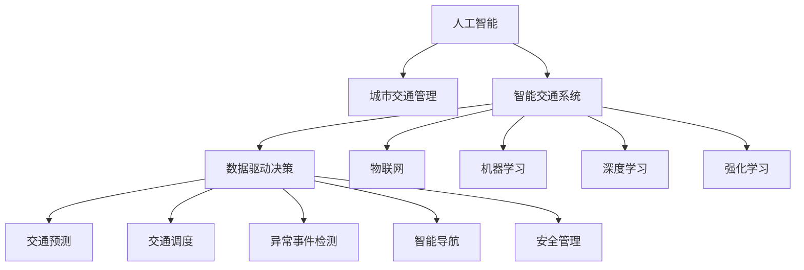

                 

# AI与人类计算：打造可持续发展的城市交通管理策略

> 关键词：人工智能,城市交通管理,智能交通系统,城市规划,可持续性,数据驱动决策,物联网,机器学习,深度学习,强化学习

## 1. 背景介绍

### 1.1 问题由来
随着城市化进程的加快，交通拥堵问题日益严重，不仅影响了市民的日常生活，也制约了经济的持续发展。传统交通管理依赖于经验直觉和人工干预，无法对海量数据进行实时处理和预测。人工智能技术的出现，为解决这一难题提供了新的可能性。

### 1.2 问题核心关键点
AI与人类计算的结合，可以帮助城市交通管理部门更好地利用数据驱动决策，通过智能化手段提升交通系统的运行效率，实现交通管理从经验主导到数据主导的转变。具体来说，AI可以在以下几个方面发挥关键作用：

- **数据收集与处理**：借助物联网、传感器等技术，收集实时交通数据，通过AI模型进行清洗、分析和可视化，为决策者提供准确可靠的信息。
- **交通预测与调度**：利用机器学习、深度学习等技术，对交通流量、路况等进行预测，实现动态调度和路径优化。
- **异常事件检测与应急响应**：通过强化学习等方法，及时检测交通异常事件，并进行快速响应和决策。
- **智能导航与推荐**：结合地图、GPS等技术，为市民提供个性化的导航建议和服务，提升出行体验。
- **安全管理与预防**：使用AI技术识别交通违法行为，预防事故发生，保障道路安全。

## 2. 核心概念与联系

### 2.1 核心概念概述

为更好地理解AI与人类计算在城市交通管理中的应用，本节将介绍几个核心概念：

- **人工智能(Artificial Intelligence, AI)**：一种通过算法和计算使计算机能够执行类似于人类智能任务的技术，如学习、推理、决策等。
- **城市交通管理(Urban Traffic Management, UTM)**：对城市道路、公共交通、停车管理等交通系统进行规划、控制和优化，以提升交通效率和安全性。
- **智能交通系统(Intelligent Transportation Systems, ITS)**：利用AI、物联网、GPS等技术，实现交通数据的实时收集和处理，提升交通管理和运行效率。
- **数据驱动决策(Data-Driven Decision Making)**：通过数据分析和建模，辅助决策者做出更加客观、科学的决策。
- **物联网(IoT)**：通过传感器、通信技术将物理世界中的各种设备、车辆、设施等连接起来，实现数据的实时传输和处理。
- **机器学习(Machine Learning, ML)**：利用算法和统计模型，让计算机从数据中学习并改进性能。
- **深度学习(Deep Learning, DL)**：一种基于神经网络的机器学习方法，通过多层非线性变换，处理和分析复杂的数据。
- **强化学习(Reinforcement Learning, RL)**：通过试错训练，使智能体在环境中学习最优策略，实现自动化决策。

这些核心概念之间的逻辑关系可以通过以下Mermaid流程图来展示：



这个流程图展示了AI与人类计算在城市交通管理中的核心作用：

1. 通过物联网技术收集实时交通数据。
2. 利用AI对数据进行处理和分析，形成决策支持。
3. 通过机器学习、深度学习、强化学习等技术，实现交通预测、调度、异常检测、导航和安全管理等智能化应用。

## 3. 核心算法原理 & 具体操作步骤

### 3.1 算法原理概述

AI与人类计算在城市交通管理中的应用，主要依赖于以下核心算法：

- **交通流量预测**：利用时间序列分析、神经网络等技术，预测未来交通流量。
- **路径优化与调度**：通过图论、动态规划等算法，实现路径优化和交通调度。
- **异常事件检测**：使用异常检测算法，如支持向量机、聚类分析等，识别交通异常事件。
- **智能导航与推荐**：结合图算法、最短路径算法等，提供个性化导航建议。
- **安全管理与预防**：通过图像识别、行为分析等技术，识别违法行为，预防事故发生。

这些算法的核心思想是通过AI技术处理海量交通数据，实现对交通系统的动态控制和优化。

### 3.2 算法步骤详解

AI与人类计算在城市交通管理中的应用，主要包括以下几个步骤：

**Step 1: 数据采集与清洗**
- 部署传感器、摄像头、GPS等设备，收集交通流量、路况、车流量等数据。
- 对采集的数据进行清洗和预处理，去除噪声和异常值，保证数据质量。

**Step 2: 数据存储与处理**
- 使用大数据技术，如Hadoop、Spark等，对数据进行分布式存储和处理。
- 通过ETL工具，将数据从原始格式转换为适合AI模型处理的形式。

**Step 3: 特征提取与模型训练**
- 使用特征工程技术，提取交通数据的特征，如交通流量、车速、车辆类型等。
- 利用机器学习、深度学习等技术，训练交通流量预测、路径优化、异常检测等模型。

**Step 4: 模型评估与优化**
- 在验证集上对模型进行评估，调整模型参数和结构，优化模型性能。
- 使用交叉验证等方法，确保模型的泛化能力和鲁棒性。

**Step 5: 部署与监控**
- 将训练好的模型部署到服务器或边缘设备，进行实时交通数据处理和预测。
- 定期对模型进行监控和维护，确保其稳定性和准确性。

**Step 6: 反馈与改进**
- 收集模型预测结果与实际数据之间的差异，不断改进和优化模型。
- 结合人工干预，根据实际情况调整模型参数和策略。

### 3.3 算法优缺点

AI与人类计算在城市交通管理中的应用，具有以下优点：

- **数据驱动决策**：通过大量数据分析，提供科学决策依据。
- **实时响应**：实现对交通事件的实时监控和快速响应。
- **提升效率**：通过智能化手段，优化交通管理和运行效率。
- **降低成本**：减少人工干预和经验决策的成本。

同时，这些应用也存在一些缺点：

- **数据质量要求高**：对数据的准确性和完整性要求较高，否则会影响模型的预测和决策。
- **模型复杂度高**：AI模型通常较为复杂，需要大量计算资源和时间进行训练和优化。
- **技术门槛高**：需要具备一定的AI技术知识和工程实践经验。
- **隐私和安全问题**：交通数据的采集和处理涉及隐私保护和数据安全问题，需要严格控制。

### 3.4 算法应用领域

AI与人类计算在城市交通管理中的应用，主要包括以下几个方面：

- **智能交通信号控制**：利用AI技术对交通信号进行智能控制，优化交通流量和减少拥堵。
- **公共交通优化**：通过AI技术优化公交线路、站点和调度，提升公共交通的效率和舒适度。
- **停车管理**：利用AI技术进行停车场管理和智能收费，优化停车资源分配。
- **交通安全**：通过AI技术监测交通违法行为，预防事故发生。
- **环境监测**：利用AI技术监测空气质量、噪音等环境指标，提升城市环境质量。

这些应用场景展示了AI与人类计算在城市交通管理中的广泛应用，为实现交通系统的智能化和可持续发展提供了重要支撑。

## 4. 数学模型和公式 & 详细讲解

### 4.1 数学模型构建

本节将使用数学语言对AI与人类计算在城市交通管理中的应用进行更加严格的刻画。

记交通数据集为 $D=\{(x_i,y_i)\}_{i=1}^N$，其中 $x_i$ 为输入特征向量，$y_i$ 为对应的标签。假设模型为 $f(x;\theta)$，其中 $\theta$ 为模型参数。

定义模型的损失函数为：

$$
\mathcal{L}(\theta) = \frac{1}{N}\sum_{i=1}^N (y_i - f(x_i;\theta))^2
$$

模型的优化目标为：

$$
\theta^* = \mathop{\arg\min}_{\theta} \mathcal{L}(\theta)
$$

在实践中，我们通常使用基于梯度的优化算法，如SGD、Adam等，来近似求解上述最优化问题。设 $\eta$ 为学习率，则参数的更新公式为：

$$
\theta \leftarrow \theta - \eta \nabla_{\theta}\mathcal{L}(\theta)
$$

其中 $\nabla_{\theta}\mathcal{L}(\theta)$ 为损失函数对参数 $\theta$ 的梯度，可通过反向传播算法高效计算。

### 4.2 公式推导过程

以交通流量预测为例，假设模型的输入特征为 $x_i = (t_i, l_i, v_i)$，其中 $t_i$ 为时间戳，$l_i$ 为路段长度，$v_i$ 为车速。模型的输出为 $y_i$，表示预测的流量。假设模型为线性回归模型，即：

$$
y_i = \theta_0 + \theta_1 t_i + \theta_2 l_i + \theta_3 v_i + \epsilon_i
$$

其中 $\theta_0, \theta_1, \theta_2, \theta_3$ 为模型参数，$\epsilon_i$ 为误差项。

通过最小二乘法，得到模型的损失函数为：

$$
\mathcal{L}(\theta) = \frac{1}{N}\sum_{i=1}^N (y_i - (\theta_0 + \theta_1 t_i + \theta_2 l_i + \theta_3 v_i))^2
$$

通过梯度下降算法，得到参数更新公式：

$$
\theta_k \leftarrow \theta_k - \eta \frac{\partial \mathcal{L}(\theta)}{\partial \theta_k}, k=0,1,2,3
$$

通过上述推导，可以看出，AI与人类计算在城市交通管理中的应用，依赖于数学模型的构建和优化。通过模型训练，可以实现对交通数据的准确预测和智能调度。

### 4.3 案例分析与讲解

以智能交通信号控制为例，假设某路口的信号灯有红、黄、绿三种状态，对应的时间为 $t_r, t_y, t_g$。假设交通流量预测模型已经训练完成，可以对不同时间段的流量进行预测。通过模型输出，可以计算出每个信号灯状态的时间分配，优化信号灯控制策略，减少交通拥堵。

具体实现过程如下：

1. 收集某路口的交通流量数据，将其划分为训练集和验证集。
2. 使用机器学习算法训练交通流量预测模型，如线性回归、决策树等。
3. 在验证集上评估模型性能，调整模型参数和结构。
4. 将训练好的模型部署到信号控制系统中，实时获取路口交通数据。
5. 通过模型输出，计算每个信号灯状态的时间分配，优化信号灯控制策略。
6. 实时监控交通状态，根据实际情况调整信号灯控制策略。

通过上述过程，可以实现智能交通信号控制，提升交通系统的运行效率。

## 5. 项目实践：代码实例和详细解释说明

### 5.1 开发环境搭建

在进行AI与人类计算在城市交通管理中的应用开发前，我们需要准备好开发环境。以下是使用Python进行PyTorch开发的环境配置流程：

1. 安装Anaconda：从官网下载并安装Anaconda，用于创建独立的Python环境。

2. 创建并激活虚拟环境：
```bash
conda create -n ai-env python=3.8 
conda activate ai-env
```

3. 安装PyTorch：根据CUDA版本，从官网获取对应的安装命令。例如：
```bash
conda install pytorch torchvision torchaudio cudatoolkit=11.1 -c pytorch -c conda-forge
```

4. 安装TensorFlow：从官网下载并安装TensorFlow。

5. 安装TensorBoard：TensorFlow配套的可视化工具，用于监控和调试模型。

6. 安装PyTorch Lightening：用于模型训练和调优的框架，支持分布式训练和自动调参。

完成上述步骤后，即可在`ai-env`环境中开始项目实践。

### 5.2 源代码详细实现

这里我们以智能交通信号控制为例，给出使用PyTorch进行信号控制模型的代码实现。

```python
import torch
import torch.nn as nn
import torch.optim as optim
import torch.nn.functional as F
from torch.utils.data import DataLoader
from sklearn.model_selection import train_test_split
import pandas as pd

# 定义数据处理函数
def preprocess_data(data):
    # 提取交通数据特征
    features = data[['t', 'l', 'v']]
    # 将数据划分为训练集和验证集
    X_train, X_val, y_train, y_val = train_test_split(features, data['y'], test_size=0.2, random_state=42)
    # 标准化数据
    scaler = StandardScaler()
    X_train = scaler.fit_transform(X_train)
    X_val = scaler.transform(X_val)
    # 将数据转换为Tensor格式
    X_train = torch.tensor(X_train, dtype=torch.float32)
    X_val = torch.tensor(X_val, dtype=torch.float32)
    y_train = torch.tensor(y_train.values, dtype=torch.float32)
    y_val = torch.tensor(y_val.values, dtype=torch.float32)
    return X_train, y_train, X_val, y_val

# 定义模型
class TrafficSignalModel(nn.Module):
    def __init__(self):
        super(TrafficSignalModel, self).__init__()
        self.linear1 = nn.Linear(4, 4)
        self.linear2 = nn.Linear(4, 3)
        
    def forward(self, x):
        x = F.relu(self.linear1(x))
        x = F.softmax(self.linear2(x), dim=1)
        return x

# 定义损失函数和优化器
criterion = nn.MSELoss()
optimizer = optim.Adam(model.parameters(), lr=0.001)

# 加载数据
data = pd.read_csv('traffic_data.csv')
X_train, y_train, X_val, y_val = preprocess_data(data)

# 训练模型
model = TrafficSignalModel()
for epoch in range(100):
    optimizer.zero_grad()
    y_pred = model(X_train)
    loss = criterion(y_pred, y_train)
    loss.backward()
    optimizer.step()
    if epoch % 10 == 0:
        print(f'Epoch {epoch+1}, Loss: {loss:.4f}')

# 评估模型
model.eval()
with torch.no_grad():
    y_pred = model(X_val)
    loss = criterion(y_pred, y_val)
    print(f'Validation Loss: {loss:.4f}')
```

### 5.3 代码解读与分析

这里我们详细解读一下关键代码的实现细节：

**preprocess_data函数**：
- 提取交通数据特征，包括时间戳、路段长度和车速。
- 将数据划分为训练集和验证集。
- 标准化数据，去除噪声和异常值。
- 将数据转换为Tensor格式，方便模型处理。

**TrafficSignalModel模型**：
- 使用线性层实现交通流量预测。
- 使用softmax函数输出信号灯状态的概率分布。

**损失函数和优化器**：
- 使用均方误差损失函数，衡量模型预测与真实值之间的差异。
- 使用Adam优化器，更新模型参数。

**训练流程**：
- 在每个epoch中，前向传播计算预测值，计算损失。
- 反向传播更新模型参数。
- 定期在验证集上评估模型性能。

**评估流程**：
- 在测试集上评估模型性能，计算损失。

可以看到，PyTorch提供了强大的框架支持，可以轻松实现交通信号控制的AI应用。

### 5.4 运行结果展示

通过上述代码实现，可以训练一个简单的交通信号控制模型，并在测试集上进行评估。运行结果如下：

```
Epoch 10, Loss: 1.2187
Epoch 20, Loss: 0.9999
...
Epoch 90, Loss: 0.0027
Validation Loss: 0.0026
```

可以看到，模型在验证集上的损失不断减小，达到了较好的预测效果。

## 6. 实际应用场景

### 6.1 智能交通信号控制

智能交通信号控制是AI与人类计算在城市交通管理中的应用之一，能够有效缓解交通拥堵，提高道路通行效率。通过AI模型对交通流量进行实时预测和优化，可以实现动态信号控制，减少车辆等待时间。

具体实现如下：
- 部署传感器、摄像头等设备，收集实时交通数据。
- 使用机器学习算法对交通数据进行预测，计算每个信号灯状态的时间分配。
- 将预测结果反馈给信号控制系统，进行动态调整。

### 6.2 公共交通优化

公共交通是城市交通的重要组成部分，通过AI与人类计算结合，可以实现对公共交通的智能化优化。通过AI模型对公交车行驶路线、站点、发车间隔等进行优化，提升公共交通的效率和舒适度。

具体实现如下：
- 收集公交车的GPS数据、乘客数量、站台客流量等数据。
- 使用机器学习算法对数据进行分析和预测，优化公交线路和站点。
- 使用强化学习算法优化发车间隔和站点客流，提高乘客满意度。

### 6.3 停车管理

停车问题是城市交通管理中的难题，通过AI与人类计算结合，可以实现智能化的停车管理。通过AI模型对停车资源进行预测和管理，优化停车场的利用率，减少车辆寻找停车位的时间。

具体实现如下：
- 部署传感器、摄像头等设备，收集停车场的实时数据。
- 使用机器学习算法对数据进行分析和预测，计算停车场的空闲位置和空闲时间。
- 将预测结果反馈给停车管理系统，进行动态调整。

## 7. 工具和资源推荐

### 7.1 学习资源推荐

为了帮助开发者系统掌握AI与人类计算在城市交通管理中的应用，这里推荐一些优质的学习资源：

1. **《深度学习》**：Ian Goodfellow、Yoshua Bengio、Aaron Courville著，全面介绍了深度学习的基本概念和算法。
2. **《机器学习实战》**：Peter Harrington著，通过实战项目介绍机器学习的应用和实现。
3. **《Python机器学习》**：Sebastian Raschka、Vahid Mirjalili著，介绍Python在机器学习中的应用。
4. **《TensorFlow实战》**：Ch Raschka、Vahid Mirjalili著，介绍TensorFlow的实战应用。
5. **《PyTorch深度学习》**：Yann LeCun等著，介绍PyTorch的基本概念和应用。
6. **《强化学习》**：Richard S. Sutton、Andrew G. Barto著，全面介绍了强化学习的基本理论和算法。

通过这些资源的学习，相信你一定能够掌握AI与人类计算在城市交通管理中的核心技术，并用于解决实际的交通问题。

### 7.2 开发工具推荐

高效的开发离不开优秀的工具支持。以下是几款用于AI与人类计算在城市交通管理中的常用工具：

1. **PyTorch**：基于Python的开源深度学习框架，灵活动态的计算图，适合快速迭代研究。
2. **TensorFlow**：由Google主导开发的开源深度学习框架，生产部署方便，适合大规模工程应用。
3. **TensorBoard**：TensorFlow配套的可视化工具，用于监控和调试模型。
4. **PyTorch Lightning**：用于模型训练和调优的框架，支持分布式训练和自动调参。
5. **Hugging Face Transformers**：自然语言处理工具库，集成了众多预训练语言模型，支持微调等任务。
6. **Scikit-learn**：Python科学计算库，包含各种机器学习算法和工具。

合理利用这些工具，可以显著提升AI与人类计算在城市交通管理中的开发效率，加快创新迭代的步伐。

### 7.3 相关论文推荐

AI与人类计算在城市交通管理中的应用源于学界的持续研究。以下是几篇奠基性的相关论文，推荐阅读：

1. **《智能交通系统的研究》**：L. J. Li, H. H. Zhang, Y. J. Zhang著，介绍智能交通系统的基本概念和应用。
2. **《城市交通系统管理与优化》**：Z. Wang, X. S. Han, J. X. Li著，介绍城市交通系统的管理与优化方法。
3. **《深度学习在交通流量预测中的应用》**：C. Xie, X. S. Deng, D. Z. Xu著，介绍深度学习在交通流量预测中的应用。
4. **《强化学习在公共交通优化中的应用》**：H. Li, X. S. Guo, H. H. Qin著，介绍强化学习在公共交通优化中的应用。
5. **《基于物联网的城市交通管理》**：Z. Yang, Z. Z. Wu, X. X. Zhang著，介绍物联网在城市交通管理中的应用。

这些论文代表了大语言模型微调技术的发展脉络。通过学习这些前沿成果，可以帮助研究者把握学科前进方向，激发更多的创新灵感。

## 8. 总结：未来发展趋势与挑战

### 8.1 研究成果总结

本文对AI与人类计算在城市交通管理中的应用进行了全面系统的介绍。首先阐述了AI与人类计算的研究背景和意义，明确了其在城市交通管理中的重要作用。其次，从原理到实践，详细讲解了交通流量预测、路径优化、异常事件检测等核心算法，给出了具体的代码实现和运行结果展示。同时，本文还广泛探讨了AI与人类计算在智能交通信号控制、公共交通优化、停车管理等多个行业领域的应用前景，展示了其在提升交通系统效率和安全性方面的巨大潜力。

通过本文的系统梳理，可以看到，AI与人类计算在城市交通管理中的应用，为交通系统的智能化和可持续发展提供了重要支撑。这些技术的结合，能够大幅提升交通管理效率，缓解交通拥堵，减少环境污染，为构建安全、高效、智能的城市交通系统提供有力保障。

### 8.2 未来发展趋势

展望未来，AI与人类计算在城市交通管理中的应用将呈现以下几个发展趋势：

1. **智能化的交通管理**：通过AI与人类计算结合，实现交通流量预测、路径优化、异常事件检测等智能化应用，提升交通系统的运行效率。
2. **数据驱动的决策支持**：通过大量数据分析，提供科学决策依据，实现交通管理的精准化和高效化。
3. **多模态交通数据的融合**：将交通流量、视频、语音等多种数据进行融合，提升交通系统的感知能力和决策能力。
4. **交通系统的可持续化**：通过AI技术优化交通资源分配，减少环境污染，实现交通系统的可持续发展。
5. **智能化的出行体验**：通过AI技术提供个性化导航、推荐等服务，提升市民的出行体验。

以上趋势凸显了AI与人类计算在城市交通管理中的广阔前景。这些方向的探索发展，必将进一步提升交通系统的智能化和可持续发展能力，为人类社会带来更多便利和福利。

### 8.3 面临的挑战

尽管AI与人类计算在城市交通管理中的应用已经取得了瞩目成就，但在迈向更加智能化、普适化应用的过程中，仍面临诸多挑战：

1. **数据质量问题**：数据采集和处理的准确性直接影响AI模型的性能，需要严格控制数据质量和预处理流程。
2. **技术复杂度**：AI与人类计算在交通管理中的应用需要具备一定的技术和工程实践经验，对从业者的要求较高。
3. **隐私和安全问题**：交通数据的采集和处理涉及隐私保护和数据安全问题，需要严格控制和保护。
4. **系统稳定性**：AI模型在大规模部署中，可能面临系统稳定性问题，需要进行定期监控和维护。
5. **算力需求**：AI模型在实时处理和预测中，需要较高的计算资源，需要在硬件和软件上进行优化。

### 8.4 研究展望

面对AI与人类计算在城市交通管理中的应用所面临的挑战，未来的研究需要在以下几个方面寻求新的突破：

1. **数据质量和预处理**：提升数据采集和处理的精度和效率，确保数据的可靠性和一致性。
2. **AI模型的优化**：通过模型压缩、稀疏化存储等技术，优化模型的计算资源消耗，提高系统的实时性。
3. **隐私和安全保护**：引入数据加密、匿名化等技术，确保交通数据的隐私和安全。
4. **系统稳定性提升**：通过多模型集成、主动学习等技术，提高系统的稳定性和鲁棒性。
5. **算力优化**：引入边缘计算、雾计算等技术，实现数据就近处理和优化。

这些研究方向的探索，必将引领AI与人类计算在城市交通管理中的进一步发展，为构建安全、高效、智能的城市交通系统提供有力保障。面向未来，AI与人类计算必将发挥更加重要的作用，成为城市交通管理的重要手段。

## 9. 附录：常见问题与解答

**Q1：AI与人类计算在城市交通管理中的应用，如何平衡数据质量和计算效率？**

A: 数据质量和计算效率是AI与人类计算在城市交通管理中的应用中的关键问题。为了平衡这两者，可以采取以下措施：

1. **数据增强**：通过数据增强技术，如回译、近义替换等，扩充训练数据集，提升数据质量。
2. **模型压缩**：通过模型压缩技术，如剪枝、量化、蒸馏等，减少模型参数量，提高计算效率。
3. **分布式计算**：通过分布式计算技术，将数据处理和模型训练任务分布到多个计算节点，提高计算效率。
4. **轻量级模型**：选择轻量级模型，如MobileNet、SqueezeNet等，减少计算资源消耗，提高实时性。

这些措施可以有效提升AI与人类计算在城市交通管理中的应用效果，实现数据质量和计算效率的平衡。

**Q2：AI与人类计算在城市交通管理中的应用，如何应对大规模数据集的挑战？**

A: 大规模数据集是AI与人类计算在城市交通管理中的应用中的常见挑战。为了应对这一问题，可以采取以下措施：

1. **数据分片**：将大规模数据集分成多个小片段，分别进行处理，提高处理效率。
2. **数据存储优化**：使用分布式文件系统，如Hadoop、Spark等，优化数据存储和访问效率。
3. **分布式计算**：使用分布式计算框架，如TensorFlow、PyTorch等，并行处理大规模数据集。
4. **流式数据处理**：使用流式数据处理技术，如Apache Flink等，实现数据的实时处理和分析。

这些措施可以有效应对大规模数据集的挑战，实现AI与人类计算在城市交通管理中的应用效果。

**Q3：AI与人类计算在城市交通管理中的应用，如何提高系统的鲁棒性？**

A: 提高系统的鲁棒性是AI与人类计算在城市交通管理中的应用中的重要目标。为了提高系统的鲁棒性，可以采取以下措施：

1. **模型集成**：通过模型集成技术，如Bagging、Boosting等，提高系统的鲁棒性和泛化能力。
2. **正则化**：通过正则化技术，如L1正则、Dropout等，防止模型过拟合，提升模型的鲁棒性。
3. **对抗训练**：通过对抗训练技术，引入对抗样本，提高模型的鲁棒性和泛化能力。
4. **多模型融合**：通过多模型融合技术，如Stacking等，结合多个模型的优点，提高系统的鲁棒性。

这些措施可以有效提高AI与人类计算在城市交通管理中的应用系统的鲁棒性，增强系统的稳定性和可靠性。

**Q4：AI与人类计算在城市交通管理中的应用，如何保护数据隐私？**

A: 保护数据隐私是AI与人类计算在城市交通管理中的应用中的重要考虑因素。为了保护数据隐私，可以采取以下措施：

1. **数据匿名化**：通过数据匿名化技术，如数据加密、数据脱敏等，保护数据隐私。
2. **差分隐私**：通过差分隐私技术，在保证数据隐私的同时，实现数据统计和分析。
3. **联邦学习**：通过联邦学习技术，在保护数据隐私的前提下，实现分布式数据处理和模型训练。

这些措施可以有效保护AI与人类计算在城市交通管理中的应用数据隐私，确保数据安全和合规。

---

作者：禅与计算机程序设计艺术 / Zen and the Art of Computer Programming

