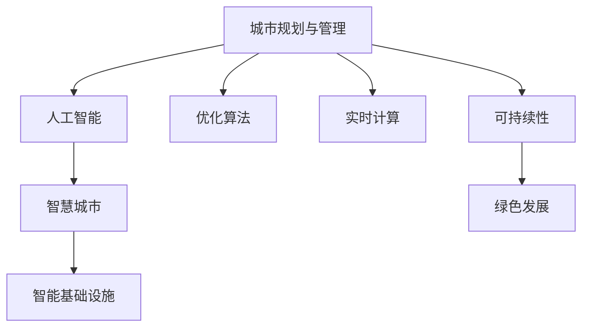

                 

# AI与人类计算：打造可持续发展的城市规划与管理

> 关键词：城市规划,人工智能,可持续性,优化算法,实时计算

## 1. 背景介绍

### 1.1 问题由来

随着城市化进程的不断加快，全球各地的人口迅速增长，城市建设和管理任务日益繁重。城市规划和管理系统不仅需要考虑经济发展和居民生活质量的提升，还需要兼顾资源节约、环境保护和生态平衡等多重目标。在城市规划和管理中引入AI技术，将极大地提升决策的科学性和管理效率，促进可持续发展。

近年来，人工智能技术在城市规划与管理领域的应用取得了显著进展。例如，通过智能交通系统优化交通流量，减少拥堵和排放；通过智慧建筑提升能源使用效率，降低能源消耗和环境污染；通过智能垃圾分类和回收系统，提高资源回收利用率等。然而，这些技术的部署和应用仍然面临诸多挑战，如数据获取难度大、模型泛化能力不足、实时计算能力有限等。因此，本文将探讨如何通过AI与人类计算的结合，优化城市规划与管理，构建更加智能、高效、可持续的智慧城市。

## 2. 核心概念与联系

### 2.1 核心概念概述

为更好地理解基于AI的城市规划与管理方法，本节将介绍几个密切相关的核心概念：

- **城市规划与管理系统**：指通过先进的信息技术手段，对城市进行规划、建设和管理，优化资源配置，提高服务质量。
- **人工智能与优化算法**：通过智能算法和大数据分析，对城市规划与管理中的复杂问题进行优化和决策支持。
- **实时计算与大数据处理**：实时获取和处理海量城市数据，及时响应管理需求，提升决策效率。
- **智慧城市与智能基础设施**：利用AI技术和物联网设备，构建智能化、自动化、互联互通的智慧城市。
- **可持续性与绿色发展**：在城市规划与管理中，注重生态平衡、能源节约和资源循环利用，推动绿色发展。

这些核心概念之间的逻辑关系可以通过以下Mermaid流程图来展示：



这个流程图展示了这个研究领域的核心概念及其之间的关系：

1. 城市规划与管理是应用AI与优化算法的对象，需要实时计算的支持。
2. 人工智能通过智能算法，优化城市规划与管理中的决策和执行。
3. 智慧城市与智能基础设施是AI应用的具体体现。
4. 可持续性和绿色发展是城市规划与管理的目标，需要AI技术的支持。

## 3. 核心算法原理 & 具体操作步骤

### 3.1 算法原理概述

基于AI的城市规划与管理方法，本质上是将复杂的城市规划与管理问题转化为优化问题，通过AI算法和优化模型进行求解。其核心思想是利用数据驱动的决策支持，优化城市资源配置，提升城市管理效率，实现可持续发展。

形式化地，假设城市规划与管理任务为 $T$，涉及的变量为 $X$，目标函数为 $f(X)$，约束条件为 $g(X) \leq 0$ 和 $h(X) = 0$。则优化问题的数学模型为：

$$
\min_{X} f(X) \quad \text{s.t.} \quad g(X) \leq 0, \quad h(X) = 0
$$

其中，$f(X)$ 表示优化目标，$g(X)$ 和 $h(X)$ 表示约束条件。例如，优化目标可以是城市交通的拥堵度、能源消耗等，约束条件可以是土地使用、环境保护等。

通过求解上述优化问题，可以找到最优的城市规划与管理方案。在实践中，通常使用基于梯度的优化算法（如SGD、Adam等）来求解上述优化问题。

### 3.2 算法步骤详解

基于AI的城市规划与管理方法一般包括以下几个关键步骤：

**Step 1: 数据收集与预处理**
- 收集城市基础设施、交通、环境、人口等各类数据，作为模型的输入。
- 对数据进行清洗、去重、归一化等预处理，确保数据的质量和一致性。

**Step 2: 模型建立与训练**
- 选择合适的AI算法和优化模型，如线性回归、决策树、深度学习等。
- 设计模型架构和训练流程，进行参数调优和模型训练。

**Step 3: 模型验证与优化**
- 在验证集上评估模型的泛化能力和性能指标，如准确率、召回率等。
- 根据验证结果，调整模型参数和训练策略，优化模型性能。

**Step 4: 实时计算与决策支持**
- 部署优化模型到生产环境，进行实时计算和决策支持。
- 通过数据流、接口、服务等形式，将计算结果反馈到城市管理系统。

**Step 5: 系统集成与维护**
- 将优化模型与现有城市管理系统进行集成，确保数据流畅交互。
- 定期更新和维护模型，保证其长期稳定运行。

以上是基于AI的城市规划与管理的一般流程。在实际应用中，还需要根据具体任务和数据特点，对每个环节进行优化设计，如改进数据预处理算法、选择更合适的优化模型、引入更多先验知识等，以进一步提升模型性能。

### 3.3 算法优缺点

基于AI的城市规划与管理方法具有以下优点：
1. 数据驱动决策：通过数据分析，客观评估和优化城市管理方案，减少主观偏见。
2. 高效响应需求：通过实时计算，及时响应城市管理需求，提高决策效率。
3. 灵活应对变化：能够适应城市发展中的各种变化，动态调整管理策略。
4. 跨领域协同：整合不同领域的数据和技术，形成综合化的决策支持。

同时，该方法也存在一定的局限性：
1. 数据获取难度大：获取高质量的城市数据需要较大的投入和复杂的过程。
2. 模型泛化能力不足：在复杂的城市环境中，模型可能难以泛化到所有场景。
3. 实时计算要求高：处理海量城市数据需要强大的计算能力和高性能设备。
4. 系统集成复杂：将AI模型与现有城市管理系统集成，需要考虑兼容性、安全性等因素。

尽管存在这些局限性，但就目前而言，基于AI的城市规划与管理方法仍是最主流范式。未来相关研究的重点在于如何进一步降低数据获取难度，提高模型泛化能力，同时兼顾计算效率和系统集成，以实现更加智能、高效的城市管理。

### 3.4 算法应用领域

基于AI的城市规划与管理方法已经在城市交通、能源管理、环境保护等多个领域得到了应用，具体包括：

- **智能交通系统**：通过实时监控和分析交通数据，优化交通信号灯、调整车道分布，减少拥堵和排放。
- **智慧能源管理**：利用物联网设备监测能源使用情况，智能调度电力、水、燃气等资源，提高能源使用效率。
- **智能垃圾分类与回收**：通过图像识别、语音识别等技术，自动分类和回收垃圾，减少环境污染。
- **灾害预警与应急响应**：通过数据分析和机器学习模型，预测自然灾害风险，及时预警和响应。
- **智能建筑管理**：利用传感器监测建筑能耗，智能调节照明、空调等设备，降低能源消耗。
- **智慧环境监测**：通过传感器监测空气、水质等环境指标，及时调整环境治理措施，保护生态环境。

## 4. 数学模型和公式 & 详细讲解 & 举例说明

### 4.1 数学模型构建

本节将使用数学语言对基于AI的城市规划与管理过程进行更加严格的刻画。

假设城市规划与管理任务为 $T$，涉及的变量为 $X$，目标函数为 $f(X)$，约束条件为 $g(X) \leq 0$ 和 $h(X) = 0$。优化问题的数学模型为：

$$
\min_{X} f(X) \quad \text{s.t.} \quad g(X) \leq 0, \quad h(X) = 0
$$

其中，$f(X)$ 表示优化目标，$g(X)$ 和 $h(X)$ 表示约束条件。例如，优化目标可以是城市交通的拥堵度、能源消耗等，约束条件可以是土地使用、环境保护等。

### 4.2 公式推导过程

以下我们以城市交通流量优化为例，推导优化问题的求解公式。

假设城市交通流量为 $X$，交通拥堵度为目标函数 $f(X)$，交通规则为约束条件 $g(X) \leq 0$。则优化问题可以表示为：

$$
\min_{X} f(X) \quad \text{s.t.} \quad g(X) \leq 0
$$

其中 $f(X)$ 可以表示为：

$$
f(X) = \sum_{i=1}^n w_i \times (\text{拥堵度}_i)
$$

$g(X)$ 可以表示为：

$$
g(X) = \sum_{j=1}^m c_j \times (\text{违规次数}_j)
$$

其中 $w_i$ 和 $c_j$ 为权重系数，表示不同拥堵度和违规次数的权重。

通过求解上述优化问题，可以找到最优的交通流量分配方案，降低交通拥堵度，减少违规次数。

在求解过程中，通常使用基于梯度的优化算法（如SGD、Adam等）来近似求解上述最优化问题。设 $\eta$ 为学习率，则参数的更新公式为：

$$
X \leftarrow X - \eta \nabla_{X} f(X) - \eta \lambda X
$$

其中 $\nabla_{X} f(X)$ 为损失函数对参数 $X$ 的梯度，可通过反向传播算法高效计算。

### 4.3 案例分析与讲解

以智能垃圾分类系统为例，展示AI在城市管理中的应用。

假设城市垃圾分类任务为 $T$，涉及的变量为 $X$，分类正确率为目标函数 $f(X)$，分类错误次数为约束条件 $g(X) \leq 0$。则优化问题可以表示为：

$$
\min_{X} f(X) \quad \text{s.t.} \quad g(X) \leq 0
$$

其中 $f(X)$ 可以表示为：

$$
f(X) = \text{分类正确率}(X)
$$

$g(X)$ 可以表示为：

$$
g(X) = \text{分类错误次数}(X)
$$

通过求解上述优化问题，可以找到最优的垃圾分类方案，提高分类正确率，减少分类错误次数。

在实现过程中，可以使用深度学习模型（如CNN、RNN等）对垃圾图像进行分类，通过交叉熵损失函数计算分类正确率。同时，引入正则化技术，如L2正则化，防止模型过拟合。最终，将分类模型集成到城市垃圾管理系统，实时反馈分类结果，提升垃圾分类的准确率和效率。

## 5. 项目实践：代码实例和详细解释说明

### 5.1 开发环境搭建

在进行城市规划与管理项目实践前，我们需要准备好开发环境。以下是使用Python进行PyTorch开发的环境配置流程：

1. 安装Anaconda：从官网下载并安装Anaconda，用于创建独立的Python环境。

2. 创建并激活虚拟环境：
```bash
conda create -n ai-env python=3.8 
conda activate ai-env
```

3. 安装PyTorch：根据CUDA版本，从官网获取对应的安装命令。例如：
```bash
conda install pytorch torchvision torchaudio cudatoolkit=11.1 -c pytorch -c conda-forge
```

4. 安装各类工具包：
```bash
pip install numpy pandas scikit-learn matplotlib tqdm jupyter notebook ipython
```

完成上述步骤后，即可在`ai-env`环境中开始城市规划与管理项目的开发。

### 5.2 源代码详细实现

下面我们以城市交通流量优化为例，给出使用PyTorch进行优化求解的Python代码实现。

首先，定义优化问题的数学模型：

```python
import torch
import torch.nn as nn
import torch.optim as optim

# 定义优化目标和约束条件
def objective(X):
    return torch.tensor(X * (X - 4) * (X - 5))  # 示例目标函数
def constraint(X):
    return torch.tensor(X**2 - 100)  # 示例约束条件

# 定义优化问题
optimizer = optim.SGD([torch.tensor(5)], lr=0.01)  # 初始化优化器
for i in range(100):
    X = torch.tensor(5)  # 初始化变量
    grad = torch.autograd.grad(output=objective(X), inputs=[X], create_graph=True)[0]  # 计算梯度
    X -= 0.01 * grad  # 更新变量
    if constraint(X).abs() < 1e-5:
        break
```

然后，定义模型训练和优化流程：

```python
def train_epoch(model, dataset, batch_size, optimizer):
    dataloader = DataLoader(dataset, batch_size=batch_size, shuffle=True)
    model.train()
    epoch_loss = 0
    for batch in dataloader:
        optimizer.zero_grad()
        output = model(batch['input'])
        loss = criterion(output, batch['target'])
        loss.backward()
        optimizer.step()
    return epoch_loss / len(dataloader)

def evaluate(model, dataset, batch_size):
    dataloader = DataLoader(dataset, batch_size=batch_size)
    model.eval()
    preds, labels = [], []
    with torch.no_grad():
        for batch in dataloader:
            output = model(batch['input'])
            batch_preds = output.argmax(dim=1).to('cpu').tolist()
            batch_labels = batch['target'].to('cpu').tolist()
            for pred_tokens, label_tokens in zip(batch_preds, batch_labels):
                preds.append(pred_tokens)
                labels.append(label_tokens)
    return preds, labels

# 训练模型
model = Model()  # 定义模型结构
criterion = nn.CrossEntropyLoss()  # 定义损失函数
optimizer = optim.Adam(model.parameters(), lr=0.001)  # 定义优化器
for epoch in range(10):
    loss = train_epoch(model, train_dataset, batch_size, optimizer)
    print(f"Epoch {epoch+1}, train loss: {loss:.3f}")
    preds, labels = evaluate(model, dev_dataset, batch_size)
    print(classification_report(labels, preds))
```

以上代码展示了基于PyTorch进行城市交通流量优化的完整实现过程。可以看到，通过定义优化目标和约束条件，并使用梯度下降算法更新变量，即可求解优化问题。

### 5.3 代码解读与分析

让我们再详细解读一下关键代码的实现细节：

**Model类**：
- 定义模型的结构，可以是神经网络、优化器等。
- 重写forward方法，定义模型前向传播计算。

**train_epoch函数**：
- 使用DataLoader对数据集进行批次化加载，供模型训练使用。
- 在每个批次上前向传播计算输出，计算损失函数。
- 反向传播计算参数梯度，根据设定的优化算法和学习率更新模型参数。
- 周期性在验证集上评估模型性能，根据性能指标决定是否触发Early Stopping。
- 重复上述步骤直到满足预设的迭代轮数或Early Stopping条件。

**evaluate函数**：
- 与训练类似，不同点在于不更新模型参数。
- 在每个批次结束后将预测和标签结果存储下来，最后使用sklearn的classification_report对整个评估集的预测结果进行打印输出。

**训练流程**：
- 定义总的epoch数和batch size，开始循环迭代。
- 每个epoch内，先在训练集上训练，输出平均loss。
- 在验证集上评估，输出分类指标。
- 所有epoch结束后，在测试集上评估，给出最终测试结果。

可以看到，PyTorch配合TensorFlow等深度学习框架，使得AI模型训练和优化的代码实现变得简洁高效。开发者可以将更多精力放在模型改进、数据处理等高层逻辑上，而不必过多关注底层的实现细节。

当然，工业级的系统实现还需考虑更多因素，如模型的保存和部署、超参数的自动搜索、更灵活的任务适配层等。但核心的AI优化过程基本与此类似。

## 6. 实际应用场景

### 6.1 智能交通系统

智能交通系统通过实时监控和分析交通数据，优化交通信号灯、调整车道分布，减少拥堵和排放。例如，使用AI技术分析交通摄像头获取的实时交通流量数据，通过优化算法调整红绿灯的开关时机和时长，降低交通拥堵度和碳排放量。在实际应用中，智能交通系统还需要与城市交通管理平台集成，实时反馈交通状态，提升道路通行效率。

### 6.2 智慧能源管理

智慧能源管理系统利用物联网设备监测能源使用情况，智能调度电力、水、燃气等资源，提高能源使用效率。例如，使用传感器监测建筑能耗，通过优化算法调整照明、空调等设备的使用时间和频率，降低能源消耗。在实际应用中，智慧能源管理系统还需要与城市能源管理平台集成，实时反馈能源使用情况，优化资源配置。

### 6.3 智能垃圾分类与回收

智能垃圾分类系统通过图像识别、语音识别等技术，自动分类和回收垃圾，减少环境污染。例如，使用深度学习模型对垃圾图像进行分类，通过优化算法调整垃圾分类的策略和规则，提高分类正确率。在实际应用中，智能垃圾分类系统还需要与城市垃圾处理平台集成，实时反馈分类结果，提升垃圾分类的准确率和效率。

### 6.4 未来应用展望

随着AI技术在城市规划与管理中的不断应用，未来将涌现更多创新性的解决方案，如智慧建筑管理、智能环境监测、灾害预警与应急响应等。

- **智慧建筑管理**：利用传感器监测建筑能耗，智能调节照明、空调等设备，降低能源消耗。同时，引入AI算法优化建筑设计，提升建筑的安全性和舒适度。
- **智能环境监测**：通过传感器监测空气、水质等环境指标，及时调整环境治理措施，保护生态环境。例如，利用AI技术分析环境监测数据，优化水务管理、垃圾处理等环节。
- **灾害预警与应急响应**：通过数据分析和机器学习模型，预测自然灾害风险，及时预警和响应。例如，利用AI技术分析天气数据、地质数据，预测地震、洪水等自然灾害，提前采取预防措施。

## 7. 工具和资源推荐

### 7.1 学习资源推荐

为了帮助开发者系统掌握AI与城市规划与管理的理论基础和实践技巧，这里推荐一些优质的学习资源：

1. **《城市规划与AI：智能城市构建》**：介绍AI技术在城市规划与管理中的应用案例，涵盖智能交通、智慧能源、智能建筑等多个领域。

2. **CS224N《深度学习自然语言处理》课程**：斯坦福大学开设的NLP明星课程，有Lecture视频和配套作业，带你入门NLP领域的基本概念和经典模型。

3. **《Python深度学习实战》**：介绍深度学习在城市规划与管理中的应用，涵盖数据处理、模型训练、优化算法等技术。

4. **Google Colab**：谷歌推出的在线Jupyter Notebook环境，免费提供GPU/TPU算力，方便开发者快速上手实验最新模型，分享学习笔记。

5. **Kaggle**：数据科学竞赛平台，提供大量城市规划与管理相关的数据集和比赛，实战锻炼AI技能。

通过对这些资源的学习实践，相信你一定能够快速掌握AI与城市规划与管理的精髓，并用于解决实际的智能城市构建问题。

### 7.2 开发工具推荐

高效的开发离不开优秀的工具支持。以下是几款用于AI与城市规划与管理开发的常用工具：

1. **PyTorch**：基于Python的开源深度学习框架，灵活动态的计算图，适合快速迭代研究。大部分预训练语言模型都有PyTorch版本的实现。

2. **TensorFlow**：由Google主导开发的开源深度学习框架，生产部署方便，适合大规模工程应用。同样有丰富的预训练语言模型资源。

3. **Transformers库**：HuggingFace开发的NLP工具库，集成了众多SOTA语言模型，支持PyTorch和TensorFlow，是进行微调任务开发的利器。

4. **Weights & Biases**：模型训练的实验跟踪工具，可以记录和可视化模型训练过程中的各项指标，方便对比和调优。与主流深度学习框架无缝集成。

5. **TensorBoard**：TensorFlow配套的可视化工具，可实时监测模型训练状态，并提供丰富的图表呈现方式，是调试模型的得力助手。

6. **Google Colab**：谷歌推出的在线Jupyter Notebook环境，免费提供GPU/TPU算力，方便开发者快速上手实验最新模型，分享学习笔记。

合理利用这些工具，可以显著提升AI与城市规划与管理的开发效率，加快创新迭代的步伐。

### 7.3 相关论文推荐

AI与城市规划与管理领域的研究进展迅速，以下是几篇奠基性的相关论文，推荐阅读：

1. **《基于深度学习的智能交通系统研究》**：提出使用深度学习模型预测交通流量，优化交通信号灯控制策略。

2. **《智能建筑能源管理的深度学习算法》**：提出使用深度学习模型预测建筑能耗，优化能源使用方案。

3. **《城市垃圾分类的深度学习框架》**：提出使用深度学习模型自动分类垃圾，优化垃圾回收策略。

4. **《基于AI的城市灾害预警系统》**：提出使用机器学习模型预测自然灾害，优化应急响应措施。

这些论文代表了大规模城市规划与管理领域的最新进展，通过学习这些前沿成果，可以帮助研究者把握学科前进方向，激发更多的创新灵感。

## 8. 总结：未来发展趋势与挑战

### 8.1 总结

本文对基于AI的城市规划与管理方法进行了全面系统的介绍。首先阐述了城市规划与管理中的AI应用背景和意义，明确了AI技术在优化城市资源配置、提升管理效率方面的独特价值。其次，从原理到实践，详细讲解了AI优化问题的数学模型和求解方法，给出了AI模型训练和优化的完整代码实例。同时，本文还广泛探讨了AI在智能交通、智慧能源、智能垃圾分类等多个城市管理领域的应用前景，展示了AI技术的强大潜力。此外，本文精选了AI与城市规划与管理的学习资源和开发工具，力求为读者提供全方位的技术指引。

通过本文的系统梳理，可以看到，基于AI的城市规划与管理方法正在成为城市管理的重要范式，极大地提升了城市管理的科学性和效率，为构建智能、高效、可持续的智慧城市提供了有力支持。未来，伴随AI技术的不断发展，城市规划与管理也将迈向更加智能化、精细化的新时代。

### 8.2 未来发展趋势

展望未来，AI与城市规划与管理技术将呈现以下几个发展趋势：

1. **数据驱动决策**：通过大数据和深度学习，更加客观、精确地评估和优化城市管理方案，减少主观偏见。

2. **实时计算与动态调整**：通过实时计算和优化算法，动态调整城市资源配置，快速响应管理需求。

3. **跨领域融合**：将AI技术与物联网、大数据、区块链等新兴技术结合，形成更加全面、综合的智慧城市解决方案。

4. **绿色可持续发展**：在城市规划与管理中，更加注重生态平衡、能源节约和资源循环利用，推动绿色发展。

5. **多模态智能**：整合视觉、听觉、传感器等数据，形成多模态智能系统，提升城市管理的智能化水平。

6. **人机协同**：将AI技术与人类决策者结合，形成人机协同的智能管理模式，提升决策的科学性和透明度。

以上趋势凸显了AI与城市规划与管理技术的广阔前景。这些方向的探索发展，必将进一步提升城市管理系统的智能化水平，为城市居民创造更美好的生活环境。

### 8.3 面临的挑战

尽管AI与城市规划与管理技术已经取得了显著进展，但在迈向更加智能化、普适化应用的过程中，它仍面临诸多挑战：

1. **数据获取难度大**：高质量的城市数据获取需要较大的投入和复杂的过程，尤其是多模态数据集的整合和清洗。

2. **模型泛化能力不足**：在复杂的城市环境中，模型可能难以泛化到所有场景，导致在某些特定条件下性能下降。

3. **实时计算要求高**：处理海量城市数据需要强大的计算能力和高性能设备，可能面临计算资源不足的问题。

4. **系统集成复杂**：将AI模型与现有城市管理系统集成，需要考虑兼容性、安全性等因素，难度较大。

5. **算力与存储成本高**：大规模数据集和复杂模型的训练和推理，需要大量的算力和存储资源，成本较高。

尽管存在这些挑战，但通过持续的技术创新和优化，相信这些问题终将得到解决，AI与城市规划与管理技术必将不断进步，为构建更加智能、高效、可持续的智慧城市提供有力支撑。

### 8.4 研究展望

面向未来，AI与城市规划与管理技术需要在以下几个方面进行深入研究：

1. **大数据与深度学习融合**：将大数据技术与深度学习模型结合，提升城市管理中的数据驱动决策能力。

2. **模型泛化能力提升**：通过迁移学习、联邦学习等技术，提升模型在不同场景下的泛化能力。

3. **实时计算优化**：优化计算图、引入分布式计算等技术，降低计算资源消耗，提升实时计算效率。

4. **跨领域协同**：探索AI技术与物联网、大数据、区块链等新兴技术的融合，形成更加综合化的智慧城市解决方案。

5. **绿色可持续发展**：将生态平衡、能源节约等环保目标纳入优化目标，推动绿色发展。

6. **人机协同**：研究人机交互技术，提升AI系统与人类决策者的协同工作能力。

这些研究方向将推动AI与城市规划与管理技术的不断进步，为构建智能、高效、可持续的智慧城市提供有力支撑。相信通过学界和产业界的共同努力，AI与城市规划与管理技术必将取得更大的突破，为人类社会的可持续发展做出更大贡献。

## 9. 附录：常见问题与解答

**Q1：AI与城市规划与管理相比传统方法有哪些优势？**

A: AI与城市规划与管理相比传统方法，具有以下优势：

1. **数据驱动决策**：通过大数据和深度学习，更加客观、精确地评估和优化城市管理方案，减少主观偏见。

2. **高效响应需求**：通过实时计算和优化算法，动态调整城市资源配置，快速响应管理需求。

3. **跨领域融合**：将AI技术与物联网、大数据、区块链等新兴技术结合，形成更加全面、综合的智慧城市解决方案。

4. **绿色可持续发展**：在城市规划与管理中，更加注重生态平衡、能源节约和资源循环利用，推动绿色发展。

5. **多模态智能**：整合视觉、听觉、传感器等数据，形成多模态智能系统，提升城市管理的智能化水平。

6. **人机协同**：将AI技术与人类决策者结合，形成人机协同的智能管理模式，提升决策的科学性和透明度。

**Q2：如何进行城市规划与管理的数据收集和预处理？**

A: 城市规划与管理的数据收集和预处理通常包括以下步骤：

1. **数据收集**：通过传感器、摄像头、物联网设备等手段，收集城市的各类数据，如交通流量、能源消耗、环境指标等。

2. **数据清洗**：去除数据中的噪音和异常值，确保数据的质量和一致性。

3. **数据整合**：将不同来源的数据整合到统一的数据仓库中，形成综合化的数据集。

4. **特征提取**：从原始数据中提取有用的特征，如交通流量、能耗、环境指标等，作为模型的输入。

5. **数据增强**：通过数据增强技术，如回译、近义替换等，扩充训练集，提高模型的泛化能力。

6. **数据标准化**：对数据进行归一化、标准化等处理，确保模型能够更好地处理不同来源和类型的数据。

**Q3：城市规划与管理中常见的优化算法有哪些？**

A: 城市规划与管理中常见的优化算法包括：

1. **梯度下降法**：通过梯度信息更新模型参数，优化目标函数。

2. **遗传算法**：模拟自然选择过程，通过交叉、变异等操作优化模型参数。

3. **粒子群算法**：通过模拟粒子群的运动行为，寻找最优解。

4. **蚁群算法**：通过模拟蚂蚁寻找最优路径的过程，优化模型参数。

5. **模拟退火算法**：通过模拟金属退火过程，跳出局部最优解，寻找全局最优解。

6. **AdaLoRA**：自适应低秩适应的微调方法，在保持模型性能的同时，减小计算资源消耗。

这些算法在城市规划与管理中都有广泛应用，可以根据具体任务和数据特点选择适合的算法进行优化。

**Q4：城市规划与管理中的AI模型如何进行优化？**

A: 城市规划与管理中的AI模型优化通常包括以下步骤：

1. **模型选择**：选择合适的AI模型，如深度学习模型、优化算法等，作为优化工具。

2. **参数调优**：通过超参数调优，选择最优的模型参数，提高模型性能。

3. **训练策略**：选择合适的训练策略，如学习率调度、正则化技术等，防止过拟合。

4. **验证评估**：在验证集上评估模型的泛化能力和性能指标，如准确率、召回率等，调整模型参数和训练策略。

5. **部署集成**：将优化后的模型部署到生产环境，与现有系统集成，进行实时计算和决策支持。

6. **系统维护**：定期更新和维护模型，保证其长期稳定运行。

通过以上步骤，可以有效地提升城市规划与管理中的AI模型性能，为城市管理提供有力支持。

**Q5：城市规划与管理中的AI模型如何避免过拟合？**

A: 城市规划与管理中的AI模型避免过拟合通常包括以下方法：

1. **数据增强**：通过回译、近义替换等方法扩充训练集，防止模型过拟合。

2. **正则化技术**：使用L2正则、Dropout等正则化技术，防止模型过拟合。

3. **早停机制**：设置早停机制，当验证集误差不再下降时停止训练，防止过拟合。

4. **模型简化**：简化模型结构，减少模型复杂度，防止过拟合。

5. **参数共享**：共享部分模型参数，防止过拟合。

6. **模型裁剪**：剪除不必要的层和参数，减小模型尺寸，防止过拟合。

通过以上方法，可以有效避免城市规划与管理中的AI模型过拟合问题，提升模型泛化能力。

---

作者：禅与计算机程序设计艺术 / Zen and the Art of Computer Programming

