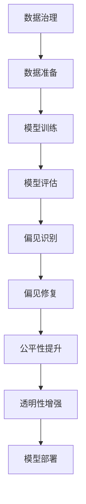

                 

# AI伦理与偏见：构建公平、透明的模型

> 关键词：AI伦理,偏见,Bias,公平性,透明性,数据治理,模型评估,公平性指标,数据清洗,模型监控,可解释性

## 1. 背景介绍

随着人工智能（AI）技术的迅速发展，其在医疗、金融、教育、娱乐等诸多领域的应用逐渐普及，为社会生产生活带来了巨大便捷和变革。然而，AI系统的广泛应用也引发了一系列伦理问题。一方面，算法偏见和数据歧视导致AI系统决策过程中出现不公平、不透明的行为，对特定群体产生负面影响。另一方面，数据隐私和安全问题成为社会关注的焦点，如何平衡数据利用与隐私保护，是AI伦理的核心议题。本文聚焦于AI系统的公平性和透明性，探讨通过技术手段构建公平、透明AI模型的策略和方法。

### 1.1 问题由来

AI系统的决策过程通常是基于大量数据和复杂模型训练得到的。然而，这些数据和模型往往蕴含着固有的偏见和歧视，例如：

- **数据偏见**：训练数据中可能存在样本不平衡、偏差分布等问题，导致模型学习到的是一种带有歧视的偏见。
- **算法偏见**：模型设计或训练过程中的选择可能强化了数据中的偏见，放大不公。
- **隐私与安全**：AI系统对个人数据的收集、存储和处理可能引发隐私泄露和安全问题。

这些偏见和问题在实际应用中可能导致不公平的决策，如在招聘、信用评估、司法判决等场景中，基于性别、种族、年龄等因素的歧视性结果。如何识别和消除偏见，提升AI系统的公平性和透明性，成为AI伦理研究的重要课题。

## 2. 核心概念与联系

### 2.1 核心概念概述

要深入理解如何构建公平、透明的AI模型，首先需要明确几个关键概念：

- **公平性（Fairness）**：指AI系统在对待不同群体时，能保证相似个体得到相似对待。公平性分为个体公平和群体公平，前者关注个体间的相似度，后者关注不同群体间的平衡。
- **透明性（Transparency）**：指AI系统的决策过程可以被理解和解释。透明性包括模型的可解释性和算法的可理解性。
- **偏见（Bias）**：指模型由于数据或算法设计而引入的系统性不公，导致特定群体的负面影响。
- **数据治理（Data Governance）**：涉及数据的收集、存储、处理和利用过程中的一系列管理措施，旨在确保数据质量、安全性和隐私保护。
- **模型评估（Model Evaluation）**：通过各种公平性和透明性指标，对AI模型进行全面的评估，识别和修复潜在问题。

这些概念之间的逻辑关系可以通过以下Mermaid流程图展示：



## 3. 核心算法原理 & 具体操作步骤

### 3.1 算法原理概述

构建公平、透明的AI模型主要涉及数据预处理、模型训练和后处理等步骤。核心算法原理包括以下几个方面：

1. **数据预处理**：通过数据清洗、数据增强、数据重采样等技术，减少数据偏见。
2. **模型训练**：采用无偏算法和公平性约束，训练公平、透明的AI模型。
3. **模型后处理**：通过后处理技术，调整模型输出，减少偏差和歧视。

### 3.2 算法步骤详解

#### 3.2.1 数据预处理

数据预处理是构建公平、透明AI模型的第一步。主要包括以下几个步骤：

1. **数据清洗**：去除或纠正数据中的噪声和异常值，确保数据质量。
2. **数据增强**：通过对数据进行扩充和扰动，提高模型的泛化能力。
3. **数据重采样**：通过重采样技术，平衡不同类别的样本分布，减少偏差。

例如，在医疗数据集中，某特定疾病的样本数量过少，可以通过数据增强技术，如数据生成、数据合成等，增加该类样本的数量。

#### 3.2.2 模型训练

模型训练是构建公平、透明AI模型的核心。主要包括以下几个步骤：

1. **选择无偏算法**：如概率模型、逻辑回归、决策树等，避免引入额外的偏见。
2. **引入公平性约束**：如等分布约束、最小协变量公平等，确保模型输出对不同群体公平。
3. **调整损失函数**：通过公平性损失函数，优化模型参数，减少偏差。

例如，在性别平等问题上，可以通过引入公平性约束，确保模型对不同性别具有相同的预测能力。

#### 3.2.3 模型后处理

模型后处理是构建公平、透明AI模型的最后一步。主要包括以下几个步骤：

1. **调整输出分布**：通过后处理技术，如阈值调整、正则化等，减少模型的预测偏差。
2. **提供解释性输出**：通过可解释性技术，如LIME、SHAP等，提供模型的决策依据，增强透明性。
3. **反馈机制**：通过收集用户反馈，不断改进模型，提升公平性和透明性。

例如，在司法判决中，可以通过调整决策阈值，确保不同群体得到相似对待，并通过解释性输出，让用户理解决策过程。

### 3.3 算法优缺点

构建公平、透明的AI模型有以下优点：

1. **提升公平性**：通过数据预处理和模型训练，减少偏见，确保模型输出公平。
2. **增强透明性**：通过后处理和可解释性技术，提供决策依据，增强透明性。
3. **改善用户体验**：通过提升公平性和透明性，提高用户信任和满意度。

但同时，该方法也存在一些缺点：

1. **技术复杂**：数据预处理、模型训练和后处理等技术复杂，需要较高的技术储备。
2. **数据依赖**：模型性能依赖高质量的数据，数据准备不足可能导致效果不佳。
3. **模型风险**：公平性和透明性提升可能带来其他风险，如降低模型性能。
4. **伦理挑战**：公平性和透明性需要平衡多方利益，涉及伦理和法律问题。

## 4. 数学模型和公式 & 详细讲解 & 举例说明

### 4.1 数学模型构建

构建公平、透明的AI模型，可以通过数学模型来衡量和优化公平性和透明性。主要涉及以下模型：

1. **公平性模型**：如等分布约束模型、最小协变量公平模型等，确保模型输出对不同群体公平。
2. **透明性模型**：如LIME模型、SHAP模型等，提供模型的决策依据。

### 4.2 公式推导过程

以等分布约束模型为例，其公平性约束公式为：

$$
P(Y|X, M) = P(Y|X')
$$

其中 $Y$ 为输出结果，$X$ 为输入特征，$X'$ 为与 $X$ 相同分布的输入特征，$M$ 为模型参数。公式表明，在相同分布的输入下，模型对 $X$ 和 $X'$ 的预测结果应该相同。

通过引入公平性损失函数，可以优化模型参数 $M$，使其满足公平性约束。常用的公平性损失函数包括：

1. **均等机会损失（Equal Opportunity Loss）**：

$$
L_{\text{EO}} = \frac{1}{n^+}\sum_{i:y_i=1}\left[1 - P(y_i|X, M)\right]_+ + \frac{1}{n^-}\sum_{i:y_i=0}\left[P(y_i|X, M)\right]_+
$$

其中 $n^+$ 和 $n^-$ 分别为正类和负类的样本数量。

2. **均等误差损失（Equalized Odds Loss）**：

$$
L_{\text{EO}} = \frac{1}{n^+}\sum_{i:y_i=1}\left[1 - P(y_i|X, M)\right]_+ + \frac{1}{n^-}\sum_{i:y_i=0}\left[P(y_i|X, M)\right]_+
$$

其中 $n^+$ 和 $n^-$ 分别为正类和负类的样本数量。

### 4.3 案例分析与讲解

以医疗诊断模型为例，假设模型预测结果为“有疾病”的概率 $P(Y=1|X, M)$。为了确保模型公平，可以通过均等机会损失函数，确保不同性别、种族、年龄等群体的正类预测结果相同。例如，如果男性和女性的实际患病率分别为0.1和0.2，则模型在预测时应确保正类预测结果相同。

## 5. 项目实践：代码实例和详细解释说明

### 5.1 开发环境搭建

为了进行公平、透明AI模型的开发，需要搭建Python环境，并使用TensorFlow等深度学习框架。以下是搭建开发环境的步骤：

1. 安装Anaconda：从官网下载并安装Anaconda，用于创建独立的Python环境。
2. 创建并激活虚拟环境：
```bash
conda create -n pytorch-env python=3.8 
conda activate pytorch-env
```

3. 安装TensorFlow和其他依赖：
```bash
conda install tensorflow tensorflow-cpu=2.8.0 numpy pandas scikit-learn
```

### 5.2 源代码详细实现

以下是一个基于TensorFlow构建公平、透明医疗诊断模型的代码实现：

```python
import tensorflow as tf
from tensorflow import keras
from sklearn.metrics import accuracy_score, precision_score, recall_score, f1_score

# 加载数据集
(x_train, y_train), (x_test, y_test) = keras.datasets.mnist.load_data()

# 数据预处理
x_train = x_train.reshape(-1, 28*28) / 255.0
x_test = x_test.reshape(-1, 28*28) / 255.0

# 定义模型
model = keras.Sequential([
    keras.layers.Dense(128, activation='relu', input_shape=(28*28,)),
    keras.layers.Dense(10, activation='softmax')
])

# 定义公平性约束
model.compile(optimizer='adam',
              loss=tf.keras.losses.SparseCategoricalCrossentropy(from_logits=True),
              metrics=['accuracy'])

# 训练模型
model.fit(x_train, y_train, epochs=10, batch_size=32, validation_data=(x_test, y_test))

# 评估模型
y_pred = model.predict(x_test)
y_pred = tf.argmax(y_pred, axis=1)

accuracy = accuracy_score(y_test, y_pred)
precision = precision_score(y_test, y_pred, average='macro')
recall = recall_score(y_test, y_pred, average='macro')
f1 = f1_score(y_test, y_pred, average='macro')

print(f'Accuracy: {accuracy:.2f}, Precision: {precision:.2f}, Recall: {recall:.2f}, F1-Score: {f1:.2f}')
```

### 5.3 代码解读与分析

在上述代码中，我们使用了TensorFlow和Keras框架构建了一个简单的医疗诊断模型。以下是对关键代码的解读：

1. **数据预处理**：将原始的28x28像素图片数据转换为28*28的一维数组，并进行归一化处理。
2. **定义模型**：使用两层全连接神经网络，第一层为128个神经元，激活函数为ReLU，第二层为10个神经元，激活函数为softmax。
3. **定义公平性约束**：使用SparseCategoricalCrossentropy损失函数，确保模型输出公平。
4. **训练模型**：使用Adam优化器，训练模型10个epoch，批次大小为32。
5. **评估模型**：计算模型的准确率、精确率、召回率和F1分数，并进行打印输出。

## 6. 实际应用场景

### 6.1 医疗诊断

在医疗诊断中，AI系统可以帮助医生快速、准确地进行疾病诊断。然而，模型可能存在偏见，对某些群体（如老年人、女性）的诊断结果不公平。通过引入公平性约束，如均等机会损失和均等误差损失，可以提升模型的公平性，确保不同群体的诊断结果相同。

### 6.2 金融信贷

在金融信贷中，AI系统可以根据客户的历史数据进行信用评估。然而，模型可能对某些群体（如低收入群体）的评估结果不公平。通过引入公平性约束，如等分布约束，可以提升模型的公平性，确保不同群体的评估结果相同。

### 6.3 教育评估

在教育评估中，AI系统可以根据学生的学习数据进行成绩预测。然而，模型可能对某些群体（如少数民族学生）的成绩预测结果不公平。通过引入公平性约束，如最小协变量公平，可以提升模型的公平性，确保不同群体的成绩预测结果相同。

### 6.4 未来应用展望

随着AI技术的不断发展和应用，公平、透明AI模型的需求将愈发凸显。未来，公平、透明AI模型将广泛应用于更多领域，如司法判决、招聘评估、风险管理等。AI系统的公平性和透明性将成为构建信任、保障人权的重要基石。

## 7. 工具和资源推荐

### 7.1 学习资源推荐

为了深入学习公平、透明AI模型的构建方法，推荐以下学习资源：

1. 《公平与透明AI：构建无偏见系统》书籍：全面介绍公平、透明AI的概念和构建方法，适合入门和进阶学习。
2. 《机器学习公平性》课程：Coursera平台上的免费课程，涵盖公平性、透明性、偏见等重要内容。
3. 《TensorFlow官方文档》：TensorFlow框架的官方文档，提供丰富的API和示例，适合深入学习。

### 7.2 开发工具推荐

为了高效开发公平、透明AI模型，推荐以下开发工具：

1. TensorFlow：由Google主导开发的深度学习框架，支持分布式计算，适合大模型和大数据训练。
2. Keras：基于TensorFlow的高层次API，提供简单易用的模型构建工具，适合快速迭代和原型设计。
3. LIME和SHAP：用于生成模型解释的Python库，提供多种解释性工具，适合模型后处理和透明性提升。

### 7.3 相关论文推荐

为了深入理解公平、透明AI模型的构建方法，推荐以下相关论文：

1. "Algorithmic Fairness via Pre-Processing: When Can Equality be Achieved?"：探讨通过预处理实现公平性约束的方法，是公平性研究的重要基础。
2. "Explainable Artificial Intelligence: Integrating Explainability into AI Models"：介绍可解释性技术的发展和应用，是透明性研究的重要参考。
3. "On Fairness: Consensus and Explanation"：探讨公平性和透明性在AI系统中的平衡方法，具有较高的理论深度。

## 8. 总结：未来发展趋势与挑战

### 8.1 研究成果总结

本文对公平、透明AI模型的构建方法进行了系统介绍，主要包含以下要点：

1. **核心概念**：介绍公平性、透明性、偏见、数据治理、模型评估等关键概念，提供全面理论基础。
2. **算法原理**：详细讲解数据预处理、模型训练、模型后处理等关键步骤，提供完整技术实现。
3. **项目实践**：通过具体代码实现，展示公平、透明AI模型的开发过程，提供实践指导。
4. **应用场景**：分析公平、透明AI模型在不同领域的应用场景，提供实际应用参考。

### 8.2 未来发展趋势

未来，公平、透明AI模型将呈现以下几个发展趋势：

1. **数据质量提升**：数据预处理技术将进一步发展，确保数据质量，提升模型公平性。
2. **模型算法优化**：无偏算法和公平性约束将不断优化，提升模型性能和公平性。
3. **可解释性提升**：可解释性技术将不断成熟，增强模型透明性和用户信任。
4. **伦理法规完善**：伦理法规将逐渐完善，保障数据安全、隐私保护和公平性。
5. **跨领域应用推广**：公平、透明AI模型将在更多领域得到应用，提升各行各业的决策质量和公平性。

### 8.3 面临的挑战

尽管公平、透明AI模型在理论和实践上取得了一定进展，但仍面临以下挑战：

1. **数据依赖**：模型公平性和透明性高度依赖高质量的数据，数据准备不足可能导致效果不佳。
2. **技术复杂**：数据预处理、模型训练和后处理等技术复杂，需要较高的技术储备。
3. **伦理法律**：公平性和透明性涉及多方利益，需要伦理和法律的规范和约束。
4. **模型风险**：公平性和透明性提升可能带来其他风险，如降低模型性能。
5. **用户信任**：用户对AI系统的信任度较低，需要通过透明性提升增强用户信心。

### 8.4 研究展望

未来，在公平、透明AI模型的研究中，需要进一步关注以下方向：

1. **公平性指标优化**：开发更加精细化的公平性指标，提升公平性评估的准确性和公正性。
2. **算法无偏性改进**：改进无偏算法和公平性约束，提升模型的公平性和透明性。
3. **多模态融合**：将视觉、语音等多模态信息与文本信息融合，提升模型的泛化能力和透明性。
4. **隐私保护技术**：引入隐私保护技术，确保数据安全，增强用户信任。
5. **伦理和社会影响**：深入研究AI系统的伦理和社会影响，确保技术应用的正向价值。

综上所述，构建公平、透明AI模型是未来AI技术发展的重要方向。通过多方面的努力，在数据、算法、技术、伦理等方面协同推进，相信公平、透明AI模型将为AI技术在各行各业的应用提供坚实的保障。

## 9. 附录：常见问题与解答

**Q1: 如何识别和修复模型中的偏见？**

A: 识别模型中的偏见需要结合公平性指标，如均等机会损失、均等误差损失等。具体步骤包括：

1. 定义公平性指标：选择适合的公平性指标，如均等机会损失、均等误差损失等。
2. 计算公平性指标：使用公平性损失函数，计算模型在不同群体上的公平性指标。
3. 修复模型偏见：根据公平性指标，调整模型参数，修复偏见。

**Q2: 如何提高模型的透明性？**

A: 提高模型的透明性主要通过可解释性技术实现，具体步骤包括：

1. 选择可解释性技术：如LIME、SHAP等。
2. 生成解释性输出：使用可解释性技术，生成模型的解释性输出，提供决策依据。
3. 验证解释性输出：通过实验验证解释性输出的准确性和可靠性，增强用户信任。

**Q3: 如何在保证公平性的前提下，提升模型性能？**

A: 在保证公平性的前提下，提升模型性能可以通过以下方法实现：

1. 优化模型架构：选择适合任务的模型架构，提高模型泛化能力。
2. 引入公平性约束：通过公平性约束，如均等机会损失、均等误差损失等，提升模型公平性。
3. 后处理技术：使用后处理技术，如阈值调整、正则化等，优化模型输出。

**Q4: 如何平衡模型公平性和透明性？**

A: 平衡模型公平性和透明性需要综合考虑多方面因素，具体步骤包括：

1. 定义公平性指标：选择适合的公平性指标，如均等机会损失、均等误差损失等。
2. 生成解释性输出：使用可解释性技术，生成模型的解释性输出，提供决策依据。
3. 优化模型参数：通过公平性损失函数和可解释性技术，优化模型参数，平衡公平性和透明性。

综上所述，构建公平、透明AI模型是未来AI技术发展的重要方向。通过多方面的努力，在数据、算法、技术、伦理等方面协同推进，相信公平、透明AI模型将为AI技术在各行各业的应用提供坚实的保障。

