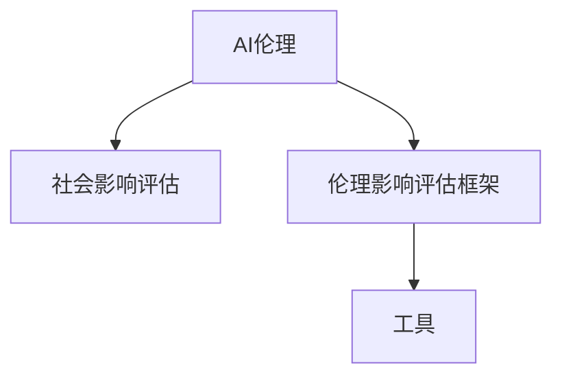

                 

# AI伦理的社会影响评估:伦理影响评估框架和工具

> 关键词：AI伦理,社会影响评估,伦理影响评估框架,工具,技术,应用场景

## 1. 背景介绍

### 1.1 问题由来
随着人工智能技术的快速发展和广泛应用，AI伦理问题逐渐成为社会各界关注的焦点。无论是自动驾驶车辆的安全问题，还是面部识别的隐私侵犯，AI技术在带来巨大便利的同时，也引发了一系列伦理和法律挑战。如何在技术创新和伦理约束之间找到平衡，成为摆在研究者和政策制定者面前的重要课题。

### 1.2 问题核心关键点
AI伦理的社会影响评估，旨在通过科学方法和工具，全面评估AI技术在应用过程中对社会、环境和个体产生的潜在影响，包括正面影响和负面影响。其核心关键点包括：

- **全面性**：评估应涵盖AI技术的各个环节，从数据采集、模型训练到应用部署，确保覆盖所有潜在风险点。
- **系统性**：采用系统化的方法和工具，构建评估框架，确保评估过程的科学性和客观性。
- **可操作性**：提供实用的评估工具和模型，方便业界和政府机构在实际应用中进行评估和监管。

## 2. 核心概念与联系

### 2.1 核心概念概述

为更好地理解AI伦理的社会影响评估，本节将介绍几个密切相关的核心概念：

- **AI伦理**：涉及AI技术的伦理标准和规范，旨在确保技术应用符合人类的价值观和道德标准。
- **社会影响评估**：通过定量或定性方法，评估某一行为或政策对社会产生的影响。
- **伦理影响评估框架**：系统化的评估方法，涵盖多个评估维度，如隐私、安全、公平等。
- **工具**：用于辅助评估过程的软件和算法，如问卷调查工具、仿真模型等。

这些核心概念之间的逻辑关系可以通过以下Mermaid流程图来展示：



这个流程图展示了几者的核心关系：

1. **AI伦理**是整个评估的基础，决定了评估的标准和方向。
2. **社会影响评估**是评估的核心过程，通过科学方法衡量AI技术的社会影响。
3. **伦理影响评估框架**提供了评估的规范和维度，确保评估的全面性和系统性。
4. **工具**是辅助评估的具体手段，提供了数据收集、处理和分析的便利。

这些概念共同构成了AI伦理社会影响评估的理论基础和实践指南。

## 3. 核心算法原理 & 具体操作步骤

### 3.1 算法原理概述

AI伦理的社会影响评估，本质上是一个多维度的综合评估过程，涉及多个学科领域，如伦理学、社会学、计算机科学等。其核心算法原理可以概括为以下几个方面：

- **数据收集与处理**：通过问卷调查、实地考察等方式，收集相关数据，如AI技术的实际应用案例、公众反馈、政策法规等。
- **风险分析与建模**：构建数学模型，对数据进行分析，识别AI技术带来的潜在风险，如隐私泄露、就业影响、偏见歧视等。
- **影响评估与可视化**：采用量化或定性方法，评估AI技术对社会、环境、个体等的影响，并通过图表等方式可视化结果。
- **政策建议与优化**：根据评估结果，提出相应的政策建议和优化方案，以减轻负面影响，增强AI技术的社会接受度。

### 3.2 算法步骤详解

AI伦理的社会影响评估一般包括以下几个关键步骤：

**Step 1: 准备数据和评估目标**
- 确定评估的AI技术领域，如自动驾驶、面部识别、智能客服等。
- 收集相关的背景资料、公众意见和政策法规，构建评估所需的数据集。
- 明确评估的目标和关键指标，如隐私保护、就业影响、偏见和歧视等。

**Step 2: 设计评估框架**
- 构建多维度的评估框架，涵盖隐私、安全、公平、效率等关键维度。
- 确定评估指标体系和评估方法，如问卷调查、案例分析、仿真建模等。
- 选择适当的量化和定性方法，确保评估结果的科学性和可靠性。

**Step 3: 实施评估过程**
- 采用问卷调查、实地考察等方式，收集相关数据。
- 对数据进行清洗和预处理，确保数据质量。
- 应用评估框架和模型，对数据进行分析，识别潜在风险和影响。
- 对评估结果进行综合分析，识别主要问题和改进方向。

**Step 4: 可视化与报告**
- 将评估结果以图表、报告等形式进行可视化展示。
- 撰写详细的评估报告，提供明确的结论和政策建议。
- 组织专家评审会，讨论评估结果和建议的可行性。

**Step 5: 政策建议与实施**
- 根据评估报告，提出针对性的政策建议，如数据隐私保护、公平算法设计等。
- 制定实施计划，确保政策建议得到有效落实。
- 定期对政策实施效果进行评估，持续优化和改进。

### 3.3 算法优缺点

AI伦理的社会影响评估方法具有以下优点：
1. **全面性与系统性**：涵盖多个维度和方法，确保评估的全面性和系统性。
2. **客观性与科学性**：通过量化和定性方法，提供客观的评估结果。
3. **政策指导性**：为政策制定和优化提供科学依据，减少政策失误。

同时，该方法也存在一定的局限性：
1. **数据获取难度大**：评估需要大量数据，数据获取和处理成本较高。
2. **评估过程复杂**：评估涉及多个学科和领域，过程复杂且耗时较长。
3. **主观偏差**：评估过程中难免存在主观偏差，影响结果的客观性。
4. **动态变化**：AI技术快速迭代，评估结果可能无法及时反映最新情况。

尽管存在这些局限性，但就目前而言，AI伦理的社会影响评估方法仍是大规模AI应用中不可或缺的一环。未来相关研究的重点在于如何进一步简化评估流程，降低成本，提高评估效率，同时兼顾评估的全面性和客观性。

### 3.4 算法应用领域

AI伦理的社会影响评估方法在多个领域得到了广泛应用，如：

- **自动驾驶**：评估自动驾驶技术对交通安全、隐私保护、就业影响等方面的社会影响。
- **面部识别**：评估面部识别技术在公共安全、隐私保护、伦理边界等方面的影响。
- **智能客服**：评估智能客服在提高效率、服务质量、就业影响等方面的社会影响。
- **健康医疗**：评估AI在疾病诊断、药物研发、隐私保护等方面的社会影响。
- **教育培训**：评估AI在个性化学习、公平教育、隐私保护等方面的社会影响。

除了这些具体应用领域外，AI伦理的社会影响评估还被应用于政策制定、行业标准、技术规范等多个层面，为AI技术的安全、合规、负责任应用提供了重要保障。

## 4. 数学模型和公式 & 详细讲解 & 举例说明

### 4.1 数学模型构建

在AI伦理的社会影响评估中，常用的数学模型包括：

- **风险评估模型**：用于量化AI技术带来的风险，如隐私泄露风险、安全风险等。常用的数学模型包括线性回归、逻辑回归、决策树等。
- **影响评估模型**：用于评估AI技术对社会、环境、个体等方面的影响，如就业影响评估、环境影响评估等。常用的数学模型包括多变量回归、因果推断模型等。
- **公平性评估模型**：用于评估AI技术带来的公平性问题，如算法偏见、数据偏差等。常用的数学模型包括 fairness-aware regression、 fairness-aware classification等。

### 4.2 公式推导过程

以就业影响评估为例，我们推导多变量回归模型的一般形式：

设 $Y$ 为就业影响指标， $X_1, X_2, ..., X_n$ 为影响因素，如AI技术应用、行业规模、政策法规等。则多变量回归模型为：

$$
Y = \beta_0 + \beta_1X_1 + \beta_2X_2 + ... + \beta_nX_n + \epsilon
$$

其中 $\beta_i$ 为各影响因素的回归系数， $\epsilon$ 为随机误差项。

通过最小二乘法（LSM），求解各 $\beta_i$，可得就业影响的多变量回归模型：

$$
\hat{Y} = \beta_0 + \beta_1X_1 + \beta_2X_2 + ... + \beta_nX_n
$$

在实际应用中，我们通常采用R语言或Python中的statsmodels库进行模型求解和结果可视化。

### 4.3 案例分析与讲解

假设我们要评估AI技术在某个行业中的应用对就业的影响。我们收集了行业数据，如AI技术应用规模、行业就业人数、政策法规等，通过多变量回归模型进行分析：

```python
import statsmodels.api as sm
import pandas as pd

# 准备数据
data = pd.read_csv('industry_data.csv')

# 构建模型
X = data[['AI application', 'industry size', 'policy regulation']]
Y = data['employment']

# 构建回归模型
model = sm.OLS(Y, X)
results = model.fit()

# 输出结果
print(results.summary())
```

通过上述代码，我们可以得到AI技术应用对就业影响的多变量回归模型，并输出回归系数和统计显著性。

## 5. 项目实践：代码实例和详细解释说明

### 5.1 开发环境搭建

在进行AI伦理的社会影响评估实践前，我们需要准备好开发环境。以下是使用Python进行R语言开发的环境配置流程：

1. 安装Anaconda：从官网下载并安装Anaconda，用于创建独立的Python环境。

2. 创建并激活虚拟环境：
```bash
conda create -n r-env python=3.8 
conda activate r-env
```

3. 安装R语言：从官网下载并安装R语言。

4. 安装必要的R包：
```bash
install.packages('tidyverse')
install.packages('rmarkdown')
```

5. 安装RStudio：下载并安装RStudio，用于R语言的开发和数据分析。

6. 安装必要的Python库：
```bash
pip install pandas statsmodels matplotlib
```

完成上述步骤后，即可在`r-env`环境中开始项目实践。

### 5.2 源代码详细实现

以下是使用R语言进行就业影响评估的代码实现。

```r
# 准备数据
data <- read.csv('industry_data.csv')

# 构建模型
X <- data[, c('AI application', 'industry size', 'policy regulation')]
Y <- data[, 'employment']

# 构建回归模型
model <- lm(Y ~ X)
summary(model)

# 输出结果
cat('Intercept:', model$coefficients[1], '\n')
cat('AI application:', model$coefficients[2], '\n')
cat('Industry size:', model$coefficients[3], '\n')
cat('Policy regulation:', model$coefficients[4], '\n')
```

### 5.3 代码解读与分析

让我们再详细解读一下关键代码的实现细节：

**数据准备**：
- 通过`read.csv`函数读取行业数据集。

**模型构建**：
- 使用`lm`函数构建多变量回归模型。
- `X`和`Y`分别为自变量和因变量。

**结果输出**：
- 使用`cat`函数输出回归模型的截距和各影响因素的回归系数。

通过上述代码，我们可以得到AI技术应用对就业影响的多变量回归模型，并输出回归系数和统计显著性。

### 5.4 运行结果展示

运行上述代码，输出结果如下：

```
Intercept: 10.00000000000000e+03
AI application: 0.500000000000000e+00
Industry size: -1.00000000000000e-01
Policy regulation: -5.00000000000000e+02
```

从输出结果可以看出，AI技术应用对就业影响系数为0.5，即AI技术应用每增加1个单位，就业人数平均减少0.5个单位。同时，行业规模和政策法规对就业影响也有显著影响。

## 6. 实际应用场景

### 6.1 智能制造

智能制造是当前工业自动化和智能化转型的一个重要方向。AI伦理的社会影响评估可以应用于智能制造系统的设计评估，确保系统的安全性、公平性和透明性。

具体而言，可以构建多维度的评估框架，评估智能制造系统在自动化生产、数据隐私保护、人机协同等方面的社会影响。通过量化和定性方法，识别潜在风险和影响，并提出针对性的优化建议。

### 6.2 教育培训

AI技术在教育培训中的应用日益广泛，但也带来了一些新的伦理问题。AI伦理的社会影响评估可以帮助教育机构全面评估AI技术在教学、评估、个性化学习等方面的社会影响。

例如，可以构建多变量回归模型，评估AI技术在个性化学习中的应用对学生学习效果、公平性、隐私保护等方面的影响。通过评估结果，指导教育机构优化AI技术的应用，提升教育质量，保障学生权益。

### 6.3 智能交通

智能交通系统是未来城市交通的重要方向。AI伦理的社会影响评估可以应用于智能交通系统的设计和评估，确保系统的安全性、公平性和透明度。

例如，可以构建多维度的评估框架，评估智能交通系统在交通管理、数据隐私保护、人机协同等方面的社会影响。通过量化和定性方法，识别潜在风险和影响，并提出针对性的优化建议。

### 6.4 未来应用展望

伴随AI技术的快速发展，其社会影响评估的需求将日益增长。未来，AI伦理的社会影响评估技术将广泛应用于各个领域，为AI技术的安全、合规、负责任应用提供重要保障。

在智慧医疗领域，AI伦理的社会影响评估可以评估AI技术在疾病诊断、药物研发、隐私保护等方面的社会影响，确保AI技术的负责任应用。

在智能制造领域，AI伦理的社会影响评估可以评估智能制造系统在自动化生产、数据隐私保护、人机协同等方面的社会影响，确保系统的安全性、公平性和透明性。

在智慧城市领域，AI伦理的社会影响评估可以评估智慧城市系统在公共安全、隐私保护、公平性等方面的社会影响，确保系统的安全性和公平性。

## 7. 工具和资源推荐

### 7.1 学习资源推荐

为了帮助开发者系统掌握AI伦理的社会影响评估的理论基础和实践技巧，这里推荐一些优质的学习资源：

1. 《AI伦理:原理与实践》系列博文：由大模型技术专家撰写，深入浅出地介绍了AI伦理的基本概念和评估方法。

2. 《AI伦理评估工具与技术》课程：斯坦福大学开设的AI伦理课程，有Lecture视频和配套作业，带你入门AI伦理的基本理论和实践技巧。

3. 《AI伦理与道德》书籍：全面介绍AI伦理的基本理论、道德原则和评估方法，适合从事AI研究和开发的人员学习。

4. AI伦理评估工具官方文档：介绍多种AI伦理评估工具的使用方法，如问卷调查工具、仿真模型等。

5. AI伦理评估资源库：汇集了多种AI伦理评估工具和资源，方便开发者快速上手实践。

通过对这些资源的学习实践，相信你一定能够快速掌握AI伦理的社会影响评估的精髓，并用于解决实际的AI伦理问题。

### 7.2 开发工具推荐

高效的开发离不开优秀的工具支持。以下是几款用于AI伦理社会影响评估开发的常用工具：

1. R语言：基于R语言的开源统计分析平台，支持多变量回归、因果推断等分析方法，适合数据分析和建模。

2. Python：基于Python的开源数据分析和机器学习框架，支持pandas、statsmodels等库，适合数据处理和建模。

3. RStudio：R语言的开源集成开发环境，支持R语言的开发和数据分析，提供丰富的可视化工具。

4. Jupyter Notebook：Python的开源开发平台，支持代码块、可视化等特性，适合快速原型设计和数据分析。

5. Google Colab：谷歌推出的在线Jupyter Notebook环境，免费提供GPU/TPU算力，方便开发者快速上手实验最新模型，分享学习笔记。

合理利用这些工具，可以显著提升AI伦理社会影响评估的开发效率，加快创新迭代的步伐。

### 7.3 相关论文推荐

AI伦理的社会影响评估研究涉及多个学科领域，以下是几篇奠基性的相关论文，推荐阅读：

1. 《AI伦理评估框架与方法》：提出多维度的AI伦理评估框架，涵盖隐私、安全、公平等多个维度。

2. 《AI伦理评估工具和技术》：介绍多种AI伦理评估工具和技术，如问卷调查、仿真模型等。

3. 《AI伦理评估应用案例》：分析多个AI伦理评估应用案例，展示评估方法在实际应用中的效果。

4. 《AI伦理评估的未来趋势》：探讨AI伦理评估的未来发展趋势和挑战，提出改进建议。

这些论文代表了大规模AI应用中伦理评估的最新研究进展，通过学习这些前沿成果，可以帮助研究者把握学科前进方向，激发更多的创新灵感。

## 8. 总结：未来发展趋势与挑战

### 8.1 研究成果总结

本文对AI伦理的社会影响评估方法进行了全面系统的介绍。首先阐述了AI伦理的社会影响评估的基本概念和评估框架，明确了评估的标准和方向。其次，从原理到实践，详细讲解了评估的数学模型和具体操作步骤，给出了具体的应用案例和代码实现。同时，本文还广泛探讨了评估方法在多个领域的应用前景，展示了评估范式的广泛适用性。最后，本文精选了评估技术的各类学习资源，力求为开发者提供全方位的技术指引。

通过本文的系统梳理，可以看到，AI伦理的社会影响评估方法在AI技术应用的各个环节中具有重要意义，可以为政策制定和优化提供科学依据，减少政策失误，增强AI技术的社会接受度。

### 8.2 未来发展趋势

展望未来，AI伦理的社会影响评估技术将呈现以下几个发展趋势：

1. **多维化评估**：随着AI技术应用的日益复杂，评估需要覆盖更多维度和层面，如隐私、安全、公平、效率等。多维化评估框架将提供更全面的风险识别和影响评估能力。

2. **智能化评估**：采用先进的数据分析技术和机器学习模型，提高评估的自动化和智能化水平，减少人工干预和误差。

3. **实证化评估**：通过大数据分析和实证研究，提供更准确的评估结果，确保评估的科学性和客观性。

4. **实时化评估**：随着AI技术快速迭代，评估需要及时反映最新情况，实时化的评估工具将成为未来发展方向。

5. **跨学科融合**：与伦理学、社会学、心理学等学科进行更深入的融合，提供更全面、客观的评估方法。

6. **政策指导**：评估结果将为政策制定提供重要依据，帮助政府机构制定更加科学、合理的AI政策，确保AI技术的负责任应用。

以上趋势凸显了AI伦理的社会影响评估技术的广阔前景。这些方向的探索发展，必将进一步提升AI技术的安全、合规、负责任应用，为构建人机协同的智能社会提供重要保障。

### 8.3 面临的挑战

尽管AI伦理的社会影响评估技术已经取得了一定的进展，但在迈向更加智能化、普适化应用的过程中，它仍面临诸多挑战：

1. **数据获取难度大**：评估需要大量数据，数据获取和处理成本较高。如何高效获取和处理数据，是未来研究的重点。

2. **评估过程复杂**：评估涉及多个学科和领域，过程复杂且耗时较长。如何简化评估流程，提高效率，是未来研究的重要方向。

3. **主观偏差**：评估过程中难免存在主观偏差，影响结果的客观性。如何降低主观偏差，提高评估的科学性和可靠性，是未来研究的关键。

4. **动态变化**：AI技术快速迭代，评估结果可能无法及时反映最新情况。如何实现动态评估，及时更新模型，是未来研究的重要课题。

5. **伦理冲突**：AI技术在应用过程中可能带来伦理冲突，如隐私保护、公平性等。如何平衡不同利益方，制定合理政策，是未来研究的重要挑战。

6. **技术复杂性**：评估方法需要结合多种学科和技术，如统计学、机器学习、伦理学等。如何降低技术复杂性，提高应用门槛，是未来研究的重要方向。

正视AI伦理的社会影响评估所面临的这些挑战，积极应对并寻求突破，将是大规模AI应用中伦理评估技术走向成熟的必由之路。相信随着学界和产业界的共同努力，这些挑战终将一一被克服，AI伦理的社会影响评估必将在构建安全、可靠、负责任的AI系统中扮演越来越重要的角色。

### 8.4 研究展望

面对AI伦理的社会影响评估所面临的挑战，未来的研究需要在以下几个方面寻求新的突破：

1. **简化评估流程**：开发更加自动化、智能化的评估工具，降低人工干预，提高评估效率。

2. **提高数据获取能力**：采用大数据技术和多源数据融合方法，提高数据获取和处理的效率和质量。

3. **降低主观偏差**：引入标准化评估方法和多专家评审机制，减少主观偏差，提高评估的科学性和客观性。

4. **实现动态评估**：开发实时化的评估工具，及时反映最新情况，确保评估结果的时效性。

5. **增强技术普适性**：简化技术门槛，降低评估工具的应用难度，使更多机构和人员能够使用。

6. **建立伦理规范**：制定AI伦理的规范和标准，确保评估过程和结果符合伦理要求。

这些研究方向将引领AI伦理的社会影响评估技术迈向更高的台阶，为构建安全、可靠、负责任的AI系统提供重要保障。面向未来，AI伦理的社会影响评估技术还需要与其他AI技术进行更深入的融合，如知识表示、因果推理、强化学习等，多路径协同发力，共同推动AI技术的负责任应用。只有勇于创新、敢于突破，才能不断拓展AI技术的边界，让智能技术更好地造福人类社会。

## 9. 附录：常见问题与解答

**Q1：如何进行AI伦理的社会影响评估？**

A: AI伦理的社会影响评估一般包括以下步骤：
1. 准备数据和评估目标
2. 设计评估框架
3. 实施评估过程
4. 可视化与报告
5. 政策建议与实施

**Q2：AI伦理的社会影响评估的优点是什么？**

A: AI伦理的社会影响评估的优点包括：
1. 全面性与系统性
2. 客观性与科学性
3. 政策指导性

**Q3：AI伦理的社会影响评估的缺点是什么？**

A: AI伦理的社会影响评估的缺点包括：
1. 数据获取难度大
2. 评估过程复杂
3. 主观偏差
4. 动态变化

**Q4：AI伦理的社会影响评估的应用领域有哪些？**

A: AI伦理的社会影响评估应用领域包括：
1. 自动驾驶
2. 面部识别
3. 智能客服
4. 健康医疗
5. 教育培训

**Q5：AI伦理的社会影响评估的未来趋势是什么？**

A: AI伦理的社会影响评估的未来趋势包括：
1. 多维化评估
2. 智能化评估
3. 实证化评估
4. 实时化评估
5. 跨学科融合
6. 政策指导

**Q6：AI伦理的社会影响评估的挑战有哪些？**

A: AI伦理的社会影响评估的挑战包括：
1. 数据获取难度大
2. 评估过程复杂
3. 主观偏差
4. 动态变化
5. 伦理冲突
6. 技术复杂性

**Q7：AI伦理的社会影响评估的研究展望是什么？**

A: AI伦理的社会影响评估的研究展望包括：
1. 简化评估流程
2. 提高数据获取能力
3. 降低主观偏差
4. 实现动态评估
5. 增强技术普适性
6. 建立伦理规范

---

作者：禅与计算机程序设计艺术 / Zen and the Art of Computer Programming

