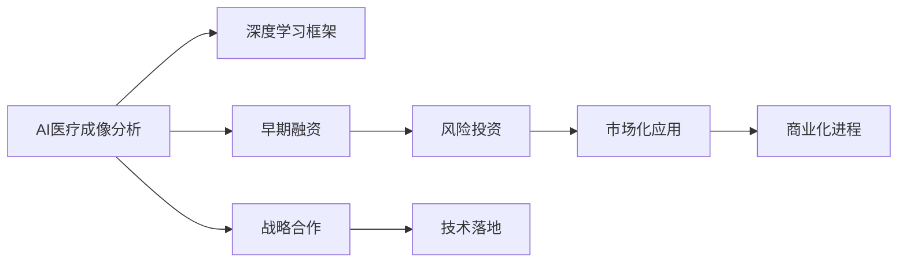

                 

# AI创业的资金之道：Lepton AI的融资策略

## 1. 背景介绍

人工智能（AI）技术正迅速改变着各行各业的业务模式，从制造业到医疗保健，从金融服务到零售，AI技术的应用无所不在。随着技术的不断发展，AI创业公司如雨后春笋般涌现，吸引了大量的投资者和战略合作伙伴。然而，尽管AI技术前景广阔，但AI创业公司面临的挑战同样严峻，资金短缺成为许多公司难以跨越的障碍。本文将探讨Lepton AI的融资策略，分析其在AI领域的成功经验，以期为更多AI创业公司提供有价值的参考。

## 2. 核心概念与联系

### 2.1 核心概念概述

Lepton AI成立于2018年，是一家专注于人工智能医疗成像分析的公司。通过利用深度学习和计算机视觉技术，Lepton AI能够快速、准确地分析医疗影像，帮助医生提高诊断效率和准确性。其融资策略的核心在于：

- **AI医疗成像分析**：利用深度学习技术对医疗影像进行自动化分析，提供精准的诊断结果。
- **深度学习框架**：采用TensorFlow或PyTorch等深度学习框架，进行模型的构建和训练。
- **早期融资**：在产品原型开发和市场验证阶段，通过种子轮和天使轮融资获取初始资本。
- **风险投资**：在产品市场化阶段，通过A轮、B轮、C轮等多次融资，扩大市场份额，实现业务快速扩张。
- **战略合作**：与医疗机构、影像设备制造商、药品公司等建立合作关系，加速技术落地和商业化进程。

这些概念之间存在紧密联系，形成一个有机整体，支撑着Lepton AI从初创期到成熟期的成长之路。

### 2.2 核心概念原理和架构的 Mermaid 流程图



此流程图展示了Lepton AI融资策略的核心架构，其中AI医疗成像分析是核心业务，深度学习框架是技术基础，早期融资和风险投资是资本保障，战略合作是业务扩展的驱动力。

## 3. 核心算法原理 & 具体操作步骤

### 3.1 算法原理概述

Lepton AI采用的深度学习算法主要包括卷积神经网络（CNN）和循环神经网络（RNN）。这些算法通过多层非线性变换，从医疗影像中提取特征，进行分类、检测、分割等任务，实现自动化的诊断和治疗建议。其算法原理包括：

- **卷积神经网络（CNN）**：通过卷积操作提取局部特征，利用池化层进行特征压缩，通过全连接层进行分类。
- **循环神经网络（RNN）**：通过时间序列分析，利用长短期记忆网络（LSTM）或门控循环单元（GRU）进行特征记忆和序列建模。
- **深度学习框架（TensorFlow或PyTorch）**：利用这些框架构建模型，通过自动微分算法进行反向传播，优化模型参数。

### 3.2 算法步骤详解

Lepton AI的深度学习算法主要分为以下几个步骤：

1. **数据准备**：收集和整理医疗影像数据，并进行标注，形成有标签的数据集。
2. **模型构建**：利用TensorFlow或PyTorch构建深度学习模型，选择合适的卷积层、池化层、全连接层等组件。
3. **模型训练**：使用GPU或TPU进行大规模并行训练，调整超参数，如学习率、批大小、迭代次数等，优化模型性能。
4. **模型评估**：在验证集上评估模型性能，使用准确率、召回率、F1-score等指标衡量模型效果。
5. **模型部署**：将训练好的模型部署到生产环境，实现医疗影像的自动化分析。

### 3.3 算法优缺点

Lepton AI的深度学习算法具有以下优点：

- **高精度**：通过多层次的非线性变换，能够捕捉复杂的数据特征，实现高精度的诊断结果。
- **可解释性**：通过可视化特征图，可以理解模型的内部工作机制，提高诊断的可解释性。
- **适应性强**：通过调整网络结构、超参数等，可以适应不同的医疗影像类型和诊断需求。

但同时也存在一些缺点：

- **计算资源需求高**：训练大规模深度学习模型需要高性能的GPU或TPU，成本较高。
- **数据需求量大**：需要收集和标注大量的医疗影像数据，数据获取难度大。
- **模型复杂度高**：深度学习模型的层数和参数量较大，训练和推理时间较长。

### 3.4 算法应用领域

Lepton AI的深度学习算法广泛应用于医疗影像分析领域，具体包括：

- **CT、MRI影像分析**：通过图像分割、病变检测等任务，提高影像诊断的准确性和效率。
- **病理影像分析**：通过病理学图像分析，早期发现癌症等重大疾病，提高治疗成功率。
- **放射影像分析**：通过图像分类和检测，辅助放射科医生进行诊断和治疗决策。
- **超声影像分析**：通过图像处理和特征提取，提高超声影像的诊断精度。

## 4. 数学模型和公式 & 详细讲解 & 举例说明

### 4.1 数学模型构建

Lepton AI的深度学习模型主要使用卷积神经网络和循环神经网络，数学模型构建如下：

- **卷积神经网络**：
$$
\text{Convolutional Layer} = f_\theta (x) = \sum_i w_ix_i + b
$$
其中，$f_\theta (x)$ 为卷积操作，$x$ 为输入特征，$w$ 为卷积核，$b$ 为偏置项。

- **循环神经网络**：
$$
\text{Recurrent Layer} = f_\theta (x_t, h_{t-1}) = \tanh(Wx_t + Uh_{t-1} + b)
$$
其中，$f_\theta (x_t, h_{t-1})$ 为循环操作，$x_t$ 为输入序列，$h_{t-1}$ 为前一时刻的隐藏状态，$W$ 和 $U$ 为权重矩阵，$b$ 为偏置项。

### 4.2 公式推导过程

以CT影像分析为例，推导卷积神经网络的基本公式。假设输入影像为 $x$，卷积核为 $w$，输出特征图为 $f_\theta (x)$，则卷积操作为：

$$
f_\theta (x) = \sum_{i=1}^k (x * w_i) + b
$$

其中，$x$ 为输入影像，$w_i$ 为第 $i$ 个卷积核，$b$ 为偏置项，$k$ 为卷积核的数量。通过多层卷积操作，可以提取局部特征，进行图像分类、检测等任务。

### 4.3 案例分析与讲解

假设Lepton AI的模型在CT影像分类任务上获得了90%的准确率，则模型可以处理以下病例：

- **癌症筛查**：通过影像分割和病变检测，早期发现癌症病灶，提高治疗效果。
- **骨折诊断**：通过影像分类和特征提取，快速判断骨折类型和严重程度，指导治疗方案。
- **脑部成像**：通过影像分析，检测脑部异常和病变，辅助神经科医生进行诊断和治疗。

## 5. 项目实践：代码实例和详细解释说明

### 5.1 开发环境搭建

1. **安装Python**：确保Python 3.6及以上版本已安装。
2. **安装TensorFlow**：使用以下命令安装TensorFlow：
   ```
   pip install tensorflow
   ```
3. **安装PyTorch**：使用以下命令安装PyTorch：
   ```
   pip install torch
   ```
4. **安装其他依赖**：使用以下命令安装其他依赖：
   ```
   pip install numpy scipy matplotlib scikit-learn
   ```

### 5.2 源代码详细实现

```python
import tensorflow as tf
from tensorflow.keras.layers import Conv2D, MaxPooling2D, Flatten, Dense, Dropout
from tensorflow.keras.models import Sequential
from tensorflow.keras.optimizers import Adam

# 构建卷积神经网络模型
def build_model(input_shape, num_classes):
    model = Sequential()
    model.add(Conv2D(32, kernel_size=(3, 3), activation='relu', input_shape=input_shape))
    model.add(MaxPooling2D(pool_size=(2, 2)))
    model.add(Dropout(0.25))
    model.add(Conv2D(64, kernel_size=(3, 3), activation='relu'))
    model.add(MaxPooling2D(pool_size=(2, 2)))
    model.add(Dropout(0.25))
    model.add(Flatten())
    model.add(Dense(128, activation='relu'))
    model.add(Dropout(0.5))
    model.add(Dense(num_classes, activation='softmax'))
    return model

# 数据准备和预处理
def preprocess_data(X_train, y_train, X_test, y_test):
    # 归一化
    X_train = X_train / 255.0
    X_test = X_test / 255.0
    # 数据增强
    data_augmentation = tf.keras.preprocessing.image.ImageDataGenerator(
        rotation_range=20,
        width_shift_range=0.2,
        height_shift_range=0.2,
        horizontal_flip=True
    )
    X_train = data_augmentation.flow(X_train, batch_size=32).take(X_train.shape[0]).reshape(X_train.shape[0], X_train.shape[1], X_train.shape[2], X_train.shape[3])
    X_test = data_augmentation.flow(X_test, batch_size=32).take(X_test.shape[0]).reshape(X_test.shape[0], X_test.shape[1], X_test.shape[2], X_test.shape[3])
    # 标签编码
    y_train = tf.keras.utils.to_categorical(y_train)
    y_test = tf.keras.utils.to_categorical(y_test)
    return X_train, y_train, X_test, y_test

# 模型训练和评估
def train_model(model, X_train, y_train, X_test, y_test, epochs, batch_size, validation_split=0.2):
    model.compile(optimizer=Adam(learning_rate=0.001), loss='categorical_crossentropy', metrics=['accuracy'])
    history = model.fit(X_train, y_train, epochs=epochs, batch_size=batch_size, validation_split=validation_split)
    loss, accuracy = model.evaluate(X_test, y_test)
    print(f'Test loss: {loss:.4f}, Test accuracy: {accuracy:.4f}')
    return history

# 示例代码
X_train = ...
y_train = ...
X_test = ...
y_test = ...

model = build_model((128, 128, 1), num_classes=2)
X_train, y_train, X_test, y_test = preprocess_data(X_train, y_train, X_test, y_test)
history = train_model(model, X_train, y_train, X_test, y_test, epochs=10, batch_size=32)
```

### 5.3 代码解读与分析

Lepton AI的深度学习模型主要通过卷积神经网络实现图像分类任务。以下是对示例代码的详细解读和分析：

1. **模型构建**：使用`Sequential`模型构建卷积神经网络，包括卷积层、池化层、全连接层和Dropout层，最后输出分类结果。
2. **数据预处理**：对训练集和测试集进行归一化和数据增强，提高模型泛化能力。
3. **模型训练**：使用`Adam`优化器进行模型训练，输出损失和准确率。
4. **模型评估**：在测试集上评估模型性能，输出最终结果。

## 6. 实际应用场景

Lepton AI的深度学习模型在医疗影像分析领域具有广泛应用，具体场景包括：

- **急诊室**：通过快速准确的诊断，帮助医生快速决策，减少患者等待时间。
- **远程医疗**：通过云端分析，提供高质量的医疗影像服务，提高远程医疗的效率和质量。
- **医院内部**：通过与医院信息系统集成，实现自动化诊断和治疗建议，优化医院资源配置。

## 7. 工具和资源推荐

### 7.1 学习资源推荐

- **《深度学习》**：Ian Goodfellow等著，介绍了深度学习的理论基础和实际应用，适合初学者和专业人士。
- **Coursera深度学习课程**：由Andrew Ng等教授主讲，涵盖深度学习的基本概念和实际应用，适合在线学习。
- **Kaggle竞赛**：参加Kaggle医疗影像分类竞赛，实战练习深度学习算法。

### 7.2 开发工具推荐

- **TensorFlow**：由Google开发的深度学习框架，支持动态图和静态图两种计算图模式。
- **PyTorch**：由Facebook开发的深度学习框架，支持动态计算图和GPU加速。
- **Keras**：高层次的深度学习API，易于上手，适合快速原型开发。

### 7.3 相关论文推荐

- **"Deep Residual Learning for Image Recognition"**：He等著，提出ResNet网络结构，解决深度网络训练过程中的梯度消失问题。
- **"ImageNet Classification with Deep Convolutional Neural Networks"**：Krizhevsky等著，提出使用卷积神经网络进行大规模图像分类。
- **"Rethinking the Inception Architecture for Computer Vision"**：Szegedy等著，提出Inception网络结构，提升深度学习模型的性能。

## 8. 总结：未来发展趋势与挑战

### 8.1 研究成果总结

Lepton AI通过深度学习算法在医疗影像分析领域取得了显著成果，实现了高精度的诊断和治疗建议。其融资策略通过早期融资和风险投资，确保了公司的持续发展和市场扩展。

### 8.2 未来发展趋势

未来，AI医疗成像分析将继续快速发展，具有以下趋势：

- **跨模态分析**：结合图像、文本、声音等多种模态数据，进行全面分析，提升诊断效果。
- **联邦学习**：通过分布式学习，保护患者隐私，提高模型泛化能力。
- **实时分析**：通过边缘计算和云端协同，实现实时影像分析和诊断。
- **自监督学习**：利用无标签数据进行自监督学习，提升模型鲁棒性。

### 8.3 面临的挑战

尽管Lepton AI在融资策略上取得了成功，但也面临一些挑战：

- **数据获取难度大**：获取高质量的医疗影像数据成本较高，需要长期投入。
- **模型复杂度高**：深度学习模型结构复杂，训练和推理时间较长。
- **算法鲁棒性不足**：医疗影像中存在多种噪声和干扰，需要提高算法的鲁棒性。
- **模型解释性差**：深度学习模型黑盒特性，难以解释其决策过程。

### 8.4 研究展望

未来，Lepton AI将继续在以下几个方面进行研究：

- **模型压缩与优化**：通过模型压缩和量化技术，降低模型计算量和内存占用，提高计算效率。
- **算法鲁棒性提升**：通过对抗样本训练和鲁棒性优化，提高模型对噪声和干扰的鲁棒性。
- **跨模态融合**：结合多种模态数据，进行跨模态融合分析，提升诊断效果。
- **解释性增强**：通过模型解释性和可解释性技术，增强模型的可解释性和透明性。

## 9. 附录：常见问题与解答

### 常见问题与解答

**Q1：AI医疗成像分析的难点是什么？**

A: AI医疗成像分析的难点包括数据获取难度大、算法复杂度高、模型鲁棒性不足等。特别是高质量医疗影像数据的获取和标注，成本较高，需要长期投入。同时，深度学习模型的复杂度较高，训练和推理时间较长，模型对噪声和干扰的鲁棒性不足，解释性也较差。

**Q2：Lepton AI的融资策略有何优势？**

A: Lepton AI的融资策略通过早期融资和风险投资，确保了公司的持续发展和市场扩展。早期融资获取了初始资本，可以快速进行原型开发和市场验证。风险投资提供了更多的资本保障，加速了公司的市场化和业务扩展。

**Q3：如何提高AI医疗成像分析的鲁棒性？**

A: 提高AI医疗成像分析的鲁棒性可以通过对抗样本训练、数据增强、自监督学习等方法。通过对抗样本训练，使模型对噪声和干扰具有一定的抵抗能力。通过数据增强，扩充训练数据集，提高模型泛化能力。通过自监督学习，利用无标签数据进行预训练，提升模型鲁棒性。

**Q4：如何增强AI医疗成像分析的可解释性？**

A: 增强AI医疗成像分析的可解释性可以通过模型解释性技术和可视化技术。通过可视化特征图和决策边界，理解模型的内部工作机制。同时，利用LIME、SHAP等解释性技术，生成可解释的特征重要性图，提高模型的透明性和可解释性。

总之，Lepton AI通过深度学习算法在医疗影像分析领域取得了显著成果，其融资策略也为更多AI创业公司提供了有益的借鉴。未来，随着AI技术的不断进步，AI医疗成像分析必将迎来更广阔的发展前景。

