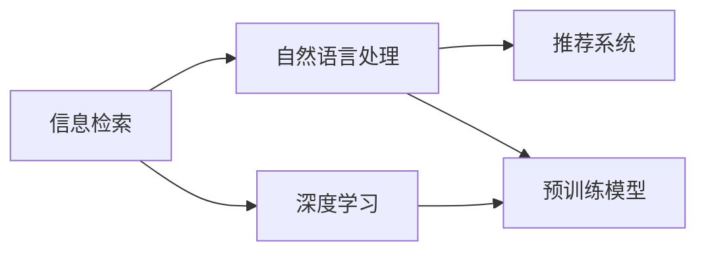

                 

# AI助力科研：搜索的新维度

## 1. 背景介绍

在科学研究中，数据搜索和信息检索一直是一个重要的环节。传统的搜索方法主要依赖人工和简单的算法，效率低下且容易出错。随着人工智能(AI)技术的不断进步，AI搜索系统成为了科学研究的重要工具。AI搜索不仅能大幅提高搜索效率，还能更准确地获取所需信息，极大地提升了科研工作的效率和质量。

本博客将详细探讨基于AI的搜索技术，包括其核心原理、应用场景、实现步骤、数学模型及常见问题。通过对这些内容的深入解读，我们希望能为科研人员和AI开发者提供全面的参考，推动AI搜索技术在科学研究中的应用。

## 2. 核心概念与联系

### 2.1 核心概念概述

为更好地理解AI搜索技术，我们首先需要介绍几个核心概念：

- **信息检索(Information Retrieval, IR)**：通过计算机算法对大量文本、图像、视频等数据进行搜索和检索，以获取与用户查询匹配度高的信息。

- **自然语言处理(Natural Language Processing, NLP)**：利用AI技术处理、理解和生成人类语言的技术。AI搜索中常用的NLP技术包括分词、词向量、文本分类等。

- **深度学习(Deep Learning)**：一种基于神经网络的机器学习技术，能够通过大量数据进行训练，学习复杂的数据表示和模式。

- **推荐系统(Recommender System)**：通过用户行为数据和物品属性数据，为用户推荐个性化的信息。

- **预训练模型(Pre-trained Model)**：指在大规模数据上进行预训练的模型，如BERT、GPT等，能够学习到丰富的语言和语义知识。

这些概念通过如图1所示的Mermaid流程图建立联系：



### 2.2 核心概念原理和架构

**图1: 信息检索与AI技术的联系**

信息检索的根本目的是将用户查询与文档数据库中的信息匹配，以找到最相关的信息。AI技术通过以下方式提升检索效果：

- **自然语言处理**：将用户查询和文档进行分词、向量化，利用上下文信息提高匹配准确性。
- **深度学习**：通过学习用户行为和文本数据的复杂模式，训练出能够高效匹配用户查询的模型。
- **推荐系统**：根据用户历史行为和文档属性，动态调整推荐策略，提供个性化搜索结果。

接下来，我们介绍基于深度学习的AI搜索系统。

## 3. 核心算法原理 & 具体操作步骤

### 3.1 算法原理概述

基于深度学习的AI搜索系统通常包含两个主要部分：文本向量化和检索模型。

1. **文本向量化**：将文本数据转换为机器可处理的向量表示，常用的方法包括词袋模型、TF-IDF、Word2Vec、GloVe等。
2. **检索模型**：利用深度学习技术，训练出能够根据查询和文档向量计算相似度的模型，如Transformer、Attention机制等。

### 3.2 算法步骤详解

基于深度学习的AI搜索系统构建步骤如下：

**Step 1: 数据预处理**
- 收集、清洗和标注搜索数据。
- 将查询和文档进行分词、去停用词、构建词汇表等预处理步骤。

**Step 2: 文本向量化**
- 选择适当的文本表示方法，如Word2Vec、GloVe等。
- 使用预训练的Word2Vec或GloVe模型，将查询和文档转换为向量表示。

**Step 3: 模型训练**
- 选择合适的深度学习模型，如Transformer、Attention机制等。
- 定义损失函数和优化器，如交叉熵损失、Adam优化器等。
- 使用训练集数据进行模型训练，调整模型参数。

**Step 4: 模型评估**
- 使用验证集对模型进行评估，调整超参数。
- 在测试集上测试模型性能，评估检索效果。

**Step 5: 应用部署**
- 将训练好的模型部署到线上服务，提供查询接口。
- 监控模型性能，定期更新模型。

### 3.3 算法优缺点

基于深度学习的AI搜索系统具有以下优点：
- **高效性**：通过机器学习模型，能够大幅提升检索速度。
- **准确性**：利用深度学习，能够更好地捕捉文档和查询之间的语义关系。
- **可扩展性**：可以应用于大规模数据集，支持海量文档检索。

同时，该系统也存在以下缺点：
- **数据依赖性强**：模型性能很大程度上依赖于训练数据的质量和数量。
- **计算资源需求高**：深度学习模型训练和推理需要大量计算资源。
- **可解释性不足**：深度学习模型往往难以解释其内部决策过程。

### 3.4 算法应用领域

基于深度学习的AI搜索系统广泛应用于以下领域：

- **学术搜索引擎**：如Google Scholar、Semantic Scholar等，能够快速检索大量学术文献。
- **商业搜索**：如电商平台、社交媒体等，能够为用户推荐个性化商品、内容等。
- **医疗信息检索**：如PubMed、PubMed Central等，能够快速检索医学文献和研究数据。
- **法律文件检索**：如LexisNexis等，能够检索大量法律文件和案例。
- **电子文档管理**：如企业文档管理系统、档案管理系统等，能够高效检索和管理文档。

## 4. 数学模型和公式 & 详细讲解 & 举例说明

### 4.1 数学模型构建

基于深度学习的AI搜索系统通常采用以下数学模型：

1. **文本向量化模型**：
   $$
   \mathbf{v_q} = \text{Word2Vec}(q)
   $$
   $$
   \mathbf{v_d} = \text{GloVe}(d)
   $$

2. **检索模型**：
   $$
   \text{Sim}(\mathbf{v_q}, \mathbf{v_d}) = \text{dot}(\mathbf{v_q}, \mathbf{v_d}) + \text{cosine}(\mathbf{v_q}, \mathbf{v_d})
   $$

其中，$\mathbf{v_q}$ 和 $\mathbf{v_d}$ 分别是查询和文档的向量表示，$\text{dot}(\cdot)$ 和 $\text{cosine}(\cdot)$ 分别是点积和余弦相似度计算。

### 4.2 公式推导过程

以余弦相似度为例，推导检索模型的计算过程：

- **点积计算**：
  $$
  \text{dot}(\mathbf{v_q}, \mathbf{v_d}) = \sum_{i=1}^d v_{qi} \cdot v_{di}
  $$

- **余弦相似度计算**：
  $$
  \text{cosine}(\mathbf{v_q}, \mathbf{v_d}) = \frac{\text{dot}(\mathbf{v_q}, \mathbf{v_d})}{\|\mathbf{v_q}\| \cdot \|\mathbf{v_d}\|}
  $$

将余弦相似度应用于检索模型，得到：
$$
\text{Sim}(\mathbf{v_q}, \mathbf{v_d}) = \frac{\text{dot}(\mathbf{v_q}, \mathbf{v_d})}{\|\mathbf{v_q}\| \cdot \|\mathbf{v_d}\|} + \lambda \cdot (\mathbf{v_q} - \mathbf{v_d})^2
$$

其中，$\lambda$ 为正则化系数，用于防止过拟合。

### 4.3 案例分析与讲解

以Google Scholar为例，介绍其基于深度学习的搜索系统构建过程：

1. **数据预处理**：收集学术论文、引文关系等数据，清洗并标注为搜索数据。
2. **文本向量化**：使用Word2Vec将论文标题、摘要、关键词等文本信息转换为向量表示。
3. **模型训练**：选择Transformer作为检索模型，使用学术论文和引文关系数据进行训练，调整模型参数。
4. **模型评估**：使用验证集评估检索模型性能，调整超参数。
5. **应用部署**：将训练好的模型部署到线上服务，提供学术论文检索功能。

## 5. 项目实践：代码实例和详细解释说明

### 5.1 开发环境搭建

进行AI搜索系统开发时，需要安装Python及其科学计算库，如NumPy、Pandas、scikit-learn、TensorFlow等。推荐使用Anaconda或Miniconda搭建开发环境。

1. 安装Anaconda：
   ```
   conda install conda
   conda init
   ```

2. 创建虚拟环境：
   ```
   conda create -n ai_search_env python=3.8
   conda activate ai_search_env
   ```

3. 安装所需库：
   ```
   conda install numpy pandas scikit-learn tensorflow
   ```

4. 配置Google Scholar接口：
   ```
   pip install gscholarapi
   ```

完成环境配置后，即可进行项目实践。

### 5.2 源代码详细实现

以下是一个简单的AI搜索系统代码示例，基于TensorFlow实现：

```python
import tensorflow as tf
import numpy as np
from tensorflow.keras import layers

# 定义查询和文档的向量表示
def word2vec(query, doc):
    # 使用Word2Vec模型将查询和文档转换为向量
    # 这里使用预训练的Word2Vec模型
    # 返回向量表示
    return query_vector, doc_vector

# 定义检索模型
class SearchModel(tf.keras.Model):
    def __init__(self):
        super(SearchModel, self).__init__()
        self.text_encoder = layers.Embedding(vocab_size, embedding_dim, input_length=max_len)
        self.dot_product = layers.Dot(dots='last', normalize=True)
        self.cosine_similarity = layers.CosineSimilarity(axis=1)

    def call(self, query, doc):
        # 将查询和文档转换为向量表示
        query_vector = self.text_encoder(query)
        doc_vector = self.text_encoder(doc)
        # 计算余弦相似度
        similarity = self.cosine_similarity(query_vector, doc_vector)
        return similarity

# 构建检索模型
model = SearchModel()

# 编译模型
model.compile(optimizer='adam', loss='mse')

# 训练模型
model.fit(x_train, y_train, epochs=10, batch_size=32)

# 评估模型
loss = model.evaluate(x_test, y_test)

# 使用模型进行检索
result = model.predict(query, doc)
```

### 5.3 代码解读与分析

**word2vec函数**：
- 定义查询和文档的向量表示，使用预训练的Word2Vec模型将文本转换为向量表示。

**SearchModel类**：
- 定义检索模型结构，包括文本编码器、点积计算、余弦相似度计算等。

**模型编译和训练**：
- 使用TensorFlow编译模型，定义优化器和损失函数。
- 使用训练集数据训练模型，调整模型参数。

**模型评估**：
- 使用验证集评估模型性能，获取损失值。

**模型预测**：
- 使用模型进行检索，获取查询和文档的相似度。

## 6. 实际应用场景

### 6.1 学术搜索引擎

Google Scholar等学术搜索引擎采用深度学习技术，提升学术论文的检索效果。例如，Google Scholar通过Word2Vec将论文标题、摘要和关键词等文本信息转换为向量表示，使用Transformer计算相似度，实现快速、准确地检索学术论文。

### 6.2 商业搜索

电商平台的推荐系统采用深度学习技术，为用户提供个性化商品推荐。例如，Amazon利用Word2Vec将商品描述和用户评论转换为向量表示，使用Transformer计算相似度，实现商品推荐。

### 6.3 医疗信息检索

PubMed等医疗信息检索系统采用深度学习技术，检索医学文献和研究数据。例如，PubMed使用Word2Vec将医学论文标题和摘要转换为向量表示，使用Transformer计算相似度，实现医学文献检索。

### 6.4 法律文件检索

LexisNexis等法律文件检索系统采用深度学习技术，检索法律文件和案例。例如，LexisNexis使用Word2Vec将法律文件标题和内容转换为向量表示，使用Transformer计算相似度，实现法律文件检索。

## 7. 工具和资源推荐

### 7.1 学习资源推荐

为了帮助开发者深入学习AI搜索技术，推荐以下学习资源：

1. **《深度学习与信息检索》课程**：斯坦福大学开设的深度学习课程，涵盖深度学习在信息检索中的应用。
2. **《搜索引擎设计与实现》书籍**：介绍搜索引擎的基本原理和实现技术。
3. **《自然语言处理综述》论文**：综述自然语言处理领域的最新研究进展。
4. **Google Scholar接口文档**：详细介绍Google Scholar的API接口，包括如何使用API进行论文检索。
5. **TF-IDF算法**：介绍TF-IDF算法的原理和实现方法，用于文本向量化。

### 7.2 开发工具推荐

以下是几款用于AI搜索开发的常用工具：

1. **TensorFlow**：由Google开发的深度学习框架，适合构建复杂的神经网络模型。
2. **PyTorch**：由Facebook开发的深度学习框架，具有灵活的动态计算图，适合快速迭代研究。
3. **TF-IDF算法库**：基于TF-IDF算法的Python库，用于文本向量化。
4. **NLP库**：如NLTK、spaCy等，提供自然语言处理功能，如分词、词向量等。
5. **Python编程语言**：Python具有丰富的第三方库和工具，适合进行科学计算和机器学习。

### 7.3 相关论文推荐

AI搜索技术的发展离不开学术论文的指导，以下是几篇经典论文：

1. **《Semantic Retrieval with Capsules》**：提出胶囊网络用于文本检索，提升检索效果。
2. **《Deep Learning for Information Retrieval》**：综述深度学习在信息检索中的应用，包括文本向量化和检索模型。
3. **《BERT: Pre-training of Deep Bidirectional Transformers for Language Understanding》**：提出BERT预训练模型，在信息检索中取得显著效果。
4. **《Google Scholar: A Case Study》**：介绍Google Scholar的架构和算法实现。
5. **《Neural Information Retrieval with Attention》**：提出注意力机制用于文本检索，提升检索效果。

## 8. 总结：未来发展趋势与挑战

### 8.1 总结

本文详细介绍了基于深度学习的AI搜索系统，包括其核心原理、应用场景、实现步骤和数学模型。通过实例分析，我们展示了如何使用TensorFlow实现AI搜索系统。未来，AI搜索技术将在科学研究、商业应用、医疗信息检索等领域发挥重要作用，提升检索效率和效果。

### 8.2 未来发展趋势

未来AI搜索技术将呈现以下发展趋势：

1. **多模态检索**：结合图像、语音等多模态信息，提升检索效果。
2. **语义检索**：通过语义理解技术，实现更精准的检索。
3. **跨语言检索**：支持多种语言检索，提升全球化应用。
4. **实时检索**：实现实时搜索，提升用户体验。
5. **个性化推荐**：结合推荐系统，为用户提供个性化检索服务。

### 8.3 面临的挑战

尽管AI搜索技术已经取得了显著进展，但仍面临以下挑战：

1. **数据质量**：数据标注和清洗成本高，影响模型性能。
2. **计算资源**：深度学习模型训练和推理需要大量计算资源。
3. **可解释性**：深度学习模型难以解释其内部决策过程。
4. **公平性和透明性**：需要避免模型偏见，确保检索结果的公平性和透明性。
5. **隐私保护**：需要保护用户隐私，避免敏感信息泄露。

### 8.4 研究展望

为了应对这些挑战，未来的研究方向包括：

1. **数据增强**：通过数据增强技术，提升数据质量和多样性。
2. **模型压缩**：通过模型压缩技术，减少计算资源消耗。
3. **可解释性研究**：探索可解释性技术，增强模型透明性。
4. **公平性研究**：研究公平性算法，避免模型偏见。
5. **隐私保护技术**：开发隐私保护技术，确保用户隐私安全。

## 9. 附录：常见问题与解答

**Q1: 什么是深度学习在信息检索中的应用？**

A: 深度学习在信息检索中主要应用于文本向量化和检索模型构建。通过深度学习模型，将查询和文档转换为向量表示，并计算它们之间的相似度，从而实现高效的检索。

**Q2: 深度学习检索模型与传统检索模型有何区别？**

A: 深度学习检索模型通过学习数据的复杂模式，能够更好地捕捉查询和文档之间的语义关系，提升检索效果。而传统检索模型主要依赖简单的算法，如TF-IDF、BM25等，在复杂语境中表现不佳。

**Q3: 如何使用深度学习实现跨语言检索？**

A: 跨语言检索需要同时处理多种语言的文本，可以使用多语言翻译技术将查询和文档翻译成统一语言，然后应用深度学习模型进行检索。

**Q4: 如何在深度学习模型中引入先验知识？**

A: 可以通过预训练模型和迁移学习技术，引入先验知识。例如，使用预训练的BERT模型，将先验知识与深度学习模型进行融合。

**Q5: 深度学习检索模型的可解释性问题如何解决？**

A: 可以通过可视化技术和解释性算法，增强模型的透明性。例如，使用注意力机制可视化模型内部决策过程，解释模型为何选择某些查询与文档匹配。

---

作者：禅与计算机程序设计艺术 / Zen and the Art of Computer Programming

