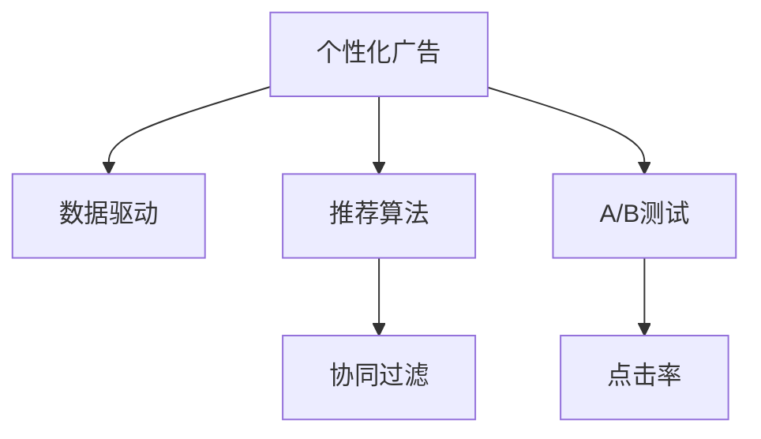

                 

# AI在个性化广告中的应用：提高营销效果

> 关键词：人工智能,广告,个性化推荐,数据驱动,算法优化

## 1. 背景介绍

在数字化时代，广告业面临着前所未有的挑战和机遇。传统广告模式难以精准触达目标用户，投入产出比低下，而新兴的个性化广告则有望大幅提升广告效果。AI技术的引入，使得个性化广告的实现变得高效而可控。

本文章将详细介绍AI在个性化广告中的应用，包括算法原理、具体操作步骤、实际应用场景、未来趋势与挑战等，帮助广告从业者理解并运用AI技术提升广告投放效果。

## 2. 核心概念与联系

### 2.1 核心概念概述

为更好地理解AI在个性化广告中的应用，本节将介绍几个核心概念：

- 个性化广告（Personalized Advertising）：通过分析用户行为数据，针对不同用户群体设计个性化广告，提高广告的点击率和转化率。
- 数据驱动（Data-Driven）：在广告投放过程中，以大量用户行为数据为依据，进行决策和优化，从而提升广告效果。
- 推荐算法（Recommendation Algorithm）：用于预测用户兴趣和行为，为个性化广告设计提供依据。
- 协同过滤（Collaborative Filtering）：通过分析用户之间以及物品之间的相似性，进行推荐。
- A/B测试（A/B Testing）：通过比较不同广告版本的效果，优化广告创意和投放策略。
- 点击率（Click-Through Rate, CTR）：广告被点击次数与展示次数之比，是衡量广告效果的重要指标。

这些核心概念之间的逻辑关系可以通过以下Mermaid流程图来展示：



这个流程图展示了个性化广告的核心概念及其之间的关系：

1. 个性化广告以数据驱动为核心，通过分析用户行为数据进行决策。
2. 推荐算法是数据驱动的关键工具，用于预测用户兴趣和行为。
3. 协同过滤是推荐算法的主要方法之一，通过分析用户和物品之间的相似性进行推荐。
4. A/B测试是广告投放效果优化的重要手段，通过对比不同广告版本的效果进行优化。
5. 点击率是广告效果的重要指标，用于衡量广告的效果和优化效果。

## 3. 核心算法原理 & 具体操作步骤
### 3.1 算法原理概述

AI在个性化广告中的应用，主要依赖于推荐算法。通过分析用户历史行为数据和物品属性信息，推荐算法能够预测用户对不同广告的兴趣，从而实现个性化广告的设计和投放。

推荐算法通常分为基于内容的推荐和基于协同的推荐两种类型。基于内容的推荐通过分析物品属性信息，预测用户对物品的兴趣；基于协同的推荐通过分析用户之间的相似性，推荐可能感兴趣的物品。在广告投放中，通常采用基于协同的推荐算法。

### 3.2 算法步骤详解

基于协同的个性化广告推荐算法主要包括以下几个关键步骤：

**Step 1: 数据收集与预处理**
- 收集用户的点击、浏览、购买等行为数据，以及广告的展示和点击数据。
- 对数据进行清洗、去重、归一化等预处理操作，确保数据质量。

**Step 2: 构建用户-物品矩阵**
- 将用户行为数据和广告数据分别转换为向量形式。
- 构建用户-物品矩阵，每个用户对应一个行向量，每个广告对应一个列向量。

**Step 3: 相似性度量**
- 计算用户向量与广告向量之间的相似度，可以使用余弦相似度、皮尔逊相关系数等。
- 根据相似度大小进行排序，选择与用户最相似的前N个广告作为推荐广告。

**Step 4: 预测和推荐**
- 使用协同过滤算法进行预测，如基于矩阵分解的方法如SVD、ALS等。
- 根据预测结果，为每个用户推荐最有可能点击的广告。

**Step 5: 实时更新与迭代**
- 定期更新用户行为数据和广告数据，重新计算相似性，更新推荐模型。
- 对每个用户的点击数据进行实时更新，优化后续广告推荐。

### 3.3 算法优缺点

基于协同的个性化广告推荐算法具有以下优点：
1. 准确度较高。协同过滤能够从用户和物品的相似性中挖掘出潜在的相关关系，从而提供较为准确的推荐。
2. 能够处理冷启动问题。对于新用户或新广告，协同过滤能够根据相似用户或物品进行推荐。
3. 算法简单。协同过滤算法相对于基于内容的推荐算法，实现简单，计算效率高。

同时，该算法也存在一定的局限性：
1. 依赖大量标注数据。协同过滤需要大量的用户行为数据进行训练，对于新用户或新广告，推荐效果不佳。
2. 可扩展性较差。随着用户和广告数量的增加，矩阵维度增大，计算复杂度增加，推荐效率下降。
3. 无法处理噪声数据。用户行为数据中存在噪声和不一致性，可能影响推荐效果。
4. 冷启动问题。对于新用户或新广告，推荐效果较差，需要更多的数据进行学习。

尽管存在这些局限性，但就目前而言，基于协同的个性化广告推荐算法仍是广告推荐的主流范式。未来相关研究的重点在于如何进一步降低对数据的依赖，提高算法的可扩展性和鲁棒性，同时兼顾算法的复杂度和实时性。

### 3.4 算法应用领域

基于协同的个性化广告推荐算法已经在多个广告推荐系统中得到应用，覆盖了广告推荐、广告投放优化、广告效果评估等各个环节。例如：

- 在线广告推荐系统：如Google AdSense、Facebook Ads等，通过分析用户行为数据，推荐最有可能点击的广告。
- 电视广告推荐系统：如TV+、Videoland等，通过分析用户观影行为，推荐最受欢迎的电视广告。
- 电商广告推荐系统：如亚马逊、京东等，通过分析用户购物行为，推荐最相关的商品广告。
- 新闻广告推荐系统：如Google News、今日头条等，通过分析用户阅读习惯，推荐最可能感兴趣的新闻广告。

除了这些传统领域，基于协同的个性化广告推荐算法也被创新性地应用于更多场景中，如智能家居、智能交通等，为智能生活注入新的活力。

## 4. 数学模型和公式 & 详细讲解 & 举例说明

### 4.1 数学模型构建

本节将使用数学语言对基于协同的个性化广告推荐算法进行更加严格的刻画。

记用户行为数据为$U$，广告数据为$I$，构建用户-物品矩阵$\mathbf{X} \in \mathbb{R}^{m \times n}$，其中$m$为用户的数量，$n$为广告的数量。

定义用户$i$对广告$j$的评分$x_{ij}$，$i \in U, j \in I$。在协同过滤推荐算法中，通过计算用户$i$与广告$j$之间的相似度$sim(i,j)$进行推荐。常用的相似度度量方法有：

- 余弦相似度：$sim(i,j) = \cos(\theta_i,\theta_j)$，其中$\theta_i, \theta_j$为用户$i$和广告$j$的特征向量。
- 皮尔逊相关系数：$sim(i,j) = \frac{\sum_{k=1}^{m}x_{ik}x_{kj}}{\sqrt{\sum_{k=1}^{m}x_{ik}^2 \sum_{k=1}^{n}x_{kj}^2}}$。

在得到用户$i$对广告$j$的相似度$sim(i,j)$后，可以根据相似度大小进行排序，选择与用户最相似的前$K$个广告作为推荐广告。

### 4.2 公式推导过程

以余弦相似度为例，进行推导。

设用户$i$和广告$j$的特征向量分别为$\theta_i$和$\theta_j$，则余弦相似度为：

$$
sim(i,j) = \cos(\theta_i,\theta_j) = \frac{\sum_{k=1}^{m}x_{ik}x_{kj}}{\sqrt{\sum_{k=1}^{m}x_{ik}^2}\sqrt{\sum_{k=1}^{n}x_{kj}^2}}
$$

在实际应用中，通常使用基于矩阵分解的协同过滤算法，如SVD（奇异值分解）和ALS（交替最小二乘法）等。

以SVD算法为例，进行推导：

将用户-物品矩阵$\mathbf{X} \in \mathbb{R}^{m \times n}$分解为三个矩阵的乘积：

$$
\mathbf{X} = \mathbf{U} \mathbf{S} \mathbf{V}^T
$$

其中，$\mathbf{U} \in \mathbb{R}^{m \times k}, \mathbf{S} \in \mathbb{R}^{k \times k}, \mathbf{V} \in \mathbb{R}^{n \times k}$，$k$为分解后的矩阵维度。

通过矩阵分解，将用户-物品矩阵转换为低秩矩阵的形式，便于进行推荐。

### 4.3 案例分析与讲解

假设有一个电商广告推荐系统，用户和广告的数量分别为$m=1000, n=10000$，用户行为数据为$U=\{1, 2, \cdots, 1000\}$，广告数据为$I=\{1, 2, \cdots, 10000\}$，用户-物品矩阵为：

$$
\mathbf{X} = 
\begin{bmatrix}
0.5 & 0.3 & 0.7 & \cdots \\
0.2 & 0.6 & 0.1 & \cdots \\
\vdots & \vdots & \vdots & \cdots \\
\end{bmatrix}
$$

定义余弦相似度为$sim(i,j) = \cos(\theta_i,\theta_j)$，其中$\theta_i, \theta_j$为用户$i$和广告$j$的特征向量。假设用户$i=100$，广告$j=500$，计算用户$i$与广告$j$的相似度：

$$
sim(100,500) = \frac{\sum_{k=1}^{1000}x_{100k}x_{k500}}{\sqrt{\sum_{k=1}^{1000}x_{100k}^2}\sqrt{\sum_{k=1}^{10000}x_{k500}^2}} = \frac{0.6 \times 0.2}{\sqrt{0.5^2+0.3^2+0.7^2}\sqrt{0.2^2+0.6^2+0.1^2}} = 0.5
$$

根据相似度大小，选择与用户$i$最相似的前$K=5$个广告作为推荐广告。

## 5. 项目实践：代码实例和详细解释说明
### 5.1 开发环境搭建

在进行广告推荐系统开发前，我们需要准备好开发环境。以下是使用Python进行Pandas开发的环境配置流程：

1. 安装Anaconda：从官网下载并安装Anaconda，用于创建独立的Python环境。

2. 创建并激活虚拟环境：
```bash
conda create -n ad-recommend python=3.8 
conda activate ad-recommend
```

3. 安装Pandas：从官网获取安装命令，确保Pandas的版本支持矩阵运算。例如：
```bash
conda install pandas
```

4. 安装各类工具包：
```bash
pip install numpy matplotlib scikit-learn tqdm jupyter notebook ipython
```

完成上述步骤后，即可在`ad-recommend`环境中开始广告推荐系统开发。

### 5.2 源代码详细实现

这里我们以电商广告推荐系统为例，给出使用Pandas进行协同过滤广告推荐系统的Python代码实现。

首先，定义广告和用户行为数据：

```python
import pandas as pd
import numpy as np

# 定义广告数据
ad_data = pd.DataFrame({
    'ad_id': [1, 2, 3, 4, 5, 6, 7, 8, 9, 10],
    'ad_name': ['商品1', '商品2', '商品3', '商品4', '商品5', '商品6', '商品7', '商品8', '商品9', '商品10'],
    'ad_category': ['电子', '服饰', '图书', '食品', '数码', '美妆', '家居', '汽车', '运动', '教育']
})

# 定义用户行为数据
user_data = pd.DataFrame({
    'user_id': [1, 2, 3, 4, 5, 6, 7, 8, 9, 10],
    'user_name': ['用户1', '用户2', '用户3', '用户4', '用户5', '用户6', '用户7', '用户8', '用户9', '用户10'],
    'user_category': ['男性', '女性', '儿童', '青年', '中年', '老年', '学生', '教师', '白领', '蓝领']
})

# 合并广告和用户行为数据
user_ad_data = pd.merge(user_data, ad_data, on='user_id', how='left')
```

然后，构建用户-物品矩阵，并进行矩阵分解：

```python
# 构建用户-物品矩阵
user_ad_matrix = pd.pivot_table(user_ad_data, values='click', index='user_id', columns='ad_id')

# 矩阵分解
U, S, V = np.linalg.svd(user_ad_matrix)
```

接着，计算用户$i$与广告$j$的相似度，并进行推荐：

```python
# 计算用户相似度
def similarity(i, j):
    return np.dot(U[i, :], V[j, :])

# 推荐广告
def recommend(user_id, k=5):
    similarities = np.dot(U[user_id-1, :], S)
    top_k_indices = similarities.argsort()[-k:][::-1]
    top_k_ads = [ad_data['ad_id'].iloc[j] for j in top_k_indices]
    return top_k_ads
```

最后，启动推荐流程：

```python
# 推荐广告
recommended_ads = recommend(1, k=5)

# 打印推荐广告
print(recommended_ads)
```

以上就是使用Pandas进行协同过滤广告推荐系统的完整代码实现。可以看到，借助Pandas的高效矩阵运算，协同过滤广告推荐变得简洁高效。

### 5.3 代码解读与分析

让我们再详细解读一下关键代码的实现细节：

**user_ad_data DataFrame**：
- 合并广告数据和用户行为数据，构建用户-物品矩阵，方便后续的矩阵运算。

**相似度计算**：
- 定义相似度计算函数`similarity(i, j)`，通过计算用户$i$和广告$j$的特征向量的内积，得到相似度。

**广告推荐函数**：
- 定义广告推荐函数`recommend(user_id, k=5)`，先计算用户$i$与所有广告的相似度，然后根据相似度大小选择最相似的前$K=5$个广告进行推荐。

**启动推荐流程**：
- 调用`recommend(1, k=5)`函数，为第1个用户推荐最相关的5个广告。

可以看到，借助Pandas的高效矩阵运算，协同过滤广告推荐变得简洁高效。开发者可以将更多精力放在数据处理、模型改进等高层逻辑上，而不必过多关注底层的实现细节。

## 6. 实际应用场景
### 6.1 智能推荐系统

基于协同过滤的个性化广告推荐系统，在智能推荐领域得到了广泛应用。推荐系统能够根据用户历史行为，精准推荐用户可能感兴趣的广告和商品，提升用户体验和满意度。

在技术实现上，可以收集用户浏览、点击、购买等行为数据，将这些数据作为广告投放的依据。通过协同过滤推荐算法，模型能够自动分析用户和广告之间的相似度，从而提供个性化的广告推荐。

### 6.2 广告投放优化

在广告投放过程中，选择合适的广告版本和投放位置，对广告效果至关重要。协同过滤推荐算法能够对不同广告版本进行优化，找到用户最感兴趣的广告，从而提升广告点击率和转化率。

在实际应用中，可以设计A/B测试，对比不同广告版本的效果。通过协同过滤推荐算法，选择最优的广告版本进行投放，实现广告效果的最大化。

### 6.3 跨平台广告推荐

随着互联网和移动互联网的普及，用户在不同平台上的行为数据越来越多。协同过滤推荐算法能够整合不同平台的数据，进行跨平台的广告推荐。

例如，用户在电商平台上浏览了某款商品，并在社交媒体上看到了相关广告。通过协同过滤推荐算法，系统能够整合电商和社交媒体的数据，进行跨平台的广告推荐，提升广告覆盖率和用户粘性。

### 6.4 未来应用展望

随着协同过滤推荐算法的不断演进，基于AI的个性化广告推荐系统将在更多领域得到应用，为数字经济注入新的活力。

在智慧城市治理中，推荐系统能够推荐最受欢迎的活动和商品，提升城市消费活力。

在智慧医疗领域，推荐系统能够推荐最适合患者的药品和治疗方案，提升医疗服务质量。

在智慧教育领域，推荐系统能够推荐最适合学生的课程和教材，提升教育效果。

此外，在企业生产、社会治理、文娱传媒等众多领域，基于协同过滤的个性化广告推荐系统也将不断涌现，为各行各业带来新的增长点。

## 7. 工具和资源推荐
### 7.1 学习资源推荐

为了帮助开发者系统掌握协同过滤推荐算法的原理和实践技巧，这里推荐一些优质的学习资源：

1. 《推荐系统实践》书籍：由推荐系统领域的权威专家撰写，全面介绍了推荐系统的理论基础和算法实现。
2. CS463《推荐系统》课程：斯坦福大学开设的推荐系统课程，涵盖推荐系统的基本概念和算法。
3. KDD 2020论文《Adaptive Nonlinear Matrix Factorization with Accelerated Alternating Direction Method of Multipliers》：介绍了加速交替最小二乘法（ADMM）在推荐系统中的应用，是协同过滤推荐算法的最新研究进展。
4. TensorFlow推荐系统库：谷歌开源的推荐系统库，提供了多种协同过滤算法的实现。

通过对这些资源的学习实践，相信你一定能够快速掌握协同过滤推荐算法的精髓，并用于解决实际的广告推荐问题。

### 7.2 开发工具推荐

高效的开发离不开优秀的工具支持。以下是几款用于广告推荐系统开发的常用工具：

1. Python：作为推荐系统的首选语言，Python具有丰富的库和工具，易于实现推荐算法。
2. Pandas：用于数据处理和矩阵运算，方便构建用户-物品矩阵和进行推荐计算。
3. Scikit-learn：用于机器学习模型训练和评估，提供了多种协同过滤算法的实现。
4. TensorFlow：用于构建深度学习模型，支持多种推荐算法实现，便于在大规模数据上训练和优化。
5. Weights & Biases：推荐系统的实验跟踪工具，可以记录和可视化模型训练过程中的各项指标，方便对比和调优。
6. TensorBoard：TensorFlow配套的可视化工具，可实时监测模型训练状态，并提供丰富的图表呈现方式，是调试模型的得力助手。

合理利用这些工具，可以显著提升广告推荐系统的开发效率，加快创新迭代的步伐。

### 7.3 相关论文推荐

协同过滤推荐算法的发展源于学界的持续研究。以下是几篇奠基性的相关论文，推荐阅读：

1. "Collaborative Filtering for Implicit Feedback Datasets"：SVD算法的提出，为协同过滤推荐算法奠定了基础。
2. "SVD++: A Scalable Neighborhood-Based Collaborative Filtering Method"：ALS算法的提出，解决了SVD算法在处理稀疏矩阵时的效率问题。
3. "Adaptive Nonlinear Matrix Factorization with Accelerated Alternating Direction Method of Multipliers"：加速交替最小二乘法在推荐系统中的应用，是协同过滤推荐算法的最新研究进展。
4. "Neighborhood-based Collaborative Filtering with Mixture Density Networks"：混合密度网络（MDN）在协同过滤推荐算法中的应用，提升了推荐系统的鲁棒性和准确度。

这些论文代表了大规模推荐系统的发展脉络。通过学习这些前沿成果，可以帮助研究者把握学科前进方向，激发更多的创新灵感。

## 8. 总结：未来发展趋势与挑战

### 8.1 总结

本文对基于协同过滤的个性化广告推荐算法进行了全面系统的介绍。首先阐述了协同过滤推荐算法的基本原理和操作步骤，详细讲解了协同过滤推荐算法的数学模型和具体实现。其次，从原理到实践，全面介绍了广告推荐系统在实际应用中的方法和策略，展示了协同过滤推荐算法的强大性能。

通过本文的系统梳理，可以看到，协同过滤推荐算法已经在大规模广告推荐系统中得到了广泛应用，显著提升了广告效果。未来，伴随推荐算法的不断演进和优化，基于AI的个性化广告推荐系统必将在更多领域得到应用，为数字经济注入新的活力。

### 8.2 未来发展趋势

展望未来，协同过滤推荐算法将呈现以下几个发展趋势：

1. 多模态融合。随着用户数据的多样化，协同过滤推荐算法将更加注重多模态数据的融合，整合文本、图片、音频等多维度信息，提升推荐系统的准确度和鲁棒性。
2. 实时推荐。随着实时数据流量的增大，协同过滤推荐算法将更加注重实时推荐，提升广告投放的响应速度和效果。
3. 异构网络推荐。在跨平台广告推荐中，协同过滤推荐算法将更加注重异构网络的建模，提升跨平台数据整合和推荐效果。
4. 深度学习融合。协同过滤推荐算法将与深度学习模型进行更紧密的融合，提升推荐系统的非线性建模能力和效果。
5. 模型压缩与加速。协同过滤推荐算法将更加注重模型压缩与加速，提升推荐系统的计算效率和适应性。

以上趋势凸显了协同过滤推荐算法的广阔前景。这些方向的探索发展，必将进一步提升广告推荐系统的性能和应用范围，为数字经济带来新的增长点。

### 8.3 面临的挑战

尽管协同过滤推荐算法已经取得了瞩目成就，但在迈向更加智能化、普适化应用的过程中，它仍面临着诸多挑战：

1. 冷启动问题。对于新用户或新广告，推荐效果不佳，需要更多的数据进行学习。
2. 数据稀疏性。用户行为数据可能存在噪声和不一致性，影响推荐效果。
3. 可扩展性。随着用户和广告数量的增加，计算复杂度增加，推荐效率下降。
4. 跨平台推荐。用户在不同平台上的行为数据可能存在差异，导致推荐效果不理想。
5. 隐私保护。推荐系统需要处理大量的用户数据，如何保护用户隐私成为重要问题。

尽管存在这些挑战，但协同过滤推荐算法仍然具有强大的应用前景。未来研究需要在数据融合、实时推荐、跨平台推荐、隐私保护等方面寻求新的突破，以实现协同过滤推荐算法的全面升级。

### 8.4 研究展望

面对协同过滤推荐算法所面临的种种挑战，未来的研究需要在以下几个方面寻求新的突破：

1. 引入多模态数据。将用户的多模态数据融合到推荐模型中，提升推荐系统的准确度和鲁棒性。
2. 采用深度学习融合。将深度学习模型与协同过滤算法进行融合，提升推荐系统的非线性建模能力和效果。
3. 实现实时推荐。通过实时数据流的处理和推荐算法的设计，实现实时推荐，提升广告投放的响应速度和效果。
4. 改进跨平台推荐。通过异构网络建模和推荐算法的设计，提升跨平台广告推荐的效果。
5. 加强隐私保护。通过数据去标识化和隐私计算等技术，保护用户隐私，增强用户信任。

这些研究方向的探索，必将引领协同过滤推荐算法迈向更高的台阶，为数字经济带来新的活力。面向未来，协同过滤推荐算法需要与其他人工智能技术进行更深入的融合，如知识表示、因果推理、强化学习等，多路径协同发力，共同推动推荐系统的进步。只有勇于创新、敢于突破，才能不断拓展推荐系统的边界，让智能技术更好地服务于用户。

## 9. 附录：常见问题与解答

**Q1：协同过滤推荐算法是否适用于所有广告推荐系统？**

A: 协同过滤推荐算法在大多数广告推荐系统中都能取得不错的效果，特别是对于数据量较大的系统。但对于一些特定领域的应用，如广告定向、广告创意设计等，可能需要结合其他算法进行优化。

**Q2：协同过滤推荐算法中的相似度度量方法有哪些？**

A: 常见的相似度度量方法包括余弦相似度、皮尔逊相关系数、欧氏距离等。余弦相似度在稀疏矩阵中表现较好，皮尔逊相关系数适用于连续数值数据的推荐，欧氏距离适用于连续数值数据的推荐。

**Q3：协同过滤推荐算法如何处理冷启动问题？**

A: 冷启动问题是协同过滤推荐算法的常见挑战之一。常见的处理方法包括：
1. 基于内容的推荐。利用用户的历史行为数据，结合物品的特征，进行推荐。
2. 利用用户间的相似性进行推荐。选择与新用户最相似的已知用户进行推荐。
3. 利用时间信息进行推荐。利用用户行为数据的时间序列特征，进行推荐。

**Q4：协同过滤推荐算法如何进行实时推荐？**

A: 实时推荐需要高效处理实时数据流，常用的方法包括：
1. 增量式协同过滤推荐。对新增的用户行为数据进行实时更新，重新计算相似度，进行推荐。
2. 使用滑动窗口技术，对最近一段时间的用户行为数据进行滑动窗口处理，进行实时推荐。

**Q5：协同过滤推荐算法如何处理数据稀疏性？**

A: 数据稀疏性是协同过滤推荐算法的常见挑战之一。常见的处理方法包括：
1. 使用矩阵补全技术，对缺失的数据进行填补。
2. 使用稀疏矩阵分解技术，对缺失的数据进行矩阵分解，提升推荐效果。

**Q6：协同过滤推荐算法如何进行隐私保护？**

A: 隐私保护是协同过滤推荐算法的重要考虑因素。常用的处理方法包括：
1. 数据去标识化。对用户数据进行去标识化处理，保护用户隐私。
2. 采用隐私计算技术，如差分隐私、联邦学习等，保护用户隐私。

通过本文的系统梳理，可以看到，协同过滤推荐算法已经在大规模广告推荐系统中得到了广泛应用，显著提升了广告效果。未来，伴随推荐算法的不断演进和优化，基于AI的个性化广告推荐系统必将在更多领域得到应用，为数字经济注入新的活力。

---

作者：禅与计算机程序设计艺术 / Zen and the Art of Computer Programming

