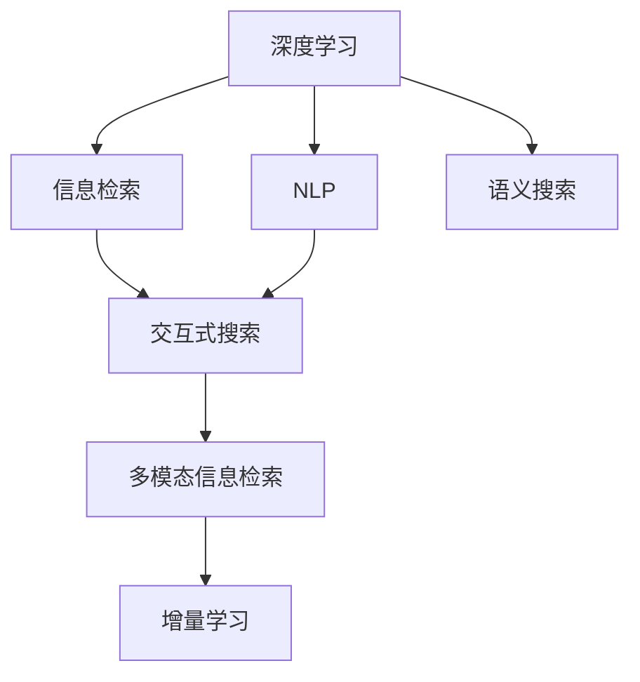

                 

# AI在提高搜索质量方面的应用

> 关键词：搜索质量提升, 深度学习, 自然语言处理, 信息检索, 语义搜索

## 1. 背景介绍

### 1.1 问题由来
在信息爆炸的时代，如何从海量数据中快速准确地找到所需信息，成为了人们面临的巨大挑战。传统的搜索引擎多基于关键词匹配的浅层检索模型，无法有效捕捉查询意图和语义，导致搜索结果相关性差、用户满意度低。如何构建高效、智能的搜索系统，从根本上提高搜索质量，成为了亟需解决的难题。

AI技术的介入，特别是深度学习在自然语言处理(NLP)和信息检索领域的应用，为提升搜索质量提供了新的路径。通过学习语言的深层次结构和语义，AI驱动的搜索系统可以更准确地理解查询意图，更好地匹配相关文档，从而大幅提升搜索效率和用户体验。

### 1.2 问题核心关键点
AI在提高搜索质量方面的关键点包括：
1. 深度学习模型的引入。通过深度学习捕捉查询和文档的深层语义关系，提高检索的精度。
2. 自然语言处理的运用。借助NLP技术解析查询意图，构建语义丰富的检索表达式。
3. 语义搜索的实现。通过学习文档的语义表示，进行精确的语义匹配，提升检索效果。
4. 交互式搜索的推广。结合用户反馈，不断优化查询理解和结果展现，实现更智能的用户体验。
5. 多模态信息的融合。融合图像、视频、音频等多模态数据，提供更全面的搜索结果。
6. 实时搜索的优化。通过增量学习和在线学习，适应数据分布的变化，保持系统的高效运行。

这些关键点共同构成了一个综合的AI搜索系统框架，旨在通过多维度优化，全面提升搜索质量。

### 1.3 问题研究意义
AI在搜索质量提升中的应用，具有以下重要意义：
1. 提升用户体验。通过更智能、更准确的搜索结果，用户可以快速定位到所需信息，节省时间和精力。
2. 提高信息效率。AI搜索系统能够处理复杂查询，解决传统搜索无法解决的问题，提升信息获取效率。
3. 拓展应用场景。AI技术可以应用于更多行业和领域，如医疗、金融、教育等，提供定制化的信息服务。
4. 驱动产业升级。AI搜索技术的应用，将促进搜索引擎产品迭代，推动信息产业向智能化、自动化方向发展。
5. 加速创新应用。AI搜索技术为创新应用提供了基础技术支持，催生了更多基于搜索的智能服务。

## 2. 核心概念与联系

### 2.1 核心概念概述

为更好地理解AI在搜索质量提升中的作用，本节将介绍几个密切相关的核心概念：

- 深度学习(Deep Learning)：一种通过多层神经网络学习数据的深层特征表示的技术，特别适用于处理复杂的非线性关系。
- 自然语言处理(Natural Language Processing, NLP)：涉及语言理解、文本生成、机器翻译等技术，旨在实现人与机器之间的自然语言交互。
- 信息检索(Information Retrieval, IR)：通过查询和检索技术，从数据库或互联网中获取相关信息的过程。
- 语义搜索(Semantic Search)：利用语义理解技术，基于文档内容的深层语义关系进行检索，而非简单的关键词匹配。
- 交互式搜索(Interactive Search)：结合用户反馈和查询历史，动态调整检索策略，提升搜索结果的相关性和用户体验。
- 多模态信息检索(Multimodal Information Retrieval)：将文本、图像、视频、音频等多种信息类型结合起来，提供更全面的搜索结果。
- 增量学习(Incremental Learning)：通过在线学习不断更新模型参数，适应数据分布的变化，保持系统的实时更新和高效运行。

这些核心概念之间的逻辑关系可以通过以下Mermaid流程图来展示：



这个流程图展示了大语言模型的核心概念及其之间的关系：

1. 深度学习通过多层神经网络学习数据的深层特征，为NLP和IR提供基础。
2. NLP技术用于解析查询意图和文档内容，构建语义丰富的检索表达式。
3. IR技术负责从数据集中检索相关文档，并返回给用户。
4. 语义搜索利用NLP和IR技术，理解查询和文档的深层语义关系，进行更准确的检索。
5. 交互式搜索结合用户反馈，动态调整检索策略，提升用户体验。
6. 多模态信息检索将多种信息类型结合起来，提供更全面的搜索结果。
7. 增量学习不断更新模型参数，适应数据分布的变化，保持系统的实时更新。

这些概念共同构成了AI搜索系统的技术基础，使其能够从多个维度提升搜索质量。

## 3. 核心算法原理 & 具体操作步骤
### 3.1 算法原理概述

AI在提高搜索质量方面的主要算法原理基于深度学习，特别是卷积神经网络(CNN)、循环神经网络(RNN)和Transformer等架构，这些模型在语义理解、信息检索等方面表现出优异性能。

基于这些深度学习模型，AI搜索系统通过以下步骤实现搜索质量提升：
1. 收集并标注大规模的数据集，用于训练和评估模型。
2. 构建深度学习模型，学习查询和文档的深层特征表示。
3. 解析查询意图，生成语义丰富的检索表达式。
4. 使用语义检索技术，匹配相关文档。
5. 结合交互式搜索和多模态信息检索技术，提供更智能、全面的搜索结果。
6. 通过增量学习不断优化模型，适应数据分布的变化。

### 3.2 算法步骤详解

以下是基于深度学习的AI搜索系统的主要操作步骤：

**Step 1: 数据预处理**
- 收集大规模文本数据，如Web页面、新闻、论文等，作为训练数据集。
- 对文本进行分词、去停用词、标准化等预处理，构建向量化的输入。
- 标注数据，如问题-文档对，用于训练模型和评估效果。

**Step 2: 构建深度学习模型**
- 选择合适的深度学习模型架构，如CNN、RNN、Transformer等，作为初始化参数。
- 使用大规模标注数据集，通过前向传播和反向传播进行模型训练，优化模型参数。
- 在验证集上评估模型性能，选择最优模型保存参数。

**Step 3: 解析查询意图**
- 对用户查询进行分词、词性标注等处理，提取关键词和查询意图。
- 使用预训练的NLP模型，如BERT、GPT等，解析查询的语义表示。
- 生成语义丰富的检索表达式，用于检索相关文档。

**Step 4: 语义检索**
- 将查询表示和文档表示送入检索模型，进行语义匹配。
- 根据匹配得分，选择最相关的文档作为搜索结果。
- 使用排序算法对搜索结果进行排序，提升相关性和用户体验。

**Step 5: 交互式搜索**
- 收集用户对搜索结果的反馈，如点击、评分等。
- 动态调整检索模型和参数，提高检索精度和相关性。
- 结合用户历史查询和行为，个性化推荐搜索结果。

**Step 6: 多模态信息检索**
- 将文本、图像、视频、音频等多模态数据整合，构建统一的语义表示。
- 将多模态数据作为输入，使用多模态检索模型进行匹配和检索。
- 融合多种信息类型的搜索结果，提供更全面的服务。

**Step 7: 增量学习**
- 实时收集用户反馈和数据更新，进行在线学习和增量训练。
- 使用增量学习算法，如在线梯度下降、AdaGrad等，不断优化模型参数。
- 适应数据分布的变化，保持系统的实时更新和高效运行。

通过以上步骤，AI搜索系统能够从多个维度提升搜索质量，为用户提供更加精准、智能的搜索结果。

### 3.3 算法优缺点

基于深度学习的AI搜索系统具有以下优点：
1. 深层语义理解。通过多层神经网络学习数据的深层特征，捕捉查询和文档的深层语义关系，提升检索精度。
2. 个性化推荐。结合用户反馈和行为，进行动态调整，提供更个性化、相关性高的搜索结果。
3. 多模态融合。将文本、图像、视频等多种信息类型结合起来，提供更全面的服务。
4. 实时更新。通过增量学习，不断优化模型，适应数据分布的变化，保持系统的实时更新和高效运行。

同时，该方法也存在一些局限性：
1. 数据需求大。需要大量标注数据和计算资源进行模型训练，初期投入成本较高。
2. 模型复杂。深度学习模型参数量大，训练和推理效率较低，需要高性能计算资源支持。
3. 泛化能力不足。当新数据与训练数据的分布差异较大时，模型性能可能下降。
4. 可解释性差。深度学习模型通常缺乏可解释性，难以调试和优化。
5. 模型偏见。深度学习模型可能学习到数据中的偏见，导致输出结果不公正。

尽管存在这些局限性，但就目前而言，基于深度学习的AI搜索系统在提高搜索质量方面已展现出显著优势，推动了NLP技术在搜索引擎领域的应用。

### 3.4 算法应用领域

AI在搜索质量提升方面的应用已经渗透到多个领域，具体包括：

- 通用搜索引擎：如Google、Bing等，通过深度学习提升搜索结果的相关性和用户满意度。
- 行业搜索引擎：如医疗搜索、法律搜索等，结合特定领域的语料和知识库，提供精准的行业信息检索服务。
- 学术搜索引擎：如Google Scholar、ResearchGate等，通过深度学习模型解析论文标题、摘要等信息，提升检索精度和排序质量。
- 垂直搜索：如电商搜索、房产搜索等，通过深度学习提升商品、房源等信息的检索和匹配。
- 智能问答系统：如知识图谱驱动的问答系统，通过深度学习解析用户查询，生成精确的回答。
- 多模态搜索：如基于图像、视频的信息检索，通过多模态数据融合提升检索效果。

这些应用场景展示了AI搜索技术的广泛应用，为用户提供了更智能、更精准的信息检索服务。

## 4. 数学模型和公式 & 详细讲解
### 4.1 数学模型构建

基于深度学习的AI搜索系统，数学模型构建主要基于以下假设：
- 查询和文档表示为向量形式，通过学习它们的深层语义关系进行匹配。
- 使用softmax函数计算检索结果的相关性得分。
- 使用NCE(Noise Contrastive Estimation)或Focal Loss等损失函数优化模型参数。

记查询表示为 $q \in \mathbb{R}^d$，文档表示为 $d \in \mathbb{R}^d$，检索模型的输出为 $s \in \mathbb{R}$，其中 $s$ 表示查询与文档的相关性得分。

### 4.2 公式推导过程

假设使用一个简单的二分类检索模型，输出 $s$ 表示查询与文档是否相关。模型使用softmax函数将得分映射到[0,1]区间，即 $P(y=1|q,d)=\frac{\exp(s)}{\sum_k \exp(s_k)}$，其中 $s_k$ 表示第 $k$ 个文档的得分。

查询与文档的相关性由相似度函数计算得到，常用的相似度函数包括余弦相似度、欧氏距离等。例如，余弦相似度的公式为：

$$
s = \cos(\theta) = \frac{q \cdot d}{||q|| \cdot ||d||}
$$

其中 $\theta$ 为查询与文档向量之间的夹角。

模型训练时，通常使用NCE损失函数，计算噪声与真实样本的负对数似然，即：

$$
\mathcal{L} = -\log\frac{\exp(s_i)}{\exp(s_i) + \sum_j\exp(s_j^n)}
$$

其中 $s_i$ 表示查询与真实文档的得分，$s_j^n$ 表示噪声样本与文档的得分。

通过反向传播算法，优化模型参数，使得损失函数最小化，从而提升模型的检索效果。

### 4.3 案例分析与讲解

以Google Scholar为例，说明AI在提升学术搜索质量方面的应用：

Google Scholar使用深度学习模型对学术论文的标题、摘要等信息进行语义表示，构建向量化的表示空间。用户输入查询后，系统通过深度学习模型解析查询的语义表示，构建检索表达式。然后，系统对海量学术论文的标题、摘要等文本信息进行语义匹配，选出最相关的文档作为搜索结果。

为了提升搜索结果的相关性，Google Scholar引入交互式搜索和多模态信息检索技术。用户对搜索结果的点击、评分等反馈被收集，用于动态调整检索模型和参数，提高检索精度和相关性。同时，Google Scholar将学术论文的元数据（如作者、引用次数等）与文本内容结合起来，提供更全面的搜索结果。

## 5. 项目实践：代码实例和详细解释说明
### 5.1 开发环境搭建

在进行AI搜索系统开发前，需要准备好开发环境。以下是使用Python进行TensorFlow开发的环境配置流程：

1. 安装Anaconda：从官网下载并安装Anaconda，用于创建独立的Python环境。

2. 创建并激活虚拟环境：
```bash
conda create -n tf-env python=3.8 
conda activate tf-env
```

3. 安装TensorFlow：根据CUDA版本，从官网获取对应的安装命令。例如：
```bash
conda install tensorflow==2.7 -c tensorflow -c conda-forge
```

4. 安装相关库：
```bash
pip install tensorflow_datasets sklearn pandas matplotlib tqdm jupyter notebook ipython
```

完成上述步骤后，即可在`tf-env`环境中开始AI搜索系统的开发。

### 5.2 源代码详细实现

下面我们以Google Scholar为例，给出使用TensorFlow进行学术搜索系统开发的PyTorch代码实现。

首先，定义数据集和数据预处理函数：

```python
import tensorflow as tf
from tensorflow_datasets import builder as tfds
from sklearn.model_selection import train_test_split
from tensorflow.keras.preprocessing.text import Tokenizer
from tensorflow.keras.preprocessing.sequence import pad_sequences

# 加载学术论文数据集
train_dataset, test_dataset = tfds.load('cs_citeseer_x', split=['train[:80%]', 'train[80%:]'], as_supervised=True, with_info=True)
train_texts, train_labels = train_dataset.map(lambda x, y: (x, y))
test_texts, test_labels = test_dataset.map(lambda x, y: (x, y))

# 构建词典
tokenizer = Tokenizer()
tokenizer.fit_on_texts(train_texts)
train_sequences = tokenizer.texts_to_sequences(train_texts)
test_sequences = tokenizer.texts_to_sequences(test_texts)

# 构建词向量矩阵
train_matrix = pad_sequences(train_sequences, maxlen=100, padding='post', truncating='post')
test_matrix = pad_sequences(test_sequences, maxlen=100, padding='post', truncating='post')

# 定义训练集和测试集
train_data = {'input_ids': train_matrix, 'labels': train_labels}
test_data = {'input_ids': test_matrix, 'labels': test_labels}
```

然后，定义模型和优化器：

```python
from tensorflow.keras.models import Sequential
from tensorflow.keras.layers import Embedding, Dense, Dropout
from tensorflow.keras.losses import SparseCategoricalCrossentropy
from tensorflow.keras.optimizers import Adam

# 定义检索模型
model = Sequential()
model.add(Embedding(input_dim=tokenizer.num_words+1, output_dim=64, input_length=100))
model.add(Dropout(0.2))
model.add(Dense(64, activation='relu'))
model.add(Dense(1, activation='sigmoid'))

# 定义损失函数和优化器
loss = SparseCategoricalCrossentropy(from_logits=True)
optimizer = Adam(learning_rate=0.001)
```

接着，定义训练和评估函数：

```python
import numpy as np
from sklearn.metrics import roc_auc_score

def train_epoch(model, data, batch_size, optimizer):
    model.compile(optimizer=optimizer, loss=loss)
    model.fit(data['input_ids'], data['labels'], batch_size=batch_size, epochs=10, validation_split=0.2)

def evaluate(model, test_data):
    y_pred = model.predict(test_data['input_ids'])
    y_true = test_data['labels']
    auc = roc_auc_score(y_true, y_pred)
    return auc
```

最后，启动训练流程并在测试集上评估：

```python
epochs = 5
batch_size = 32

for epoch in range(epochs):
    auc = train_epoch(model, train_data, batch_size, optimizer)
    print(f"Epoch {epoch+1}, train AUC: {auc:.3f}")
    
    print(f"Epoch {epoch+1}, test AUC:")
    print(evaluate(model, test_data))
```

以上就是使用TensorFlow对学术搜索系统进行开发的完整代码实现。可以看到，TensorFlow提供了强大的图计算能力和丰富的NLP库，可以方便地构建和训练深度学习模型。

### 5.3 代码解读与分析

让我们再详细解读一下关键代码的实现细节：

**数据预处理函数**：
- 使用TensorFlow datasets加载学术论文数据集，并将其划分为训练集和测试集。
- 对文本进行分词、构建词典和向量矩阵，准备输入模型。
- 使用padding函数将序列填充到固定长度，方便模型训练。

**模型定义**：
- 使用Sequential模型，定义embedding层、dropout层和全连接层，构建检索模型。
- 定义损失函数和优化器，准备训练过程。

**训练和评估函数**：
- 使用TensorFlow的fit方法训练模型，并在训练集上进行验证。
- 在测试集上计算AUC指标，评估模型的检索效果。

**训练流程**：
- 定义总的epoch数和batch size，开始循环迭代
- 每个epoch内，先在训练集上训练，输出平均AUC
- 在测试集上评估，输出AUC指标

可以看到，TensorFlow为深度学习模型提供了高效、便捷的开发环境，开发者可以专注于模型设计和训练过程，而不必过多关注底层的计算细节。

当然，工业级的系统实现还需考虑更多因素，如模型保存和部署、超参数调优、数据增强等。但核心的AI搜索系统开发框架基本与此类似。

## 6. 实际应用场景
### 6.1 智能客服系统

基于AI搜索技术的智能客服系统，可以通过深度学习模型理解用户意图，提供精准的个性化服务。系统可以自动分析用户对话历史，构建用户画像，动态调整回答策略，提供更智能、更流畅的客服体验。

具体而言，系统可以收集企业内部的客服对话记录，利用深度学习模型解析用户的语言意图，生成匹配的回答。对于复杂问题，系统可以接入知识图谱和规则库，进行更深入的语义解析和推理，提供更全面的服务。

### 6.2 医疗信息检索

AI搜索技术在医疗领域也有广泛应用。通过深度学习模型解析医学文献、电子病历等信息，提供精准的医学信息检索服务。系统可以根据用户查询，实时匹配相关文献、疾病症状等信息，帮助医生快速诊断和治疗。

例如，对于病人的病史记录和临床症状，系统可以解析查询，生成匹配的疾病、药物和治疗方案。结合知识图谱和规则库，系统可以提供更全面的医学建议，辅助医生制定治疗方案。

### 6.3 法律信息检索

法律信息检索是AI搜索技术的另一重要应用场景。通过深度学习模型解析法律条款、案例等信息，提供精准的法律信息检索服务。系统可以根据用户查询，实时匹配相关法律条款、案例等，帮助律师和用户快速找到所需信息。

例如，对于法律诉讼案件，系统可以解析查询，生成匹配的法律条款、案例等。结合知识图谱和规则库，系统可以提供更全面的法律建议，辅助用户制定诉讼方案。

### 6.4 未来应用展望

随着深度学习技术的不断发展，AI搜索系统将从以下几个方面实现更大突破：

1. 多模态信息检索：将文本、图像、视频、音频等多种信息类型结合起来，提供更全面的搜索结果。
2. 交互式搜索：结合用户反馈和查询历史，动态调整检索策略，提升用户体验。
3. 联邦学习：在多机构间进行分布式深度学习，保护隐私和数据安全。
4. 增量学习：实时收集用户反馈和数据更新，进行在线学习和增量训练，保持系统的实时更新和高效运行。
5. 自监督学习：利用无监督学习技术，提升模型的泛化能力和鲁棒性。
6. 因果推理：通过因果推断技术，解析查询意图，生成精准的检索表达式。
7. 知识图谱：结合知识图谱和符号推理技术，提供更精准的信息检索服务。

这些技术的发展，将进一步提升AI搜索系统的精度和效率，提供更智能、更全面的信息检索服务。

## 7. 工具和资源推荐
### 7.1 学习资源推荐

为了帮助开发者系统掌握AI搜索技术的基础知识和前沿技术，这里推荐一些优质的学习资源：

1. 《深度学习》系列书籍：由斯坦福大学教授Ian Goodfellow、Yoshua Bengio和Aaron Courville合著，详细介绍了深度学习的基础理论和应用实践。

2. 《自然语言处理综论》书籍：由斯坦福大学教授Dan Jurafsky和Christopher Manning合著，全面介绍了NLP技术的发展历程和最新进展。

3. 《信息检索导论》书籍：由台湾大学教授Liu Feifei合著，介绍了信息检索的基本原理和实用技术。

4. 《搜索引擎设计与实现》书籍：由上海交通大学教授Zhou Xuhua合著，介绍了搜索引擎的原理和实现技术。

5. 《Python深度学习》在线课程：由TensorFlow官方推出，涵盖了深度学习在图像、语音、文本等领域的最新应用。

6. Coursera的《深度学习专项课程》：由Ian Goodfellow、Andrew Ng等教授讲授，涵盖了深度学习的基础理论和实践技能。

7. Udacity的《深度学习实战》课程：由Google AI工程师讲授，介绍了深度学习在实际项目中的应用案例。

通过对这些资源的学习实践，相信你一定能够快速掌握AI搜索技术的精髓，并用于解决实际的NLP问题。

### 7.2 开发工具推荐

高效的开发离不开优秀的工具支持。以下是几款用于AI搜索系统开发的常用工具：

1. TensorFlow：由Google主导开发的开源深度学习框架，支持分布式计算和GPU加速，适合大规模工程应用。

2. PyTorch：Facebook开发的开源深度学习框架，支持动态图计算和自定义层，适合灵活的实验开发。

3. TensorFlow Datasets：TensorFlow提供的标准数据集库，包含多种NLP、图像、音频等数据集，方便数据处理和训练。

4. NLTK：Python的自然语言处理库，提供多种文本处理功能，如分词、词性标注、命名实体识别等。

5. SpaCy：Python的自然语言处理库，提供高效的文本处理和实体识别功能。

6. Weights & Biases：模型训练的实验跟踪工具，可以记录和可视化模型训练过程中的各项指标，方便对比和调优。

7. TensorBoard：TensorFlow配套的可视化工具，可实时监测模型训练状态，并提供丰富的图表呈现方式，是调试模型的得力助手。

合理利用这些工具，可以显著提升AI搜索系统的开发效率，加快创新迭代的步伐。

### 7.3 相关论文推荐

AI搜索技术的发展源于学界的持续研究。以下是几篇奠基性的相关论文，推荐阅读：

1. Attention is All You Need：提出Transformer架构，开创了深度学习在自然语言处理中的应用新纪元。

2. BERT: Pre-training of Deep Bidirectional Transformers for Language Understanding：提出BERT模型，引入自监督预训练任务，大幅提升了深度学习在自然语言理解上的效果。

3. CLIP: A Simple yet Powerful Method to Train CLIP and Its Variants from Scratch：提出CLIP模型，利用对比学习和自监督预训练，提升了深度学习在图像检索上的效果。

4. A Neural Attention Model for Adaptive Search：提出基于神经网络的适应性搜索模型，利用用户行为和反馈，提升搜索效果。

5. Multimodal Datasets and Networks for Multimodal Information Retrieval：提出多模态数据集和多模态网络，将文本、图像、视频等多种信息类型结合起来，提供更全面的搜索结果。

6. Attention-Based Neural Machine Translation：提出基于注意力机制的神经机器翻译模型，提升了深度学习在自然语言生成上的效果。

这些论文代表了大语言模型微调技术的发展脉络。通过学习这些前沿成果，可以帮助研究者把握学科前进方向，激发更多的创新灵感。

## 8. 总结：未来发展趋势与挑战

### 8.1 研究成果总结

本文对基于深度学习的AI搜索技术进行了全面系统的介绍。首先阐述了深度学习在提高搜索质量方面的应用背景，明确了AI搜索技术的独特价值。其次，从原理到实践，详细讲解了AI搜索系统的数学模型和操作步骤，给出了完整的代码实现。同时，本文还探讨了AI搜索技术在多个领域的应用场景，展示了其在提升用户体验和信息效率方面的潜力。最后，本文精选了相关的学习资源、开发工具和研究论文，力求为开发者提供全方位的技术指引。

通过本文的系统梳理，可以看到，基于深度学习的AI搜索技术正在成为信息检索领域的重要范式，极大地提升了搜索的精度和效率，为用户提供了更智能、更全面的信息检索服务。

### 8.2 未来发展趋势

展望未来，AI搜索技术将呈现以下几个发展趋势：

1. 多模态融合：将文本、图像、视频、音频等多种信息类型结合起来，提供更全面的搜索结果。
2. 交互式搜索：结合用户反馈和查询历史，动态调整检索策略，提升用户体验。
3. 联邦学习：在多机构间进行分布式深度学习，保护隐私和数据安全。
4. 增量学习：实时收集用户反馈和数据更新，进行在线学习和增量训练，保持系统的实时更新和高效运行。
5. 自监督学习：利用无监督学习技术，提升模型的泛化能力和鲁棒性。
6. 因果推理：通过因果推断技术，解析查询意图，生成精准的检索表达式。
7. 知识图谱：结合知识图谱和符号推理技术，提供更精准的信息检索服务。

这些趋势凸显了AI搜索技术的广阔前景。这些方向的探索发展，必将进一步提升搜索质量，提供更智能、更全面的信息检索服务。

### 8.3 面临的挑战

尽管AI搜索技术已经取得了显著成效，但在迈向更加智能化、普适化应用的过程中，仍面临诸多挑战：

1. 数据需求大。需要大量标注数据和计算资源进行模型训练，初期投入成本较高。
2. 模型复杂。深度学习模型参数量大，训练和推理效率较低，需要高性能计算资源支持。
3. 泛化能力不足。当新数据与训练数据的分布差异较大时，模型性能可能下降。
4. 可解释性差。深度学习模型通常缺乏可解释性，难以调试和优化。
5. 模型偏见。深度学习模型可能学习到数据中的偏见，导致输出结果不公正。
6. 实时性问题。在数据分布变化较快的情况下，需要不断更新模型，保持系统的实时更新。
7. 安全性和隐私问题。在多机构间进行分布式深度学习时，需要保护用户隐私和数据安全。

尽管存在这些挑战，但伴随着学界和产业界的共同努力，AI搜索技术必将不断突破瓶颈，推动信息检索技术迈向新的高度。

### 8.4 研究展望

未来，AI搜索技术的研究可以从以下几个方向进行：

1. 深度学习模型的优化：开发更加高效、轻量级的深度学习模型，降低计算和存储成本。
2. 自然语言处理技术的进步：提升NLP模型的语义理解能力和推理能力，提供更精准的查询解析和检索结果。
3. 多模态信息融合的创新：开发更加高效的多模态信息检索算法，提升跨模态信息匹配的精度和速度。
4. 交互式搜索的增强：开发更智能的交互式搜索算法，提供更个性化、更智能的搜索结果。
5. 联邦学习的应用：探索联邦学习在分布式深度学习中的应用，保护隐私和数据安全。
6. 增量学习的研究：开发高效的增量学习算法，保持系统的实时更新和高效运行。
7. 知识图谱的构建：构建更加全面、精确的知识图谱，提升信息检索的准确性和相关性。

这些研究方向的探索，必将引领AI搜索技术迈向更高的台阶，为构建更智能、更高效、更安全的搜索系统提供坚实的基础。

## 9. 附录：常见问题与解答

**Q1：AI搜索系统如何处理长尾查询？**

A: 长尾查询通常指的是那些不太常见、结果数量较少的查询。为了处理长尾查询，AI搜索系统可以采用以下方法：
1. 使用多义消歧技术：将长尾查询解析为多个短查询，进行逐一匹配，提升检索效果。
2. 引入词向量扩展：使用词向量扩展技术，将长尾查询扩展为更通用的查询形式，进行匹配。
3. 利用知识图谱：结合知识图谱和符号推理技术，解析长尾查询，生成精准的检索表达式。
4. 进行动态调整：根据用户反馈和查询历史，动态调整检索模型和参数，提升检索精度。

**Q2：AI搜索系统如何避免数据分布的变化？**

A: 数据分布的变化是AI搜索系统面临的重要挑战。为了应对这一问题，AI搜索系统可以采用以下方法：
1. 定期更新模型：定期收集新数据，进行模型微调，保持模型的时效性。
2. 在线学习：采用增量学习技术，实时收集用户反馈和数据更新，进行在线学习和增量训练。
3. 联邦学习：在多机构间进行分布式深度学习，保护隐私和数据安全，同时提升模型的泛化能力。
4. 多模型集成：构建多个模型，进行模型融合，提升系统的鲁棒性和泛化能力。
5. 自监督学习：利用无监督学习技术，提升模型的泛化能力和鲁棒性，避免对特定数据的依赖。

**Q3：AI搜索系统如何进行实时搜索？**

A: 实时搜索要求AI搜索系统能够快速响应数据变化，保持高效的更新和运行。为了实现实时搜索，AI搜索系统可以采用以下方法：
1. 增量学习：采用增量学习技术，实时收集用户反馈和数据更新，进行在线学习和增量训练。
2. 联邦学习：在多机构间进行分布式深度学习，保护隐私和数据安全，同时提升模型的泛化能力。
3. 缓存机制：采用缓存机制，减少重复计算，提升查询效率。
4. 分布式计算：利用分布式计算技术，提高系统的计算能力和响应速度。
5. 硬件加速：利用GPU、TPU等高性能设备，加速模型训练和推理过程。

**Q4：AI搜索系统如何保障用户隐私和数据安全？**

A: 隐私和数据安全是AI搜索系统面临的重要挑战。为了保障用户隐私和数据安全，AI搜索系统可以采用以下方法：
1. 数据匿名化：对用户数据进行匿名化处理，保护用户隐私。
2. 联邦学习：在多机构间进行分布式深度学习，保护隐私和数据安全。
3. 差分隐私：采用差分隐私技术，保护用户数据隐私。
4. 安全计算：采用安全计算技术，保护用户数据安全。
5. 访问控制：设置严格的访问控制策略，保护数据安全。

**Q5：AI搜索系统如何进行知识图谱构建？**

A: 知识图谱是AI搜索系统的重要组成部分，通过构建全面的知识图谱，可以提升信息检索的准确性和相关性。为了构建知识图谱，AI搜索系统可以采用以下方法：
1. 语义分析：利用NLP技术，解析文档中的实体关系，构建知识图谱。
2. 知识融合：将不同来源的知识融合到知识图谱中，提升知识图谱的全面性和准确性。
3. 实体对齐：采用实体对齐技术，将不同来源的实体关系对齐，提升知识图谱的一致性。
4. 自动补全：采用自动补全技术，根据用户查询，生成知识图谱中的相关实体和关系。
5. 用户编辑：允许用户编辑知识图谱，增加知识图谱的灵活性和准确性。

**Q6：AI搜索系统如何进行动态调整？**

A: 动态调整是AI搜索系统的重要特性，通过动态调整，可以提升检索的精度和相关性。为了进行动态调整，AI搜索系统可以采用以下方法：
1. 用户反馈：收集用户对搜索结果的点击、评分等反馈，用于动态调整检索模型和参数。
2. 个性化推荐：结合用户查询历史和行为，进行个性化推荐，提升检索效果。
3. 自适应学习：利用自适应学习技术，根据用户行为和反馈，动态调整检索策略。
4. 交互式搜索：结合用户反馈和查询历史，动态调整检索策略，提升用户体验。
5. 实时更新：利用增量学习技术，实时收集用户反馈和数据更新，进行在线学习和增量训练。

这些方法可以帮助AI搜索系统更好地应对数据分布的变化，提升检索的精度和相关性，为用户提供更智能、更全面的信息检索服务。

---

作者：禅与计算机程序设计艺术 / Zen and the Art of Computer Programming

