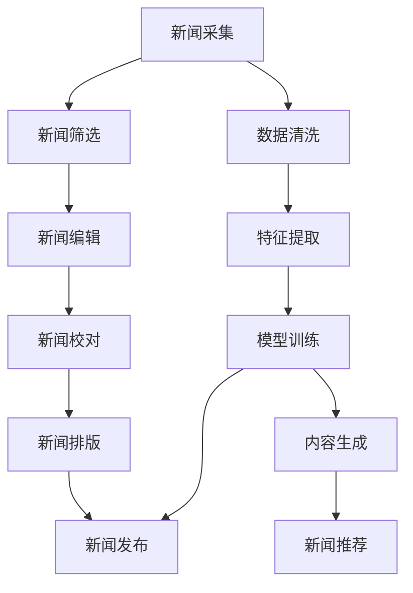

                 

# AI在新闻和媒体领域的应用

> 关键词：AI新闻,媒体自动化,自然语言处理,机器学习,深度学习,大数据分析,新闻推荐,内容生成

## 1. 背景介绍

### 1.1 问题由来

新闻和媒体行业是一个高度动态和竞争激烈的领域，对时效性和准确性的要求非常高。传统的新闻采集、编辑、校对、排版等流程，通常依赖大量人力和时间成本，且容易产生人为错误和遗漏。近年来，随着人工智能技术的发展，AI在新闻和媒体领域的应用日益广泛，成为推动行业升级转型的重要驱动力。

## 2. 核心概念与联系

### 2.1 核心概念概述

1. **人工智能(AI)**：指通过计算机模拟人类智能的行为和思维，包括机器学习、深度学习、自然语言处理等技术。
2. **机器学习(Machine Learning, ML)**：通过数据驱动的方法，让机器能够自我学习、自我改进，从而完成特定的任务。
3. **深度学习(Deep Learning, DL)**：一种基于多层神经网络的机器学习方法，能够处理更加复杂的数据结构和特征关系。
4. **自然语言处理(Natural Language Processing, NLP)**：指让计算机理解和生成自然语言的技术，包括文本分类、情感分析、文本生成等任务。
5. **大数据分析(Big Data Analytics)**：对大规模数据集进行清洗、处理、分析和可视化，以发现其中蕴含的有用信息和趋势。
6. **新闻推荐**：基于用户的历史行为和兴趣，推荐个性化的新闻内容，提升用户黏性和满意度。
7. **内容生成**：通过AI生成新闻标题、摘要、全文等，提高生产效率和内容质量。

### 2.2 核心概念原理和架构的 Mermaid 流程图



这个流程图展示了新闻和媒体生产流程中的人工智能应用，包括数据清洗、特征提取、模型训练、内容生成、新闻推荐等环节。

## 3. 核心算法原理 & 具体操作步骤

### 3.1 算法原理概述

AI在新闻和媒体领域的应用主要涉及以下几个核心算法：

1. **自然语言处理(NLP)**：通过NLP技术，AI能够对文本数据进行分词、词性标注、句法分析、情感分析等处理，从而理解文本内容和情感倾向。
2. **机器学习(ML)**：通过ML算法，AI能够从历史数据中学习新闻的特征和规律，用于新闻筛选、分类、推荐等任务。
3. **深度学习(DL)**：通过DL算法，AI能够构建更加复杂和强大的模型，如循环神经网络(RNN)、卷积神经网络(CNN)、Transformer等，提升新闻处理和生成的效果。
4. **大数据分析(Big Data Analytics)**：通过大数据分析技术，AI能够处理和分析大规模新闻数据，发现新闻热点、趋势和关联关系。

### 3.2 算法步骤详解

#### 3.2.1 新闻采集

1. **数据源采集**：通过爬虫、API接口等方式，从新闻网站、社交媒体、公开数据库等渠道采集新闻数据。
2. **数据清洗**：对采集到的数据进行去重、去噪、格式转换等预处理操作，确保数据的质量和一致性。

#### 3.2.2 新闻筛选

1. **文本预处理**：对清洗后的文本进行分词、去除停用词、词性标注等处理，得到特征向量。
2. **模型训练**：使用机器学习算法，训练文本分类模型，用于新闻主题和情感的自动筛选。
3. **实时筛选**：实时接收新采集到的文本数据，输入模型得到分类结果，筛选出符合要求的文本。

#### 3.2.3 新闻编辑

1. **文本生成**：使用深度学习模型，自动生成新闻标题、导语、摘要等，提升内容生产效率。
2. **语法检查**：使用NLP技术，自动检测文本中的语法错误和拼写错误，确保文本质量。

#### 3.2.4 新闻校对

1. **文本校对**：使用NLP技术，自动检测文本中的错别字、用词不当等问题，并提供修改建议。
2. **事实校对**：使用知识图谱等技术，自动验证文本中的事实信息，防止假新闻和误导性内容。

#### 3.2.5 新闻排版

1. **文本排版**：使用NLP技术，自动布局和排版新闻内容，确保文本的可读性和美观性。
2. **视觉设计**：使用深度学习模型，自动生成新闻页面的视觉设计元素，如图表、图片等。

#### 3.2.6 新闻推荐

1. **用户画像**：通过用户行为数据，构建用户画像，包括兴趣偏好、阅读历史等。
2. **新闻推荐模型**：使用机器学习算法，构建推荐模型，预测用户可能感兴趣的新闻。
3. **实时推荐**：实时接收用户请求，输入模型得到推荐结果，推送个性化新闻。

### 3.3 算法优缺点

#### 3.3.1 优点

1. **效率提升**：AI能够自动处理大量数据和任务，显著提升新闻生产效率。
2. **准确性高**：AI能够通过学习历史数据和模式，自动完成新闻分类、情感分析、校对等任务，减少人为错误。
3. **个性化推荐**：AI能够根据用户兴趣和行为，提供个性化的新闻推荐，提升用户满意度。
4. **内容生成**：AI能够自动生成新闻标题、摘要、导语等，减少编辑工作量，提升生产效率。

#### 3.3.2 缺点

1. **数据依赖**：AI的性能很大程度上依赖于数据的质量和数量，需要大量的标注数据进行训练。
2. **算法复杂**：深度学习等算法需要较高的计算资源和模型复杂度，对硬件要求较高。
3. **解释性不足**：AI的决策过程缺乏可解释性，难以理解其内部工作机制。
4. **偏见和错误**：AI可能学习到数据中的偏见和错误信息，导致输出内容存在偏差。
5. **隐私问题**：AI需要大量的用户数据进行训练，可能引发隐私保护问题。

### 3.4 算法应用领域

AI在新闻和媒体领域的应用涉及多个方面，包括但不限于以下几个领域：

1. **新闻采集和数据清洗**：通过爬虫和数据清洗技术，自动采集和处理新闻数据。
2. **新闻筛选和分类**：使用NLP和ML算法，自动筛选和分类新闻，提升工作效率。
3. **新闻编辑和校对**：使用NLP和深度学习技术，自动生成和校对新闻内容，减少编辑工作量。
4. **新闻排版和设计**：使用NLP和深度学习技术，自动排版和设计新闻页面，提升视觉体验。
5. **新闻推荐**：使用ML和推荐算法，提供个性化新闻推荐，提升用户粘性。
6. **假新闻检测**：使用NLP和知识图谱技术，自动检测和验证新闻中的事实信息，防止假新闻。
7. **新闻情感分析**：使用NLP技术，分析新闻情感倾向，了解公众情绪和舆论热点。

## 4. 数学模型和公式 & 详细讲解 & 举例说明

### 4.1 数学模型构建

AI在新闻和媒体领域的应用涉及多个数学模型，以下是几个典型的模型：

1. **文本分类模型**：
   - 模型输入：文本特征向量 $x$，表示文本内容。
   - 模型输出：分类结果 $y$，表示新闻类别。
   - 模型公式：$y=f(x;w)$，其中 $f$ 为分类函数，$w$ 为模型参数。

2. **情感分析模型**：
   - 模型输入：文本特征向量 $x$，表示文本内容。
   - 模型输出：情感极性 $y$，表示文本情感倾向。
   - 模型公式：$y=g(x;w)$，其中 $g$ 为情感分析函数，$w$ 为模型参数。

3. **推荐模型**：
   - 模型输入：用户特征 $u$，新闻特征 $n$。
   - 模型输出：推荐结果 $r$，表示新闻是否被推荐给用户。
   - 模型公式：$r=h(u,n;w)$，其中 $h$ 为推荐函数，$w$ 为模型参数。

### 4.2 公式推导过程

#### 4.2.1 文本分类模型

假设有 $m$ 个训练样本，每个样本包含一个特征向量 $x_i$ 和一个类别标签 $y_i$。则文本分类模型可以表示为：

$$
\min_{w} \frac{1}{m} \sum_{i=1}^m L(y_i, f(x_i;w))
$$

其中 $L$ 为损失函数，通常使用交叉熵损失。

#### 4.2.2 情感分析模型

情感分析模型可以表示为：

$$
\min_{w} \frac{1}{m} \sum_{i=1}^m L(y_i, g(x_i;w))
$$

其中 $L$ 为损失函数，通常使用交叉熵损失或感知损失。

#### 4.2.3 推荐模型

推荐模型可以表示为：

$$
\min_{w} \frac{1}{N} \sum_{i=1}^N L(r_i, h(u_i,n_i;w))
$$

其中 $L$ 为损失函数，通常使用交叉熵损失。

### 4.3 案例分析与讲解

以情感分析为例，假设有一个情感分析模型，输入为一句话 "I am happy today"，输出为正面情感。具体计算步骤如下：

1. 对输入文本进行分词和向量化处理，得到特征向量 $x$。
2. 将特征向量 $x$ 输入模型，得到情感极性 $y$。
3. 计算损失函数 $L$，得到梯度 $\nabla L$。
4. 更新模型参数 $w$，使得模型在下一个输入时能够更准确地预测情感极性。

## 5. 项目实践：代码实例和详细解释说明

### 5.1 开发环境搭建

为了快速搭建新闻和媒体应用的开发环境，可以使用以下工具和平台：

1. **Python**：作为开发语言，Python具有丰富的库和框架，适合快速迭代和实验。
2. **PyTorch**：一个开源的深度学习框架，支持动态计算图和GPU加速，适合快速训练和测试模型。
3. **TensorFlow**：另一个开源的深度学习框架，支持分布式训练和模型部署，适合大规模应用。
4. **Flask**：一个轻量级的Web框架，适合快速搭建Web应用和API接口。
5. **Docker**：一个容器化技术，可以方便地打包和部署应用。
6. **Jupyter Notebook**：一个交互式开发环境，适合进行数据探索和代码实验。

### 5.2 源代码详细实现

以下是使用PyTorch进行文本分类模型的代码实现：

```python
import torch
import torch.nn as nn
import torch.optim as optim

class TextClassifier(nn.Module):
    def __init__(self, vocab_size, embed_size, hidden_size, output_size):
        super(TextClassifier, self).__init__()
        self.embedding = nn.Embedding(vocab_size, embed_size)
        self.fc1 = nn.Linear(embed_size, hidden_size)
        self.fc2 = nn.Linear(hidden_size, output_size)
        self.relu = nn.ReLU()

    def forward(self, x):
        embedded = self.embedding(x)
        output = self.fc1(embedded)
        output = self.relu(output)
        output = self.fc2(output)
        return output

# 训练模型
model = TextClassifier(vocab_size, embed_size, hidden_size, output_size)
criterion = nn.CrossEntropyLoss()
optimizer = optim.Adam(model.parameters(), lr=learning_rate)

for epoch in range(num_epochs):
    for batch in train_data:
        optimizer.zero_grad()
        output = model(batch.input)
        loss = criterion(output, batch.label)
        loss.backward()
        optimizer.step()

# 测试模型
model.eval()
correct = 0
total = 0
with torch.no_grad():
    for batch in test_data:
        output = model(batch.input)
        _, predicted = torch.max(output.data, 1)
        total += batch.label.size(0)
        correct += (predicted == batch.label).sum().item()
accuracy = correct / total
print('Accuracy:', accuracy)
```

### 5.3 代码解读与分析

这段代码实现了一个简单的文本分类模型，使用了PyTorch框架。具体步骤如下：

1. **定义模型结构**：通过继承 `nn.Module` 类，定义了一个包含嵌入层、全连接层和激活函数的文本分类模型。
2. **训练模型**：使用 `CrossEntropyLoss` 作为损失函数，`Adam` 作为优化器，在训练数据集上进行模型训练。
3. **测试模型**：在测试数据集上评估模型性能，计算准确率。

## 6. 实际应用场景

### 6.1 智能新闻推荐

智能新闻推荐是AI在新闻和媒体领域的重要应用之一。通过机器学习算法，自动分析用户的历史阅读行为和兴趣，推荐相关新闻内容，提升用户体验和满意度。

具体实现步骤如下：

1. **数据收集**：收集用户的新闻阅读记录、点赞、评论等行为数据，构建用户画像。
2. **特征工程**：从行为数据中提取有用的特征，如阅读时间、点赞数、评论量等。
3. **模型训练**：使用协同过滤、内容推荐等算法，训练推荐模型。
4. **实时推荐**：实时接收用户请求，输入模型得到推荐结果，推送个性化新闻。

### 6.2 假新闻检测

假新闻检测是AI在新闻和媒体领域的另一重要应用。通过NLP技术和知识图谱等手段，自动检测和验证新闻中的事实信息，防止假新闻传播。

具体实现步骤如下：

1. **数据收集**：收集大量的新闻数据和标注信息，构建假新闻数据集。
2. **模型训练**：使用NLP技术，提取新闻文本的特征向量，训练分类模型。
3. **知识图谱融合**：将新闻中的实体和关系信息映射到知识图谱中，利用图谱中的知识进行事实验证。
4. **检测与验证**：输入新新闻数据，自动检测和验证其事实真实性。

### 6.3 新闻情感分析

新闻情感分析是指自动分析新闻文本的情感倾向，了解公众情绪和舆论热点。通过NLP技术，提取新闻文本的情感特征，预测情感极性。

具体实现步骤如下：

1. **数据收集**：收集大量的新闻数据，标注其情感倾向。
2. **模型训练**：使用情感分析模型，训练情感分类器。
3. **情感分析**：输入新闻文本，自动分析其情感极性。
4. **可视化展示**：将情感分析结果可视化展示，帮助编辑和决策者了解公众情绪和舆论热点。

### 6.4 未来应用展望

随着AI技术的发展，未来新闻和媒体领域将会出现更多的应用场景，包括但不限于以下几个方向：

1. **自动化编辑**：使用NLP和深度学习技术，自动生成和校对新闻内容，提升生产效率和内容质量。
2. **智能排版**：使用NLP和深度学习技术，自动排版和设计新闻页面，提升视觉体验。
3. **交互式新闻**：使用NLP和交互式技术，自动生成新闻内容，与用户进行互动，提升用户体验。
4. **新闻摘要**：使用NLP技术，自动生成新闻摘要，帮助用户快速获取新闻要点。
5. **多语种新闻**：使用机器翻译技术，自动翻译新闻内容，提供多语言新闻服务。

## 7. 工具和资源推荐

### 7.1 学习资源推荐

为了帮助开发者系统掌握AI在新闻和媒体领域的应用技术，这里推荐一些优质的学习资源：

1. **《深度学习》课程**：斯坦福大学的吴恩达教授主讲的深度学习课程，涵盖了深度学习的基本概念和经典模型。
2. **《自然语言处理》课程**：斯坦福大学的周志华教授主讲的自然语言处理课程，系统讲解了NLP的基本方法和应用场景。
3. **《推荐系统》课程**：北京大学的张辉教授主讲的推荐系统课程，深入介绍了协同过滤、内容推荐等推荐算法。
4. **《机器学习实战》书籍**：西瓜书，涵盖了机器学习的基本理论和实践技巧，适合快速上手。
5. **《Python深度学习》书籍**：Hands-On Machine Learning with Scikit-Learn, Keras, and TensorFlow，介绍了深度学习的基础和实践，适合Python开发者。

### 7.2 开发工具推荐

为了提高新闻和媒体应用的开发效率，推荐使用以下工具：

1. **PyTorch**：一个开源的深度学习框架，支持动态计算图和GPU加速，适合快速训练和测试模型。
2. **TensorFlow**：另一个开源的深度学习框架，支持分布式训练和模型部署，适合大规模应用。
3. **Flask**：一个轻量级的Web框架，适合快速搭建Web应用和API接口。
4. **Jupyter Notebook**：一个交互式开发环境，适合进行数据探索和代码实验。
5. **Docker**：一个容器化技术，可以方便地打包和部署应用。
6. **TensorBoard**：一个可视化工具，可以实时监测模型训练状态，并提供丰富的图表呈现方式，是调试模型的得力助手。

### 7.3 相关论文推荐

为了深入了解AI在新闻和媒体领域的应用，推荐阅读以下几篇论文：

1. **《假新闻检测：一种基于深度学习的方法》**：介绍了一种基于深度学习的新闻假新闻检测方法，利用CNN和LSTM网络，从多个维度检测假新闻。
2. **《基于协同过滤的新闻推荐系统》**：介绍了一种基于协同过滤的新闻推荐系统，利用矩阵分解和梯度下降算法，训练推荐模型。
3. **《情感分析：一种基于LSTM的方法》**：介绍了一种基于LSTM的新闻情感分析方法，利用序列模型，捕捉文本中的情感信息。
4. **《新闻自动摘要：一种基于BERT的方法》**：介绍了一种基于BERT的新闻自动摘要方法，利用预训练模型，自动生成新闻摘要。

## 8. 总结：未来发展趋势与挑战

### 8.1 研究成果总结

AI在新闻和媒体领域的应用已经取得了显著的成果，主要体现在以下几个方面：

1. **数据处理**：使用NLP和ML技术，自动处理和清洗新闻数据，提升了数据处理的效率和质量。
2. **模型优化**：使用深度学习技术，构建了更加复杂和强大的模型，提升了新闻处理的精度和效果。
3. **自动化应用**：使用AI技术，实现了自动化编辑、排版、推荐等功能，提升了生产效率和用户体验。
4. **应用拓展**：AI技术已经在新闻采集、假新闻检测、情感分析等多个方面得到应用，提升了新闻和媒体的价值。

### 8.2 未来发展趋势

随着AI技术的进一步发展，未来新闻和媒体领域将出现更多的应用场景，主要趋势包括：

1. **智能化水平提升**：AI技术将进一步渗透到新闻和媒体的各个环节，提升智能化水平，实现全流程自动化。
2. **个性化服务增强**：利用用户数据，提供更加个性化和精准的新闻服务，提升用户满意度和忠诚度。
3. **跨媒体融合**：AI技术将实现新闻、视频、音频等多媒体的融合，提升用户体验和传播效果。
4. **社会影响扩大**：AI技术将进一步改变新闻和媒体的社会影响方式，提升公众的参与度和互动性。

### 8.3 面临的挑战

尽管AI在新闻和媒体领域的应用已经取得了显著的成果，但仍然面临一些挑战：

1. **数据隐私和安全**：AI技术需要大量的用户数据进行训练，可能引发隐私保护和安全问题。
2. **算法透明性**：AI模型的决策过程缺乏可解释性，难以理解其内部工作机制。
3. **模型鲁棒性**：AI模型可能学习到数据中的偏见和错误信息，导致输出内容存在偏差。
4. **技术门槛高**：AI技术需要较高的技术门槛和知识储备，难以大规模推广。
5. **经济成本高**：AI技术的应用需要较高的计算资源和硬件成本，可能难以大规模部署。

### 8.4 研究展望

为了应对这些挑战，未来的研究需要在以下几个方面进行深入探讨：

1. **隐私保护**：开发更加安全、高效的隐私保护技术，保护用户数据的安全。
2. **模型可解释性**：研究可解释的AI模型，提升模型的透明性和可信度。
3. **模型鲁棒性**：开发鲁棒性更高的AI模型，避免输出内容的偏差和错误。
4. **技术普及**：降低AI技术的门槛，提高技术的普及率和应用范围。
5. **经济成本控制**：研究更加高效、低成本的AI技术，降低经济成本。

总之，AI技术在新闻和媒体领域的应用前景广阔，但需要进一步解决数据隐私、模型可解释性等关键问题，才能实现全面普及和应用。

## 9. 附录：常见问题与解答

### Q1：AI在新闻和媒体领域的应用有哪些？

A: AI在新闻和媒体领域的应用包括但不限于以下几个方面：

1. **新闻采集和数据清洗**：通过爬虫和数据清洗技术，自动采集和处理新闻数据。
2. **新闻筛选和分类**：使用NLP和ML算法，自动筛选和分类新闻，提升工作效率。
3. **新闻编辑和校对**：使用NLP和深度学习技术，自动生成和校对新闻内容，减少编辑工作量。
4. **新闻排版和设计**：使用NLP和深度学习技术，自动排版和设计新闻页面，提升视觉体验。
5. **新闻推荐**：使用ML和推荐算法，提供个性化新闻推荐，提升用户黏性。
6. **假新闻检测**：使用NLP和知识图谱等手段，自动检测和验证新闻中的事实信息，防止假新闻传播。
7. **新闻情感分析**：通过NLP技术，自动分析新闻文本的情感倾向，了解公众情绪和舆论热点。

### Q2：AI在新闻和媒体领域的优缺点有哪些？

A: AI在新闻和媒体领域的优缺点如下：

**优点**：
1. **效率提升**：AI能够自动处理大量数据和任务，显著提升新闻生产效率。
2. **准确性高**：AI能够通过学习历史数据和模式，自动完成新闻分类、情感分析、校对等任务，减少人为错误。
3. **个性化推荐**：AI能够根据用户兴趣和行为，提供个性化的新闻推荐，提升用户满意度。
4. **内容生成**：AI能够自动生成新闻标题、摘要、导语等，减少编辑工作量，提升生产效率。

**缺点**：
1. **数据依赖**：AI的性能很大程度上依赖于数据的质量和数量，需要大量的标注数据进行训练。
2. **算法复杂**：深度学习等算法需要较高的计算资源和模型复杂度，对硬件要求较高。
3. **解释性不足**：AI的决策过程缺乏可解释性，难以理解其内部工作机制。
4. **偏见和错误**：AI可能学习到数据中的偏见和错误信息，导致输出内容存在偏差。
5. **隐私问题**：AI需要大量的用户数据进行训练，可能引发隐私保护问题。

### Q3：AI在新闻和媒体领域的应用前景如何？

A: AI在新闻和媒体领域的应用前景广阔，主要体现在以下几个方面：

1. **智能化水平提升**：AI技术将进一步渗透到新闻和媒体的各个环节，提升智能化水平，实现全流程自动化。
2. **个性化服务增强**：利用用户数据，提供更加个性化和精准的新闻服务，提升用户满意度和忠诚度。
3. **跨媒体融合**：AI技术将实现新闻、视频、音频等多媒体的融合，提升用户体验和传播效果。
4. **社会影响扩大**：AI技术将进一步改变新闻和媒体的社会影响方式，提升公众的参与度和互动性。

### Q4：AI在新闻和媒体领域的研究趋势是什么？

A: AI在新闻和媒体领域的研究趋势如下：

1. **智能化水平提升**：开发更加智能化的新闻和媒体处理技术，提升智能化水平。
2. **个性化服务增强**：研究个性化推荐、内容生成等技术，提升用户体验。
3. **跨媒体融合**：研究跨媒体融合技术，提升用户体验和传播效果。
4. **模型可解释性**：研究可解释的AI模型，提升模型的透明性和可信度。
5. **隐私保护**：研究隐私保护技术，保护用户数据的安全。
6. **模型鲁棒性**：开发鲁棒性更高的AI模型，避免输出内容的偏差和错误。

### Q5：AI在新闻和媒体领域的应用挑战有哪些？

A: AI在新闻和媒体领域的应用挑战如下：

1. **数据隐私和安全**：AI技术需要大量的用户数据进行训练，可能引发隐私保护和安全问题。
2. **算法透明性**：AI模型的决策过程缺乏可解释性，难以理解其内部工作机制。
3. **模型鲁棒性**：AI模型可能学习到数据中的偏见和错误信息，导致输出内容存在偏差。
4. **技术门槛高**：AI技术需要较高的技术门槛和知识储备，难以大规模推广。
5. **经济成本高**：AI技术的应用需要较高的计算资源和硬件成本，可能难以大规模部署。

作者：禅与计算机程序设计艺术 / Zen and the Art of Computer Programming

