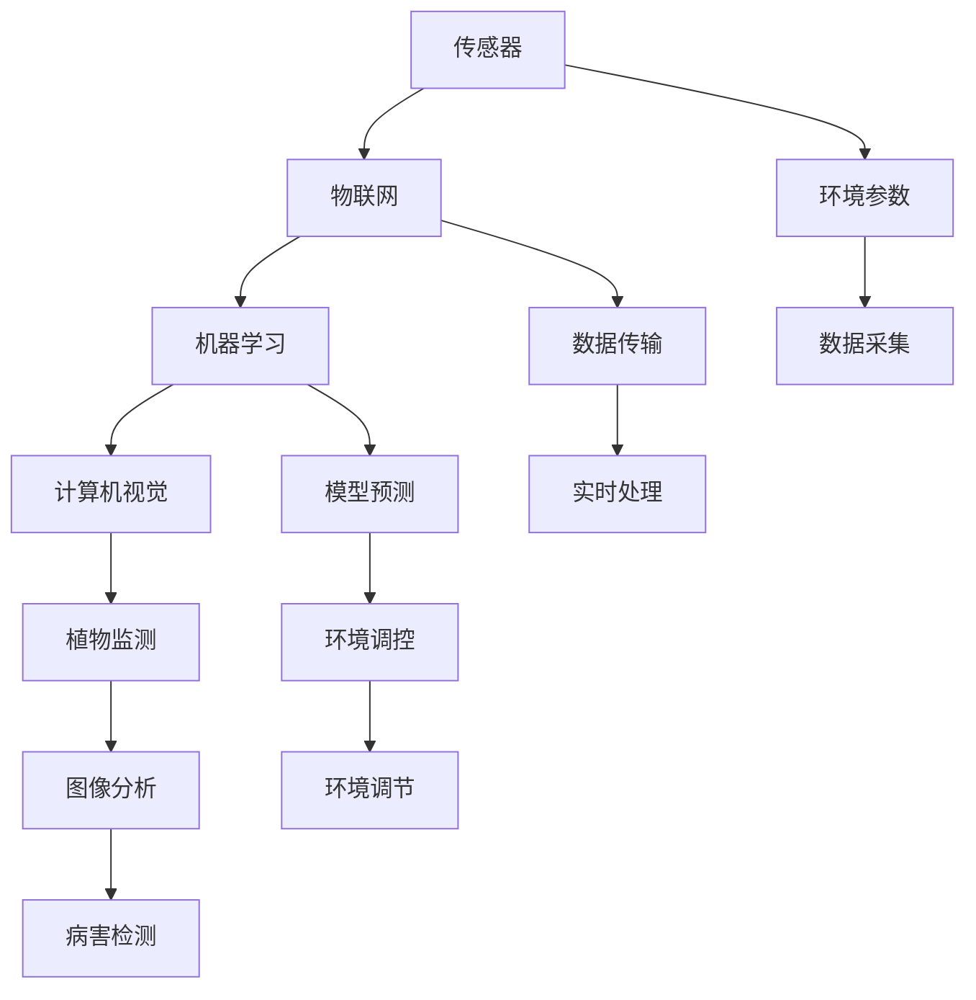

                 

# AI在智能园艺中的应用：自动化植物护理

> 关键词：智能园艺,植物护理,自动化,机器学习,物联网,计算机视觉

## 1. 背景介绍

### 1.1 问题由来
随着城市化的加速和生活水平的提高，越来越多的人开始在家庭、办公场所甚至城市屋顶花园中种植植物，以提升生活质量和城市生态环境。然而，传统的人工植物养护不仅耗时耗力，还难以保证植物生长的最佳条件，比如光照、水分、温度等。随着人工智能和物联网技术的发展，智能园艺应运而生。通过集成传感器、机器学习等技术，智能园艺系统能够实时监测植物的生长状态，自动调整环境条件，大大提升了植物养护的效率和效果。

### 1.2 问题核心关键点
智能园艺的核心在于利用传感器采集植物生长的关键数据，通过机器学习模型进行分析和决策，自动调节环境参数。具体包括：

- 数据采集：包括温度、湿度、光照强度、土壤湿度、二氧化碳浓度等环境参数的实时监测。
- 数据处理：对采集到的数据进行预处理，消除噪声和异常值，提取有效特征。
- 模型训练：使用机器学习模型对植物生长数据进行训练，预测最佳的生长环境参数。
- 环境调控：根据模型预测结果，自动调节环境参数，如灌溉、施肥、光照、温度等。
- 用户体验：提供可视化的监测界面，让用户实时了解植物生长状态和环境条件。

### 1.3 问题研究意义
智能园艺不仅有助于提升植物的生长质量和产量，还能大幅减少人工劳动，降低养护成本。通过应用机器学习和物联网技术，智能园艺为农业智能化、绿色化提供了新的途径，对推动农业现代化和可持续发展的意义重大。

## 2. 核心概念与联系

### 2.1 核心概念概述

智能园艺融合了人工智能、物联网、机器学习、计算机视觉等多个前沿技术。其主要概念包括：

- **传感器(Sensors)**：用于监测环境参数的各类传感器，如温湿度传感器、光照传感器、土壤湿度传感器等。
- **物联网(IoT)**：通过无线通信技术，将传感器与中央控制系统连接，实现数据的实时传输和处理。
- **机器学习(ML)**：利用历史植物生长数据，训练机器学习模型，预测最佳的生长环境参数。
- **计算机视觉(CV)**：通过摄像头等设备，实时监测植物的生长状态，自动识别植物疾病和虫害。

这些概念之间的逻辑关系可以通过以下Mermaid流程图来展示：



这个流程图展示了智能园艺的核心技术路径：传感器采集环境参数，通过物联网传输到中央控制系统，使用机器学习模型进行预测分析，再通过计算机视觉技术进行植物监测和疾病识别，最后根据模型预测结果自动调整环境参数。

## 3. 核心算法原理 & 具体操作步骤
### 3.1 算法原理概述

智能园艺中的核心算法包括数据预处理、机器学习模型训练和环境参数调控。具体流程如下：

1. **数据预处理**：对采集到的环境参数进行预处理，包括滤波、归一化等操作，确保数据的质量和一致性。
2. **机器学习模型训练**：使用历史植物生长数据，训练机器学习模型，预测最佳的环境参数。
3. **环境参数调控**：根据模型预测结果，自动调节灌溉、施肥、光照、温度等环境参数。

### 3.2 算法步骤详解

**Step 1: 数据采集和预处理**

1. **传感器部署**：在植物周围部署各类传感器，如温湿度传感器、光照传感器、土壤湿度传感器等。
2. **数据采集**：使用物联网技术，将传感器数据实时传输到中央控制系统。
3. **数据预处理**：对采集到的数据进行滤波、归一化等操作，消除噪声和异常值，提取有效特征。

**Step 2: 机器学习模型训练**

1. **数据集构建**：收集历史植物生长数据，包括不同品种、不同生长阶段的数据。
2. **特征工程**：对数据进行特征提取，选择与植物生长状态相关的特征。
3. **模型训练**：使用历史数据训练机器学习模型，如线性回归、决策树、随机森林等，预测最佳环境参数。

**Step 3: 环境参数调控**

1. **模型预测**：根据当前环境参数和历史数据，使用机器学习模型预测最佳环境参数。
2. **环境调节**：根据模型预测结果，自动调节灌溉、施肥、光照、温度等环境参数，如调节灌溉量、施肥次数、灯光亮度等。
3. **持续监测**：持续监测植物生长状态和环境参数，确保系统稳定运行。

### 3.3 算法优缺点

智能园艺的机器学习模型具有以下优点：

1. **高效精准**：通过机器学习模型，实时预测最佳环境参数，能够大幅提高植物的生长效率和质量。
2. **自动调节**：模型自动调节环境参数，减少人工干预，降低养护成本。
3. **自适应性强**：模型可以根据不同的植物品种和生长阶段进行自适应调整，适用于多种植物养护场景。

同时，该方法也存在一定的局限性：

1. **数据依赖**：模型依赖大量的历史数据进行训练，数据收集和标注工作较为繁琐。
2. **环境复杂性**：植物生长受多种环境因素影响，模型预测可能存在误差。
3. **模型可解释性**：机器学习模型的决策过程较为复杂，难以解释其内部机制。

尽管存在这些局限性，但就目前而言，机器学习模型在智能园艺中的应用仍是一个重要方向，为植物养护带来了新的可能性。

### 3.4 算法应用领域

智能园艺技术不仅适用于家庭植物养护，还在农业、城市绿化等领域有广泛应用，具体包括：

- **家庭园艺**：家庭用户通过智能园艺系统，轻松管理阳台、屋顶等小型植物环境，享受绿色生活。
- **智能温室**：农业企业使用智能温室，通过智能园艺系统优化环境参数，提高作物产量和质量。
- **城市绿化**：城市管理者使用智能园艺系统，实时监测植物生长状态，提升城市绿化效果。
- **植物研究**：植物研究机构使用智能园艺系统，进行植物生长规律的实验研究，加速科研成果的转化应用。

这些应用场景展示了智能园艺的广泛适用性和巨大潜力。随着技术的不断进步，智能园艺系统将更加智能化、自动化，为人类生活环境和农业生产带来更多便利。

## 4. 数学模型和公式 & 详细讲解  
### 4.1 数学模型构建

智能园艺中常用的机器学习模型包括线性回归、决策树、随机森林等。这里以线性回归模型为例，介绍其构建过程。

假设环境参数 $X$ 包括温度 $T$、湿度 $H$、光照强度 $L$ 等，植物生长状态 $Y$ 为叶绿素含量、果实产量等。则线性回归模型可以表示为：

$$
Y = \beta_0 + \beta_1 X_1 + \beta_2 X_2 + \ldots + \beta_n X_n + \epsilon
$$

其中 $\beta_0, \beta_1, \ldots, \beta_n$ 为模型参数，$\epsilon$ 为误差项。

### 4.2 公式推导过程

线性回归模型的最小二乘法求解公式为：

$$
\beta = (\mathbf{X}^T \mathbf{X})^{-1} \mathbf{X}^T \mathbf{Y}
$$

其中 $\mathbf{X}$ 为样本特征矩阵，$\mathbf{Y}$ 为样本标签向量。

### 4.3 案例分析与讲解

以温湿度传感器数据为例，假设已收集到1000个历史数据点 $(X_i, Y_i)$，其中 $X_i$ 为温度 $T_i$ 和湿度 $H_i$，$Y_i$ 为植物生长状态 $Y_i$。

**Step 1: 数据预处理**

对 $X$ 和 $Y$ 进行标准化处理，得到 $\mathbf{X}'$ 和 $\mathbf{Y}'$。

**Step 2: 模型训练**

计算 $\mathbf{X}'^T \mathbf{X}'$ 和 $\mathbf{X}'^T \mathbf{Y}'$，使用公式求解 $\beta$。

**Step 3: 环境调节**

根据当前温度 $T$ 和湿度 $H$，计算 $Y'$ 的预测值 $\hat{Y'}$，调整灌溉、施肥等环境参数。

## 5. 项目实践：代码实例和详细解释说明
### 5.1 开发环境搭建

在进行智能园艺开发前，需要准备好开发环境。以下是使用Python进行机器学习开发的常见环境配置流程：

1. 安装Anaconda：从官网下载并安装Anaconda，用于创建独立的Python环境。

2. 创建并激活虚拟环境：
```bash
conda create -n ml-env python=3.8 
conda activate ml-env
```

3. 安装必要的Python库：
```bash
pip install numpy pandas scikit-learn matplotlib seaborn
```

4. 安装机器学习库：
```bash
pip install scikit-learn
```

5. 安装物联网库：
```bash
pip install paho-mqtt
```

完成上述步骤后，即可在`ml-env`环境中开始智能园艺系统的开发。

### 5.2 源代码详细实现

这里以一个简单的智能温室控制系统为例，展示智能园艺系统的实现。

**Step 1: 数据采集**

部署温湿度传感器，并使用物联网设备将数据实时传输到中央控制系统。

```python
import paho.mqtt.client as mqtt
import time

client = mqtt.Client()
client.connect("mqtt.example.com", 1883, 60)

def on_connect(client, userdata, flags, rc):
    print(f"Connected with result code {rc}")
    client.subscribe("sensors/temperature")
    client.subscribe("sensors/humidity")

def on_message(client, userdata, msg):
    if msg.topic == "sensors/temperature":
        temperature = float(msg.payload)
    elif msg.topic == "sensors/humidity":
        humidity = float(msg.payload)
    else:
        pass

    # 将数据发送给机器学习模型进行预测
    send_data(temperature, humidity)

def send_data(temperature, humidity):
    # 将数据发送给机器学习模型进行预测
    pass

client.on_connect = on_connect
client.on_message = on_message

client.loop_forever()
```

**Step 2: 数据预处理**

对采集到的温湿度数据进行预处理，包括滤波、归一化等操作。

```python
import numpy as np

def preprocess_data(temperature, humidity):
    # 对数据进行滤波、归一化等预处理操作
    pass
```

**Step 3: 机器学习模型训练**

使用历史数据训练线性回归模型。

```python
from sklearn.linear_model import LinearRegression
from sklearn.metrics import mean_squared_error

# 加载历史数据
data = np.loadtxt("plant_data.csv", delimiter=",")

X = data[:, :-1]
Y = data[:, -1]

# 进行数据预处理
X = preprocess_data(X)

# 训练线性回归模型
model = LinearRegression()
model.fit(X, Y)

# 计算模型性能
mse = mean_squared_error(Y, model.predict(X))
print(f"Model MSE: {mse:.2f}")
```

**Step 4: 环境参数调控**

根据模型预测结果，自动调节灌溉、施肥等环境参数。

```python
def adjust_environment(temperature, humidity, model):
    # 使用机器学习模型预测最佳环境参数
    Y_pred = model.predict([[temperature, humidity]])

    # 根据预测结果调整环境参数
    if Y_pred > threshold:
        # 增加灌溉量、施肥量等
        pass
    else:
        # 减少灌溉量、施肥量等
        pass
```

### 5.3 代码解读与分析

让我们再详细解读一下关键代码的实现细节：

**Step 1: 数据采集**

使用MQTT协议将温湿度传感器数据实时传输到中央控制系统。MQTT协议轻量级、高效，适合物联网环境下的数据传输。

**Step 2: 数据预处理**

对温湿度数据进行预处理，包括滤波、归一化等操作。预处理过程使用Numpy库，简单易用。

**Step 3: 机器学习模型训练**

使用Scikit-learn库训练线性回归模型，Scikit-learn库功能强大，易用性好，适合快速原型开发。

**Step 4: 环境参数调控**

根据模型预测结果，自动调节灌溉、施肥等环境参数。调整过程使用条件判断语句，逻辑清晰，易于扩展。

## 6. 实际应用场景
### 6.1 智能温室

智能温室系统可以实时监测温湿度、光照、土壤湿度等环境参数，自动调节灌溉、施肥、光照等参数，实现对温室环境的精确控制。通过机器学习模型预测最佳环境参数，提高作物的产量和品质，降低人工成本。

### 6.2 城市绿化

城市绿化管理者使用智能园艺系统，实时监测公园、道路两旁的植物生长状态，自动调节灌溉、施肥等参数，确保植物健康成长。通过物联网技术，将城市绿化的数据实时传输到中央控制系统，实现可视化管理。

### 6.3 家庭园艺

家庭用户使用智能园艺系统，实时监测阳台、屋顶等小型植物环境，自动调节灌溉、施肥等参数，确保植物健康生长。通过手机App或Web界面，用户可以随时查看植物生长状态和环境参数。

### 6.4 植物研究

植物研究机构使用智能园艺系统，实时监测不同品种、不同生长阶段植物的生长状态，自动调节环境参数，提高实验数据的准确性和可靠性。通过数据积累和模型训练，研究者可以深入探索植物生长规律，加速科研成果的转化应用。

## 7. 工具和资源推荐
### 7.1 学习资源推荐

为了帮助开发者系统掌握智能园艺技术的理论基础和实践技巧，这里推荐一些优质的学习资源：

1. **《智能园艺技术》系列书籍**：介绍智能园艺技术的基本原理、实际应用和未来发展方向。
2. **Coursera《物联网与智能农业》课程**：由农业专家和工程师授课，涵盖智能农业的前沿技术和实践案例。
3. **Arduino官方文档**：Arduino开发平台文档，详细介绍了物联网设备开发所需的硬件和软件知识。
4. **TensorFlow官方文档**：深度学习框架TensorFlow的官方文档，提供丰富的机器学习算法和模型实现。
5. **Kaggle智能园艺竞赛**：通过参与Kaggle智能园艺竞赛，学习智能园艺技术和模型优化方法。

通过对这些资源的学习实践，相信你一定能够快速掌握智能园艺技术的精髓，并用于解决实际的植物养护问题。

### 7.2 开发工具推荐

高效的开发离不开优秀的工具支持。以下是几款用于智能园艺开发的常用工具：

1. **Arduino**：开源硬件平台，适合开发各种物联网设备，提供了丰富的传感器和控制模块。
2. **TensorFlow**：深度学习框架，适合开发各种机器学习模型，支持Python、C++等多种语言。
3. **IoT平台**：如ThingWorx、Beehive等，提供云端物联网设备管理和服务，方便数据采集和处理。
4. **Visual Studio Code**：轻量级开发环境，支持Python、Java等多种编程语言，提供了丰富的扩展插件。
5. **GitHub**：代码托管平台，方便团队协作和代码共享。

合理利用这些工具，可以显著提升智能园艺系统的开发效率，加快创新迭代的步伐。

### 7.3 相关论文推荐

智能园艺技术的发展源于学界的持续研究。以下是几篇奠基性的相关论文，推荐阅读：

1. **《基于物联网的智能温室控制系统》**：介绍了一种基于物联网技术的智能温室控制系统，实现了对温室环境的精确控制。
2. **《基于机器学习的智能园艺系统》**：提出了一种使用机器学习模型预测植物生长状态，自动调节环境参数的智能园艺系统。
3. **《物联网在智能农业中的应用》**：探讨了物联网技术在智能农业中的应用，包括数据采集、传输和处理等环节。
4. **《智能园艺系统的设计与实现》**：介绍了智能园艺系统的设计和实现方法，包括传感器部署、数据采集、模型训练等关键技术。
5. **《植物生长的物联网监测与控制》**：研究了基于物联网技术的植物生长监测和控制方法，提高植物生长效率和产量。

这些论文代表了大规模智能园艺技术的最新进展，通过学习这些前沿成果，可以帮助研究者把握学科前进方向，激发更多的创新灵感。

## 8. 总结：未来发展趋势与挑战

### 8.1 总结

本文对基于机器学习的智能园艺系统进行了全面系统的介绍。首先阐述了智能园艺技术的研究背景和意义，明确了机器学习在植物养护中的应用价值。其次，从原理到实践，详细讲解了机器学习模型的构建和微调方法，给出了智能园艺系统开发的完整代码实例。同时，本文还广泛探讨了智能园艺系统在智能温室、城市绿化、家庭园艺、植物研究等多个场景中的应用前景，展示了智能园艺技术的广泛适用性和巨大潜力。

通过本文的系统梳理，可以看到，基于机器学习的智能园艺技术正在成为农业智能化、绿色化的重要手段，极大地提升了植物生长效率和质量，为农业现代化和可持续发展的目标提供了新的技术路径。

### 8.2 未来发展趋势

展望未来，智能园艺技术将呈现以下几个发展趋势：

1. **物联网技术普及**：随着物联网设备的普及，智能园艺系统将更加智能化、自动化，实现对植物生长状态的实时监测和环境参数的精确调控。
2. **机器学习模型优化**：未来将出现更多高效的机器学习模型和算法，提升预测准确性和鲁棒性，增强系统稳定性。
3. **多模态数据融合**：智能园艺系统将融合传感器、摄像头等多种模态数据，提高植物生长状态监测的全面性和准确性。
4. **云计算和大数据**：通过云计算和大数据分析技术，智能园艺系统可以处理海量数据，实现更精细化的植物管理。
5. **智能设备集成**：智能园艺系统将与智能家居、智能建筑等系统集成，实现更全面的智慧城市建设。

以上趋势凸显了智能园艺技术的发展方向，这些方向的探索发展，必将进一步提升智能园艺系统的性能和应用范围，为农业现代化和绿色可持续发展提供新的解决方案。

### 8.3 面临的挑战

尽管智能园艺技术已经取得了瞩目成就，但在迈向更加智能化、普适化应用的过程中，它仍面临着诸多挑战：

1. **数据采集成本高**：物联网设备的部署和维护成本较高，限制了智能园艺系统的普及。
2. **环境复杂性**：植物生长受多种环境因素影响，模型预测可能存在误差，需要更多的数据积累和模型优化。
3. **系统稳定性**：智能园艺系统需要处理大量的实时数据，存在系统崩溃和网络延迟的风险。
4. **模型可解释性**：机器学习模型的决策过程较为复杂，难以解释其内部机制，影响用户信任和接受度。
5. **技术标准化**：智能园艺系统涉及多种技术标准和协议，缺乏统一的标准化规范，影响系统互操作性和扩展性。

尽管存在这些挑战，但通过持续的技术创新和改进，智能园艺技术有望逐步克服这些问题，为农业智能化和绿色可持续发展提供强有力的技术支撑。

### 8.4 研究展望

面向未来，智能园艺技术的研究还需要在以下几个方面寻求新的突破：

1. **优化传感器部署**：研究高效低成本的传感器部署方案，降低智能园艺系统的开发和维护成本。
2. **提升模型准确性**：研究更高效的机器学习算法和模型，提升预测准确性和鲁棒性，增强系统稳定性。
3. **增强系统鲁棒性**：研究分布式系统架构和容错机制，提升智能园艺系统的稳定性和可靠性。
4. **加强模型可解释性**：研究可解释性强的机器学习模型和算法，提升系统的透明度和用户信任度。
5. **推动技术标准化**：制定智能园艺系统相关的技术标准和协议，促进系统互操作性和扩展性。

这些研究方向的探索，必将引领智能园艺技术迈向更高的台阶，为农业智能化和绿色可持续发展提供新的技术路径。总之，智能园艺技术需要在多方面进行全面优化和改进，才能真正实现农业智能化和绿色可持续发展的目标。

