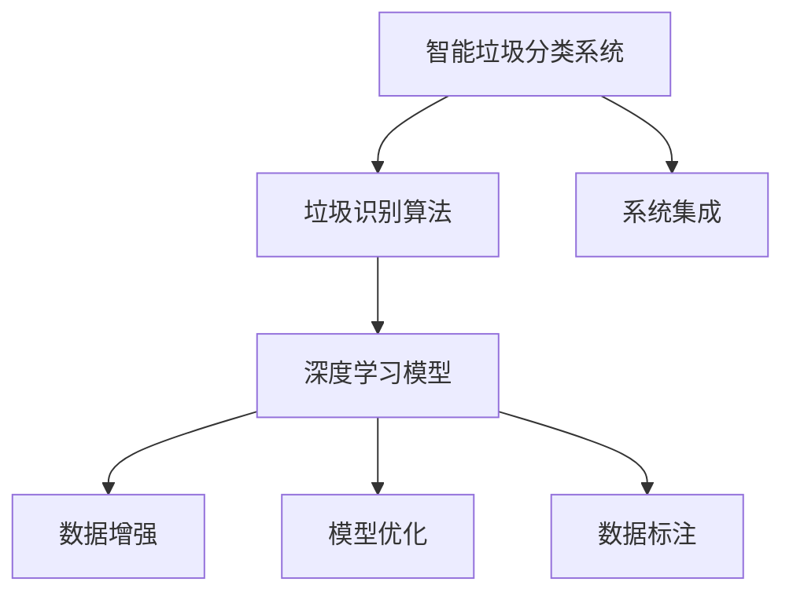

                 

# AI在智能垃圾分类中的应用：提高回收率

> 关键词：智能垃圾分类, 垃圾识别, AI算法, 机器学习, 垃圾回收, 数据分析, 垃圾分类系统

## 1. 背景介绍

### 1.1 问题由来
随着城市化进程的加速和人口规模的不断扩大，城市垃圾量呈现出逐年增长的趋势。垃圾分类作为解决垃圾危机的重要手段，在提高资源利用效率、保护生态环境方面具有重要意义。然而，传统的垃圾分类依赖于人工分类，工作量巨大，效率低下，且容易出现分类错误。因此，利用人工智能(AI)技术进行智能垃圾分类成为了近年来研究的热点。

### 1.2 问题核心关键点
智能垃圾分类指的是使用计算机视觉、深度学习等技术，通过摄像头、传感器等设备收集垃圾信息，并利用算法进行自动识别、分类，从而减少人工成本，提高垃圾分类的准确性和效率。核心关键点包括：

- **数据采集**：从不同角度收集垃圾图像、重量、材质等数据。
- **模型训练**：使用深度学习算法对数据进行训练，构建垃圾分类模型。
- **识别分类**：对采集到的垃圾进行自动分类，并输出分类结果。
- **反馈优化**：根据实际分类结果，不断优化模型，提升准确性。
- **系统集成**：将垃圾分类系统与城市垃圾处理流程集成，实现自动化分类。

### 1.3 问题研究意义
智能垃圾分类具有以下显著意义：

- **提升回收率**：自动分类可以减少人工错误，提高回收率。
- **提高效率**：自动化处理大幅提升垃圾分类的速度和效率。
- **减少成本**：减少人工成本，降低城市垃圾处理成本。
- **促进环保**：提高资源利用效率，减少环境污染，推动可持续发展。
- **辅助管理**：为城市管理提供数据支持，优化垃圾处理策略。

## 2. 核心概念与联系

### 2.1 核心概念概述

为更好地理解智能垃圾分类技术，本节将介绍几个密切相关的核心概念：

- **智能垃圾分类系统**：结合计算机视觉、深度学习等技术，对垃圾进行自动识别和分类的智能系统。
- **垃圾识别算法**：通过算法实现对垃圾的分类和识别，包括但不限于卷积神经网络(CNN)、循环神经网络(RNN)等。
- **深度学习模型**：基于多层神经网络的深度学习模型，如卷积神经网络(CNN)、循环神经网络(RNN)、长短期记忆网络(LSTM)等。
- **数据增强**：通过数据预处理、增强、合成等技术，扩大训练数据集，提升模型泛化能力。
- **模型优化**：通过超参数调整、模型结构优化、正则化等方法，提升模型性能。
- **数据标注**：通过人工标注或自动标注，为模型提供监督信号，帮助模型学习分类规律。
- **系统集成**：将垃圾分类模型与城市垃圾处理系统集成，实现自动化分类和处理。

这些核心概念之间的逻辑关系可以通过以下Mermaid流程图来展示：



这个流程图展示了一个典型的智能垃圾分类系统的工作流程：

1. 通过垃圾识别算法，从摄像头、传感器等设备采集到的垃圾图像中提取特征。
2. 利用深度学习模型对提取的特征进行分类和识别，得到分类结果。
3. 通过数据增强和模型优化，提升模型泛化能力和识别精度。
4. 使用人工标注或自动标注为模型提供监督信号。
5. 将分类结果输出至城市垃圾处理系统，实现自动化分类和处理。

## 3. 核心算法原理 & 具体操作步骤
### 3.1 算法原理概述

智能垃圾分类主要依赖于深度学习技术，其中卷积神经网络(CNN)是核心算法之一。CNN通过多层卷积和池化操作，提取图像中的特征，并通过全连接层进行分类。其核心流程如下：

1. **特征提取**：通过卷积层提取图像中的局部特征。
2. **特征融合**：通过池化层将特征进行融合，减少参数量，提高模型泛化能力。
3. **分类**：通过全连接层对融合后的特征进行分类，输出分类结果。

智能垃圾分类的主要流程如下：

1. **数据准备**：收集垃圾图像、重量、材质等数据，并进行预处理。
2. **模型训练**：使用卷积神经网络(CNN)进行模型训练，优化超参数。
3. **模型测试**：在测试集上测试模型性能，评估分类准确率。
4. **系统部署**：将训练好的模型集成到城市垃圾处理系统中，实现自动化分类。

### 3.2 算法步骤详解

**Step 1: 数据准备**

智能垃圾分类的第一步是数据准备，主要包括以下几个环节：

- **数据收集**：从摄像头、传感器等设备采集垃圾图像、重量、材质等数据。
- **数据预处理**：对数据进行清洗、增强、归一化等预处理，以提升模型训练效果。
- **数据标注**：通过人工标注或自动标注为数据提供监督信号，帮助模型学习分类规律。

**Step 2: 模型训练**

模型训练是智能垃圾分类的核心环节，主要包括以下几个步骤：

- **构建模型**：选择合适的深度学习模型，如卷积神经网络(CNN)，并设置初始参数。
- **损失函数选择**：选择合适的损失函数，如交叉熵损失，衡量模型预测结果与真实标签之间的差异。
- **优化器选择**：选择合适的优化器，如Adam、SGD等，更新模型参数。
- **超参数调整**：通过网格搜索、随机搜索等方法，优化模型超参数，如学习率、批量大小等。
- **模型评估**：在验证集上评估模型性能，根据评估结果调整模型结构或超参数。

**Step 3: 模型测试**

模型测试是评估智能垃圾分类模型性能的重要环节，主要包括以下几个步骤：

- **测试集划分**：将数据集划分为训练集、验证集和测试集，其中训练集和验证集用于模型训练和超参数调整，测试集用于评估模型性能。
- **模型预测**：在测试集上使用训练好的模型进行预测，输出分类结果。
- **评估指标**：使用准确率、召回率、F1值等指标评估模型性能，衡量模型在分类任务上的表现。
- **性能调优**：根据评估结果调整模型结构和超参数，进一步提升模型性能。

**Step 4: 系统部署**

系统部署是将智能垃圾分类模型集成到城市垃圾处理系统中，实现自动化分类的关键环节。主要包括以下几个步骤：

- **数据输入**：将摄像头、传感器等设备采集到的垃圾图像、重量、材质等数据输入系统。
- **模型推理**：使用训练好的模型对输入数据进行推理，输出分类结果。
- **结果输出**：将分类结果输出至城市垃圾处理系统，实现自动化分类和处理。
- **系统集成**：将智能垃圾分类系统与城市垃圾处理系统集成，实现系统化、自动化操作。

### 3.3 算法优缺点

智能垃圾分类方法具有以下优点：

1. **自动化程度高**：智能垃圾分类系统可以自动完成垃圾分类，减少人工工作量。
2. **分类准确度高**：深度学习算法在图像分类任务上具有较高的准确度，可以显著提高垃圾分类的准确性。
3. **实时性**：智能垃圾分类系统可以实现实时处理，提高垃圾分类的效率。
4. **成本低**：相对于人工分类，智能垃圾分类系统具有较高的经济效益。

同时，该方法也存在一些局限性：

1. **数据采集成本高**：智能垃圾分类系统需要大量的垃圾图像、重量、材质等数据，数据采集成本较高。
2. **模型训练时间长**：深度学习模型训练时间较长，需要大量计算资源。
3. **环境适应性差**：不同环境下的垃圾种类、材质差异较大，模型泛化能力有限。
4. **可解释性不足**：深度学习模型通常是"黑盒"系统，难以解释其内部工作机制。
5. **数据标注工作量大**：数据标注需要大量人工参与，成本较高，且存在标注错误的风险。

尽管存在这些局限性，但智能垃圾分类方法在大规模垃圾分类和自动化处理方面仍然具有显著的优势。未来相关研究将集中在如何降低数据采集成本、提升模型泛化能力、增强模型可解释性等方面。

### 3.4 算法应用领域

智能垃圾分类技术已经在多个领域得到应用，主要包括以下几个方面：

1. **城市垃圾处理**：在城市垃圾分类、回收、处理过程中，使用智能垃圾分类系统提高垃圾回收率。
2. **企业垃圾处理**：在企业生产过程中，使用智能垃圾分类系统处理工业垃圾，提高资源利用效率。
3. **家庭垃圾处理**：在家庭生活中，使用智能垃圾分类系统进行垃圾分类，减少人工工作量。
4. **公共场所垃圾处理**：在公共场所如公园、校园等，使用智能垃圾分类系统引导人们正确分类垃圾。
5. **农业废弃物处理**：在农业生产过程中，使用智能垃圾分类系统处理农业废弃物，提高资源回收率。

## 4. 数学模型和公式 & 详细讲解 & 举例说明

### 4.1 数学模型构建

假设智能垃圾分类任务为二分类问题，即垃圾被分类为可回收垃圾和不可回收垃圾。设输入为$x$，输出为$y$，其中$y \in \{0, 1\}$，表示垃圾是否可回收。模型的目标是学习一个函数$f(x)$，将输入$x$映射到输出$y$。

模型的损失函数通常采用交叉熵损失函数，定义为：

$$
\mathcal{L}(y, \hat{y}) = -(y\log\hat{y} + (1-y)\log(1-\hat{y}))
$$

其中$\hat{y}$为模型预测结果，$y$为真实标签。模型的优化目标是使得损失函数$\mathcal{L}$最小化。

### 4.2 公式推导过程

以卷积神经网络(CNN)为例，推导智能垃圾分类的核心公式。

卷积神经网络(CNN)由多个卷积层和池化层构成，用于提取图像特征。假设卷积神经网络包含$L$个卷积层和$P$个全连接层，则模型输出的公式为：

$$
\hat{y} = \sigma(\sum_{k=1}^{P} w_k^Tz_k)
$$

其中$z_k = f_k(x)$为第$k$层的特征映射，$w_k$为全连接层的权重，$\sigma$为激活函数。假设激活函数为ReLU，则公式可进一步简化为：

$$
\hat{y} = \sum_{k=1}^{P} w_k^Tf_k(x)
$$

设损失函数为交叉熵损失，则梯度下降优化算法为：

$$
w_k \leftarrow w_k - \eta\frac{\partial\mathcal{L}}{\partial w_k}
$$

其中$\eta$为学习率。

### 4.3 案例分析与讲解

以一张垃圾图像的智能分类为例，解释卷积神经网络(CNN)的工作原理。

假设输入图像$x$为大小为$224 \times 224$的RGB图像，卷积神经网络(CNN)由多个卷积层和池化层构成。首先，通过第一层卷积层提取图像的局部特征，得到特征映射$z_1$：

$$
z_1 = f_1(x) = \sigma(g_1(x))
$$

其中$g_1$为卷积核，$\sigma$为激活函数。接着，通过池化层对特征映射$z_1$进行降维处理，得到池化特征$z_2$：

$$
z_2 = f_2(z_1) = \sigma(g_2(z_1))
$$

重复上述步骤，通过多层卷积和池化操作，提取图像的高级特征。最后，通过全连接层输出分类结果$\hat{y}$：

$$
\hat{y} = \sum_{k=1}^{P} w_k^Tf_k(x)
$$

通过反向传播算法，计算损失函数$\mathcal{L}$对每个参数$w_k$的梯度，并更新模型参数，优化模型性能。

## 5. 项目实践：代码实例和详细解释说明

### 5.1 开发环境搭建

在进行智能垃圾分类开发前，我们需要准备好开发环境。以下是使用Python进行PyTorch开发的环境配置流程：

1. 安装Anaconda：从官网下载并安装Anaconda，用于创建独立的Python环境。

2. 创建并激活虚拟环境：
```bash
conda create -n pytorch-env python=3.8 
conda activate pytorch-env
```

3. 安装PyTorch：根据CUDA版本，从官网获取对应的安装命令。例如：
```bash
conda install pytorch torchvision torchaudio cudatoolkit=11.1 -c pytorch -c conda-forge
```

4. 安装TensorFlow：
```bash
pip install tensorflow
```

5. 安装Keras：
```bash
pip install keras
```

6. 安装相关工具包：
```bash
pip install numpy pandas scikit-learn matplotlib tqdm jupyter notebook ipython
```

完成上述步骤后，即可在`pytorch-env`环境中开始开发实践。

### 5.2 源代码详细实现

下面以卷积神经网络(CNN)为例，给出使用PyTorch进行智能垃圾分类的代码实现。

首先，定义智能垃圾分类任务的数据处理函数：

```python
from torch.utils.data import Dataset
import torch
import numpy as np
import matplotlib.pyplot as plt
from PIL import Image

class GarbageDataset(Dataset):
    def __init__(self, images, labels, transform=None):
        self.images = images
        self.labels = labels
        self.transform = transform
        
    def __len__(self):
        return len(self.images)
    
    def __getitem__(self, item):
        image = self.images[item]
        label = self.labels[item]
        
        if self.transform:
            image = self.transform(image)
        
        return {'image': image, 
                'label': label}

# 数据处理函数
def preprocess_image(image):
    image = np.array(image)
    image = image / 255.0  # 归一化
    image = np.expand_dims(image, axis=0)  # 添加批次维度
    return torch.from_numpy(image)

# 模型训练函数
def train(model, data_loader, optimizer, criterion):
    model.train()
    total_loss = 0
    for images, labels in data_loader:
        images = preprocess_image(images)
        labels = torch.tensor(labels, dtype=torch.long)
        
        optimizer.zero_grad()
        outputs = model(images)
        loss = criterion(outputs, labels)
        loss.backward()
        optimizer.step()
        
        total_loss += loss.item()
    
    return total_loss / len(data_loader)

# 模型评估函数
def evaluate(model, data_loader, criterion):
    model.eval()
    total_loss = 0
    correct = 0
    with torch.no_grad():
        for images, labels in data_loader:
            images = preprocess_image(images)
            labels = torch.tensor(labels, dtype=torch.long)
            
            outputs = model(images)
            loss = criterion(outputs, labels)
            total_loss += loss.item()
            
            _, predicted = outputs.max(1)
            correct += (predicted == labels).sum().item()
    
    accuracy = correct / len(data_loader.dataset)
    return accuracy
```

然后，定义智能垃圾分类模型和损失函数：

```python
from torch import nn
from torch.nn import functional as F

class GarbageClassifier(nn.Module):
    def __init__(self):
        super(GarbageClassifier, self).__init__()
        self.conv1 = nn.Conv2d(3, 32, 3, 1)
        self.conv2 = nn.Conv2d(32, 64, 3, 1)
        self.pool = nn.MaxPool2d(2, 2)
        self.fc1 = nn.Linear(64*14*14, 128)
        self.fc2 = nn.Linear(128, 1)
    
    def forward(self, x):
        x = self.pool(F.relu(self.conv1(x)))
        x = self.pool(F.relu(self.conv2(x)))
        x = x.view(-1, 64*14*14)
        x = F.relu(self.fc1(x))
        x = self.fc2(x)
        return x

# 定义损失函数
criterion = nn.BCEWithLogitsLoss()

# 创建模型实例
model = GarbageClassifier()
```

接着，定义训练和评估函数：

```python
from torch.utils.data import DataLoader

# 加载数据集
train_dataset = GarbageDataset(train_images, train_labels, transform=preprocess_image)
dev_dataset = GarbageDataset(dev_images, dev_labels, transform=preprocess_image)
test_dataset = GarbageDataset(test_images, test_labels, transform=preprocess_image)

# 创建数据加载器
train_loader = DataLoader(train_dataset, batch_size=64, shuffle=True)
dev_loader = DataLoader(dev_dataset, batch_size=64, shuffle=False)
test_loader = DataLoader(test_dataset, batch_size=64, shuffle=False)

# 定义优化器
optimizer = torch.optim.Adam(model.parameters(), lr=0.001)

# 训练模型
epochs = 10
for epoch in range(epochs):
    loss = train(model, train_loader, optimizer, criterion)
    accuracy = evaluate(model, dev_loader, criterion)
    print(f'Epoch {epoch+1}, loss: {loss:.4f}, accuracy: {accuracy:.4f}')
    
# 在测试集上评估模型
accuracy = evaluate(model, test_loader, criterion)
print(f'Test accuracy: {accuracy:.4f}')
```

以上就是使用PyTorch进行智能垃圾分类的完整代码实现。可以看到，得益于深度学习框架的强大封装，我们可以用相对简洁的代码完成卷积神经网络(CNN)的构建和微调。

### 5.3 代码解读与分析

让我们再详细解读一下关键代码的实现细节：

**GarbageDataset类**：
- `__init__`方法：初始化训练数据和标签。
- `__len__`方法：返回数据集的样本数量。
- `__getitem__`方法：对单个样本进行处理，将图像转换为张量，添加批次维度。

**preprocess_image函数**：
- 对图像进行预处理，包括归一化和添加批次维度。

**train函数**：
- 对数据进行前向传播，计算损失，反向传播更新模型参数。

**evaluate函数**：
- 对模型进行评估，输出准确率。

**训练流程**：
- 定义总epoch数，开始循环迭代
- 每个epoch内，在训练集上训练，输出损失
- 在验证集上评估，输出准确率
- 在测试集上评估，输出最终准确率

可以看到，PyTorch配合深度学习框架使得智能垃圾分类的代码实现变得简洁高效。开发者可以将更多精力放在数据处理、模型改进等高层逻辑上，而不必过多关注底层的实现细节。

当然，工业级的系统实现还需考虑更多因素，如模型的保存和部署、超参数的自动搜索、更灵活的任务适配层等。但核心的微调范式基本与此类似。

## 6. 实际应用场景

### 6.1 智能垃圾分类系统

智能垃圾分类系统可以应用于多个场景，主要包括以下几个方面：

1. **垃圾投放点监控**：在垃圾投放点安装摄像头，实时监控垃圾分类情况，及时发现垃圾分类错误。
2. **垃圾清运自动化**：根据垃圾分类结果，自动生成清运计划，提高清运效率。
3. **垃圾分类宣传**：通过智能分类系统向居民宣传垃圾分类知识，提升居民分类意识。
4. **社区垃圾分类管理**：在社区内安装智能分类设备，引导居民正确分类垃圾，减少垃圾处理成本。

### 6.2 城市垃圾处理中心

城市垃圾处理中心是智能垃圾分类系统的重要应用场景之一，主要包括以下几个环节：

1. **垃圾分类**：在垃圾处理中心安装智能分类系统，对垃圾进行自动分类。
2. **垃圾回收**：将分类后的垃圾进行回收，提高资源利用效率。
3. **垃圾处理**：根据垃圾分类结果，对垃圾进行不同的处理方式，如焚烧、填埋、回收等。
4. **垃圾统计**：统计各种垃圾的数量和种类，优化垃圾处理策略。

### 6.3 企业垃圾处理

企业垃圾处理是智能垃圾分类系统的另一重要应用场景，主要包括以下几个环节：

1. **工业垃圾处理**：在企业生产过程中，使用智能分类系统处理工业垃圾，提高资源利用效率。
2. **废物利用**：将可回收垃圾进行分类和回收，减少环境污染。
3. **垃圾计量**：对垃圾进行计量，统计企业垃圾处理成本。
4. **员工培训**：对员工进行垃圾分类知识培训，提高垃圾处理效率。

### 6.4 公共场所垃圾处理

在公共场所如公园、校园等，智能垃圾分类系统可以引导人们正确分类垃圾，主要包括以下几个环节：

1. **垃圾分类引导**：在垃圾投放点安装智能分类设备，引导人们正确分类垃圾。
2. **垃圾分类宣传**：通过智能分类系统向公众宣传垃圾分类知识，提升公众分类意识。
3. **垃圾清运自动化**：根据垃圾分类结果，自动生成清运计划，提高清运效率。
4. **垃圾统计**：统计各种垃圾的数量和种类，优化垃圾处理策略。

## 7. 工具和资源推荐

### 7.1 学习资源推荐

为了帮助开发者系统掌握智能垃圾分类技术的理论基础和实践技巧，这里推荐一些优质的学习资源：

1. **《深度学习》课程**：斯坦福大学开设的深度学习课程，涵盖了深度学习的基本概念和算法。
2. **Kaggle比赛**：Kaggle上有多个垃圾分类相关的竞赛，可以参与实践并学习其他优秀竞赛作品。
3. **Coursera课程**：Coursera上有多个深度学习和计算机视觉相关的课程，可以帮助开发者掌握相关知识。
4. **论文阅读**：阅读相关领域的经典论文，了解前沿技术进展。

通过对这些资源的学习实践，相信你一定能够快速掌握智能垃圾分类技术的精髓，并用于解决实际的垃圾分类问题。

### 7.2 开发工具推荐

高效的开发离不开优秀的工具支持。以下是几款用于智能垃圾分类开发的常用工具：

1. **PyTorch**：基于Python的开源深度学习框架，灵活动态的计算图，适合快速迭代研究。
2. **TensorFlow**：由Google主导开发的开源深度学习框架，生产部署方便，适合大规模工程应用。
3. **Keras**：Keras是深度学习框架的高级API，可以简化深度学习模型的开发。
4. **Weights & Biases**：模型训练的实验跟踪工具，可以记录和可视化模型训练过程中的各项指标。
5. **TensorBoard**：TensorFlow配套的可视化工具，可以实时监测模型训练状态，并提供丰富的图表呈现方式。
6. **Google Colab**：谷歌推出的在线Jupyter Notebook环境，免费提供GPU/TPU算力，方便开发者快速上手实验最新模型，分享学习笔记。

合理利用这些工具，可以显著提升智能垃圾分类的开发效率，加快创新迭代的步伐。

### 7.3 相关论文推荐

智能垃圾分类技术的发展源于学界的持续研究。以下是几篇奠基性的相关论文，推荐阅读：

1. **《Convolutional Neural Networks for Smartphone-Based Image Recognition》**：深度学习在图像识别领域的应用研究，介绍了卷积神经网络(CNN)的基本原理和应用。
2. **《Smart Trash Sorting Using Convolutional Neural Network》**：卷积神经网络(CNN)在垃圾分类中的应用研究，介绍了垃圾分类的基本流程和技术。
3. **《A Survey on Image Annotation and Image Labeling Methods for Trash Sorting》**：垃圾分类的数据标注方法研究，介绍了垃圾分类数据标注的常见方法和技术。
4. **《AI-Based Smart Garbage Sorting System》**：智能垃圾分类系统的应用研究，介绍了智能垃圾分类的实现方法和应用场景。

这些论文代表了大规模垃圾分类的前沿研究方向，通过学习这些前沿成果，可以帮助研究者把握学科前进方向，激发更多的创新灵感。

## 8. 总结：未来发展趋势与挑战

### 8.1 研究成果总结

智能垃圾分类技术已经在多个领域得到应用，并取得了显著效果。主要研究内容包括以下几个方面：

1. **深度学习在垃圾分类中的应用**：通过深度学习模型，实现垃圾的自动分类和识别。
2. **数据增强和模型优化**：通过数据增强和模型优化，提升垃圾分类模型的泛化能力和性能。
3. **垃圾分类系统部署**：将垃圾分类模型部署到实际应用场景中，实现自动化分类和处理。
4. **智能垃圾分类系统设计**：设计智能垃圾分类系统的架构和流程，实现系统化和自动化操作。

### 8.2 未来发展趋势

展望未来，智能垃圾分类技术将呈现以下几个发展趋势：

1. **深度学习模型优化**：深度学习模型将进一步优化，提升模型的准确率和泛化能力。
2. **数据增强技术进步**：数据增强技术将进一步进步，提高模型的训练效果。
3. **多模态垃圾分类**：通过结合视觉、声音、重量等多模态数据，提升垃圾分类的准确性。
4. **边缘计算应用**：在边缘计算设备上部署智能垃圾分类系统，实现本地化分类和处理。
5. **垃圾分类知识图谱**：通过构建垃圾分类知识图谱，增强垃圾分类的决策能力。

### 8.3 面临的挑战

尽管智能垃圾分类技术已经取得了显著进展，但仍面临诸多挑战：

1. **数据采集成本高**：智能垃圾分类系统需要大量的垃圾图像和数据，数据采集成本较高。
2. **模型训练时间长**：深度学习模型训练时间较长，需要大量计算资源。
3. **环境适应性差**：不同环境下的垃圾种类、材质差异较大，模型泛化能力有限。
4. **可解释性不足**：深度学习模型通常是"黑盒"系统，难以解释其内部工作机制。
5. **数据标注工作量大**：数据标注需要大量人工参与，成本较高，且存在标注错误的风险。

尽管存在这些挑战，但智能垃圾分类技术在大规模垃圾分类和自动化处理方面仍然具有显著的优势。未来相关研究将集中在如何降低数据采集成本、提升模型泛化能力、增强模型可解释性等方面。

### 8.4 研究展望

面向未来，智能垃圾分类技术需要在以下几个方面寻求新的突破：

1. **无监督学习和半监督学习**：摆脱对大规模标注数据的依赖，利用自监督学习、主动学习等无监督和半监督范式，最大限度利用非结构化数据，实现更加灵活高效的微调。
2. **参数高效和计算高效**：开发更加参数高效的微调方法，在固定大部分预训练参数的同时，只更新极少量的任务相关参数。同时优化微调模型的计算图，减少前向传播和反向传播的资源消耗，实现更加轻量级、实时性的部署。
3. **多模态数据融合**：将视觉、声音、重量等多模态数据进行融合，提升垃圾分类的准确性。
4. **因果分析和博弈论工具**：将因果分析方法引入智能垃圾分类系统，识别出系统决策的关键特征，增强输出解释的因果性和逻辑性。借助博弈论工具刻画人机交互过程，主动探索并规避系统的脆弱点，提高系统稳定性。
5. **集成伦理道德约束**：在模型训练目标中引入伦理导向的评估指标，过滤和惩罚有偏见、有害的输出倾向。同时加强人工干预和审核，建立模型行为的监管机制，确保输出符合人类价值观和伦理道德。

这些研究方向的探索，必将引领智能垃圾分类技术迈向更高的台阶，为构建安全、可靠、可解释、可控的智能系统铺平道路。面向未来，智能垃圾分类技术还需要与其他人工智能技术进行更深入的融合，如知识表示、因果推理、强化学习等，多路径协同发力，共同推动垃圾处理智能化进程。只有勇于创新、敢于突破，才能不断拓展垃圾分类的边界，让智能技术更好地造福人类社会。

## 9. 附录：常见问题与解答

**Q1：智能垃圾分类系统如何处理垃圾分类错误？**

A: 智能垃圾分类系统通常采用多种方法处理垃圾分类错误：

1. **多模态数据融合**：通过结合视觉、声音、重量等多模态数据，提高垃圾分类的准确性。
2. **数据增强**：通过数据预处理、增强、合成等技术，扩大训练数据集，提升模型泛化能力。
3. **异常检测**：通过异常检测技术，识别出垃圾分类错误的情况，并进行纠正。
4. **人工干预**：在垃圾分类错误的情况下，人工进行干预和修正，保证垃圾分类的正确性。

这些方法可以有效降低垃圾分类错误率，提高智能垃圾分类系统的鲁棒性和可靠性。

**Q2：智能垃圾分类系统需要多大的计算资源？**

A: 智能垃圾分类系统需要较大的计算资源，主要取决于模型的复杂度和数据集的大小。

- **模型复杂度**：卷积神经网络(CNN)等深度学习模型的计算复杂度较高，需要大量的计算资源进行训练和推理。
- **数据集大小**：大规模垃圾分类任务需要大量的垃圾图像和数据，数据集的大小直接影响了系统的计算需求。

通常情况下，可以使用GPU/TPU等高性能设备进行模型训练和推理，以满足计算资源需求。同时，通过模型优化和参数高效微调等方法，可以在固定计算资源的前提下，提升智能垃圾分类系统的性能。

**Q3：智能垃圾分类系统如何适应不同的垃圾分类场景？**

A: 智能垃圾分类系统可以通过以下方法适应不同的垃圾分类场景：

1. **数据预处理**：根据不同场景下的垃圾种类和材质，进行数据预处理，优化模型性能。
2. **模型优化**：通过超参数调整、模型结构优化、正则化等方法，提升模型泛化能力和适应性。
3. **多模态数据融合**：结合视觉、声音、重量等多模态数据，提高系统的适应性。
4. **在线学习**：通过在线学习技术，实时更新模型，适应环境变化。

通过这些方法，智能垃圾分类系统可以在不同的垃圾分类场景下实现较好的性能。

---

作者：禅与计算机程序设计艺术 / Zen and the Art of Computer Programming

