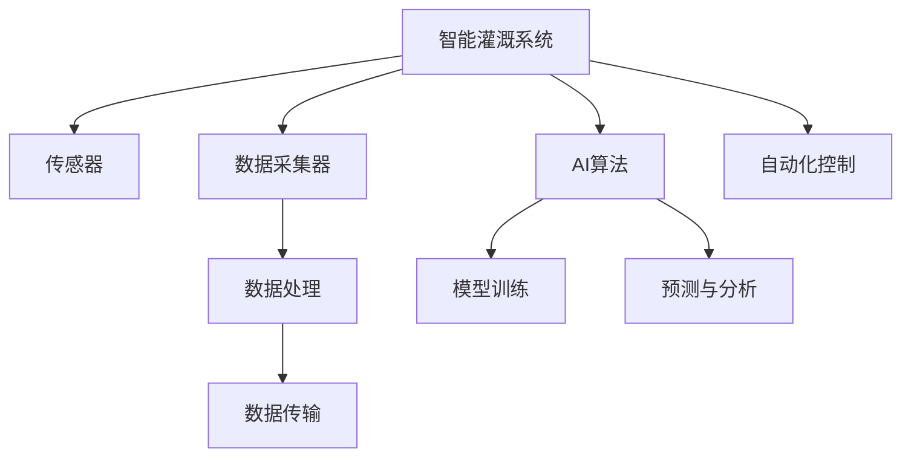

                 

# AI在智能灌溉系统中的应用：节约水资源

> 关键词：人工智能, 智能灌溉, 节水, 自动控制, 传感器, 机器学习, 图像识别, 系统集成

## 1. 背景介绍

在全球气候变化的背景下，水资源短缺已成为全球性问题。如何在保证农业生产的前提下，有效节约水资源，是摆在各国面前的重要课题。智能灌溉系统通过引入人工智能技术，能够对土壤湿度、气象条件等进行实时监测，自动化控制灌溉水，有效提高水资源的利用效率，降低农业用水成本，从而缓解水资源压力。本文将系统介绍AI在智能灌溉系统中的应用，探讨其原理、技术实现及未来前景。

## 2. 核心概念与联系

### 2.1 核心概念概述

智能灌溉系统利用传感器、数据采集器等硬件设备，结合AI算法，实现对农田灌溉的智能控制。其核心概念包括：

- 智能灌溉系统：结合硬件设备和AI算法，实现对农田灌溉的智能控制。
- 传感器：用于实时监测农田土壤湿度、温度、气象条件等。
- 数据采集器：将传感器采集到的数据进行汇总和传输。
- AI算法：包括机器学习、图像识别等，用于分析和预测农田灌溉需求。
- 自动化控制：根据预测结果自动调节灌溉系统，优化水资源利用。

### 2.2 核心概念原理和架构的 Mermaid 流程图



该图表展示了智能灌溉系统的核心组件和数据流动过程。传感器采集农田数据，通过数据采集器汇总后，由AI算法进行分析预测，最终通过自动化控制对灌溉系统进行调节。

## 3. 核心算法原理 & 具体操作步骤

### 3.1 算法原理概述

智能灌溉系统的主要算法原理包括：

- **传感器数据处理**：传感器采集的数据经过预处理、去噪等操作，转化为适合算法处理的格式。
- **机器学习模型训练**：基于历史数据，训练机器学习模型，用于预测灌溉需求。
- **图像识别**：通过摄像头等设备，对农田环境进行图像采集，识别作物生长状态。
- **决策优化**：根据预测结果和图像识别信息，优化灌溉策略，减少水资源浪费。

### 3.2 算法步骤详解

#### 步骤1：数据采集与预处理

智能灌溉系统首先通过传感器采集农田土壤湿度、温度、气象条件等数据。数据采集后需要进行预处理，包括数据清洗、去噪、归一化等操作，以提高模型训练的准确性。

#### 步骤2：模型训练与优化

基于历史灌溉数据，训练机器学习模型。常用的模型包括回归模型、时间序列模型等，用于预测未来的灌溉需求。模型训练后，需要进行调参和优化，确保模型具有较好的泛化能力和预测精度。

#### 步骤3：图像识别与环境监测

通过摄像头等设备，对农田环境进行图像采集，进行作物生长状态的识别。图像识别模型通常包括卷积神经网络(CNN)、目标检测网络等，用于提取作物生长状态的信息。

#### 步骤4：决策与自动化控制

根据预测结果和图像识别信息，优化灌溉策略。通过自动化控制设备，如电磁阀、水泵等，自动调节灌溉系统，实现精准灌溉。

### 3.3 算法优缺点

#### 优点：

- **提高水资源利用效率**：通过实时监测和精准控制，有效减少水资源的浪费。
- **降低人力成本**：自动化的灌溉系统减少了人工操作，降低了人力成本。
- **适应性强**：AI模型可以根据不同地区和不同作物需求，进行定制化的灌溉策略。

#### 缺点：

- **硬件成本高**：传感器、数据采集器等硬件设备的初期投资较高。
- **算法复杂度**：AI模型训练和优化需要较强的计算资源和专业知识。
- **环境适应性**：在一些极端环境下，传感器和模型可能无法正常工作。

### 3.4 算法应用领域

智能灌溉系统在农业、林业、草坪等领域具有广泛的应用前景。例如，在果园中，可以通过智能灌溉系统对果树进行精准灌溉，提高果实的产量和品质；在草坪管理中，可以通过智能灌溉系统保持草坪的最佳生长状态，减少用水量。

## 4. 数学模型和公式 & 详细讲解 & 举例说明

### 4.1 数学模型构建

智能灌溉系统的核心数学模型包括：

- **传感器数据模型**：描述传感器测量值的数学模型。
- **机器学习模型**：用于预测灌溉需求的时间序列模型或回归模型。
- **图像识别模型**：描述图像处理和特征提取的数学模型。

### 4.2 公式推导过程

以机器学习模型为例，假设我们使用线性回归模型进行灌溉需求的预测，模型公式为：

$$ y = \beta_0 + \beta_1 x_1 + \beta_2 x_2 + \cdots + \beta_n x_n $$

其中，$y$ 表示灌溉需求，$x_i$ 表示影响灌溉需求的因素，$\beta_i$ 为回归系数。模型训练的目标是最小化损失函数：

$$ \min_{\beta} \sum_{i=1}^N (y_i - f(x_i; \beta))^2 $$

其中，$f(x; \beta) = \beta_0 + \beta_1 x_1 + \cdots + \beta_n x_n$ 表示模型预测值。

### 4.3 案例分析与讲解

以某农业示范园的智能灌溉系统为例，首先通过土壤湿度传感器和气象站采集数据，包括土壤湿度、温度、降雨量、风速等。然后，将历史数据作为训练集，使用线性回归模型进行训练。模型训练完成后，实时数据输入模型，预测灌溉需求。最后，根据预测结果，自动化控制灌溉系统，实现精准灌溉。

## 5. 项目实践：代码实例和详细解释说明

### 5.1 开发环境搭建

智能灌溉系统的开发需要以下环境：

- **编程语言**：Python
- **深度学习框架**：TensorFlow或PyTorch
- **数据处理工具**：Pandas、NumPy
- **图像处理库**：OpenCV
- **硬件设备**：传感器、数据采集器、摄像头、自动控制设备

### 5.2 源代码详细实现

以下是一个简单的智能灌溉系统的代码实现：

```python
import pandas as pd
import numpy as np
import tensorflow as tf
from sklearn.linear_model import LinearRegression
import cv2
import requests
import time

# 数据预处理
def preprocess_data(data):
    # 数据清洗
    data.dropna(inplace=True)
    # 数据归一化
    data['humidity'] = (data['humidity'] - data['humidity'].min()) / (data['humidity'].max() - data['humidity'].min())
    data['temperature'] = (data['temperature'] - data['temperature'].min()) / (data['temperature'].max() - data['temperature'].min())
    # 特征选择
    X = data[['humidity', 'temperature']]
    y = data['irrigation']
    return X, y

# 模型训练
def train_model(X, y, model_path):
    # 训练线性回归模型
    model = LinearRegression()
    model.fit(X, y)
    # 保存模型
    with open(model_path, 'wb') as f:
        pickle.dump(model, f)

# 数据预测
def predict_irrigation(X, model_path):
    # 加载模型
    with open(model_path, 'rb') as f:
        model = pickle.load(f)
    # 预测灌溉需求
    y_pred = model.predict(X)
    return y_pred

# 图像识别
def image_recognition(image_url):
    # 下载图像
    img_data = requests.get(image_url).content
    # 图像预处理
    img = cv2.imdecode(np.frombuffer(img_data, np.uint8), cv2.IMREAD_GRAYSCALE)
    # 图像特征提取
    features = extract_features(img)
    return features

# 自动化控制
def control_irrigation(y_pred, control_method):
    # 根据预测结果，进行自动化控制
    if y_pred > control_method:
        print("需要灌溉")
        # 打开灌溉系统
        # ...
    else:
        print("不需要灌溉")
        # 关闭灌溉系统
        # ...

# 主程序
if __name__ == '__main__':
    # 数据预处理
    data = pd.read_csv('data.csv')
    X, y = preprocess_data(data)
    
    # 模型训练
    train_model(X, y, 'model.pkl')
    
    # 实时数据采集
    while True:
        # 传感器数据采集
        X_real = get_real_data()
        
        # 预测灌溉需求
        y_pred = predict_irrigation(X_real, 'model.pkl')
        
        # 图像识别
        image_url = 'http://example.com/image.jpg'
        features = image_recognition(image_url)
        
        # 决策与控制
        control_irrigation(y_pred, features)
        
        # 延时1分钟，继续监测
        time.sleep(60)
```

### 5.3 代码解读与分析

以上代码实现了智能灌溉系统的核心功能。其中，`preprocess_data`函数对传感器采集的数据进行预处理，`train_model`函数训练线性回归模型并保存，`predict_irrigation`函数根据模型进行实时数据预测，`image_recognition`函数对农田图像进行特征提取，`control_irrigation`函数根据预测结果和图像识别信息进行自动化控制。

## 6. 实际应用场景

### 6.1 智能灌溉系统的实际应用

智能灌溉系统已经在全球多个国家和地区得到广泛应用。例如，在以色列，智能灌溉系统帮助农民在干旱条件下实现了高效的农田管理，显著提高了农业生产效率和水资源利用率。在美国，智能灌溉系统通过实时监测农田环境，优化灌溉策略，有效减少了水资源的浪费。

### 6.2 未来应用展望

随着AI技术的发展，智能灌溉系统将在未来具备更强的智能化和自适应能力。例如，未来系统可以引入多传感器融合技术，提高数据的准确性和可靠性。还可以引入更多智能化设备，如无人机、机器人等，进行田间监测和管理。此外，系统还可以引入更多的智能决策算法，如遗传算法、强化学习等，提高灌溉策略的优化效果。

## 7. 工具和资源推荐

### 7.1 学习资源推荐

- **书籍**：《机器学习实战》、《深度学习》、《Python数据分析与可视化》
- **在线课程**：Coursera上的《机器学习》课程、Udacity上的《深度学习专项》课程

### 7.2 开发工具推荐

- **深度学习框架**：TensorFlow、PyTorch
- **数据处理工具**：Pandas、NumPy
- **图像处理库**：OpenCV

### 7.3 相关论文推荐

- 《基于机器学习的智能灌溉系统研究》
- 《智能农业：大数据、云计算和物联网》
- 《图像识别在智能灌溉系统中的应用》

## 8. 总结：未来发展趋势与挑战

### 8.1 研究成果总结

智能灌溉系统通过引入AI技术，实现了对农田灌溉的智能控制，有效提高了水资源的利用效率。未来，智能灌溉系统将在全球范围内得到更广泛的应用，为缓解水资源短缺问题做出更大的贡献。

### 8.2 未来发展趋势

智能灌溉系统的未来发展趋势包括：

- **多传感器融合**：引入更多传感器，提高数据的多样性和准确性。
- **智能化设备**：引入无人机、机器人等智能化设备，提高田间监测和管理效率。
- **智能决策算法**：引入遗传算法、强化学习等智能决策算法，提高灌溉策略的优化效果。

### 8.3 面临的挑战

智能灌溉系统在发展过程中仍面临以下挑战：

- **硬件成本高**：传感器、数据采集器等硬件设备的初期投资较高。
- **算法复杂度**：AI模型训练和优化需要较强的计算资源和专业知识。
- **环境适应性**：在一些极端环境下，传感器和模型可能无法正常工作。

### 8.4 研究展望

未来的研究可以关注以下几个方面：

- **模型优化**：研究更加高效的模型训练和优化算法，提高模型泛化能力和预测精度。
- **设备智能化**：研究更加智能化、自动化的农业设备，提升田间监测和管理效率。
- **数据融合**：研究多数据源融合算法，提高数据的全面性和准确性。

## 9. 附录：常见问题与解答

**Q1：智能灌溉系统的硬件成本较高，如何解决？**

A: 智能灌溉系统的硬件成本较高，可以通过以下方式进行优化：

- **选择性价比高的设备**：选择功能相近、价格相对较低的传感器和数据采集器。
- **模块化设计**：采用模块化设计，根据实际需求选择必要的硬件设备，减少冗余投资。
- **分期投资**：通过分期投资的方式，逐步引入硬件设备，降低初期投资压力。

**Q2：智能灌溉系统如何保证数据的准确性？**

A: 智能灌溉系统数据的准确性主要通过以下方式保证：

- **传感器校准**：定期对传感器进行校准，确保数据采集的准确性。
- **多传感器融合**：引入多个传感器，通过数据融合技术，提高数据的全面性和可靠性。
- **数据清洗**：对采集到的数据进行清洗和去噪，去除异常值和噪声，提高数据质量。

**Q3：智能灌溉系统如何应对极端环境？**

A: 智能灌溉系统应对极端环境的措施包括：

- **环境监测**：通过传感器监测环境条件，判断是否适合自动灌溉。
- **智能控制**：根据环境条件，调整灌溉策略，避免在极端天气下进行灌溉。
- **设备防护**：对传感器和数据采集器等设备进行防护，确保其能在极端环境下正常工作。

**Q4：智能灌溉系统的维护成本较高，如何降低？**

A: 智能灌溉系统的维护成本较高，可以通过以下方式进行优化：

- **自动化维护**：引入自动化维护设备，减少人工维护成本。
- **远程监控**：通过远程监控系统，及时发现和解决设备故障，减少人工干预。
- **智能预警**：引入智能预警系统，提前发现系统异常，避免设备损坏。

以上是对智能灌溉系统应用的全面介绍，通过引入AI技术，智能灌溉系统能够有效提高水资源的利用效率，缓解水资源短缺问题。未来，随着技术的不断发展，智能灌溉系统将具备更强的智能化和自适应能力，为全球农业生产和水资源管理带来革命性的变革。

---

作者：禅与计算机程序设计艺术 / Zen and the Art of Computer Programming

