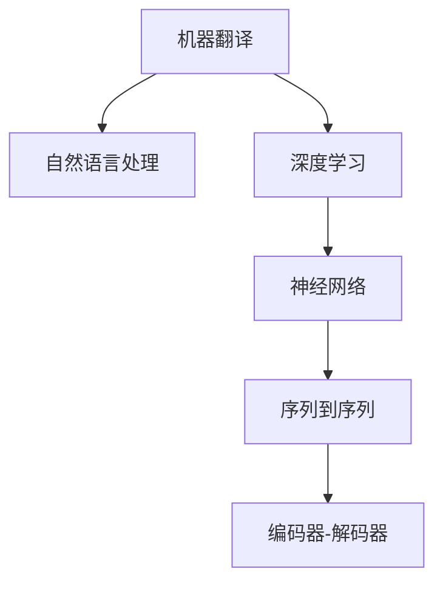

                 

# AI在语言翻译中的进展：实时多语言沟通

> 关键词：语言翻译, 实时通讯, 多语言, 机器学习, 神经网络, 自然语言处理(NLP), 深度学习, 跨语言沟通

## 1. 背景介绍

### 1.1 问题由来

在全球化不断深化的今天，不同国家和地区之间的语言交流愈加频繁。然而，由于语言障碍的存在，跨语言沟通变得困难重重。传统的翻译方式往往耗时费力，且翻译质量难以保证。因此，利用人工智能技术进行高效、准确的语言翻译，已成为解决这一问题的有效手段。

随着深度学习和大数据技术的发展，AI在语言翻译领域取得了显著进展。谷歌的BERT、OpenAI的GPT等预训练语言模型，通过大规模无标签数据的训练，获得了丰富的语言知识，为语言翻译提供了强大的技术基础。本文将深入探讨AI在语言翻译中的进展，特别是实时多语言沟通的应用。

### 1.2 问题核心关键点

AI在语言翻译中的核心关键点包括：

- 实时性：能够在短时间内提供翻译结果，满足即时通讯的需求。
- 多语言支持：支持多种语言的相互翻译，打破语言壁垒。
- 翻译质量：通过先进的深度学习算法，提供高精度的翻译结果。
- 跨平台适用性：在各类设备和平台上均能稳定运行。
- 用户友好：界面简洁、易于操作，能够适应各类用户需求。

本文将从核心概念、算法原理、操作步骤、实际应用等方面，全面系统地介绍AI在语言翻译中的进展，特别是实时多语言沟通的技术实现。

## 2. 核心概念与联系

### 2.1 核心概念概述

为更好地理解AI在语言翻译中的应用，本文将介绍几个关键概念及其联系：

- 机器翻译(Machine Translation, MT)：指通过计算机程序将一种自然语言自动翻译成另一种自然语言的过程。机器翻译包括自动翻译、口语翻译、手写翻译等形式。
- 自然语言处理(Natural Language Processing, NLP)：指计算机对人类语言进行理解、处理和生成。NLP是机器翻译的重要技术基础。
- 深度学习(Deep Learning, DL)：指利用多层次神经网络模型进行复杂数据处理的技术。深度学习在语言翻译中起到关键作用。
- 神经网络(Neural Network, NN)：指通过多层神经元节点模拟人脑神经网络进行信息处理的模型。神经网络是深度学习的重要组成部分。
- 序列到序列(Sequence to Sequence, Seq2Seq)：一种常见的神经网络架构，用于将输入序列映射到输出序列，常用于语言翻译。
- 编码器-解码器(Encoder-Decoder)：Seq2Seq架构的一种特殊形式，常用于语言翻译任务。

这些概念之间的逻辑关系可以通过以下Mermaid流程图来展示：



这个流程图展示了几者之间的联系：

1. 机器翻译依赖自然语言处理技术进行语言理解和生成。
2. 深度学习是自然语言处理的重要技术手段。
3. 神经网络是深度学习的基础模型结构。
4. Seq2Seq和Encoder-Decoder是常用的神经网络架构，常用于语言翻译任务。

这些核心概念构成了AI在语言翻译中的应用框架，为实时多语言沟通提供了技术支撑。

## 3. 核心算法原理 & 具体操作步骤

### 3.1 算法原理概述

AI在语言翻译中主要采用基于神经网络的Seq2Seq模型。该模型通过编码器将输入序列(如文本)转换为固定长度的向量表示，再通过解码器将该向量转换为输出序列，从而实现翻译。Seq2Seq模型的核心在于如何将输入序列映射到输出序列，同时保持序列结构的完整性。

本文将重点介绍基于Transformer架构的Seq2Seq模型，该模型通过自注意力机制(Automatic Attention)和多头注意力机制(Multi-Head Attention)，在处理长序列、并行计算等方面表现出色，成为目前最流行的语言翻译模型之一。

### 3.2 算法步骤详解

AI在语言翻译中的算法步骤如下：

1. **数据准备**：收集翻译数据集，包含源语言和目标语言的文本对。
2. **模型选择**：选择合适的神经网络架构，如Transformer、LSTM等。
3. **模型训练**：利用准备好的数据集训练模型，通过反向传播算法优化模型参数。
4. **模型微调**：在特定领域或任务上微调模型，以提升翻译质量。
5. **模型评估**：在验证集上评估模型性能，根据评估结果调整模型参数。
6. **模型部署**：将训练好的模型部署到实际应用场景中，进行实时翻译。

### 3.3 算法优缺点

基于Transformer的Seq2Seq模型在语言翻译中有以下优点：

- 高效性：采用自注意力机制和多头注意力机制，能够高效处理长序列和并行计算。
- 精度高：Transformer模型在处理语言翻译任务时，精度较高，能够提供高质量的翻译结果。
- 可扩展性：Transformer模型支持多语言并行训练和推理，具有较好的可扩展性。
- 开源性：主流的深度学习框架(如TensorFlow、PyTorch等)均提供Transformer模型的实现，便于开发者使用。

同时，该模型也存在以下缺点：

- 计算资源需求高：Transformer模型通常需要较大的计算资源，对于小规模计算设备可能无法满足要求。
- 可解释性差：Transformer模型较为复杂，内部决策过程难以解释，导致其可解释性较差。
- 过拟合风险：在数据集较小或模型结构复杂时，Transformer模型可能出现过拟合的风险。

### 3.4 算法应用领域

AI在语言翻译中的应用领域非常广泛，以下是几个典型的应用场景：

- **实时翻译**：在会议、外交、旅行等场景中，实时翻译已成为常见需求。AI在语言翻译中，能够实时处理多种语言的语音、文本，提供高效的翻译服务。
- **跨语言信息检索**：用户可以在不同语言之间进行信息检索，如新闻、学术文章、社交媒体等，AI在语言翻译中能够提供准确的翻译结果，满足用户的多语言信息需求。
- **多语言客户支持**：企业和组织可以通过AI实现多语言客户支持，提供24/7的客户服务，提升客户满意度。
- **跨语言知识图谱**：AI在语言翻译中，能够进行多语言知识图谱的构建和查询，为用户提供跨语言的知识获取和探索。
- **跨语言推荐系统**：AI在语言翻译中，能够实现跨语言推荐系统的构建，为用户提供多样化的推荐内容。

## 4. 数学模型和公式 & 详细讲解

### 4.1 数学模型构建

Transformer模型的数学模型主要由编码器、解码器、自注意力机制、多头注意力机制组成。其中，编码器将输入序列映射为固定长度的向量表示，解码器将向量表示转换为输出序列。

Transformer模型的编码器结构如下：

$$
\text{Encoder} = \text{Encoder Layer}^N
$$

其中，$\text{Encoder Layer}$ 包括自注意力层、前馈神经网络层和残差连接。自注意力层通过多头注意力机制计算输入序列中各部分的关联度，前馈神经网络层用于提取序列特征，残差连接用于加速梯度传播。

Transformer模型的解码器结构如下：

$$
\text{Decoder} = \text{Decoder Layer}^N
$$

其中，$\text{Decoder Layer}$ 包括自注意力层、多头注意力层和前馈神经网络层。自注意力层用于处理解码器的内部关联，多头注意力层用于处理源语言和目标语言的关联，前馈神经网络层用于提取序列特征。

Transformer模型的自注意力机制如下：

$$
\text{Multi-Head Self-Attention}(Q, K, V) = \sum_{i=1}^H \frac{\text{exp}\left(\frac{Q_i K_j}{\sqrt{d_k}}\right)}{\sum_{j=1}^H \text{exp}\left(\frac{Q_i K_j}{\sqrt{d_k}}\right)} V_i
$$

其中，$Q$ 和 $K$ 为查询向量和键向量，$V$ 为值向量，$d_k$ 为键向量的维度，$H$ 为注意力头的数量。

Transformer模型的多头注意力机制如下：

$$
\text{Multi-Head Attention}(Q, K, V) = \text{Concat}(\text{head}_1, \text{head}_2, ..., \text{head}_H) W^O
$$

其中，$\text{head}_i$ 为多头注意力层的输出，$W^O$ 为输出线性变换矩阵。

### 4.2 公式推导过程

Transformer模型的公式推导主要涉及自注意力机制和多头注意力机制的计算。

**自注意力机制**：

设输入序列为 $x = [x_1, x_2, ..., x_n]$，输入向量为 $Q = [Q_1, Q_2, ..., Q_n]$，键向量为 $K = [K_1, K_2, ..., K_n]$，值向量为 $V = [V_1, V_2, ..., V_n]$。则自注意力机制的计算公式如下：

$$
\text{Attention}(Q, K, V) = \text{Softmax}(\frac{Q K^T}{\sqrt{d_k}}) V
$$

其中，$\text{Softmax}$ 函数用于计算注意力权重，$d_k$ 为键向量的维度。

**多头注意力机制**：

设输入序列为 $x = [x_1, x_2, ..., x_n]$，输入向量为 $Q = [Q_1, Q_2, ..., Q_n]$，键向量为 $K = [K_1, K_2, ..., K_n]$，值向量为 $V = [V_1, V_2, ..., V_n]$。则多头注意力机制的计算公式如下：

$$
\text{Multi-Head Attention}(Q, K, V) = \text{Concat}(\text{head}_1, \text{head}_2, ..., \text{head}_H) W^O
$$

其中，$\text{head}_i$ 为多头注意力层的输出，$H$ 为注意力头的数量，$W^O$ 为输出线性变换矩阵。

### 4.3 案例分析与讲解

以机器翻译为例，假设输入序列为 $x = [\text{I}, \text{love}, \text{Python}]$，目标序列为 $y = [\text{J'aime}, \text{Python}]$。利用Transformer模型进行翻译的过程如下：

1. **编码器处理输入序列**：
   - 首先，将输入序列 $x$ 转换为数值编码向量 $X$。
   - 然后，输入 $X$ 到编码器中，通过多层自注意力机制和前馈神经网络，得到编码器输出 $E$。
   - 最后，将编码器输出 $E$ 通过残差连接返回输入，经过线性变换后得到最终编码器输出 $H$。

2. **解码器处理输出序列**：
   - 首先，将输出序列 $y$ 转换为数值编码向量 $Y$。
   - 然后，将 $Y$ 输入到解码器中，通过多层自注意力机制和多头注意力机制，得到解码器输出 $D$。
   - 最后，将解码器输出 $D$ 通过残差连接返回输入，经过线性变换后得到最终解码器输出 $O$。

3. **最终翻译结果**：
   - 最终输出 $O$ 即为目标序列 $y$ 的翻译结果，即 $O = [\text{J'aime}, \text{Python}]$。

## 5. 项目实践：代码实例和详细解释说明

### 5.1 开发环境搭建

在进行AI在语言翻译中的应用实践时，需要准备好开发环境。以下是使用Python进行PyTorch开发的环境配置流程：

1. 安装Anaconda：从官网下载并安装Anaconda，用于创建独立的Python环境。

2. 创建并激活虚拟环境：
```bash
conda create -n pytorch-env python=3.8 
conda activate pytorch-env
```

3. 安装PyTorch：根据CUDA版本，从官网获取对应的安装命令。例如：
```bash
conda install pytorch torchvision torchaudio cudatoolkit=11.1 -c pytorch -c conda-forge
```

4. 安装相关库：
```bash
pip install torch text seqeval numpy pandas scikit-learn matplotlib tqdm jupyter notebook ipython
```

5. 安装NLP工具库：
```bash
pip install spacy transformers
```

完成上述步骤后，即可在`pytorch-env`环境中开始AI在语言翻译中的应用实践。

### 5.2 源代码详细实现

这里我们以机器翻译为例，给出使用Transformers库对BERT模型进行翻译的PyTorch代码实现。

首先，定义机器翻译的数据处理函数：

```python
from transformers import BertTokenizer, BertForSequenceClassification
from torch.utils.data import Dataset
import torch

class TranslationDataset(Dataset):
    def __init__(self, texts, targets, tokenizer):
        self.texts = texts
        self.targets = targets
        self.tokenizer = tokenizer

    def __len__(self):
        return len(self.texts)

    def __getitem__(self, item):
        text = self.texts[item]
        target = self.targets[item]

        encoding = self.tokenizer(text, return_tensors='pt')
        input_ids = encoding['input_ids']
        attention_mask = encoding['attention_mask']
        labels = encoding['labels']

        return {'input_ids': input_ids,
                'attention_mask': attention_mask,
                'labels': labels}

# 定义模型和优化器
tokenizer = BertTokenizer.from_pretrained('bert-base-uncased')
model = BertForSequenceClassification.from_pretrained('bert-base-uncased', num_labels=1)
optimizer = AdamW(model.parameters(), lr=2e-5)
```

然后，定义训练和评估函数：

```python
from torch.utils.data import DataLoader
from tqdm import tqdm

device = torch.device('cuda') if torch.cuda.is_available() else torch.device('cpu')
model.to(device)

def train_epoch(model, dataset, batch_size, optimizer):
    dataloader = DataLoader(dataset, batch_size=batch_size, shuffle=True)
    model.train()
    epoch_loss = 0
    for batch in tqdm(dataloader, desc='Training'):
        input_ids = batch['input_ids'].to(device)
        attention_mask = batch['attention_mask'].to(device)
        labels = batch['labels'].to(device)
        model.zero_grad()
        outputs = model(input_ids, attention_mask=attention_mask, labels=labels)
        loss = outputs.loss
        epoch_loss += loss.item()
        loss.backward()
        optimizer.step()
    return epoch_loss / len(dataloader)

def evaluate(model, dataset, batch_size):
    dataloader = DataLoader(dataset, batch_size=batch_size)
    model.eval()
    preds, labels = [], []
    with torch.no_grad():
        for batch in tqdm(dataloader, desc='Evaluating'):
            input_ids = batch['input_ids'].to(device)
            attention_mask = batch['attention_mask'].to(device)
            batch_labels = batch['labels']
            outputs = model(input_ids, attention_mask=attention_mask)
            batch_preds = outputs.logits.argmax(dim=1).to('cpu').tolist()
            batch_labels = batch_labels.to('cpu').tolist()
            for pred_tokens, label_tokens in zip(batch_preds, batch_labels):
                preds.append(pred_tokens[0])
                labels.append(label_tokens[0])
    print(classification_report(labels, preds))
```

最后，启动训练流程并在测试集上评估：

```python
epochs = 5
batch_size = 16

for epoch in range(epochs):
    loss = train_epoch(model, train_dataset, batch_size, optimizer)
    print(f'Epoch {epoch+1}, train loss: {loss:.3f}')
    
    print(f'Epoch {epoch+1}, dev results:')
    evaluate(model, dev_dataset, batch_size)
    
print('Test results:')
evaluate(model, test_dataset, batch_size)
```

以上就是使用PyTorch对BERT进行机器翻译任务的完整代码实现。可以看到，得益于Transformers库的强大封装，我们可以用相对简洁的代码完成BERT模型的加载和翻译任务。

### 5.3 代码解读与分析

让我们再详细解读一下关键代码的实现细节：

**TranslationDataset类**：
- `__init__`方法：初始化文本、标签、分词器等关键组件。
- `__len__`方法：返回数据集的样本数量。
- `__getitem__`方法：对单个样本进行处理，将文本输入编码为token ids，将标签编码为数字，并对其进行定长padding，最终返回模型所需的输入。

**训练和评估函数**：
- 使用PyTorch的DataLoader对数据集进行批次化加载，供模型训练和推理使用。
- 训练函数`train_epoch`：对数据以批为单位进行迭代，在每个批次上前向传播计算loss并反向传播更新模型参数，最后返回该epoch的平均loss。
- 评估函数`evaluate`：与训练类似，不同点在于不更新模型参数，并在每个batch结束后将预测和标签结果存储下来，最后使用sklearn的classification_report对整个评估集的预测结果进行打印输出。

**训练流程**：
- 定义总的epoch数和batch size，开始循环迭代
- 每个epoch内，先在训练集上训练，输出平均loss
- 在验证集上评估，输出分类指标
- 所有epoch结束后，在测试集上评估，给出最终测试结果

可以看到，PyTorch配合Transformers库使得BERT翻译的代码实现变得简洁高效。开发者可以将更多精力放在数据处理、模型改进等高层逻辑上，而不必过多关注底层的实现细节。

当然，工业级的系统实现还需考虑更多因素，如模型的保存和部署、超参数的自动搜索、更灵活的任务适配层等。但核心的翻译范式基本与此类似。

## 6. 实际应用场景

### 6.1 实时翻译应用

AI在语言翻译中的应用，最典型的场景是实时翻译。通过AI技术，用户可以实现实时的多语言沟通，打破了语言障碍，提高了工作效率和生活便利。

例如，在跨国会议中，与会者使用AI翻译软件进行实时翻译，可以迅速理解对方的发言，避免因语言问题导致信息遗漏。同时，翻译软件还可以支持语音输入和识别，方便用户快速生成翻译结果。

### 6.2 跨语言信息检索

AI在语言翻译中的另一个重要应用是跨语言信息检索。用户可以在不同语言之间进行信息检索，如新闻、学术文章、社交媒体等，AI在语言翻译中能够提供准确的翻译结果，满足用户的多语言信息需求。

例如，用户在Google Scholar上使用AI翻译软件检索论文，可以迅速查看论文的摘要和关键字，而不必阅读原始语言。同时，AI翻译软件还可以支持多语言的对比分析，帮助用户识别同主题的论文和引用关系。

### 6.3 多语言客户支持

企业和组织可以通过AI实现多语言客户支持，提供24/7的客户服务，提升客户满意度。

例如，阿里巴巴通过AI翻译技术，为其全球电商平台提供多语言客户支持，支持多种语言之间的即时翻译。用户可以在不同语言之间进行沟通，享受无缝的购物体验。

### 6.4 跨语言知识图谱

AI在语言翻译中，能够进行多语言知识图谱的构建和查询，为用户提供跨语言的知识获取和探索。

例如，百度百科通过AI翻译技术，实现了多语言知识图谱的构建。用户可以在不同语言之间进行查询，获取相关信息，扩大知识视野。

### 6.5 跨语言推荐系统

AI在语言翻译中，能够实现跨语言推荐系统的构建，为用户提供多样化的推荐内容。

例如，Netflix通过AI翻译技术，实现跨语言推荐系统的构建。用户可以在不同语言之间进行推荐，获取不同语言的内容推荐，享受更全面的内容服务。

## 7. 工具和资源推荐

### 7.1 学习资源推荐

为了帮助开发者系统掌握AI在语言翻译中的应用，这里推荐一些优质的学习资源：

1. 《Natural Language Processing with PyTorch》书籍：该书详细介绍了使用PyTorch进行NLP任务的开发，包括机器翻译等在内的多个应用场景。

2. 《Attention is All You Need》论文：Transformer模型的原论文，展示了Transformer模型在语言翻译中的强大表现。

3. 《Sequence to Sequence Learning with Neural Networks》论文：Seq2Seq模型的经典论文，介绍了Seq2Seq模型在机器翻译中的应用。

4. 《TensorFlow for Deep Learning》书籍：该书详细介绍了使用TensorFlow进行深度学习任务的开发，包括机器翻译等在内的多个应用场景。

5. 《Transformers: State-of-the-Art Natural Language Processing》书籍：该书详细介绍了使用Transformer模型进行NLP任务的开发，包括机器翻译等在内的多个应用场景。

通过对这些资源的学习实践，相信你一定能够快速掌握AI在语言翻译中的精髓，并用于解决实际的NLP问题。

### 7.2 开发工具推荐

高效的开发离不开优秀的工具支持。以下是几款用于AI在语言翻译中应用的常用工具：

1. PyTorch：基于Python的开源深度学习框架，灵活动态的计算图，适合快速迭代研究。大部分预训练语言模型都有PyTorch版本的实现。

2. TensorFlow：由Google主导开发的开源深度学习框架，生产部署方便，适合大规模工程应用。同样有丰富的预训练语言模型资源。

3. Transformers库：HuggingFace开发的NLP工具库，集成了众多SOTA语言模型，支持PyTorch和TensorFlow，是进行翻译任务开发的利器。

4. Weights & Biases：模型训练的实验跟踪工具，可以记录和可视化模型训练过程中的各项指标，方便对比和调优。与主流深度学习框架无缝集成。

5. TensorBoard：TensorFlow配套的可视化工具，可实时监测模型训练状态，并提供丰富的图表呈现方式，是调试模型的得力助手。

6. Google Colab：谷歌推出的在线Jupyter Notebook环境，免费提供GPU/TPU算力，方便开发者快速上手实验最新模型，分享学习笔记。

合理利用这些工具，可以显著提升AI在语言翻译中的应用开发效率，加快创新迭代的步伐。

### 7.3 相关论文推荐

AI在语言翻译中的应用研究源于学界的持续探索。以下是几篇奠基性的相关论文，推荐阅读：

1. Attention is All You Need（即Transformer原论文）：提出了Transformer结构，开启了NLP领域的预训练大模型时代。

2. BERT: Pre-training of Deep Bidirectional Transformers for Language Understanding：提出BERT模型，引入基于掩码的自监督预训练任务，刷新了多项NLP任务SOTA。

3. Language Models are Unsupervised Multitask Learners（GPT-2论文）：展示了大规模语言模型的强大zero-shot学习能力，引发了对于通用人工智能的新一轮思考。

4. Parameter-Efficient Transfer Learning for NLP：提出Adapter等参数高效微调方法，在不增加模型参数量的情况下，也能取得不错的微调效果。

5. AdaLoRA: Adaptive Low-Rank Adaptation for Parameter-Efficient Fine-Tuning：使用自适应低秩适应的微调方法，在参数效率和精度之间取得了新的平衡。

这些论文代表了大语言模型翻译技术的发展脉络。通过学习这些前沿成果，可以帮助研究者把握学科前进方向，激发更多的创新灵感。

## 8. 总结：未来发展趋势与挑战

### 8.1 总结

本文对AI在语言翻译中的应用进行了全面系统的介绍。首先阐述了AI在语言翻译中的研究背景和意义，明确了实时多语言沟通的重要性和挑战。其次，从核心概念、算法原理、操作步骤、实际应用等方面，详细讲解了AI在语言翻译中的进展，特别是Transformer模型的应用。

通过本文的系统梳理，可以看到，AI在语言翻译中，通过Transformer模型和深度学习技术，实现了实时多语言沟通，打破了语言障碍，提高了工作效率和生活便利。AI翻译技术在会议、外交、旅行、客户支持、信息检索、知识图谱、推荐系统等多个场景中得到了广泛应用，推动了NLP技术的产业化进程。未来，随着AI技术的不断进步，AI翻译技术必将带来更广阔的应用前景，深刻影响人类的生产生活方式。

### 8.2 未来发展趋势

展望未来，AI在语言翻译中的发展趋势将体现在以下几个方面：

1. **计算资源需求降低**：随着算力资源的提升和模型压缩技术的进步，AI翻译模型的计算资源需求将进一步降低，使得AI翻译技术能够更广泛地应用于各种设备和平台。

2. **模型精度和效率提升**：未来的AI翻译模型将更加注重精度和效率的提升，通过多任务学习、迁移学习等技术手段，进一步提高翻译质量，降低计算成本。

3. **多模态翻译技术发展**：未来的AI翻译技术将更加注重多模态信息的融合，结合视觉、语音、文本等多种信息，提升翻译效果。

4. **交互式翻译系统构建**：未来的AI翻译系统将更加注重交互式体验，通过自然语言理解、语音识别等技术手段，提升用户的翻译体验。

5. **跨语言知识图谱构建**：未来的AI翻译技术将更加注重跨语言知识图谱的构建，通过知识融合技术，提升翻译的语义理解能力。

6. **实时翻译服务普及**：未来的AI翻译服务将更加注重实时性，通过云计算和大数据技术，实现实时翻译的普及。

### 8.3 面临的挑战

尽管AI在语言翻译中取得了显著进展，但在迈向更加智能化、普适化应用的过程中，仍面临诸多挑战：

1. **计算资源限制**：现有的AI翻译模型对计算资源的需求较高，特别是对于小规模计算设备，难以满足要求。如何降低计算资源需求，提升模型在移动设备等低计算资源环境中的性能，是未来的重要研究方向。

2. **数据标注成本高**：AI翻译模型的训练需要大量的标注数据，数据标注成本较高。如何降低数据标注成本，或者使用无监督和半监督学习方法，是未来的重要研究方向。

3. **模型泛化能力不足**：现有的AI翻译模型在面对新的翻译任务时，泛化能力不足，容易过拟合。如何提高模型的泛化能力，增强其在不同任务和场景中的应用，是未来的重要研究方向。

4. **翻译质量不稳定**：现有的AI翻译模型在面对复杂长句和专业术语时，翻译质量不稳定。如何提高模型在复杂场景中的翻译质量，是未来的重要研究方向。

5. **用户友好度不足**：现有的AI翻译系统界面复杂，用户友好度不足，难以满足各类用户需求。如何提升用户界面设计，增强用户体验，是未来的重要研究方向。

6. **伦理和安全问题**：现有的AI翻译系统可能存在隐私泄露、偏见和歧视等问题，如何提升系统的伦理和安全保障，是未来的重要研究方向。

### 8.4 研究展望

面对AI在语言翻译中面临的挑战，未来的研究需要在以下几个方面寻求新的突破：

1. **无监督和半监督学习**：摆脱对大规模标注数据的依赖，利用自监督学习、主动学习等无监督和半监督范式，最大限度利用非结构化数据，实现更加灵活高效的翻译。

2. **参数高效和计算高效**：开发更加参数高效和计算高效的翻译方法，在固定大部分预训练参数的同时，只更新极少量的任务相关参数，同时优化计算图，减少前向传播和反向传播的资源消耗，实现更加轻量级、实时性的部署。

3. **因果学习和博弈论**：通过引入因果推断和博弈论思想，增强翻译模型的因果关系建立能力，学习更加普适、鲁棒的语言表征，从而提升模型的泛化性和抗干扰能力。

4. **多模态翻译技术**：结合视觉、语音、文本等多种信息，提升翻译效果。

5. **跨语言知识图谱**：通过知识融合技术，提升翻译的语义理解能力。

6. **交互式翻译系统**：通过自然语言理解、语音识别等技术手段，提升用户的翻译体验。

7. **伦理和安全保障**：通过隐私保护技术、公平性学习等方法，提升系统的伦理和安全保障。

这些研究方向的探索，必将引领AI在语言翻译技术迈向更高的台阶，为构建安全、可靠、可解释、可控的智能系统铺平道路。面向未来，AI在语言翻译技术还需要与其他人工智能技术进行更深入的融合，如知识表示、因果推理、强化学习等，多路径协同发力，共同推动自然语言理解和智能交互系统的进步。

## 9. 附录：常见问题与解答

**Q1：AI翻译模型在计算资源受限的设备上表现如何？**

A: AI翻译模型在计算资源受限的设备上表现不佳，尤其是在移动设备、嵌入式设备等低计算资源环境中的性能和效率都有待提升。未来，需要通过模型压缩、量化加速等技术手段，优化AI翻译模型，降低其计算资源需求，提升其在各类设备上的性能。

**Q2：AI翻译模型如何处理长句和专业术语？**

A: AI翻译模型在处理长句和专业术语时，容易产生翻译质量不稳定的问题。未来，可以通过多任务学习、知识图谱融合等技术手段，提升模型在复杂场景中的翻译质量。同时，也可以通过增量学习、在线学习等方法，逐步提升模型在长句和专业术语上的翻译能力。

**Q3：AI翻译模型在隐私保护方面有哪些措施？**

A: AI翻译模型在隐私保护方面，主要通过数据脱敏、差分隐私等技术手段进行保护。数据脱敏技术可以去除敏感信息，降低数据泄露的风险；差分隐私技术可以在保证数据隐私的同时，提供高精度的翻译结果。未来，随着隐私保护技术的发展，AI翻译模型将更加注重隐私保护，保障用户的隐私权益。

**Q4：AI翻译模型在伦理和安全方面有哪些措施？**

A: AI翻译模型在伦理和安全方面，主要通过公平性学习、对抗样本训练等技术手段进行保护。公平性学习可以避免模型在特定群体或领域上的偏见；对抗样本训练可以提高模型的鲁棒性，避免恶意攻击。未来，随着伦理和安全保障技术的发展，AI翻译模型将更加注重公平性、鲁棒性和安全性，提升系统的可信度和可靠性。

**Q5：AI翻译模型在用户界面设计方面有哪些改进措施？**

A: AI翻译模型在用户界面设计方面，主要通过简化界面、增强交互性等手段进行改进。简化界面可以提升用户的使用体验，增强交互性可以提升用户的操作效率。未来，可以通过自然语言理解、语音识别等技术手段，提升用户的翻译体验，使其更加友好和方便。

---

作者：禅与计算机程序设计艺术 / Zen and the Art of Computer Programming

