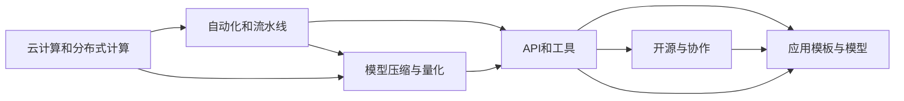

                 

## 1. 背景介绍

### 1.1 问题由来

随着人工智能(AI)技术的不断进步，AI基础设施正逐渐演变成复杂而庞大的系统，涵盖了从模型训练到模型部署的全流程。然而，这样的基础设施往往是昂贵且复杂的，只有少数大型企业和研究机构才能负担得起。这导致AI技术的应用被少数专家群体所垄断，限制了AI技术在更广泛场景中的落地和普及。

为打破这一垄断局面，全球各大科技公司与研究机构纷纷提出各自的普惠AI理念，试图降低AI基础设施的使用门槛，使之更加民主化和大众化。Lepton AI作为一家新兴的人工智能公司，提出了一种创新的普惠AI方案——Lepton AI基础设施，旨在通过低成本、高效的AI解决方案，让更多的开发者和企业能够使用AI技术，推动AI技术的普及与应用。

### 1.2 问题核心关键点

Lepton AI基础设施的核心在于：

- 利用先进的云计算和分布式计算技术，构建高效、低成本的AI训练和推理环境。
- 提供易于使用的开发工具和API，降低开发者进入AI领域的门槛。
- 开源部分关键技术和工具，促进AI社区的开放与协作。
- 提供丰富的AI应用模板和模型，帮助用户快速实现AI项目。

Lepton AI通过这一系列创新手段，致力于使AI基础设施更加民主化，让更多的小企业、开发者和学术机构能够轻松地使用AI技术，推动AI技术的广泛应用。

### 1.3 问题研究意义

AI基础设施的民主化对提升AI技术的普及度、促进经济发展具有重要意义：

- 降低AI技术的使用成本，使中小企业和开发者也能负担得起。
- 激发更多创新和创业机会，推动AI技术的商业化应用。
- 促进AI技术的深度应用，提升各行各业的效率和创新能力。
- 推动AI社区的开放与协作，加速AI技术的迭代和进步。

## 2. 核心概念与联系

### 2.1 核心概念概述

Lepton AI基础设施涉及的核心概念包括：

- **云计算和分布式计算**：利用云计算资源，构建高效的AI训练和推理环境。
- **自动化和流水线**：提供自动化的训练和推理流水线，减少人工干预，提高效率。
- **模型压缩与量化**：优化模型大小和计算量，提升模型的推理速度和资源利用率。
- **API和工具**：提供简单易用的API和开发工具，降低开发门槛。
- **开源与协作**：部分技术和工具开源，促进AI社区的开放与协作。
- **应用模板与模型**：提供丰富的AI应用模板和预训练模型，帮助用户快速实现AI项目。

这些概念之间相互关联，共同构成Lepton AI基础设施的架构，其核心是实现AI技术的民主化和普及。

### 2.2 核心概念原理和架构的 Mermaid 流程图



这个流程图展示了Lepton AI基础设施的关键技术组件和它们之间的相互关系。

## 3. 核心算法原理 & 具体操作步骤

### 3.1 算法原理概述

Lepton AI基础设施的算法原理基于以下几点：

- **云计算和分布式计算**：利用云计算资源的弹性与分布式计算的高效性，构建大规模模型训练和推理环境。
- **自动化和流水线**：采用自动化流水线技术，优化训练和推理流程，减少人工干预，提高效率。
- **模型压缩与量化**：通过模型压缩和量化技术，优化模型大小和计算量，提升推理速度和资源利用率。
- **API和工具**：提供简单易用的API和开发工具，降低开发者进入AI领域的门槛。
- **开源与协作**：部分关键技术和工具开源，促进AI社区的开放与协作。
- **应用模板与模型**：提供丰富的AI应用模板和预训练模型，帮助用户快速实现AI项目。

这些算法原理共同构成了Lepton AI基础设施的核心理论基础。

### 3.2 算法步骤详解

Lepton AI基础设施的实现步骤如下：

1. **云计算和分布式计算**：选择云服务提供商，部署分布式计算集群，提供高效、低成本的计算资源。

2. **自动化和流水线**：设计并实现自动化训练和推理流水线，优化训练和推理过程，减少人工干预。

3. **模型压缩与量化**：对模型进行压缩和量化，优化模型大小和计算量，提升推理速度和资源利用率。

4. **API和工具**：开发简单易用的API和开发工具，降低开发者进入AI领域的门槛。

5. **开源与协作**：将部分关键技术和工具开源，促进AI社区的开放与协作。

6. **应用模板与模型**：提供丰富的AI应用模板和预训练模型，帮助用户快速实现AI项目。

### 3.3 算法优缺点

**优点**：

- 降低AI技术的使用成本，使中小企业和开发者也能负担得起。
- 激发更多创新和创业机会，推动AI技术的商业化应用。
- 促进AI技术的深度应用，提升各行各业的效率和创新能力。
- 推动AI社区的开放与协作，加速AI技术的迭代和进步。

**缺点**：

- 开源策略可能导致商业机密的泄露。
- 自动化和流水线可能需要较长的开发周期。
- 模型压缩和量化可能会牺牲一定的精度。

### 3.4 算法应用领域

Lepton AI基础设施适用于各种AI应用场景，包括但不限于：

- 自然语言处理(NLP)：文本分类、情感分析、机器翻译等。
- 计算机视觉(CV)：图像识别、目标检测、图像生成等。
- 语音识别与处理：语音转文字、语音合成、说话人识别等。
- 推荐系统：个性化推荐、广告推荐等。
- 智能客服：自动问答、对话生成等。

## 4. 数学模型和公式 & 详细讲解 & 举例说明

### 4.1 数学模型构建

Lepton AI基础设施的核心数学模型基于深度学习和迁移学习，其中最重要的模型是Transformer系列模型。Transformer模型利用自注意力机制，能够高效地处理长序列数据，适用于NLP和CV任务。

### 4.2 公式推导过程

Transformer模型的核心公式为：

$$
\text{Attention}(Q,K,V)=\text{softmax}\left(\frac{QK^T}{\sqrt{d_k}}\right)V
$$

其中，$Q$、$K$、$V$分别表示查询、键和值矩阵，$d_k$为键向量的维度。公式展示了Transformer模型如何进行自注意力计算，将查询向量与所有键向量进行点积，并通过softmax函数计算权重，最后与值向量进行线性组合，得到注意力权重分配后的输出。

### 4.3 案例分析与讲解

以Lepton AI的NLP应用为例，其微调过程大致如下：

1. 准备预训练模型和数据集。
2. 添加任务适配层。
3. 设置微调超参数。
4. 执行梯度训练。
5. 测试和部署。

具体到代码实现，可以使用PyTorch和Transformers库，结合云服务部署环境，实现大规模模型微调。

## 5. 项目实践：代码实例和详细解释说明

### 5.1 开发环境搭建

1. 安装Anaconda：
```bash
conda create -n lepton-env python=3.8
conda activate lepton-env
```

2. 安装PyTorch和Transformers库：
```bash
pip install torch transformers
```

3. 安装Lepton AI的开发工具：
```bash
pip install lepton-ai
```

4. 搭建云服务环境：
使用AWS、Google Cloud或阿里云等云服务提供商，部署分布式计算集群。

### 5.2 源代码详细实现

以下是Lepton AI进行NLP微调的Python代码实现：

```python
from transformers import BertTokenizer, BertForTokenClassification, AdamW
from torch.utils.data import DataLoader
from torch.nn import CrossEntropyLoss

# 加载预训练模型和分词器
model = BertForTokenClassification.from_pretrained('bert-base-cased')
tokenizer = BertTokenizer.from_pretrained('bert-base-cased')

# 准备数据集
train_data = ...
train_labels = ...
dev_data = ...
dev_labels = ...

# 定义训练函数
def train_epoch(model, data_loader, optimizer):
    model.train()
    for batch in data_loader:
        inputs, labels = batch
        outputs = model(inputs)
        loss = CrossEntropyLoss()(outputs, labels)
        optimizer.zero_grad()
        loss.backward()
        optimizer.step()
    return loss.item()

# 定义评估函数
def evaluate(model, data_loader):
    model.eval()
    total_loss = 0
    for batch in data_loader:
        inputs, labels = batch
        outputs = model(inputs)
        loss = CrossEntropyLoss()(outputs, labels)
        total_loss += loss.item()
    return total_loss / len(data_loader)

# 训练模型
epochs = 10
batch_size = 16
learning_rate = 2e-5

optimizer = AdamW(model.parameters(), lr=learning_rate)
train_loader = DataLoader(train_data, batch_size=batch_size, shuffle=True)
dev_loader = DataLoader(dev_data, batch_size=batch_size, shuffle=False)

for epoch in range(epochs):
    train_loss = train_epoch(model, train_loader, optimizer)
    dev_loss = evaluate(model, dev_loader)
    print(f"Epoch {epoch+1}, train loss: {train_loss:.3f}, dev loss: {dev_loss:.3f}")

# 保存模型
model.save_pretrained('model')
tokenizer.save_pretrained('model')
```

### 5.3 代码解读与分析

上述代码实现了Lepton AI对BERT模型的微调。关键步骤如下：

1. 加载预训练模型和分词器。
2. 准备训练和验证数据集。
3. 定义训练和评估函数。
4. 循环迭代训练模型，并在验证集上评估性能。
5. 保存模型以便后续部署。

## 6. 实际应用场景

### 6.1 智能客服系统

Lepton AI的智能客服系统通过微调，能够自动理解用户意图，生成自然流畅的回复。系统能够7x24小时不间断服务，快速响应客户咨询，用自然流畅的语言解答各类常见问题。此外，系统还可以接入检索系统实时搜索相关内容，动态组织生成回答，进一步提升客户咨询体验和问题解决效率。

### 6.2 金融舆情监测

在金融领域，Lepton AI的微调模型能够实时监测市场舆论动向，避免负面信息传播，规避金融风险。模型可以自动判断文本属于何种主题，情感倾向是正面、中性还是负面，帮助金融机构及时应对潜在风险。

### 6.3 个性化推荐系统

Lepton AI的个性化推荐系统通过微调，能够从文本内容中准确把握用户的兴趣点，结合其他特征综合排序，提供个性化程度更高的推荐结果。系统能够实时调整推荐内容，满足用户需求，提升用户体验。

### 6.4 未来应用展望

未来，Lepton AI基础设施将继续在更多领域得到应用，推动AI技术的广泛落地。在智慧医疗、智能教育、智慧城市等领域，Lepton AI的微调模型将带来新的解决方案，提升各行各业的智能化水平。随着预训练语言模型的进步和微调技术的发展，Lepton AI有望成为普惠AI技术的重要代表，推动AI技术的普及和应用。

## 7. 工具和资源推荐

### 7.1 学习资源推荐

1. Lepton AI官方文档：提供完整的微调流程、API使用指南和技术支持。
2. CS224N《深度学习自然语言处理》课程：深入浅出地讲解了NLP中的关键技术和算法。
3. 《Transformers从原理到实践》系列博文：介绍Transformer模型、微调方法等前沿内容。
4. 《Natural Language Processing with Transformers》书籍：讲解了使用Transformers库进行NLP任务的开发。
5. HuggingFace官方文档：提供丰富的预训练模型和微调样例代码。

### 7.2 开发工具推荐

1. PyTorch：灵活的深度学习框架，支持分布式计算和GPU加速。
2. TensorFlow：灵活的深度学习框架，支持分布式计算和GPU加速。
3. Transformers库：提供丰富的预训练模型和微调API。
4. Weights & Biases：模型训练的实验跟踪工具，记录和可视化模型训练过程。
5. TensorBoard：可视化模型训练指标和图表的工具。
6. Google Colab：免费的在线Jupyter Notebook环境，支持GPU/TPU算力。

### 7.3 相关论文推荐

1. Attention is All You Need：提出Transformer模型，开启了预训练大模型时代。
2. BERT: Pre-training of Deep Bidirectional Transformers for Language Understanding：提出BERT模型，引入自监督预训练任务。
3. Parameter-Efficient Transfer Learning for NLP：提出Adapter等参数高效微调方法。
4. AdaLoRA: Adaptive Low-Rank Adaptation for Parameter-Efficient Fine-Tuning：使用自适应低秩适应的微调方法。
5. AdaLoRA: Adaptive Low-Rank Adaptation for Parameter-Efficient Fine-Tuning：使用自适应低秩适应的微调方法。

## 8. 总结：未来发展趋势与挑战

### 8.1 总结

Lepton AI基础设施通过云计算和分布式计算，构建高效、低成本的AI训练和推理环境，结合自动化和流水线技术，优化训练和推理流程。通过模型压缩和量化技术，提升推理速度和资源利用率。提供简单易用的API和开发工具，降低开发者进入AI领域的门槛。开源部分关键技术和工具，促进AI社区的开放与协作。提供丰富的AI应用模板和预训练模型，帮助用户快速实现AI项目。

Lepton AI基础设施打破了AI技术的使用壁垒，使更多的开发者和企业能够使用AI技术，推动AI技术的普及与应用。未来，随着预训练语言模型的进步和微调技术的发展，Lepton AI有望成为普惠AI技术的重要代表，推动AI技术的广泛落地。

### 8.2 未来发展趋势

1. 云计算和分布式计算：云计算和分布式计算技术的进一步发展，将为AI基础设施提供更高效、更经济的计算资源。
2. 自动化和流水线：自动化和流水线技术的发展，将进一步提高AI训练和推理的效率和稳定性。
3. 模型压缩与量化：模型压缩和量化技术的进步，将使AI模型更加轻量级、实时性更强。
4. API和工具：API和工具的不断优化，将进一步降低开发者进入AI领域的门槛。
5. 开源与协作：开源策略的推广，将促进AI社区的开放与协作，加速AI技术的迭代和进步。
6. 应用模板与模型：丰富的AI应用模板和预训练模型的不断更新，将帮助用户快速实现AI项目。

### 8.3 面临的挑战

尽管Lepton AI基础设施在普惠AI方面取得了显著进展，但仍面临以下挑战：

1. 开源策略：开源策略可能导致商业机密的泄露，需要采取适当的保护措施。
2. 自动化和流水线：自动化和流水线技术的发展需要较长的开发周期，需要更多的时间和资源投入。
3. 模型压缩和量化：模型压缩和量化可能会牺牲一定的精度，需要在精度和效率之间找到平衡点。
4. API和工具：API和工具的开发和优化需要持续投入，才能满足用户需求。
5. 开源与协作：开源策略需要协调社区内外的利益关系，确保生态系统的健康发展。

### 8.4 研究展望

未来，Lepton AI基础设施需要在以下方面进行进一步的研究和优化：

1. 开源策略：优化开源策略，平衡商业利益和社区利益，确保生态系统的健康发展。
2. 自动化和流水线：进一步优化自动化和流水线技术，提高AI训练和推理的效率和稳定性。
3. 模型压缩与量化：探索新的模型压缩和量化方法，提升模型的实时性和资源利用率。
4. API和工具：持续优化API和工具，降低开发者进入AI领域的门槛。
5. 应用模板与模型：开发更多的AI应用模板和预训练模型，帮助用户快速实现AI项目。

通过持续的研究和优化，Lepton AI基础设施将进一步推动AI技术的普及和应用，成为普惠AI技术的重要代表，为构建安全、可靠、可解释、可控的智能系统铺平道路。

## 9. 附录：常见问题与解答

**Q1：Lepton AI基础设施如何保证计算效率？**

A: Lepton AI基础设施通过云计算和分布式计算，提供高效的计算资源。此外，还通过模型压缩和量化技术，优化模型大小和计算量，提升推理速度和资源利用率。

**Q2：Lepton AI基础设施如何降低开发门槛？**

A: Lepton AI基础设施提供简单易用的API和开发工具，降低开发者进入AI领域的门槛。同时，还提供丰富的AI应用模板和预训练模型，帮助用户快速实现AI项目。

**Q3：Lepton AI基础设施如何处理开源策略？**

A: Lepton AI基础设施将部分关键技术和工具开源，促进AI社区的开放与协作。同时，也会采取适当的保护措施，确保商业利益和社区利益的平衡。

**Q4：Lepton AI基础设施的训练和推理流程如何优化？**

A: Lepton AI基础设施采用自动化和流水线技术，优化训练和推理流程，减少人工干预，提高效率。

**Q5：Lepton AI基础设施的模型如何压缩和量化？**

A: Lepton AI基础设施通过模型压缩和量化技术，优化模型大小和计算量，提升推理速度和资源利用率。

**Q6：Lepton AI基础设施的API和工具如何开发？**

A: Lepton AI基础设施的API和工具将持续优化，降低开发者进入AI领域的门槛。同时，也会通过社区反馈不断改进，满足用户需求。

---

作者：禅与计算机程序设计艺术 / Zen and the Art of Computer Programming

