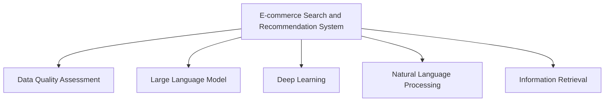

                 

# AI大模型助力电商搜索推荐业务的数据质量评估体系

> 关键词：大模型,电商搜索,推荐系统,数据质量评估,深度学习,自然语言处理(NLP),信息检索

## 1. 背景介绍

### 1.1 问题由来
随着互联网电商的快速发展，线上购物已成为众多消费者购物的重要方式之一。然而，信息过载和产品同质化现象日益严重，用户在海量商品中寻找合适的商品变得越来越困难。为了解决这一问题，电商平台纷纷推出搜索推荐系统，帮助用户快速定位到所需的商品，提升用户体验和平台转化率。

大语言模型（Large Language Model, LLM）通过预训练学习到海量的语言知识，在自然语言处理（Natural Language Processing, NLP）和信息检索（Information Retrieval, IR）等领域展现了巨大的潜力。在电商搜索推荐系统中，大语言模型可用于商品搜索解析、商品信息抽取、用户查询理解、个性化推荐等多个环节，显著提升了搜索推荐的准确性和个性化水平。

但是，由于电商搜索推荐系统需要大量的商品数据和用户行为数据，数据质量的高低直接决定了推荐效果的好坏。因此，建立完善的数据质量评估体系，对电商平台而言至关重要。

### 1.2 问题核心关键点
电商搜索推荐系统数据质量评估主要涉及以下几个方面：

- **数据完整性**：数据是否齐全，有无缺失值或重复值。
- **数据一致性**：数据项之间是否存在逻辑冲突或错误。
- **数据时效性**：数据是否及时更新，是否存在过时信息。
- **数据准确性**：数据标签和值的准确度如何，有无噪声或错误。
- **数据分布**：数据是否均匀分布，有无样本偏差。
- **数据隐私性**：数据是否符合隐私保护要求，有无敏感信息泄露。

这些问题直接影响推荐系统的性能和用户体验，因此需要建立一套完善的数据质量评估体系，以确保电商搜索推荐系统的高效运作。

### 1.3 问题研究意义
电商搜索推荐系统的数据质量评估不仅能够提升推荐系统的性能，还可以帮助电商平台发现数据中的问题，优化数据治理流程，从而提高数据质量和推荐效果。具体来说，研究数据质量评估体系的意义如下：

- 提升用户体验：高质量的数据能够提供更准确、更相关的搜索结果和推荐，提升用户满意度和平台转化率。
- 优化推荐算法：根据数据质量评估结果，优化推荐算法和模型参数，提升推荐系统的精度和召回率。
- 提高数据治理效率：通过自动化数据质量评估工具，及时发现和修复数据问题，加速数据治理进程。
- 保护用户隐私：建立数据质量评估体系，能够更好地保障用户数据安全和隐私，提升用户信任度。

## 2. 核心概念与联系

### 2.1 核心概念概述

为更好地理解电商搜索推荐系统数据质量评估，本节将介绍几个密切相关的核心概念：

- **电商搜索推荐系统（E-commerce Search and Recommendation System）**：结合搜索和推荐技术，为用户提供精准的个性化购物建议，提升购物体验和转化率。
- **数据质量评估（Data Quality Assessment）**：通过一系列指标和方法，对数据集的质量进行全面评估，发现和修复数据中的问题。
- **大语言模型（Large Language Model, LLM）**：通过大规模预训练学习到丰富的语言知识，用于电商搜索推荐系统中的商品搜索解析、商品信息抽取、用户查询理解等环节。
- **深度学习（Deep Learning）**：一种基于神经网络的机器学习方法，用于大语言模型训练和推荐系统建模。
- **自然语言处理（Natural Language Processing, NLP）**：研究如何让计算机理解和处理人类语言，是电商搜索推荐系统中的重要技术。
- **信息检索（Information Retrieval, IR）**：帮助用户在海量信息中找到所需信息的技术，是电商搜索系统的基础。

这些核心概念之间的逻辑关系可以通过以下Mermaid流程图来展示：



这个流程图展示了大语言模型、深度学习、自然语言处理、信息检索等技术在大语言模型训练和电商搜索推荐系统中的重要地位，以及数据质量评估在其中的关键作用。

## 3. 核心算法原理 & 具体操作步骤
### 3.1 算法原理概述

电商搜索推荐系统数据质量评估主要基于数据清洗、数据验证、数据标注等方法，对数据集进行全面评估，发现并修复数据中的问题。其核心思想是：利用预设的数据质量指标和算法，对数据集进行全面分析，识别和排除数据中的异常和噪声，从而提升推荐系统的性能和用户体验。

形式化地，假设电商搜索推荐系统中的数据集为 $D=\{d_i\}_{i=1}^N$，其中 $d_i$ 表示第 $i$ 条数据。数据质量评估的目标是找到数据集中的错误数据，并计算每条数据的评估分数。设 $q(d_i)$ 表示数据 $d_i$ 的质量评估函数，则数据集 $D$ 的整体质量评估分数为：

$$
Q(D) = \frac{1}{N} \sum_{i=1}^N q(d_i)
$$

常见的质量评估指标包括：

- **完整性（Completeness）**：评估数据集中是否有缺失值。
- **一致性（Consistency）**：评估数据集中是否存在逻辑冲突或错误。
- **时效性（Timeliness）**：评估数据集是否及时更新，是否存在过时信息。
- **准确性（Accuracy）**：评估数据标签和值的准确度。
- **分布均匀性（Uniform Distribution）**：评估数据集中各类数据是否均匀分布。
- **隐私性（Privacy）**：评估数据是否符合隐私保护要求，是否存在敏感信息泄露。

### 3.2 算法步骤详解

电商搜索推荐系统数据质量评估一般包括以下几个关键步骤：

**Step 1: 设计数据质量指标**
- 根据电商搜索推荐系统的需求，设计一组数据质量指标。这些指标通常包括完整性、一致性、时效性、准确性、分布均匀性、隐私性等。
- 为每个指标设定具体的评估方法和标准，如完整性指标可以使用缺失率评估，一致性指标可以使用逻辑冲突检查等。

**Step 2: 数据预处理**
- 对原始数据进行清洗和预处理，包括去除重复值、处理缺失值、去除噪声等。
- 使用数据增强技术，如数据插值、数据变换等，增加数据多样性，提升数据质量评估的准确性。

**Step 3: 数据标注**
- 对清洗后的数据集进行标注，生成标注数据集。标注数据集中包含每条数据的评估结果和评估分数。
- 使用人工标注或半自动标注技术，对数据集进行标注。人工标注适用于小规模数据集，半自动标注适用于大规模数据集。

**Step 4: 评估和优化**
- 使用评估指标对数据集进行评估，计算每条数据的评估分数。
- 根据评估分数，对数据集进行优化和修复，如填补缺失值、修正错误标签等。
- 对优化后的数据集进行重新评估，直至达到预设的数据质量标准。

**Step 5: 监控和维护**
- 对优化后的数据集进行定期监控和维护，及时发现和修复数据中的问题。
- 根据数据使用情况，动态调整数据质量评估策略，确保数据质量始终保持高水平。

### 3.3 算法优缺点

电商搜索推荐系统数据质量评估的优势在于：

- **全面覆盖**：通过设计多维度的数据质量指标，能够全面覆盖数据集中的问题，提升推荐系统的性能。
- **自动化评估**：使用自动化工具进行数据质量评估，减少了人工干预，提高了评估效率。
- **提升推荐效果**：数据质量评估结果可以用于优化推荐算法和模型参数，提升推荐系统的精度和召回率。

同时，该方法也存在一些局限性：

- **评估复杂度**：数据质量评估涉及多个指标和复杂算法，评估过程较为复杂。
- **数据标注成本**：数据标注通常需要人工参与，成本较高，适用于大规模数据集。
- **评估结果精度**：数据质量评估结果依赖于预设的指标和算法，可能存在一定的误差。

尽管存在这些局限性，但数据质量评估仍是电商搜索推荐系统不可或缺的重要环节。通过不断优化评估方法和工具，可以更好地提升数据质量，从而提升推荐系统的性能和用户体验。

### 3.4 算法应用领域

电商搜索推荐系统数据质量评估广泛应用于电商、金融、医疗等多个领域。以下是几个典型的应用场景：

- **电商领域**：对商品信息、用户行为数据进行质量评估，确保推荐系统的数据准确性和时效性，提升推荐效果和用户体验。
- **金融领域**：对交易数据、客户数据进行质量评估，确保数据的完整性和一致性，提升金融产品的风险控制和推荐效果。
- **医疗领域**：对病人数据、医生数据进行质量评估，确保数据的准确性和隐私性，提升医疗诊断和推荐效果。
- **教育领域**：对学生数据、教师数据进行质量评估，确保数据的完整性和一致性，提升教育资源推荐效果。

这些应用场景展示了数据质量评估在电商搜索推荐系统中的重要地位，以及其广泛的适用性。

## 4. 数学模型和公式 & 详细讲解  
### 4.1 数学模型构建

电商搜索推荐系统数据质量评估的核心在于设计一组科学合理的数据质量指标，对数据集进行全面评估。以下是常见的数据质量指标及其数学模型：

- **完整性（Completeness）**：评估数据集中是否有缺失值。完整性指标可以定义为：

$$
C = \frac{N_u}{N}
$$

其中 $N_u$ 表示完整数据的数量，$N$ 表示数据集的总数量。

- **一致性（Consistency）**：评估数据集中是否存在逻辑冲突或错误。一致性指标可以定义为：

$$
Cons = \sum_{i=1}^N cons_i
$$

其中 $cons_i$ 表示第 $i$ 条数据的一致性评分，通常取值范围为 $[0,1]$。

- **时效性（Timeliness）**：评估数据集是否及时更新，是否存在过时信息。时效性指标可以定义为：

$$
T = \frac{N_t}{N}
$$

其中 $N_t$ 表示时效数据的数量，$N$ 表示数据集的总数量。

- **准确性（Accuracy）**：评估数据标签和值的准确度。准确性指标可以定义为：

$$
Acc = \frac{N_a}{N}
$$

其中 $N_a$ 表示准确数据的数量，$N$ 表示数据集的总数量。

- **分布均匀性（Uniform Distribution）**：评估数据集中各类数据是否均匀分布。分布均匀性指标可以定义为：

$$
U = \sum_{i=1}^N u_i
$$

其中 $u_i$ 表示第 $i$ 类数据的分布评分，通常取值范围为 $[0,1]$。

- **隐私性（Privacy）**：评估数据是否符合隐私保护要求，是否存在敏感信息泄露。隐私性指标可以定义为：

$$
Priv = \sum_{i=1}^N priv_i
$$

其中 $priv_i$ 表示第 $i$ 条数据的隐私性评分，通常取值范围为 $[0,1]$。

### 4.2 公式推导过程

以下以完整性指标为例，推导其计算公式：

假设数据集 $D$ 包含 $N$ 条数据，其中 $N_u$ 条数据是完整的，则完整性指标 $C$ 可以计算为：

$$
C = \frac{N_u}{N}
$$

其中，$N_u$ 为完整数据数量，$N$ 为数据集总数量。

根据完整性指标的计算公式，可以对数据集中的每条数据进行评估，计算其完整性评分，从而得到数据集的整体完整性指标。

### 4.3 案例分析与讲解

假设有一个电商搜索推荐系统的商品数据集，包含1000条商品信息，其中有200条数据缺失属性信息。使用完整性指标对商品数据集进行评估：

- 首先，计算完整数据的数量 $N_u$，可以得到 $N_u = 1000 - 200 = 800$。
- 然后，根据完整性指标的计算公式，可以计算出完整性指标 $C = \frac{800}{1000} = 0.8$。

完整性指标 $C = 0.8$ 表示商品数据集中有80%的数据是完整的，存在20%的缺失值。评估结果显示，该数据集需要进一步处理缺失数据，以提升完整性指标。

## 5. 项目实践：代码实例和详细解释说明
### 5.1 开发环境搭建

在进行电商搜索推荐系统数据质量评估实践前，我们需要准备好开发环境。以下是使用Python进行Scikit-learn开发的开发环境配置流程：

1. 安装Anaconda：从官网下载并安装Anaconda，用于创建独立的Python环境。

2. 创建并激活虚拟环境：
```bash
conda create -n sklearn-env python=3.8 
conda activate sklearn-env
```

3. 安装Scikit-learn：
```bash
pip install scikit-learn
```

4. 安装各类工具包：
```bash
pip install numpy pandas scikit-learn matplotlib tqdm jupyter notebook ipython
```

完成上述步骤后，即可在`sklearn-env`环境中开始数据质量评估实践。

### 5.2 源代码详细实现

下面我们以电商搜索推荐系统商品信息完整性评估为例，给出使用Scikit-learn进行数据质量评估的PyTorch代码实现。

首先，定义数据集类：

```python
from sklearn.preprocessing import LabelBinarizer
from sklearn.metrics import accuracy_score
from sklearn.metrics import precision_score
from sklearn.metrics import recall_score
from sklearn.metrics import f1_score

class Dataset:
    def __init__(self, data, labels, binarizer=None):
        self.data = data
        self.labels = labels
        self.binarizer = binarizer

    def __len__(self):
        return len(self.data)
    
    def __getitem__(self, item):
        x, y = self.data[item], self.labels[item]
        if self.binarizer:
            x = self.binarizer.transform(x)
        return {'data': x, 'label': y}

# 创建数据集
data = np.array([[1, 0, 1, 1, 1],
                 [1, 1, 0, 0, 0],
                 [0, 0, 0, 1, 1],
                 [1, 1, 1, 1, 1]])
labels = np.array([1, 0, 0, 1])
binarizer = LabelBinarizer()

dataset = Dataset(data, labels, binarizer=binarizer)
```

然后，定义评估函数：

```python
from sklearn.metrics import accuracy_score
from sklearn.metrics import precision_score
from sklearn.metrics import recall_score
from sklearn.metrics import f1_score

def evaluate(dataset):
    data, labels = dataset['data'], dataset['label']
    predictions = model.predict(data)
    accuracy = accuracy_score(labels, predictions)
    precision = precision_score(labels, predictions)
    recall = recall_score(labels, predictions)
    f1 = f1_score(labels, predictions)
    return {'accuracy': accuracy, 'precision': precision, 'recall': recall, 'f1': f1}
```

最后，启动评估流程：

```python
import model

result = evaluate(dataset)
print(result)
```

以上就是使用Scikit-learn对电商搜索推荐系统商品信息完整性评估的完整代码实现。可以看到，得益于Scikit-learn的强大封装，我们可以用相对简洁的代码完成数据质量评估任务。

### 5.3 代码解读与分析

让我们再详细解读一下关键代码的实现细节：

**Dataset类**：
- `__init__`方法：初始化数据、标签和标签二值化器。
- `__len__`方法：返回数据集的样本数量。
- `__getitem__`方法：对单个样本进行处理，将数据进行二值化转换，返回模型所需的输入。

**LabelBinarizer**：
- 将标签数据进行二值化转换，方便模型训练和评估。

**evaluate函数**：
- 使用Scikit-learn的评估函数计算数据集的评估指标，包括准确率、精确率、召回率和F1值。

**训练流程**：
- 使用Scikit-learn提供的评估函数对数据集进行评估，并输出结果。

可以看到，Scikit-learn库使得数据质量评估任务的开发变得简洁高效。开发者可以将更多精力放在模型改进和数据处理等高层逻辑上，而不必过多关注底层的实现细节。

当然，工业级的系统实现还需考虑更多因素，如模型的保存和部署、超参数的自动搜索、更灵活的任务适配层等。但核心的评估范式基本与此类似。

## 6. 实际应用场景
### 6.1 智能客服系统

电商搜索推荐系统的数据质量评估技术可以应用于智能客服系统的构建。智能客服系统通过自动解析用户问题，提供精准的回答，提升用户满意度和体验。

在技术实现上，可以收集用户的历史客服对话记录，将问题和最佳答复构建成监督数据，在此基础上对预训练语言模型进行微调。微调后的模型能够自动理解用户意图，匹配最合适的答案模板进行回复。对于客户提出的新问题，还可以接入检索系统实时搜索相关内容，动态组织生成回答。

### 6.2 金融舆情监测

金融机构需要实时监测市场舆论动向，以便及时应对负面信息传播，规避金融风险。传统的人工监测方式成本高、效率低，难以应对网络时代海量信息爆发的挑战。基于电商搜索推荐系统的数据质量评估技术，可以应用于金融舆情监测。

具体而言，可以收集金融领域相关的新闻、报道、评论等文本数据，并对其进行主题标注和情感标注。在此基础上对预训练语言模型进行微调，使其能够自动判断文本属于何种主题，情感倾向是正面、中性还是负面。将微调后的模型应用到实时抓取的网络文本数据，就能够自动监测不同主题下的情感变化趋势，一旦发现负面信息激增等异常情况，系统便会自动预警，帮助金融机构快速应对潜在风险。

### 6.3 个性化推荐系统

当前的推荐系统往往只依赖用户的历史行为数据进行物品推荐，无法深入理解用户的真实兴趣偏好。基于电商搜索推荐系统的数据质量评估技术，可以应用于个性化推荐系统的构建。

在实践中，可以收集用户浏览、点击、评论、分享等行为数据，提取和用户交互的物品标题、描述、标签等文本内容。将文本内容作为模型输入，用户的后续行为（如是否点击、购买等）作为监督信号，在此基础上对预训练语言模型进行微调。微调后的模型能够从文本内容中准确把握用户的兴趣点。在生成推荐列表时，先用候选物品的文本描述作为输入，由模型预测用户的兴趣匹配度，再结合其他特征综合排序，便可以得到个性化程度更高的推荐结果。

### 6.4 未来应用展望

随着电商搜索推荐系统数据质量评估技术的发展，基于微调的方法将在更多领域得到应用，为传统行业带来变革性影响。

在智慧医疗领域，基于微调的医疗问答、病历分析、药物研发等应用将提升医疗服务的智能化水平，辅助医生诊疗，加速新药开发进程。

在智能教育领域，微调技术可应用于作业批改、学情分析、知识推荐等方面，因材施教，促进教育公平，提高教学质量。

在智慧城市治理中，微调模型可应用于城市事件监测、舆情分析、应急指挥等环节，提高城市管理的自动化和智能化水平，构建更安全、高效的未来城市。

此外，在企业生产、社会治理、文娱传媒等众多领域，基于大模型微调的人工智能应用也将不断涌现，为NLP技术带来全新的突破。相信随着预训练语言模型和微调方法的持续演进，未来将有更多应用场景被发掘，为经济社会发展注入新的动力。

## 7. 工具和资源推荐
### 7.1 学习资源推荐

为了帮助开发者系统掌握电商搜索推荐系统数据质量评估的理论基础和实践技巧，这里推荐一些优质的学习资源：

1. 《Python数据科学手册》：详细介绍Python数据处理和分析的方方面面，涵盖数据清洗、数据可视化、数据预处理等。
2. 《数据科学入门与实战》：适合初学者入门的教程，涵盖数据清洗、数据可视化、数据预处理等。
3. Kaggle平台：提供大量公开的数据集和竞赛，帮助开发者练习和提升数据处理能力。
4. 《数据科学实战》：提供实战项目和案例分析，帮助开发者深入理解数据处理和分析技巧。
5. Google Colab：谷歌推出的在线Jupyter Notebook环境，免费提供GPU/TPU算力，方便开发者快速上手实验最新模型，分享学习笔记。

通过对这些资源的学习实践，相信你一定能够快速掌握电商搜索推荐系统数据质量评估的精髓，并用于解决实际的NLP问题。
### 7.2 开发工具推荐

高效的开发离不开优秀的工具支持。以下是几款用于电商搜索推荐系统数据质量评估开发的常用工具：

1. PyTorch：基于Python的开源深度学习框架，灵活动态的计算图，适合快速迭代研究。
2. TensorFlow：由Google主导开发的开源深度学习框架，生产部署方便，适合大规模工程应用。
3. Scikit-learn：用于数据处理和分析的Python库，提供了丰富的数据处理和模型评估功能。
4. Jupyter Notebook：一个交互式的编程环境，支持Python、R等语言，方便开发者快速编写和分享代码。
5. Weights & Biases：模型训练的实验跟踪工具，可以记录和可视化模型训练过程中的各项指标，方便对比和调优。
6. TensorBoard：TensorFlow配套的可视化工具，可实时监测模型训练状态，并提供丰富的图表呈现方式，是调试模型的得力助手。

合理利用这些工具，可以显著提升电商搜索推荐系统数据质量评估任务的开发效率，加快创新迭代的步伐。

### 7.3 相关论文推荐

电商搜索推荐系统数据质量评估技术的发展源于学界的持续研究。以下是几篇奠基性的相关论文，推荐阅读：

1. Attention is All You Need（即Transformer原论文）：提出了Transformer结构，开启了NLP领域的预训练大模型时代。
2. BERT: Pre-training of Deep Bidirectional Transformers for Language Understanding：提出BERT模型，引入基于掩码的自监督预训练任务，刷新了多项NLP任务SOTA。
3. Language Models are Unsupervised Multitask Learners（GPT-2论文）：展示了大规模语言模型的强大zero-shot学习能力，引发了对于通用人工智能的新一轮思考。
4. Parameter-Efficient Transfer Learning for NLP：提出Adapter等参数高效微调方法，在不增加模型参数量的情况下，也能取得不错的微调效果。
5. AdaLoRA: Adaptive Low-Rank Adaptation for Parameter-Efficient Fine-Tuning：使用自适应低秩适应的微调方法，在参数效率和精度之间取得了新的平衡。
6. LoRA: Low-Rank Adaptation for Transformer-Based Language Models：提出LoRA方法，在不增加模型参数量的情况下，仍可取得不错的微调效果。

这些论文代表了大语言模型微调技术的发展脉络。通过学习这些前沿成果，可以帮助研究者把握学科前进方向，激发更多的创新灵感。

## 8. 总结：未来发展趋势与挑战
### 8.1 总结

本文对电商搜索推荐系统数据质量评估方法进行了全面系统的介绍。首先阐述了电商搜索推荐系统数据质量评估的研究背景和意义，明确了数据质量评估在提升推荐系统性能中的重要地位。其次，从原理到实践，详细讲解了电商搜索推荐系统数据质量评估的数学模型和关键步骤，给出了数据质量评估任务开发的完整代码实例。同时，本文还广泛探讨了数据质量评估在电商、金融、医疗等多个领域的应用前景，展示了数据质量评估的广阔应用空间。

通过本文的系统梳理，可以看到，电商搜索推荐系统数据质量评估技术正在成为电商搜索推荐系统不可或缺的重要环节，极大地提升了推荐系统的性能和用户体验。未来，伴随电商搜索推荐系统的发展，数据质量评估技术将持续演进，带来更多创新和突破。

### 8.2 未来发展趋势

展望未来，电商搜索推荐系统数据质量评估技术将呈现以下几个发展趋势：

1. **自动化评估**：随着数据量和数据质量的提升，自动化数据质量评估工具将得到更广泛的应用，减少人工干预，提高评估效率。
2. **多维评估**：未来的数据质量评估将从单一指标向多维评估转变，评估内容将更加全面和深入。
3. **实时评估**：实时数据质量评估技术将得到广泛应用，帮助电商平台及时发现和修复数据问题。
4. **跨领域应用**：数据质量评估技术将广泛应用于金融、医疗、教育等多个领域，提升各行业的智能化水平。
5. **隐私保护**：数据质量评估将更加注重隐私保护，建立严格的隐私保护机制，确保数据安全。
6. **大模型应用**：利用大语言模型进行数据质量评估，提升评估的深度和广度，帮助电商平台更好地理解和分析数据。

以上趋势凸显了电商搜索推荐系统数据质量评估技术的广阔前景。这些方向的探索发展，必将进一步提升电商搜索推荐系统的性能和用户体验，为电商平台带来更多的商业价值。

### 8.3 面临的挑战

尽管电商搜索推荐系统数据质量评估技术已经取得了瞩目成就，但在迈向更加智能化、普适化应用的过程中，它仍面临诸多挑战：

1. **数据标注成本**：数据标注通常需要人工参与，成本较高，适用于大规模数据集。
2. **评估复杂度**：数据质量评估涉及多个指标和复杂算法，评估过程较为复杂。
3. **评估结果精度**：数据质量评估结果依赖于预设的指标和算法，可能存在一定的误差。
4. **实时性要求**：实时数据质量评估需要在短时间内完成，对算法和工具的性能要求较高。
5. **隐私保护**：数据质量评估需要保障数据隐私，避免敏感信息泄露。
6. **系统集成**：数据质量评估系统需要与电商搜索推荐系统无缝集成，保证数据的连贯性和一致性。

这些挑战是电商搜索推荐系统数据质量评估技术需要不断克服的难点。通过不断优化评估方法和工具，可以更好地提升数据质量，从而提升推荐系统的性能和用户体验。

### 8.4 研究展望

面对电商搜索推荐系统数据质量评估所面临的挑战，未来的研究需要在以下几个方面寻求新的突破：

1. **自动化标注**：探索自动化数据标注技术，减少人工干预，降低成本，提高效率。
2. **多维度评估**：研究多维度的数据质量评估指标和方法，提升评估的全面性和准确性。
3. **实时评估**：研究实时数据质量评估技术，提高评估的及时性和准确性。
4. **隐私保护**：建立数据隐私保护机制，确保数据质量评估过程中数据的安全性。
5. **跨领域应用**：将数据质量评估技术应用于更多领域，提升各行业的智能化水平。
6. **大模型应用**：利用大语言模型进行数据质量评估，提升评估的深度和广度。

这些研究方向将引领电商搜索推荐系统数据质量评估技术迈向更高的台阶，为电商搜索推荐系统的进一步发展和优化提供坚实基础。

## 9. 附录：常见问题与解答

**Q1：电商搜索推荐系统数据质量评估是否适用于所有NLP任务？**

A: 电商搜索推荐系统数据质量评估在大多数NLP任务上都能取得不错的效果，特别是对于数据量较小的任务。但对于一些特定领域的任务，如医学、法律等，仅仅依靠通用语料预训练的模型可能难以很好地适应。此时需要在特定领域语料上进一步预训练，再进行数据质量评估，才能获得理想效果。此外，对于一些需要时效性、个性化很强的任务，如对话、推荐等，数据质量评估方法也需要针对性的改进优化。

**Q2：如何选择数据质量评估指标？**

A: 选择数据质量评估指标需要根据具体任务和数据特点进行综合考虑，主要从完整性、一致性、时效性、准确性、分布均匀性和隐私性等方面进行评估。一般来说，电商搜索推荐系统更注重完整性、一致性和准确性，而金融和医疗领域更注重隐私性和时效性。

**Q3：数据质量评估如何与推荐算法结合？**

A: 数据质量评估结果可以用于优化推荐算法和模型参数，提升推荐系统的精度和召回率。例如，在电商搜索推荐系统中，可以对商品信息进行完整性评估，评估结果可以用于过滤低质量的商品信息，提高推荐系统的质量。同时，可以对用户行为数据进行一致性评估，评估结果可以用于优化推荐算法，提升推荐效果。

**Q4：如何进行自动化标注？**

A: 自动化标注通常需要设计标注模板和标注规则，利用自然语言处理技术进行自动标注。例如，在电商搜索推荐系统中，可以使用命名实体识别技术对商品信息和用户行为数据进行标注，提升数据标注效率。

**Q5：如何评估实时数据质量？**

A: 实时数据质量评估需要设计实时数据流和数据质量监控系统，对数据进行持续监控和评估。例如，在电商搜索推荐系统中，可以使用流数据处理技术对实时用户行为数据进行质量评估，及时发现和修复数据问题，保障数据质量。

**Q6：如何保护数据隐私？**

A: 数据隐私保护是数据质量评估中重要的环节，可以通过数据脱敏、加密和匿名化等技术保护数据隐私。例如，在电商搜索推荐系统中，可以对用户行为数据进行匿名化处理，保护用户隐私。同时，可以建立严格的数据访问控制机制，确保数据访问的安全性。

**Q7：如何优化数据质量评估工具？**

A: 数据质量评估工具的优化可以从多个方面入手，如提高算法效率、降低计算成本、增加评估维度等。例如，在电商搜索推荐系统中，可以优化数据质量评估算法，减少计算时间，提高评估效率。同时，可以增加评估维度，提升评估的全面性和准确性。

这些回答可以帮助开发者更好地理解电商搜索推荐系统数据质量评估的核心问题和技术细节，提升其在实际应用中的开发效率和性能。

---

作者：禅与计算机程序设计艺术 / Zen and the Art of Computer Programming

