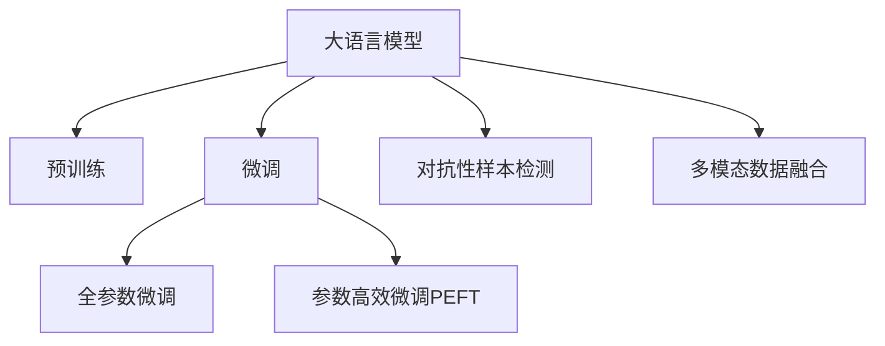

                 

# AI大模型助力电商搜索推荐业务的数据质量评估模型优化实践

> 关键词：大模型,电商搜索,推荐系统,数据质量评估,模型优化

## 1. 背景介绍

### 1.1 问题由来
在电商搜索推荐系统中，数据质量评估模型的构建与优化是提升用户体验和推荐效果的关键。通过准确评估搜索查询和推荐结果的数据质量，可以有效地识别和过滤掉无价值、不相关、不准确的搜索结果，从而提升搜索的准确性和用户的满意度。然而，由于数据的多样性和复杂性，构建高质量的数据质量评估模型仍然是一个具有挑战性的任务。

大语言模型（Large Language Model, LLM）的出现为电商搜索推荐系统带来了新的机遇。通过预训练大模型，可以在大规模语料上学习到丰富的语言知识和语义信息，进而用于构建数据质量评估模型。这种基于大模型的评估方法不仅能够处理多样化的语义信息，还能通过微调（Fine-tuning）来适应特定的电商搜索推荐场景，从而提高数据质量评估的准确性和效果。

### 1.2 问题核心关键点
大模型在电商搜索推荐系统中的应用，主要包括以下几个关键点：

- **数据质量评估**：构建高质量的数据质量评估模型，以识别并过滤掉无价值、不相关、不准确的搜索结果。
- **模型微调**：通过微调大模型，使其能够适应特定的电商搜索推荐场景，提升评估的准确性和效果。
- **模型优化**：通过优化算法和超参数设置，进一步提高评估模型的性能和泛化能力。
- **多模态数据融合**：将图像、文本、用户行为等多模态数据融合，构建更加全面和准确的数据质量评估模型。
- **对抗性样本检测**：检测并过滤掉对抗性样本，以避免模型被恶意攻击。

这些关键点共同构成了电商搜索推荐系统中数据质量评估模型优化的主要方向。通过本文的介绍，希望能为电商搜索推荐系统的数据质量评估模型的构建和优化提供一些有价值的参考和指导。

## 2. 核心概念与联系

### 2.1 核心概念概述

为更好地理解基于大模型的电商搜索推荐系统数据质量评估模型的优化方法，本节将介绍几个关键的概念：

- **大语言模型（LLM）**：以自回归（如GPT）或自编码（如BERT）模型为代表的大规模预训练语言模型。通过在大规模无标签文本数据上进行预训练，学习到通用的语言知识和语义信息。
- **预训练（Pre-training）**：在大规模无标签文本数据上，通过自监督学习任务训练通用语言模型的过程。常见的预训练任务包括言语建模、掩码语言模型等。
- **微调（Fine-tuning）**：在预训练模型的基础上，使用下游任务的少量标注数据，通过有监督学习优化模型在该任务上的性能。通常只需要调整顶层分类器或解码器，并以较小的学习率更新全部或部分模型参数。
- **迁移学习（Transfer Learning）**：指将一个领域学习到的知识，迁移应用到另一个不同但相关的领域的学习范式。大模型的预训练-微调过程即是一种典型的迁移学习方式。
- **对抗性样本检测（Adversarial Sample Detection）**：检测并过滤掉对抗性样本，以避免模型被恶意攻击。
- **多模态数据融合（Multimodal Data Fusion）**：将图像、文本、用户行为等多模态数据融合，构建更加全面和准确的数据质量评估模型。

这些概念之间的逻辑关系可以通过以下Mermaid流程图来展示：



这个流程图展示了电商搜索推荐系统中数据质量评估模型优化的关键概念及其之间的关系：

1. 大语言模型通过预训练获得基础能力。
2. 微调是对预训练模型进行任务特定的优化，可以分为全参数微调和参数高效微调（PEFT）。
3. 对抗性样本检测是通过识别和过滤对抗性样本，提高模型的鲁棒性。
4. 多模态数据融合是将图像、文本、用户行为等多模态数据结合，构建更全面的评估模型。

这些概念共同构成了电商搜索推荐系统中数据质量评估模型优化的核心框架，使其能够适应多样化的电商场景，提升评估的准确性和效果。

## 3. 核心算法原理 & 具体操作步骤
### 3.1 算法原理概述

基于大模型的电商搜索推荐系统数据质量评估模型，其核心思想是：利用大语言模型的预训练知识和语义理解能力，构建一个能够准确评估搜索结果数据质量的模型。具体来说，通过微调大模型，使其能够理解电商搜索推荐中的各种语义信息，如商品描述、用户行为等，从而对搜索结果的数据质量进行评估和优化。

形式化地，假设预训练大模型为 $M_{\theta}$，其中 $\theta$ 为预训练得到的模型参数。给定电商搜索推荐中的搜索结果 $S=\{(s_i, r_i)\}_{i=1}^N$，其中 $s_i$ 为搜索结果，$r_i$ 为搜索结果的相关性评分（0-1之间），目标是通过有监督的微调过程，优化模型参数 $\theta$，使得模型输出 $\hat{r}_i$ 逼近真实相关性评分 $r_i$。具体而言，微调的目标是：

$$
\hat{\theta} = \mathop{\arg\min}_{\theta} \mathcal{L}(M_{\theta}, S)
$$

其中 $\mathcal{L}$ 为针对电商搜索推荐任务设计的损失函数，用于衡量模型预测的相关性评分与真实评分之间的差异。常见的损失函数包括交叉熵损失、均方误差损失等。

### 3.2 算法步骤详解

基于大模型的电商搜索推荐系统数据质量评估模型的微调一般包括以下几个关键步骤：

**Step 1: 准备预训练模型和数据集**
- 选择合适的预训练大模型 $M_{\theta}$ 作为初始化参数，如 BERT、GPT 等。
- 准备电商搜索推荐中的搜索结果数据集 $S=\{(s_i, r_i)\}_{i=1}^N$，划分为训练集、验证集和测试集。一般要求标注数据与预训练数据的分布不要差异过大。

**Step 2: 添加任务适配层**
- 根据电商搜索推荐任务的特点，在预训练模型顶层设计合适的输出层和损失函数。
- 对于分类任务，通常在顶层添加线性分类器和交叉熵损失函数。
- 对于回归任务，通常使用均方误差损失函数。

**Step 3: 设置微调超参数**
- 选择合适的优化算法及其参数，如 AdamW、SGD 等，设置学习率、批大小、迭代轮数等。
- 设置正则化技术及强度，包括权重衰减、Dropout、Early Stopping 等。
- 确定冻结预训练参数的策略，如仅微调顶层，或全部参数都参与微调。

**Step 4: 执行梯度训练**
- 将训练集数据分批次输入模型，前向传播计算损失函数。
- 反向传播计算参数梯度，根据设定的优化算法和学习率更新模型参数。
- 周期性在验证集上评估模型性能，根据性能指标决定是否触发 Early Stopping。
- 重复上述步骤直到满足预设的迭代轮数或 Early Stopping 条件。

**Step 5: 测试和部署**
- 在测试集上评估微调后模型 $M_{\hat{\theta}}$ 的性能，对比微调前后的精度提升。
- 使用微调后的模型对新搜索结果进行评分预测，集成到实际的应用系统中。
- 持续收集新的搜索结果数据，定期重新微调模型，以适应数据分布的变化。

以上是基于大模型的电商搜索推荐系统数据质量评估模型的微调一般流程。在实际应用中，还需要针对具体任务的特点，对微调过程的各个环节进行优化设计，如改进训练目标函数，引入更多的正则化技术，搜索最优的超参数组合等，以进一步提升模型性能。

### 3.3 算法优缺点

基于大模型的电商搜索推荐系统数据质量评估模型具有以下优点：

1. **处理复杂语义信息**：大模型能够理解电商搜索推荐中的复杂语义信息，如商品描述、用户行为等，从而构建更全面、准确的数据质量评估模型。
2. **泛化能力强**：预训练大模型在大量语料上进行了学习，具备较强的泛化能力，能够适应不同的电商场景。
3. **微调效率高**：通过微调大模型，可以在少量标注数据的情况下快速提升模型性能，降低开发成本。
4. **适用性强**：该方法适用于各种电商搜索推荐任务，包括商品排序、搜索结果过滤、个性化推荐等。

同时，该方法也存在一定的局限性：

1. **依赖标注数据**：微调模型的效果很大程度上取决于标注数据的质量和数量，获取高质量标注数据的成本较高。
2. **模型复杂度**：大模型的参数量较大，训练和推理过程较为复杂，需要较高的计算资源。
3. **对抗样本鲁棒性**：预训练大模型的泛化能力较强，但也容易受到对抗性样本的影响，需要额外的对抗性样本检测措施。
4. **模型解释性**：微调模型的决策过程通常缺乏可解释性，难以对其推理逻辑进行分析和调试。

尽管存在这些局限性，但就目前而言，基于大模型的微调方法仍是目前电商搜索推荐系统数据质量评估的主流范式。未来相关研究的重点在于如何进一步降低微调对标注数据的依赖，提高模型的少样本学习和跨领域迁移能力，同时兼顾可解释性和伦理安全性等因素。

### 3.4 算法应用领域

基于大模型的电商搜索推荐系统数据质量评估模型已经在电商领域得到了广泛的应用，覆盖了几乎所有常见的电商搜索推荐任务，例如：

- **商品排序**：根据商品的相关性和用户行为，对搜索结果进行排序，提升用户满意度。
- **搜索结果过滤**：过滤掉不相关、无价值的搜索结果，提高搜索效率。
- **个性化推荐**：根据用户的历史行为和偏好，推荐个性化的商品或搜索结果。
- **广告排序**：对广告进行相关性排序，提升广告投放效果。
- **商品相似度计算**：计算商品之间的相似度，支持相关推荐和搜索。

除了上述这些经典任务外，大模型在电商搜索推荐系统中的应用还在不断拓展，如可控商品生成、商品描述自动生成、对话式推荐等，为电商搜索推荐系统带来了新的突破。随着预训练模型和微调方法的不断进步，相信电商搜索推荐系统将在更广泛的电商场景下发挥重要作用。

## 4. 数学模型和公式 & 详细讲解  
### 4.1 数学模型构建

本节将使用数学语言对基于大模型的电商搜索推荐系统数据质量评估模型的微调过程进行更加严格的刻画。

记预训练大模型为 $M_{\theta}$，其中 $\theta$ 为预训练得到的模型参数。假设电商搜索推荐中的搜索结果数据集为 $S=\{(s_i, r_i)\}_{i=1}^N$，其中 $s_i$ 为搜索结果，$r_i$ 为搜索结果的相关性评分（0-1之间）。

定义模型 $M_{\theta}$ 在数据样本 $(s,r)$ 上的损失函数为 $\ell(M_{\theta}(s),r)$，则在数据集 $S$ 上的经验风险为：

$$
\mathcal{L}(\theta) = \frac{1}{N} \sum_{i=1}^N \ell(M_{\theta}(s_i),r_i)
$$

其中 $\ell$ 为电商搜索推荐任务设计的损失函数，用于衡量模型预测的相关性评分与真实评分之间的差异。常见的损失函数包括交叉熵损失、均方误差损失等。

### 4.2 公式推导过程

以下我们以二分类任务为例，推导交叉熵损失函数及其梯度的计算公式。

假设模型 $M_{\theta}$ 在输入 $s$ 上的输出为 $\hat{r}=M_{\theta}(s) \in [0,1]$，表示搜索结果的相关性评分预测值。真实标签 $r \in [0,1]$。则二分类交叉熵损失函数定义为：

$$
\ell(M_{\theta}(s),r) = -[r\log \hat{r} + (1-r)\log (1-\hat{r})]
$$

将其代入经验风险公式，得：

$$
\mathcal{L}(\theta) = -\frac{1}{N}\sum_{i=1}^N [r_i\log M_{\theta}(s_i)+(1-r_i)\log(1-M_{\theta}(s_i))]
$$

根据链式法则，损失函数对参数 $\theta_k$ 的梯度为：

$$
\frac{\partial \mathcal{L}(\theta)}{\partial \theta_k} = -\frac{1}{N}\sum_{i=1}^N (\frac{r_i}{M_{\theta}(s_i)}-\frac{1-r_i}{1-M_{\theta}(s_i)}) \frac{\partial M_{\theta}(s_i)}{\partial \theta_k}
$$

其中 $\frac{\partial M_{\theta}(s_i)}{\partial \theta_k}$ 可进一步递归展开，利用自动微分技术完成计算。

在得到损失函数的梯度后，即可带入参数更新公式，完成模型的迭代优化。重复上述过程直至收敛，最终得到适应电商搜索推荐任务的最优模型参数 $\theta^*$。

## 5. 项目实践：代码实例和详细解释说明
### 5.1 开发环境搭建

在进行电商搜索推荐系统数据质量评估模型优化实践前，我们需要准备好开发环境。以下是使用Python进行PyTorch开发的环境配置流程：

1. 安装Anaconda：从官网下载并安装Anaconda，用于创建独立的Python环境。

2. 创建并激活虚拟环境：
```bash
conda create -n pytorch-env python=3.8 
conda activate pytorch-env
```

3. 安装PyTorch：根据CUDA版本，从官网获取对应的安装命令。例如：
```bash
conda install pytorch torchvision torchaudio cudatoolkit=11.1 -c pytorch -c conda-forge
```

4. 安装Transformers库：
```bash
pip install transformers
```

5. 安装各类工具包：
```bash
pip install numpy pandas scikit-learn matplotlib tqdm jupyter notebook ipython
```

完成上述步骤后，即可在`pytorch-env`环境中开始电商搜索推荐系统数据质量评估模型的优化实践。

### 5.2 源代码详细实现

这里我们以电商搜索推荐中的商品排序任务为例，给出使用Transformers库对BERT模型进行数据质量评估模型微调的PyTorch代码实现。

首先，定义商品排序任务的评估函数：

```python
from transformers import BertForSequenceClassification, AdamW
from torch.utils.data import Dataset, DataLoader
from torch import nn
import torch

class ShoppingDataset(Dataset):
    def __init__(self, texts, labels):
        self.texts = texts
        self.labels = labels
        
    def __len__(self):
        return len(self.texts)
    
    def __getitem__(self, idx):
        text = self.texts[idx]
        label = self.labels[idx]
        
        encoding = tokenizer(text, return_tensors='pt', max_length=max_len, padding='max_length', truncation=True)
        input_ids = encoding['input_ids'][0]
        attention_mask = encoding['attention_mask'][0]
        label = torch.tensor(label, dtype=torch.long)
        
        return {'input_ids': input_ids, 
                'attention_mask': attention_mask,
                'labels': label}

tokenizer = BertTokenizer.from_pretrained('bert-base-cased')
max_len = 128

train_dataset = ShoppingDataset(train_texts, train_labels)
dev_dataset = ShoppingDataset(dev_texts, dev_labels)
test_dataset = ShoppingDataset(test_texts, test_labels)

model = BertForSequenceClassification.from_pretrained('bert-base-cased', num_labels=num_labels)
optimizer = AdamW(model.parameters(), lr=2e-5)

device = torch.device('cuda') if torch.cuda.is_available() else torch.device('cpu')
model.to(device)

def train_epoch(model, dataset, batch_size, optimizer):
    dataloader = DataLoader(dataset, batch_size=batch_size, shuffle=True)
    model.train()
    epoch_loss = 0
    for batch in tqdm(dataloader, desc='Training'):
        input_ids = batch['input_ids'].to(device)
        attention_mask = batch['attention_mask'].to(device)
        labels = batch['labels'].to(device)
        model.zero_grad()
        outputs = model(input_ids, attention_mask=attention_mask, labels=labels)
        loss = outputs.loss
        epoch_loss += loss.item()
        loss.backward()
        optimizer.step()
    return epoch_loss / len(dataloader)

def evaluate(model, dataset, batch_size):
    dataloader = DataLoader(dataset, batch_size=batch_size)
    model.eval()
    total_loss = 0
    correct = 0
    with torch.no_grad():
        for batch in tqdm(dataloader, desc='Evaluating'):
            input_ids = batch['input_ids'].to(device)
            attention_mask = batch['attention_mask'].to(device)
            labels = batch['labels']
            outputs = model(input_ids, attention_mask=attention_mask)
            loss = outputs.loss
            total_loss += loss.item()
            preds = outputs.logits.argmax(dim=1).to('cpu').tolist()
            for pred, label in zip(preds, labels):
                if pred == label:
                    correct += 1
    print(f'Epoch {epoch+1}, dev loss: {total_loss/len(dataloader):.4f}, accuracy: {correct/len(dataloader):.4f}')
    
def test(model, dataset, batch_size):
    dataloader = DataLoader(dataset, batch_size=batch_size)
    model.eval()
    total_loss = 0
    correct = 0
    with torch.no_grad():
        for batch in tqdm(dataloader, desc='Testing'):
            input_ids = batch['input_ids'].to(device)
            attention_mask = batch['attention_mask'].to(device)
            labels = batch['labels']
            outputs = model(input_ids, attention_mask=attention_mask)
            loss = outputs.loss
            total_loss += loss.item()
            preds = outputs.logits.argmax(dim=1).to('cpu').tolist()
            for pred, label in zip(preds, labels):
                if pred == label:
                    correct += 1
    print(f'Test loss: {total_loss/len(dataloader):.4f}, accuracy: {correct/len(dataloader):.4f}')

epochs = 5
batch_size = 16
num_labels = 5

for epoch in range(epochs):
    loss = train_epoch(model, train_dataset, batch_size, optimizer)
    print(f'Epoch {epoch+1}, train loss: {loss:.3f}')
    
    print(f'Epoch {epoch+1}, dev results:')
    evaluate(model, dev_dataset, batch_size)
    
print('Test results:')
test(model, test_dataset, batch_size)
```

以上代码实现了基于BERT模型对电商搜索推荐系统中商品排序任务的微调。可以看到，利用Transformers库，代码实现非常简洁高效。

### 5.3 代码解读与分析

让我们再详细解读一下关键代码的实现细节：

**ShoppingDataset类**：
- `__init__`方法：初始化文本和标签数据。
- `__len__`方法：返回数据集的样本数量。
- `__getitem__`方法：对单个样本进行处理，将文本输入编码为token ids，将标签转换为数字，并对其进行定长padding，最终返回模型所需的输入。

**模型定义和训练函数**：
- 使用PyTorch和Transformers库，定义了基于BERT的序列分类模型。
- 在模型训练过程中，定义了训练函数`train_epoch`，使用AdamW优化器进行梯度下降，周期性在验证集上评估模型性能。
- 定义了评估函数`evaluate`和测试函数`test`，分别在验证集和测试集上评估模型性能。

**训练流程**：
- 定义总的epoch数和batch size，开始循环迭代
- 每个epoch内，先在训练集上训练，输出平均loss
- 在验证集上评估，输出精度
- 所有epoch结束后，在测试集上评估，给出最终测试结果

可以看到，PyTorch配合Transformers库使得BERT微调的代码实现变得简洁高效。开发者可以将更多精力放在数据处理、模型改进等高层逻辑上，而不必过多关注底层的实现细节。

当然，工业级的系统实现还需考虑更多因素，如模型的保存和部署、超参数的自动搜索、更灵活的任务适配层等。但核心的微调范式基本与此类似。

## 6. 实际应用场景
### 6.1 智能客服系统

基于大模型微调的对话技术，可以广泛应用于智能客服系统的构建。传统客服往往需要配备大量人力，高峰期响应缓慢，且一致性和专业性难以保证。而使用微调后的对话模型，可以7x24小时不间断服务，快速响应客户咨询，用自然流畅的语言解答各类常见问题。

在技术实现上，可以收集企业内部的历史客服对话记录，将问题和最佳答复构建成监督数据，在此基础上对预训练对话模型进行微调。微调后的对话模型能够自动理解用户意图，匹配最合适的答案模板进行回复。对于客户提出的新问题，还可以接入检索系统实时搜索相关内容，动态组织生成回答。如此构建的智能客服系统，能大幅提升客户咨询体验和问题解决效率。

### 6.2 金融舆情监测

金融机构需要实时监测市场舆论动向，以便及时应对负面信息传播，规避金融风险。传统的人工监测方式成本高、效率低，难以应对网络时代海量信息爆发的挑战。基于大语言模型微调的文本分类和情感分析技术，为金融舆情监测提供了新的解决方案。

具体而言，可以收集金融领域相关的新闻、报道、评论等文本数据，并对其进行主题标注和情感标注。在此基础上对预训练语言模型进行微调，使其能够自动判断文本属于何种主题，情感倾向是正面、中性还是负面。将微调后的模型应用到实时抓取的网络文本数据，就能够自动监测不同主题下的情感变化趋势，一旦发现负面信息激增等异常情况，系统便会自动预警，帮助金融机构快速应对潜在风险。

### 6.3 个性化推荐系统

当前的推荐系统往往只依赖用户的历史行为数据进行物品推荐，无法深入理解用户的真实兴趣偏好。基于大语言模型微调技术，个性化推荐系统可以更好地挖掘用户行为背后的语义信息，从而提供更精准、多样的推荐内容。

在实践中，可以收集用户浏览、点击、评论、分享等行为数据，提取和用户交互的物品标题、描述、标签等文本内容。将文本内容作为模型输入，用户的后续行为（如是否点击、购买等）作为监督信号，在此基础上微调预训练语言模型。微调后的模型能够从文本内容中准确把握用户的兴趣点。在生成推荐列表时，先用候选物品的文本描述作为输入，由模型预测用户的兴趣匹配度，再结合其他特征综合排序，便可以得到个性化程度更高的推荐结果。

### 6.4 未来应用展望

随着大语言模型和微调方法的不断发展，基于微调范式将在更多领域得到应用，为传统行业带来变革性影响。

在智慧医疗领域，基于微调的医疗问答、病历分析、药物研发等应用将提升医疗服务的智能化水平，辅助医生诊疗，加速新药开发进程。

在智能教育领域，微调技术可应用于作业批改、学情分析、知识推荐等方面，因材施教，促进教育公平，提高教学质量。

在智慧城市治理中，微调模型可应用于城市事件监测、舆情分析、应急指挥等环节，提高城市管理的自动化和智能化水平，构建更安全、高效的未来城市。

此外，在企业生产、社会治理、文娱传媒等众多领域，基于大模型微调的人工智能应用也将不断涌现，为经济社会发展注入新的动力。相信随着技术的日益成熟，微调方法将成为人工智能落地应用的重要范式，推动人工智能技术在垂直行业的规模化落地。

## 7. 工具和资源推荐
### 7.1 学习资源推荐

为了帮助开发者系统掌握大语言模型微调的理论基础和实践技巧，这里推荐一些优质的学习资源：

1. 《Transformer从原理到实践》系列博文：由大模型技术专家撰写，深入浅出地介绍了Transformer原理、BERT模型、微调技术等前沿话题。

2. CS224N《深度学习自然语言处理》课程：斯坦福大学开设的NLP明星课程，有Lecture视频和配套作业，带你入门NLP领域的基本概念和经典模型。

3. 《Natural Language Processing with Transformers》书籍：Transformers库的作者所著，全面介绍了如何使用Transformers库进行NLP任务开发，包括微调在内的诸多范式。

4. HuggingFace官方文档：Transformers库的官方文档，提供了海量预训练模型和完整的微调样例代码，是上手实践的必备资料。

5. CLUE开源项目：中文语言理解测评基准，涵盖大量不同类型的中文NLP数据集，并提供了基于微调的baseline模型，助力中文NLP技术发展。

通过对这些资源的学习实践，相信你一定能够快速掌握大语言模型微调的精髓，并用于解决实际的NLP问题。
###  7.2 开发工具推荐

高效的开发离不开优秀的工具支持。以下是几款用于大语言模型微调开发的常用工具：

1. PyTorch：基于Python的开源深度学习框架，灵活动态的计算图，适合快速迭代研究。大部分预训练语言模型都有PyTorch版本的实现。

2. TensorFlow：由Google主导开发的开源深度学习框架，生产部署方便，适合大规模工程应用。同样有丰富的预训练语言模型资源。

3. Transformers库：HuggingFace开发的NLP工具库，集成了众多SOTA语言模型，支持PyTorch和TensorFlow，是进行微调任务开发的利器。

4. Weights & Biases：模型训练的实验跟踪工具，可以记录和可视化模型训练过程中的各项指标，方便对比和调优。与主流深度学习框架无缝集成。

5. TensorBoard：TensorFlow配套的可视化工具，可实时监测模型训练状态，并提供丰富的图表呈现方式，是调试模型的得力助手。

6. Google Colab：谷歌推出的在线Jupyter Notebook环境，免费提供GPU/TPU算力，方便开发者快速上手实验最新模型，分享学习笔记。

合理利用这些工具，可以显著提升大语言模型微调任务的开发效率，加快创新迭代的步伐。

### 7.3 相关论文推荐

大语言模型和微调技术的发展源于学界的持续研究。以下是几篇奠基性的相关论文，推荐阅读：

1. Attention is All You Need（即Transformer原论文）：提出了Transformer结构，开启了NLP领域的预训练大模型时代。

2. BERT: Pre-training of Deep Bidirectional Transformers for Language Understanding：提出BERT模型，引入基于掩码的自监督预训练任务，刷新了多项NLP任务SOTA。

3. Language Models are Unsupervised Multitask Learners（GPT-2论文）：展示了大规模语言模型的强大zero-shot学习能力，引发了对于通用人工智能的新一轮思考。

4. Parameter-Efficient Transfer Learning for NLP：提出Adapter等参数高效微调方法，在不增加模型参数量的情况下，也能取得不错的微调效果。

5. Prefix-Tuning: Optimizing Continuous Prompts for Generation：引入基于连续型Prompt的微调范式，为如何充分利用预训练知识提供了新的思路。

6. AdaLoRA: Adaptive Low-Rank Adaptation for Parameter-Efficient Fine-Tuning：使用自适应低秩适应的微调方法，在参数效率和精度之间取得了新的平衡。

这些论文代表了大语言模型微调技术的发展脉络。通过学习这些前沿成果，可以帮助研究者把握学科前进方向，激发更多的创新灵感。

## 8. 总结：未来发展趋势与挑战

### 8.1 总结

本文对基于大模型的电商搜索推荐系统数据质量评估模型优化方法进行了全面系统的介绍。首先阐述了大语言模型和微调技术在电商搜索推荐系统中的研究和应用背景，明确了微调在提升用户体验和推荐效果方面的独特价值。其次，从原理到实践，详细讲解了基于大模型的电商搜索推荐系统数据质量评估模型的微调过程，给出了微调任务开发的完整代码实例。同时，本文还广泛探讨了微调方法在智能客服、金融舆情、个性化推荐等多个行业领域的应用前景，展示了微调范式的巨大潜力。此外，本文精选了微调技术的各类学习资源，力求为读者提供全方位的技术指引。

通过本文的系统梳理，可以看到，基于大模型的电商搜索推荐系统数据质量评估模型优化技术，在处理电商搜索推荐中的复杂语义信息、提升推荐效果、降低标注数据需求等方面，展现出显著优势。随着大语言模型和微调方法的不断进步，相信电商搜索推荐系统将在更广泛的电商场景下发挥重要作用，提升用户体验和商业价值。

### 8.2 未来发展趋势

展望未来，大语言模型微调技术将呈现以下几个发展趋势：

1. **处理多样化数据**：电商搜索推荐系统中的搜索结果往往包含多样化的数据形式，如文本、图像、视频等。未来的大语言模型微调方法将更加注重多模态数据的融合，构建更加全面和准确的数据质量评估模型。
2. **实时性提升**：随着硬件性能的提升，未来的大模型微调方法将更加注重模型的实时性，减少计算和推理时间，实现更快的推荐响应。
3. **自适应学习**：未来的微调方法将更加注重模型的自适应学习能力，能够根据不同用户的偏好和行为，动态调整推荐策略。
4. **对抗性样本防护**：随着对抗性样本攻击手段的不断提升，未来的微调方法将更加注重对抗性样本的防护，提高模型的鲁棒性。
5. **跨领域迁移能力**：未来的微调方法将更加注重模型的跨领域迁移能力，能够将在大规模语料上学习到的知识，迁移到不同的电商领域和任务中。

以上趋势凸显了大语言模型微调技术的广阔前景。这些方向的探索发展，必将进一步提升电商搜索推荐系统的性能和应用范围，为电商行业带来新的机遇和挑战。

### 8.3 面临的挑战

尽管大语言模型微调技术已经取得了瞩目成就，但在迈向更加智能化、普适化应用的过程中，它仍面临着诸多挑战：

1. **标注数据瓶颈**：尽管微调方法能够降低标注数据的需求，但对于特定领域或任务，获取高质量标注数据仍是一个难题。如何在有限的标注数据下，提升模型的泛化能力，是一个亟待解决的问题。
2. **模型复杂度**：大模型的参数量较大，训练和推理过程较为复杂，需要较高的计算资源。如何在大规模数据上高效训练模型，是未来的一个重要研究方向。
3. **对抗性样本鲁棒性**：尽管大模型具备较强的泛化能力，但也容易受到对抗性样本的影响。如何在对抗性样本防护方面取得新的突破，是一个重要的研究方向。
4. **模型解释性**：微调模型的决策过程通常缺乏可解释性，难以对其推理逻辑进行分析和调试。如何在提高模型性能的同时，增强模型的可解释性，是一个重要的研究方向。
5. **跨领域迁移能力**：大模型在不同领域之间的迁移能力有限，如何增强模型的跨领域迁移能力，是一个重要的研究方向。

尽管存在这些挑战，但就目前而言，基于大模型的微调方法仍是目前电商搜索推荐系统数据质量评估的主流范式。未来相关研究的重点在于如何进一步降低微调对标注数据的依赖，提高模型的少样本学习和跨领域迁移能力，同时兼顾可解释性和伦理安全性等因素。

### 8.4 研究展望

面对大语言模型微调所面临的种种挑战，未来的研究需要在以下几个方面寻求新的突破：

1. **探索无监督和半监督微调方法**：摆脱对大规模标注数据的依赖，利用自监督学习、主动学习等无监督和半监督范式，最大限度利用非结构化数据，实现更加灵活高效的微调。
2. **研究参数高效和计算高效的微调范式**：开发更加参数高效的微调方法，在固定大部分预训练参数的同时，只更新极少量的任务相关参数。同时优化微调模型的计算图，减少前向传播和反向传播的资源消耗，实现更加轻量级、实时性的部署。
3. **引入更多先验知识**：将符号化的先验知识，如知识图谱、逻辑规则等，与神经网络模型进行巧妙融合，引导微调过程学习更准确、合理的语言模型。同时加强不同模态数据的整合，实现视觉、语音等多模态信息与文本信息的协同建模。
4. **结合因果分析和博弈论工具**：将因果分析方法引入微调模型，识别出模型决策的关键特征，增强输出解释的因果性和逻辑性。借助博弈论工具刻画人机交互过程，主动探索并规避模型的脆弱点，提高系统稳定性。
5. **纳入伦理道德约束**：在模型训练目标中引入伦理导向的评估指标，过滤和惩罚有偏见、有害的输出倾向。同时加强人工干预和审核，建立模型行为的监管机制，确保输出符合人类价值观和伦理道德。

这些研究方向的探索，必将引领大语言模型微调技术迈向更高的台阶，为构建安全、可靠、可解释、可控的智能系统铺平道路。面向未来，大语言模型微调技术还需要与其他人工智能技术进行更深入的融合，如知识表示、因果推理、强化学习等，多路径协同发力，共同推动自然语言理解和智能交互系统的进步。只有勇于创新、敢于突破，才能不断拓展语言模型的边界，让智能技术更好地造福人类社会。

## 9. 附录：常见问题与解答

**Q1：大语言模型微调是否适用于所有NLP任务？**

A: 大语言模型微调在大多数NLP任务上都能取得不错的效果，特别是对于数据量较小的任务。但对于一些特定领域的任务，如医学、法律等，仅仅依靠通用语料预训练的模型可能难以很好地适应。此时需要在特定领域语料上进一步预训练，再进行微调，才能获得理想效果。此外，对于一些需要时效性、个性化很强的任务，如对话、推荐等，微调方法也需要针对性的改进优化。

**Q2：微调过程中如何选择合适的学习率？**

A: 微调的学习率一般要比预训练时小1-2个数量级，如果使用过大的学习率，容易破坏预训练权重，导致过拟合。一般建议从1e-5开始调参，逐步减小学习率，直至收敛。也可以使用warmup策略，在开始阶段使用较小的学习率，再逐渐过渡到预设值。需要注意的是，不同的优化器(如AdamW、Adafactor等)以及不同的学习率调度策略，可能需要设置不同的学习率阈值。

**Q3：采用大模型微调时会面临哪些资源瓶颈？**

A: 目前主流的预训练大模型动辄以亿计的参数规模，对算力、内存、存储都提出了很高的要求。GPU/TPU等高性能设备是必不可少的，但即便如此，超大批次的训练和推理也可能遇到显存不足的问题。因此需要采用一些资源优化技术，如梯度积累、混合精度训练、模型并行等，来突破硬件瓶颈。同时，模型的存储和读取也可能占用大量时间和空间，需要采用模型压缩、稀疏化存储等方法进行优化。

**Q4：如何缓解微调过程中的过拟合问题？**

A: 过拟合是微调面临的主要挑战，尤其是在标注数据不足的情况下。常见的缓解策略包括：
1. 数据增强：通过回译、近义替换等方式扩充训练集
2. 正则化：使用L2正则、Dropout、Early Stopping等避免过拟合
3. 对抗训练：引入对抗样本，提高模型鲁棒性
4. 参数高效微调：只调整少量参数(如Adapter、Prefix等)，减小过拟合风险
5. 多模型集成：训练多个微调模型，取平均输出，抑制过拟合

这些策略往往需要根据具体任务和数据特点进行灵活组合。只有在数据、模型、训练、推理等各环节进行全面优化，才能最大限度地发挥大模型微调的威力。

**Q5：微调模型在落地部署时需要注意哪些问题？**

A: 将微调模型转化为实际应用，还需要考虑以下因素：
1. 模型裁剪：去除不必要的层和参数，减小模型尺寸，加快推理速度
2. 量化加速：将浮点模型转为定点模型，压缩存储空间，提高计算效率
3. 服务化封装：将模型封装为标准化服务接口，便于集成调用
4. 弹性伸缩：根据请求流量动态调整资源配置，平衡服务质量和成本
5. 监控告警：实时采集系统指标，设置异常告警阈值，确保服务稳定性
6. 安全防护：采用访问鉴权、数据脱敏等措施，保障数据和模型安全

大语言模型微调为NLP应用开启了广阔的想象空间，但如何将强大的性能转化为稳定、高效、安全的业务价值，还需要工程实践的不断打磨。唯有从数据、算法、工程、业务等多个维度协同发力，才能真正实现人工智能技术在垂直行业的规模化落地。总之，微调需要开发者根据具体任务，不断迭代和优化模型、数据和算法，方能得到理想的效果。

---

作者：禅与计算机程序设计艺术 / Zen and the Art of Computer Programming

