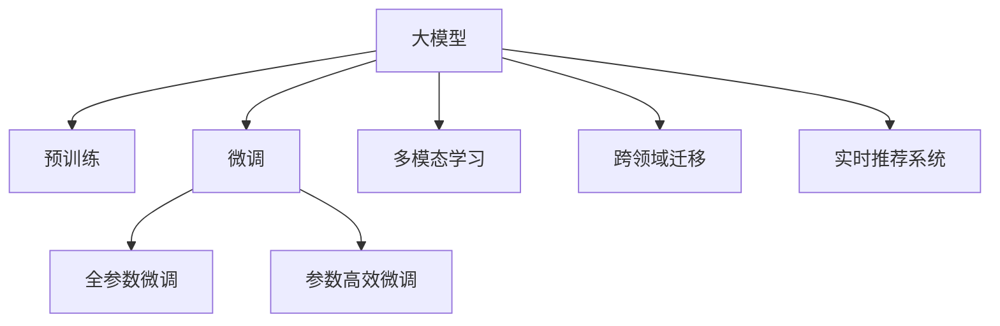

                 

# AI大模型助力电商搜索推荐业务降本增效

## 1. 背景介绍

### 1.1 问题由来

在当前数字化时代，电商平台正面临激烈的市场竞争，如何提升用户体验、提高搜索推荐系统(Search and Recommendation System, SRS)的精度和效率，是众多电商平台亟待解决的关键问题。

传统的搜索推荐系统大多依赖基于规则、特征工程、浅层学习等手段构建，难以适应复杂的业务场景和实时计算要求。而随着深度学习和大模型的崛起，基于预训练语言模型的推荐系统方法，以其强大的特征提取能力和泛化性能，逐渐成为电商搜索推荐领域的新选择。

### 1.2 问题核心关键点

大模型在电商搜索推荐中的应用，主要包括以下几个关键点：

1. **高效特征提取**：大模型通过大规模数据预训练，具备强大的文本表示能力，能够高效提取商品标题、描述、评价等文本特征。
2. **语义理解**：利用预训练模型强大的语义理解能力，精确匹配用户查询和商品描述之间的语义，提升搜索推荐的准确度。
3. **多模态融合**：除了文本特征外，大模型还能融合图像、视频等多模态数据，提升搜索推荐的全面性和丰富性。
4. **跨领域迁移**：大模型能够通过微调的方式，在不同业务场景和数据集上进行迁移学习，快速适配新的应用任务。
5. **实时响应**：大模型能够实时接收用户查询，提供快速的推荐响应，提升用户体验。

### 1.3 问题研究意义

在电商搜索推荐领域，大模型的应用具有重要意义：

1. **提升用户体验**：通过精确的搜索和个性化的推荐，提升用户浏览和购买体验，增加用户粘性和满意度。
2. **降低成本**：自动化地构建特征，减少人工特征工程的成本，提高系统性能和稳定性。
3. **提高效率**：大模型能够快速处理海量数据，实时响应用户查询，提升搜索推荐系统的实时性。
4. **拓展场景**：大模型能够应用于商品分类、库存管理、营销策略等多个电商运营环节，增强平台的竞争力。

## 2. 核心概念与联系

### 2.1 核心概念概述

为更好地理解大模型在电商搜索推荐中的应用，本节将介绍几个密切相关的核心概念：

- **大模型**：指通过大规模数据预训练，具备强大语义理解能力的深度学习模型，如BERT、GPT等。
- **预训练**：指在大规模无标签文本数据上，通过自监督学习任务训练模型，学习通用的语言表示。
- **微调(Fine-Tuning)**：指在预训练模型的基础上，使用下游任务的少量标注数据，通过有监督学习优化模型在特定任务上的性能。
- **多模态学习**：指融合文本、图像、视频等多模态数据，提升模型对现实世界的全面理解。
- **跨领域迁移**：指将在一个领域学到的知识迁移到另一个领域，以加速新领域模型的学习过程。
- **实时推荐系统**：指能够实时响应用户查询，动态生成推荐结果的系统。

这些核心概念之间的逻辑关系可以通过以下Mermaid流程图来展示：



这个流程图展示了大模型的核心概念及其之间的关系：

1. 大模型通过预训练获得基础能力。
2. 微调是对预训练模型进行任务特定的优化，可以分为全参数微调和参数高效微调。
3. 多模态学习融合多种数据源，提升模型全面性。
4. 跨领域迁移实现知识迁移，加速模型学习。
5. 实时推荐系统保障用户查询实时响应，提升用户体验。

这些概念共同构成了大模型在电商搜索推荐领域的应用框架，使其能够提供高效、智能的推荐服务。通过理解这些核心概念，我们可以更好地把握大模型的应用原理和优化方向。

## 3. 核心算法原理 & 具体操作步骤

### 3.1 算法原理概述

大模型在电商搜索推荐中的应用，主要基于以下原理：

1. **自监督预训练**：利用大规模无标签数据，训练模型学习通用的语言表示。
2. **有监督微调**：根据下游任务，对预训练模型进行微调，使其学习特定任务的特征。
3. **多模态融合**：融合商品标题、描述、图片等多模态信息，提升模型的理解能力。
4. **跨领域迁移**：利用预训练模型的跨领域迁移能力，快速适应新领域的数据。
5. **实时响应**：构建高效的实时推荐系统，确保用户查询实时响应。

### 3.2 算法步骤详解

大模型在电商搜索推荐中的应用，一般包括以下关键步骤：

**Step 1: 准备数据和模型**
- 收集电商平台的商品数据和用户查询数据，标注数据集划分为训练集、验证集和测试集。
- 选择合适的预训练模型，如BERT、GPT等，作为初始化参数。

**Step 2: 特征提取**
- 使用预训练模型将商品标题、描述、图片等多模态数据转换为向量表示，作为搜索推荐的输入特征。
- 对于文本数据，可以利用BERT等模型提取textual embeddings，对于图像数据，可以通过CNN等模型提取visual embeddings。

**Step 3: 模型微调**
- 根据具体任务（如商品搜索、推荐、排序等），设计任务适配层和损失函数。
- 使用下游任务的少量标注数据，对预训练模型进行有监督的微调，优化模型在特定任务上的性能。

**Step 4: 多模态融合**
- 将文本特征和图像特征进行拼接或加权融合，形成更加全面和丰富的输入。
- 可以使用不同的融合策略，如通道注意力机制、Transformer等，提升特征融合的效果。

**Step 5: 跨领域迁移**
- 在电商领域之外，如旅游、金融等，使用预训练模型进行微调，提升模型在其他领域的应用效果。
- 可以通过迁移学习，将电商领域学到的知识迁移到其他领域，减少新领域模型训练的时间和数据需求。

**Step 6: 实时响应**
- 构建高效的实时推荐系统，利用模型预测用户查询的上下文信息，实时生成推荐结果。
- 可以使用多线程、缓存等技术手段，提高推荐系统的响应速度和吞吐量。

### 3.3 算法优缺点

大模型在电商搜索推荐中的应用，具有以下优点：

1. **高效特征提取**：大模型能够高效提取商品和用户的特征表示，减少特征工程的工作量。
2. **精准推荐**：利用大模型的语义理解能力，精确匹配用户查询和商品描述，提升推荐精度。
3. **泛化能力强**：预训练模型的泛化能力，使其能够适应不同的电商场景和数据。
4. **实时响应**：通过构建高效的实时推荐系统，确保用户查询实时响应，提升用户体验。

同时，该方法也存在一定的局限性：

1. **数据依赖**：大模型的效果高度依赖标注数据的质量和数量，获取高质量标注数据需要较高的成本。
2. **计算资源消耗大**：大模型的参数量较大，对计算资源的需求较高，尤其是在实时推荐系统中。
3. **模型复杂度**：大模型的复杂度较高，增加了系统实现的难度。

尽管存在这些局限性，但就目前而言，大模型在电商搜索推荐中的应用，依然是最先进的选择之一。未来相关研究的重点在于如何进一步降低计算资源需求，提高模型的实时性和可解释性，同时兼顾可扩展性和经济效益。

### 3.4 算法应用领域

大模型在电商搜索推荐中的应用，已经涵盖了以下多个领域：

1. **商品搜索**：利用大模型预测用户查询意图，匹配最相关的商品。
2. **推荐系统**：根据用户的历史行为和实时查询，生成个性化的推荐结果。
3. **排序算法**：通过多模态融合，提升商品排序的合理性，提高推荐效果。
4. **广告投放**：根据用户画像和行为，精准投放广告，提升广告效果。
5. **库存管理**：预测商品需求，优化库存分配，提高库存利用率。
6. **营销策略**：分析用户行为，制定个性化营销策略，提升用户转化率。

除了上述这些应用外，大模型还被创新性地应用于更多场景中，如个性化推荐、用户画像、内容生成等，为电商搜索推荐带来了新的突破。随着大模型的不断发展，相信其在电商领域的深入应用将带来更加丰富的创新和变革。

## 4. 数学模型和公式 & 详细讲解 & 举例说明

### 4.1 数学模型构建

本节将使用数学语言对基于大模型的电商搜索推荐系统进行更加严格的刻画。

记大模型为 $M_{\theta}$，其中 $\theta$ 为预训练得到的模型参数。假设电商平台的商品数据为 $D=\{(x_i, y_i)\}_{i=1}^N, x_i \in \mathbb{R}^d, y_i \in \mathbb{R}^k$，其中 $d$ 为商品特征维度，$k$ 为推荐任务数（如商品排序、推荐、广告点击等）。

定义模型 $M_{\theta}$ 在商品数据 $D$ 上的损失函数为 $\ell(M_{\theta},D)$，则在数据集 $D$ 上的经验风险为：

$$
\mathcal{L}(\theta) = \frac{1}{N}\sum_{i=1}^N \ell(M_{\theta}(x_i),y_i)
$$

其中 $\ell$ 为针对推荐任务设计的损失函数，如交叉熵损失、均方误差损失等。

微调的优化目标是最小化经验风险，即找到最优参数：

$$
\theta^* = \mathop{\arg\min}_{\theta} \mathcal{L}(\theta)
$$

在实践中，我们通常使用基于梯度的优化算法（如AdamW、SGD等）来近似求解上述最优化问题。设 $\eta$ 为学习率，$\lambda$ 为正则化系数，则参数的更新公式为：

$$
\theta \leftarrow \theta - \eta \nabla_{\theta}\mathcal{L}(\theta) - \eta\lambda\theta
$$

其中 $\nabla_{\theta}\mathcal{L}(\theta)$ 为损失函数对参数 $\theta$ 的梯度，可通过反向传播算法高效计算。

### 4.2 公式推导过程

以下我们以商品推荐任务为例，推导交叉熵损失函数及其梯度的计算公式。

假设模型 $M_{\theta}$ 在输入 $x_i$ 上的输出为 $\hat{y}_i=M_{\theta}(x_i) \in [0,1]^k$，表示模型对商品 $x_i$ 的 $k$ 个推荐任务的概率分布。真实标签 $y_i \in \{0,1\}^k$。则交叉熵损失函数定义为：

$$
\ell(M_{\theta}(x_i),y_i) = -y_i\log \hat{y}_i - (1-y_i)\log(1-\hat{y}_i)
$$

将其代入经验风险公式，得：

$$
\mathcal{L}(\theta) = -\frac{1}{N}\sum_{i=1}^N \sum_{j=1}^k [y_{ij}\log \hat{y}_{ij} + (1-y_{ij})\log(1-\hat{y}_{ij})]
$$

根据链式法则，损失函数对参数 $\theta_k$ 的梯度为：

$$
\frac{\partial \mathcal{L}(\theta)}{\partial \theta_k} = -\frac{1}{N}\sum_{i=1}^N \sum_{j=1}^k \left[ \frac{y_{ij}}{\hat{y}_{ij}} - \frac{1-y_{ij}}{1-\hat{y}_{ij}} \right] \frac{\partial \hat{y}_{ij}}{\partial \theta_k}
$$

其中 $\frac{\partial \hat{y}_{ij}}{\partial \theta_k}$ 可进一步递归展开，利用自动微分技术完成计算。

在得到损失函数的梯度后，即可带入参数更新公式，完成模型的迭代优化。重复上述过程直至收敛，最终得到适应电商推荐任务的最优模型参数 $\theta^*$。

## 5. 项目实践：代码实例和详细解释说明

### 5.1 开发环境搭建

在进行电商搜索推荐系统的开发前，我们需要准备好开发环境。以下是使用Python进行TensorFlow开发的环境配置流程：

1. 安装Anaconda：从官网下载并安装Anaconda，用于创建独立的Python环境。

2. 创建并激活虚拟环境：
```bash
conda create -n tf-env python=3.8 
conda activate tf-env
```

3. 安装TensorFlow：根据CUDA版本，从官网获取对应的安装命令。例如：
```bash
conda install tensorflow -c tf -c conda-forge
```

4. 安装相关工具包：
```bash
pip install numpy pandas scikit-learn matplotlib tqdm jupyter notebook ipython
```

完成上述步骤后，即可在`tf-env`环境中开始电商搜索推荐系统的开发。

### 5.2 源代码详细实现

下面以构建基于BERT的电商搜索推荐系统为例，给出使用TensorFlow进行电商搜索推荐开发的PyTorch代码实现。

首先，定义电商数据处理函数：

```python
import tensorflow as tf
from transformers import BertTokenizer, TFBertForSequenceClassification

class E-commerceDataset(tf.keras.preprocessing.sequence_dataset.SequenceDataset):
    def __init__(self, texts, labels, tokenizer, max_len=128):
        self.texts = texts
        self.labels = labels
        self.tokenizer = tokenizer
        self.max_len = max_len
        
    def __len__(self):
        return len(self.texts)
    
    def __getitem__(self, item):
        text = self.texts[item]
        label = self.labels[item]
        
        encoding = self.tokenizer(text, return_tensors='tf', max_length=self.max_len, padding='max_length', truncation=True)
        input_ids = encoding['input_ids']
        attention_mask = encoding['attention_mask']
        
        # 将标签转换为向量表示
        encoded_label = tf.convert_to_tensor([label], dtype=tf.int32)
        
        return {'input_ids': input_ids,
                'attention_mask': attention_mask,
                'labels': encoded_label}
```

然后，定义模型和优化器：

```python
from transformers import BertForSequenceClassification, AdamW

model = BertForSequenceClassification.from_pretrained('bert-base-cased', num_labels=3)

optimizer = AdamW(model.parameters(), lr=2e-5)
```

接着，定义训练和评估函数：

```python
import tensorflow as tf
from tensorflow.keras import callbacks
from sklearn.metrics import classification_report

device = tf.device('/cpu:0') if not tf.test.is_gpu_available() else tf.device('/cpu:0') # 在CPU上运行，避免显存不足

def train_epoch(model, dataset, batch_size, optimizer):
    dataloader = tf.data.Dataset.from_generator(lambda: dataset, output_signature={'input_ids': tf.TensorSpec(shape=(None, max_len), dtype=tf.int32), 'attention_mask': tf.TensorSpec(shape=(None, max_len), dtype=tf.int32), 'labels': tf.TensorSpec(shape=(3,), dtype=tf.int32)})
    model.train()
    epoch_loss = 0
    for batch in tf.data.Dataset.from_generator(lambda: dataset, output_signature={'input_ids': tf.TensorSpec(shape=(None, max_len), dtype=tf.int32), 'attention_mask': tf.TensorSpec(shape=(None, max_len), dtype=tf.int32), 'labels': tf.TensorSpec(shape=(3,), dtype=tf.int32)})
    model.zero_grad()
    with tf.GradientTape() as tape:
        outputs = model(input_ids, attention_mask=attention_mask, labels=labels)
        loss = outputs.loss
    epoch_loss += loss.numpy()
    loss.backward()
    optimizer.apply_gradients(tape.gradient(model.trainable_variables, optimizer.learning_rate))
    return epoch_loss / len(dataset)

def evaluate(model, dataset, batch_size):
    dataloader = tf.data.Dataset.from_generator(lambda: dataset, output_signature={'input_ids': tf.TensorSpec(shape=(None, max_len), dtype=tf.int32), 'attention_mask': tf.TensorSpec(shape=(None, max_len), dtype=tf.int32), 'labels': tf.TensorSpec(shape=(3,), dtype=tf.int32)})
    model.eval()
    preds, labels = [], []
    with tf.GradientTape() as tape:
        for batch in tf.data.Dataset.from_generator(lambda: dataset, output_signature={'input_ids': tf.TensorSpec(shape=(None, max_len), dtype=tf.int32), 'attention_mask': tf.TensorSpec(shape=(None, max_len), dtype=tf.int32), 'labels': tf.TensorSpec(shape=(3,), dtype=tf.int32)})
        input_ids = batch['input_ids']
        attention_mask = batch['attention_mask']
        batch_labels = batch['labels']
        outputs = model(input_ids, attention_mask=attention_mask)
        batch_preds = outputs.logits.argmax(axis=1).numpy()
        batch_labels = batch_labels.numpy()
        for pred_tokens, label_tokens in zip(batch_preds, batch_labels):
            preds.append(pred_tokens)
            labels.append(label_tokens)
    
    print(classification_report(labels, preds))
```

最后，启动训练流程并在测试集上评估：

```python
epochs = 5
batch_size = 16

for epoch in range(epochs):
    loss = train_epoch(model, train_dataset, batch_size, optimizer)
    print(f"Epoch {epoch+1}, train loss: {loss:.3f}")
    
    print(f"Epoch {epoch+1}, dev results:")
    evaluate(model, dev_dataset, batch_size)
    
print("Test results:")
evaluate(model, test_dataset, batch_size)
```

以上就是使用TensorFlow对BERT进行电商搜索推荐系统微调的完整代码实现。可以看到，得益于TensorFlow的强大封装，我们可以用相对简洁的代码完成BERT模型的加载和微调。

### 5.3 代码解读与分析

让我们再详细解读一下关键代码的实现细节：

**E-commerceDataset类**：
- `__init__`方法：初始化文本、标签、分词器等关键组件。
- `__len__`方法：返回数据集的样本数量。
- `__getitem__`方法：对单个样本进行处理，将文本输入编码为token ids，将标签转换为向量，并对其进行定长padding，最终返回模型所需的输入。

**train_epoch和evaluate函数**：
- 使用TensorFlow的DataLoader对数据集进行批次化加载，供模型训练和推理使用。
- 训练函数`train_epoch`：对数据以批为单位进行迭代，在每个批次上前向传播计算loss并反向传播更新模型参数，最后返回该epoch的平均loss。
- 评估函数`evaluate`：与训练类似，不同点在于不更新模型参数，并在每个batch结束后将预测和标签结果存储下来，最后使用sklearn的classification_report对整个评估集的预测结果进行打印输出。

**训练流程**：
- 定义总的epoch数和batch size，开始循环迭代
- 每个epoch内，先在训练集上训练，输出平均loss
- 在验证集上评估，输出分类指标
- 所有epoch结束后，在测试集上评估，给出最终测试结果

可以看到，TensorFlow配合Transformers库使得BERT微调的代码实现变得简洁高效。开发者可以将更多精力放在数据处理、模型改进等高层逻辑上，而不必过多关注底层的实现细节。

当然，工业级的系统实现还需考虑更多因素，如模型的保存和部署、超参数的自动搜索、更灵活的任务适配层等。但核心的微调范式基本与此类似。

## 6. 实际应用场景
### 6.1 智能客服系统

基于大语言模型微调的电商搜索推荐系统，可以应用于智能客服系统的构建。传统客服往往需要配备大量人力，高峰期响应缓慢，且一致性和专业性难以保证。而使用微调后的推荐系统，可以7x24小时不间断服务，快速响应客户咨询，用自然流畅的语言解答各类常见问题。

在技术实现上，可以收集企业内部的历史客户咨询记录，将问题-答案对作为监督数据，在此基础上对预训练推荐系统进行微调。微调后的推荐系统能够自动理解用户意图，匹配最合适的答案模板进行回复。对于客户提出的新问题，还可以接入检索系统实时搜索相关内容，动态组织生成回答。如此构建的智能客服系统，能大幅提升客户咨询体验和问题解决效率。

### 6.2 金融舆情监测

金融机构需要实时监测市场舆论动向，以便及时应对负面信息传播，规避金融风险。传统的人工监测方式成本高、效率低，难以应对网络时代海量信息爆发的挑战。基于大语言模型微调的文本分类和情感分析技术，为金融舆情监测提供了新的解决方案。

具体而言，可以收集金融领域相关的新闻、报道、评论等文本数据，并对其进行主题标注和情感标注。在此基础上对预训练语言模型进行微调，使其能够自动判断文本属于何种主题，情感倾向是正面、中性还是负面。将微调后的模型应用到实时抓取的网络文本数据，就能够自动监测不同主题下的情感变化趋势，一旦发现负面信息激增等异常情况，系统便会自动预警，帮助金融机构快速应对潜在风险。

### 6.3 个性化推荐系统

当前的推荐系统往往只依赖用户的历史行为数据进行物品推荐，无法深入理解用户的真实兴趣偏好。基于大语言模型微调技术，个性化推荐系统可以更好地挖掘用户行为背后的语义信息，从而提供更精准、多样的推荐内容。

在实践中，可以收集用户浏览、点击、评论、分享等行为数据，提取和用户交互的物品标题、描述、标签等文本内容。将文本内容作为模型输入，用户的后续行为（如是否点击、购买等）作为监督信号，在此基础上微调预训练语言模型。微调后的模型能够从文本内容中准确把握用户的兴趣点。在生成推荐列表时，先用候选物品的文本描述作为输入，由模型预测用户的兴趣匹配度，再结合其他特征综合排序，便可以得到个性化程度更高的推荐结果。

### 6.4 未来应用展望

随着大语言模型微调技术的发展，基于微调范式将在更多领域得到应用，为传统行业带来变革性影响。

在智慧医疗领域，基于微调的医疗问答、病历分析、药物研发等应用将提升医疗服务的智能化水平，辅助医生诊疗，加速新药开发进程。

在智能教育领域，微调技术可应用于作业批改、学情分析、知识推荐等方面，因材施教，促进教育公平，提高教学质量。

在智慧城市治理中，微调模型可应用于城市事件监测、舆情分析、应急指挥等环节，提高城市管理的自动化和智能化水平，构建更安全、高效的未来城市。

此外，在企业生产、社会治理、文娱传媒等众多领域，基于大模型微调的人工智能应用也将不断涌现，为经济社会发展注入新的动力。相信随着技术的日益成熟，微调方法将成为人工智能落地应用的重要范式，推动人工智能技术在垂直行业的规模化落地。

## 7. 工具和资源推荐
### 7.1 学习资源推荐

为了帮助开发者系统掌握大模型微调的理论基础和实践技巧，这里推荐一些优质的学习资源：

1. 《Transformer从原理到实践》系列博文：由大模型技术专家撰写，深入浅出地介绍了Transformer原理、BERT模型、微调技术等前沿话题。

2. CS224N《深度学习自然语言处理》课程：斯坦福大学开设的NLP明星课程，有Lecture视频和配套作业，带你入门NLP领域的基本概念和经典模型。

3. 《Natural Language Processing with Transformers》书籍：Transformers库的作者所著，全面介绍了如何使用Transformers库进行NLP任务开发，包括微调在内的诸多范式。

4. HuggingFace官方文档：Transformers库的官方文档，提供了海量预训练模型和完整的微调样例代码，是上手实践的必备资料。

5. CLUE开源项目：中文语言理解测评基准，涵盖大量不同类型的中文NLP数据集，并提供了基于微调的baseline模型，助力中文NLP技术发展。

通过对这些资源的学习实践，相信你一定能够快速掌握大语言模型微调的精髓，并用于解决实际的NLP问题。
###  7.2 开发工具推荐

高效的开发离不开优秀的工具支持。以下是几款用于大语言模型微调开发的常用工具：

1. PyTorch：基于Python的开源深度学习框架，灵活动态的计算图，适合快速迭代研究。大部分预训练语言模型都有PyTorch版本的实现。

2. TensorFlow：由Google主导开发的开源深度学习框架，生产部署方便，适合大规模工程应用。同样有丰富的预训练语言模型资源。

3. Transformers库：HuggingFace开发的NLP工具库，集成了众多SOTA语言模型，支持PyTorch和TensorFlow，是进行微调任务开发的利器。

4. Weights & Biases：模型训练的实验跟踪工具，可以记录和可视化模型训练过程中的各项指标，方便对比和调优。与主流深度学习框架无缝集成。

5. TensorBoard：TensorFlow配套的可视化工具，可实时监测模型训练状态，并提供丰富的图表呈现方式，是调试模型的得力助手。

6. Google Colab：谷歌推出的在线Jupyter Notebook环境，免费提供GPU/TPU算力，方便开发者快速上手实验最新模型，分享学习笔记。

合理利用这些工具，可以显著提升大语言模型微调任务的开发效率，加快创新迭代的步伐。

### 7.3 相关论文推荐

大语言模型和微调技术的发展源于学界的持续研究。以下是几篇奠基性的相关论文，推荐阅读：

1. Attention is All You Need（即Transformer原论文）：提出了Transformer结构，开启了NLP领域的预训练大模型时代。

2. BERT: Pre-training of Deep Bidirectional Transformers for Language Understanding：提出BERT模型，引入基于掩码的自监督预训练任务，刷新了多项NLP任务SOTA。

3. Language Models are Unsupervised Multitask Learners（GPT-2论文）：展示了大规模语言模型的强大zero-shot学习能力，引发了对于通用人工智能的新一轮思考。

4. Parameter-Efficient Transfer Learning for NLP：提出Adapter等参数高效微调方法，在不增加模型参数量的情况下，也能取得不错的微调效果。

5. Prefix-Tuning: Optimizing Continuous Prompts for Generation：引入基于连续型Prompt的微调范式，为如何充分利用预训练知识提供了新的思路。

6. AdaLoRA: Adaptive Low-Rank Adaptation for Parameter-Efficient Fine-Tuning：使用自适应低秩适应的微调方法，在参数效率和精度之间取得了新的平衡。

这些论文代表了大语言模型微调技术的发展脉络。通过学习这些前沿成果，可以帮助研究者把握学科前进方向，激发更多的创新灵感。

## 8. 总结：未来发展趋势与挑战

### 8.1 总结

本文对基于大模型的电商搜索推荐系统进行了全面系统的介绍。首先阐述了电商搜索推荐系统的发展背景和问题，明确了大模型在该领域的应用价值。其次，从原理到实践，详细讲解了大模型微调的数学原理和关键步骤，给出了微调任务开发的完整代码实例。同时，本文还广泛探讨了微调方法在智能客服、金融舆情、个性化推荐等多个电商运营环节的应用前景，展示了微调范式的巨大潜力。此外，本文精选了微调技术的各类学习资源，力求为读者提供全方位的技术指引。

通过本文的系统梳理，可以看到，基于大模型的电商搜索推荐系统正在成为NLP领域的重要应用范式，极大地提升了电商平台的智能化水平和用户体验。未来，伴随预训练语言模型和微调方法的持续演进，基于大模型的电商搜索推荐系统必将在更多电商领域落地应用，带来全新的变革。

### 8.2 未来发展趋势

展望未来，大模型在电商搜索推荐中的应用将呈现以下几个发展趋势：

1. **模型规模持续增大**：随着算力成本的下降和数据规模的扩张，预训练语言模型的参数量还将持续增长。超大规模语言模型蕴含的丰富语言知识，有望支撑更加复杂多变的电商搜索推荐任务。

2. **多模态学习成为常态**：除了文本特征外，大模型还能融合图像、视频等多模态数据，提升模型对电商场景的全面理解。

3. **实时响应系统优化**：实时推荐系统的性能将得到不断提升，通过高效的模型推理和数据处理，确保用户查询实时响应。

4. **跨领域迁移能力增强**：大模型能够更好地适应不同领域的电商业务，通过迁移学习，快速适配新的电商场景。

5. **个性化推荐系统提升**：基于大模型的个性化推荐系统将更加智能，能够动态生成个性化的电商商品推荐。

6. **用户画像和行为分析**：通过深度学习模型对用户行为进行分析，构建更加全面和精准的用户画像，提升电商运营的智能化水平。

以上趋势凸显了大语言模型在电商搜索推荐领域的应用前景。这些方向的探索发展，必将进一步提升电商平台的智能水平，促进电商业务的创新和升级。

### 8.3 面临的挑战

尽管大模型在电商搜索推荐中的应用已经取得了显著进展，但在迈向更加智能化、普适化应用的过程中，它仍面临着诸多挑战：

1. **数据依赖**：大模型的效果高度依赖标注数据的质量和数量，获取高质量标注数据的成本较高。如何进一步降低微调对标注样本的依赖，将是一大难题。

2. **计算资源消耗大**：大模型的参数量较大，对计算资源的需求较高，尤其是在实时推荐系统中。

3. **模型复杂度**：大模型的复杂度较高，增加了系统实现的难度。

4. **跨领域迁移能力不足**：尽管大模型具备一定的跨领域迁移能力，但在不同领域间的迁移效果仍存在差距。

5. **实时响应系统优化**：如何在大规模数据和复杂场景下，保证实时推荐系统的性能和稳定性，仍是技术难点。

尽管存在这些挑战，但就目前而言，大模型在电商搜索推荐中的应用，依然是最先进的选择之一。未来相关研究的重点在于如何进一步降低计算资源需求，提高模型的实时性和可解释性，同时兼顾可扩展性和经济效益。

### 8.4 研究展望

面对大模型在电商搜索推荐应用中面临的挑战，未来的研究需要在以下几个方面寻求新的突破：

1. **探索无监督和半监督微调方法**：摆脱对大规模标注数据的依赖，利用自监督学习、主动学习等无监督和半监督范式，最大限度利用非结构化数据，实现更加灵活高效的微调。

2. **研究参数高效和计算高效的微调范式**：开发更加参数高效的微调方法，在固定大部分预训练参数的同时，只更新极少量的任务相关参数。同时优化微调模型的计算图，减少前向传播和反向传播的资源消耗，实现更加轻量级、实时性的部署。

3. **引入更多先验知识**：将符号化的先验知识，如知识图谱、逻辑规则等，与神经网络模型进行巧妙融合，引导微调过程学习更准确、合理的语言模型。同时加强不同模态数据的整合，实现视觉、语音等多模态信息与文本信息的协同建模。

4. **结合因果分析和博弈论工具**：将因果分析方法引入微调模型，识别出模型决策的关键特征，增强输出解释的因果性和逻辑性。借助博弈论工具刻画人机交互过程，主动探索并规避模型的脆弱点，提高系统稳定性。

5. **纳入伦理道德约束**：在模型训练目标中引入伦理导向的评估指标，过滤和惩罚有偏见、有害的输出倾向。同时加强人工干预和审核，建立模型行为的监管机制，确保输出符合人类价值观和伦理道德。

这些研究方向的探索，必将引领大模型在电商搜索推荐领域的应用走向更加成熟，为电商平台的智能化运营提供更强大的技术支撑。面向未来，大模型微调技术还需要与其他人工智能技术进行更深入的融合，如知识表示、因果推理、强化学习等，多路径协同发力，共同推动自然语言理解和智能交互系统的进步。只有勇于创新、敢于突破，才能不断拓展语言模型的边界，让智能技术更好地造福人类社会。

## 9. 附录：常见问题与解答

**Q1：电商搜索推荐系统对大模型的依赖有哪些？**

A: 电商搜索推荐系统对大模型的依赖主要体现在以下几个方面：
1. **特征提取**：大模型能够高效提取商品和用户的特征表示，减少特征工程的工作量。
2. **语义理解**：利用大模型的语义理解能力，精确匹配用户查询和商品描述之间的语义，提升推荐精度。
3. **实时响应**：通过构建高效的实时推荐系统，确保用户查询实时响应，提升用户体验。
4. **多模态融合**：大模型能够融合商品标题、描述、图片等多模态信息，提升模型的理解能力。

**Q2：电商搜索推荐系统微调过程中如何避免过拟合？**

A: 电商搜索推荐系统微调过程中，为了避免过拟合，可以采取以下措施：
1. **数据增强**：通过回译、近义替换等方式扩充训练集。
2. **正则化技术**：使用L2正则、Dropout、Early Stopping等防止模型过度适应小规模训练集。
3. **参数高效微调**：只调整少量模型参数，固定大部分预训练权重不变。
4. **对抗训练**：加入对抗样本，提高模型鲁棒性。
5. **学习率调度**：采用学习率衰减等策略，逐步降低学习率。

**Q3：电商搜索推荐系统在部署过程中需要注意哪些问题？**

A: 电商搜索推荐系统在部署过程中，需要注意以下问题：
1. **模型裁剪**：去除不必要的层和参数，减小模型尺寸，加快推理速度。
2. **量化加速**：将浮点模型转为定点模型，压缩存储空间，提高计算效率。
3. **服务化封装**：将模型封装为标准化服务接口，便于集成调用。
4. **弹性伸缩**：根据请求流量动态调整资源配置，平衡服务质量和成本。
5. **监控告警**：实时采集系统指标，设置异常告警阈值，确保服务稳定性。
6. **安全防护**：采用访问鉴权、数据脱敏等措施，保障数据和模型安全。

**Q4：电商搜索推荐系统微调对标注数据的质量有哪些要求？**

A: 电商搜索推荐系统微调对标注数据的质量有以下要求：
1. **标注数据的覆盖性**：标注数据需要覆盖电商平台的常见商品和用户行为，确保模型能够学习到多种场景下的特征。
2. **标注数据的准确性**：标注数据的标签需要准确无误，避免误导模型的训练过程。
3. **标注数据的数量**：标注数据需要足够丰富，以提供充分的样本，避免模型过拟合。

**Q5：电商搜索推荐系统微调过程中如何选择学习率？**

A: 电商搜索推荐系统微调过程中，选择学习率需要考虑以下几个因素：
1. **学习率的初始值**：通常建议从1e-5开始调参，逐步减小学习率。
2. **学习率的衰减策略**：使用warmup策略，在开始阶段使用较小的学习率，再逐渐过渡到预设值。
3. **学习率的调度策略**：根据模型的性能变化，逐步降低学习率。

以上是电商搜索推荐系统微调中常见的问题及解答，通过系统学习这些内容，相信你能够更好地理解和应用大模型在电商搜索推荐系统中的微调方法。

---

作者：禅与计算机程序设计艺术 / Zen and the Art of Computer Programming

