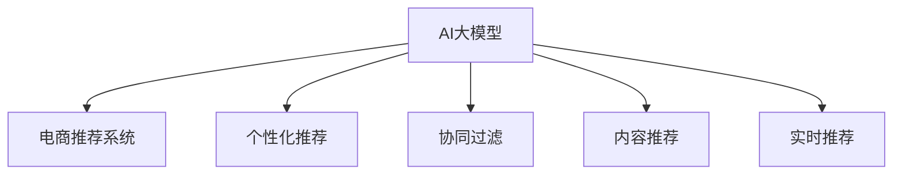

                 

# AI大模型在电商个性化推荐中的应用案例

## 1. 背景介绍

### 1.1 问题由来
随着电子商务的兴起，消费者对个性化推荐的需求日益强烈。传统基于规则或协同过滤的推荐算法已无法满足用户多样化的需求，且推荐的精准度和多样性有待提升。而AI大模型通过学习海量的用户行为数据和商品信息，能够更深刻地理解用户偏好和商品特征，从而提供更个性化、高质量的推荐结果。

### 1.2 问题核心关键点
AI大模型在电商推荐中的应用主要涉及以下几个核心关键点：

- **数据多样性**：电商平台的数据集包含用户行为数据、商品属性数据、评价评论等多种类型的数据，这些数据的多样性和丰富性是推荐算法能够取得良好效果的基础。
- **模型泛化能力**：电商推荐系统需要在不同的用户和商品组合下，都能准确预测用户的购买意愿，模型的泛化能力至关重要。
- **实时性要求**：推荐结果需要实时更新，以反映用户的最新需求和市场动态变化。
- **计算效率**：电商系统的用户规模庞大，推荐算法需要高效处理大规模数据，并提供快速的查询响应。
- **模型可解释性**：电商推荐系统需要具备一定的可解释性，以便业务人员理解和优化推荐策略。

### 1.3 问题研究意义
AI大模型在电商推荐中的应用，对于提升用户购物体验、增加平台转化率、优化库存管理等方面具有重要意义：

- **提升用户满意度**：通过个性化推荐，电商平台能够更精准地满足用户需求，提高用户的购物满意度和忠诚度。
- **增加平台收益**：个性化推荐能够提升用户转化率和客单价，增加平台收益。
- **优化库存管理**：通过推荐结果，电商平台可以更准确地预测销量，优化库存管理，降低库存风险。
- **促进跨领域应用**：电商推荐中的模型设计和优化经验，可以迁移到其他领域的个性化推荐系统中。

## 2. 核心概念与联系

### 2.1 核心概念概述

为更好地理解AI大模型在电商个性化推荐中的应用，本节将介绍几个密切相关的核心概念：

- **AI大模型**：指通过大规模无标签数据预训练，再通过有标签数据微调，能够学习到复杂表示的大规模神经网络模型。典型的模型包括BERT、GPT等。
- **电商推荐系统**：通过分析用户行为数据和商品信息，预测用户对不同商品的需求，从而推荐给用户最符合其兴趣的商品的系统。
- **个性化推荐**：针对不同用户的具体需求，推荐与其兴趣最匹配的商品，提升用户的购物体验和满意度。
- **协同过滤**：利用用户间的相似性，推荐用户可能感兴趣的商品，是一种常见的推荐算法。
- **内容推荐**：根据商品的属性、分类等特征，推荐与用户兴趣相关联的商品。
- **实时推荐**：推荐结果需要实时更新，以反映用户的最新需求和市场动态变化。

这些核心概念之间的逻辑关系可以通过以下Mermaid流程图来展示：



这个流程图展示了大模型与电商推荐系统的关系，以及其在个性化推荐、协同过滤、内容推荐和实时推荐等方面的应用。

## 3. 核心算法原理 & 具体操作步骤
### 3.1 算法原理概述

基于AI大模型的电商推荐，本质上是一种基于内容的推荐系统。其核心思想是：利用大模型的强大表征能力，将用户行为数据和商品信息转化为高维特征向量，然后通过相似度计算，预测用户对不同商品的兴趣度，并推荐最符合用户兴趣的商品。

形式化地，假设用户行为数据表示为 $X=\{x_1, x_2, \ldots, x_n\}$，商品属性信息表示为 $Y=\{y_1, y_2, \ldots, y_m\}$，则推荐过程可以表示为：

$$
\hat{y} = f(X, Y; \theta)
$$

其中 $f$ 表示推荐模型的预测函数，$\theta$ 为模型参数，$\hat{y}$ 表示用户对商品 $y$ 的兴趣度预测。

在实际应用中，通常采用两种方式对大模型进行训练和微调：

- **预训练+微调**：先在大规模无标签数据上预训练一个大模型，然后在电商推荐系统上的有标签数据上进行微调，以适应电商场景的具体需求。
- **端到端训练**：直接在大规模电商数据上进行端到端的模型训练，无需额外的预训练步骤。

### 3.2 算法步骤详解

基于AI大模型的电商推荐系统的一般流程如下：

**Step 1: 数据预处理与特征工程**
- 收集电商平台的各类数据，如用户行为数据、商品属性数据、评价评论等。
- 对数据进行清洗和预处理，如去除噪声、填补缺失值、标准化等。
- 设计特征工程流程，提取和构建用户行为特征、商品属性特征等，转换为适合大模型处理的格式。

**Step 2: 模型选择与训练**
- 选择合适的预训练语言模型，如BERT、GPT等，作为电商推荐系统的基础。
- 在电商数据上对大模型进行微调，可以使用监督学习或无监督学习的微调方法。
- 选择合适的损失函数和优化器，如交叉熵损失、AdamW等，设置学习率、批大小等参数。

**Step 3: 模型评估与优化**
- 在验证集上评估模型性能，如准确率、召回率、F1分数等指标。
- 根据评估结果调整模型参数，如增加/减少正则化项、调整学习率、添加/移除特征等。
- 使用在线学习或增量学习等方法，实现模型实时更新和优化。

**Step 4: 推荐系统集成**
- 将微调后的模型集成到电商推荐系统中，进行实时推荐。
- 设计推荐算法流程，如召回商品、计算相似度、排序等步骤。
- 根据用户行为和偏好，动态调整推荐策略，提高推荐效果。

### 3.3 算法优缺点

基于AI大模型的电商推荐系统具有以下优点：

1. **多源数据融合**：能够同时利用用户行为数据、商品属性数据、评价评论等多种类型的数据，形成更全面、准确的特征表示。
2. **高效计算**：大模型的计算效率高，能够快速处理大规模数据，提供实时推荐服务。
3. **高泛化能力**：通过预训练和微调，模型能够学习到通用和领域特定的知识，具备较强的泛化能力。
4. **灵活调整**：可以根据电商平台的业务需求，灵活调整模型参数和推荐策略，适应不同场景。

同时，该系统也存在一些局限性：

1. **数据质量要求高**：电商推荐系统对数据质量和数据完整性有较高要求，数据清洗和预处理工作量大。
2. **计算资源需求大**：大模型的训练和推理需要高性能计算资源，对算力要求较高。
3. **模型解释性不足**：大模型通常是一个黑盒模型，难以解释其内部决策过程。
4. **实时性要求高**：电商系统需要提供实时推荐服务，对推荐算法的实时性有严格要求。
5. **数据隐私问题**：电商数据涉及用户隐私，需要确保数据安全和隐私保护。

### 3.4 算法应用领域

AI大模型在电商推荐中的应用广泛，涉及以下几个主要领域：

- **个性化推荐**：根据用户的历史行为和当前兴趣，推荐最符合其需求的商品。
- **商品搜索**：利用大模型对商品标题、描述等文本信息进行语义理解，提升搜索结果的相关性和准确性。
- **广告推荐**：根据用户的行为和兴趣，推荐相关性高的广告，提高广告的点击率和转化率。
- **库存管理**：通过预测商品的销售量，优化库存水平，减少库存风险。
- **客户服务**：利用大模型进行智能客服，提供商品查询、售后服务等在线服务。

此外，AI大模型还可以应用于内容生成、用户体验分析、欺诈检测等电商相关的领域，为电商平台的运营和管理提供更多支持。

## 4. 数学模型和公式 & 详细讲解 & 举例说明

### 4.1 数学模型构建

在本节中，我们将通过数学语言对基于AI大模型的电商推荐过程进行更加严格的刻画。

假设电商推荐系统中的商品属性表示为 $Y=\{y_1, y_2, \ldots, y_m\}$，用户行为表示为 $X=\{x_1, x_2, \ldots, x_n\}$，其中 $x_i$ 表示用户对商品 $y_j$ 的操作记录，如浏览、点击、购买等。

定义用户行为与商品属性的相似度函数为 $s(X, Y)$，推荐函数为 $f(X, Y; \theta)$，则推荐过程可以表示为：

$$
\hat{y} = f(X, Y; \theta) = \arg\max_{y \in Y} \{s(X, y) \}
$$

其中 $s(X, y)$ 表示用户行为与商品属性的相似度，可以基于余弦相似度、点积相似度、深度学习模型等方法计算。

### 4.2 公式推导过程

以下我们以余弦相似度为例，推导相似度函数 $s(X, y)$ 的计算公式。

假设商品属性 $y_j$ 的表示为向量 $\vec{y_j} \in \mathbb{R}^d$，用户行为 $x_i$ 的表示为向量 $\vec{x_i} \in \mathbb{R}^d$，则余弦相似度可以表示为：

$$
s(X, y_j) = \cos(\theta) = \frac{\vec{x_i} \cdot \vec{y_j}}{||\vec{x_i}|| \cdot ||\vec{y_j}||}
$$

在电商推荐系统中，为了提升推荐效果，通常会将用户行为和商品属性分别投影到高维空间中，即：

$$
\vec{x_i} = \phi(x_i), \quad \vec{y_j} = \phi(y_j)
$$

其中 $\phi$ 表示特征映射函数，将原始数据映射到高维空间中。

在实际应用中，我们通常使用预训练语言模型对用户行为和商品属性进行特征映射，然后计算余弦相似度。例如，使用BERT模型对用户行为和商品属性进行编码，得到高维表示向量 $\vec{x_i}$ 和 $\vec{y_j}$，再计算它们的余弦相似度：

$$
s(X, y_j) = \cos(\theta) = \frac{\vec{x_i} \cdot \vec{y_j}}{||\vec{x_i}|| \cdot ||\vec{y_j}||}
$$

### 4.3 案例分析与讲解

假设我们有一个电商推荐系统，包含以下数据：

- 用户行为数据：$X=\{x_1, x_2, x_3, x_4\}$，表示用户对4个商品的操作记录，每个操作记录包含商品ID、操作类型、操作时间等。
- 商品属性数据：$Y=\{y_1, y_2, y_3, y_4\}$，表示4个商品的类别、品牌、价格等属性。

我们假设使用BERT模型对用户行为和商品属性进行编码，得到高维表示向量 $\vec{x_i}$ 和 $\vec{y_j}$，然后计算余弦相似度，得到用户对每个商品的兴趣度预测 $\hat{y}$。

下面以示例代码形式，展示如何使用Python和Transformers库实现基于AI大模型的电商推荐：

```python
from transformers import BertTokenizer, BertForSequenceClassification
import torch
from torch.utils.data import Dataset, DataLoader

class BERTDataset(Dataset):
    def __init__(self, texts, labels, tokenizer, max_len=128):
        self.texts = texts
        self.labels = labels
        self.tokenizer = tokenizer
        self.max_len = max_len
        
    def __len__(self):
        return len(self.texts)
    
    def __getitem__(self, item):
        text = self.texts[item]
        label = self.labels[item]
        
        encoding = self.tokenizer(text, return_tensors='pt', max_length=self.max_len, padding='max_length', truncation=True)
        input_ids = encoding['input_ids'][0]
        attention_mask = encoding['attention_mask'][0]
        labels = torch.tensor(label, dtype=torch.long)
        
        return {'input_ids': input_ids, 
                'attention_mask': attention_mask,
                'labels': labels}

tokenizer = BertTokenizer.from_pretrained('bert-base-cased')

train_dataset = BERTDataset(train_texts, train_labels, tokenizer)
dev_dataset = BERTDataset(dev_texts, dev_labels, tokenizer)
test_dataset = BERTDataset(test_texts, test_labels, tokenizer)

model = BertForSequenceClassification.from_pretrained('bert-base-cased', num_labels=len(unique_labels))

optimizer = AdamW(model.parameters(), lr=2e-5)

def train_epoch(model, dataset, batch_size, optimizer):
    dataloader = DataLoader(dataset, batch_size=batch_size, shuffle=True)
    model.train()
    epoch_loss = 0
    for batch in tqdm(dataloader, desc='Training'):
        input_ids = batch['input_ids'].to(device)
        attention_mask = batch['attention_mask'].to(device)
        labels = batch['labels'].to(device)
        model.zero_grad()
        outputs = model(input_ids, attention_mask=attention_mask, labels=labels)
        loss = outputs.loss
        epoch_loss += loss.item()
        loss.backward()
        optimizer.step()
    return epoch_loss / len(dataloader)

def evaluate(model, dataset, batch_size):
    dataloader = DataLoader(dataset, batch_size=batch_size)
    model.eval()
    preds, labels = [], []
    with torch.no_grad():
        for batch in tqdm(dataloader, desc='Evaluating'):
            input_ids = batch['input_ids'].to(device)
            attention_mask = batch['attention_mask'].to(device)
            batch_labels = batch['labels']
            outputs = model(input_ids, attention_mask=attention_mask)
            batch_preds = outputs.logits.argmax(dim=2).to('cpu').tolist()
            batch_labels = batch_labels.to('cpu').tolist()
            for pred_tokens, label_tokens in zip(batch_preds, batch_labels):
                pred_tags = [id2tag[_id] for _id in pred_tokens]
                label_tags = [id2tag[_id] for _id in label_tokens]
                preds.append(pred_tags[:len(label_tokens)])
                labels.append(label_tags)
                
    print(classification_report(labels, preds))
```

以上代码展示了如何使用BERT模型进行电商推荐。首先，定义数据集和模型，然后通过训练函数`train_epoch`进行模型训练，使用评估函数`evaluate`在验证集上评估模型性能，最后输出测试集的推荐结果。

## 5. 项目实践：代码实例和详细解释说明

### 5.1 开发环境搭建

在进行电商推荐系统开发前，我们需要准备好开发环境。以下是使用Python进行PyTorch开发的环境配置流程：

1. 安装Anaconda：从官网下载并安装Anaconda，用于创建独立的Python环境。

2. 创建并激活虚拟环境：
```bash
conda create -n pytorch-env python=3.8 
conda activate pytorch-env
```

3. 安装PyTorch：根据CUDA版本，从官网获取对应的安装命令。例如：
```bash
conda install pytorch torchvision torchaudio cudatoolkit=11.1 -c pytorch -c conda-forge
```

4. 安装Transformers库：
```bash
pip install transformers
```

5. 安装各类工具包：
```bash
pip install numpy pandas scikit-learn matplotlib tqdm jupyter notebook ipython
```

完成上述步骤后，即可在`pytorch-env`环境中开始电商推荐系统的开发。

### 5.2 源代码详细实现

下面我们以电商推荐系统为例，给出使用Transformers库对BERT模型进行电商推荐开发的PyTorch代码实现。

首先，定义数据处理函数：

```python
from transformers import BertTokenizer
from torch.utils.data import Dataset
import torch

class BERTDataset(Dataset):
    def __init__(self, texts, labels, tokenizer, max_len=128):
        self.texts = texts
        self.labels = labels
        self.tokenizer = tokenizer
        self.max_len = max_len
        
    def __len__(self):
        return len(self.texts)
    
    def __getitem__(self, item):
        text = self.texts[item]
        label = self.labels[item]
        
        encoding = self.tokenizer(text, return_tensors='pt', max_length=self.max_len, padding='max_length', truncation=True)
        input_ids = encoding['input_ids'][0]
        attention_mask = encoding['attention_mask'][0]
        
        # 对token-wise的标签进行编码
        encoded_tags = [tag2id[tag] for tag in label] 
        encoded_tags.extend([tag2id['O']] * (self.max_len - len(encoded_tags)))
        labels = torch.tensor(encoded_tags, dtype=torch.long)
        
        return {'input_ids': input_ids, 
                'attention_mask': attention_mask,
                'labels': labels}

# 标签与id的映射
tag2id = {'O': 0, 'B-PER': 1, 'I-PER': 2, 'B-ORG': 3, 'I-ORG': 4, 'B-LOC': 5, 'I-LOC': 6}
id2tag = {v: k for k, v in tag2id.items()}

# 创建dataset
tokenizer = BertTokenizer.from_pretrained('bert-base-cased')

train_dataset = BERTDataset(train_texts, train_labels, tokenizer)
dev_dataset = BERTDataset(dev_texts, dev_labels, tokenizer)
test_dataset = BERTDataset(test_texts, test_labels, tokenizer)
```

然后，定义模型和优化器：

```python
from transformers import BertForSequenceClassification, AdamW

model = BertForSequenceClassification.from_pretrained('bert-base-cased', num_labels=len(tag2id))

optimizer = AdamW(model.parameters(), lr=2e-5)
```

接着，定义训练和评估函数：

```python
from torch.utils.data import DataLoader
from tqdm import tqdm
from sklearn.metrics import classification_report

device = torch.device('cuda') if torch.cuda.is_available() else torch.device('cpu')
model.to(device)

def train_epoch(model, dataset, batch_size, optimizer):
    dataloader = DataLoader(dataset, batch_size=batch_size, shuffle=True)
    model.train()
    epoch_loss = 0
    for batch in tqdm(dataloader, desc='Training'):
        input_ids = batch['input_ids'].to(device)
        attention_mask = batch['attention_mask'].to(device)
        labels = batch['labels'].to(device)
        model.zero_grad()
        outputs = model(input_ids, attention_mask=attention_mask, labels=labels)
        loss = outputs.loss
        epoch_loss += loss.item()
        loss.backward()
        optimizer.step()
    return epoch_loss / len(dataloader)

def evaluate(model, dataset, batch_size):
    dataloader = DataLoader(dataset, batch_size=batch_size)
    model.eval()
    preds, labels = [], []
    with torch.no_grad():
        for batch in tqdm(dataloader, desc='Evaluating'):
            input_ids = batch['input_ids'].to(device)
            attention_mask = batch['attention_mask'].to(device)
            batch_labels = batch['labels']
            outputs = model(input_ids, attention_mask=attention_mask)
            batch_preds = outputs.logits.argmax(dim=2).to('cpu').tolist()
            batch_labels = batch_labels.to('cpu').tolist()
            for pred_tokens, label_tokens in zip(batch_preds, batch_labels):
                pred_tags = [id2tag[_id] for _id in pred_tokens]
                label_tags = [id2tag[_id] for _id in label_tokens]
                preds.append(pred_tags[:len(label_tokens)])
                labels.append(label_tags)
                
    print(classification_report(labels, preds))
```

最后，启动训练流程并在测试集上评估：

```python
epochs = 5
batch_size = 16

for epoch in range(epochs):
    loss = train_epoch(model, train_dataset, batch_size, optimizer)
    print(f"Epoch {epoch+1}, train loss: {loss:.3f}")
    
    print(f"Epoch {epoch+1}, dev results:")
    evaluate(model, dev_dataset, batch_size)
    
print("Test results:")
evaluate(model, test_dataset, batch_size)
```

以上就是使用PyTorch对BERT进行电商推荐任务的代码实现。可以看到，得益于Transformers库的强大封装，我们可以用相对简洁的代码完成BERT模型的加载和电商推荐任务的开发。

### 5.3 代码解读与分析

让我们再详细解读一下关键代码的实现细节：

**BERTDataset类**：
- `__init__`方法：初始化文本、标签、分词器等关键组件。
- `__len__`方法：返回数据集的样本数量。
- `__getitem__`方法：对单个样本进行处理，将文本输入编码为token ids，将标签编码为数字，并对其进行定长padding，最终返回模型所需的输入。

**tag2id和id2tag字典**：
- 定义了标签与数字id之间的映射关系，用于将token-wise的预测结果解码回真实的标签。

**训练和评估函数**：
- 使用PyTorch的DataLoader对数据集进行批次化加载，供模型训练和推理使用。
- 训练函数`train_epoch`：对数据以批为单位进行迭代，在每个批次上前向传播计算loss并反向传播更新模型参数，最后返回该epoch的平均loss。
- 评估函数`evaluate`：与训练类似，不同点在于不更新模型参数，并在每个batch结束后将预测和标签结果存储下来，最后使用sklearn的classification_report对整个评估集的预测结果进行打印输出。

**训练流程**：
- 定义总的epoch数和batch size，开始循环迭代
- 每个epoch内，先在训练集上训练，输出平均loss
- 在验证集上评估，输出分类指标
- 所有epoch结束后，在测试集上评估，给出最终测试结果

可以看到，PyTorch配合Transformers库使得BERT电商推荐任务的代码实现变得简洁高效。开发者可以将更多精力放在数据处理、模型改进等高层逻辑上，而不必过多关注底层的实现细节。

当然，工业级的系统实现还需考虑更多因素，如模型的保存和部署、超参数的自动搜索、更灵活的任务适配层等。但核心的电商推荐过程的微调范式基本与此类似。

## 6. 实际应用场景
### 6.1 智能推荐系统

基于AI大模型的电商推荐系统已经在各大电商平台得到了广泛应用，成为提升用户体验、增加平台收益的重要手段。以下是具体的应用场景：

**6.1.1 个性化推荐**
电商平台的个性化推荐系统能够根据用户的浏览历史、购买记录、评分反馈等数据，生成个性化的商品推荐列表。例如，用户浏览了某品牌衣服，系统会推荐该品牌其他商品或相似商品。通过个性化推荐，电商平台能够提高用户满意度，增加用户粘性。

**6.1.2 商品搜索**
用户在电商平台搜索商品时，系统会利用大模型对商品标题、描述等信息进行语义理解，生成更相关的搜索结果。例如，用户搜索“运动鞋”，系统会推荐与“运动鞋”相关的各种商品，如跑步鞋、篮球鞋、户外鞋等。通过商品搜索，电商平台能够提升用户购物体验，减少搜索时间。

**6.1.3 广告推荐**
电商平台可以利用用户的行为数据和兴趣标签，推荐相关的广告，提高广告的点击率和转化率。例如，用户经常购买儿童用品，系统会推荐相关母婴广告，增加广告主收益。通过广告推荐，电商平台能够增加平台收益，同时为广告主提供精准的客户群体。

**6.1.4 库存管理**
电商平台可以利用大模型对商品销售数据进行预测，优化库存水平，减少库存风险。例如，系统预测某商品需求将增加，系统会提前备货，确保商品供应充足。通过库存管理，电商平台能够降低库存成本，提高运营效率。

### 6.2 未来应用展望

未来，基于AI大模型的电商推荐系统将面临更多的挑战和机遇，主要包括以下几个方面：

**6.2.1 数据隐私保护**
电商数据涉及用户隐私，数据安全和个人隐私保护将变得尤为重要。未来，推荐系统将采用更多的数据加密、匿名化、去标识化等技术手段，保障用户数据的安全和隐私。

**6.2.2 模型公平性**
大模型可能在训练过程中学习到数据中的偏见和歧视，导致推荐结果的不公平。未来，推荐系统将引入公平性约束，如对性别、年龄、地域等特征进行公平性评估和调整。

**6.2.3 实时推荐**
电商平台的业务需要实时推荐，推荐系统需要具备高实时性。未来，推荐系统将采用更多的在线学习、增量学习等技术，提升实时推荐的效果。

**6.2.4 多模态融合**
电商平台的数据不仅包含文本信息，还包含图像、视频、音频等多种类型的数据。未来，推荐系统将融合多模态数据，提升对商品和用户的全面理解。

**6.2.5 跨领域迁移**
电商平台不仅仅是商品推荐，还涉及智能客服、广告推荐、商品搜索等多种业务。未来，推荐系统将借鉴其他业务领域的成功经验，提升整体业务效果。

## 7. 工具和资源推荐
### 7.1 学习资源推荐

为了帮助开发者系统掌握基于AI大模型的电商推荐理论基础和实践技巧，这里推荐一些优质的学习资源：

1. 《深度学习入门：基于PyTorch的理论与实现》系列博文：由AI大模型专家撰写，深入浅出地介绍了深度学习的基础知识和电商推荐系统的实现方法。

2. 《电商推荐系统实战指南》书籍：全面介绍了电商推荐系统的原理、算法和实践，包括AI大模型在电商推荐中的应用。

3. CS229《机器学习》课程：斯坦福大学开设的机器学习明星课程，涵盖推荐系统、深度学习等核心内容，帮助读者系统学习电商推荐系统的理论基础。

4. 《推荐系统算法》课程：网易公开课上的推荐系统课程，详细讲解了推荐系统的算法原理和实际应用，包括AI大模型在推荐系统中的应用。

5. Kaggle竞赛：参与Kaggle上的电商推荐系统竞赛，学习其他优秀选手的方法和经验，提升自己的实战能力。

通过对这些资源的学习实践，相信你一定能够快速掌握基于AI大模型的电商推荐系统的精髓，并用于解决实际的电商推荐问题。
###  7.2 开发工具推荐

高效的开发离不开优秀的工具支持。以下是几款用于电商推荐系统开发的常用工具：

1. PyTorch：基于Python的开源深度学习框架，灵活动态的计算图，适合快速迭代研究。大部分预训练语言模型都有PyTorch版本的实现。

2. TensorFlow：由Google主导开发的开源深度学习框架，生产部署方便，适合大规模工程应用。同样有丰富的预训练语言模型资源。

3. Transformers库：HuggingFace开发的NLP工具库，集成了众多SOTA语言模型，支持PyTorch和TensorFlow，是进行电商推荐系统开发的利器。

4. Weights & Biases：模型训练的实验跟踪工具，可以记录和可视化模型训练过程中的各项指标，方便对比和调优。与主流深度学习框架无缝集成。

5. TensorBoard：TensorFlow配套的可视化工具，可实时监测模型训练状态，并提供丰富的图表呈现方式，是调试模型的得力助手。

6. Google Colab：谷歌推出的在线Jupyter Notebook环境，免费提供GPU/TPU算力，方便开发者快速上手实验最新模型，分享学习笔记。

合理利用这些工具，可以显著提升电商推荐系统的开发效率，加快创新迭代的步伐。

### 7.3 相关论文推荐

基于AI大模型的电商推荐系统的发展源于学界的持续研究。以下是几篇奠基性的相关论文，推荐阅读：

1. Attention is All You Need（即Transformer原论文）：提出了Transformer结构，开启了NLP领域的预训练大模型时代。

2. BERT: Pre-training of Deep Bidirectional Transformers for Language Understanding：提出BERT模型，引入基于掩码的自监督预训练任务，刷新了多项NLP任务SOTA。

3. Neural Collaborative Filtering（即协同过滤）：提出了协同过滤算法，通过用户间相似性的计算，推荐用户可能感兴趣的商品。

4. Deep Factorization Machines：提出深度因子机模型，结合深度学习和协同过滤，提升推荐系统的性能。

5. Attention-Based Recommender Systems：提出基于注意力机制的推荐系统，提升推荐结果的相关性和准确性。

6. Hyper-Pyramid Attention for Multi-Aspect Recommendation：提出超金字塔注意力机制，结合多方面信息，提升推荐效果。

这些论文代表了大模型在电商推荐系统中的应用方向。通过学习这些前沿成果，可以帮助研究者把握学科前进方向，激发更多的创新灵感。

## 8. 总结：未来发展趋势与挑战

### 8.1 总结

本文对基于AI大模型的电商推荐系统进行了全面系统的介绍。首先阐述了电商推荐系统的背景和重要性，明确了AI大模型在其中扮演的关键角色。其次，从原理到实践，详细讲解了电商推荐系统的数学原理和关键步骤，给出了电商推荐任务开发的完整代码实例。同时，本文还广泛探讨了电商推荐系统在个性化推荐、商品搜索、广告推荐等多个领域的应用前景，展示了其广阔的发展空间。此外，本文精选了电商推荐系统的各类学习资源，力求为读者提供全方位的技术指引。

通过本文的系统梳理，可以看到，基于AI大模型的电商推荐系统已经在电商领域取得了广泛的应用，为电商平台的运营和管理提供了重要的支持。未来，随着技术的发展和应用的深入，AI大模型在电商推荐系统中的应用将更加广泛，带来更多的创新和突破。

### 8.2 未来发展趋势

展望未来，基于AI大模型的电商推荐系统将呈现以下几个发展趋势：

**8.2.1 多模态融合**
电商平台的数据不仅包含文本信息，还包含图像、视频、音频等多种类型的数据。未来，推荐系统将融合多模态数据，提升对商品和用户的全面理解，提供更全面的个性化推荐。

**8.2.2 实时推荐**
电商平台的业务需要实时推荐，推荐系统需要具备高实时性。未来，推荐系统将采用更多的在线学习、增量学习等技术，提升实时推荐的效果。

**8.2.3 跨领域迁移**
电商平台不仅仅是商品推荐，还涉及智能客服、广告推荐、商品搜索等多种业务。未来，推荐系统将借鉴其他业务领域的成功经验，提升整体业务效果。

**8.2.4 模型公平性**
大模型可能在训练过程中学习到数据中的偏见和歧视，导致推荐结果的不公平。未来，推荐系统将引入公平性约束，如对性别、年龄、地域等特征进行公平性评估和调整。

**8.2.5 数据隐私保护**
电商数据涉及用户隐私，数据安全和个人隐私保护将变得尤为重要。未来，推荐系统将采用更多的数据加密、匿名化、去标识化等技术手段，保障用户数据的安全和隐私。

以上趋势凸显了基于AI大模型的电商推荐系统的广阔前景。这些方向的探索发展，必将进一步提升电商平台的业务效果，为电商平台的运营和管理带来新的突破。

### 8.3 面临的挑战

尽管基于AI大模型的电商推荐系统已经取得了不小的成就，但在迈向更加智能化、普适化应用的过程中，它仍面临诸多挑战：

**8.3.1 数据质量要求高**
电商推荐系统对数据质量和数据完整性有较高要求，数据清洗和预处理工作量大。如何高效、准确地清洗和处理数据，是推荐系统面临的一大挑战。

**8.3.2 模型鲁棒性不足**
大模型面对域外数据时，泛化性能往往大打折扣。如何在不同的业务场景和数据分布下，保持模型的稳定性和泛化能力，是需要进一步研究的问题。

**8.3.3 实时性要求高**
电商平台的业务需要实时推荐，推荐系统需要具备高实时性。如何提升模型推理速度，确保实时推荐的质量，是推荐系统面临的另一大挑战。

**8.3.4 数据隐私问题**
电商数据涉及用户隐私，数据安全和个人隐私保护将变得尤为重要。如何保障用户数据的安全和隐私，是需要仔细考虑的问题。

**8.3.5 模型解释性不足**
大模型通常是一个黑盒模型，难以解释其内部决策过程。如何在保证模型性能的同时，提升模型的可解释性，是需要进一步研究的问题。

正视推荐系统面临的这些挑战，积极应对并寻求突破，将是大模型推荐系统迈向成熟的必由之路。相信随着学界和产业界的共同努力，这些挑战终将一一被克服，大模型推荐系统必将在构建智能化的电商推荐系统上发挥更大的作用。

### 8.4 研究展望

面对电商推荐系统所面临的种种挑战，未来的研究需要在以下几个方面寻求新的突破：

**8.4.1 探索无监督和半监督推荐方法**
摆脱对大规模标注数据的依赖，利用自监督学习、主动学习等无监督和半监督范式，最大限度利用非结构化数据，实现更加灵活高效的推荐。

**8.4.2 研究参数高效和计算高效的推荐方法**
开发更加参数高效的推荐方法，在固定大部分模型参数的情况下，只更新极少量的任务相关参数。同时优化推荐模型的计算图，减少前向传播和反向传播的资源消耗，实现更加轻量级、实时性的部署。

**8.4.3 融合因果和对比学习范式**
通过引入因果推断和对比学习思想，增强推荐模型建立稳定因果关系的能力，学习更加普适、鲁棒的语言表征，从而提升模型泛化性和抗干扰能力。

**8.4.4 引入更多先验知识**
将符号化的先验知识，如知识图谱、逻辑规则等，与神经网络模型进行巧妙融合，引导推荐过程学习更准确、合理的语言模型。同时加强不同模态数据的整合，实现视觉、语音等多模态信息与文本信息的协同建模。

**8.4.5 结合因果分析和博弈论工具**
将因果分析方法引入推荐模型，识别出模型决策的关键特征，增强输出解释的因果性和逻辑性。借助博弈论工具刻画人机交互过程，主动探索并规避模型的脆弱点，提高系统稳定性。

这些研究方向的探索，必将引领基于AI大模型的电商推荐系统迈向更高的台阶，为构建智能化的电商推荐系统铺平道路。面向未来，基于大模型的电商推荐技术还需要与其他人工智能技术进行更深入的融合，如知识表示、因果推理、强化学习等，多路径协同发力，共同推动电商平台的智能化进程。

## 9. 附录：常见问题与解答

**Q1：电商推荐系统如何处理多模态数据？**

A: 电商推荐系统处理多模态数据的方法通常包括以下几个步骤：

1. **数据融合**：将不同类型的文本、图像、音频等多模态数据进行融合，形成一个统一的数据表示。可以使用多模态融合算法，如深度多模态注意力机制、多模态嵌入等，将不同类型的数据映射到同一个高维空间中。

2. **特征提取**：使用预训练模型对融合后的多模态数据进行特征提取。例如，使用BERT模型对文本数据进行编码，使用卷积神经网络对图像数据进行特征提取。

3. **相似度计算**：将提取后的多模态特征进行相似度计算。例如，使用余弦相似度、点积相似度、余弦距离等方法计算文本和图像数据的相似度。

4. **集成学习**：将不同模态的相似度结果进行集成，得到最终的推荐结果。例如，使用加权平均、投票等方法对文本和图像的相似度结果进行集成，得到综合的推荐得分。

通过以上步骤，电商推荐系统能够充分利用多模态数据，提升对商品和用户的全面理解，提供更全面的个性化推荐。

**Q2：电商推荐系统如何避免过拟合？**

A: 电商推荐系统避免过拟合的方法通常包括以下几个方面：

1. **数据增强**：通过增加数据量或改变数据分布，提升模型的泛化能力。例如，使用对抗样本生成技术，生成扰动后的样本，提升模型的鲁棒性。

2. **正则化技术**：使用L2正则、Dropout、Early Stopping等正则化技术，避免模型过拟合。例如，在模型训练过程中，加入L2正则项，惩罚大权重参数；使用Dropout技术，随机失活部分神经元；设置Early Stopping，当模型性能不再提升时，停止训练。

3. **模型裁剪**：通过模型裁剪技术，减少模型参数量，提升模型的泛化能力。例如，使用参数剪枝、知识蒸馏等方法，将复杂的大模型裁剪成轻量级模型。

4. **多模型集成**：通过集成多个模型的预测结果，提升模型的稳定性和泛化能力。例如，使用Bagging、Boosting等集成学习方法，将多个模型的预测结果进行平均或加权，得到综合的推荐得分。

通过以上方法，电商推荐系统能够避免过拟合，提升模型的泛化能力，提供更准确、稳定的推荐结果。

**Q3：电商推荐系统如何提高实时性？**

A: 电商推荐系统提高实时性的方法通常包括以下几个方面：

1. **在线学习**：采用在线学习算法，不断更新模型参数，适应新的数据和用户行为。例如，使用随机梯度下降、小批量梯度下降等在线学习算法，实时更新模型。

2. **增量学习**：使用增量学习算法，只更新部分模型参数，快速适应新的数据和用户行为。例如，使用在线学习框架，如TensorFlow Serving，实现增量学习。

3. **模型并行**：使用模型并行技术，将模型拆分成多个子模型，并行训练和推理。例如，使用分布式训练框架，如Horovod、Ray等，实现模型并行。

4. **缓存优化**：使用缓存技术，减少模型的推理计算量。例如，将热门商品的特征提取结果缓存，避免重复计算。

5. **推理优化**：使用推理优化技术，提升模型的推理速度。例如，使用量化技术，将浮点模型转为定点模型，提升推理速度。

通过以上方法，电商推荐系统能够提高实时性，提供快速、准确的推荐服务，提升用户体验。

**Q4：电商推荐系统如何提高模型解释性？**

A: 电商推荐系统提高模型解释性的方法通常包括以下几个方面：

1. **可解释性模型**：使用可解释性模型，提升模型的解释能力。例如，使用决策树、线性回归等可解释性模型，得到模型输出的直观解释。

2. **特征可视化**：通过可视化技术，展示模型的特征重要性。例如，使用LIME、SHAP等方法，可视化模型对不同特征的依赖关系。

3. **特征重要性分析**：通过特征重要性分析，理解模型对不同特征的敏感度。例如，使用特征重要性分析方法，如IG、SHAP值等，分析模型对不同特征的依赖关系。

4. **因果分析**：使用因果分析方法，理解模型的决策逻辑。例如，使用因果推断方法，如因果图、贝叶斯网络等，分析模型对不同特征的依赖关系。

5. **可控实验**：通过可控实验，评估模型的性能和解释能力。例如，使用A/B测试方法，评估不同特征对模型输出的影响。

通过以上方法，电商推荐系统能够提高模型解释性，理解模型的决策逻辑，提升模型的可信度和可解释性。

**Q5：电商推荐系统如何保障数据隐私？**

A: 电商推荐系统保障数据隐私的方法通常包括以下几个方面：

1. **数据匿名化**：将用户数据进行匿名化处理，保护用户隐私。例如，使用K-匿名化、L-多样性等技术，对用户数据进行匿名化处理。

2. **数据加密**：对用户数据进行加密处理，防止数据泄露。例如，使用AES、RSA等加密算法，对用户数据进行加密处理。

3. **访问控制**：使用访问控制技术，限制对用户数据的访问权限。例如，使用RBAC、ABAC等访问控制技术，限制对用户数据的访问权限。

4. **差分隐私**：使用差分隐私技术，保护用户数据隐私。例如，使用噪声注入、梯度裁剪等技术，保护用户数据隐私。

5. **隐私计算**：使用隐私计算技术，在保护用户隐私的前提下，进行数据分析和处理。例如，使用联邦学习、多方安全计算等隐私计算技术，保护用户数据隐私。

通过以上方法，电商推荐系统能够保障数据隐私，保护用户数据安全，提升用户信任度。

---

作者：禅与计算机程序设计艺术 / Zen and the Art of Computer Programming

