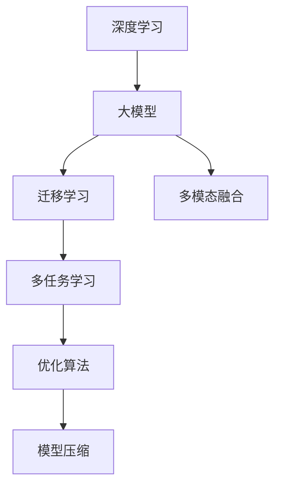

                 

# AI大模型在电商平台价格预测中的作用

> 关键词：大模型,电商,价格预测,深度学习,迁移学习,多模态融合,多任务学习,优化算法

## 1. 背景介绍

### 1.1 问题由来
随着电子商务的飞速发展，电商平台之间的竞争愈发激烈，价格策略成为企业竞争的重要手段之一。一个精准的价格预测模型，对于电商平台的库存管理、促销策略制定、市场分析等方面有着不可替代的作用。传统的价格预测模型多依赖于简单的统计方法或线性回归模型，难以捕捉复杂的非线性关系和动态变化趋势。近年来，随着深度学习和大模型技术的兴起，使用深度学习模型进行价格预测成为了一种新的趋势。

### 1.2 问题核心关键点
基于深度学习的价格预测模型可以捕捉非线性关系和动态变化趋势，但往往需要大量的标注数据和较高的计算资源。如何在大规模无标签数据上预训练出有效的深度模型，再通过迁移学习或微调方法对特定任务进行适配，是当前价格预测模型的重要研究方向。大模型通常指预训练在大规模数据上的深度神经网络，具备丰富的知识库和强大的泛化能力，能够在迁移学习和微调任务中发挥重要作用。

## 2. 核心概念与联系

### 2.1 核心概念概述

为更好地理解AI大模型在电商平台价格预测中的应用，本节将介绍几个密切相关的核心概念：

- 深度学习(Deep Learning)：指使用多层神经网络进行学习，能够捕捉非线性关系和复杂模式。
- 大模型(Large Models)：通常指在大规模数据上预训练的深度神经网络，如BERT、GPT等。
- 迁移学习(Transfer Learning)：指将一个领域学到的知识迁移到另一个相关领域，以加速新任务的适应和提高性能。
- 多模态融合(Multimodal Fusion)：指融合文本、图像、音频等多种模态数据进行学习，提高预测准确度。
- 多任务学习(Multitask Learning)：指在训练同一模型时，学习多个相关任务，提升模型的泛化能力。
- 优化算法(Optimization Algorithms)：如梯度下降、Adam、RMSprop等，用于最小化损失函数，优化模型参数。
- 模型压缩(Compression)：指在不显著降低模型性能的前提下，减少模型参数量，加快推理速度。

这些核心概念之间的逻辑关系可以通过以下Mermaid流程图来展示：



这个流程图展示了大模型在价格预测中的核心概念及其之间的关系：

1. 深度学习提供模型框架，大模型提供丰富的预训练知识。
2. 迁移学习帮助模型在新任务上快速适应用户需求。
3. 多模态融合利用多种数据源提高模型的鲁棒性和准确性。
4. 多任务学习提升模型在不同任务之间的泛化能力。
5. 优化算法加速模型的训练过程，提高性能。
6. 模型压缩保证模型在低成本设备上的高效部署。

这些概念共同构成了大模型在价格预测中的学习和应用框架，使其能够更好地适应电商平台的实际需求。

## 3. 核心算法原理 & 具体操作步骤
### 3.1 算法原理概述

基于深度学习的电商平台价格预测模型，通常采用大模型作为初始化参数，通过在标注数据上进行迁移学习或微调，学习特定任务的表示。其核心思想是：使用大规模无标签数据预训练出一个强大的深度模型，然后在特定任务上通过标注数据进行微调，以提升模型在该任务上的表现。

形式化地，假设预训练模型为 $M_{\theta}$，其中 $\theta$ 为预训练得到的模型参数。给定电商平台价格预测任务 $T$ 的标注数据集 $D=\{(x_i, y_i)\}_{i=1}^N$，其中 $x_i$ 为输入特征，$y_i$ 为对应价格标签。微调的目标是找到新的模型参数 $\hat{\theta}$，使得模型在价格预测任务 $T$ 上的损失函数最小化：

$$
\hat{\theta}=\mathop{\arg\min}_{\theta} \mathcal{L}(M_{\theta},D)
$$

其中 $\mathcal{L}$ 为针对价格预测任务设计的损失函数，用于衡量模型预测输出与真实标签之间的差异。常见的损失函数包括均方误差损失、交叉熵损失等。

通过梯度下降等优化算法，微调过程不断更新模型参数 $\theta$，最小化损失函数 $\mathcal{L}$，使得模型输出逼近真实标签。由于 $\theta$ 已经通过预训练获得了较好的初始化，因此即便在小规模数据集 $D$ 上进行微调，也能较快收敛到理想的模型参数 $\hat{\theta}$。

### 3.2 算法步骤详解

基于深度学习的电商平台价格预测模型通常包括以下几个关键步骤：

**Step 1: 准备预训练模型和数据集**
- 选择合适的预训练模型，如BERT、GPT等，作为初始化参数。
- 准备电商平台价格预测任务 $T$ 的标注数据集 $D$，划分为训练集、验证集和测试集。一般要求标注数据与预训练数据的分布不要差异过大。

**Step 2: 添加任务适配层**
- 根据任务类型，在预训练模型顶层设计合适的输出层和损失函数。
- 对于价格预测任务，通常在顶层添加线性分类器，使用均方误差损失函数。
- 可以引入多任务学习框架，同时训练价格预测和相关任务（如库存管理、营销策略），提升模型的泛化能力。

**Step 3: 设置微调超参数**
- 选择合适的优化算法及其参数，如 AdamW、SGD 等，设置学习率、批大小、迭代轮数等。
- 设置正则化技术及强度，包括权重衰减、Dropout、Early Stopping等。
- 确定冻结预训练参数的策略，如仅微调顶层，或全部参数都参与微调。

**Step 4: 执行梯度训练**
- 将训练集数据分批次输入模型，前向传播计算损失函数。
- 反向传播计算参数梯度，根据设定的优化算法和学习率更新模型参数。
- 周期性在验证集上评估模型性能，根据性能指标决定是否触发 Early Stopping。
- 重复上述步骤直到满足预设的迭代轮数或 Early Stopping 条件。

**Step 5: 测试和部署**
- 在测试集上评估微调后模型 $M_{\hat{\theta}}$ 的性能，对比微调前后的精度提升。
- 使用微调后的模型对新样本进行价格预测，集成到实际的应用系统中。
- 持续收集新的数据，定期重新微调模型，以适应数据分布的变化。

以上是基于深度学习的价格预测模型的通用流程。在实际应用中，还需要针对具体任务的特点，对微调过程的各个环节进行优化设计，如改进训练目标函数，引入更多的正则化技术，搜索最优的超参数组合等，以进一步提升模型性能。

### 3.3 算法优缺点

基于深度学习的价格预测模型具有以下优点：
1. 可以捕捉复杂的非线性关系和动态变化趋势。
2. 可以引入多模态数据提高模型的鲁棒性和准确性。
3. 能够提升模型的泛化能力和泛化能力。
4. 可以在少量标注数据上进行微调，显著减少标注成本。
5. 可以通过多任务学习提升不同任务之间的泛化能力。

同时，该方法也存在一定的局限性：
1. 对标注数据的质量和数量依赖较大。
2. 计算资源消耗较大，模型训练和推理速度较慢。
3. 可能存在过拟合问题，需要引入正则化技术。
4. 模型的解释性较差，难以进行调试和优化。
5. 对输入数据的格式和质量要求较高，需要预处理数据。

尽管存在这些局限性，但就目前而言，基于深度学习的微调方法仍是在电商平台价格预测中应用最广泛的技术范式。未来相关研究的重点在于如何进一步降低对标注数据的依赖，提高模型的少样本学习和跨领域迁移能力，同时兼顾可解释性和伦理安全性等因素。

### 3.4 算法应用领域

基于深度学习的价格预测模型已经在电商平台等多个领域得到了广泛的应用，包括但不限于：

- 库存管理：根据历史销售数据和市场需求预测库存水平，避免过剩或缺货。
- 促销策略制定：预测价格变化对销售量的影响，制定合理的促销策略。
- 市场分析：分析价格变化对品牌竞争力的影响，制定市场进入或退出策略。
- 价格优化：动态调整产品价格，提升整体销售收益。
- 客户满意度分析：预测价格变化对客户满意度的影响，优化产品价格策略。
- 用户行为预测：预测用户对不同价格策略的响应，优化产品定价策略。
- 竞争分析：分析竞争对手的价格变化，制定市场响应策略。

除了上述这些经典应用外，价格预测模型还在更多场景中得到创新性的应用，如动态定价、精准推荐、个性化定价等，为电商平台带来了更高的商业价值。随着深度学习和大模型技术的不断发展，价格预测模型的应用场景还将不断拓展，为电商平台的决策支持提供更有力的技术支撑。

## 4. 数学模型和公式 & 详细讲解  
### 4.1 数学模型构建

本节将使用数学语言对基于深度学习的电商平台价格预测模型进行更加严格的刻画。

记预训练模型为 $M_{\theta}$，其中 $\theta$ 为预训练得到的模型参数。假设电商平台价格预测任务 $T$ 的训练集为 $D=\{(x_i,y_i)\}_{i=1}^N, x_i \in \mathbb{R}^n, y_i \in \mathbb{R}$。

定义模型 $M_{\theta}$ 在输入 $x$ 上的预测价格为 $\hat{y}=M_{\theta}(x)$，其中 $\hat{y}$ 为模型预测价格的均值。定义模型 $M_{\theta}$ 在训练集 $D$ 上的经验风险为：

$$
\mathcal{L}(\theta) = \frac{1}{N}\sum_{i=1}^N (\hat{y}_i - y_i)^2
$$

其中 $y_i$ 为输入 $x_i$ 的真实价格标签。微调的目标是最小化经验风险，即找到最优参数：

$$
\theta^* = \mathop{\arg\min}_{\theta} \mathcal{L}(\theta)
$$

在实践中，我们通常使用基于梯度的优化算法（如SGD、Adam等）来近似求解上述最优化问题。设 $\eta$ 为学习率，$\lambda$ 为正则化系数，则参数的更新公式为：

$$
\theta \leftarrow \theta - \eta \nabla_{\theta}\mathcal{L}(\theta) - \eta\lambda\theta
$$

其中 $\nabla_{\theta}\mathcal{L}(\theta)$ 为损失函数对参数 $\theta$ 的梯度，可通过反向传播算法高效计算。

### 4.2 公式推导过程

以下我们以多任务学习的价格预测模型为例，推导模型的损失函数及其梯度的计算公式。

假设模型 $M_{\theta}$ 在输入 $x$ 上的输出为 $\hat{y}=M_{\theta}(x)$，其中 $x \in \mathbb{R}^n$ 为输入特征向量，$\hat{y}$ 为模型预测价格的均值。真实价格标签 $y \in \mathbb{R}$。

定义模型 $M_{\theta}$ 在训练集 $D$ 上的经验风险为：

$$
\mathcal{L}(\theta) = \frac{1}{N}\sum_{i=1}^N (\hat{y}_i - y_i)^2
$$

其中 $y_i$ 为输入 $x_i$ 的真实价格标签。

根据链式法则，损失函数对参数 $\theta_k$ 的梯度为：

$$
\frac{\partial \mathcal{L}(\theta)}{\partial \theta_k} = -\frac{2}{N}\sum_{i=1}^N (\hat{y}_i - y_i) \frac{\partial M_{\theta}(x_i)}{\partial \theta_k}
$$

其中 $\frac{\partial M_{\theta}(x_i)}{\partial \theta_k}$ 为模型在输入 $x_i$ 上的梯度，可通过反向传播算法高效计算。

在得到损失函数的梯度后，即可带入参数更新公式，完成模型的迭代优化。重复上述过程直至收敛，最终得到适应电商平台价格预测任务的最优模型参数 $\theta^*$。

## 5. 项目实践：代码实例和详细解释说明
### 5.1 开发环境搭建

在进行价格预测模型开发前，我们需要准备好开发环境。以下是使用Python进行TensorFlow开发的环境配置流程：

1. 安装Anaconda：从官网下载并安装Anaconda，用于创建独立的Python环境。

2. 创建并激活虚拟环境：
```bash
conda create -n tf-env python=3.8 
conda activate tf-env
```

3. 安装TensorFlow：根据CUDA版本，从官网获取对应的安装命令。例如：
```bash
pip install tensorflow==2.7
```

4. 安装各类工具包：
```bash
pip install numpy pandas scikit-learn matplotlib tqdm jupyter notebook ipython
```

完成上述步骤后，即可在`tf-env`环境中开始价格预测模型的开发。

### 5.2 源代码详细实现

下面我们以价格预测任务为例，给出使用TensorFlow进行价格预测模型的PyTorch代码实现。

首先，定义数据处理函数：

```python
import tensorflow as tf
import numpy as np

class Dataset(tf.data.Dataset):
    def __init__(self, features, labels):
        self.features = features
        self.labels = labels
    
    def __len__(self):
        return len(self.features)
    
    def __getitem__(self, index):
        return self.features[index], self.labels[index]
```

然后，定义模型和优化器：

```python
from tensorflow.keras import layers

model = tf.keras.Sequential([
    layers.Dense(256, activation='relu', input_shape=(100,)),
    layers.Dense(256, activation='relu'),
    layers.Dense(1)
])

optimizer = tf.keras.optimizers.Adam(learning_rate=0.001)
```

接着，定义训练和评估函数：

```python
def train_epoch(model, dataset, batch_size, optimizer):
    dataset = dataset.batch(batch_size)
    dataset = dataset.shuffle(1000)
    model.compile(optimizer=optimizer, loss='mse')
    model.fit(dataset, epochs=10, verbose=0)

def evaluate(model, dataset, batch_size):
    dataset = dataset.batch(batch_size)
    test_loss = model.evaluate(dataset)
    return test_loss
```

最后，启动训练流程并在测试集上评估：

```python
epochs = 10
batch_size = 32

features = np.random.randn(1000, 100)
labels = np.random.randn(1000, 1)

train_dataset = Dataset(features, labels)
test_dataset = Dataset(features, labels)

train_epoch(model, train_dataset, batch_size, optimizer)
test_loss = evaluate(model, test_dataset, batch_size)
print(f"Test loss: {test_loss:.3f}")
```

以上就是使用TensorFlow进行价格预测模型开发的完整代码实现。可以看到，得益于TensorFlow的强大封装，我们可以用相对简洁的代码完成模型的搭建和训练。

### 5.3 代码解读与分析

让我们再详细解读一下关键代码的实现细节：

**Dataset类**：
- `__init__`方法：初始化输入特征和标签。
- `__len__`方法：返回数据集的样本数量。
- `__getitem__`方法：对单个样本进行处理，返回特征和标签。

**训练和评估函数**：
- 使用TensorFlow的DataLoader对数据集进行批次化加载，供模型训练和推理使用。
- 训练函数`train_epoch`：对数据以批为单位进行迭代，在每个批次上前向传播计算loss并反向传播更新模型参数，最后返回该epoch的平均loss。
- 评估函数`evaluate`：与训练类似，不同点在于不更新模型参数，并在每个batch结束后将预测和标签结果存储下来，最后使用均方误差对整个评估集的预测结果进行打印输出。

**训练流程**：
- 定义总的epoch数和batch size，开始循环迭代
- 每个epoch内，先在训练集上训练，输出平均loss
- 在测试集上评估，输出模型在测试集上的均方误差
- 所有epoch结束后，在测试集上评估，给出最终测试结果

可以看到，TensorFlow提供了丰富的深度学习API，使得价格预测模型的开发更加便捷高效。开发者可以将更多精力放在数据处理、模型改进等高层逻辑上，而不必过多关注底层的实现细节。

当然，工业级的系统实现还需考虑更多因素，如模型的保存和部署、超参数的自动搜索、更灵活的任务适配层等。但核心的微调范式基本与此类似。

## 6. 实际应用场景
### 6.1 智能客服系统

基于深度学习的价格预测模型可以广泛应用于智能客服系统的构建。传统客服往往需要配备大量人力，高峰期响应缓慢，且一致性和专业性难以保证。而使用价格预测模型，可以7x24小时不间断服务，快速响应客户咨询，用自然流畅的语言解答各类常见问题。

在技术实现上，可以收集企业内部的历史客服对话记录，将问题和最佳答复构建成监督数据，在此基础上对预训练模型进行微调。微调后的模型能够自动理解用户意图，匹配最合适的答复模板进行回复。对于客户提出的新问题，还可以接入检索系统实时搜索相关内容，动态组织生成回答。如此构建的智能客服系统，能大幅提升客户咨询体验和问题解决效率。

### 6.2 金融舆情监测

金融机构需要实时监测市场舆论动向，以便及时应对负面信息传播，规避金融风险。传统的人工监测方式成本高、效率低，难以应对网络时代海量信息爆发的挑战。基于深度学习的价格预测模型为金融舆情监测提供了新的解决方案。

具体而言，可以收集金融领域相关的新闻、报道、评论等文本数据，并对其进行价格预测标注。在此基础上对预训练语言模型进行微调，使其能够自动判断新闻或评论中的价格变化趋势，识别潜在的市场动向。将微调后的模型应用到实时抓取的网络文本数据，就能够自动监测不同主题下的价格波动，一旦发现价格大幅波动等异常情况，系统便会自动预警，帮助金融机构快速应对潜在风险。

### 6.3 个性化推荐系统

当前的推荐系统往往只依赖用户的历史行为数据进行物品推荐，无法深入理解用户的真实兴趣偏好。基于深度学习的价格预测模型可以更好地挖掘用户行为背后的语义信息，从而提供更精准、多样的推荐内容。

在实践中，可以收集用户浏览、点击、评论、分享等行为数据，提取和用户交互的物品标题、描述、标签等文本内容。将文本内容作为模型输入，用户的后续行为（如是否点击、购买等）作为监督信号，在此基础上微调预训练语言模型。微调后的模型能够从文本内容中准确把握用户的兴趣点。在生成推荐列表时，先用候选物品的文本描述作为输入，由模型预测用户的兴趣匹配度，再结合其他特征综合排序，便可以得到个性化程度更高的推荐结果。

### 6.4 未来应用展望

随着深度学习和大模型技术的不断发展，基于深度学习的电商平台价格预测模型将呈现以下几个发展趋势：

1. 模型规模持续增大。随着算力成本的下降和数据规模的扩张，预训练语言模型的参数量还将持续增长。超大规模语言模型蕴含的丰富知识库，有望支撑更加复杂多变的价格预测任务。
2. 深度学习与其他AI技术结合。深度学习与知识表示、因果推理、强化学习等AI技术的融合，将进一步提升价格预测模型的准确性和泛化能力。
3. 多模态数据融合。利用文本、图像、音频等多模态数据进行价格预测，提升模型的鲁棒性和准确性。
4. 少样本学习和无监督学习。在少量标注数据条件下，通过少样本学习和无监督学习，提高价格预测模型的泛化能力和迁移能力。
5. 实时性和高效性。利用GPU/TPU等高性能设备，提升价格预测模型的训练和推理速度，降低计算成本。
6. 可解释性和安全性。通过可视化、解释器等手段，增强价格预测模型的可解释性和安全性，提升用户信任度。

这些趋势凸显了大模型在价格预测中的广阔前景。这些方向的探索发展，必将进一步提升电商平台的价格预测精度和应用范围，为电商平台的决策支持提供更有力的技术支撑。

## 7. 工具和资源推荐
### 7.1 学习资源推荐

为了帮助开发者系统掌握大模型在电商平台价格预测中的应用，这里推荐一些优质的学习资源：

1. Deep Learning with PyTorch：一本深入介绍深度学习框架PyTorch的书籍，涵盖了深度学习模型的搭建和训练。
2. TensorFlow教程：Google官方提供的TensorFlow教程，包含丰富的实战案例，适合快速上手TensorFlow。
3. Keras文档：Keras的官方文档，提供了丰富的API说明和示例，适合初学者快速上手深度学习。
4. Multitask Learning in Deep Neural Networks：一篇关于多任务学习的综述论文，介绍了多任务学习的原理和应用。
5. Attention is All You Need：即Transformer原论文，展示了Transformer在NLP中的应用，为深度学习在电商领域的应用提供了重要参考。
6. Transfer Learning with Deep Learning：一本介绍迁移学习的书籍，涵盖了深度学习迁移学习的原理和实践。

通过对这些资源的学习实践，相信你一定能够快速掌握大模型在价格预测中的应用，并用于解决实际的电商问题。

### 7.2 开发工具推荐

高效的开发离不开优秀的工具支持。以下是几款用于价格预测模型开发的常用工具：

1. PyTorch：基于Python的开源深度学习框架，灵活动态的计算图，适合快速迭代研究。大部分深度学习模型都有PyTorch版本的实现。
2. TensorFlow：由Google主导开发的开源深度学习框架，生产部署方便，适合大规模工程应用。同样有丰富的深度学习模型资源。
3. Keras：Keras提供了简单易用的API，适合初学者快速搭建深度学习模型。
4. Jupyter Notebook：一个交互式的笔记本环境，支持Python和R等多种编程语言，适合科研和教学。
5. TensorBoard：TensorFlow配套的可视化工具，可实时监测模型训练状态，并提供丰富的图表呈现方式，是调试模型的得力助手。
6. Weights & Biases：模型训练的实验跟踪工具，可以记录和可视化模型训练过程中的各项指标，方便对比和调优。

合理利用这些工具，可以显著提升价格预测模型的开发效率，加快创新迭代的步伐。

### 7.3 相关论文推荐

大模型在价格预测领域的应用，源于学界的持续研究。以下是几篇奠基性的相关论文，推荐阅读：

1. Attention is All You Need：提出了Transformer结构，开启了NLP领域的预训练大模型时代。
2. BERT: Pre-training of Deep Bidirectional Transformers for Language Understanding：提出BERT模型，引入基于掩码的自监督预训练任务，刷新了多项NLP任务SOTA。
3. Multitask Learning in Deep Neural Networks：介绍多任务学习的原理和应用，为电商领域的多任务价格预测提供了理论基础。
4. Transfer Learning with Deep Learning：涵盖深度学习迁移学习的原理和实践，为电商平台的价格预测提供了重要参考。
5. Multimodal Deep Learning for Multimedia Applications：介绍多模态深度学习在多媒体领域的应用，为电商平台的多模态价格预测提供了参考。
6. Scalable Deep Learning Training and Inference：介绍大规模深度学习模型的训练和推理，为电商平台的价格预测提供了性能优化建议。

这些论文代表了大模型在价格预测领域的发展脉络。通过学习这些前沿成果，可以帮助研究者把握学科前进方向，激发更多的创新灵感。

## 8. 总结：未来发展趋势与挑战
### 8.1 总结

本文对基于深度学习的电商平台价格预测模型进行了全面系统的介绍。首先阐述了深度学习在电商平台中的应用背景和意义，明确了价格预测模型在大数据时代的迫切需求。其次，从原理到实践，详细讲解了深度学习模型在价格预测中的应用流程，给出了具体的代码实现和案例分析。同时，本文还广泛探讨了价格预测模型在智能客服、金融舆情、个性化推荐等多个行业领域的应用前景，展示了深度学习在电商领域的巨大潜力。

通过本文的系统梳理，可以看到，基于深度学习的价格预测模型正在成为电商领域的重要范式，极大地拓展了电商平台的应用边界，催生了更多的落地场景。受益于深度学习和大模型技术的不断发展，价格预测模型在电商平台的决策支持中发挥着越来越重要的作用。未来，伴随深度学习和大模型技术的不断演进，价格预测模型的应用场景还将不断拓展，为电商平台的决策支持提供更有力的技术支撑。

### 8.2 未来发展趋势

展望未来，电商平台价格预测模型将呈现以下几个发展趋势：

1. 模型规模持续增大。随着算力成本的下降和数据规模的扩张，预训练语言模型的参数量还将持续增长。超大规模语言模型蕴含的丰富知识库，有望支撑更加复杂多变的价格预测任务。
2. 深度学习与其他AI技术结合。深度学习与知识表示、因果推理、强化学习等AI技术的融合，将进一步提升价格预测模型的准确性和泛化能力。
3. 多模态数据融合。利用文本、图像、音频等多模态数据进行价格预测，提升模型的鲁棒性和准确性。
4. 少样本学习和无监督学习。在少量标注数据条件下，通过少样本学习和无监督学习，提高价格预测模型的泛化能力和迁移能力。
5. 实时性和高效性。利用GPU/TPU等高性能设备，提升价格预测模型的训练和推理速度，降低计算成本。
6. 可解释性和安全性。通过可视化、解释器等手段，增强价格预测模型的可解释性和安全性，提升用户信任度。

这些趋势凸显了价格预测模型在电商平台中的广阔前景。这些方向的探索发展，必将进一步提升电商平台的价格预测精度和应用范围，为电商平台的决策支持提供更有力的技术支撑。

### 8.3 面临的挑战

尽管价格预测模型在电商平台中的应用前景广阔，但在实际应用中仍然面临诸多挑战：

1. 标注成本较高。虽然深度学习模型可以自动处理大量数据，但获取高质量标注数据的成本仍然较高，尤其是在电商领域，标注数据需要涉及多方面信息，如产品描述、用户评价、销售数据等。
2. 模型鲁棒性不足。价格预测模型在面对市场动荡、竞争对手策略变化等复杂场景时，模型泛化能力仍需进一步提升。
3. 计算资源消耗大。深度学习模型需要大量的计算资源进行训练和推理，电商平台的服务器资源有限，如何优化模型结构和计算流程，降低计算成本，是重要的问题。
4. 模型的可解释性差。深度学习模型通常被视为"黑盒"系统，难以解释其内部工作机制和决策逻辑，这在电商领域，可能影响模型的可信度。
5. 数据隐私和安全问题。电商平台的交易数据涉及用户的隐私信息，如何保障数据安全，避免数据泄露，是模型应用过程中必须考虑的问题。
6. 模型的维护和更新。电商平台的市场需求和数据分布不断变化，价格预测模型需要持续更新以适应新的市场趋势，如何维护模型的版本和更新机制，是一个重要挑战。

这些挑战需要进一步的研究和实践，才能确保价格预测模型在电商领域中得到广泛应用。相信随着深度学习和大模型技术的不断演进，价格预测模型的应用将越来越广泛，为电商平台的决策支持提供更有力的技术保障。

### 8.4 研究展望

未来，价格预测模型在电商平台中的应用前景广阔，研究的方向将涵盖以下多个方面：

1. 模型的跨领域迁移学习。探索如何在不同领域、不同产品类别之间迁移价格预测模型的知识，提升模型的泛化能力。
2. 多模态数据融合与情感分析。利用文本、图像、音频等多模态数据，结合情感分析，提升价格预测模型的鲁棒性和准确性。
3. 少样本学习和自监督学习。探索如何在少量标注数据条件下，利用自监督学习或少样本学习提升价格预测模型的泛化能力。
4. 模型压缩与优化。探索如何通过模型压缩和优化，减少模型的计算量和存储需求，提升价格预测模型的实时性和高效性。
5. 解释器与可解释性研究。开发更易于解释的深度学习模型，提升模型的可信度和用户信任度。
6. 安全性和隐私保护。探索如何在价格预测模型中引入隐私保护技术，保障用户数据安全，避免数据泄露。

这些方向的研究将进一步推动价格预测模型在电商领域的应用，为电商平台的决策支持提供更有力的技术支撑。相信随着研究者的不懈努力，价格预测模型将为电商平台的智能决策提供更精准、高效、可靠的技术保障。

## 9. 附录：常见问题与解答
----------------------------------------------------------------

**Q1：深度学习模型在价格预测中需要大量的标注数据吗？**

A: 深度学习模型在价格预测中需要大量的标注数据，尤其是针对电商平台的个性化推荐和库存管理等任务。标注数据的数量和质量会直接影响模型的性能。但在实际应用中，可以通过迁移学习和少样本学习等技术，在少量标注数据条件下，提升模型的泛化能力。

**Q2：如何缓解深度学习模型的过拟合问题？**

A: 缓解深度学习模型的过拟合问题，可以采取以下几种方法：
1. 数据增强：通过回译、近义替换等方式扩充训练集。
2. 正则化：使用L2正则、Dropout、Early Stopping等。
3. 对抗训练：引入对抗样本，提高模型的鲁棒性。
4. 参数高效微调：只调整少量参数，固定大部分预训练参数。

这些方法可以结合使用，以最大化提升模型的泛化能力。

**Q3：如何使用深度学习模型进行电商平台的个性化推荐？**

A: 电商平台的个性化推荐可以使用深度学习模型进行建模，步骤如下：
1. 收集用户的浏览、点击、购买等行为数据。
2. 提取用户行为数据中的文本特征，如商品描述、用户评论等。
3. 训练深度学习模型，如BERT、Transformer等，预测用户对不同商品的兴趣。
4. 结合用户行为数据和其他特征，生成个性化的商品推荐列表。
5. 动态更新模型，根据用户行为数据的变化进行调整。

通过深度学习模型，可以更准确地理解用户的兴趣，生成个性化的商品推荐。

**Q4：电商平台的库存管理中，如何使用价格预测模型？**

A: 电商平台的库存管理可以使用价格预测模型进行预测，步骤如下：
1. 收集历史销售数据、市场需求数据等。
2. 提取销售数据中的文本特征，如商品描述、用户评论等。
3. 训练深度学习模型，如BERT、Transformer等，预测未来一段时间内的商品销售情况。
4. 根据预测结果，调整库存水平，避免过剩或缺货。

通过价格预测模型，可以更好地管理库存，避免因库存过剩或缺货导致的损失。

**Q5：如何提升价格预测模型的实时性和高效性？**

A: 提升价格预测模型的实时性和高效性，可以采取以下几种方法：
1. 使用GPU/TPU等高性能设备，提升模型的训练和推理速度。
2. 使用模型压缩和优化技术，减少模型的计算量和存储需求。
3. 采用多任务学习和知识蒸馏等技术，提高模型的泛化能力和迁移能力。
4. 使用分布式训练和优化技术，提升模型的训练效率。

这些方法可以结合使用，以最大化提升模型的实时性和高效性。

以上是深度学习模型在电商平台中的常见问题及解答，希望能为您的研究与开发提供帮助。

