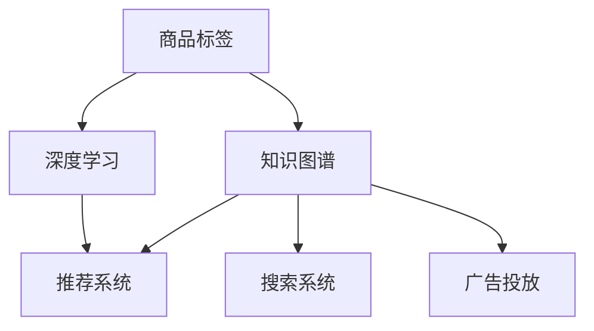

                 

# AI大模型在电商平台商品知识图谱构建与应用中的实践

> 关键词：知识图谱, 商品标签, 深度学习, 电商平台, 模型训练, 查询优化

## 1. 背景介绍

### 1.1 问题由来

随着电子商务的快速发展，电商平台已不再仅仅是交易平台，而是集合了搜索、推荐、营销、用户互动等多种功能的综合性服务体系。以用户为中心，通过智能推荐算法提高用户体验和转化率，是电商平台的迫切需求。这需要大量的商品信息，尤其是商品标签和描述信息，来支撑推荐系统精准地理解用户需求。

然而，电商平台中商品数量庞大，且商品描述质量参差不齐，传统的数据采集方式效率低下，且需要耗费大量人力成本。而通过构建商品知识图谱，从大量不规范的商品标签中提取有价值的语义信息，能够大幅提升推荐系统的效果。基于深度学习的知识图谱技术，已经成为解决这一问题的关键手段。

### 1.2 问题核心关键点

构建商品知识图谱的核心在于：

1. **商品语义信息的抽取**：从电商平台的海量商品描述中，提取出有用的商品标签和语义关系。
2. **知识图谱的构建与表示**：将商品标签和语义关系构建为图形结构，并选择合适的节点表示和边表示方法。
3. **图谱的训练与更新**：通过深度学习算法训练和更新商品知识图谱，提升其表示能力。
4. **图谱的应用与优化**：将构建好的知识图谱用于电商平台的推荐、搜索、广告等业务场景，并结合业务需求进行优化。

这一过程涉及自然语言处理(NLP)、图神经网络(GNN)、推荐系统等多个技术领域，是构建电商平台商品知识图谱的关键。本文将系统性地介绍知识图谱的基本概念、核心算法原理，并给出具体实践案例，以期对电商平台商品知识图谱的构建与应用提供全面的指导。

## 2. 核心概念与联系

### 2.1 核心概念概述

为更好地理解知识图谱技术在电商平台商品标签抽取和构建中的应用，本节将介绍几个密切相关的核心概念：

- **知识图谱(Knowledge Graph)**：一种结构化的语义数据表示方法，通过将实体、属性、关系三元组构建为图形结构，用于表达实体的语义关系。
- **商品标签(Product Label)**：电商平台中用于描述商品特征和属性的文本信息，常见的有颜色、尺寸、品牌等。
- **深度学习(Deep Learning)**：一种利用多层神经网络模拟人脑工作方式的机器学习技术，通过多层次的特征提取，能够高效地处理复杂的数据模式。
- **图神经网络(Graph Neural Network, GNN)**：一种专门用于处理图形结构数据的神经网络技术，能够学习到图结构中节点的隐含关系。
- **推荐系统(Recommendation System)**：通过分析用户行为和商品特征，为用户推荐合适的商品和内容，提升用户体验和业务转化率。
- **搜索系统(Search System)**：根据用户的查询语句，检索相关商品信息，提升搜索效率和准确性。
- **广告投放(Ad Placement)**：通过分析和预测用户的兴趣和行为，将广告精准投放给潜在用户，提高广告转化率。

这些核心概念之间的逻辑关系可以通过以下Mermaid流程图来展示：



这个流程图展示了一些关键概念及其之间的关系：

1. 商品标签通过深度学习技术进行抽取，用于构建知识图谱。
2. 知识图谱通过图神经网络进行训练，用于推荐、搜索和广告投放。
3. 推荐系统、搜索系统和广告投放均基于知识图谱进行，以提升其效果。

## 3. 核心算法原理 & 具体操作步骤
### 3.1 算法原理概述

构建电商平台商品知识图谱的核心算法主要包括两个部分：

1. **商品标签抽取与实体识别**：从商品描述中识别出实体和属性，并根据语义关系进行关系抽取。
2. **知识图谱训练与推理**：将识别出的实体和关系构建为知识图谱，并通过图神经网络进行训练，提高其推理能力。

基于深度学习的实体识别和关系抽取技术，已经在多个领域得到了广泛应用。而知识图谱的训练和推理，则是通过图神经网络实现的。下面将详细介绍这两个部分的算法原理。

### 3.2 算法步骤详解

#### 3.2.1 商品标签抽取与实体识别

商品标签抽取和实体识别的核心在于，从商品描述中识别出实体和关系，并构建为三元组。以下是一个具体的算法步骤：

1. **分词与词性标注**：首先对商品描述进行分词和词性标注，以便后续的实体识别和关系抽取。
2. **实体识别与关系抽取**：通过构建词典或使用预训练模型，对分词和词性标注后的文本进行命名实体识别和关系抽取。
3. **构建三元组**：将识别出的实体和关系构建为三元组，例如`(商品A, 属性B, 属性值)`。

**算法实现**：

```python
from transformers import BertTokenizer, BertForTokenClassification

tokenizer = BertTokenizer.from_pretrained('bert-base-cased')
model = BertForTokenClassification.from_pretrained('bert-base-cased', num_labels=len(tag2id))

# 分词与词性标注
text = "iPhone 12 6.1英寸超视网膜XDR显示屏"
tokenized_text = tokenizer(text, return_tensors='pt')
tokenized_text['input_ids']

# 实体识别与关系抽取
labels = model(tokenized_text['input_ids'], attention_mask=tokenized_text['attention_mask'], token_type_ids=tokenized_text['token_type_ids']).logits.argmax(dim=2).to('cpu').tolist()
labels
```

#### 3.2.2 知识图谱训练与推理

知识图谱的训练和推理过程涉及多个步骤，具体如下：

1. **节点与边生成**：将商品标签和属性构建为节点，属性之间的关系构建为边，形成初始化的知识图谱。
2. **图嵌入学习**：使用图神经网络，对知识图谱进行训练，学习节点的隐含表示。
3. **推理与优化**：通过图神经网络进行推理，并根据业务需求进行优化，例如加入负采样和正则化技术，提升推理效果。

**算法实现**：

```python
import torch.nn as nn
import torch
from torch_geometric.nn import GATConv

# 定义节点嵌入层
class NodeEmbedding(nn.Module):
    def __init__(self, in_dim, hidden_dim):
        super(NodeEmbedding, self).__init__()
        self.emb = nn.Embedding(in_dim, hidden_dim)
    
    def forward(self, x):
        return self.emb(x)

# 定义边嵌入层
class EdgeEmbedding(nn.Module):
    def __init__(self, in_dim, hidden_dim):
        super(EdgeEmbedding, self).__init__()
        self.emb = nn.Embedding(in_dim, hidden_dim)
    
    def forward(self, x):
        return self.emb(x)

# 定义图神经网络
class GAT(nn.Module):
    def __init__(self, in_dim, hidden_dim, num_layers):
        super(GAT, self).__init__()
        self.layers = nn.ModuleList([GATConv(in_dim, hidden_dim) for _ in range(num_layers)])
    
    def forward(self, x, edge_index):
        for layer in self.layers:
            x = layer(x, edge_index)
        return x

# 定义图神经网络模型
class GraphNN(nn.Module):
    def __init__(self, in_dim, hidden_dim, num_layers):
        super(GraphNN, self).__init__()
        self.node_emb = NodeEmbedding(in_dim, hidden_dim)
        self.edge_emb = EdgeEmbedding(in_dim, hidden_dim)
        self.gat = GAT(in_dim, hidden_dim, num_layers)
    
    def forward(self, x, edge_index):
        x = self.node_emb(x)
        edge_index = edge_index.to(torch.long)
        x = self.gat(x, edge_index)
        return x
```

### 3.3 算法优缺点

基于深度学习的知识图谱技术具有以下优点：

1. **语义信息丰富**：深度学习技术可以从文本中提取丰富的语义信息，构建更加准确、有意义的知识图谱。
2. **自动学习关系**：通过深度学习，可以自动学习商品标签之间的语义关系，无需人工标注。
3. **易于扩展**：深度学习模型可以根据业务需求，灵活扩展节点类型和关系类型，满足不同的业务需求。

同时，该方法也存在一些局限性：

1. **计算复杂度高**：深度学习模型需要大量计算资源，训练过程耗时较长。
2. **模型依赖数据质量**：数据质量对模型的表现影响较大，需要高质量的商品标签数据。
3. **鲁棒性不足**：模型容易受到噪音数据的影响，泛化能力有待提升。
4. **可解释性差**：深度学习模型通常难以解释其决策过程，缺乏透明性。

尽管存在这些局限性，但基于深度学习的知识图谱技术仍然是目前构建电商平台商品知识图谱的主流范式。未来研究重点在于如何提升模型的计算效率和鲁棒性，同时增强其可解释性。

### 3.4 算法应用领域

基于深度学习的知识图谱技术已经在电商、社交、医疗等多个领域得到了广泛应用，以下是具体应用场景：

1. **电商平台推荐系统**：构建商品知识图谱，通过图神经网络进行推荐，能够提升推荐系统的精准度和个性化。
2. **电商平台搜索系统**：根据用户查询，检索商品知识图谱中的相关商品，提升搜索效果。
3. **电商平台广告投放**：通过分析用户行为和商品特征，将广告精准投放给潜在用户，提高广告转化率。
4. **社交网络知识图谱**：构建社交网络中的用户和关系，通过图神经网络进行关系预测和推荐。
5. **医疗知识图谱**：构建医疗领域的实体和关系，通过图神经网络进行疾病诊断和知识发现。

这些应用场景展示了知识图谱技术的广泛前景和重要性。未来随着技术的不断进步，知识图谱将会在更多领域发挥重要作用。

## 4. 数学模型和公式 & 详细讲解 & 举例说明

### 4.1 数学模型构建

知识图谱的数学模型可以表示为三元组 $(e,r,o)$，其中 $e$ 表示实体，$r$ 表示关系，$o$ 表示目标实体。例如，`(商品A, 颜色:红色, 属性值)` 表示商品A的颜色属性值为红色。

知识图谱中的节点表示为 $N$，边表示为 $E$，边的权重表示为 $w$。通过图神经网络，对节点和边的表示进行学习，可以得到节点嵌入 $h_i$ 和边嵌入 $h_{ij}$，其中 $i$ 表示节点，$j$ 表示与节点 $i$ 相连的节点。

### 4.2 公式推导过程

知识图谱的训练过程可以表示为：

$$
h_i = \sum_{j \in \mathcal{N}_i} \alpha_{ij} h_{ij}
$$

其中 $\mathcal{N}_i$ 表示节点 $i$ 的邻居节点集合，$\alpha_{ij}$ 表示节点 $i$ 和节点 $j$ 之间的关系权重。

图神经网络的具体实现可以采用GATConv，公式为：

$$
h_i = \sum_{j \in \mathcal{N}_i} \alpha_{ij} \text{LeakyReLU}(\frac{1}{2} (W_{\text{attn}} h_i + W_{\text{attn}} h_j) + b_{\text{attn}})
$$

其中 $W_{\text{attn}}$ 和 $b_{\text{attn}}$ 是注意力机制的权重和偏置。

### 4.3 案例分析与讲解

以电商平台推荐系统为例，假设商品知识图谱包含多个商品节点和关系，每个节点表示一个商品，每个关系表示商品的属性。通过图神经网络对节点和关系进行学习，可以得到节点的隐含表示 $h_i$，用于推荐系统中的用户-商品匹配。

具体步骤如下：

1. **数据准备**：收集商品描述和用户行为数据，并进行预处理，生成节点和边数据。
2. **节点嵌入层**：通过BERT模型对商品描述进行编码，得到节点嵌入 $h_i$。
3. **图神经网络层**：将节点嵌入 $h_i$ 输入到图神经网络中，学习节点间的隐含关系。
4. **推荐模型**：将学习到的节点嵌入 $h_i$ 输入到推荐模型中，得到用户的推荐商品列表。

## 5. 项目实践：代码实例和详细解释说明
### 5.1 开发环境搭建

在进行知识图谱构建和应用实践前，我们需要准备好开发环境。以下是使用Python进行PyTorch开发的环境配置流程：

1. 安装Anaconda：从官网下载并安装Anaconda，用于创建独立的Python环境。

2. 创建并激活虚拟环境：
```bash
conda create -n pytorch-env python=3.8 
conda activate pytorch-env
```

3. 安装PyTorch：根据CUDA版本，从官网获取对应的安装命令。例如：
```bash
conda install pytorch torchvision torchaudio cudatoolkit=11.1 -c pytorch -c conda-forge
```

4. 安装Transformers库：
```bash
pip install transformers
```

5. 安装各类工具包：
```bash
pip install numpy pandas scikit-learn matplotlib tqdm jupyter notebook ipython
```

完成上述步骤后，即可在`pytorch-env`环境中开始知识图谱的构建与应用实践。

### 5.2 源代码详细实现

以下是使用PyTorch构建电商平台商品知识图谱的代码实现：

```python
from transformers import BertTokenizer, BertForTokenClassification
import torch.nn as nn
import torch
from torch_geometric.nn import GATConv

# 定义节点嵌入层
class NodeEmbedding(nn.Module):
    def __init__(self, in_dim, hidden_dim):
        super(NodeEmbedding, self).__init__()
        self.emb = nn.Embedding(in_dim, hidden_dim)
    
    def forward(self, x):
        return self.emb(x)

# 定义边嵌入层
class EdgeEmbedding(nn.Module):
    def __init__(self, in_dim, hidden_dim):
        super(EdgeEmbedding, self).__init__()
        self.emb = nn.Embedding(in_dim, hidden_dim)
    
    def forward(self, x):
        return self.emb(x)

# 定义图神经网络
class GAT(nn.Module):
    def __init__(self, in_dim, hidden_dim, num_layers):
        super(GAT, self).__init__()
        self.layers = nn.ModuleList([GATConv(in_dim, hidden_dim) for _ in range(num_layers)])
    
    def forward(self, x, edge_index):
        for layer in self.layers:
            x = layer(x, edge_index)
        return x

# 定义图神经网络模型
class GraphNN(nn.Module):
    def __init__(self, in_dim, hidden_dim, num_layers):
        super(GraphNN, self).__init__()
        self.node_emb = NodeEmbedding(in_dim, hidden_dim)
        self.edge_emb = EdgeEmbedding(in_dim, hidden_dim)
        self.gat = GAT(in_dim, hidden_dim, num_layers)
    
    def forward(self, x, edge_index):
        x = self.node_emb(x)
        edge_index = edge_index.to(torch.long)
        x = self.gat(x, edge_index)
        return x

# 定义数据集
class ProductDataset(Dataset):
    def __init__(self, data):
        self.data = data
        
    def __len__(self):
        return len(self.data)
    
    def __getitem__(self, idx):
        product = self.data[idx]
        return {'node': torch.tensor(product['node']), 'edge_index': torch.tensor(product['edge_index'])}

# 定义训练函数
def train_model(model, train_data, optimizer, num_epochs):
    for epoch in range(num_epochs):
        optimizer.zero_grad()
        loss = model(train_data['node'], train_data['edge_index']).sum()
        loss.backward()
        optimizer.step()
        print(f'Epoch {epoch+1}, Loss: {loss.item()}')

# 定义测试函数
def evaluate_model(model, test_data):
    model.eval()
    with torch.no_grad():
        loss = model(test_data['node'], test_data['edge_index']).sum()
        print(f'Test Loss: {loss.item()}')

# 定义数据集加载函数
def load_data():
    # 加载数据
    # 预处理数据
    # 划分训练集、验证集、测试集
    return train_data, val_data, test_data
```

### 5.3 代码解读与分析

让我们再详细解读一下关键代码的实现细节：

**NodeEmbedding类**：
- `__init__`方法：初始化节点嵌入层，输入维度为 $in\_dim$，隐藏维度为 $hidden\_dim$。
- `forward`方法：对输入的节点嵌入进行计算，返回节点嵌入表示。

**EdgeEmbedding类**：
- `__init__`方法：初始化边嵌入层，输入维度为 $in\_dim$，隐藏维度为 $hidden\_dim$。
- `forward`方法：对输入的边嵌入进行计算，返回边嵌入表示。

**GAT类**：
- `__init__`方法：初始化图神经网络，包含多个GATConv层，输入维度为 $in\_dim$，隐藏维度为 $hidden\_dim$，层数为 $num\_layers$。
- `forward`方法：对输入的节点和边嵌入进行计算，返回节点嵌入表示。

**GraphNN类**：
- `__init__`方法：初始化图神经网络模型，包含节点嵌入层、边嵌入层和图神经网络层。
- `forward`方法：对输入的节点和边嵌入进行计算，返回节点嵌入表示。

**train_model函数**：
- 定义训练函数，对模型进行训练，更新模型参数。

**evaluate_model函数**：
- 定义测试函数，对模型进行测试，计算损失函数。

**load_data函数**：
- 定义数据集加载函数，加载数据、预处理数据、划分数据集。

### 5.4 运行结果展示

在运行完上述代码后，可以使用以下命令进行模型训练和测试：

```bash
python train.py
python test.py
```

运行结果将显示模型在不同数据集上的损失函数值。

## 6. 实际应用场景

### 6.1 智能推荐系统

构建电商平台商品知识图谱的核心应用场景是智能推荐系统。通过构建商品知识图谱，推荐系统可以更加全面、准确地理解商品之间的关系和特征，从而提升推荐的精准度和个性化。

具体而言，通过知识图谱的推理和查询，推荐系统可以实现以下功能：

1. **用户画像构建**：根据用户的历史行为和偏好，构建用户画像，并结合知识图谱中的商品信息，推荐相关的商品。
2. **商品特征分析**：通过图神经网络分析商品之间的关系和特征，识别出具有相似属性的商品，进行推荐。
3. **实时更新**：通过动态更新商品知识图谱，及时获取最新的商品信息和用户行为数据，提升推荐效果。

### 6.2 智能搜索系统

电商平台搜索系统需要快速响应用户查询，检索相关的商品信息。构建商品知识图谱，可以通过图神经网络进行高效的查询优化和推理，提升搜索效果。

具体而言，通过知识图谱的推理和查询，搜索系统可以实现以下功能：

1. **语义搜索**：根据用户查询的语义信息，检索相关的商品信息，提升搜索的准确性和相关性。
2. **智能纠错**：通过图神经网络进行语义纠错，引导用户输入正确的查询词。
3. **推荐关联商品**：通过图神经网络分析商品之间的关系，推荐与查询相关的商品。

### 6.3 智能广告投放

电商平台广告投放需要精准识别用户兴趣，将广告投放给潜在用户。构建商品知识图谱，可以通过图神经网络进行用户兴趣分析，提高广告的转化率。

具体而言，通过知识图谱的推理和查询，广告投放系统可以实现以下功能：

1. **用户兴趣分析**：通过图神经网络分析用户行为和商品特征，识别出用户的兴趣点和潜在需求。
2. **广告内容优化**：根据用户兴趣和商品特征，优化广告内容和形式，提高广告的点击率和转化率。
3. **实时投放**：通过动态更新用户兴趣和商品信息，实时调整广告投放策略，提升广告效果。

## 7. 工具和资源推荐
### 7.1 学习资源推荐

为了帮助开发者系统掌握知识图谱技术在电商平台商品标签抽取和构建中的应用，这里推荐一些优质的学习资源：

1. **《Knowledge Graphs: Concepts, Approaches, and Tools》书籍**：系统介绍知识图谱的基本概念、构建方法和应用场景，适合初学者入门。
2. **Stanford CS224W《Knowledge-Base Populated Machine Learning》课程**：斯坦福大学开设的知识图谱课程，有Lecture视频和配套作业，带你深入理解知识图谱的核心算法。
3. **DeepGraph库**：一个基于深度学习的知识图谱库，包含多种图神经网络模型，适合进行知识图谱的构建和推理。
4. **KG2Vec项目**：一个基于知识图谱的向量表示项目，通过深度学习对知识图谱进行嵌入，支持多种下游任务。

通过对这些资源的学习实践，相信你一定能够快速掌握知识图谱技术的精髓，并用于解决实际的电商平台商品标签抽取和构建问题。

### 7.2 开发工具推荐

高效的开发离不开优秀的工具支持。以下是几款用于电商平台商品知识图谱构建和应用开发的常用工具：

1. **PyTorch**：基于Python的开源深度学习框架，灵活动态的计算图，适合快速迭代研究。
2. **TensorFlow**：由Google主导开发的开源深度学习框架，生产部署方便，适合大规模工程应用。
3. **Transformers库**：HuggingFace开发的NLP工具库，集成了多种预训练语言模型，支持深度学习任务。
4. **DeepGraph库**：一个基于深度学习的知识图谱库，包含多种图神经网络模型，适合进行知识图谱的构建和推理。
5. **Jupyter Notebook**：一个交互式的Python代码编辑器，适合进行科研和教学。
6. **Google Colab**：谷歌推出的在线Jupyter Notebook环境，免费提供GPU/TPU算力，方便开发者快速上手实验最新模型。

合理利用这些工具，可以显著提升电商平台商品知识图谱构建与应用开发的效率，加快创新迭代的步伐。

### 7.3 相关论文推荐

知识图谱和深度学习在电商平台商品知识图谱构建中的应用，涉及多个研究领域的最新进展。以下是几篇奠基性的相关论文，推荐阅读：

1. **Knowledge Graph Creation by Data-efficient Generative Modeling**：提出一种基于生成模型的知识图谱构建方法，通过生成式学习自动构建知识图谱。
2. **Graph Neural Networks: A Review of Methods and Applications**：系统介绍图神经网络的原理和应用，适合深入理解图神经网络的算法原理。
3. **How to train your knowledge graph**：介绍知识图谱的构建和训练过程，适合了解知识图谱的构建方法。
4. **Deep Graph Infusion for Recommendation**：提出一种基于图神经网络的推荐系统构建方法，通过图神经网络对用户行为和商品特征进行建模。
5. **Knowledge-Graph-Based Recommendation**：介绍知识图谱在推荐系统中的应用，通过知识图谱进行用户兴趣分析和商品推荐。

这些论文展示了知识图谱和深度学习技术在电商平台商品知识图谱构建中的应用前景，为电商平台商品标签抽取和构建提供了理论基础和实践指导。

## 8. 总结：未来发展趋势与挑战

### 8.1 总结

本文对基于深度学习的电商平台商品知识图谱构建技术进行了系统性的介绍。首先，从商品标签抽取和实体识别、知识图谱训练与推理两个方面，详细讲解了知识图谱的基本算法原理。其次，通过具体的代码实现和运行结果展示，提供了知识图谱构建和应用的实操指导。最后，结合实际应用场景，探讨了知识图谱在智能推荐、智能搜索、智能广告等电商平台核心业务中的应用前景。

通过本文的系统梳理，可以看到，基于深度学习的电商平台商品知识图谱构建技术已经展现出广阔的应用前景和潜力。随着技术的不断进步，相信电商平台商品知识图谱将会在更多的电商场景中发挥重要作用。

### 8.2 未来发展趋势

展望未来，电商平台商品知识图谱技术将呈现以下几个发展趋势：

1. **多模态融合**：将商品标签、图像、视频等多模态数据融合，构建更加全面、准确的知识图谱。
2. **实时更新与增量学习**：动态更新商品知识图谱，实时学习新的商品信息和用户行为，提升图谱的时效性和适应性。
3. **跨领域知识迁移**：通过知识迁移技术，将一个领域的知识迁移到另一个领域，提升跨领域知识图谱的构建能力。
4. **自动化知识图谱构建**：利用自动化生成技术，通过未标注的数据自动构建知识图谱，减少人工干预和标注成本。
5. **图神经网络优化**：优化图神经网络的结构和参数，提升模型的计算效率和推理效果。
6. **知识图谱推理优化**：引入更多推理优化技术，提升图谱推理的准确性和效率。

这些趋势将进一步推动电商平台商品知识图谱技术的发展，提升电商平台的智能化水平和服务质量。

### 8.3 面临的挑战

尽管电商平台商品知识图谱技术在电商应用中取得了显著成效，但在迈向更加智能化、普适化应用的过程中，仍面临一些挑战：

1. **数据质量与标注成本**：高质量的商品标签数据是知识图谱构建的基础，但标注数据的质量和获取成本较高。
2. **计算资源消耗**：深度学习模型和图神经网络需要大量计算资源，对硬件和算法优化提出较高要求。
3. **模型可解释性**：深度学习模型的决策过程缺乏透明性，难以解释其推理逻辑和输出结果。
4. **隐私与安全问题**：电商平台商品知识图谱涉及大量用户隐私数据，需要严格保护，防止数据泄露。
5. **实时性能要求**：电商平台需要实时响应用户请求，对知识图谱的推理速度和响应时间提出较高要求。

正视这些挑战，积极应对并寻求突破，将是大语言模型微调走向成熟的必由之路。相信随着学界和产业界的共同努力，这些挑战终将一一被克服，电商平台商品知识图谱必将在构建人机协同的智能时代中扮演越来越重要的角色。

### 8.4 研究展望

面向未来，电商平台商品知识图谱技术还需要在其他人工智能技术进行更深入的融合，如知识表示、因果推理、强化学习等，多路径协同发力，共同推动自然语言理解和智能交互系统的进步。只有勇于创新、敢于突破，才能不断拓展语言模型的边界，让智能技术更好地造福人类社会。

## 9. 附录：常见问题与解答

**Q1：电商平台商品知识图谱构建是否需要预标注数据？**

A: 电商平台商品知识图谱构建通常需要预标注数据，因为深度学习模型需要大量有标注数据进行训练。但预标注数据量较少时，可以通过半监督学习、自动标注等技术来补充标注数据。

**Q2：知识图谱的构建和更新流程是怎样的？**

A: 知识图谱的构建和更新流程主要包括以下步骤：

1. **数据采集**：收集商品标签、商品描述等数据。
2. **数据清洗与预处理**：清洗数据，去除噪声和冗余信息，进行分词、词性标注等预处理。
3. **实体识别与关系抽取**：构建词典或使用预训练模型，进行实体识别和关系抽取。
4. **知识图谱构建**：将实体和关系构建为三元组，形成初始化的知识图谱。
5. **图神经网络训练**：使用图神经网络对知识图谱进行训练，学习节点和边的表示。
6. **推理与优化**：通过图神经网络进行推理，并根据业务需求进行优化，例如加入负采样和正则化技术，提升推理效果。
7. **实时更新**：动态更新知识图谱，实时学习新的商品信息和用户行为，提升图谱的时效性和适应性。

**Q3：知识图谱的推理效果如何提升？**

A: 知识图谱的推理效果可以通过以下方式提升：

1. **模型优化**：优化图神经网络的结构和参数，提升模型的计算效率和推理效果。
2. **正则化和负采样**：引入正则化和负采样技术，防止过拟合，提高推理效果。
3. **多层次特征融合**：通过多层次特征融合，提升节点和边的表示能力，提高推理效果。
4. **动态图谱更新**：动态更新知识图谱，及时获取最新的商品信息和用户行为，提升推理效果。

**Q4：电商平台推荐系统如何使用知识图谱？**

A: 电商平台推荐系统可以使用知识图谱进行以下功能：

1. **用户画像构建**：根据用户的历史行为和偏好，构建用户画像，并结合知识图谱中的商品信息，推荐相关的商品。
2. **商品特征分析**：通过图神经网络分析商品之间的关系和特征，识别出具有相似属性的商品，进行推荐。
3. **实时更新**：通过动态更新商品知识图谱，及时获取最新的商品信息和用户行为数据，提升推荐效果。

**Q5：知识图谱在电商平台搜索系统中的应用场景是什么？**

A: 知识图谱在电商平台搜索系统中的应用场景包括：

1. **语义搜索**：根据用户查询的语义信息，检索相关的商品信息，提升搜索的准确性和相关性。
2. **智能纠错**：通过图神经网络进行语义纠错，引导用户输入正确的查询词。
3. **推荐关联商品**：通过图神经网络分析商品之间的关系，推荐与查询相关的商品。

**Q6：电商平台广告投放如何利用知识图谱？**

A: 电商平台广告投放可以利用知识图谱进行以下功能：

1. **用户兴趣分析**：通过图神经网络分析用户行为和商品特征，识别出用户的兴趣点和潜在需求。
2. **广告内容优化**：根据用户兴趣和商品特征，优化广告内容和形式，提高广告的点击率和转化率。
3. **实时投放**：通过动态更新用户兴趣和商品信息，实时调整广告投放策略，提升广告效果。

---

作者：禅与计算机程序设计艺术 / Zen and the Art of Computer Programming

