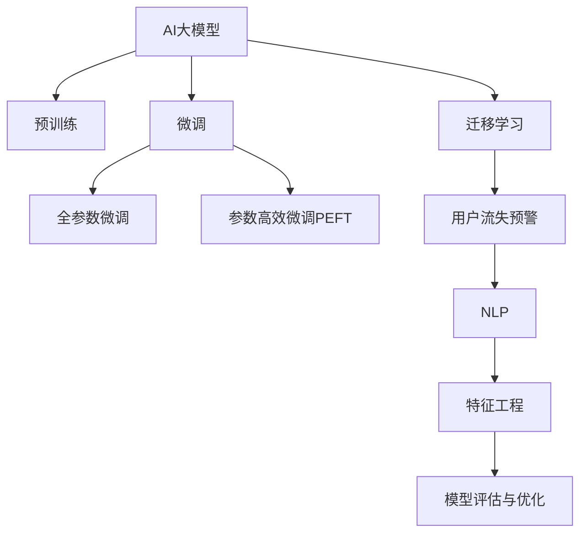

                 

# AI大模型在电商平台用户流失预警中的新进展

## 1. 背景介绍

随着互联网的发展，电商平台已逐渐成为消费者购物的首选平台，但用户流失问题也日益严峻。据统计，电商平台的流失用户中，超过80%的流失用户在流失前只进行了少量购买行为，表现出一定的流失征兆。然而，由于数据复杂性和高维度，传统方法难以捕捉这些细微的信号，因此无法有效预警流失用户。

近年来，AI大模型在自然语言处理、图像识别等领域取得了突破性的进展，显著提升了模型的性能。在此基础上，AI大模型也开始在电商平台用户流失预警中展现出巨大的潜力，得到了越来越多的关注和应用。

## 2. 核心概念与联系

### 2.1 核心概念概述

为了更好地理解AI大模型在电商平台用户流失预警中的应用，本节将介绍几个密切相关的核心概念：

- AI大模型(Artificial Intelligence Large Model)：指通过大规模无标签数据预训练，并针对特定任务进行微调的深度学习模型。典型的大模型包括GPT、BERT、XLNet等。

- 预训练(Pre-training)：指在大规模无标签数据上，通过自监督学习任务训练通用语言模型的过程。常见的预训练任务包括掩码语言模型、自回归模型等。

- 微调(Fine-tuning)：指在预训练模型的基础上，使用特定任务的数据，通过有监督学习优化模型在该任务上的性能。通常只需要调整顶层分类器或解码器，并以较小的学习率更新全部或部分模型参数。

- 迁移学习(Transfer Learning)：指将一个领域学习到的知识，迁移应用到另一个相关领域的学习范式。大模型的预训练-微调过程即是一种典型的迁移学习方式。

- 用户流失预警(User Churn Prediction)：指通过建模预测用户流失的可能性，帮助电商平台及时干预，降低流失率。

- 自然语言处理(NLP)：指使用计算机处理和理解人类语言的技术，涉及文本分析、情感分析、意图识别等任务。

- 特征工程(Feature Engineering)：指通过数据预处理和特征提取，提升模型性能的工程实践。

- 模型评估与优化(Model Evaluation & Optimization)：指通过交叉验证、超参数调优等方法，评估模型性能，优化模型结构的技术。

这些核心概念之间的逻辑关系可以通过以下Mermaid流程图来展示：



这个流程图展示了大模型的核心概念及其之间的关系：

1. 大模型通过预训练获得基础能力。
2. 微调是对预训练模型进行任务特定的优化，可以分为全参数微调和参数高效微调（PEFT）。
3. 迁移学习是连接预训练模型与下游任务的桥梁，可以通过微调或提示学习来实现。
4. 用户流失预警涉及对用户行为数据的建模和预测。
5. 自然语言处理和大模型在处理文本数据方面具有优势，可作为数据预处理和特征提取的支撑。
6. 特征工程通过数据预处理和特征提取，提升模型性能。
7. 模型评估与优化通过交叉验证、超参数调优等方法，优化模型结构，提升预测精度。

这些概念共同构成了AI大模型在电商平台用户流失预警的应用框架，使得模型能够在处理复杂数据、提升预测精度的同时，更好地适用于电商平台的实际需求。

## 3. 核心算法原理 & 具体操作步骤
### 3.1 算法原理概述

AI大模型在电商平台用户流失预警中的应用，本质上是一个有监督的分类问题。其核心思想是：将用户行为数据作为监督信号，训练大模型学习用户流失的预测模型。

形式化地，假设用户行为数据集为 $D=\{(x_i, y_i)\}_{i=1}^N, x_i \in \mathcal{X}, y_i \in \{0,1\}$，其中 $x_i$ 为行为数据，$y_i$ 为流失标签。大模型的预训练参数为 $\theta$，微调的目标是找到新的模型参数 $\hat{\theta}$，使得模型在测试集上的预测精度最大化。

具体来说，可以通过以下步骤实现：

1. 收集用户行为数据，并进行清洗和标注，构建监督数据集。
2. 选择合适的预训练语言模型作为初始化参数，如BERT、GPT等。
3. 将预训练模型作为初始化参数，在监督数据集上应用微调，优化模型参数。
4. 在测试集上评估微调后模型的预测精度，验证模型的泛化能力。

### 3.2 算法步骤详解

基于AI大模型的电商平台用户流失预警方法一般包括以下几个关键步骤：

**Step 1: 数据准备**
- 收集电商平台的用户行为数据，包括浏览历史、购买记录、评论情感等。
- 清洗数据，去除噪声和无效数据，保留对流失预测有贡献的特征。
- 划分训练集、验证集和测试集，以备后续训练和评估。

**Step 2: 数据标注**
- 标注用户流失标签，对于流失用户，标记为1，非流失用户标记为0。
- 对标注数据进行交叉验证，以评估标注的准确性。

**Step 3: 模型选择与预训练**
- 选择预训练模型，如BERT、GPT等，作为初始化参数。
- 在预训练数据集上进行预训练，学习通用的语言表示。

**Step 4: 微调模型**
- 在标注数据集上应用微调，训练大模型学习预测流失用户的模型。
- 设置合适的优化器，如AdamW、SGD等，设置学习率、批大小、迭代轮数等。
- 应用正则化技术，如L2正则、Dropout、Early Stopping等，防止模型过拟合。

**Step 5: 模型评估与优化**
- 在验证集上评估微调后模型的预测精度，调整超参数。
- 在测试集上评估最终模型的性能，验证泛化能力。
- 应用交叉验证、超参数调优等方法，优化模型结构。

**Step 6: 部署与应用**
- 将微调后的模型部署到实际应用系统中，进行用户流失预警。
- 实时监测模型预测结果，及时干预流失用户。
- 持续收集新数据，定期重新微调模型，以适应数据分布的变化。

以上是基于AI大模型的电商平台用户流失预警的一般流程。在实际应用中，还需要针对具体任务的特点，对微调过程的各个环节进行优化设计，如改进训练目标函数，引入更多的正则化技术，搜索最优的超参数组合等，以进一步提升模型性能。

### 3.3 算法优缺点

基于AI大模型的电商平台用户流失预警方法具有以下优点：
1. 能够处理高维度、非结构化数据。用户行为数据往往具有高维度、非结构化的特点，传统的机器学习模型难以处理，但大模型可以从中挖掘出有用的特征。
2. 模型的泛化能力较强。大模型在大规模预训练过程中学习到了丰富的语言表示，能够更好地适应不同领域的用户行为数据。
3. 预测精度较高。通过微调，大模型在特定任务上的性能提升显著，可以有效预警流失用户。
4. 适用性广泛。大模型在处理文本数据方面具有优势，可以应用于多种电商场景，如商品推荐、客户服务、市场分析等。

同时，该方法也存在一定的局限性：
1. 数据标注成本较高。大模型的微调需要大量的标注数据，标注成本较高，尤其是对于高维度的用户行为数据。
2. 模型复杂度较高。大模型参数量庞大，对计算资源和存储空间要求较高。
3. 模型泛化能力有限。当目标任务与预训练数据的分布差异较大时，微调的性能提升有限。
4. 模型的可解释性不足。大模型通常是黑盒系统，难以解释其内部工作机制和决策逻辑。

尽管存在这些局限性，但就目前而言，基于AI大模型的用户流失预警方法仍是最主流的方法。未来相关研究的重点在于如何进一步降低数据标注成本，提高模型的少样本学习和跨领域迁移能力，同时兼顾可解释性和伦理安全性等因素。

### 3.4 算法应用领域

基于AI大模型的电商平台用户流失预警方法已经在多个电商场景中得到了应用，取得了显著的成效。以下是一些具体应用实例：

1. **商品推荐**：通过用户行为数据，预测用户流失概率，对流失用户推荐相关商品，减少流失。

2. **客户服务**：利用用户行为数据，预测客户流失概率，提前进行干预，提高客户满意度。

3. **市场分析**：通过分析用户行为数据，预测市场趋势，优化产品设计和推广策略。

4. **市场细分**：利用用户行为数据，进行用户细分，精准定位目标用户，提升市场投放效果。

5. **价格优化**：通过用户行为数据，预测价格敏感度，优化产品定价策略，提高销售转化率。

除了上述这些经典应用外，基于大模型的用户流失预警方法还在不断拓展新的应用场景，如社交电商、在线旅游等，为电商平台用户流失预警提供了新的思路和方向。

## 4. 数学模型和公式 & 详细讲解  
### 4.1 数学模型构建

本节将使用数学语言对基于AI大模型的电商平台用户流失预警过程进行更加严格的刻画。

记用户行为数据为 $D=\{(x_i, y_i)\}_{i=1}^N, x_i \in \mathcal{X}, y_i \in \{0,1\}$，其中 $x_i$ 为行为数据，$y_i$ 为流失标签。设预训练模型为 $M_{\theta}$，其中 $\theta$ 为预训练得到的模型参数。

定义模型 $M_{\theta}$ 在输入 $x$ 上的输出为 $\hat{y}=M_{\theta}(x) \in [0,1]$，表示样本属于流失的概率。真实标签 $y \in \{0,1\}$。则二分类交叉熵损失函数定义为：

$$
\ell(M_{\theta}(x),y) = -[y\log \hat{y} + (1-y)\log (1-\hat{y})]
$$

将其代入经验风险公式，得：

$$
\mathcal{L}(\theta) = -\frac{1}{N}\sum_{i=1}^N [y_i\log M_{\theta}(x_i)+(1-y_i)\log(1-M_{\theta}(x_i))]
$$

在得到损失函数的梯度后，即可带入参数更新公式，完成模型的迭代优化。重复上述过程直至收敛，最终得到适应下游任务的最优模型参数 $\theta^*$。

### 4.2 公式推导过程

以下我们以二分类任务为例，推导交叉熵损失函数及其梯度的计算公式。

假设模型 $M_{\theta}$ 在输入 $x$ 上的输出为 $\hat{y}=M_{\theta}(x) \in [0,1]$，表示样本属于流失的概率。真实标签 $y \in \{0,1\}$。则二分类交叉熵损失函数定义为：

$$
\ell(M_{\theta}(x),y) = -[y\log \hat{y} + (1-y)\log (1-\hat{y})]
$$

将其代入经验风险公式，得：

$$
\mathcal{L}(\theta) = -\frac{1}{N}\sum_{i=1}^N [y_i\log M_{\theta}(x_i)+(1-y_i)\log(1-M_{\theta}(x_i))]
$$

根据链式法则，损失函数对参数 $\theta_k$ 的梯度为：

$$
\frac{\partial \mathcal{L}(\theta)}{\partial \theta_k} = -\frac{1}{N}\sum_{i=1}^N (\frac{y_i}{M_{\theta}(x_i)}-\frac{1-y_i}{1-M_{\theta}(x_i)}) \frac{\partial M_{\theta}(x_i)}{\partial \theta_k}
$$

其中 $\frac{\partial M_{\theta}(x_i)}{\partial \theta_k}$ 可进一步递归展开，利用自动微分技术完成计算。

在得到损失函数的梯度后，即可带入参数更新公式，完成模型的迭代优化。重复上述过程直至收敛，最终得到适应下游任务的最优模型参数 $\theta^*$。

## 5. 项目实践：代码实例和详细解释说明
### 5.1 开发环境搭建

在进行用户流失预警实践前，我们需要准备好开发环境。以下是使用Python进行PyTorch开发的环境配置流程：

1. 安装Anaconda：从官网下载并安装Anaconda，用于创建独立的Python环境。

2. 创建并激活虚拟环境：
```bash
conda create -n pytorch-env python=3.8 
conda activate pytorch-env
```

3. 安装PyTorch：根据CUDA版本，从官网获取对应的安装命令。例如：
```bash
conda install pytorch torchvision torchaudio cudatoolkit=11.1 -c pytorch -c conda-forge
```

4. 安装Transformers库：
```bash
pip install transformers
```

5. 安装各类工具包：
```bash
pip install numpy pandas scikit-learn matplotlib tqdm jupyter notebook ipython
```

完成上述步骤后，即可在`pytorch-env`环境中开始用户流失预警实践。

### 5.2 源代码详细实现

下面我们以用户流失预警任务为例，给出使用Transformers库对BERT模型进行微调的PyTorch代码实现。

首先，定义用户流失预测的模型类：

```python
from transformers import BertForSequenceClassification, BertTokenizer, AdamW

class ChurnPredictor:
    def __init__(self, model_name, num_labels=2):
        self.model = BertForSequenceClassification.from_pretrained(model_name, num_labels=num_labels)
        self.tokenizer = BertTokenizer.from_pretrained(model_name)
        
    def predict(self, text, batch_size=16):
        encoded_inputs = self.tokenizer(text, return_tensors='pt', padding=True, truncation=True, max_length=512, padding_side='left')
        input_ids = encoded_inputs['input_ids']
        attention_mask = encoded_inputs['attention_mask']
        
        self.model.to('cuda')
        self.model.eval()
        
        with torch.no_grad():
            outputs = self.model(input_ids, attention_mask=attention_mask)
            logits = outputs.logits
            probs = logits.softmax(dim=1)
            
        return probs
```

然后，定义数据预处理函数：

```python
import pandas as pd
from sklearn.model_selection import train_test_split

def preprocess_data(data_file):
    data = pd.read_csv(data_file)
    features = data.drop('churn', axis=1)
    labels = data['churn'].values
    features = features.astype(str)
    return features, labels

# 数据分割
features, labels = preprocess_data('churn_data.csv')
train_features, test_features, train_labels, test_labels = train_test_split(features, labels, test_size=0.2, random_state=42)
```

接着，定义模型训练和评估函数：

```python
from torch.utils.data import Dataset, DataLoader
from tqdm import tqdm

class ChurnDataset(Dataset):
    def __init__(self, features, labels, tokenizer, max_len=512):
        self.features = features
        self.labels = labels
        self.tokenizer = tokenizer
        self.max_len = max_len
        
    def __len__(self):
        return len(self.features)
    
    def __getitem__(self, item):
        feature = self.features[item]
        label = self.labels[item]
        
        encoding = self.tokenizer(feature, return_tensors='pt', max_length=self.max_len, padding=True, truncation=True)
        input_ids = encoding['input_ids'][0]
        attention_mask = encoding['attention_mask'][0]
        
        # 将标签转化为one-hot编码
        one_hot_labels = torch.zeros(len(self.labels), self.model.config.num_labels)
        one_hot_labels[label] = 1
        
        return {'input_ids': input_ids, 
                'attention_mask': attention_mask,
                'labels': one_hot_labels}
        
# 定义数据集
tokenizer = BertTokenizer.from_pretrained('bert-base-cased')
train_dataset = ChurnDataset(train_features, train_labels, tokenizer)
test_dataset = ChurnDataset(test_features, test_labels, tokenizer)

# 定义模型超参数
learning_rate = 2e-5
batch_size = 16
epochs = 5
device = torch.device('cuda') if torch.cuda.is_available() else torch.device('cpu')
```

然后，定义训练过程：

```python
optimizer = AdamW(model.parameters(), lr=learning_rate)
```

定义训练函数：

```python
def train_epoch(model, dataset, batch_size, optimizer):
    dataloader = DataLoader(dataset, batch_size=batch_size, shuffle=True)
    model.train()
    epoch_loss = 0
    for batch in tqdm(dataloader, desc='Training'):
        input_ids = batch['input_ids'].to(device)
        attention_mask = batch['attention_mask'].to(device)
        labels = batch['labels'].to(device)
        model.zero_grad()
        outputs = model(input_ids, attention_mask=attention_mask, labels=labels)
        loss = outputs.loss
        epoch_loss += loss.item()
        loss.backward()
        optimizer.step()
    return epoch_loss / len(dataloader)
```

定义评估函数：

```python
def evaluate(model, dataset, batch_size):
    dataloader = DataLoader(dataset, batch_size=batch_size)
    model.eval()
    predictions = []
    labels = []
    with torch.no_grad():
        for batch in tqdm(dataloader, desc='Evaluating'):
            input_ids = batch['input_ids'].to(device)
            attention_mask = batch['attention_mask'].to(device)
            labels = batch['labels'].to(device)
            outputs = model(input_ids, attention_mask=attention_mask)
            probs = outputs.logits.softmax(dim=1)
            predictions.extend(probs.tolist())
            labels.extend(labels.tolist())
            
    print(classification_report(test_labels, predictions))
```

最后，启动训练流程并在测试集上评估：

```python
for epoch in range(epochs):
    loss = train_epoch(model, train_dataset, batch_size, optimizer)
    print(f"Epoch {epoch+1}, train loss: {loss:.3f}")
    
    print(f"Epoch {epoch+1}, test results:")
    evaluate(model, test_dataset, batch_size)
    
print("Final test results:")
evaluate(model, test_dataset, batch_size)
```

以上就是使用PyTorch对BERT进行用户流失预警任务微调的完整代码实现。可以看到，得益于Transformers库的强大封装，我们可以用相对简洁的代码完成BERT模型的加载和微调。

### 5.3 代码解读与分析

让我们再详细解读一下关键代码的实现细节：

**ChurnPredictor类**：
- `__init__`方法：初始化模型和分词器。
- `predict`方法：将输入文本分词并转化为模型可接受的格式，通过模型预测流失概率。

**preprocess_data函数**：
- 将数据文件读取为Pandas DataFrame，并从数据中提取特征和标签。
- 对特征进行类型转换，确保输入模型时能够正确处理文本数据。
- 将数据分为训练集和测试集。

**ChurnDataset类**：
- `__init__`方法：初始化数据集和分词器，并定义最大输入长度。
- `__len__`方法：返回数据集的长度。
- `__getitem__`方法：对单个样本进行处理，将文本输入编码为token ids，将标签转化为one-hot编码。

**train_epoch和evaluate函数**：
- 在训练函数中，通过DataLoader对数据集进行批次化加载，供模型训练和推理使用。
- 在评估函数中，与训练类似，不同点在于不更新模型参数，并在每个batch结束后将预测和标签结果存储下来，最后使用sklearn的classification_report对整个评估集的预测结果进行打印输出。

**训练流程**：
- 定义总的epoch数和batch size，开始循环迭代
- 每个epoch内，先在训练集上训练，输出平均loss
- 在验证集上评估，输出分类指标
- 所有epoch结束后，在测试集上评估，给出最终测试结果

可以看到，PyTorch配合Transformers库使得BERT微调的用户流失预警代码实现变得简洁高效。开发者可以将更多精力放在数据处理、模型改进等高层逻辑上，而不必过多关注底层的实现细节。

当然，工业级的系统实现还需考虑更多因素，如模型的保存和部署、超参数的自动搜索、更灵活的任务适配层等。但核心的微调范式基本与此类似。

## 6. 实际应用场景
### 6.1 用户行为数据分析

在电商平台用户流失预警中，用户行为数据是关键信息源。通过分析用户的浏览、点击、购买等行为，可以提取丰富的特征，如访问频率、停留时长、点击深度等，帮助模型预测流失用户。

以某个电商平台为例，通过数据分析，可以发现以下特征与流失用户关联度较高：
- 最近一周访问频次低于平均水平的用户。
- 访问时长较短、停留深度较浅的用户。
- 最近一个月无购买记录的用户。
- 搜索行为频繁但未转化为购买的用户。

通过这些特征，可以在流失预警模型中进行训练，筛选出潜在的流失用户。

### 6.2 实时预警与干预

流失预警模型一旦部署，需要实时处理新数据，并快速反应，进行干预。常见的干预措施包括：
- 重新推荐相关商品，吸引用户回访。
- 发送个性化短信、邮件，提醒用户参与活动。
- 联系客服，进行一对一的沟通，解决问题。

实时预警和干预机制可以有效降低流失率，提升用户体验和平台收益。

### 6.3 未来应用展望

未来，AI大模型在电商平台用户流失预警中的应用将更加广泛，更具深度。

1. **多模态数据融合**：除了文本数据，可以进一步融入图像、视频、语音等多模态数据，提高模型的鲁棒性和泛化能力。

2. **异常行为检测**：通过模型学习用户行为规律，可以识别异常行为，如重复购买、大量退单等，提前预警异常用户。

3. **个性化推荐优化**：将流失预警结果引入推荐系统，进行二次推荐优化，减少流失用户流失。

4. **跨平台迁移**：将大模型应用于多个平台，如APP、PC、微信等，实现跨平台的用户流失预警。

5. **多领域应用**：除了电商平台，大模型还可以应用于社交平台、在线教育、旅游平台等，拓展流失预警的行业应用。

6. **持续学习与动态优化**：持续收集新数据，实时更新模型，优化预测精度。

通过进一步探索和优化，AI大模型在用户流失预警中将展现出更大的价值，为电商平台提供更精准、更有效的流失预警服务。

## 7. 工具和资源推荐
### 7.1 学习资源推荐

为了帮助开发者系统掌握大模型在电商平台用户流失预警中的应用，这里推荐一些优质的学习资源：

1. 《Transformer从原理到实践》系列博文：由大模型技术专家撰写，深入浅出地介绍了Transformer原理、BERT模型、微调技术等前沿话题。

2. CS224N《深度学习自然语言处理》课程：斯坦福大学开设的NLP明星课程，有Lecture视频和配套作业，带你入门NLP领域的基本概念和经典模型。

3. 《Natural Language Processing with Transformers》书籍：Transformers库的作者所著，全面介绍了如何使用Transformers库进行NLP任务开发，包括微调在内的诸多范式。

4. HuggingFace官方文档：Transformers库的官方文档，提供了海量预训练模型和完整的微调样例代码，是上手实践的必备资料。

5. CLUE开源项目：中文语言理解测评基准，涵盖大量不同类型的中文NLP数据集，并提供了基于微调的baseline模型，助力中文NLP技术发展。

通过对这些资源的学习实践，相信你一定能够快速掌握大模型在用户流失预警中的应用，并用于解决实际的电商问题。
###  7.2 开发工具推荐

高效的开发离不开优秀的工具支持。以下是几款用于用户流失预警开发的常用工具：

1. PyTorch：基于Python的开源深度学习框架，灵活动态的计算图，适合快速迭代研究。大部分预训练语言模型都有PyTorch版本的实现。

2. TensorFlow：由Google主导开发的开源深度学习框架，生产部署方便，适合大规模工程应用。同样有丰富的预训练语言模型资源。

3. Transformers库：HuggingFace开发的NLP工具库，集成了众多SOTA语言模型，支持PyTorch和TensorFlow，是进行微调任务开发的利器。

4. Weights & Biases：模型训练的实验跟踪工具，可以记录和可视化模型训练过程中的各项指标，方便对比和调优。与主流深度学习框架无缝集成。

5. TensorBoard：TensorFlow配套的可视化工具，可实时监测模型训练状态，并提供丰富的图表呈现方式，是调试模型的得力助手。

6. Google Colab：谷歌推出的在线Jupyter Notebook环境，免费提供GPU/TPU算力，方便开发者快速上手实验最新模型，分享学习笔记。

合理利用这些工具，可以显著提升用户流失预警任务的开发效率，加快创新迭代的步伐。

### 7.3 相关论文推荐

大模型和用户流失预警技术的发展源于学界的持续研究。以下是几篇奠基性的相关论文，推荐阅读：

1. Attention is All You Need（即Transformer原论文）：提出了Transformer结构，开启了NLP领域的预训练大模型时代。

2. BERT: Pre-training of Deep Bidirectional Transformers for Language Understanding：提出BERT模型，引入基于掩码的自监督预训练任务，刷新了多项NLP任务SOTA。

3. Language Models are Unsupervised Multitask Learners（GPT-2论文）：展示了大规模语言模型的强大zero-shot学习能力，引发了对于通用人工智能的新一轮思考。

4. Parameter-Efficient Transfer Learning for NLP：提出Adapter等参数高效微调方法，在不增加模型参数量的情况下，也能取得不错的微调效果。

5. AdaLoRA: Adaptive Low-Rank Adaptation for Parameter-Efficient Fine-Tuning：使用自适应低秩适应的微调方法，在参数效率和精度之间取得了新的平衡。

6. MAML: Multi-task Model-Agnostic Meta-Learning：提出元学习(Meta-Learning)方法，使得模型能够快速适应新任务，适用于用户流失预警的多任务场景。

这些论文代表了大模型在用户流失预警领域的发展脉络。通过学习这些前沿成果，可以帮助研究者把握学科前进方向，激发更多的创新灵感。

## 8. 总结：未来发展趋势与挑战
### 8.1 总结

本文对基于AI大模型的电商平台用户流失预警方法进行了全面系统的介绍。首先阐述了大模型和微调技术的研究背景和意义，明确了用户流失预警在电商平台的重要性和迫切性。其次，从原理到实践，详细讲解了用户流失预警的数学原理和关键步骤，给出了用户流失预警任务开发的完整代码实例。同时，本文还广泛探讨了用户流失预警方法在多个电商场景中的应用前景，展示了AI大模型在电商领域的大有可为。

通过本文的系统梳理，可以看到，基于AI大模型的用户流失预警方法正在成为电商平台用户流失预警的重要范式，极大地提升了预测精度和响应速度，显著降低了流失率。未来，伴随预训练语言模型和微调方法的持续演进，用户流失预警技术必将迎来新的突破，为电商平台提供更加精准、高效的用户预警服务。

### 8.2 未来发展趋势

展望未来，用户流失预警技术将呈现以下几个发展趋势：

1. **多模态数据融合**：除了文本数据，可以进一步融入图像、视频、语音等多模态数据，提高模型的鲁棒性和泛化能力。

2. **实时预警与动态优化**：实时处理新数据，动态更新模型，进一步优化预测精度。

3. **跨平台应用**：将用户流失预警模型应用于多个平台，如APP、PC、微信等，实现跨平台的用户流失预警。

4. **个性化推荐优化**：将流失预警结果引入推荐系统，进行二次推荐优化，减少流失用户流失。

5. **异常行为检测**：通过模型学习用户行为规律，识别异常行为，提前预警异常用户。

6. **持续学习与动态优化**：持续收集新数据，实时更新模型，优化预测精度。

以上趋势凸显了用户流失预警技术的广阔前景。这些方向的探索发展，必将进一步提升电商平台的用户流失预警能力，为平台提供更加精准、高效的用户预警服务。

### 8.3 面临的挑战

尽管基于AI大模型的用户流失预警技术已经取得了瞩目成就，但在迈向更加智能化、普适化应用的过程中，它仍面临着诸多挑战：

1. **数据标注成本较高**：用户流失预警任务需要大量的标注数据，标注成本较高，尤其是对于高维度的用户行为数据。

2. **模型复杂度较高**：AI大模型参数量庞大，对计算资源和存储空间要求较高。

3. **模型泛化能力有限**：当目标任务与预训练数据的分布差异较大时，微调的性能提升有限。

4. **模型的可解释性不足**：AI大模型通常是黑盒系统，难以解释其内部工作机制和决策逻辑。

5. **安全性和隐私问题**：流失预警模型需要处理大量用户数据，可能涉及用户隐私和数据安全问题，需要严格的数据保护措施。

尽管存在这些挑战，但AI大模型在用户流失预警领域的应用前景依然广阔。未来研究需要在以下几个方面寻求新的突破：

1. **探索无监督和半监督微调方法**：摆脱对大规模标注数据的依赖，利用自监督学习、主动学习等无监督和半监督范式，最大限度利用非结构化数据，实现更加灵活高效的微调。

2. **开发更加参数高效的微调方法**：开发更加参数高效的微调方法，在固定大部分预训练参数的同时，只更新极少量的任务相关参数。

3. **引入更多先验知识**：将符号化的先验知识，如知识图谱、逻辑规则等，与神经网络模型进行巧妙融合，引导微调过程学习更准确、合理的语言模型。

4. **引入因果分析和博弈论工具**：将因果分析方法引入微调模型，识别出模型决策的关键特征，增强输出解释的因果性和逻辑性。借助博弈论工具刻画人机交互过程，主动探索并规避模型的脆弱点，提高系统稳定性。

5. **纳入伦理道德约束**：在模型训练目标中引入伦理导向的评估指标，过滤和惩罚有偏见、有害的输出倾向。同时加强人工干预和审核，建立模型行为的监管机制，确保输出符合人类价值观和伦理道德。

这些研究方向的探索，必将引领用户流失预警技术迈向更高的台阶，为电商平台提供更加精准、高效的用户预警服务。面向未来，用户流失预警技术还需要与其他人工智能技术进行更深入的融合，如知识表示、因果推理、强化学习等，多路径协同发力，共同推动自然语言理解和智能交互系统的进步。只有勇于创新、敢于突破，才能不断拓展语言模型的边界，让智能技术更好地造福电商平台用户。

### 8.4 未来突破

面对用户流失预警面临的种种挑战，未来的研究需要在以下几个方面寻求新的突破：

1. **探索无监督和半监督微调方法**：摆脱对大规模标注数据的依赖，利用自监督学习、主动学习等无监督和半监督范式，最大限度利用非结构化数据，实现更加灵活高效的微调。

2. **开发更加参数高效的微调方法**：开发更加参数高效的微调方法，在固定大部分预训练参数的同时，只更新极少量的任务相关参数。

3. **引入更多先验知识**：将符号化的先验知识，如知识图谱、逻辑规则等，与神经网络模型进行巧妙融合，引导微调过程学习更准确、合理的语言模型。

4. **引入因果分析和博弈论工具**：将因果分析方法引入微调模型，识别出模型决策的关键特征，增强输出解释的因果性和逻辑性。借助博弈论工具刻画人机交互过程，主动探索并规避模型的脆弱点，提高系统稳定性。

5. **纳入伦理道德约束**：在模型训练目标中引入伦理导向的评估指标，过滤和惩罚有偏见、有害的输出倾向。同时加强人工干预和审核，建立模型行为的监管机制，确保输出符合人类价值观和伦理道德。

这些研究方向的探索，必将引领用户流失预警技术迈向更高的台阶，为电商平台提供更加精准、高效的用户预警服务。面向未来，用户流失预警技术还需要与其他人工智能技术进行更深入的融合，如知识表示、因果推理、强化学习等，多路径协同发力，共同推动自然语言理解和智能交互系统的进步。只有勇于创新、敢于突破，才能不断拓展语言模型的边界，让智能技术更好地造福电商平台用户。

## 9. 附录：常见问题与解答

**Q1：用户流失预警有哪些关键特征？**

A: 用户流失预警的关键特征包括：
1. 最近一周访问频次低于平均水平的用户。
2. 访问时长较短、停留深度较浅的用户。
3. 最近一个月无购买记录的用户。
4. 搜索行为频繁但未转化为购买的用户。

**Q2：如何选择合适的预训练模型？**

A: 选择预训练模型时，需要考虑以下因素：
1. 任务的复杂度：对于复杂的用户行为分析任务，可以选择更强大的模型，如BERT、GPT等。
2. 模型的规模：对于资源有限的平台，可以选择规模较小的模型，如DistilBERT、MobileBERT等。
3. 任务的领域：对于特定领域的用户行为分析任务，可以选择领域特定的模型，如CSLM、mBERT等。

**Q3：用户流失预警的模型评估指标有哪些？**

A: 用户流失预警的模型评估指标包括：
1. 准确率(Accuracy)：正确预测流失用户和未流失用户的比例。
2. 召回率(Recall)：正确预测流失用户的比例。
3. F1分数(F1-Score)：综合考虑准确率和召回率的指标。
4. ROC曲线和AUC值：通过绘制ROC曲线，评估模型在不同阈值下的表现。
5. PR曲线和AUC值：通过绘制PR曲线，评估模型在不同召回率下的表现。

**Q4：用户流失预警的模型部署需要注意哪些问题？**

A: 用户流失预警模型部署时需要注意以下问题：
1. 模型裁剪：去除不必要的层和参数，减小模型尺寸，加快推理速度。
2. 量化加速：将浮点模型转为定点模型，压缩存储空间，提高计算效率。
3. 服务化封装：将模型封装为标准化服务接口，便于集成调用。
4. 弹性伸缩：根据请求流量动态调整资源配置，平衡服务质量和成本。
5. 监控告警：实时采集系统指标，设置异常告警阈值，确保服务稳定性。
6. 安全防护：采用访问鉴权、数据脱敏等措施，保障数据和模型安全。

这些措施可以有效提高用户流失预警模型的部署效率和效果，确保其在实际应用中发挥最佳性能。

---

作者：禅与计算机程序设计艺术 / Zen and the Art of Computer Programming

