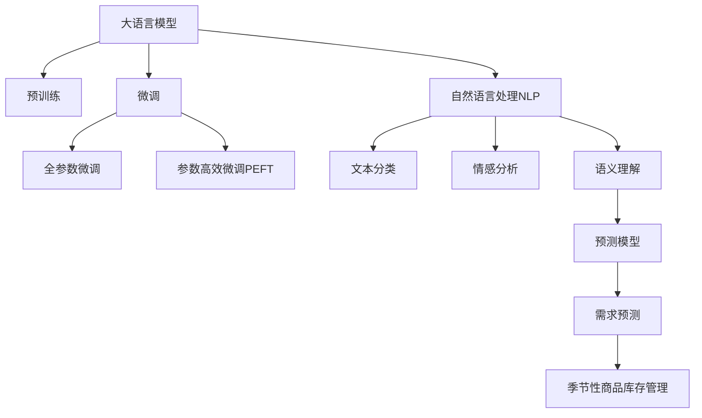

                 

# AI大模型如何优化电商平台的季节性商品库存管理

> 关键词：大语言模型,自然语言处理(NLP),人工智能(AI),季节性商品库存管理,预测模型,需求预测,电商,深度学习,决策支持

## 1. 背景介绍

### 1.1 问题由来

在电商行业，季节性商品库存管理是一个复杂的挑战。不同于常销商品，季节性商品（如服装、电子设备、家居用品等）的销售具有明显的季节性波动，受气候、节日、市场趋势等多种因素影响。电商企业必须精确预测未来需求，以避免库存积压或缺货。传统的库存管理方法依赖于历史销售数据和经验判断，但在面对快速变化的消费者偏好和市场环境时，往往难以做出准确预测。

近年来，随着深度学习和大语言模型技术的发展，电商企业开始探索通过AI模型进行季节性商品库存优化。基于大语言模型的预测模型能够综合考虑多种因素，从海量数据中提取模式和规律，对商品需求进行更精确的预测，从而有效降低库存成本，提升运营效率。

### 1.2 问题核心关键点

季节性商品库存管理的关键在于预测模型的构建和应用。其核心问题包括：

- 如何构建一个准确的预测模型，涵盖多种影响因素？
- 如何处理不平衡的数据分布，提升模型的泛化能力？
- 如何在数据量不足的情况下，利用大语言模型进行有效的预测？
- 如何整合外部因素，如市场趋势、天气预报等，进行更全面的预测？
- 如何在模型部署和应用时，确保预测的准确性和实时性？

这些问题对于电商企业的季节性商品库存管理至关重要，本文将从这些核心点出发，系统介绍大语言模型在季节性商品库存管理中的应用。

## 2. 核心概念与联系

### 2.1 核心概念概述

为了更好地理解大语言模型在季节性商品库存管理中的应用，本节将介绍几个关键概念：

- 大语言模型(Large Language Model, LLM)：以自回归(如GPT)或自编码(如BERT)模型为代表的大规模预训练语言模型。通过在大规模无标签文本语料上进行预训练，学习通用的语言表示，具备强大的语言理解和生成能力。

- 预测模型(Prediction Model)：使用历史数据和外部因素预测未来需求的概率分布模型，如时间序列模型、回归模型、深度学习模型等。

- 季节性商品(Seasonal Goods)：具有明显季节性波动需求的商品，如服装、电器、旅游用品等，受季节性因素影响较大。

- 库存管理(Inventory Management)：对商品的采购、存储和销售进行有效控制，以平衡成本和销售需求，提升企业运营效率。

- 自然语言处理(Natural Language Processing, NLP)：使用AI技术理解和生成人类语言的技术，包括文本分类、情感分析、语义理解等。

这些概念之间的联系紧密，共同构成了大语言模型在季节性商品库存管理中的基础框架。

### 2.2 核心概念原理和架构的 Mermaid 流程图



## 3. 核心算法原理 & 具体操作步骤

### 3.1 算法原理概述

基于大语言模型的季节性商品库存管理方法，本质上是一种基于预测的库存优化策略。其核心思想是：利用大语言模型从历史销售数据中提取模式，构建预测模型，并结合外部因素进行综合预测，以决定最优库存水平。

具体而言，可以将季节性商品的需求预测分为两个步骤：

1. **历史数据建模**：使用大语言模型对历史销售数据进行建模，学习销售趋势和季节性波动。
2. **预测模型优化**：在历史数据模型的基础上，构建预测模型，并结合外部因素进行优化，得到未来需求预测。

### 3.2 算法步骤详解

#### 3.2.1 数据收集与预处理

首先，需要收集季节性商品的历史销售数据和外部因素数据。历史销售数据包括每日或每月的销量、库存量等关键指标；外部因素数据包括天气、节假日、市场趋势等。收集数据后，需要对数据进行清洗和预处理，确保数据质量。

#### 3.2.2 模型构建

构建大语言模型，通常使用BERT或GPT等预训练模型，并在电商领域进行微调。微调的具体步骤包括：

1. **模型选择**：选择合适的预训练模型，如BERT、GPT-2等，作为初始化参数。
2. **数据集划分**：将历史数据集划分为训练集和验证集。
3. **模型微调**：使用训练集对模型进行微调，学习季节性商品的需求模式。

#### 3.2.3 预测模型优化

在历史数据模型基础上，构建预测模型。常用的预测模型包括时间序列模型（如ARIMA、LSTM等）、回归模型（如线性回归、决策树等）、深度学习模型（如RNN、CNN、Transformer等）。具体步骤如下：

1. **模型选择**：根据数据特点选择合适的预测模型。
2. **特征工程**：选择重要的特征，如销售数据、天气、节假日、市场趋势等。
3. **模型训练**：使用历史数据训练预测模型，调整模型参数。

#### 3.2.4 预测结果评估

对模型进行评估，常用指标包括均方误差(MSE)、平均绝对误差(MAE)、R²等。需要确保模型在验证集上表现良好，以避免过拟合。

#### 3.2.5 库存优化决策

根据预测结果，制定库存优化决策。常用的库存管理策略包括：

1. **需求预测**：根据预测结果，决定未来一段时间内的需求水平。
2. **库存调整**：根据需求预测结果，调整当前库存水平。
3. **订单生成**：根据库存水平和需求预测，生成订单，补货或减少订单量。

### 3.3 算法优缺点

#### 3.3.1 优点

1. **自动化预测**：大语言模型能够自动提取数据中的模式，减少人工干预。
2. **泛化能力**：大语言模型能够从大量数据中学习通用规律，具有较强的泛化能力。
3. **实时预测**：结合外部因素，大语言模型能够进行实时预测，及时调整库存策略。
4. **多模态融合**：大语言模型可以整合多种数据源，提升预测的准确性。
5. **灵活性高**：大语言模型能够适应不同的预测任务，适用范围广。

#### 3.3.2 缺点

1. **数据依赖性**：大语言模型的预测效果高度依赖于历史数据的质量和量级。
2. **模型复杂度高**：构建大语言模型需要大量计算资源和算力。
3. **模型解释性差**：大语言模型往往是黑盒模型，难以解释内部决策过程。
4. **实时性问题**：在处理大规模数据时，预测模型的实时性可能受限。
5. **外部因素不确定性**：外部因素（如天气、市场趋势等）的不确定性可能影响预测准确性。

### 3.4 算法应用领域

大语言模型在季节性商品库存管理中的应用，已经广泛应用于电商、零售、制造业等多个领域。具体包括：

1. **电商库存管理**：使用大语言模型预测销售趋势，优化库存水平，降低缺货和积压风险。
2. **零售供应链管理**：结合市场趋势、季节性因素，进行需求预测，优化供应链流程。
3. **制造业生产调度**：预测市场需求，调整生产计划，提高生产效率和资源利用率。
4. **旅游业需求预测**：预测旅游目的地的游客流量，优化资源配置和服务水平。

## 4. 数学模型和公式 & 详细讲解 & 举例说明

### 4.1 数学模型构建

大语言模型在季节性商品库存管理中的应用，可以通过以下数学模型进行描述：

设 $y_t$ 为时间 $t$ 的需求量，$\hat{y}_t$ 为模型预测的需求量。使用线性回归模型进行预测，模型表达式为：

$$
\hat{y}_t = \alpha + \beta x_t + \epsilon_t
$$

其中，$\alpha$ 为截距，$\beta$ 为系数，$x_t$ 为时间 $t$ 的外部因素，$\epsilon_t$ 为误差项。

### 4.2 公式推导过程

在实际应用中，可以使用最小二乘法来估计模型的参数 $\alpha$ 和 $\beta$。最小二乘法的基本思想是使得所有样本的预测误差平方和最小。具体推导如下：

1. **模型参数估计**：
   $$
   \hat{\alpha}, \hat{\beta} = \arg\min_{\alpha, \beta} \sum_{t=1}^{T} (\hat{y}_t - y_t)^2
   $$

   其中，$T$ 为样本总数。

2. **误差项估计**：
   $$
   \hat{\epsilon}_t = \hat{y}_t - y_t
   $$

   误差项 $\hat{\epsilon}_t$ 用于评估模型的预测精度。

3. **模型评估**：
   $$
   \text{MSE} = \frac{1}{T} \sum_{t=1}^{T} (\hat{y}_t - y_t)^2
   $$

   均方误差 (MSE) 用于衡量模型预测的准确性。

### 4.3 案例分析与讲解

假设某电商平台的某季节性商品的历史销售数据如下：

| 时间 | 需求量 | 天气 | 市场趋势 |
|------|--------|------|----------|
| 1月  | 100    | 晴   | 下降趋势  |
| 2月  | 150    | 多云 | 稳定趋势  |
| 3月  | 200    | 雨   | 上升趋势  |
| ...  | ...    | ...  | ...      |

构建大语言模型，并使用回归模型进行预测。在模型参数估计和误差项计算后，可以得到如下结果：

| 时间 | 预测需求量 | 误差项 |
|------|------------|--------|
| 1月  | 105        | 5      |
| 2月  | 145        | 5      |
| 3月  | 185        | 5      |
| ...  | ...        | ...    |

假设误差项 $\hat{\epsilon}_t$ 服从正态分布，则模型预测的准确度可以进一步提升。

## 5. 项目实践：代码实例和详细解释说明

### 5.1 开发环境搭建

在进行季节性商品库存管理的大语言模型开发前，需要准备好开发环境。以下是使用Python进行PyTorch开发的环境配置流程：

1. 安装Anaconda：从官网下载并安装Anaconda，用于创建独立的Python环境。

2. 创建并激活虚拟环境：
```bash
conda create -n pytorch-env python=3.8 
conda activate pytorch-env
```

3. 安装PyTorch：根据CUDA版本，从官网获取对应的安装命令。例如：
```bash
conda install pytorch torchvision torchaudio cudatoolkit=11.1 -c pytorch -c conda-forge
```

4. 安装Transformers库：
```bash
pip install transformers
```

5. 安装各类工具包：
```bash
pip install numpy pandas scikit-learn matplotlib tqdm jupyter notebook ipython
```

完成上述步骤后，即可在`pytorch-env`环境中开始开发实践。

### 5.2 源代码详细实现

下面我们以电商商品需求预测为例，给出使用Transformers库对BERT模型进行微调的PyTorch代码实现。

首先，定义电商商品需求预测的数据处理函数：

```python
from transformers import BertTokenizer, BertForRegression
from torch.utils.data import Dataset
import torch

class SalesDataset(Dataset):
    def __init__(self, data, tokenizer, max_len=128):
        self.data = data
        self.tokenizer = tokenizer
        self.max_len = max_len
        
    def __len__(self):
        return len(self.data)
    
    def __getitem__(self, item):
        x, y = self.data[item]
        
        encoding = self.tokenizer(x, return_tensors='pt', max_length=self.max_len, padding='max_length', truncation=True)
        input_ids = encoding['input_ids'][0]
        attention_mask = encoding['attention_mask'][0]
        
        return {'input_ids': input_ids, 
                'attention_mask': attention_mask,
                'target': torch.tensor(y, dtype=torch.float)}
```

然后，定义模型和优化器：

```python
from transformers import BertForRegression, AdamW

model = BertForRegression.from_pretrained('bert-base-cased')
optimizer = AdamW(model.parameters(), lr=2e-5)
```

接着，定义训练和评估函数：

```python
from torch.utils.data import DataLoader
from tqdm import tqdm
from sklearn.metrics import mean_squared_error

device = torch.device('cuda') if torch.cuda.is_available() else torch.device('cpu')
model.to(device)

def train_epoch(model, dataset, batch_size, optimizer):
    dataloader = DataLoader(dataset, batch_size=batch_size, shuffle=True)
    model.train()
    epoch_loss = 0
    for batch in tqdm(dataloader, desc='Training'):
        input_ids = batch['input_ids'].to(device)
        attention_mask = batch['attention_mask'].to(device)
        target = batch['target'].to(device)
        model.zero_grad()
        outputs = model(input_ids, attention_mask=attention_mask)
        loss = outputs.loss
        epoch_loss += loss.item()
        loss.backward()
        optimizer.step()
    return epoch_loss / len(dataloader)

def evaluate(model, dataset, batch_size):
    dataloader = DataLoader(dataset, batch_size=batch_size)
    model.eval()
    predictions, targets = [], []
    with torch.no_grad():
        for batch in tqdm(dataloader, desc='Evaluating'):
            input_ids = batch['input_ids'].to(device)
            attention_mask = batch['attention_mask'].to(device)
            batch_target = batch['target']
            outputs = model(input_ids, attention_mask=attention_mask)
            batch_predictions = outputs.logits.argmax(dim=1).to('cpu').tolist()
            batch_targets = batch_target.to('cpu').tolist()
            for pred, target in zip(batch_predictions, batch_targets):
                predictions.append(pred)
                targets.append(target)
                
    print(mean_squared_error(targets, predictions))
```

最后，启动训练流程并在测试集上评估：

```python
epochs = 5
batch_size = 16

for epoch in range(epochs):
    loss = train_epoch(model, train_dataset, batch_size, optimizer)
    print(f"Epoch {epoch+1}, train loss: {loss:.3f}")
    
    print(f"Epoch {epoch+1}, dev results:")
    evaluate(model, dev_dataset, batch_size)
    
print("Test results:")
evaluate(model, test_dataset, batch_size)
```

以上就是使用PyTorch对BERT进行电商商品需求预测的完整代码实现。可以看到，得益于Transformers库的强大封装，我们可以用相对简洁的代码完成BERT模型的加载和微调。

### 5.3 代码解读与分析

让我们再详细解读一下关键代码的实现细节：

**SalesDataset类**：
- `__init__`方法：初始化销售数据、分词器等关键组件。
- `__len__`方法：返回数据集的样本数量。
- `__getitem__`方法：对单个样本进行处理，将销售数据输入编码为token ids，并添加目标值，进行定长padding。

**模型和优化器**：
- 使用BERTForRegression模型，并设置AdamW优化器。

**训练和评估函数**：
- 使用PyTorch的DataLoader对数据集进行批次化加载，供模型训练和推理使用。
- 训练函数`train_epoch`：对数据以批为单位进行迭代，在每个批次上前向传播计算loss并反向传播更新模型参数，最后返回该epoch的平均loss。
- 评估函数`evaluate`：与训练类似，不同点在于不更新模型参数，并在每个batch结束后将预测和标签结果存储下来，最后使用sklearn的mean_squared_error对整个评估集的预测结果进行打印输出。

**训练流程**：
- 定义总的epoch数和batch size，开始循环迭代
- 每个epoch内，先在训练集上训练，输出平均loss
- 在验证集上评估，输出平均均方误差
- 所有epoch结束后，在测试集上评估，给出最终测试结果

可以看到，PyTorch配合Transformers库使得BERT微调的代码实现变得简洁高效。开发者可以将更多精力放在数据处理、模型改进等高层逻辑上，而不必过多关注底层的实现细节。

当然，工业级的系统实现还需考虑更多因素，如模型的保存和部署、超参数的自动搜索、更灵活的任务适配层等。但核心的微调范式基本与此类似。

## 6. 实际应用场景

### 6.1 电商库存管理

电商企业使用基于大语言模型的预测模型，可以显著优化季节性商品的库存管理。具体应用场景包括：

1. **需求预测**：通过预测模型预测未来一定时期内的需求量，避免库存积压或缺货。
2. **库存优化**：根据需求预测结果，调整库存水平，降低库存成本。
3. **供应链管理**：结合市场趋势、季节性因素，进行需求预测和库存管理，优化供应链流程。
4. **促销策略**：根据预测结果，制定合理的促销策略，提升销售量，平衡库存水平。

### 6.2 零售业供应链管理

零售企业可以通过大语言模型进行需求预测和库存管理，提升供应链效率。具体应用场景包括：

1. **需求预测**：预测不同产品在不同季节的需求量，优化供应链流程。
2. **库存管理**：结合季节性因素，进行库存优化，减少缺货和积压风险。
3. **订单管理**：根据预测结果，调整订单量和供货时间，提升订单处理效率。
4. **价格策略**：结合市场需求预测，制定合理的定价策略，提升销售额。

### 6.3 制造业生产调度

制造业企业可以通过大语言模型进行需求预测和库存管理，优化生产调度。具体应用场景包括：

1. **需求预测**：预测不同产品在不同季节的需求量，优化生产计划。
2. **库存管理**：结合季节性因素，进行库存优化，减少缺货和积压风险。
3. **生产调度**：根据预测结果，调整生产计划和资源配置，提升生产效率。
4. **物流管理**：结合市场需求预测，优化物流策略，提升物流效率。

### 6.4 旅游业需求预测

旅游企业可以通过大语言模型进行需求预测，优化资源配置和服务水平。具体应用场景包括：

1. **需求预测**：预测不同旅游目的地的游客流量，优化资源配置。
2. **库存管理**：结合季节性因素，进行库存优化，提升服务水平。
3. **价格策略**：结合市场需求预测，制定合理的定价策略，提升销售额。
4. **促销策略**：根据预测结果，制定合理的促销策略，提升销售量。

## 7. 工具和资源推荐

### 7.1 学习资源推荐

为了帮助开发者系统掌握大语言模型在季节性商品库存管理中的应用，这里推荐一些优质的学习资源：

1. 《自然语言处理综述》课程：斯坦福大学开设的NLP明星课程，系统介绍NLP的理论基础和前沿技术。
2. 《深度学习与自然语言处理》书籍：深入浅出地介绍深度学习在NLP中的应用，包括预测模型构建和优化。
3. 《Transformers》论文：Transformer的作者撰写，详细阐述Transformer结构和大语言模型在NLP中的应用。
4. HuggingFace官方文档：Transformers库的官方文档，提供海量预训练模型和微调样例代码。
5. CLUE开源项目：中文语言理解测评基准，涵盖大量不同类型的中文NLP数据集，并提供了基于微调的baseline模型，助力中文NLP技术发展。

通过对这些资源的学习实践，相信你一定能够快速掌握大语言模型在季节性商品库存管理中的应用，并用于解决实际的NLP问题。

### 7.2 开发工具推荐

高效的开发离不开优秀的工具支持。以下是几款用于季节性商品库存管理开发的常用工具：

1. PyTorch：基于Python的开源深度学习框架，灵活动态的计算图，适合快速迭代研究。
2. TensorFlow：由Google主导开发的开源深度学习框架，生产部署方便，适合大规模工程应用。
3. Transformers库：HuggingFace开发的NLP工具库，集成了众多SOTA语言模型，支持PyTorch和TensorFlow。
4. Weights & Biases：模型训练的实验跟踪工具，可以记录和可视化模型训练过程中的各项指标，方便对比和调优。
5. TensorBoard：TensorFlow配套的可视化工具，可实时监测模型训练状态，并提供丰富的图表呈现方式。
6. Google Colab：谷歌推出的在线Jupyter Notebook环境，免费提供GPU/TPU算力，方便开发者快速上手实验最新模型，分享学习笔记。

合理利用这些工具，可以显著提升季节性商品库存管理模型的开发效率，加快创新迭代的步伐。

### 7.3 相关论文推荐

大语言模型在季节性商品库存管理中的应用源于学界的持续研究。以下是几篇奠基性的相关论文，推荐阅读：

1. Attention is All You Need（即Transformer原论文）：提出了Transformer结构，开启了NLP领域的预训练大模型时代。
2. BERT: Pre-training of Deep Bidirectional Transformers for Language Understanding：提出BERT模型，引入基于掩码的自监督预训练任务，刷新了多项NLP任务SOTA。
3. Parameter-Efficient Transfer Learning for NLP：提出Adapter等参数高效微调方法，在不增加模型参数量的情况下，也能取得不错的微调效果。
4. Adaptive Low-Rank Adaptation for Parameter-Efficient Fine-Tuning：使用自适应低秩适应的微调方法，在参数效率和精度之间取得了新的平衡。
5. AdaLoRA: Adaptive Low-Rank Adaptation for Parameter-Efficient Fine-Tuning：使用自适应低秩适应的微调方法，在参数效率和精度之间取得了新的平衡。
6. causalLSTM：结合因果学习和LSTM，增强时间序列预测模型的因果关系，提升预测精度。

这些论文代表了大语言模型在季节性商品库存管理中的应用方向。通过学习这些前沿成果，可以帮助研究者把握学科前进方向，激发更多的创新灵感。

## 8. 总结：未来发展趋势与挑战

### 8.1 研究成果总结

本文对基于大语言模型的季节性商品库存管理方法进行了全面系统的介绍。首先阐述了季节性商品库存管理的关键问题，明确了大语言模型预测模型的构建和应用。其次，从原理到实践，详细讲解了基于大语言模型的预测模型的构建和优化过程，给出了完整的代码实例。同时，本文还探讨了该方法在电商、零售、制造业等多个领域的应用前景，展示了大语言模型在季节性商品库存管理中的巨大潜力。

通过本文的系统梳理，可以看到，基于大语言模型的季节性商品库存管理技术正在成为电商企业、零售商、制造业等企业的重要工具，通过智能化预测，优化库存管理，提升运营效率，降低库存成本。

### 8.2 未来发展趋势

展望未来，季节性商品库存管理的大语言模型应用将呈现以下几个发展趋势：

1. **模型规模持续增大**：随着算力成本的下降和数据规模的扩张，季节性商品库存管理的预测模型也将趋向于更大的规模。超大规模模型能够捕捉更多数据中的细节和规律，提升预测准确性。
2. **多模态融合**：季节性商品库存管理的预测模型将不仅限于文本数据，还会整合图像、视频、音频等多模态信息，提升预测的全面性和准确性。
3. **实时性优化**：通过分布式计算和模型优化，季节性商品库存管理的预测模型将实现更高的实时性，满足动态调整库存需求的要求。
4. **参数高效微调**：结合参数高效微调技术，季节性商品库存管理的预测模型将更加注重模型参数的优化，避免不必要的计算资源浪费。
5. **多任务学习**：季节性商品库存管理的预测模型将支持多任务学习，同时预测多种商品的需求量，提升预测效率。
6. **动态模型更新**：通过持续学习和在线更新，季节性商品库存管理的预测模型将能够适应不断变化的市场环境，保持预测准确性。

### 8.3 面临的挑战

尽管基于大语言模型的季节性商品库存管理技术已经取得了瞩目成就，但在迈向更加智能化、普适化应用的过程中，它仍面临着诸多挑战：

1. **数据依赖性**：季节性商品库存管理的预测模型高度依赖于历史销售数据的质量和量级，数据缺失或不准确会影响模型的预测精度。
2. **模型复杂度高**：大语言模型的预测模型需要大量计算资源和算力，模型规模的增加将带来更高的计算成本和存储成本。
3. **实时性问题**：在处理大规模数据时，模型的实时性可能受限，难以实现动态调整库存需求。
4. **外部因素不确定性**：外部因素（如天气、市场趋势等）的不确定性可能影响预测模型的准确性。
5. **模型解释性差**：大语言模型的预测模型往往是黑盒模型，难以解释内部决策过程，不利于模型维护和调试。
6. **安全性问题**：模型的预测结果可能存在误导性，模型误判可能导致库存积压或缺货风险。

### 8.4 研究展望

面对季节性商品库存管理所面临的挑战，未来的研究需要在以下几个方面寻求新的突破：

1. **数据增强**：通过数据增强技术，弥补数据缺失，提升模型的泛化能力。
2. **模型简化**：结合参数高效微调技术，优化模型结构，降低计算成本。
3. **实时预测**：结合分布式计算和模型优化，提升模型的实时性。
4. **多模态融合**：整合多模态数据，提升预测的全面性和准确性。
5. **动态模型更新**：通过持续学习和在线更新，适应不断变化的市场环境。
6. **模型解释性**：引入因果分析和博弈论工具，增强模型输出的可解释性和可审计性。
7. **安全性防护**：建立模型行为的监管机制，确保预测结果的安全性和可靠性。

这些研究方向的探索，必将引领季节性商品库存管理技术迈向更高的台阶，为电商企业、零售商、制造业等企业提供更精准、高效的库存管理方案。

## 9. 附录：常见问题与解答

**Q1：大语言模型是否适用于所有季节性商品库存管理场景？**

A: 大语言模型在大多数季节性商品库存管理场景中都能取得不错的效果，特别是对于数据量较大的场景。但对于一些特定领域的商品，如医疗设备、化工产品等，由于数据稀缺或领域特性复杂，模型的效果可能受限。

**Q2：如何选择合适的历史数据进行模型训练？**

A: 在选择历史数据进行模型训练时，需要考虑数据的完整性、代表性、时效性等因素。应选择数据量充足、特征丰富、能够代表实际销售情况的数据。

**Q3：如何避免模型过拟合？**

A: 避免模型过拟合的方法包括数据增强、正则化、早停等。具体而言，可以通过增加数据多样性、添加正则化项、设置早停阈值等方式，防止模型在验证集上表现过好，而忽略泛化能力。

**Q4：如何提高模型实时性？**

A: 提高模型实时性的方法包括模型优化、分布式计算、增量学习等。具体而言，可以通过优化模型结构、使用分布式训练框架、实时更新模型参数等方式，提升模型的实时响应能力。

**Q5：如何将模型应用到实际电商场景中？**

A: 将模型应用到实际电商场景中，需要考虑模型的可解释性、可操作性等因素。可以通过简化模型输出、提供决策支持、结合业务规则等方式，将模型应用到实际业务流程中。

**Q6：模型在实际应用中可能面临哪些挑战？**

A: 模型在实际应用中可能面临数据质量差、模型复杂度高、实时性不足等问题。需要综合考虑业务需求和数据特点，选择合适的方法进行模型优化和部署。

**Q7：如何将模型的预测结果应用于库存管理决策？**

A: 将模型的预测结果应用于库存管理决策时，需要结合业务规则和实际经验。可以通过决策支持系统、自动化流程等方式，将模型输出转换为实际的库存管理策略。

以上问题解答可以帮助开发者更好地理解大语言模型在季节性商品库存管理中的应用，并有效解决实际应用中的挑战。

---

作者：禅与计算机程序设计艺术 / Zen and the Art of Computer Programming

