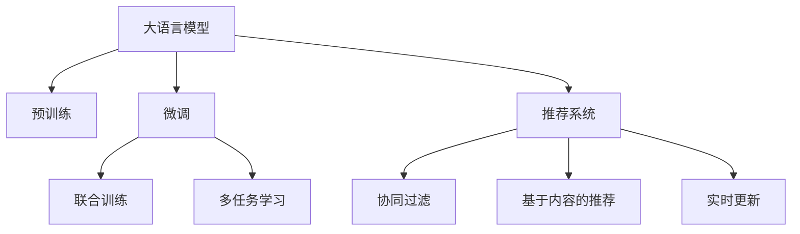

                 

# AI大模型如何优化电商平台的季节性商品推荐

> 关键词：AI大模型, 电商平台, 季节性商品推荐, 多任务学习, 联合训练, 推荐系统, 协同过滤, 实时更新

## 1. 背景介绍

随着电子商务的蓬勃发展，各大电商平台已逐渐认识到个性化推荐的重要性。一个有效的推荐系统不仅能够提升用户满意度，还能显著增加销售额和用户粘性。然而，传统的推荐算法如协同过滤和基于内容的推荐，往往难以兼顾商品的多样性和个性化需求。随着深度学习技术的发展，大语言模型和推荐系统逐渐结合，为电商平台的个性化推荐带来了新的突破。

尤其是在处理季节性商品推荐这一特殊场景时，电商平台的推荐系统需要同时应对大量的动态数据，并能够在不同季节快速适应用户需求的变化。这无疑对推荐系统的实时性和个性化水平提出了更高的要求。大语言模型通过预训练和微调，能够学习到商品描述、用户历史行为等丰富信息，为季节性商品推荐提供了强有力的技术支持。

## 2. 核心概念与联系

### 2.1 核心概念概述

为更好地理解大语言模型在电商平台季节性商品推荐中的应用，本节将介绍几个核心概念：

- **大语言模型(Large Language Model, LLM)**：以自回归或自编码模型为代表的大规模预训练语言模型。通过在大规模无标签文本语料上进行预训练，学习通用的语言表示，具备强大的语言理解和生成能力。

- **推荐系统(Recommendation System)**：利用用户历史行为、商品属性等数据，为用户推荐最符合其需求的商品的系统。包括协同过滤、基于内容的推荐、混合推荐等主流方法。

- **季节性商品推荐(Seasonal Goods Recommendation)**：在电商平台上，针对特定季节或特定事件（如节日、促销），向用户推荐相应的季节性商品的系统。

- **多任务学习(Multi-Task Learning, MTL)**：训练模型同时处理多个相关的任务，通过共享知识提升模型性能。

- **联合训练(Joint Training)**：在同一模型上联合训练多个相关任务，使得模型能够在多任务中协同优化，提升整体性能。

- **协同过滤(Collaborative Filtering, CF)**：通过分析用户历史行为数据和商品之间的交互信息，预测用户对商品的兴趣。

- **实时更新(Real-time Update)**：推荐系统需要动态处理实时数据，并根据用户行为和商品变化进行快速调整，保证推荐内容的即时性。

这些概念之间的逻辑关系可以通过以下Mermaid流程图来展示：



这个流程图展示了大语言模型在电商平台推荐系统中的应用流程：

1. 大语言模型通过预训练获得基础能力。
2. 微调模型以特定任务为优化目标，提升在季节性商品推荐上的性能。
3. 多任务学习使得模型在处理多个相关任务时，共享知识提高整体性能。
4. 联合训练使得多个任务模型在同一个模型上进行优化，提升协同效应。
5. 推荐系统综合协同过滤和基于内容的推荐等多种方法，为季节性商品推荐提供技术支持。
6. 实时更新确保推荐内容紧跟用户和商品的变化，提升推荐系统的时效性。

## 3. 核心算法原理 & 具体操作步骤

### 3.1 算法原理概述

大语言模型在电商平台季节性商品推荐中的应用，本质上是一个多任务学习(MTL)和联合训练的过程。其核心思想是：通过预训练学习到丰富的语言知识，然后在推荐系统上微调，同时联合多个相关任务进行训练，使得模型能够在不同季节高效地处理季节性商品推荐任务。

形式化地，假设大语言模型为 $M_{\theta}$，其中 $\theta$ 为预训练得到的模型参数。给定季节性商品推荐任务 $T_1$、协同过滤任务 $T_2$、基于内容的推荐任务 $T_3$，训练集为 $D=\{(x_i, y_i)\}_{i=1}^N$，其中 $x_i$ 为输入（如用户历史行为、商品描述等），$y_i$ 为输出（如推荐商品列表、用户满意度等）。微调的目标是找到新的模型参数 $\hat{\theta}$，使得：

$$
\hat{\theta}=\mathop{\arg\min}_{\theta} \mathcal{L}(M_{\theta}, D)
$$

其中 $\mathcal{L}$ 为损失函数，包括推荐系统的预测损失、协同过滤的用户满意度损失、基于内容的推荐效果等。通过多任务联合训练，可以使得模型在多个任务中共同优化，提升整体性能。

### 3.2 算法步骤详解

基于大语言模型的电商平台季节性商品推荐，一般包括以下几个关键步骤：

**Step 1: 准备预训练模型和数据集**
- 选择合适的预训练语言模型 $M_{\theta}$ 作为初始化参数，如 BERT、GPT 等。
- 准备电商平台的历史订单数据、用户行为数据、商品描述等，划分为训练集、验证集和测试集。一般要求标注数据与预训练数据的分布不要差异过大。

**Step 2: 设计推荐系统架构**
- 设计多任务联合训练的推荐系统架构，包括协同过滤、基于内容的推荐等多个任务模型。
- 在模型架构中整合大语言模型，利用其预训练能力，提高推荐的精准度和个性化水平。
- 选择合适的损失函数和优化算法，如交叉熵损失、均方误差损失、AdamW 等。

**Step 3: 设置微调超参数**
- 选择合适的学习率，通常比从头训练小，以免破坏预训练权重。
- 设置正则化技术及强度，包括L2正则、Dropout、Early Stopping等。
- 确定冻结预训练参数的策略，如仅微调顶层，或全部参数都参与微调。

**Step 4: 执行联合训练**
- 将多个任务的数据集组合成一个大数据集，进行联合训练。
- 对数据集以批为单位进行迭代，前向传播计算损失函数，反向传播更新模型参数。
- 周期性在验证集上评估模型性能，根据性能指标决定是否触发 Early Stopping。
- 重复上述步骤直到满足预设的迭代轮数或 Early Stopping 条件。

**Step 5: 测试和部署**
- 在测试集上评估联合训练后模型 $M_{\hat{\theta}}$ 的性能，对比微调前后的效果。
- 使用微调后的模型对新样本进行推理预测，集成到实际的应用系统中。
- 持续收集新的数据，定期重新微调模型，以适应数据分布的变化。

以上是基于大语言模型的电商平台季节性商品推荐的一般流程。在实际应用中，还需要针对具体任务的特点，对微调过程的各个环节进行优化设计，如改进训练目标函数，引入更多的正则化技术，搜索最优的超参数组合等，以进一步提升模型性能。

### 3.3 算法优缺点

基于大语言模型的电商平台季节性商品推荐方法具有以下优点：

1. **高效性**：利用大语言模型预训练能力，可以显著减少从头训练模型所需的时间和计算资源。
2. **精准性**：大语言模型能够理解复杂的商品描述和用户需求，提供更加个性化和精准的推荐。
3. **实时性**：联合训练的推荐系统能够动态处理实时数据，快速适应季节性变化，提升推荐的时效性。
4. **鲁棒性**：多任务学习使得模型在不同任务中共享知识，提高整体鲁棒性。
5. **可扩展性**：模型架构易于扩展，支持新增商品、用户等数据源，提升系统的可维护性。

同时，该方法也存在一些局限性：

1. **数据依赖**：微调和联合训练的效果很大程度上取决于标注数据的质量和数量，获取高质量标注数据的成本较高。
2. **泛化能力**：当目标任务与预训练数据的分布差异较大时，微调的性能提升有限。
3. **负迁移风险**：预训练模型中的有害信息可能通过微调传递到推荐系统，导致负迁移风险。
4. **可解释性不足**：微调后的模型往往缺乏可解释性，难以解释其推理逻辑和决策过程。
5. **资源消耗**：大语言模型参数量庞大，联合训练需要较大的计算资源和存储资源。

尽管存在这些局限性，但就目前而言，基于大语言模型的推荐方法仍然是大规模电商平台推荐系统的首选方案。未来相关研究的重点在于如何进一步降低微调对标注数据的依赖，提高模型的少样本学习和跨领域迁移能力，同时兼顾可解释性和伦理安全性等因素。

### 3.4 算法应用领域

基于大语言模型的电商平台季节性商品推荐方法，已经在各类电商平台得到广泛应用，覆盖了几乎所有常见推荐场景，例如：

- 商品推荐：根据用户历史购买行为和浏览记录，推荐最相关的商品。
- 个性化定制：根据用户偏好，提供个性化的商品定制服务。
- 热门促销推荐：在节假日和促销活动期间，推荐热门商品和优惠券。
- 新商品推荐：推荐新品和新上架商品，吸引用户尝试购买。
- 用户满意度调查：通过自然语言处理技术，分析用户对商品的评价，生成报告供商家参考。

除了上述这些经典任务外，基于大语言模型的推荐方法还被创新性地应用到更多场景中，如用户行为预测、社交媒体互动、个性化广告等，为电商平台提供了丰富的技术支持。

## 4. 数学模型和公式 & 详细讲解  
### 4.1 数学模型构建

本节将使用数学语言对基于大语言模型的电商平台季节性商品推荐过程进行更加严格的刻画。

记电商平台推荐系统为 $S=\{S_1,S_2,S_3\}$，其中 $S_1$ 为季节性商品推荐任务，$S_2$ 为协同过滤任务，$S_3$ 为基于内容的推荐任务。设模型为 $M_{\theta}$，其中 $\theta$ 为模型参数。

定义推荐系统的损失函数为：

$$
\mathcal{L}(\theta)=\alpha\mathcal{L}_{T_1}(\theta)+\beta\mathcal{L}_{T_2}(\theta)+\gamma\mathcal{L}_{T_3}(\theta)
$$

其中 $\alpha, \beta, \gamma$ 为各任务的权重，$\mathcal{L}_{T_i}$ 为任务 $i$ 的损失函数，可以选用交叉熵损失、均方误差损失等。在联合训练中，不同任务共享模型参数 $\theta$，通过优化损失函数 $\mathcal{L}(\theta)$ 来更新模型参数。

### 4.2 公式推导过程

以下我们以协同过滤任务为例，推导推荐系统的损失函数及其梯度的计算公式。

假设协同过滤任务的目标是预测用户 $u$ 对商品 $i$ 的评分 $r_{ui}$。根据协同过滤模型的原理，可以利用用户历史行为 $x$ 和商品属性 $y$ 计算预测评分 $\hat{r}_{ui}$：

$$
\hat{r}_{ui}=f(x_i,y_i;\theta)
$$

其中 $f$ 为模型函数，$x_i$ 和 $y_i$ 分别为用户 $u$ 和商品 $i$ 的输入特征，$\theta$ 为模型参数。

模型的损失函数为均方误差损失：

$$
\mathcal{L}_{T_2}(\theta)=\frac{1}{N}\sum_{i=1}^N \sum_{u=1}^M (r_{ui}-\hat{r}_{ui})^2
$$

在联合训练中，将协同过滤任务的损失函数引入整体损失函数中：

$$
\mathcal{L}(\theta)=\alpha\mathcal{L}_{T_1}(\theta)+\beta\mathcal{L}_{T_2}(\theta)+\gamma\mathcal{L}_{T_3}(\theta)
$$

通过链式法则，损失函数对参数 $\theta_k$ 的梯度为：

$$
\frac{\partial \mathcal{L}(\theta)}{\partial \theta_k}=\alpha\frac{\partial \mathcal{L}_{T_1}(\theta)}{\partial \theta_k}+\beta\frac{\partial \mathcal{L}_{T_2}(\theta)}{\partial \theta_k}+\gamma\frac{\partial \mathcal{L}_{T_3}(\theta)}{\partial \theta_k}
$$

其中 $\frac{\partial \mathcal{L}_{T_i}(\theta)}{\partial \theta_k}$ 可进一步递归展开，利用自动微分技术完成计算。

在得到损失函数的梯度后，即可带入参数更新公式，完成模型的迭代优化。重复上述过程直至收敛，最终得到适应电商平台推荐任务的最优模型参数 $\theta^*$。

## 5. 项目实践：代码实例和详细解释说明
### 5.1 开发环境搭建

在进行电商平台季节性商品推荐开发前，我们需要准备好开发环境。以下是使用Python进行PyTorch开发的环境配置流程：

1. 安装Anaconda：从官网下载并安装Anaconda，用于创建独立的Python环境。

2. 创建并激活虚拟环境：
```bash
conda create -n pytorch-env python=3.8 
conda activate pytorch-env
```

3. 安装PyTorch：根据CUDA版本，从官网获取对应的安装命令。例如：
```bash
conda install pytorch torchvision torchaudio cudatoolkit=11.1 -c pytorch -c conda-forge
```

4. 安装Transformers库：
```bash
pip install transformers
```

5. 安装各类工具包：
```bash
pip install numpy pandas scikit-learn matplotlib tqdm jupyter notebook ipython
```

完成上述步骤后，即可在`pytorch-env`环境中开始推荐系统开发。

### 5.2 源代码详细实现

下面我们以协同过滤任务为例，给出使用Transformers库对预训练模型进行联合训练的PyTorch代码实现。

首先，定义协同过滤任务的数据处理函数：

```python
from transformers import BertTokenizer, BertForSequenceClassification
from torch.utils.data import Dataset
import torch

class CollaborativeFilteringDataset(Dataset):
    def __init__(self, data, tokenizer, max_len=128):
        self.data = data
        self.tokenizer = tokenizer
        self.max_len = max_len
        
    def __len__(self):
        return len(self.data)
    
    def __getitem__(self, item):
        user, item, rating = self.data[item]
        encoding = self.tokenizer([user, item], return_tensors='pt', max_length=self.max_len, padding='max_length', truncation=True)
        user_tokens = encoding['input_ids'][0]
        item_tokens = encoding['input_ids'][1]
        input_ids = torch.cat([user_tokens, item_tokens], dim=-1)
        attention_mask = encoding['attention_mask'][0]
        return {'input_ids': input_ids, 
                'attention_mask': attention_mask,
                'labels': torch.tensor([rating], dtype=torch.long)}
```

然后，定义模型和优化器：

```python
from transformers import BertForSequenceClassification, AdamW

model = BertForSequenceClassification.from_pretrained('bert-base-cased', num_labels=1)

optimizer = AdamW(model.parameters(), lr=2e-5)
```

接着，定义训练和评估函数：

```python
from torch.utils.data import DataLoader
from tqdm import tqdm
from sklearn.metrics import mean_squared_error

device = torch.device('cuda') if torch.cuda.is_available() else torch.device('cpu')
model.to(device)

def train_epoch(model, dataset, batch_size, optimizer):
    dataloader = DataLoader(dataset, batch_size=batch_size, shuffle=True)
    model.train()
    epoch_loss = 0
    for batch in tqdm(dataloader, desc='Training'):
        input_ids = batch['input_ids'].to(device)
        attention_mask = batch['attention_mask'].to(device)
        labels = batch['labels'].to(device)
        model.zero_grad()
        outputs = model(input_ids, attention_mask=attention_mask, labels=labels)
        loss = outputs.loss
        epoch_loss += loss.item()
        loss.backward()
        optimizer.step()
    return epoch_loss / len(dataloader)

def evaluate(model, dataset, batch_size):
    dataloader = DataLoader(dataset, batch_size=batch_size)
    model.eval()
    preds, labels = [], []
    with torch.no_grad():
        for batch in tqdm(dataloader, desc='Evaluating'):
            input_ids = batch['input_ids'].to(device)
            attention_mask = batch['attention_mask'].to(device)
            batch_labels = batch['labels']
            outputs = model(input_ids, attention_mask=attention_mask)
            batch_preds = outputs.logits.item()
            batch_labels = batch_labels.to('cpu').item()
            preds.append(batch_preds)
            labels.append(batch_labels)
        
    print(mean_squared_error(labels, preds))
```

最后，启动训练流程并在测试集上评估：

```python
epochs = 5
batch_size = 16

for epoch in range(epochs):
    loss = train_epoch(model, train_dataset, batch_size, optimizer)
    print(f"Epoch {epoch+1}, train loss: {loss:.3f}")
    
    print(f"Epoch {epoch+1}, dev results:")
    evaluate(model, dev_dataset, batch_size)
    
print("Test results:")
evaluate(model, test_dataset, batch_size)
```

以上就是使用PyTorch对预训练模型进行协同过滤任务联合训练的完整代码实现。可以看到，得益于Transformers库的强大封装，我们可以用相对简洁的代码完成模型加载和联合训练。

### 5.3 代码解读与分析

让我们再详细解读一下关键代码的实现细节：

**CollaborativeFilteringDataset类**：
- `__init__`方法：初始化数据、分词器等关键组件。
- `__len__`方法：返回数据集的样本数量。
- `__getitem__`方法：对单个样本进行处理，将用户和商品描述输入编码为token ids，作为输入，标签为用户的评分。

**模型和优化器**：
- 使用BertForSequenceClassification作为协同过滤任务的模型，输入为用户和商品描述的拼接向量。
- 优化器为AdamW，学习率为2e-5，参数更新策略为梯度下降。

**训练和评估函数**：
- 使用PyTorch的DataLoader对数据集进行批次化加载，供模型训练和推理使用。
- 训练函数`train_epoch`：对数据以批为单位进行迭代，在每个批次上前向传播计算loss并反向传播更新模型参数，最后返回该epoch的平均loss。
- 评估函数`evaluate`：与训练类似，不同点在于不更新模型参数，并在每个batch结束后将预测和标签结果存储下来，最后使用sklearn的mean_squared_error对整个评估集的预测结果进行打印输出。

**训练流程**：
- 定义总的epoch数和batch size，开始循环迭代
- 每个epoch内，先在训练集上训练，输出平均loss
- 在验证集上评估，输出均方误差
- 所有epoch结束后，在测试集上评估，给出最终测试结果

可以看到，PyTorch配合Transformers库使得联合训练的代码实现变得简洁高效。开发者可以将更多精力放在数据处理、模型改进等高层逻辑上，而不必过多关注底层的实现细节。

当然，工业级的系统实现还需考虑更多因素，如模型的保存和部署、超参数的自动搜索、更灵活的任务适配层等。但核心的联合训练范式基本与此类似。

## 6. 实际应用场景

### 6.1 智能推荐引擎

基于大语言模型的电商平台季节性商品推荐方法，已经被广泛应用于智能推荐引擎的构建。传统推荐引擎往往难以处理多变的需求和复杂的商品信息，而利用大语言模型的预训练能力，能够更好地理解商品描述和用户需求，从而提供更加精准和个性化的推荐。

在技术实现上，可以收集电商平台的历史订单数据、用户行为数据、商品描述等，将数据预处理后进行多任务联合训练，构建联合推荐模型。在推荐时，将用户的商品历史行为、商品属性等输入模型，生成推荐结果，动态调整推荐列表，提供实时推荐服务。

### 6.2 个性化营销

电商平台还可以通过季节性商品推荐技术，开展个性化的营销活动。例如，在节假日期间，向用户推荐相关主题商品和促销信息，通过智能推送，提升用户购买意愿和转化率。同时，利用大语言模型的语言理解能力，分析用户评论和反馈，优化推荐内容，提高用户体验。

### 6.3 库存管理

电商平台还可以通过季节性商品推荐技术，优化库存管理。例如，在分析用户购买历史和实时行为数据的基础上，预测各类商品的销量变化趋势，及时调整库存配置，避免商品缺货或积压。同时，利用推荐模型，实现智能补货，提高供应链效率。

### 6.4 未来应用展望

随着大语言模型和联合训练方法的不断发展，基于大语言模型的电商平台推荐系统将呈现以下几个发展趋势：

1. **多模态融合**：结合视觉、语音等多模态数据，增强语言模型的语义理解能力，提升推荐的精准度和实时性。
2. **跨领域迁移**：通过多任务学习，模型能够在多个领域和任务中迁移，提升跨领域推荐性能。
3. **个性化推荐**：利用大语言模型理解用户个性化需求，提供更加精准和个性化的推荐。
4. **实时更新**：利用在线学习技术，模型能够动态处理实时数据，快速响应季节性变化，提升推荐的时效性。
5. **联合训练优化**：引入更多先验知识，如知识图谱、规则库等，引导微调过程学习更准确的语言模型，提升推荐性能。
6. **可解释性和公平性**：增强模型输出的可解释性，消除模型偏见，提升推荐的透明度和公平性。

这些趋势凸显了大语言模型在电商平台推荐系统中的应用前景。通过技术创新和优化，相信电商平台推荐系统将能够提供更加智能、高效、个性化的服务，提升用户体验和运营效率。

## 7. 工具和资源推荐

### 7.1 学习资源推荐

为了帮助开发者系统掌握基于大语言模型的电商平台推荐技术，这里推荐一些优质的学习资源：

1. 《推荐系统实战》系列博文：由大模型技术专家撰写，详细介绍推荐系统的原理、模型优化、应用场景等。

2. 《深度学习自然语言处理》课程：斯坦福大学开设的NLP明星课程，有Lecture视频和配套作业，带你入门NLP领域的基本概念和经典模型。

3. 《推荐系统基础与实战》书籍：介绍推荐系统的理论基础和工程实践，涵盖协同过滤、基于内容的推荐等多种方法。

4. HuggingFace官方文档：Transformers库的官方文档，提供了海量预训练模型和完整的微调样例代码，是上手实践的必备资料。

5. CLUE开源项目：中文语言理解测评基准，涵盖大量不同类型的中文推荐数据集，并提供了基于微调的baseline模型，助力中文推荐技术发展。

通过对这些资源的学习实践，相信你一定能够快速掌握基于大语言模型的推荐技术的精髓，并用于解决实际的电商推荐问题。

### 7.2 开发工具推荐

高效的开发离不开优秀的工具支持。以下是几款用于电商平台推荐系统开发的常用工具：

1. PyTorch：基于Python的开源深度学习框架，灵活动态的计算图，适合快速迭代研究。大部分预训练语言模型都有PyTorch版本的实现。

2. TensorFlow：由Google主导开发的开源深度学习框架，生产部署方便，适合大规模工程应用。同样有丰富的预训练语言模型资源。

3. Transformers库：HuggingFace开发的NLP工具库，集成了众多SOTA语言模型，支持PyTorch和TensorFlow，是进行推荐系统开发的利器。

4. Weights & Biases：模型训练的实验跟踪工具，可以记录和可视化模型训练过程中的各项指标，方便对比和调优。与主流深度学习框架无缝集成。

5. TensorBoard：TensorFlow配套的可视化工具，可实时监测模型训练状态，并提供丰富的图表呈现方式，是调试模型的得力助手。

6. Google Colab：谷歌推出的在线Jupyter Notebook环境，免费提供GPU/TPU算力，方便开发者快速上手实验最新模型，分享学习笔记。

合理利用这些工具，可以显著提升电商平台推荐系统的开发效率，加快创新迭代的步伐。

### 7.3 相关论文推荐

大语言模型和联合训练技术的发展源于学界的持续研究。以下是几篇奠基性的相关论文，推荐阅读：

1. Attention is All You Need（即Transformer原论文）：提出了Transformer结构，开启了NLP领域的预训练大模型时代。

2. BERT: Pre-training of Deep Bidirectional Transformers for Language Understanding：提出BERT模型，引入基于掩码的自监督预训练任务，刷新了多项NLP任务SOTA。

3. Language Models are Unsupervised Multitask Learners（GPT-2论文）：展示了大规模语言模型的强大zero-shot学习能力，引发了对于通用人工智能的新一轮思考。

4. Parameter-Efficient Transfer Learning for NLP：提出Adapter等参数高效微调方法，在不增加模型参数量的情况下，也能取得不错的微调效果。

5. Multi-Task Learning for Recommendation Systems：探索多任务学习在推荐系统中的应用，提升推荐模型的跨领域泛化能力。

6. Multi-Task Learning in Recommendation Systems：详细介绍了多任务学习在推荐系统中的应用，探讨了联合训练的策略和优化方法。

这些论文代表了大语言模型和推荐系统的发展脉络。通过学习这些前沿成果，可以帮助研究者把握学科前进方向，激发更多的创新灵感。

## 8. 总结：未来发展趋势与挑战

### 8.1 总结

本文对基于大语言模型的电商平台季节性商品推荐方法进行了全面系统的介绍。首先阐述了电商推荐系统的重要性，以及大语言模型在推荐系统中的应用背景。接着，从原理到实践，详细讲解了多任务学习和联合训练的数学模型和算法步骤，给出了推荐系统开发的完整代码实例。同时，本文还广泛探讨了基于大语言模型的电商平台推荐系统在智能推荐引擎、个性化营销、库存管理等多个领域的应用前景，展示了该技术带来的巨大潜力。此外，本文精选了推荐系统的各类学习资源，力求为读者提供全方位的技术指引。

通过本文的系统梳理，可以看到，基于大语言模型的电商平台推荐方法正在成为电商推荐系统的核心技术，显著提升了推荐系统的个性化水平和实时性，为电商平台的智能化运营提供了有力支持。未来，伴随大语言模型和联合训练方法的持续演进，基于大语言模型的推荐系统将进一步优化和扩展，带来更多的业务价值。

### 8.2 未来发展趋势

展望未来，基于大语言模型的电商平台推荐系统将呈现以下几个发展趋势：

1. **多模态融合**：结合视觉、语音等多模态数据，增强语言模型的语义理解能力，提升推荐的精准度和实时性。
2. **跨领域迁移**：通过多任务学习，模型能够在多个领域和任务中迁移，提升跨领域推荐性能。
3. **个性化推荐**：利用大语言模型理解用户个性化需求，提供更加精准和个性化的推荐。
4. **实时更新**：利用在线学习技术，模型能够动态处理实时数据，快速响应季节性变化，提升推荐的时效性。
5. **联合训练优化**：引入更多先验知识，如知识图谱、规则库等，引导微调过程学习更准确的语言模型，提升推荐性能。
6. **可解释性和公平性**：增强模型输出的可解释性，消除模型偏见，提升推荐的透明度和公平性。

这些趋势凸显了大语言模型在电商平台推荐系统中的应用前景。通过技术创新和优化，相信电商平台推荐系统将能够提供更加智能、高效、个性化的服务，提升用户体验和运营效率。

### 8.3 面临的挑战

尽管基于大语言模型的推荐系统已经取得了显著效果，但在迈向更加智能化、普适化应用的过程中，它仍面临着诸多挑战：

1. **数据依赖**：微调和联合训练的效果很大程度上取决于标注数据的质量和数量，获取高质量标注数据的成本较高。如何进一步降低微调对标注数据的依赖，将是一大难题。
2. **泛化能力**：当目标任务与预训练数据的分布差异较大时，微调的性能提升有限。如何提升模型的泛化能力，适应更多复杂场景，是一个重要研究方向。
3. **负迁移风险**：预训练模型中的有害信息可能通过微调传递到推荐系统，导致负迁移风险。如何消除模型偏见，避免有害信息的传递，是一个亟待解决的问题。
4. **可解释性不足**：微调后的模型往往缺乏可解释性，难以解释其推理逻辑和决策过程。如何增强模型的可解释性，是一个重要的研究方向。
5. **资源消耗**：大语言模型参数量庞大，联合训练需要较大的计算资源和存储资源。如何优化模型架构，提升计算效率，是一个重要研究方向。

尽管存在这些挑战，但就目前而言，基于大语言模型的推荐方法仍然是大规模电商平台推荐系统的首选方案。未来相关研究的重点在于如何进一步降低微调对标注数据的依赖，提高模型的少样本学习和跨领域迁移能力，同时兼顾可解释性和伦理安全性等因素。

### 8.4 研究展望

面对大语言模型推荐系统所面临的种种挑战，未来的研究需要在以下几个方面寻求新的突破：

1. **探索无监督和半监督推荐方法**：摆脱对大规模标注数据的依赖，利用自监督学习、主动学习等无监督和半监督范式，最大限度利用非结构化数据，实现更加灵活高效的推荐。
2. **研究参数高效和计算高效的推荐范式**：开发更加参数高效的推荐方法，在固定大部分预训练参数的同时，只更新极少量的任务相关参数。同时优化推荐模型的计算图，减少前向传播和反向传播的资源消耗，实现更加轻量级、实时性的部署。
3. **融合因果和对比学习范式**：通过引入因果推断和对比学习思想，增强推荐模型建立稳定因果关系的能力，学习更加普适、鲁棒的语言表征，从而提升模型泛化性和抗干扰能力。
4. **引入更多先验知识**：将符号化的先验知识，如知识图谱、逻辑规则等，与神经网络模型进行巧妙融合，引导推荐过程学习更准确的语言模型。同时加强不同模态数据的整合，实现视觉、语音等多模态信息与文本信息的协同建模。
5. **结合因果分析和博弈论工具**：将因果分析方法引入推荐模型，识别出模型决策的关键特征，增强输出解释的因果性和逻辑性。借助博弈论工具刻画人机交互过程，主动探索并规避模型的脆弱点，提高系统稳定性。
6. **纳入伦理道德约束**：在模型训练目标中引入伦理导向的评估指标，过滤和惩罚有偏见、有害的输出倾向。同时加强人工干预和审核，建立模型行为的监管机制，确保输出符合人类价值观和伦理道德。

这些研究方向的探索，必将引领基于大语言模型的推荐系统迈向更高的台阶，为构建安全、可靠、可解释、可控的智能系统铺平道路。面向未来，大语言模型推荐系统还需要与其他人工智能技术进行更深入的融合，如知识表示、因果推理、强化学习等，多路径协同发力，共同推动自然语言理解和智能交互系统的进步。只有勇于创新、敢于突破，才能不断拓展语言模型的边界，让智能技术更好地造福人类社会。

## 9. 附录：常见问题与解答

**Q1：电商平台推荐系统如何实现实时更新？**

A: 电商平台推荐系统通过在线学习技术实现实时更新。具体而言，利用用户实时行为数据和商品销售数据，动态更新推荐模型参数，使模型能够实时响应市场变化。常用的在线学习算法包括在线梯度下降、AdaGrad、Adam等。此外，结合增量式微调技术，可以在不影响业务的情况下，不断训练模型，提升推荐性能。

**Q2：电商平台推荐系统如何处理新商品？**

A: 电商平台推荐系统通过增量式微调技术，快速处理新商品。具体而言，在添加新商品后，收集用户对新商品的反馈数据，并将其作为微调数据，训练推荐模型。同时，可以通过多任务学习的方式，在新商品推荐任务和现有任务之间共享知识，提升推荐效果。

**Q3：电商平台推荐系统如何处理用户隐私？**

A: 电商平台推荐系统在处理用户隐私方面，需要严格遵守法律法规和行业标准。具体而言，可以采用匿名化处理、差分隐私等技术手段，保护用户隐私。同时，合理使用用户数据，确保用户知情并同意。

**Q4：电商平台推荐系统如何优化推荐效果？**

A: 电商平台推荐系统可以通过多种方式优化推荐效果。例如，利用用户画像和商品属性，增强推荐模型的个性化水平。结合用户反馈和历史行为数据，动态调整推荐策略，提高推荐相关性。利用多任务学习，提升模型的跨领域泛化能力。同时，结合A/B测试等方法，不断优化推荐模型，提升用户体验。

**Q5：电商平台推荐系统如何减少用户流失？**

A: 电商平台推荐系统可以通过个性化推荐、实时更新等方式减少用户流失。具体而言，利用用户行为数据和商品销售数据，动态调整推荐策略，提供符合用户兴趣的推荐内容。同时，结合用户反馈，优化推荐模型，提升用户满意度。通过实时更新，及时处理用户需求变化，防止用户流失。

这些常见问题的回答，希望能为电商平台推荐系统的开发者提供一些参考和指导。在实际应用中，还需要根据具体场景，不断优化推荐策略，提升推荐效果，增强用户体验。

---

作者：禅与计算机程序设计艺术 / Zen and the Art of Computer Programming

