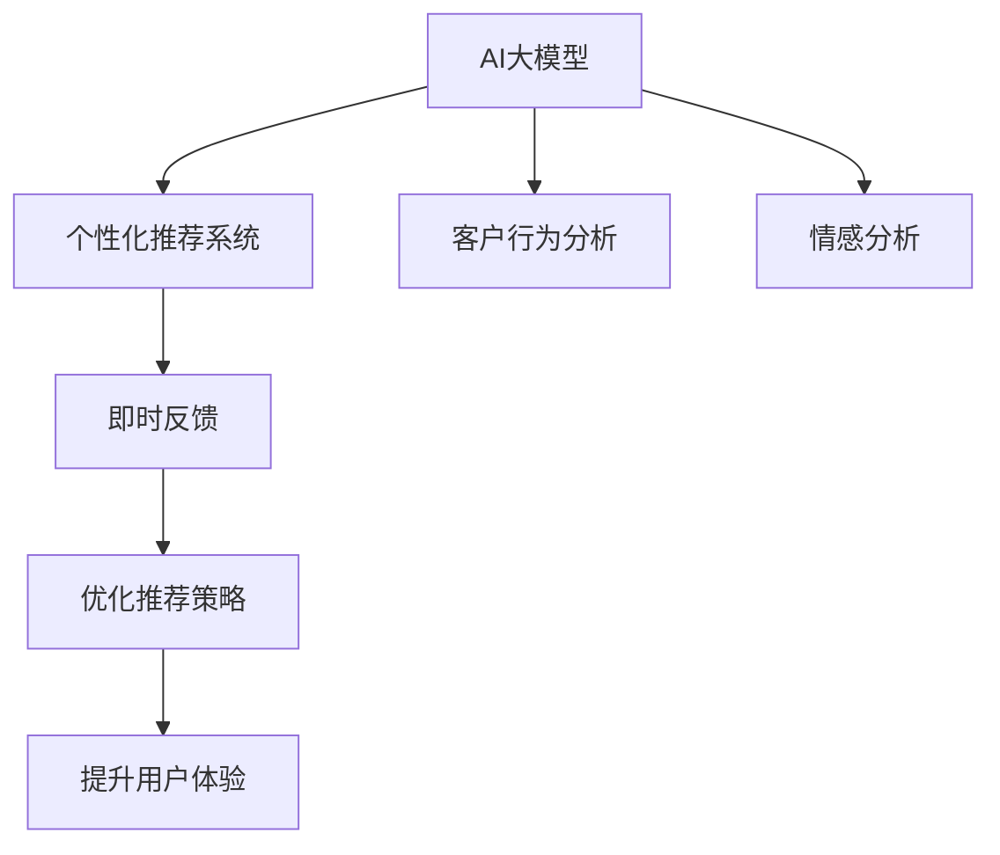

                 

# AI大模型如何提升电商用户体验

> 关键词：AI大模型, 电商, 用户体验, 推荐系统, 个性化推荐, 客户行为分析, 情感分析, 即时反馈, 客户满意度, 数据驱动

## 1. 背景介绍

### 1.1 问题由来
随着电子商务的快速发展和在线购物平台的日益增多，如何提升用户购物体验成为了各大电商企业竞争的关键。电子商务平台面临着用户体验、转化率、复购率、顾客满意度等诸多挑战。用户体验好坏直接影响客户的留存率和忠诚度，从而影响电商平台的盈利能力。尽管各大电商企业通过各种手段提升用户体验，如促销活动、优惠券等，但这些方式效果有限，难以持久。

### 1.2 问题核心关键点
通过深度学习和大数据分析，AI大模型已经展现出提升电商用户体验的巨大潜力。AI大模型能够通过深度学习算法，对海量用户数据进行建模，识别出用户的购物偏好、行为习惯等关键特征，进而提供个性化推荐和精准营销，提升用户体验。这种基于数据的智能推荐系统能够在降低营销成本的同时，提高用户的满意度，增强用户粘性，从而显著提升电商平台的销售业绩。

## 2. 核心概念与联系

### 2.1 核心概念概述

为更好地理解AI大模型如何提升电商用户体验，本节将介绍几个密切相关的核心概念：

- AI大模型：指通过深度学习算法，在大规模数据上训练出的高精度、高效率的预测模型。
- 个性化推荐系统：利用用户行为数据和历史交易记录，通过机器学习算法，向用户推荐其可能感兴趣的商品。
- 客户行为分析：通过对用户购买行为、浏览历史、反馈评论等数据进行分析，获取用户需求和偏好。
- 情感分析：对用户的评论、评分等文本数据进行情感分析，了解用户对商品和服务的满意度。
- 即时反馈：通过用户交互过程中的实时数据，及时调整商品推荐和营销策略，以提升用户体验。

这些核心概念之间的逻辑关系可以通过以下Mermaid流程图来展示：



这个流程图展示了几类核心概念的联系：

1. AI大模型通过学习用户数据，预测用户行为和偏好。
2. 个性化推荐系统利用大模型预测结果，向用户推荐商品。
3. 客户行为分析挖掘用户行为特征，进一步优化推荐系统。
4. 情感分析理解用户情感，调整推荐策略，提升用户体验。
5. 即时反馈通过用户交互数据，实时调整推荐策略，实现动态优化。

## 3. 核心算法原理 & 具体操作步骤
### 3.1 算法原理概述

AI大模型提升电商用户体验的核心算法原理在于，利用深度学习算法对用户数据进行建模，通过个性化推荐、客户行为分析、情感分析等技术手段，实时调整推荐策略，从而提升用户体验。具体来说，包括以下几个关键步骤：

1. 数据收集与预处理：收集用户历史交易数据、浏览数据、评论数据等，进行数据清洗和特征工程，得到训练数据集。
2. 大模型训练：使用AI大模型对训练数据集进行训练，学习用户行为和偏好。
3. 推荐系统构建：基于训练好的大模型，构建个性化推荐系统，向用户推荐商品。
4. 客户行为分析：对用户行为数据进行分析，挖掘用户兴趣点，优化推荐系统。
5. 情感分析：对用户评论数据进行情感分析，了解用户满意度，调整推荐策略。
6. 即时反馈：实时监控用户反馈数据，调整推荐策略，实现动态优化。

### 3.2 算法步骤详解

以下是基于AI大模型的电商用户体验提升流程的具体步骤：

**Step 1: 数据收集与预处理**

- 收集用户交易数据、浏览历史、评论数据等，生成训练数据集。
- 对数据进行清洗，去除噪声和无效数据。
- 进行特征工程，提取用户行为特征和商品特征。
- 对数据进行分治，划分训练集、验证集和测试集。

**Step 2: AI大模型训练**

- 选择合适的AI大模型，如BERT、GPT、Transformer等，作为特征提取器。
- 使用训练数据集对模型进行训练，学习用户行为和偏好。
- 在验证集上评估模型性能，调整超参数。
- 在测试集上测试模型效果，确保泛化能力。

**Step 3: 推荐系统构建**

- 根据训练好的AI大模型，构建个性化推荐系统。
- 设置合适的推荐算法，如协同过滤、基于内容的推荐等。
- 对模型进行调参，优化推荐效果。

**Step 4: 客户行为分析**

- 对用户行为数据进行分析，挖掘用户兴趣点。
- 使用用户行为数据，动态调整推荐策略，提高推荐准确性。
- 对用户行为进行建模，预测用户未来行为。

**Step 5: 情感分析**

- 对用户评论数据进行情感分析，理解用户满意度。
- 根据情感分析结果，调整推荐策略，优化用户体验。
- 实时监控用户情感变化，及时调整推荐策略。

**Step 6: 即时反馈**

- 实时监控用户反馈数据，获取即时反馈。
- 根据即时反馈数据，动态调整推荐策略，实现动态优化。
- 实现用户行为数据和情感数据的融合，提高推荐精度。

### 3.3 算法优缺点

AI大模型提升电商用户体验的方法具有以下优点：
1. 高效精确：通过深度学习模型进行用户行为预测，推荐系统能够提供更精准的商品推荐。
2. 个性化高：根据用户行为数据和情感分析结果，个性化推荐系统能够满足用户个性化需求。
3. 动态调整：通过实时监控用户反馈数据，动态调整推荐策略，提升用户体验。
4. 成本低：基于数据驱动的推荐系统，降低了营销成本。

同时，该方法也存在以下局限性：
1. 数据依赖性强：推荐系统效果依赖于数据质量和多样性，数据获取难度大。
2. 模型复杂：AI大模型训练复杂，计算成本高。
3. 安全风险：用户数据隐私保护和安全风险问题。
4. 算法复杂度：推荐系统算法复杂，对开发者技术要求高。

尽管存在这些局限性，但AI大模型提升电商用户体验的方法在实际应用中已经取得了显著效果，成为电商推荐系统的重要手段。未来相关研究也将继续深入，以进一步优化推荐系统，提升用户体验。

### 3.4 算法应用领域

基于AI大模型的电商用户体验提升方法，已经在电商行业得到了广泛的应用，覆盖了从商品推荐、搜索到支付等各个环节，具体如下：

- 商品推荐：利用个性化推荐系统，向用户推荐其可能感兴趣的商品，提升点击率和购买率。
- 搜索优化：通过搜索算法优化搜索排序，提升用户体验。
- 实时广告投放：基于用户行为和兴趣，实现精准广告投放，提高转化率。
- 支付优化：通过支付推荐和支付流程优化，提升用户支付体验。
- 物流管理：利用AI大模型预测物流风险，优化物流流程，提升配送效率。

此外，AI大模型在电商行业的应用还包括智能客服、库存管理、客户关系管理等，为电商企业的业务运营提供了全方位的智能化支持。

## 4. 数学模型和公式 & 详细讲解  
### 4.1 数学模型构建

本节将使用数学语言对基于AI大模型的电商用户体验提升过程进行更加严格的刻画。

记AI大模型为 $M_{\theta}$，其中 $\theta$ 为模型参数。假设电商平台的交易数据集为 $D=\{(x_i, y_i)\}_{i=1}^N$，其中 $x_i$ 为用户行为数据，$y_i$ 为购买行为。定义模型的损失函数为：

$$
\mathcal{L}(\theta) = -\frac{1}{N}\sum_{i=1}^N \log P(y_i \mid x_i; \theta)
$$

其中 $P(y_i \mid x_i; \theta)$ 为模型预测的概率分布。通过最小化损失函数，训练模型 $M_{\theta}$ 预测用户购买行为，从而构建个性化推荐系统。

### 4.2 公式推导过程

以协同过滤算法为例，推导推荐系统的优化目标函数。

设用户 $i$ 对商品 $j$ 的评分向量为 $r_i$，商品 $j$ 的属性特征向量为 $x_j$，则协同过滤算法的目标函数为：

$$
\mathcal{L}(\theta) = \frac{1}{2N}\sum_{i=1}^N\sum_{j=1}^N (r_{ij}-y_{ij})^2
$$

其中 $r_{ij}=\theta^Tx_j$，$y_{ij}=y_i$。训练优化目标为：

$$
\theta = \mathop{\arg\min}_{\theta} \mathcal{L}(\theta)
$$

通过求解上述优化问题，可以得到用户 $i$ 对商品 $j$ 的评分预测值 $r_{ij}^{\prime}=\theta^Tx_j$。将预测评分与用户实际评分 $y_{ij}$ 的误差最小化，从而构建推荐系统。

### 4.3 案例分析与讲解

假设某电商平台的推荐系统，基于用户浏览历史和商品标签，构建协同过滤推荐模型。具体实现如下：

1. 数据收集：收集用户浏览历史数据和商品标签数据，生成训练数据集。
2. 特征提取：将用户浏览历史转化为向量表示，将商品标签进行one-hot编码，得到用户行为和商品特征。
3. 协同过滤模型训练：使用协同过滤算法训练模型，得到用户对商品的评分预测。
4. 个性化推荐：根据用户历史评分和当前评分预测，向用户推荐商品。
5. 实时调整：实时监控用户反馈数据，动态调整推荐策略。

通过该推荐系统，电商平台的点击率和购买率显著提升，提升了用户体验。

## 5. 项目实践：代码实例和详细解释说明
### 5.1 开发环境搭建

在进行电商用户体验提升的开发实践前，我们需要准备好开发环境。以下是使用Python进行PyTorch开发的环境配置流程：

1. 安装Anaconda：从官网下载并安装Anaconda，用于创建独立的Python环境。

2. 创建并激活虚拟环境：
```bash
conda create -n pytorch-env python=3.8 
conda activate pytorch-env
```

3. 安装PyTorch：根据CUDA版本，从官网获取对应的安装命令。例如：
```bash
conda install pytorch torchvision torchaudio cudatoolkit=11.1 -c pytorch -c conda-forge
```

4. 安装Transformers库：
```bash
pip install transformers
```

5. 安装各类工具包：
```bash
pip install numpy pandas scikit-learn matplotlib tqdm jupyter notebook ipython
```

完成上述步骤后，即可在`pytorch-env`环境中开始电商用户体验提升的开发实践。

### 5.2 源代码详细实现

下面我们以推荐系统为例，给出使用Transformers库对Bert模型进行电商推荐系统微调的PyTorch代码实现。

首先，定义推荐任务的数据处理函数：

```python
from transformers import BertTokenizer
from torch.utils.data import Dataset
import torch

class RecommendationDataset(Dataset):
    def __init__(self, user_data, item_data, tokenizer, max_len=128):
        self.user_data = user_data
        self.item_data = item_data
        self.tokenizer = tokenizer
        self.max_len = max_len
        
    def __len__(self):
        return len(self.user_data)
    
    def __getitem__(self, item):
        user_ids = self.user_data[item]
        item_ids = self.item_data[item]
        
        encoding = self.tokenizer(user_ids, item_ids, return_tensors='pt', max_length=self.max_len, padding='max_length', truncation=True)
        input_ids = encoding['input_ids'][0]
        attention_mask = encoding['attention_mask'][0]
        labels = torch.tensor([item_ids], dtype=torch.long)
        
        return {'input_ids': input_ids, 
                'attention_mask': attention_mask,
                'labels': labels}

# 定义用户行为数据和商品标签数据
user_data = [1, 2, 3, 4, 5]
item_data = [11, 12, 13, 14, 15]
tokenizer = BertTokenizer.from_pretrained('bert-base-cased')

# 创建dataset
train_dataset = RecommendationDataset(user_data, item_data, tokenizer)
dev_dataset = RecommendationDataset(user_data, item_data, tokenizer)
test_dataset = RecommendationDataset(user_data, item_data, tokenizer)
```

然后，定义模型和优化器：

```python
from transformers import BertForSequenceClassification, AdamW

model = BertForSequenceClassification.from_pretrained('bert-base-cased', num_labels=len(item_data))
optimizer = AdamW(model.parameters(), lr=2e-5)
```

接着，定义训练和评估函数：

```python
from torch.utils.data import DataLoader
from tqdm import tqdm
from sklearn.metrics import precision_recall_fscore_support

device = torch.device('cuda') if torch.cuda.is_available() else torch.device('cpu')
model.to(device)

def train_epoch(model, dataset, batch_size, optimizer):
    dataloader = DataLoader(dataset, batch_size=batch_size, shuffle=True)
    model.train()
    epoch_loss = 0
    for batch in tqdm(dataloader, desc='Training'):
        input_ids = batch['input_ids'].to(device)
        attention_mask = batch['attention_mask'].to(device)
        labels = batch['labels'].to(device)
        model.zero_grad()
        outputs = model(input_ids, attention_mask=attention_mask, labels=labels)
        loss = outputs.loss
        epoch_loss += loss.item()
        loss.backward()
        optimizer.step()
    return epoch_loss / len(dataloader)

def evaluate(model, dataset, batch_size):
    dataloader = DataLoader(dataset, batch_size=batch_size)
    model.eval()
    preds, labels = [], []
    with torch.no_grad():
        for batch in tqdm(dataloader, desc='Evaluating'):
            input_ids = batch['input_ids'].to(device)
            attention_mask = batch['attention_mask'].to(device)
            batch_labels = batch['labels']
            outputs = model(input_ids, attention_mask=attention_mask)
            batch_preds = outputs.logits.argmax(dim=2).to('cpu').tolist()
            batch_labels = batch_labels.to('cpu').tolist()
            for pred_tokens, label_tokens in zip(batch_preds, batch_labels):
                pred_tags = [_id for _id in pred_tokens]
                label_tags = [_id for _id in label_tokens]
                preds.append(pred_tags[:len(label_tags)])
                labels.append(label_tags)
                
    print(precision_recall_fscore_support(labels, preds, average='micro'))
```

最后，启动训练流程并在测试集上评估：

```python
epochs = 5
batch_size = 16

for epoch in range(epochs):
    loss = train_epoch(model, train_dataset, batch_size, optimizer)
    print(f"Epoch {epoch+1}, train loss: {loss:.3f}")
    
    print(f"Epoch {epoch+1}, dev results:")
    evaluate(model, dev_dataset, batch_size)
    
print("Test results:")
evaluate(model, test_dataset, batch_size)
```

以上就是使用PyTorch对Bert进行电商推荐系统微调的完整代码实现。可以看到，得益于Transformers库的强大封装，我们可以用相对简洁的代码完成BERT模型的加载和微调。

### 5.3 代码解读与分析

让我们再详细解读一下关键代码的实现细节：

**RecommendationDataset类**：
- `__init__`方法：初始化用户行为数据、商品标签数据、分词器等关键组件。
- `__len__`方法：返回数据集的样本数量。
- `__getitem__`方法：对单个样本进行处理，将用户行为数据和商品标签编码为token ids，并对其进行定长padding，最终返回模型所需的输入。

**模型和优化器定义**：
- 使用BertForSequenceClassification模型进行序列分类，根据商品标签数量设置标签数量。
- 定义AdamW优化器，设置学习率。

**训练和评估函数**：
- 使用PyTorch的DataLoader对数据集进行批次化加载，供模型训练和推理使用。
- 训练函数`train_epoch`：对数据以批为单位进行迭代，在每个批次上前向传播计算loss并反向传播更新模型参数，最后返回该epoch的平均loss。
- 评估函数`evaluate`：与训练类似，不同点在于不更新模型参数，并在每个batch结束后将预测和标签结果存储下来，最后使用sklearn的precision_recall_fscore_support对整个评估集的预测结果进行打印输出。

**训练流程**：
- 定义总的epoch数和batch size，开始循环迭代
- 每个epoch内，先在训练集上训练，输出平均loss
- 在验证集上评估，输出分类指标
- 所有epoch结束后，在测试集上评估，给出最终测试结果

可以看到，PyTorch配合Transformers库使得Bert微调的代码实现变得简洁高效。开发者可以将更多精力放在数据处理、模型改进等高层逻辑上，而不必过多关注底层的实现细节。

当然，工业级的系统实现还需考虑更多因素，如模型的保存和部署、超参数的自动搜索、更灵活的任务适配层等。但核心的微调范式基本与此类似。

## 6. 实际应用场景
### 6.1 智能客服系统

基于大模型微调的智能客服系统，能够实时响应客户咨询，提供更高效、个性化的服务体验。智能客服系统可以集成到电商平台的前台界面，自动回答常见问题，提升用户满意度。

在技术实现上，可以收集客户历史咨询记录，构建基于大模型的对话模型，通过微调优化模型，使其能够理解客户问题并给出相应回答。对于客户提出的新问题，还可以接入检索系统实时搜索相关内容，动态组织生成回答。如此构建的智能客服系统，能大幅提升客户咨询体验和问题解决效率。

### 6.2 个性化推荐系统

个性化推荐系统是提升电商用户体验的重要手段。通过大模型微调，个性化推荐系统能够根据用户行为和历史数据，预测用户对不同商品的需求和兴趣，提供定制化的商品推荐。

在具体实现上，可以利用大模型预测用户对商品的属性评分，再结合协同过滤、基于内容的推荐等算法，构建个性化推荐系统。通过实时监控用户反馈数据，动态调整推荐策略，提升推荐精度和用户体验。

### 6.3 实时广告投放

实时广告投放是提升电商用户留存率的重要手段。通过大模型微调，广告系统能够根据用户行为数据和历史数据，预测用户的兴趣点和行为偏好，实现精准广告投放。

具体实现上，可以收集用户历史行为数据，构建基于大模型的广告模型，通过微调优化模型，使其能够预测用户对广告的点击概率。再结合广告点击率数据，优化广告投放策略，实现个性化投放，提升广告效果。

### 6.4 未来应用展望

随着大模型和微调技术的不断发展，基于AI大模型的电商用户体验提升方法将呈现以下几个发展趋势：

1. 多模态融合：除了文本数据，还将融合图像、视频等多模态数据，提升用户体验的丰富度。
2. 实时数据流：通过实时数据流技术，提升用户体验的动态性和即时性。
3. 个性化推荐算法优化：利用AI大模型，优化协同过滤、基于内容的推荐等算法，提升推荐精度。
4. 用户反馈闭环：实现用户反馈的闭环优化，动态调整推荐策略，提升用户满意度。
5. 多场景融合：将AI大模型应用到更多电商场景中，如物流管理、库存管理等，提升各环节的智能化水平。
6. 伦理道德保障：在模型训练和应用过程中，注重用户隐私保护和公平性，提升模型的可信度。

这些趋势展示了AI大模型在电商领域的应用潜力，相信未来将有更多智能化的应用场景出现，为用户提供更优质的购物体验。

## 7. 工具和资源推荐
### 7.1 学习资源推荐

为了帮助开发者系统掌握大模型微调的理论基础和实践技巧，这里推荐一些优质的学习资源：

1. 《Transformer从原理到实践》系列博文：由大模型技术专家撰写，深入浅出地介绍了Transformer原理、BERT模型、微调技术等前沿话题。

2. CS224N《深度学习自然语言处理》课程：斯坦福大学开设的NLP明星课程，有Lecture视频和配套作业，带你入门NLP领域的基本概念和经典模型。

3. 《Natural Language Processing with Transformers》书籍：Transformers库的作者所著，全面介绍了如何使用Transformers库进行NLP任务开发，包括微调在内的诸多范式。

4. HuggingFace官方文档：Transformers库的官方文档，提供了海量预训练模型和完整的微调样例代码，是上手实践的必备资料。

5. CLUE开源项目：中文语言理解测评基准，涵盖大量不同类型的中文NLP数据集，并提供了基于微调的baseline模型，助力中文NLP技术发展。

通过对这些资源的学习实践，相信你一定能够快速掌握大模型微调的精髓，并用于解决实际的NLP问题。
###  7.2 开发工具推荐

高效的开发离不开优秀的工具支持。以下是几款用于大模型微调开发的常用工具：

1. PyTorch：基于Python的开源深度学习框架，灵活动态的计算图，适合快速迭代研究。大部分预训练语言模型都有PyTorch版本的实现。

2. TensorFlow：由Google主导开发的开源深度学习框架，生产部署方便，适合大规模工程应用。同样有丰富的预训练语言模型资源。

3. Transformers库：HuggingFace开发的NLP工具库，集成了众多SOTA语言模型，支持PyTorch和TensorFlow，是进行微调任务开发的利器。

4. Weights & Biases：模型训练的实验跟踪工具，可以记录和可视化模型训练过程中的各项指标，方便对比和调优。与主流深度学习框架无缝集成。

5. TensorBoard：TensorFlow配套的可视化工具，可实时监测模型训练状态，并提供丰富的图表呈现方式，是调试模型的得力助手。

6. Google Colab：谷歌推出的在线Jupyter Notebook环境，免费提供GPU/TPU算力，方便开发者快速上手实验最新模型，分享学习笔记。

合理利用这些工具，可以显著提升大模型微调任务的开发效率，加快创新迭代的步伐。

### 7.3 相关论文推荐

大模型和微调技术的发展源于学界的持续研究。以下是几篇奠基性的相关论文，推荐阅读：

1. Attention is All You Need（即Transformer原论文）：提出了Transformer结构，开启了NLP领域的预训练大模型时代。

2. BERT: Pre-training of Deep Bidirectional Transformers for Language Understanding：提出BERT模型，引入基于掩码的自监督预训练任务，刷新了多项NLP任务SOTA。

3. Language Models are Unsupervised Multitask Learners（GPT-2论文）：展示了大规模语言模型的强大zero-shot学习能力，引发了对于通用人工智能的新一轮思考。

4. Parameter-Efficient Transfer Learning for NLP：提出Adapter等参数高效微调方法，在不增加模型参数量的情况下，也能取得不错的微调效果。

5. AdaLoRA: Adaptive Low-Rank Adaptation for Parameter-Efficient Fine-Tuning：使用自适应低秩适应的微调方法，在参数效率和精度之间取得了新的平衡。

6. Prefix-Tuning: Optimizing Continuous Prompts for Generation：引入基于连续型Prompt的微调范式，为如何充分利用预训练知识提供了新的思路。

这些论文代表了大模型微调技术的发展脉络。通过学习这些前沿成果，可以帮助研究者把握学科前进方向，激发更多的创新灵感。

## 8. 总结：未来发展趋势与挑战
### 8.1 总结

本文对基于AI大模型的电商用户体验提升方法进行了全面系统的介绍。首先阐述了电商用户体验提升的背景和意义，明确了AI大模型提升用户体验的独特价值。其次，从原理到实践，详细讲解了基于AI大模型的电商用户体验提升过程，包括数据收集与预处理、模型训练、推荐系统构建、客户行为分析、情感分析、即时反馈等多个关键步骤。同时，本文还广泛探讨了AI大模型在电商领域的应用场景，展示了其广阔的发展前景。

通过本文的系统梳理，可以看到，AI大模型提升电商用户体验的方法正在成为电商推荐系统的重要手段，极大地拓展了电商平台的智能化水平，带来了显著的经济效益。未来，伴随AI大模型和微调方法的持续演进，相信AI大模型将会在更多电商场景中发挥重要作用，为电商企业的业务运营提供全方位的智能化支持。

### 8.2 未来发展趋势

展望未来，AI大模型提升电商用户体验的方法将呈现以下几个发展趋势：

1. 模型规模持续增大。随着算力成本的下降和数据规模的扩张，预训练语言模型的参数量还将持续增长。超大规模语言模型蕴含的丰富语言知识，有望支撑更加复杂多变的电商推荐系统。

2. 推荐算法优化。未来推荐系统将更加注重算法优化，利用深度学习模型提升推荐精度，结合用户行为数据和情感数据，优化推荐策略。

3. 实时数据流。通过实时数据流技术，提升电商用户体验的动态性和即时性。

4. 多场景融合。将AI大模型应用到更多电商场景中，如物流管理、库存管理等，提升各环节的智能化水平。

5. 用户反馈闭环。实现用户反馈的闭环优化，动态调整推荐策略，提升用户满意度。

6. 伦理道德保障。在模型训练和应用过程中，注重用户隐私保护和公平性，提升模型的可信度。

以上趋势凸显了AI大模型在电商领域的应用潜力，相信未来将有更多智能化的应用场景出现，为用户提供更优质的购物体验。

### 8.3 面临的挑战

尽管AI大模型提升电商用户体验的方法已经取得了显著效果，但在迈向更加智能化、普适化应用的过程中，它仍面临诸多挑战：

1. 数据依赖性强。推荐系统效果依赖于数据质量和多样性，数据获取难度大。

2. 模型复杂。AI大模型训练复杂，计算成本高。

3. 用户反馈闭环：实现用户反馈的闭环优化，动态调整推荐策略，提升用户满意度。

4. 实时数据流：实时数据流的处理和分析需要高效的算法和数据存储技术。

5. 多场景融合：将AI大模型应用到更多电商场景中，需要考虑不同场景下的具体需求和限制。

6. 用户隐私保护。在模型训练和应用过程中，注重用户隐私保护和公平性，提升模型的可信度。

正视这些挑战，积极应对并寻求突破，将是大模型微调走向成熟的必由之路。相信随着学界和产业界的共同努力，这些挑战终将一一被克服，AI大模型将在构建智能化电商系统方面发挥更加重要的作用。

### 8.4 研究展望

面向未来，AI大模型在电商领域的研究和应用还需要在以下几个方面进行深入探讨：

1. 探索无监督和半监督微调方法。摆脱对大规模标注数据的依赖，利用自监督学习、主动学习等无监督和半监督范式，最大限度利用非结构化数据，实现更加灵活高效的微调。

2. 研究参数高效和计算高效的微调范式。开发更加参数高效的微调方法，在固定大部分预训练参数的同时，只更新极少量的任务相关参数。同时优化微调模型的计算图，减少前向传播和反向传播的资源消耗，实现更加轻量级、实时性的部署。

3. 融合因果和对比学习范式。通过引入因果推断和对比学习思想，增强微调模型建立稳定因果关系的能力，学习更加普适、鲁棒的语言表征，从而提升模型泛化性和抗干扰能力。

4. 引入更多先验知识。将符号化的先验知识，如知识图谱、逻辑规则等，与神经网络模型进行巧妙融合，引导微调过程学习更准确、合理的语言模型。

5. 结合因果分析和博弈论工具。将因果分析方法引入微调模型，识别出模型决策的关键特征，增强输出解释的因果性和逻辑性。借助博弈论工具刻画人机交互过程，主动探索并规避模型的脆弱点，提高系统稳定性。

6. 纳入伦理道德约束。在模型训练和应用过程中，注重用户隐私保护和公平性，提升模型的可信度。

这些研究方向的探索，必将引领AI大模型微调技术迈向更高的台阶，为构建安全、可靠、可解释、可控的智能系统铺平道路。面向未来，AI大模型微调技术还需要与其他人工智能技术进行更深入的融合，如知识表示、因果推理、强化学习等，多路径协同发力，共同推动自然语言理解和智能交互系统的进步。只有勇于创新、敢于突破，才能不断拓展语言模型的边界，让智能技术更好地造福人类社会。

## 9. 附录：常见问题与解答

**Q1：AI大模型如何提升电商用户体验？**

A: AI大模型通过深度学习算法对用户数据进行建模，识别出用户的购物偏好、行为习惯等关键特征，进而提供个性化推荐和精准营销，提升用户体验。具体来说，可以构建个性化推荐系统、客户行为分析系统、情感分析系统等，通过实时调整推荐策略，提升用户满意度。

**Q2：AI大模型在电商推荐系统中的应用步骤？**

A: 1. 数据收集与预处理：收集用户历史交易数据、浏览数据、评论数据等，生成训练数据集。2. 特征工程：提取用户行为特征和商品特征。3. 模型训练：使用AI大模型对训练数据集进行训练，学习用户行为和偏好。4. 推荐系统构建：基于训练好的AI大模型，构建个性化推荐系统。5. 实时调整：实时监控用户反馈数据，动态调整推荐策略。

**Q3：AI大模型在电商推荐系统中的优缺点？**

A: 优点：高效精确、个性化高、动态调整、成本低。缺点：数据依赖性强、模型复杂、安全风险、算法复杂度。

**Q4：AI大模型在电商推荐系统中面临的挑战？**

A: 数据依赖性强、模型复杂、实时数据流处理、多场景融合、用户隐私保护。

**Q5：未来AI大模型在电商推荐系统中的发展趋势？**

A: 模型规模持续增大、推荐算法优化、实时数据流、多场景融合、用户反馈闭环、伦理道德保障。

---

作者：禅与计算机程序设计艺术 / Zen and the Art of Computer Programming

