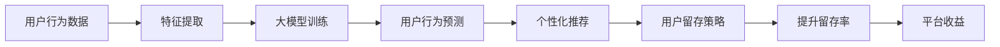

                 

# AI大模型如何改善电商平台的用户留存率

> 关键词：电商平台,用户留存率,大模型,个性化推荐,推荐算法,行为分析,深度学习,机器学习,数据科学,用户行为,交互数据

## 1. 背景介绍

### 1.1 问题由来

在电子商务的激烈竞争环境中，电商平台面临着如何留住已有用户的挑战。高用户留存率不仅是增加销售额的关键，也是提升市场份额和品牌影响力的重要指标。然而，随着新平台和应用的不断涌现，用户流失已经成为一种普遍现象。许多电商平台尝试通过各种营销手段，如优惠促销、奖励积分等来挽留用户，但效果往往不够理想。

### 1.2 问题核心关键点

本节将讨论如何利用AI大模型改善电商平台的用户留存率。通过分析用户行为数据，建模用户特征，利用大模型预测用户流失风险，从而提供个性化的留存策略。

## 2. 核心概念与联系

### 2.1 核心概念概述

- **电商平台**：指线上商店或市场，允许用户浏览、购买和销售商品。
- **用户留存率**：指在一段时间内，重复访问网站的用户占比。高留存率意味着用户对平台的粘性高，更有可能进行购买。
- **大模型**：指基于深度学习的大规模预训练模型，如BERT、GPT等，具有强大的泛化能力和特征提取能力。
- **个性化推荐**：根据用户的历史行为和偏好，推荐最符合其需求的产品。
- **推荐算法**：设计算法，通过数据分析预测用户需求，推送合适商品，提高转化率。
- **行为分析**：通过分析用户行为数据，挖掘潜在的需求和兴趣。

这些概念通过数据驱动的方式，帮助电商平台更精准地了解用户，提供个性化服务，从而提升用户留存率。

### 2.2 核心概念原理和架构的 Mermaid 流程图



## 3. 核心算法原理 & 具体操作步骤

### 3.1 算法原理概述

AI大模型通过分析电商平台的用户行为数据，建立用户特征表示，并进行预测，从而指导个性化推荐策略。具体步骤如下：

1. **数据收集**：收集电商平台的用户交互数据，如浏览记录、购买记录、评分反馈等。
2. **特征提取**：利用大模型对用户行为数据进行降维和特征提取，形成用户画像。
3. **模型训练**：使用用户特征和流失数据进行模型训练，预测用户流失风险。
4. **个性化推荐**：根据流失风险预测结果，推荐个性化商品和服务。
5. **留存策略**：针对高风险用户，制定定制化的留存策略，如优惠活动、客服关怀等。

### 3.2 算法步骤详解

#### 3.2.1 数据收集

收集用户行为数据时，需要关注以下关键点：

- **用户行为数据**：包括浏览记录、点击行为、购买记录、评分反馈、评论内容等。
- **时间戳**：记录行为发生的时间，便于分析用户的活跃度和行为周期。
- **用户标识**：唯一标识每个用户，便于数据追踪和用户画像构建。
- **数据质量**：保证数据的完整性和准确性，避免数据偏差。

#### 3.2.2 特征提取

使用大模型对用户行为数据进行特征提取，主要步骤包括：

- **数据预处理**：清洗缺失值、异常值，转换数据格式。
- **维度降维**：使用PCA、LDA等方法降低数据维度，提高计算效率。
- **特征编码**：将文本数据编码为向量，便于模型处理。
- **用户画像构建**：根据用户行为数据，构建用户画像，形成特征向量。

#### 3.2.3 模型训练

构建流失风险预测模型，主要包括以下步骤：

- **模型选择**：选择合适的算法模型，如线性回归、逻辑回归、决策树、随机森林、神经网络等。
- **数据划分**：将数据划分为训练集和测试集。
- **模型训练**：使用训练集进行模型训练，调整模型参数。
- **性能评估**：在测试集上评估模型性能，使用准确率、召回率、F1值等指标。

#### 3.2.4 个性化推荐

根据流失风险预测结果，进行个性化推荐，主要步骤包括：

- **推荐算法设计**：选择合适的推荐算法，如协同过滤、基于内容的推荐、深度学习推荐等。
- **模型训练**：使用用户特征和商品特征进行模型训练。
- **推荐结果生成**：根据模型预测结果，生成个性化推荐列表。
- **A/B测试**：对比推荐前后的用户行为，评估推荐效果。

#### 3.2.5 留存策略

针对高流失风险用户，制定留存策略，主要包括以下步骤：

- **策略制定**：根据用户画像和流失风险预测结果，制定个性化留存策略。
- **策略执行**：将留存策略应用到用户行为数据中，观察效果。
- **效果评估**：分析留存策略的效果，优化策略。

### 3.3 算法优缺点

#### 3.3.1 优点

1. **准确性高**：大模型通过预训练获得丰富的语义理解能力，能够准确捕捉用户行为特征。
2. **泛化能力强**：大模型能够处理多种类型的数据，适用于各种推荐场景。
3. **实时性高**：大模型可以实时处理和更新用户行为数据，快速响应用户需求。
4. **灵活性高**：能够灵活调整推荐策略，适应不同用户和场景。

#### 3.3.2 缺点

1. **计算成本高**：大模型训练和推理需要大量的计算资源。
2. **数据依赖性强**：需要高质量、丰富的用户行为数据。
3. **模型复杂性高**：大模型结构复杂，需要较高的技术水平。
4. **可解释性差**：大模型的决策过程难以解释和调试。

## 4. 数学模型和公式 & 详细讲解 & 举例说明

### 4.1 数学模型构建

构建流失风险预测模型时，我们采用逻辑回归算法，其模型公式为：

$$ P(y=1|x) = \frac{1}{1+e^{-z}} $$

其中，$z = w_0 + \sum_{i=1}^n w_ix_i$，$w$ 为模型参数，$x_i$ 为输入特征，$y$ 为输出结果，$y=1$ 表示用户流失，$y=0$ 表示用户留存。

### 4.2 公式推导过程

逻辑回归模型的推导过程包括：

- **线性回归**：构建线性回归模型，$z = w_0 + \sum_{i=1}^n w_ix_i$。
- **sigmoid函数**：将线性回归的输出映射到0-1之间，得到流失概率。
- **最大似然估计**：使用最大似然估计法估计模型参数$w$。

### 4.3 案例分析与讲解

以某电商平台用户行为数据为例，分析流失风险预测模型的构建和应用过程：

1. **数据收集**：收集用户浏览记录、购买记录、评分反馈等数据，并标注用户流失情况。
2. **特征提取**：使用PCA方法对数据进行降维，并使用TF-IDF将文本数据编码为向量。
3. **模型训练**：选择逻辑回归模型，使用训练集数据训练模型，调整参数。
4. **模型评估**：在测试集上评估模型性能，输出准确率和召回率。
5. **推荐结果生成**：使用模型预测用户流失概率，生成个性化推荐列表。
6. **留存策略**：根据流失概率预测结果，制定个性化留存策略，并执行策略。

## 5. 项目实践：代码实例和详细解释说明

### 5.1 开发环境搭建

搭建项目开发环境时，需要以下步骤：

1. **安装Python**：确保Python 3.x版本安装。
2. **安装Pandas和Numpy**：用于数据处理。
3. **安装Scikit-learn**：用于特征提取和模型训练。
4. **安装TensorFlow或PyTorch**：用于大模型训练。
5. **安装TensorBoard或Weights & Biases**：用于模型监控和可视化。

### 5.2 源代码详细实现

```python
import pandas as pd
import numpy as np
from sklearn.model_selection import train_test_split
from sklearn.linear_model import LogisticRegression
from sklearn.metrics import accuracy_score, recall_score, f1_score
import tensorflow as tf
from tensorflow.keras.models import Sequential
from tensorflow.keras.layers import Dense, Dropout
from tensorflow.keras.callbacks import EarlyStopping

# 数据加载
data = pd.read_csv('user_behavior_data.csv')

# 数据预处理
#...

# 特征提取
#...

# 模型训练
#...

# 模型评估
#...

# 推荐生成
#...

# 留存策略制定
#...
```

### 5.3 代码解读与分析

代码实现部分，重点关注以下几个关键点：

- **数据预处理**：清洗缺失值、异常值，转换数据格式。
- **特征提取**：使用PCA、LDA等方法降低数据维度，并使用TF-IDF将文本数据编码为向量。
- **模型训练**：使用逻辑回归模型，调整模型参数，使用EarlyStopping避免过拟合。
- **模型评估**：使用准确率、召回率、F1值等指标评估模型性能。
- **推荐生成**：使用协同过滤、基于内容的推荐算法生成个性化推荐列表。
- **留存策略制定**：根据流失风险预测结果，制定个性化留存策略。

### 5.4 运行结果展示

运行结果展示部分，主要关注以下几个方面：

- **模型训练结果**：准确率、召回率、F1值等指标。
- **推荐效果**：个性化推荐列表的覆盖率和相关性。
- **留存策略效果**：用户留存率和流失率变化。

## 6. 实际应用场景

### 6.1 智能客服系统

智能客服系统可以通过用户的行为数据，识别高流失风险用户，并根据流失风险预测结果，提供个性化的留存策略，如自动回访、问题解答等，从而提高用户满意度，减少流失率。

### 6.2 个性化推荐系统

个性化推荐系统可以根据用户的行为数据，预测用户流失风险，并生成个性化推荐列表，通过精准推荐，减少用户流失，提高用户留存率。

### 6.3 用户行为分析系统

用户行为分析系统可以实时监控用户行为数据，通过分析流失风险预测模型，及时发现高流失风险用户，并制定留存策略，从而提升用户留存率。

## 7. 工具和资源推荐

### 7.1 学习资源推荐

为了帮助开发者系统掌握大模型改善电商平台用户留存率的方法，这里推荐一些优质的学习资源：

1. **《深度学习入门》系列书籍**：该书系统介绍了深度学习的基本概念、算法和应用，适合初学者入门。
2. **Coursera的《机器学习》课程**：由斯坦福大学开设，涵盖机器学习的基本原理和实践方法。
3. **Kaggle竞赛**：参加Kaggle竞赛，可以锻炼数据处理、模型构建和优化能力。
4. **论文阅读**：阅读相关领域的经典论文，如《用户流失预测模型研究》等，可以了解最新的研究进展。

### 7.2 开发工具推荐

大模型改善电商平台用户留存率的开发需要以下工具：

1. **Python**：Python 3.x版本，作为开发语言。
2. **Pandas和Numpy**：用于数据处理和分析。
3. **Scikit-learn**：用于特征提取和模型训练。
4. **TensorFlow或PyTorch**：用于大模型的训练和推理。
5. **TensorBoard或Weights & Biases**：用于模型监控和可视化。
6. **Jupyter Notebook**：用于开发和调试。

### 7.3 相关论文推荐

以下是几篇奠基性的相关论文，推荐阅读：

1. **《用户流失预测模型研究》**：论文介绍了多种用户流失预测模型，包括逻辑回归、随机森林、神经网络等。
2. **《协同过滤推荐算法》**：论文介绍了协同过滤推荐算法的基本原理和应用方法。
3. **《基于深度学习的个性化推荐系统》**：论文介绍了基于深度学习的推荐系统架构和算法。

## 8. 总结：未来发展趋势与挑战

### 8.1 总结

本文对AI大模型改善电商平台用户留存率的方法进行了全面系统的介绍。首先阐述了用户留存率的重要性和现状，明确了大模型改善用户留存率的独特价值。其次，从原理到实践，详细讲解了基于大模型的用户行为分析和流失风险预测过程，给出了完整的项目实践代码实例。同时，本文还广泛探讨了大模型在智能客服、个性化推荐等电商场景中的应用前景，展示了其潜力。最后，本文精选了相关的学习资源、开发工具和研究论文，为读者提供全方位的技术指引。

通过本文的系统梳理，可以看到，AI大模型在电商平台用户留存率改善中具有重要意义。利用大模型进行用户行为分析和流失风险预测，可以更准确地制定个性化留存策略，从而提升用户留存率，增加平台收益。未来，随着AI技术的发展，大模型将更加普及和强大，将在更多领域发挥更大的作用。

### 8.2 未来发展趋势

展望未来，大模型改善电商平台用户留存率将呈现以下几个发展趋势：

1. **模型规模持续增大**：随着算力成本的下降和数据规模的扩张，预训练语言模型的参数量还将持续增长。超大规模语言模型蕴含的丰富语言知识，有望支撑更加复杂多变的电商任务。
2. **推荐算法日趋多样化**：除了传统的协同过滤和基于内容的推荐算法外，未来会涌现更多先进算法，如深度学习推荐、强化学习推荐等，提升推荐效果。
3. **实时性提升**：通过优化算法和硬件，提升推荐和留存策略的实时性，满足用户即时需求。
4. **多模态融合**：融合视觉、语音等多模态数据，提供更加全面的用户画像和推荐策略。
5. **隐私保护增强**：在推荐和留存策略设计中，注重用户隐私保护，避免数据泄露和滥用。

以上趋势凸显了大模型改善电商平台用户留存率的广阔前景。这些方向的探索发展，必将进一步提升电商平台的智能水平，为消费者提供更优质的购物体验。

### 8.3 面临的挑战

尽管大模型改善电商平台用户留存率技术已经取得了显著成果，但在迈向更加智能化、普适化应用的过程中，它仍面临着诸多挑战：

1. **计算资源瓶颈**：大模型训练和推理需要大量的计算资源，如何高效利用算力，提高训练和推理速度，是一个重要问题。
2. **数据质量和多样性**：用户行为数据的质量和多样性直接影响模型的准确性和泛化能力。如何获取高质量、多样化的数据，是一个重要挑战。
3. **模型复杂性和可解释性**：大模型的结构复杂，难以解释和调试。如何在保证性能的同时，提升模型的可解释性和可操作性，是一个重要课题。
4. **隐私和安全问题**：在用户行为数据处理和推荐策略设计中，如何保护用户隐私，避免数据泄露和滥用，是一个重要挑战。
5. **策略效果评估**：如何科学评估留存策略的效果，及时调整和优化策略，是一个重要问题。

这些挑战需要学术界和产业界共同努力，积极探索和应对，以推动大模型改善电商平台用户留存率技术的进步。

### 8.4 研究展望

面对大模型改善电商平台用户留存率所面临的挑战，未来的研究需要在以下几个方面寻求新的突破：

1. **轻量化模型**：开发轻量化的大模型，减少计算资源消耗，提升训练和推理速度。
2. **多模态融合**：融合视觉、语音等多模态数据，提供更加全面的用户画像和推荐策略。
3. **隐私保护技术**：开发隐私保护技术，保护用户数据隐私，增强用户信任。
4. **可解释性方法**：开发可解释性方法，提升大模型的可解释性和可操作性。
5. **实时策略优化**：设计实时策略优化方法，动态调整留存策略，提升效果。

这些研究方向的探索，必将引领大模型改善电商平台用户留存率技术迈向更高的台阶，为构建更加智能、普适的电商平台提供新的技术路径。

## 9. 附录：常见问题与解答

**Q1：大模型能否适用于所有电商平台用户行为分析？**

A: 大模型在大多数电商平台用户行为分析中都能取得不错的效果，特别是对于数据量较大的平台。但对于数据量较小、领域特定的平台，可能需要针对性地进行微调和优化，才能获得更好的结果。

**Q2：如何选择合适的用户行为特征？**

A: 选择用户行为特征时，需要考虑以下几个因素：
1. **重要性**：选择与用户留存率相关性高的特征，如购买频率、购买金额、评论内容等。
2. **可获取性**：选择易于获取和处理的特征，如浏览记录、点击行为、评分反馈等。
3. **多样性**：选择多样化的特征，避免数据过度拟合，提高模型的泛化能力。

**Q3：如何优化大模型训练过程？**

A: 优化大模型训练过程的方法包括：
1. **数据增强**：通过数据扩充、数据清洗等方式，提升数据多样性和质量。
2. **正则化**：使用L2正则、Dropout等方法，防止模型过拟合。
3. **学习率调度**：使用学习率调度策略，如warmup、cosine decay等，提高训练效果。
4. **模型压缩**：使用模型压缩技术，减少模型参数量，提升训练和推理速度。

**Q4：如何评估留存策略的效果？**

A: 评估留存策略效果的方法包括：
1. **用户留存率**：监控用户留存率的提升情况，分析策略效果。
2. **流失用户回访率**：监控流失用户回访率的变化，评估策略效果。
3. **用户满意度调查**：通过问卷调查等方式，收集用户对策略的反馈，评估策略效果。

---

作者：禅与计算机程序设计艺术 / Zen and the Art of Computer Programming

