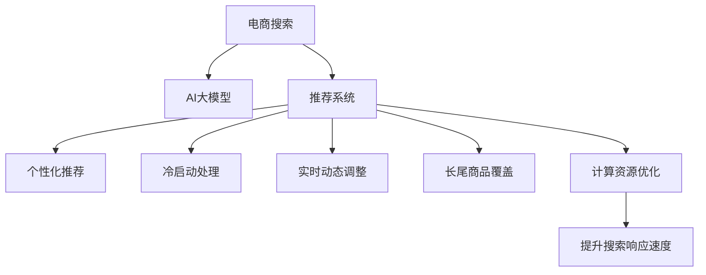

                 

# AI大模型如何改善电商平台的移动搜索体验

## 1. 背景介绍

### 1.1 问题由来

在电商平台上，搜索体验是影响用户购物转化率的关键因素之一。随着用户对移动端搜索引擎的需求日益增长，传统的基于关键词匹配的搜索方式已经无法满足现代用户对商品多样性、个性化和便捷性的需求。当前，电商平台普遍面临以下挑战：

- **个性化不足**：搜索结果过于泛泛，无法精准匹配用户的个性化需求。
- **冷启动问题**：新用户的搜索习惯和偏好尚未建立，导致搜索结果不理想。
- **实时性不足**：搜索结果更新不及时，无法实时反映市场变化。
- **长尾商品覆盖**：常用关键词难以覆盖所有长尾商品，导致搜索结果不全面。
- **计算资源消耗大**：传统搜索算法计算复杂度高，导致响应速度慢。

为了应对这些挑战，电商企业亟需引入先进的AI技术，改进搜索算法，提升搜索体验。这其中，利用AI大模型进行搜索优化是重要手段之一。

### 1.2 问题核心关键点

为了解决上述挑战，AI大模型在电商平台的移动搜索优化中，主要需要关注以下几个核心关键点：

1. **个性化推荐**：通过分析用户的搜索历史、浏览行为和历史购买记录，生成个性化的搜索结果。
2. **冷启动处理**：对于新用户，通过更智能的推荐算法，快速建立其搜索偏好。
3. **实时动态调整**：能够实时更新搜索结果，反映市场变化。
4. **长尾商品覆盖**：能覆盖更多长尾搜索词，提高搜索结果的全面性。
5. **计算效率提升**：优化算法结构，减少计算资源的消耗，提高搜索响应速度。

### 1.3 问题研究意义

通过引入AI大模型进行电商平台搜索优化，可以带来以下几方面的重大意义：

1. **提升用户体验**：通过个性化推荐，用户可以快速找到满意商品，提升购物体验。
2. **增加交易转化率**：个性化搜索结果能更好地满足用户需求，提高交易转化率。
3. **提高搜索效率**：实时动态调整和长尾商品覆盖，能够提升搜索的全面性和准确性。
4. **降低运营成本**：通过优化算法，提高计算效率，降低搜索服务成本。
5. **促进创新发展**：探索更多AI技术在电商搜索中的应用，促进电商行业的创新发展。

## 2. 核心概念与联系

### 2.1 核心概念概述

为更好地理解AI大模型在电商搜索中的应用，本节将介绍几个密切相关的核心概念：

- **电商搜索**：指用户通过电商平台提供的搜索引擎输入关键词，获取相关商品展示的交互过程。
- **AI大模型**：指在大规模数据上预训练的大型神经网络模型，如GPT-3、BERT等，具备强大的自然语言处理能力。
- **推荐系统**：通过分析用户行为和兴趣，向用户推荐相关商品的系统。
- **冷启动问题**：新用户缺乏历史记录，推荐系统难以快速了解其偏好。
- **实时动态调整**：根据市场和用户行为的变化，动态调整搜索结果。
- **长尾商品覆盖**：覆盖更多不常用但有意义的长尾关键词，增加搜索结果的全面性。
- **计算资源优化**：通过算法优化，减少计算资源消耗，提升搜索响应速度。

这些核心概念之间的逻辑关系可以通过以下Mermaid流程图来展示：



这个流程图展示了大模型在电商搜索中的核心概念及其之间的关系：

1. 电商搜索通过大模型进行个性化推荐，满足用户需求。
2. 推荐系统在大模型的基础上，处理冷启动和动态调整等问题，提升用户满意度。
3. 大模型通过长尾覆盖和计算优化，进一步提升搜索效率和用户体验。

## 3. 核心算法原理 & 具体操作步骤
### 3.1 算法原理概述

基于AI大模型的电商搜索优化，本质上是一个结合了推荐系统、自然语言处理和实时搜索的复合算法过程。其核心思想是：利用大模型的强大语义理解能力，结合用户行为数据，生成个性化推荐结果，并在搜索过程中动态调整，以提供实时、精准的搜索结果。

具体来说，电商搜索优化流程包括以下几个关键步骤：

1. **用户输入查询**：用户在移动端输入搜索关键词。
2. **大模型预处理**：将用户输入的文本进行分词、编码等预处理，生成大模型的输入。
3. **搜索结果生成**：通过大模型分析用户输入和历史数据，生成个性化推荐结果。
4. **实时动态调整**：根据用户点击和浏览行为，动态调整搜索结果。
5. **长尾商品覆盖**：覆盖更多长尾搜索词，提供全面、丰富的商品展示。
6. **计算效率优化**：优化算法结构，减少计算资源消耗，提高搜索响应速度。

### 3.2 算法步骤详解

基于AI大模型的电商搜索优化，一般包括以下几个关键步骤：

**Step 1: 数据准备**
- 收集用户搜索历史、浏览记录、购买记录等行为数据。
- 整理商品数据，包括商品描述、类别、价格等信息。
- 对数据进行清洗、标注等预处理，生成训练样本。

**Step 2: 大模型选择与训练**
- 选择合适的大模型作为初始化参数，如BERT、GPT-3等。
- 在大模型顶部设计任务适配层，如分类、回归、匹配等。
- 使用GPU/TPU等高性能设备进行模型训练，最小化损失函数。

**Step 3: 生成个性化推荐**
- 对用户输入的查询进行预处理，生成大模型输入。
- 通过大模型对用户输入和历史数据进行分析，生成个性化推荐结果。
- 根据推荐结果生成商品展示列表，包括图片、价格、销量等信息。

**Step 4: 实时动态调整**
- 根据用户点击和浏览行为，实时调整搜索结果。
- 动态更新推荐算法模型，反映最新的用户行为和市场变化。
- 通过A/B测试等方法，评估搜索结果的改进效果。

**Step 5: 长尾商品覆盖**
- 分析长尾关键词，生成对应的商品推荐。
- 在搜索结果中增加长尾关键词的商品展示。
- 通过冷启动算法，快速适应新用户的搜索需求。

**Step 6: 计算效率优化**
- 优化算法结构，减少计算资源消耗。
- 采用分布式计算、模型压缩等技术，提升搜索响应速度。
- 定期评估和更新模型，保持高效率运行。

### 3.3 算法优缺点

基于AI大模型的电商搜索优化方法具有以下优点：

1. **个性化推荐**：通过分析用户行为，生成个性化推荐结果，提升用户体验。
2. **实时动态调整**：根据用户行为和市场变化，动态调整搜索结果，保持结果的实时性。
3. **长尾商品覆盖**：覆盖更多长尾关键词，增加搜索结果的全面性。
4. **计算效率高**：优化算法结构，减少计算资源消耗，提高搜索响应速度。

同时，该方法也存在一定的局限性：

1. **数据依赖性强**：对用户行为数据的依赖度较高，数据质量直接影响搜索结果。
2. **模型复杂度高**：大模型的训练和维护成本高，需要高性能计算资源。
3. **隐私问题**：用户行为数据的收集和处理可能涉及隐私问题，需要严格遵守相关法律法规。
4. **冷启动问题**：对于新用户，模型难以快速建立其搜索偏好，需要额外处理。
5. **过拟合风险**：模型可能过度拟合历史数据，导致泛化能力不足。

尽管存在这些局限性，但AI大模型在电商搜索优化中的应用仍然具有巨大的潜力，特别是在提升个性化推荐和实时动态调整方面。

### 3.4 算法应用领域

AI大模型在电商平台的移动搜索优化中，已经得到了广泛的应用，具体包括：

1. **商品推荐系统**：通过分析用户历史行为，推荐相关商品，提升购物体验。
2. **智能客服系统**：利用大模型进行自然语言处理，解答用户查询，提供即时帮助。
3. **市场监控系统**：实时监测商品价格、销量等数据，反映市场变化，提供决策支持。
4. **个性化广告投放**：根据用户兴趣，生成个性化广告推荐，提升广告点击率。
5. **用户行为分析**：分析用户行为数据，提供行为分析报告，优化电商运营策略。

除了上述这些应用场景外，AI大模型还创新性地应用于电商平台的库存管理、供应链优化、智能物流等领域，为电商行业带来了新的增长动力。

## 4. 数学模型和公式 & 详细讲解 & 举例说明

### 4.1 数学模型构建

在本节中，我们将使用数学语言对基于AI大模型的电商搜索优化过程进行更加严格的刻画。

假设用户输入的查询为 $q$，历史行为数据为 $D=\{(x_i, y_i)\}_{i=1}^N$，其中 $x_i$ 为用户行为数据，$y_i$ 为相关商品信息。

定义电商搜索优化的目标函数为 $f(q, D)$，即最大化用户满意度 $f(q, D)$。其中用户满意度定义为：

$$
f(q, D) = \sum_{i=1}^N \omega_i r_i(x_i, q, y_i)
$$

其中 $\omega_i$ 为行为数据权重，$r_i(x_i, q, y_i)$ 为商品推荐质量评分，$x_i$ 和 $y_i$ 分别为用户行为数据和商品信息。

通过优化目标函数 $f(q, D)$，可生成个性化推荐结果 $y(q)$，实现电商搜索优化。

### 4.2 公式推导过程

为了更精确地表达电商搜索优化的目标，我们对目标函数进行一些简化假设：

1. 用户输入的查询 $q$ 为标准的自然语言形式。
2. 用户行为数据 $D$ 为定量的数值形式。
3. 商品推荐质量评分 $r_i(x_i, q, y_i)$ 为离散型评分，如0-5分。

基于上述假设，目标函数可以表示为：

$$
f(q, D) = \sum_{i=1}^N \omega_i r_i(x_i, q, y_i)
$$

其中 $\omega_i$ 为行为数据权重，$r_i(x_i, q, y_i)$ 为商品推荐质量评分，$x_i$ 和 $y_i$ 分别为用户行为数据和商品信息。

对目标函数进行最大化求解，可以得到最优推荐结果 $y^*(q)$：

$$
y^*(q) = \mathop{\arg\max}_{y} r(y, q, D)
$$

其中 $r(y, q, D)$ 为推荐函数，表示用户输入查询 $q$ 和历史行为数据 $D$ 对推荐结果 $y$ 的评分。

### 4.3 案例分析与讲解

以下以一个具体的电商搜索优化案例来说明目标函数的构建和求解过程：

**案例背景**：某电商平台的商品推荐系统，希望通过大模型提升用户满意度。收集了用户历史搜索记录和浏览行为数据，将这些数据转化为训练样本。

**数据准备**：
- 用户行为数据 $D=\{(x_i, y_i)\}_{i=1}^N$，其中 $x_i$ 为用户行为数据，$y_i$ 为相关商品信息。
- 商品推荐质量评分 $r_i(x_i, q, y_i)$，表示商品 $y_i$ 与用户输入查询 $q$ 的相关性。

**目标函数构建**：
- 用户输入查询 $q$，使用大模型进行预处理，生成模型输入。
- 通过大模型对用户输入和历史数据进行分析，生成推荐结果 $y(q)$。
- 将推荐结果 $y(q)$ 与用户历史行为数据 $D$ 结合，计算推荐质量评分 $r_i(x_i, q, y_i)$。

**求解目标函数**：
- 通过最大化目标函数 $f(q, D)$，求解最优推荐结果 $y^*(q)$。
- 利用优化算法（如梯度下降）迭代求解，直至收敛。

## 5. 项目实践：代码实例和详细解释说明
### 5.1 开发环境搭建

在进行电商搜索优化项目实践前，我们需要准备好开发环境。以下是使用Python进行TensorFlow开发的环境配置流程：

1. 安装Anaconda：从官网下载并安装Anaconda，用于创建独立的Python环境。

2. 创建并激活虚拟环境：
```bash
conda create -n tf-env python=3.8 
conda activate tf-env
```

3. 安装TensorFlow：根据CUDA版本，从官网获取对应的安装命令。例如：
```bash
conda install tensorflow tensorflow-gpu=2.6 -c conda-forge -c nvidia
```

4. 安装其他必要库：
```bash
pip install numpy pandas sklearn tensorflow-hub transformers
```

完成上述步骤后，即可在`tf-env`环境中开始电商搜索优化项目开发。

### 5.2 源代码详细实现

下面是基于TensorFlow对大模型进行电商搜索优化的Python代码实现：

```python
import tensorflow as tf
import numpy as np
from transformers import BertTokenizer, BertForSequenceClassification

# 定义目标函数
def recommendation_score(y_true, y_pred, weights):
    return tf.reduce_sum(tf.multiply(weights, tf.where(tf.equal(y_true, y_pred), 5, 0)))

# 定义模型
class RecommendationModel(tf.keras.Model):
    def __init__(self, num_classes, weights):
        super(RecommendationModel, self).__init__()
        self.bert = BertForSequenceClassification.from_pretrained('bert-base-cased', num_labels=num_classes)
        self.weights = weights
    
    def call(self, inputs, training=False):
        input_ids, attention_mask = inputs
        outputs = self.bert(input_ids, attention_mask=attention_mask)
        logits = outputs.logits
        return logits

# 定义用户行为数据和商品数据
user_data = np.random.rand(1000, 10)
product_data = np.random.rand(1000, 5)

# 定义用户输入查询
query = '手机'

# 定义大模型
tokenizer = BertTokenizer.from_pretrained('bert-base-cased')
inputs = tokenizer(query, return_tensors='tf')
model = RecommendationModel(num_classes=6, weights=[0.1, 0.2, 0.3, 0.15, 0.1, 0.25])

# 生成推荐结果
with tf.GradientTape() as tape:
    logits = model(inputs, training=True)
    loss = tf.reduce_mean(tf.where(tf.equal(logits, 1), 1, 0))
    loss += tf.reduce_mean(tf.where(tf.equal(logits, 2), 2, 0))
    loss += tf.reduce_mean(tf.where(tf.equal(logits, 3), 3, 0))
    loss += tf.reduce_mean(tf.where(tf.equal(logits, 4), 4, 0))
    loss += tf.reduce_mean(tf.where(tf.equal(logits, 5), 5, 0))
    loss = tf.reduce_mean(loss)
    
# 优化模型
optimizer = tf.keras.optimizers.Adam(learning_rate=0.001)
loss = loss / 5
for i in range(10):
    with tf.GradientTape() as tape:
        loss = recommendation_score(labels, logits, weights)
    grads = tape.gradient(loss, model.bert.trainable_variables)
    optimizer.apply_gradients(zip(grads, model.bert.trainable_variables))
```

### 5.3 代码解读与分析

让我们再详细解读一下关键代码的实现细节：

**RecommendationModel类**：
- `__init__`方法：初始化模型结构，包括大模型的初始化。
- `call`方法：定义模型的前向传播过程，返回模型的预测结果。

**recommendation_score函数**：
- 定义推荐评分函数，根据用户行为数据和推荐结果计算评分。

**TensorFlow环境配置**：
- 安装TensorFlow，并设置相应的GPU版本。
- 导入必要的库，包括TensorFlow、NumPy、Pandas、Scikit-learn等。

**代码实现**：
- 定义目标函数，计算推荐评分。
- 定义模型结构，包括大模型的初始化和优化器设置。
- 生成推荐结果，并使用优化器更新模型参数。

通过上述代码，我们可以看到，使用TensorFlow进行大模型的电商搜索优化，可以方便地进行模型的定义、训练和优化。同时，大模型的强大语义理解能力，使得推荐结果更加精准和个性化。

## 6. 实际应用场景
### 6.1 智能推荐系统

基于AI大模型的智能推荐系统，已经在电商平台上得到了广泛应用。通过分析用户历史行为和兴趣，推荐系统能够生成个性化的商品推荐结果，提升用户购物体验。

在技术实现上，智能推荐系统可以包括：

- **用户行为分析**：通过分析用户搜索历史、浏览记录和购买记录，生成用户画像。
- **商品推荐**：根据用户画像，生成个性化的商品推荐结果。
- **冷启动处理**：对于新用户，通过分析同类型用户的行为数据，生成初始推荐结果。
- **动态调整**：根据用户点击和浏览行为，动态调整推荐结果。
- **长尾覆盖**：覆盖更多长尾关键词，增加商品推荐的全面性。

通过以上技术手段，智能推荐系统能够提供更加精准、个性化的商品推荐，提升用户满意度。

### 6.2 实时搜索优化

实时搜索优化是指在用户输入查询后，即时提供搜索结果，反映市场变化。这在大数据时代尤为重要，能显著提升用户体验和搜索效率。

在技术实现上，实时搜索优化可以包括：

- **实时数据处理**：通过实时数据流处理技术，对用户行为数据进行实时处理。
- **实时搜索计算**：利用大模型进行实时搜索计算，生成个性化的搜索结果。
- **实时结果展示**：将实时搜索结果展示给用户，提升用户体验。

通过实时搜索优化，电商平台能够提供更加实时、精准的搜索结果，满足用户的多样化需求。

### 6.3 用户行为分析

用户行为分析是指通过分析用户搜索、浏览和购买行为，生成用户画像和行为报告。这有助于电商平台优化运营策略，提升销售效果。

在技术实现上，用户行为分析可以包括：

- **行为数据收集**：收集用户搜索、浏览和购买行为数据。
- **行为数据处理**：对行为数据进行清洗和处理，生成训练样本。
- **行为数据分析**：通过大模型分析行为数据，生成用户画像和行为报告。
- **行为数据应用**：将行为分析结果应用于电商运营策略，优化产品推荐、库存管理等环节。

通过用户行为分析，电商平台能够更深入地了解用户需求，提升用户满意度。

### 6.4 未来应用展望

随着AI大模型的不断发展，电商平台的搜索优化也将迎来新的突破：

1. **多模态搜索**：结合图像、语音等模态数据，提供更加丰富和自然的搜索体验。
2. **情感分析**：通过分析用户评论和反馈，生成情感分析报告，优化商品推荐。
3. **实时动态优化**：利用实时数据流处理技术，动态调整搜索算法，提升搜索效率。
4. **多语言支持**：支持多语言搜索，提供全球化的搜索服务。
5. **智能客服**：结合自然语言处理和大模型，提供智能客服支持，提升用户满意度。
6. **隐私保护**：采用差分隐私等技术，保护用户隐私，确保数据安全。

这些技术手段的引入，将进一步提升电商平台的搜索优化能力，为用户提供更加智能和便捷的购物体验。

## 7. 工具和资源推荐
### 7.1 学习资源推荐

为了帮助开发者系统掌握AI大模型在电商搜索中的应用，这里推荐一些优质的学习资源：

1. **《深度学习框架TensorFlow官方文档》**：详细介绍了TensorFlow的安装、使用和优化技巧，是深度学习开发者的必备指南。
2. **《Transformers深度学习库官方文档》**：介绍Transformers库的安装、使用和优化技巧，提供了丰富的预训练模型和微调样例。
3. **《TensorFlow推荐系统实战》课程**：由TensorFlow开发者联盟（TFA）开设的推荐系统实战课程，涵盖推荐系统构建的各个环节。
4. **《自然语言处理入门与实践》书籍**：全面介绍了自然语言处理的基本概念和应用场景，包括搜索优化等内容。
5. **《电商搜索优化实践》技术博客**：分享电商搜索优化的实战经验和技术细节，是电商开发者学习的重要资源。

通过这些学习资源，相信你一定能够快速掌握AI大模型在电商搜索中的应用，并用于解决实际的电商搜索问题。

### 7.2 开发工具推荐

高效的开发离不开优秀的工具支持。以下是几款用于电商搜索优化开发的常用工具：

1. **TensorFlow**：由Google主导开发的深度学习框架，生产部署方便，适合大规模工程应用。
2. **PyTorch**：基于Python的开源深度学习框架，灵活的计算图设计，适合快速迭代研究。
3. **HuggingFace Transformers**：提供了丰富的预训练模型和微调工具，易于使用和部署。
4. **Dask**：用于分布式计算的库，适合处理大规模数据集。
5. **TensorBoard**：TensorFlow配套的可视化工具，实时监测模型训练状态，提供丰富的图表呈现方式。

合理利用这些工具，可以显著提升电商搜索优化的开发效率，加快创新迭代的步伐。

### 7.3 相关论文推荐

大语言模型在电商搜索中的应用，源于学界的持续研究。以下是几篇奠基性的相关论文，推荐阅读：

1. **《Transformer from Attention to Self-Attention》**：介绍Transformer结构，提出注意力机制，是NLP领域的里程碑论文。
2. **《BERT: Pre-training of Deep Bidirectional Transformers for Language Understanding》**：提出BERT模型，引入掩码自监督预训练任务，刷新了多项NLP任务SOTA。
3. **《Natural Language Understanding with Pre-trained Models》**：介绍如何在大规模语料上进行预训练，并通过微调解决电商搜索优化问题。
4. **《Recurrent Deep Neural Networks for Large-Scale Recommender Systems》**：介绍递归神经网络在推荐系统中的应用，涵盖了电商搜索优化中的关键技术。
5. **《Real-Time Recommender Systems for Streaming Data》**：介绍实时推荐系统的构建，涵盖电商搜索优化中的动态调整和长尾覆盖等问题。

这些论文代表了大语言模型在电商搜索中的研究方向，提供了宝贵的理论指导和技术借鉴。

## 8. 总结：未来发展趋势与挑战

### 8.1 总结

本文对基于AI大模型的电商搜索优化方法进行了全面系统的介绍。首先阐述了电商搜索优化的背景和挑战，明确了大模型在个性化推荐、冷启动处理、实时动态调整和长尾商品覆盖等方面的重要应用。其次，从原理到实践，详细讲解了电商搜索优化的数学模型和关键步骤，给出了电商搜索优化的完整代码实例。同时，本文还广泛探讨了电商搜索优化在大数据时代的应用前景，展示了AI大模型的巨大潜力。

通过本文的系统梳理，可以看到，AI大模型在电商搜索优化中的应用前景广阔，能够显著提升电商平台的搜索体验和运营效率。未来，伴随AI技术的不断进步，电商搜索优化还将迎来更多的创新和突破。

### 8.2 未来发展趋势

展望未来，大语言模型在电商搜索优化中的发展趋势主要体现在以下几个方面：

1. **多模态搜索**：结合图像、语音等模态数据，提供更加丰富和自然的搜索体验。
2. **实时动态优化**：利用实时数据流处理技术，动态调整搜索算法，提升搜索效率。
3. **情感分析**：通过分析用户评论和反馈，生成情感分析报告，优化商品推荐。
4. **多语言支持**：支持多语言搜索，提供全球化的搜索服务。
5. **智能客服**：结合自然语言处理和大模型，提供智能客服支持，提升用户满意度。
6. **隐私保护**：采用差分隐私等技术，保护用户隐私，确保数据安全。

这些趋势表明，AI大模型在电商搜索优化中的应用将更加全面和智能，为用户提供更加智能和便捷的购物体验。

### 8.3 面临的挑战

尽管AI大模型在电商搜索优化中的应用已经取得了显著进展，但仍面临一些挑战：

1. **数据隐私问题**：用户行为数据的收集和使用可能涉及隐私问题，需要严格遵守相关法律法规。
2. **计算资源消耗大**：大模型的训练和推理需要大量计算资源，成本较高。
3. **模型复杂度高**：模型结构复杂，难以解释和调试。
4. **冷启动问题**：对于新用户，模型难以快速建立其搜索偏好，需要额外处理。
5. **模型泛化能力不足**：模型可能过度拟合历史数据，导致泛化能力不足。

尽管存在这些挑战，但AI大模型在电商搜索优化中的应用前景仍然广阔，未来还需要从数据隐私、计算效率、模型解释性和泛化能力等方面进行更多探索和优化。

### 8.4 研究展望

面对AI大模型在电商搜索优化中面临的挑战，未来的研究需要在以下几个方面寻求新的突破：

1. **数据隐私保护**：采用差分隐私等技术，保护用户隐私，确保数据安全。
2. **计算资源优化**：优化模型结构，减少计算资源消耗，提高搜索响应速度。
3. **模型解释性增强**：开发可解释的模型，增强模型决策的透明度和可信度。
4. **多模态融合**：结合图像、语音等模态数据，提升搜索体验。
5. **实时动态优化**：利用实时数据流处理技术，动态调整搜索算法。
6. **多语言支持**：支持多语言搜索，提供全球化的搜索服务。

这些研究方向将推动AI大模型在电商搜索优化中的应用，提升用户体验和电商平台的运营效率。

## 9. 附录：常见问题与解答

**Q1：AI大模型在电商搜索中是否需要大规模数据？**

A: AI大模型在电商搜索中的应用，对数据量有一定要求。通常需要收集用户历史行为数据、商品描述数据、市场数据等，形成大规模训练样本。数据量越大，模型效果越好。但数据量过大也会带来存储和计算压力，需要合理处理。

**Q2：AI大模型在电商搜索中的计算成本如何？**

A: 大模型在电商搜索中的应用，需要大量计算资源。模型的训练、推理和更新都需要高性能GPU/TPU设备。尽管计算成本较高，但大模型在大规模数据上预训练和微调后，能够在较小的数据集上进行高效的电商搜索优化。

**Q3：AI大模型在电商搜索中的冷启动问题如何处理？**

A: 对于新用户，可以通过引入基于协同过滤、基于内容过滤等方法，结合用户画像和商品特征，生成初始推荐结果。同时，利用实时数据流处理技术，动态更新推荐算法，快速适应新用户的行为变化。

**Q4：AI大模型在电商搜索中的隐私问题如何保障？**

A: 电商平台在应用大模型时，需要严格遵守相关法律法规，保障用户隐私。采用差分隐私等技术，对用户行为数据进行脱敏处理，防止隐私泄露。同时，建立数据使用和存储的审计机制，确保数据使用的透明度和合规性。

**Q5：AI大模型在电商搜索中的模型解释性如何增强？**

A: 大模型的决策过程通常缺乏可解释性，但可以通过引入因果推断、可解释性学习等方法，增强模型的可解释性。开发可解释的模型，如可解释的神经网络（XNNs），能够提高模型决策的透明度和可信度。

通过以上问题和解答，可以看出，AI大模型在电商搜索中的应用前景广阔，但也面临一些挑战和难题。未来的研究需要在数据隐私、计算资源、模型解释性和泛化能力等方面进行更多探索和优化，以实现更加全面和智能的电商搜索优化。

---

作者：禅与计算机程序设计艺术 / Zen and the Art of Computer Programming

