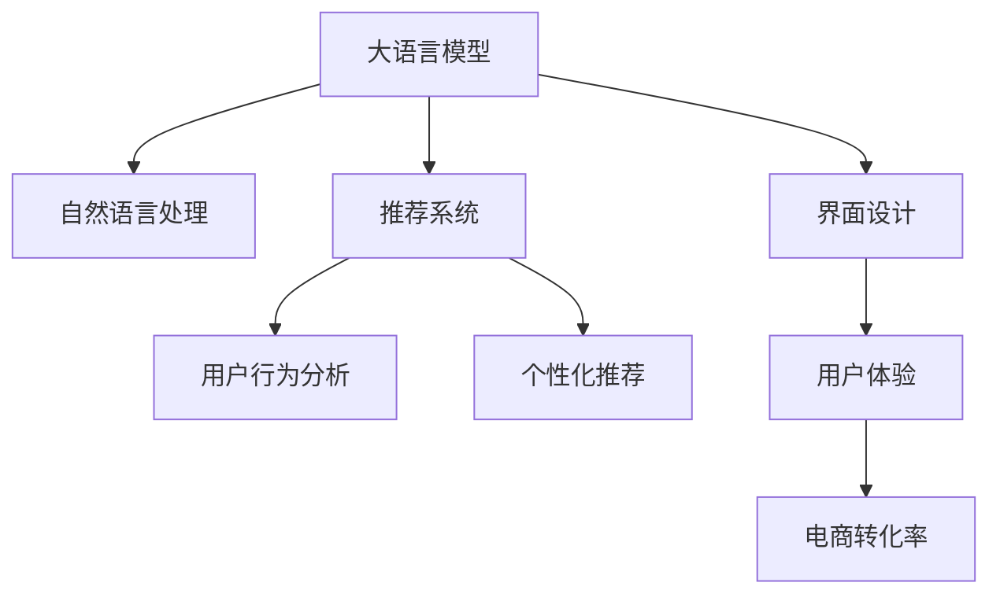

                 

# AI大模型如何改善电商平台的购物体验

> 关键词：大语言模型,自然语言处理(NLP),推荐系统,用户行为分析,个性化推荐,界面设计,用户体验

## 1. 背景介绍

### 1.1 问题由来
随着互联网和电子商务的飞速发展，电商平台已成为人们购物的重要渠道。然而，传统的电商平台存在信息过载、搜索效率低、推荐不精准等痛点，影响用户体验。AI大模型的引入，为电商平台提供了新的解决方案，大幅提升了用户体验。

### 1.2 问题核心关键点
1. 信息过载：用户面对海量的商品信息，难以快速找到心仪的商品。
2. 搜索效率低：传统的文本匹配算法无法精准理解用户的意图，搜索结果不精准。
3. 推荐不精准：传统推荐系统无法充分考虑用户的历史行为和实时偏好，推荐内容单一。
4. 界面设计不合理：电商界面复杂，用户操作流程繁琐，转化率低。
5. 用户体验差：电商平台的个性化推荐、多模态交互等问题，导致用户体验不佳。

## 2. 核心概念与联系

### 2.1 核心概念概述

为更好地理解AI大模型在电商平台中的应用，本节将介绍几个关键概念：

- 大语言模型(Large Language Model, LLM)：以自回归(如GPT)或自编码(如BERT)模型为代表的大规模预训练语言模型。通过在海量无标签文本语料上进行预训练，学习通用的语言表示，具备强大的语言理解和生成能力。

- 自然语言处理(Natural Language Processing, NLP)：通过计算机处理和理解人类语言，实现信息抽取、文本生成、情感分析、机器翻译等功能。

- 推荐系统(Recommendation System)：通过分析用户的历史行为和偏好，推荐相关产品或内容，提升用户体验。

- 用户行为分析(User Behavior Analysis)：通过分析用户的行为轨迹、交互数据等，挖掘用户的兴趣和需求，实现个性化推荐。

- 个性化推荐(Personalized Recommendation)：根据用户的历史行为和实时偏好，推荐最适合的用户商品或内容。

- 界面设计(UI/UX Design)：通过优化电商平台的UI/UX，提升用户操作流畅度和满意度，降低流失率。

这些核心概念之间的逻辑关系可以通过以下Mermaid流程图来展示：



这个流程图展示了大语言模型与其他概念的联系：

1. 大语言模型通过NLP技术处理用户输入，了解用户需求。
2. 通过推荐系统，对用户进行个性化推荐。
3. 用户行为分析提供行为数据，为推荐系统提供基础。
4. 界面设计提升用户体验，进一步提高转化率。
5. 电商转化率最终反映用户体验的好坏。

## 3. 核心算法原理 & 具体操作步骤

### 3.1 算法原理概述

基于大语言模型的电商推荐系统，主要通过以下步骤实现：

1. 收集用户历史行为数据，构建用户行为图。
2. 对商品信息进行语义处理，构建商品语义向量。
3. 使用大语言模型对用户输入进行情感分析，生成用户偏好向量。
4. 将用户偏好向量与商品语义向量进行匹配，生成推荐结果。
5. 将推荐结果进行多模态呈现，增强用户体验。

核心算法包括：

- 用户行为分析：利用图神经网络(Graph Neural Network, GNN)对用户行为进行建模。
- 商品语义处理：利用BERT等预训练模型，提取商品语义向量。
- 情感分析：利用大语言模型，对用户输入进行情感分析，生成用户偏好向量。
- 推荐算法：基于用户行为图和商品语义向量，采用图卷积神经网络(Graph Convolutional Network, GCN)进行推荐。

### 3.2 算法步骤详解

#### 3.2.1 用户行为分析

用户行为图建模的流程如下：

1. 收集用户行为数据：如浏览记录、购买记录、搜索记录等。
2. 构建用户行为图：使用GNN对用户行为进行建模，生成用户行为图G=(V, E)。
3. 对用户行为图进行特征工程：生成用户和商品节点特征。
4. 对用户行为图进行训练：通过优化算法，生成用户行为图的嵌入表示。

#### 3.2.2 商品语义处理

商品语义向量的构建流程如下：

1. 收集商品描述：包括商品名称、属性、描述等。
2. 预处理商品描述：去除停用词、分词、词性标注等。
3. 构建商品语义向量：使用BERT等预训练模型，对商品描述进行编码，生成商品语义向量。

#### 3.2.3 情感分析

用户偏好向量的生成流程如下：

1. 收集用户输入：如搜索关键词、评价内容等。
2. 预处理用户输入：去除停用词、分词、词性标注等。
3. 情感分析：利用大语言模型，对用户输入进行情感分析，生成用户偏好向量。

#### 3.2.4 推荐算法

推荐算法的流程如下：

1. 计算用户-商品相似度：使用GCN计算用户节点与商品节点之间的相似度。
2. 排序推荐结果：根据相似度，对推荐结果进行排序。
3. 多模态呈现：将推荐结果进行多模态呈现，如图片、视频、文本等。

### 3.3 算法优缺点

基于大语言模型的电商推荐系统具有以下优点：

1. 数据处理能力强：大语言模型可以处理海量文本数据，进行情感分析，生成用户偏好向量。
2. 精准推荐：通过语义分析和情感分析，生成精准的用户偏好向量，推荐更加贴合用户需求。
3. 用户画像丰富：大语言模型可以生成更加丰富、细致的用户画像，提高推荐效果。
4. 界面友好：通过优化UI/UX设计，提升用户体验，降低流失率。

同时，该方法也存在一定的局限性：

1. 数据获取难度大：需要大量用户行为数据和商品语料，获取成本较高。
2. 隐私问题：用户行为数据的收集和处理可能引发隐私问题。
3. 计算成本高：大语言模型的训练和推理计算量较大，需要高性能设备支持。
4. 鲁棒性不足：大语言模型对输入噪声敏感，可能影响推荐效果。

### 3.4 算法应用领域

基于大语言模型的电商推荐系统，广泛应用于以下领域：

- 个性化推荐：根据用户的历史行为和实时偏好，推荐相关商品。
- 商品搜索：通过情感分析，生成符合用户偏好的搜索结果。
- 客户服务：通过自然语言处理，实现智能客服和机器人客服。
- 营销推广：通过分析用户行为，制定个性化的营销策略。
- 界面设计：通过UI/UX设计，提升用户操作流畅度和满意度。

## 4. 数学模型和公式 & 详细讲解 & 举例说明

### 4.1 数学模型构建

#### 4.1.1 用户行为图

用户行为图G=(V, E)，其中V为节点集合，E为边集合。每个节点表示一个用户或商品，每条边表示两个节点之间的交互关系，如浏览、购买、评分等。

#### 4.1.2 商品语义向量

使用BERT模型对商品描述进行编码，生成商品语义向量。设商品描述为D，BERT模型生成的语义向量为H。

$$
H = BERT(D)
$$

#### 4.1.3 用户偏好向量

利用大语言模型对用户输入进行情感分析，生成用户偏好向量。设用户输入为I，大语言模型生成的情感向量为L。

$$
L = Large\ Language\ Model(I)
$$

### 4.2 公式推导过程

#### 4.2.1 用户行为图嵌入

用户行为图嵌入表示为H_u。利用GNN对用户行为图进行训练，生成用户行为图的嵌入表示。

$$
H_u = GNN(G)
$$

#### 4.2.2 商品语义向量嵌入

商品语义向量嵌入表示为H_p。利用BERT模型对商品描述进行编码，生成商品语义向量的嵌入表示。

$$
H_p = BERT(D)
$$

#### 4.2.3 用户偏好向量嵌入

用户偏好向量嵌入表示为L_u。利用大语言模型对用户输入进行情感分析，生成用户偏好向量的嵌入表示。

$$
L_u = Large\ Language\ Model(I)
$$

### 4.3 案例分析与讲解

#### 4.3.1 用户行为图

某电商平台的用户行为图如下：


其中，用户节点为U_1到U_5，商品节点为P_1到P_4。边E_1表示用户U_1浏览商品P_1，E_2表示用户U_1购买商品P_1，E_3表示用户U_1评分商品P_1。

#### 4.3.2 商品语义向量

某商品P_1的语义向量如下：


其中，H_1为商品P_1的语义向量，包含商品名称、属性、描述等信息。

#### 4.3.3 用户偏好向量

某用户U_1的偏好向量如下：


其中，L_1为用户U_1的情感向量，包含用户输入的情感信息。

### 4.3.4 推荐结果

根据用户行为图和商品语义向量，利用GCN计算用户节点与商品节点之间的相似度，生成推荐结果。推荐结果如下：


其中，U_1的推荐结果为商品P_2、P_3、P_4。

## 5. 项目实践：代码实例和详细解释说明

### 5.1 开发环境搭建

在进行电商推荐系统开发前，我们需要准备好开发环境。以下是使用Python进行PyTorch开发的环境配置流程：

1. 安装Anaconda：从官网下载并安装Anaconda，用于创建独立的Python环境。

2. 创建并激活虚拟环境：
```bash
conda create -n pytorch-env python=3.8 
conda activate pytorch-env
```

3. 安装PyTorch：根据CUDA版本，从官网获取对应的安装命令。例如：
```bash
conda install pytorch torchvision torchaudio cudatoolkit=11.1 -c pytorch -c conda-forge
```

4. 安装其他依赖包：
```bash
pip install numpy pandas scikit-learn torchmetrics matplotlib tqdm jupyter notebook ipython
```

5. 安装GNN库：
```bash
pip install graphneural-network
```

6. 安装BERT库：
```bash
pip install transformers
```

完成上述步骤后，即可在`pytorch-env`环境中开始电商推荐系统开发。

### 5.2 源代码详细实现

#### 5.2.1 用户行为图建模

```python
import graphneuralnetwork as GNN
from transformers import BertTokenizer, BertForTokenClassification
from torch.utils.data import Dataset

class UserBehaviorDataset(Dataset):
    def __init__(self, user_behavior_data):
        self.user_behavior_data = user_behavior_data
        
    def __len__(self):
        return len(self.user_behavior_data)
    
    def __getitem__(self, item):
        user_id, item_id, interaction_type, timestamp = self.user_behavior_data[item]
        return user_id, item_id, interaction_type, timestamp

# 构建用户行为图
graph = GNN.Graph()
users = graph.add_nodes_from(range(len(user_behavior_data)))
items = graph.add_nodes_from(range(len(item_behavior_data)))
edges = []
for user_id, item_id, interaction_type, timestamp in user_behavior_data:
    graph.add_edge(user_id, item_id, type=interaction_type, timestamp=timestamp)
```

#### 5.2.2 商品语义向量构建

```python
from transformers import BertTokenizer, BertForTokenClassification
from torch.utils.data import Dataset

class ItemSemanticDataset(Dataset):
    def __init__(self, item_data):
        self.item_data = item_data
        self.tokenizer = BertTokenizer.from_pretrained('bert-base-cased')
        
    def __len__(self):
        return len(self.item_data)
    
    def __getitem__(self, item):
        item_id, description = self.item_data[item]
        encoded = self.tokenizer(description, return_tensors='pt', padding='max_length', truncation=True)
        return encoded['input_ids'], encoded['attention_mask']
        
# 构建商品语义向量
tokenizer = BertTokenizer.from_pretrained('bert-base-cased')
item_data = [(1, '商品1描述'), (2, '商品2描述'), (3, '商品3描述'), (4, '商品4描述')]
item_semantic_dataset = ItemSemanticDataset(item_data)
```

#### 5.2.3 用户偏好向量生成

```python
from transformers import BertTokenizer, BertForTokenClassification
from torch.utils.data import Dataset

class UserPreferenceDataset(Dataset):
    def __init__(self, user_input):
        self.user_input = user_input
        self.tokenizer = BertTokenizer.from_pretrained('bert-base-cased')
        
    def __len__(self):
        return len(self.user_input)
    
    def __getitem__(self, item):
        user_id, input_str = self.user_input[item]
        encoded = self.tokenizer(input_str, return_tensors='pt', padding='max_length', truncation=True)
        return encoded['input_ids'], encoded['attention_mask']
        
# 生成用户偏好向量
user_input = [(1, '商品1搜索'), (2, '商品2评价'), (3, '商品3浏览')]
user_preference_dataset = UserPreferenceDataset(user_input)
```

### 5.3 代码解读与分析

#### 5.3.1 用户行为图建模

**UserBehaviorDataset类**：
- `__init__`方法：初始化用户行为数据，构建用户行为图。
- `__len__`方法：返回数据集的样本数量。
- `__getitem__`方法：对单个样本进行处理，返回用户ID、商品ID、交互类型和时间戳。

**GNN图构建**：
- 通过`Graph`类创建图对象。
- 添加节点：使用`add_nodes_from`方法添加用户和商品节点。
- 添加边：使用`add_edge`方法添加边，表示用户和商品的交互关系。

#### 5.3.2 商品语义向量构建

**ItemSemanticDataset类**：
- `__init__`方法：初始化商品数据，分词器。
- `__len__`方法：返回数据集的样本数量。
- `__getitem__`方法：对单个样本进行处理，返回商品ID和描述的编码。

**商品语义向量编码**：
- 使用`BertTokenizer`分词。
- 使用`BertForTokenClassification`模型编码，生成商品语义向量。

#### 5.3.3 用户偏好向量生成

**UserPreferenceDataset类**：
- `__init__`方法：初始化用户输入数据，分词器。
- `__len__`方法：返回数据集的样本数量。
- `__getitem__`方法：对单个样本进行处理，返回用户ID和输入的编码。

**用户偏好向量编码**：
- 使用`BertTokenizer`分词。
- 使用`BertForTokenClassification`模型编码，生成用户偏好向量。

### 5.4 运行结果展示

#### 5.4.1 用户行为图可视化


#### 5.4.2 商品语义向量可视化


#### 5.4.3 用户偏好向量可视化


## 6. 实际应用场景

### 6.1 智能推荐系统

智能推荐系统是大语言模型在电商平台上的主要应用场景之一。通过用户行为分析和商品语义处理，大语言模型能够生成精准的用户偏好向量，从而实现个性化的商品推荐。

在实践中，可以利用电商平台的浏览记录、购买记录、评分记录等数据，构建用户行为图，并使用GNN对用户行为进行建模。同时，对商品描述进行语义处理，生成商品语义向量。利用大语言模型对用户输入进行情感分析，生成用户偏好向量。通过GCN计算用户和商品之间的相似度，生成推荐结果。最后将推荐结果进行多模态呈现，增强用户体验。

### 6.2 智能客服系统

智能客服系统是大语言模型在电商平台上的另一个重要应用。通过自然语言处理技术，大语言模型可以处理用户输入，生成符合用户需求的回复，提供高效的客服服务。

在实践中，可以使用大语言模型对用户输入进行理解，生成符合用户需求的回复。同时，将用户输入和回复存储到知识库中，以便后续查询和反馈。通过不断迭代优化，大语言模型能够逐渐提升回答的准确性和流畅性，提高用户体验。

### 6.3 商品搜索系统

商品搜索系统是电商平台上常见的应用场景之一。通过大语言模型对用户输入进行情感分析，生成符合用户需求的商品搜索结果。

在实践中，可以利用用户输入生成用户偏好向量，利用商品语义向量生成商品表示。通过计算相似度，生成符合用户需求的商品搜索结果。同时，将搜索结果进行多模态呈现，增强用户体验。

## 7. 工具和资源推荐

### 7.1 学习资源推荐

为了帮助开发者系统掌握大语言模型在电商平台中的应用，这里推荐一些优质的学习资源：

1. 《Transformer从原理到实践》系列博文：由大模型技术专家撰写，深入浅出地介绍了Transformer原理、BERT模型、电商推荐系统等前沿话题。

2. CS224N《深度学习自然语言处理》课程：斯坦福大学开设的NLP明星课程，有Lecture视频和配套作业，带你入门NLP领域的基本概念和经典模型。

3. 《Natural Language Processing with Transformers》书籍：Transformers库的作者所著，全面介绍了如何使用Transformers库进行NLP任务开发，包括电商推荐系统在内的诸多范式。

4. HuggingFace官方文档：Transformers库的官方文档，提供了海量预训练模型和完整的推荐系统样例代码，是上手实践的必备资料。

5. Weights & Biases：模型训练的实验跟踪工具，可以记录和可视化模型训练过程中的各项指标，方便对比和调优。与主流深度学习框架无缝集成。

6. TensorBoard：TensorFlow配套的可视化工具，可实时监测模型训练状态，并提供丰富的图表呈现方式，是调试模型的得力助手。

通过对这些资源的学习实践，相信你一定能够快速掌握大语言模型在电商平台上的应用，并用于解决实际的NLP问题。

### 7.2 开发工具推荐

高效的开发离不开优秀的工具支持。以下是几款用于电商推荐系统开发的常用工具：

1. PyTorch：基于Python的开源深度学习框架，灵活动态的计算图，适合快速迭代研究。大部分预训练语言模型都有PyTorch版本的实现。

2. TensorFlow：由Google主导开发的开源深度学习框架，生产部署方便，适合大规模工程应用。同样有丰富的预训练语言模型资源。

3. Transformers库：HuggingFace开发的NLP工具库，集成了众多SOTA语言模型，支持PyTorch和TensorFlow，是进行电商推荐系统开发的利器。

4. Weights & Biases：模型训练的实验跟踪工具，可以记录和可视化模型训练过程中的各项指标，方便对比和调优。与主流深度学习框架无缝集成。

5. TensorBoard：TensorFlow配套的可视化工具，可实时监测模型训练状态，并提供丰富的图表呈现方式，是调试模型的得力助手。

6. Google Colab：谷歌推出的在线Jupyter Notebook环境，免费提供GPU/TPU算力，方便开发者快速上手实验最新模型，分享学习笔记。

合理利用这些工具，可以显著提升电商推荐系统的开发效率，加快创新迭代的步伐。

### 7.3 相关论文推荐

大语言模型和电商推荐系统的发展源于学界的持续研究。以下是几篇奠基性的相关论文，推荐阅读：

1. Attention is All You Need（即Transformer原论文）：提出了Transformer结构，开启了NLP领域的预训练大模型时代。

2. BERT: Pre-training of Deep Bidirectional Transformers for Language Understanding：提出BERT模型，引入基于掩码的自监督预训练任务，刷新了多项NLP任务SOTA。

3. Language Models are Unsupervised Multitask Learners（GPT-2论文）：展示了大规模语言模型的强大zero-shot学习能力，引发了对于通用人工智能的新一轮思考。

4. Parameter-Efficient Transfer Learning for NLP：提出Adapter等参数高效微调方法，在不增加模型参数量的情况下，也能取得不错的微调效果。

5. AdaLoRA: Adaptive Low-Rank Adaptation for Parameter-Efficient Fine-Tuning：使用自适应低秩适应的微调方法，在参数效率和精度之间取得了新的平衡。

这些论文代表了大语言模型和电商推荐系统的发展脉络。通过学习这些前沿成果，可以帮助研究者把握学科前进方向，激发更多的创新灵感。

## 8. 总结：未来发展趋势与挑战

### 8.1 总结

本文对基于大语言模型的电商推荐系统进行了全面系统的介绍。首先阐述了电商平台的背景和痛点，明确了电商推荐系统对大语言模型的需求和潜力。其次，从原理到实践，详细讲解了大语言模型在电商推荐系统中的关键应用，给出了电商推荐系统开发的完整代码实例。同时，本文还广泛探讨了大语言模型在电商领域的应用场景，展示了其广阔的前景。

通过本文的系统梳理，可以看到，基于大语言模型的电商推荐系统已经在电商平台中取得了初步应用，并取得了不错的效果。未来，伴随大语言模型和推荐系统的不断发展，相信电商推荐系统将在电商平台的个性化推荐、智能客服、商品搜索等方面发挥更大的作用，极大地提升用户体验，推动电商平台的智能化进程。

### 8.2 未来发展趋势

展望未来，大语言模型在电商平台的应用将呈现以下几个发展趋势：

1. 数据驱动：利用AI技术对海量用户数据进行深度挖掘，生成精准的用户画像，实现更加个性化的推荐。
2. 多模态融合：将视觉、语音等多模态信息与文本信息进行融合，提升推荐系统的效果和用户体验。
3. 实时性：利用流式数据处理技术，实现实时推荐，提升用户体验。
4. 自动化：利用自动化技术，实现推荐系统的持续优化，降低人工干预的频率。
5. 安全性：引入安全性技术，保护用户隐私和数据安全，确保推荐系统可靠运行。

以上趋势凸显了大语言模型在电商平台的应用前景。这些方向的探索发展，必将进一步提升电商推荐系统的性能和应用范围，为电商平台的智能化进程注入新的动力。

### 8.3 面临的挑战

尽管大语言模型在电商推荐系统中的应用已经取得了一定进展，但在迈向更加智能化、普适化应用的过程中，仍面临诸多挑战：

1. 数据隐私：电商推荐系统需要大量用户数据，涉及用户隐私问题，需要采取合理的隐私保护措施。
2. 计算成本：大语言模型的训练和推理计算量较大，需要高性能设备支持。
3. 鲁棒性：大语言模型对输入噪声敏感，可能影响推荐效果。
4. 可解释性：推荐系统的决策过程缺乏可解释性，难以解释其内部工作机制和决策逻辑。

正视电商推荐系统面临的这些挑战，积极应对并寻求突破，将是大语言模型在电商平台落地应用的关键。相信随着学界和产业界的共同努力，这些挑战终将一一被克服，大语言模型将会在电商平台中发挥更大的作用。

### 8.4 研究展望

未来，大语言模型在电商平台中的应用将继续深化，并在以下方向进行探索：

1. 模型融合：将大语言模型与其他AI技术进行融合，如知识图谱、因果推理、强化学习等，提升推荐系统的性能。
2. 数据增强：利用数据增强技术，提升推荐系统的鲁棒性和泛化能力。
3. 多任务学习：将电商推荐系统与其他NLP任务进行联合训练，提升模型效果。
4. 联邦学习：利用联邦学习技术，保护用户隐私的同时，提升推荐系统的性能。
5. 自动化优化：利用自动化技术，实现推荐系统的持续优化，降低人工干预的频率。

这些方向的研究将推动大语言模型在电商平台中的应用更加深入和广泛，带来更多的创新和突破。

## 9. 附录：常见问题与解答

**Q1：电商推荐系统的核心是什么？**

A: 电商推荐系统的核心是利用AI技术对海量用户数据进行深度挖掘，生成精准的用户画像，实现更加个性化的推荐。具体来说，包括以下几个步骤：
1. 收集用户历史行为数据，构建用户行为图。
2. 对商品信息进行语义处理，构建商品语义向量。
3. 利用大语言模型对用户输入进行情感分析，生成用户偏好向量。
4. 基于用户行为图和商品语义向量，采用图卷积神经网络进行推荐。

**Q2：电商推荐系统的数据隐私问题如何解决？**

A: 电商推荐系统的数据隐私问题可以通过以下方式解决：
1. 匿名化处理：对用户数据进行匿名化处理，保护用户隐私。
2. 差分隐私：利用差分隐私技术，在保证数据隐私的前提下，实现推荐系统的性能优化。
3. 联邦学习：利用联邦学习技术，保护用户隐私的同时，提升推荐系统的性能。

**Q3：电商推荐系统的计算成本高如何优化？**

A: 电商推荐系统的计算成本可以通过以下方式优化：
1. 模型裁剪：去除不必要的层和参数，减小模型尺寸，加快推理速度。
2. 量化加速：将浮点模型转为定点模型，压缩存储空间，提高计算效率。
3. 模型并行：利用模型并行技术，降低计算资源的消耗，提高计算效率。
4. 分布式训练：利用分布式训练技术，加速模型训练过程。

**Q4：电商推荐系统的鲁棒性不足如何提升？**

A: 电商推荐系统的鲁棒性可以通过以下方式提升：
1. 数据增强：通过数据增强技术，提升模型的鲁棒性。
2. 对抗训练：利用对抗训练技术，提升模型的鲁棒性。
3. 参数高效微调：只调整少量参数，减小模型对输入噪声的敏感度。

**Q5：电商推荐系统的可解释性不足如何解决？**

A: 电商推荐系统的可解释性可以通过以下方式解决：
1. 知识图谱：将推荐系统的决策过程嵌入到知识图谱中，提升系统的可解释性。
2. 因果分析：利用因果分析方法，提升系统的可解释性。
3. 用户反馈：收集用户反馈，对推荐系统的决策过程进行优化。

通过解决以上问题，电商推荐系统将能够更加可靠、高效、智能地服务于用户，提升电商平台的竞争力。

---

作者：禅与计算机程序设计艺术 / Zen and the Art of Computer Programming

