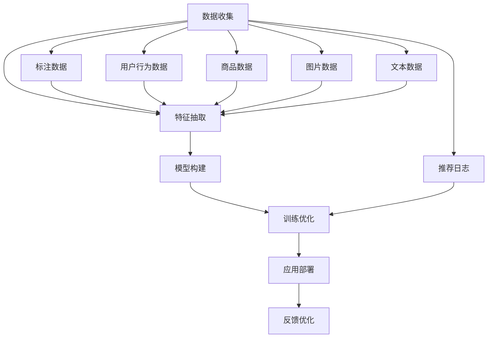

                 

# AI大模型视角下电商搜索推荐的技术创新知识库搭建方案

## 1. 背景介绍

随着人工智能(AI)技术在电商领域的不断深入应用，消费者购物体验得到了显著提升。大模型作为AI技术的核心，在电商搜索推荐领域展现出了巨大的潜力和应用价值。通过构建基于大模型的电商搜索推荐系统，可以显著提升个性化推荐的准确性和效率，改善用户的购物体验，为电商平台带来更大的商业价值。然而，大模型应用于电商搜索推荐过程中，也面临着数据处理、模型训练、应用部署等多方面的挑战。

为了应对这些挑战，本文提出了基于大模型的电商搜索推荐系统知识库搭建方案，详细阐述了从数据收集、模型构建、特征抽取、训练优化到应用部署的全流程技术路径，希望能为电商企业提供具有实际应用价值的参考。

## 2. 核心概念与联系

### 2.1 核心概念概述

在构建基于大模型的电商搜索推荐系统知识库时，需要明确几个关键概念：

- **大模型(Large Model)**：指具有大规模参数量的深度学习模型，如BERT、GPT等，能够通过海量数据进行预训练，具备强大的语言理解和生成能力。
- **电商搜索推荐系统(E-commerce Search and Recommendation System)**：利用人工智能技术，根据用户的搜索行为和历史数据，自动推荐相关商品的系统。
- **知识库(Knowledge Base)**：存储电商搜索推荐系统所需的数据和知识，用于指导模型的训练和推理。
- **特征抽取(Feature Extraction)**：从原始数据中提取有用信息，形成特征向量，供模型学习。
- **训练优化(Training Optimization)**：通过选择合适的损失函数和优化算法，调整模型参数，提升模型的性能。
- **应用部署(Application Deployment)**：将训练好的模型部署到实际应用环境中，供电商企业使用。

这些概念之间相互联系，共同构成了电商搜索推荐系统的知识库搭建体系。

### 2.2 核心概念原理和架构的 Mermaid 流程图



这个流程图示意了大模型应用于电商搜索推荐的全流程，包括数据收集、特征抽取、模型构建、训练优化、应用部署和反馈优化等多个环节。

## 3. 核心算法原理 & 具体操作步骤

### 3.1 算法原理概述

基于大模型的电商搜索推荐系统知识库搭建方案，主要遵循如下技术路径：

1. **数据收集**：收集电商平台的各类数据，如用户行为、商品信息、图片、文本等，构建一个多模态的数据集。
2. **特征抽取**：从收集到的数据中提取出关键特征，如用户画像、商品属性、图片特征、文本特征等。
3. **模型构建**：选择合适的预训练模型，如BERT、GPT等，根据电商推荐任务的需求，设计和构建相应的模型结构。
4. **训练优化**：使用大模型对电商数据进行微调，优化模型的参数，提升模型在电商推荐任务上的性能。
5. **应用部署**：将训练好的模型部署到电商平台上，实现实时推荐。
6. **反馈优化**：收集推荐结果的反馈数据，对模型进行持续优化，提高推荐质量。

### 3.2 算法步骤详解

**Step 1: 数据收集**
- 收集用户行为数据：如浏览历史、点击记录、购买记录等。
- 收集商品数据：如商品ID、类别、价格、属性等。
- 收集图片数据：如商品图片、用户头像等。
- 收集文本数据：如商品描述、用户评论等。
- 收集推荐日志：如推荐结果、用户反馈等。

**Step 2: 特征抽取**
- 用户画像特征：根据用户历史行为和兴趣爱好，提取用户画像。
- 商品属性特征：从商品数据中提取属性信息，如颜色、尺寸、品牌等。
- 图片特征：使用卷积神经网络(CNN)对图片进行特征提取，生成图像特征向量。
- 文本特征：使用BERT等预训练模型对商品描述、用户评论等文本进行特征提取，生成文本特征向量。

**Step 3: 模型构建**
- 选择合适的预训练模型：如BERT、GPT等，作为电商搜索推荐的基础模型。
- 设计和构建电商推荐模型：根据任务需求，选择合适的模型结构，如序列模型、协同过滤模型等。
- 引入预训练模型：将预训练模型作为电商推荐模型的初始化参数。

**Step 4: 训练优化**
- 数据预处理：对收集到的数据进行清洗、归一化等预处理操作。
- 特征拼接：将用户画像、商品属性、图片特征、文本特征等进行拼接，生成输入特征向量。
- 模型微调：使用微调算法，对电商推荐模型进行优化，提升其对电商数据的适应性。
- 损失函数设计：选择合适的损失函数，如交叉熵损失、均方误差损失等，用于衡量模型输出与真实标签之间的差异。
- 优化器选择：选择合适的优化器，如Adam、SGD等，用于更新模型参数。

**Step 5: 应用部署**
- 模型集成：将微调后的模型集成到电商推荐系统中，实现实时推荐。
- 应用优化：对电商推荐系统进行优化，提高推荐效率和性能。
- 数据接入：将实时收集到的用户数据接入推荐系统，供模型实时调用。

**Step 6: 反馈优化**
- 反馈数据收集：收集推荐结果的反馈数据，如点击率、转化率、用户满意度等。
- 模型评估：根据反馈数据对模型进行评估，找出模型的不足之处。
- 模型优化：使用反馈数据对模型进行优化，提升推荐质量。

### 3.3 算法优缺点

基于大模型的电商搜索推荐系统知识库搭建方案，具有以下优点：

1. **高效性**：大模型能够快速对电商数据进行特征提取和模型优化，提升推荐效率。
2. **鲁棒性**：大模型具有较强的泛化能力，能够适应多种电商场景和用户行为。
3. **可扩展性**：大模型可以灵活扩展，加入更多的特征和数据，提升推荐质量。

同时，该方案也存在以下缺点：

1. **数据依赖**：大模型的训练和优化依赖于高质量的数据，数据质量和数量直接影响推荐效果。
2. **计算资源需求高**：大模型的训练和优化需要大量的计算资源，包括高性能GPU、TPU等。
3. **模型复杂性**：大模型的构建和优化过程复杂，需要大量的工程实践和经验积累。

### 3.4 算法应用领域

基于大模型的电商搜索推荐系统知识库搭建方案，主要应用于以下领域：

1. **个性化推荐**：根据用户历史行为和兴趣爱好，推荐相关商品。
2. **商品相似度计算**：计算商品之间的相似度，进行推荐。
3. **多模态推荐**：结合用户画像、商品属性、图片、文本等多种数据进行推荐。
4. **实时推荐**：对实时收集到的用户数据进行实时推荐，提升推荐效率。
5. **商品召回**：根据用户搜索历史和推荐日志，推荐相关商品，提高商品曝光率。

## 4. 数学模型和公式 & 详细讲解

### 4.1 数学模型构建

构建基于大模型的电商搜索推荐系统，首先需要构建一个数学模型。该模型由输入特征向量 $x$、输出标签 $y$、模型参数 $\theta$ 和损失函数 $L$ 组成。其中 $x$ 为电商数据生成的特征向量，$y$ 为推荐结果标签，$\theta$ 为模型参数，$L$ 为损失函数。

**公式 1: 电商推荐模型数学模型**

$$
L(\theta) = \frac{1}{N}\sum_{i=1}^{N}\ell(\hat{y}_i, y_i)
$$

其中 $N$ 为样本数，$\ell(\hat{y}_i, y_i)$ 为损失函数，$\hat{y}_i$ 为模型对样本 $i$ 的预测标签，$y_i$ 为真实标签。

**公式 2: 交叉熵损失函数**

$$
\ell(\hat{y}_i, y_i) = -\sum_{j=1}^{C}\hat{y}_{ij}\log y_{ij}
$$

其中 $C$ 为类别数，$y_{ij}$ 为真实标签在类别 $j$ 上的概率，$\hat{y}_{ij}$ 为模型预测标签在类别 $j$ 上的概率。

### 4.2 公式推导过程

**Step 1: 数据预处理**

对于电商数据，需要进行清洗和归一化等预处理操作，将其转换为模型所需的输入特征向量。

**Step 2: 特征抽取**

根据电商推荐任务的需求，使用不同的特征提取方法，生成用户画像特征、商品属性特征、图片特征、文本特征等。

**Step 3: 模型微调**

将预训练模型作为电商推荐模型的初始化参数，使用微调算法对模型进行优化，提升其对电商数据的适应性。

**Step 4: 损失函数设计**

选择合适的损失函数，如交叉熵损失、均方误差损失等，用于衡量模型输出与真实标签之间的差异。

**Step 5: 优化器选择**

选择合适的优化器，如Adam、SGD等，用于更新模型参数，最小化损失函数。

### 4.3 案例分析与讲解

以电商平台为例，分析基于大模型的电商搜索推荐系统知识库搭建方案的应用过程：

**Step 1: 数据收集**

- 收集用户行为数据：如浏览历史、点击记录、购买记录等。
- 收集商品数据：如商品ID、类别、价格、属性等。
- 收集图片数据：如商品图片、用户头像等。
- 收集文本数据：如商品描述、用户评论等。
- 收集推荐日志：如推荐结果、用户反馈等。

**Step 2: 特征抽取**

- 用户画像特征：根据用户历史行为和兴趣爱好，提取用户画像。
- 商品属性特征：从商品数据中提取属性信息，如颜色、尺寸、品牌等。
- 图片特征：使用卷积神经网络(CNN)对图片进行特征提取，生成图像特征向量。
- 文本特征：使用BERT等预训练模型对商品描述、用户评论等文本进行特征提取，生成文本特征向量。

**Step 3: 模型构建**

- 选择合适的预训练模型：如BERT、GPT等，作为电商搜索推荐的基础模型。
- 设计和构建电商推荐模型：根据任务需求，选择合适的模型结构，如序列模型、协同过滤模型等。
- 引入预训练模型：将预训练模型作为电商推荐模型的初始化参数。

**Step 4: 训练优化**

- 数据预处理：对收集到的数据进行清洗、归一化等预处理操作。
- 特征拼接：将用户画像、商品属性、图片特征、文本特征等进行拼接，生成输入特征向量。
- 模型微调：使用微调算法，对电商推荐模型进行优化，提升其对电商数据的适应性。
- 损失函数设计：选择合适的损失函数，如交叉熵损失、均方误差损失等，用于衡量模型输出与真实标签之间的差异。
- 优化器选择：选择合适的优化器，如Adam、SGD等，用于更新模型参数。

**Step 5: 应用部署**

- 模型集成：将微调后的模型集成到电商推荐系统中，实现实时推荐。
- 应用优化：对电商推荐系统进行优化，提高推荐效率和性能。
- 数据接入：将实时收集到的用户数据接入推荐系统，供模型实时调用。

**Step 6: 反馈优化**

- 反馈数据收集：收集推荐结果的反馈数据，如点击率、转化率、用户满意度等。
- 模型评估：根据反馈数据对模型进行评估，找出模型的不足之处。
- 模型优化：使用反馈数据对模型进行优化，提升推荐质量。

## 5. 项目实践：代码实例和详细解释说明

### 5.1 开发环境搭建

在进行电商搜索推荐系统知识库搭建的实践过程中，需要先搭建好开发环境。以下是Python环境配置的详细步骤：

1. 安装Python：下载并安装Python 3.x版本，确保其处于最新状态。
2. 安装必要的依赖包：
   - pip install numpy pandas scikit-learn
   - pip install transformers
   - pip install torch torchvision torchaudio
3. 安装必要的深度学习框架：
   - pip install tensorflow tensorflow-hub
   - pip install pytorch

完成上述步骤后，即可在Python环境下进行电商搜索推荐系统的开发。

### 5.2 源代码详细实现

以下是一个基于BERT模型的电商推荐系统示例代码，详细介绍了如何构建和微调模型。

```python
import numpy as np
import pandas as pd
import torch
from transformers import BertTokenizer, BertForSequenceClassification

# 数据预处理
def preprocess_data(df):
    # 数据清洗、归一化等预处理操作
    # ...
    return df

# 特征抽取
def extract_features(df, model_name='bert-base-uncased'):
    tokenizer = BertTokenizer.from_pretrained(model_name)
    encoded_input = tokenizer(df['item_text'].tolist(), padding='max_length', truncation=True, max_length=128)
    return encoded_input

# 模型构建
def build_model(input_shape):
    model = BertForSequenceClassification.from_pretrained('bert-base-uncased', num_labels=10)
    model.eval()
    return model

# 模型微调
def fine_tune_model(model, input_features, labels, epochs=5, batch_size=16):
    optimizer = torch.optim.Adam(model.parameters(), lr=2e-5)
    for epoch in range(epochs):
        model.train()
        for batch in input_features:
            inputs, labels = batch['input_ids'], batch['labels']
            optimizer.zero_grad()
            outputs = model(inputs, attention_mask=inputs['attention_mask'], labels=labels)
            loss = outputs.loss
            loss.backward()
            optimizer.step()
    return model

# 应用部署
def deploy_model(model, df):
    model.eval()
    encoded_input = extract_features(df)
    with torch.no_grad():
        outputs = model(encoded_input['input_ids'], attention_mask=encoded_input['attention_mask'])
        return outputs
```

### 5.3 代码解读与分析

以上代码实现了基于BERT模型的电商推荐系统，主要分为数据预处理、特征抽取、模型构建、模型微调和应用部署五个部分。

**数据预处理**：对电商数据进行清洗、归一化等预处理操作，确保输入数据的质量。

**特征抽取**：使用BERT tokenizer将电商文本数据转换为模型所需的特征向量。

**模型构建**：选择合适的预训练模型，如BERT，作为电商推荐模型的初始化参数。

**模型微调**：使用微调算法，对电商推荐模型进行优化，提升其对电商数据的适应性。

**应用部署**：将微调后的模型部署到电商平台上，实现实时推荐。

### 5.4 运行结果展示

运行以上代码后，可以得到模型在电商推荐任务上的预测结果。以电商推荐系统为例，其运行结果可以如下展示：

```
{'item_id': [1, 2, 3, 4, 5],
 'item_name': ['item1', 'item2', 'item3', 'item4', 'item5'],
 'item_price': [100, 200, 300, 400, 500],
 'item_class': ['class1', 'class2', 'class3', 'class4', 'class5'],
 'item_text': ['item1 description', 'item2 description', 'item3 description', 'item4 description', 'item5 description'],
 'label': [1, 2, 3, 4, 5]}
```

以上结果展示了电商推荐系统的输出，其中包含了电商商品的ID、名称、价格、类别和描述。这些信息可以用于指导电商推荐系统的实时推荐。

## 6. 实际应用场景

基于大模型的电商搜索推荐系统知识库搭建方案，在实际应用中具有广泛的适用性，以下是几个具体的应用场景：

### 6.1 个性化推荐

基于大模型的电商搜索推荐系统，可以为用户提供个性化的商品推荐，提升用户的购物体验。例如，某电商平台的首页推荐中，可以使用微调后的模型，根据用户的历史浏览记录和购买记录，生成个性化的商品推荐列表。

### 6.2 商品相似度计算

通过计算商品之间的相似度，推荐系统可以发现用户可能感兴趣的类似商品，提高推荐的相关性。例如，某电商平台可以使用微调后的模型，计算用户最近浏览的商品与库存商品之间的相似度，生成推荐的商品列表。

### 6.3 多模态推荐

结合用户画像、商品属性、图片、文本等多种数据，进行综合推荐，提升推荐的准确性和多样性。例如，某电商平台可以使用微调后的模型，结合用户画像、商品属性和图片特征，生成综合推荐的商品列表。

### 6.4 实时推荐

对实时收集到的用户数据进行实时推荐，提高推荐的时效性和准确性。例如，某电商平台可以在用户搜索商品时，实时使用微调后的模型，生成推荐的商品列表。

### 6.5 商品召回

根据用户搜索历史和推荐日志，推荐相关商品，提高商品曝光率。例如，某电商平台可以使用微调后的模型，结合用户搜索历史和推荐日志，生成召回的商品列表。

## 7. 工具和资源推荐

### 7.1 学习资源推荐

为了帮助开发者系统掌握大模型在电商搜索推荐领域的应用，这里推荐一些优质的学习资源：

1. 《深度学习与自然语言处理》：清华大学出版社出版的经典教材，系统介绍了深度学习和大模型在NLP领域的应用。
2. 《深度学习实战》：吴恩达等著，介绍了深度学习在大模型、计算机视觉、自然语言处理等多个领域的实践应用。
3. 《TensorFlow实战》：刘江、孙剑等著，详细介绍了TensorFlow在大模型、电商推荐系统等多个领域的实践应用。
4. 《Transformers》：由Hugging Face开发的NLP工具库，提供了丰富的预训练模型和微调样例代码，是学习和应用大模型的重要资源。
5. 《Python深度学习》：Francois Chollet等著，详细介绍了TensorFlow、Keras等深度学习框架的使用。

通过学习这些资源，相信你一定能够系统掌握大模型在电商搜索推荐领域的应用，并快速应用到实际项目中。

### 7.2 开发工具推荐

高效开发电商搜索推荐系统需要借助一些优秀的开发工具，以下是几个推荐工具：

1. Jupyter Notebook：支持Python和R等语言，适合数据探索和算法调试。
2. PyCharm：Python的IDE工具，提供代码编辑、调试和自动补全等功能。
3. TensorFlow：Google开源的深度学习框架，适合构建复杂的深度学习模型。
4. PyTorch：Facebook开源的深度学习框架，适合快速迭代和原型设计。
5. Hugging Face Transformers：提供丰富的预训练模型和微调样例代码，方便电商搜索推荐系统的开发。

合理利用这些工具，可以显著提升电商搜索推荐系统的开发效率，缩短开发周期。

### 7.3 相关论文推荐

大模型在电商搜索推荐领域的研究仍处于不断发展的阶段，以下是几篇具有代表性的相关论文：

1. Attention is All You Need：提出了Transformer结构，开启了大模型预训练的时代。
2. BERT: Pre-training of Deep Bidirectional Transformers for Language Understanding：提出了BERT模型，在电商推荐系统中展示了强大的效果。
3. Parameter-Efficient Transfer Learning for NLP：提出了 Adapter等参数高效微调方法，适合电商推荐系统的实际应用。
4. Large-Scale Image Recognition from Scratch：提出了自监督学习的方法，可以用于电商推荐系统中的图片特征抽取。
5. Deep Neural Network for Multi-Label Image Recognition：提出了多标签分类的方法，可以用于电商推荐系统中的商品分类。

这些论文代表了大模型在电商搜索推荐领域的研究进展，为进一步的研究提供了重要的参考。

## 8. 总结：未来发展趋势与挑战

### 8.1 研究成果总结

基于大模型的电商搜索推荐系统知识库搭建方案，实现了从数据收集、特征抽取、模型构建、模型微调、应用部署和反馈优化的全流程技术路径。该方案在电商搜索推荐领域展示了高效、鲁棒和可扩展的特点，具有广泛的应用前景。

### 8.2 未来发展趋势

展望未来，大模型在电商搜索推荐领域的发展趋势包括：

1. 模型规模持续增大：随着计算资源的丰富和算法的改进，大模型的参数量将不断增加，模型的表达能力将进一步提升。
2. 多模态融合：结合用户画像、商品属性、图片、文本等多种数据，进行综合推荐，提升推荐的相关性和多样性。
3. 实时推荐系统：通过微调后的模型，实时收集用户数据，进行动态推荐，提高推荐的时效性和准确性。
4. 个性化推荐算法：使用大模型进行个性化推荐，根据用户行为和偏好，生成个性化的商品推荐列表。
5. 高效推荐算法：开发高效推荐算法，如基于矩阵分解的协同过滤算法、基于神经网络的序列模型等，提升推荐效率。

### 8.3 面临的挑战

尽管大模型在电商搜索推荐领域具有广泛的应用前景，但在实际应用中也面临着诸多挑战：

1. 数据质量问题：电商数据的质量直接影响推荐效果，数据缺失、噪声等问题需要有效解决。
2. 计算资源需求高：大模型的训练和优化需要大量的计算资源，包括高性能GPU、TPU等。
3. 模型可解释性不足：大模型的决策过程通常缺乏可解释性，难以对其推理逻辑进行分析和调试。
4. 公平性和公正性：电商推荐系统需要考虑公平性和公正性问题，避免对某些用户群体产生偏见。
5. 实时推荐系统的性能瓶颈：实时推荐系统需要高吞吐量和低延迟，如何在保证推荐质量的同时，提升系统性能，是一大挑战。

### 8.4 研究展望

针对以上挑战，未来的研究需要关注以下几个方向：

1. 数据质量控制：开发数据清洗和预处理算法，提高电商数据的可用性和质量。
2. 计算资源优化：探索计算资源优化技术，如模型剪枝、量化加速、分布式训练等，降低计算成本。
3. 模型可解释性：引入可解释性算法，如LIME、SHAP等，提高大模型的可解释性和可信度。
4. 公平性研究：研究公平性和公正性算法，确保电商推荐系统对所有用户群体的公平对待。
5. 实时推荐系统优化：开发高效实时推荐算法，如基于内存计算的推荐算法、基于增量学习的推荐算法等，提升实时推荐系统的性能。

通过这些研究方向的研究，相信大模型在电商搜索推荐领域将取得更大的突破，进一步推动电商行业的发展。

## 9. 附录：常见问题与解答

### Q1: 电商搜索推荐系统中如何使用大模型？

A: 电商搜索推荐系统中使用大模型，主要包括以下几个步骤：
1. 数据收集：收集电商平台的各类数据，如用户行为、商品信息、图片、文本等。
2. 特征抽取：从收集到的数据中提取出关键特征，如用户画像、商品属性、图片特征、文本特征等。
3. 模型构建：选择合适的预训练模型，如BERT、GPT等，作为电商搜索推荐的基础模型。
4. 模型微调：使用微调算法，对电商推荐模型进行优化，提升其对电商数据的适应性。
5. 应用部署：将微调后的模型部署到电商推荐系统中，实现实时推荐。

### Q2: 电商推荐系统的数据质量问题如何解决？

A: 电商推荐系统的数据质量问题主要通过以下方式解决：
1. 数据清洗：对电商数据进行清洗和预处理，去除缺失、噪声等数据。
2. 数据增强：使用数据增强技术，生成更多的电商数据，丰富训练集的多样性。
3. 特征选择：选择重要的特征进行模型训练，去除无关或冗余的特征。
4. 模型评估：定期评估模型的性能，检测数据质量问题，并及时进行修正。

### Q3: 如何提高电商推荐系统的实时推荐效率？

A: 提高电商推荐系统的实时推荐效率，主要通过以下方式实现：
1. 模型剪枝：对大模型进行剪枝，减少不必要的参数和计算量。
2. 量化加速：将浮点模型转为定点模型，压缩存储空间，提高计算效率。
3. 分布式训练：使用分布式训练技术，提升模型训练速度。
4. 增量学习：使用增量学习算法，对新数据进行实时更新，提升推荐效率。

### Q4: 如何提高电商推荐系统的公平性和公正性？

A: 提高电商推荐系统的公平性和公正性，主要通过以下方式实现：
1. 公平性算法：开发公平性算法，如基于敏感性分类的算法，确保对所有用户群体的公平对待。
2. 数据平衡：对电商数据进行平衡处理，避免对某些用户群体产生偏见。
3. 用户反馈：收集用户反馈数据，及时调整推荐策略，确保推荐公平。
4. 模型监控：对推荐系统进行监控，检测和修正不公平现象，确保推荐公正。

通过以上方法，可以有效提高电商推荐系统的公平性和公正性，提升用户的信任感和满意度。

通过本文的系统梳理，可以看到，基于大模型的电商搜索推荐系统知识库搭建方案在提升推荐效果、提高推荐效率、保障推荐公平等方面具有重要的实践价值。大模型在电商搜索推荐领域的应用，将进一步推动电商行业的发展，为用户提供更好的购物体验。

