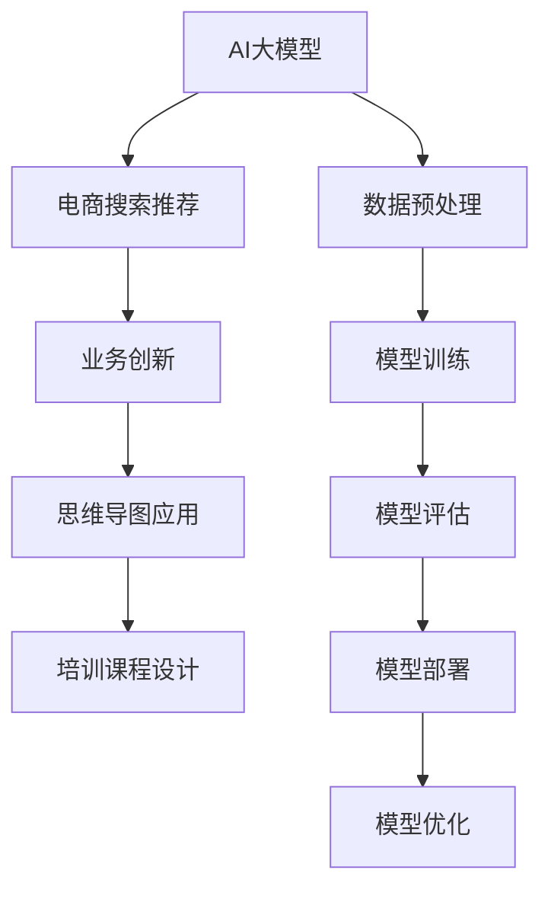

                 

# AI大模型赋能电商搜索推荐的业务创新思维导图应用培训课程设计

> 关键词：AI大模型,电商搜索推荐,业务创新,思维导图应用,培训课程设计

## 1. 背景介绍

### 1.1 问题由来
随着人工智能技术的不断发展，AI大模型在电商搜索推荐等领域的应用日益广泛。AI大模型能够通过深度学习技术，分析用户行为数据，识别用户偏好，生成个性化的商品推荐结果。然而，尽管AI大模型在技术上已经取得了显著进展，但在实际应用中，其效果往往难以达到预期，究其原因，一方面是由于电商领域的数据复杂性高，用户行为多变；另一方面是由于模型的可解释性不足，难以对模型输出进行有效的分析和解释。

因此，如何在电商搜索推荐领域中，高效利用AI大模型的能力，同时提升模型的可解释性和业务适配性，成为当前电商企业亟待解决的问题。本文将基于AI大模型，提出一套适用于电商搜索推荐的业务创新思维导图应用培训课程设计方案，旨在帮助电商企业用户，通过系统化的学习，更好地理解和应用AI大模型，提升电商搜索推荐系统的业务效果。

## 2. 核心概念与联系

### 2.1 核心概念概述

为更好地理解基于AI大模型的电商搜索推荐系统，本节将介绍几个密切相关的核心概念：

- AI大模型：基于深度学习技术，通过大规模无标签数据进行预训练的通用语言模型。如BERT、GPT等。
- 电商搜索推荐：指通过分析用户行为数据，预测用户对商品的需求，生成个性化的搜索结果和推荐列表。
- 业务创新：指通过技术手段，创新电商搜索推荐系统的设计和实现，提升用户体验和运营效率。
- 思维导图应用：指将AI大模型的原理、算法、技术点以图形化的形式展现，便于用户理解和应用。
- 培训课程设计：指结合电商企业实际需求，设计一套系统化的课程，帮助用户掌握AI大模型的应用方法。

这些核心概念之间的逻辑关系可以通过以下Mermaid流程图来展示：



这个流程图展示了AI大模型赋能电商搜索推荐的业务创新思维导图应用培训课程设计的全流程：

1. AI大模型在电商搜索推荐系统中的基础作用。
2. 通过业务创新，提升电商搜索推荐系统的性能和效果。
3. 将业务创新的知识以思维导图的形式展现，便于用户理解。
4. 结合电商企业实际需求，设计培训课程，帮助用户掌握AI大模型的应用方法。

这些核心概念共同构成了AI大模型赋能电商搜索推荐系统的学习和应用框架，使其能够在电商搜索推荐领域中发挥强大的作用。通过理解这些核心概念，我们可以更好地把握AI大模型的工作原理和优化方向。

## 3. 核心算法原理 & 具体操作步骤
### 3.1 算法原理概述

基于AI大模型的电商搜索推荐系统，主要依赖于用户行为数据的分析和建模。其核心思想是：将AI大模型作为“特征提取器”，通过分析用户的浏览、购买、评价等行为数据，学习用户的偏好和需求，生成个性化的搜索结果和推荐列表。

具体而言，系统首先对用户行为数据进行预处理，包括数据清洗、特征提取、分词等步骤，然后使用预训练的AI大模型对用户行为数据进行表示学习，获得用户行为的向量表示。接着，系统将这些向量表示作为输入，训练推荐模型，预测用户对不同商品的评分或概率，最终生成推荐列表。

### 3.2 算法步骤详解

基于AI大模型的电商搜索推荐系统一般包括以下几个关键步骤：

**Step 1: 数据收集与预处理**
- 收集电商平台的交易数据、用户行为数据、商品信息数据等，并进行清洗、归一化等预处理。
- 对数据进行特征提取，如用户ID、商品ID、浏览时间、点击次数等。
- 使用预训练的AI大模型对用户行为数据进行表示学习，获得用户行为的向量表示。

**Step 2: 推荐模型训练**
- 根据电商搜索推荐任务的特点，选择合适的推荐算法（如协同过滤、内容推荐、混合推荐等）。
- 使用AI大模型的输出作为特征输入，训练推荐模型。
- 对推荐模型进行调参和优化，提升推荐效果。

**Step 3: 推荐结果生成**
- 使用训练好的推荐模型，对用户行为数据进行评分或概率预测。
- 根据预测结果，生成个性化的搜索结果和推荐列表。
- 对推荐结果进行后处理，如去重、排序、展示等。

**Step 4: 系统部署与迭代优化**
- 将训练好的推荐系统部署到电商平台，进行实时推荐。
- 持续收集用户的反馈和行为数据，对推荐模型进行迭代优化。
- 定期对AI大模型进行微调，更新模型参数，提升推荐效果。

以上是基于AI大模型的电商搜索推荐系统的基本流程。在实际应用中，还需要根据具体业务场景，对各个环节进行优化设计，如改进数据处理流程，引入更多的特征，优化推荐算法等。

### 3.3 算法优缺点

基于AI大模型的电商搜索推荐系统具有以下优点：

1. **高效性**：利用AI大模型的强大特征提取能力，能够快速处理大量的用户行为数据，生成个性化的推荐结果。
2. **准确性**：AI大模型具备强大的学习能力，能够从用户行为数据中学习到更加准确的特征表示，提升推荐的准确性。
3. **可扩展性**：AI大模型可以很容易地扩展到其他电商场景，如B2B电商、社交电商等。
4. **自适应性**：AI大模型能够根据用户的行为数据动态调整推荐策略，适应不同用户的需求。

同时，该系统也存在一定的局限性：

1. **数据质量依赖性**：电商搜索推荐系统的效果很大程度上取决于用户行为数据的质量和完整性。
2. **模型复杂性**：基于AI大模型的推荐系统较为复杂，需要较高的技术门槛。
3. **解释性不足**：AI大模型的决策过程较为复杂，难以解释其内部工作机制和决策逻辑。
4. **安全风险**：基于AI大模型的推荐系统可能存在数据泄露、模型被攻击等安全风险。

尽管存在这些局限性，但就目前而言，基于AI大模型的电商搜索推荐系统仍是一种高效、准确的推荐方式，广泛应用于电商企业的推荐系统设计中。未来相关研究将继续围绕如何提升AI大模型的可解释性和安全性，降低数据依赖等方向展开，以期进一步提升电商搜索推荐系统的效果。

### 3.4 算法应用领域

基于AI大模型的电商搜索推荐系统已经在多个电商领域得到了广泛应用，例如：

- **C2C电商**：如淘宝、京东、拼多多等平台，通过对用户浏览、购买、评价等行为进行分析，生成个性化的商品推荐结果。
- **B2C电商**：如天猫、苏宁易购、唯品会等平台，通过对用户行为数据进行建模，提升用户的购物体验。
- **社交电商**：如抖音电商、小红书等平台，通过对用户互动数据进行分析，生成个性化的内容推荐。
- **B2B电商**：如阿里巴巴国际站、Made-in-China等平台，通过对企业采购数据进行建模，提升供应链效率。
- **线下零售**：如超市、购物中心等，通过对顾客的购物记录进行分析，提升线下购物体验。

除了上述这些典型场景外，AI大模型在电商搜索推荐系统的应用还在不断扩展，如跨境电商、游戏电商、食品电商等，为电商企业提供了更多的技术支持。随着AI大模型和推荐算法技术的不断发展，相信电商搜索推荐系统必将在更广阔的应用领域大放异彩。

## 4. 数学模型和公式 & 详细讲解  
### 4.1 数学模型构建

本节将使用数学语言对基于AI大模型的电商搜索推荐系统进行更加严格的刻画。

记用户行为数据为 $X=\{x_i\}_{i=1}^N$，其中 $x_i$ 为第 $i$ 个用户的浏览记录、购买记录等行为数据。用户对商品 $j$ 的评分或概率表示为 $y_j \in [0,1]$，表示用户对商品 $j$ 的兴趣程度。AI大模型对用户行为数据进行表示学习，得到用户行为的向量表示 $h_i$。推荐模型 $f$ 的输出为 $y_j$。

因此，电商搜索推荐系统的目标是最小化预测误差，即：

$$
\min_{f} \frac{1}{N} \sum_{i=1}^N \mathcal{L}(f(h_i), y_i)
$$

其中 $\mathcal{L}$ 为损失函数，如均方误差损失（Mean Squared Error，MSE）。

### 4.2 公式推导过程

以协同过滤推荐算法为例，假设用户 $i$ 对商品 $j$ 的评分 $y_{i,j}$，使用平均用户行为表示 $h_i$ 和平均商品表示 $h_j$ 进行预测，其损失函数为均方误差损失函数：

$$
\mathcal{L}(y_{i,j}, \hat{y}_{i,j}) = \frac{1}{2}(y_{i,j} - \hat{y}_{i,j})^2
$$

将用户行为数据 $X$ 输入AI大模型，得到用户行为的向量表示 $h_i$，对商品 $j$ 的评分进行预测：

$$
\hat{y}_{i,j} = f(h_i, h_j)
$$

将预测结果 $y_{i,j}$ 与实际评分 $y_i$ 进行比较，得到均方误差损失：

$$
\mathcal{L}(y_{i,j}, \hat{y}_{i,j}) = \frac{1}{2}(y_{i,j} - f(h_i, h_j))^2
$$

对损失函数求导，得到梯度：

$$
\nabla_{h_i} \mathcal{L}(y_{i,j}, \hat{y}_{i,j}) = (y_{i,j} - f(h_i, h_j)) f'(h_i, h_j) h_j
$$

通过反向传播算法，更新AI大模型的参数，最小化损失函数，提升预测精度。

## 5. 项目实践：代码实例和详细解释说明
### 5.1 开发环境搭建

在进行电商搜索推荐系统的开发前，我们需要准备好开发环境。以下是使用Python进行PyTorch开发的环境配置流程：

1. 安装Anaconda：从官网下载并安装Anaconda，用于创建独立的Python环境。

2. 创建并激活虚拟环境：
```bash
conda create -n pytorch-env python=3.8 
conda activate pytorch-env
```

3. 安装PyTorch：根据CUDA版本，从官网获取对应的安装命令。例如：
```bash
conda install pytorch torchvision torchaudio cudatoolkit=11.1 -c pytorch -c conda-forge
```

4. 安装Transformers库：
```bash
pip install transformers
```

5. 安装各类工具包：
```bash
pip install numpy pandas scikit-learn matplotlib tqdm jupyter notebook ipython
```

完成上述步骤后，即可在`pytorch-env`环境中开始电商搜索推荐系统的开发。

### 5.2 源代码详细实现

这里我们以协同过滤推荐算法为例，给出使用Transformers库对BERT模型进行电商搜索推荐系统开发的PyTorch代码实现。

首先，定义电商搜索推荐任务的数据处理函数：

```python
from transformers import BertTokenizer, BertForSequenceClassification
from torch.utils.data import Dataset
import torch

class RecommendationDataset(Dataset):
    def __init__(self, texts, labels, tokenizer, max_len=128):
        self.texts = texts
        self.labels = labels
        self.tokenizer = tokenizer
        self.max_len = max_len
        
    def __len__(self):
        return len(self.texts)
    
    def __getitem__(self, item):
        text = self.texts[item]
        label = self.labels[item]
        
        encoding = self.tokenizer(text, return_tensors='pt', max_length=self.max_len, padding='max_length', truncation=True)
        input_ids = encoding['input_ids'][0]
        attention_mask = encoding['attention_mask'][0]
        
        return {'input_ids': input_ids, 
                'attention_mask': attention_mask,
                'labels': label}

# 标签与id的映射
label2id = {'not_interest': 0, 'high_interest': 1}
id2label = {v: k for k, v in label2id.items()}

# 创建dataset
tokenizer = BertTokenizer.from_pretrained('bert-base-cased')

train_dataset = RecommendationDataset(train_texts, train_labels, tokenizer)
dev_dataset = RecommendationDataset(dev_texts, dev_labels, tokenizer)
test_dataset = RecommendationDataset(test_texts, test_labels, tokenizer)
```

然后，定义模型和优化器：

```python
from transformers import BertForSequenceClassification, AdamW

model = BertForSequenceClassification.from_pretrained('bert-base-cased', num_labels=len(label2id))

optimizer = AdamW(model.parameters(), lr=2e-5)
```

接着，定义训练和评估函数：

```python
from torch.utils.data import DataLoader
from tqdm import tqdm
from sklearn.metrics import accuracy_score

device = torch.device('cuda') if torch.cuda.is_available() else torch.device('cpu')
model.to(device)

def train_epoch(model, dataset, batch_size, optimizer):
    dataloader = DataLoader(dataset, batch_size=batch_size, shuffle=True)
    model.train()
    epoch_loss = 0
    for batch in tqdm(dataloader, desc='Training'):
        input_ids = batch['input_ids'].to(device)
        attention_mask = batch['attention_mask'].to(device)
        labels = batch['labels'].to(device)
        model.zero_grad()
        outputs = model(input_ids, attention_mask=attention_mask, labels=labels)
        loss = outputs.loss
        epoch_loss += loss.item()
        loss.backward()
        optimizer.step()
    return epoch_loss / len(dataloader)

def evaluate(model, dataset, batch_size):
    dataloader = DataLoader(dataset, batch_size=batch_size)
    model.eval()
    preds, labels = [], []
    with torch.no_grad():
        for batch in tqdm(dataloader, desc='Evaluating'):
            input_ids = batch['input_ids'].to(device)
            attention_mask = batch['attention_mask'].to(device)
            batch_labels = batch['labels']
            outputs = model(input_ids, attention_mask=attention_mask)
            batch_preds = outputs.logits.argmax(dim=1).to('cpu').tolist()
            batch_labels = batch_labels.to('cpu').tolist()
            for pred, label in zip(batch_preds, batch_labels):
                preds.append(pred)
                labels.append(label)
                
    print('Accuracy:', accuracy_score(labels, preds))
```

最后，启动训练流程并在测试集上评估：

```python
epochs = 5
batch_size = 16

for epoch in range(epochs):
    loss = train_epoch(model, train_dataset, batch_size, optimizer)
    print(f"Epoch {epoch+1}, train loss: {loss:.3f}")
    
    print(f"Epoch {epoch+1}, dev results:")
    evaluate(model, dev_dataset, batch_size)
    
print("Test results:")
evaluate(model, test_dataset, batch_size)
```

以上就是使用PyTorch对BERT模型进行电商搜索推荐系统开发的完整代码实现。可以看到，得益于Transformers库的强大封装，我们可以用相对简洁的代码完成BERT模型的加载和电商搜索推荐系统的开发。

### 5.3 代码解读与分析

让我们再详细解读一下关键代码的实现细节：

**RecommendationDataset类**：
- `__init__`方法：初始化文本、标签、分词器等关键组件。
- `__len__`方法：返回数据集的样本数量。
- `__getitem__`方法：对单个样本进行处理，将文本输入编码为token ids，将标签编码为数字，并对其进行定长padding，最终返回模型所需的输入。

**label2id和id2label字典**：
- 定义了标签与数字id之间的映射关系，用于将模型预测结果解码回真实的标签。

**训练和评估函数**：
- 使用PyTorch的DataLoader对数据集进行批次化加载，供模型训练和推理使用。
- 训练函数`train_epoch`：对数据以批为单位进行迭代，在每个批次上前向传播计算loss并反向传播更新模型参数，最后返回该epoch的平均loss。
- 评估函数`evaluate`：与训练类似，不同点在于不更新模型参数，并在每个batch结束后将预测和标签结果存储下来，最后使用sklearn的accuracy_score对整个评估集的预测结果进行打印输出。

**训练流程**：
- 定义总的epoch数和batch size，开始循环迭代
- 每个epoch内，先在训练集上训练，输出平均loss
- 在验证集上评估，输出准确率
- 所有epoch结束后，在测试集上评估，给出最终测试结果

可以看到，PyTorch配合Transformers库使得BERT模型电商搜索推荐系统的代码实现变得简洁高效。开发者可以将更多精力放在数据处理、模型改进等高层逻辑上，而不必过多关注底层的实现细节。

当然，工业级的系统实现还需考虑更多因素，如模型的保存和部署、超参数的自动搜索、更灵活的任务适配层等。但核心的电商搜索推荐系统开发流程基本与此类似。

## 6. 实际应用场景
### 6.1 智能客服系统

基于大模型微调的电商搜索推荐系统，可以广泛应用于智能客服系统的构建。传统客服往往需要配备大量人力，高峰期响应缓慢，且一致性和专业性难以保证。而使用微调后的推荐系统，可以7x24小时不间断服务，快速响应客户咨询，用自然流畅的语言解答各类常见问题。

在技术实现上，可以收集客户的历史咨询记录，将问题-商品对作为微调数据，训练模型学习匹配商品推荐。微调后的推荐系统能够自动理解客户意图，匹配最合适的商品推荐，进行智能客服。对于客户提出的新问题，还可以接入检索系统实时搜索相关内容，动态生成推荐列表，辅助客服快速响应。如此构建的智能客服系统，能大幅提升客户咨询体验和问题解决效率。

### 6.2 个性化推荐系统

传统的推荐系统往往只依赖用户的历史行为数据进行物品推荐，无法深入理解用户的真实兴趣偏好。基于大模型微调的推荐系统可以更好地挖掘用户行为背后的语义信息，从而提供更精准、多样的推荐内容。

在实践中，可以收集用户浏览、点击、评价等行为数据，提取和用户交互的物品标题、描述、标签等文本内容。将文本内容作为模型输入，用户的后续行为（如是否点击、购买等）作为监督信号，在此基础上微调预训练语言模型。微调后的模型能够从文本内容中准确把握用户的兴趣点。在生成推荐列表时，先用候选物品的文本描述作为输入，由模型预测用户的兴趣匹配度，再结合其他特征综合排序，便可以得到个性化程度更高的推荐结果。

### 6.3 未来应用展望

随着大模型微调技术的发展，基于大模型微调的电商搜索推荐系统必将在更多的场景下得到应用，为电商企业带来更多的业务创新和效率提升。

未来，基于大模型微调的电商搜索推荐系统可以进一步拓展到更多领域，如医疗、金融、教育等，为这些行业提供智能推荐服务，提升用户体验。同时，随着电商搜索推荐系统的不断优化，模型的可解释性、鲁棒性、安全性和实时性等性能指标也将不断提升，为电商企业带来更高的用户满意度和更低的运营成本。

## 7. 工具和资源推荐
### 7.1 学习资源推荐

为了帮助开发者系统掌握大模型微调的理论与实践，这里推荐一些优质的学习资源：

1. 《Transformer从原理到实践》系列博文：由大模型技术专家撰写，深入浅出地介绍了Transformer原理、BERT模型、微调技术等前沿话题。

2. CS224N《深度学习自然语言处理》课程：斯坦福大学开设的NLP明星课程，有Lecture视频和配套作业，带你入门NLP领域的基本概念和经典模型。

3. 《Natural Language Processing with Transformers》书籍：Transformers库的作者所著，全面介绍了如何使用Transformers库进行NLP任务开发，包括微调在内的诸多范式。

4. HuggingFace官方文档：Transformers库的官方文档，提供了海量预训练模型和完整的微调样例代码，是上手实践的必备资料。

5. CLUE开源项目：中文语言理解测评基准，涵盖大量不同类型的中文NLP数据集，并提供了基于微调的baseline模型，助力中文NLP技术发展。

通过对这些资源的学习实践，相信你一定能够快速掌握大模型微调的精髓，并用于解决实际的电商搜索推荐问题。

### 7.2 开发工具推荐

高效的开发离不开优秀的工具支持。以下是几款用于大模型微调开发的常用工具：

1. PyTorch：基于Python的开源深度学习框架，灵活动态的计算图，适合快速迭代研究。大部分预训练语言模型都有PyTorch版本的实现。

2. TensorFlow：由Google主导开发的开源深度学习框架，生产部署方便，适合大规模工程应用。同样有丰富的预训练语言模型资源。

3. Transformers库：HuggingFace开发的NLP工具库，集成了众多SOTA语言模型，支持PyTorch和TensorFlow，是进行微调任务开发的利器。

4. Weights & Biases：模型训练的实验跟踪工具，可以记录和可视化模型训练过程中的各项指标，方便对比和调优。与主流深度学习框架无缝集成。

5. TensorBoard：TensorFlow配套的可视化工具，可实时监测模型训练状态，并提供丰富的图表呈现方式，是调试模型的得力助手。

6. Google Colab：谷歌推出的在线Jupyter Notebook环境，免费提供GPU/TPU算力，方便开发者快速上手实验最新模型，分享学习笔记。

合理利用这些工具，可以显著提升大模型微调任务的开发效率，加快创新迭代的步伐。

### 7.3 相关论文推荐

大模型微调技术的发展源于学界的持续研究。以下是几篇奠基性的相关论文，推荐阅读：

1. Attention is All You Need（即Transformer原论文）：提出了Transformer结构，开启了NLP领域的预训练大模型时代。

2. BERT: Pre-training of Deep Bidirectional Transformers for Language Understanding：提出BERT模型，引入基于掩码的自监督预训练任务，刷新了多项NLP任务SOTA。

3. Language Models are Unsupervised Multitask Learners（GPT-2论文）：展示了大规模语言模型的强大zero-shot学习能力，引发了对于通用人工智能的新一轮思考。

4. Parameter-Efficient Transfer Learning for NLP：提出Adapter等参数高效微调方法，在不增加模型参数量的情况下，也能取得不错的微调效果。

5. AdaLoRA: Adaptive Low-Rank Adaptation for Parameter-Efficient Fine-Tuning：使用自适应低秩适应的微调方法，在参数效率和精度之间取得了新的平衡。

这些论文代表了大模型微调技术的发展脉络。通过学习这些前沿成果，可以帮助研究者把握学科前进方向，激发更多的创新灵感。

## 8. 总结：未来发展趋势与挑战

### 8.1 总结

本文对基于AI大模型的电商搜索推荐系统进行了全面系统的介绍。首先阐述了大模型微调在电商搜索推荐系统中的基础作用，明确了微调在提升电商搜索推荐系统性能和效果方面的独特价值。其次，从原理到实践，详细讲解了电商搜索推荐系统的数学模型和核心算法，给出了完整的代码实例，以期帮助电商企业用户，通过系统化的学习，更好地理解和应用AI大模型，提升电商搜索推荐系统的业务效果。同时，本文还探讨了电商搜索推荐系统在实际应用中的多个场景，展示了微调范式的巨大潜力。

通过本文的系统梳理，可以看到，基于AI大模型的电商搜索推荐系统已经在电商领域得到广泛应用，并在多个场景下取得了显著的业务效果。未来，随着大模型微调技术的发展，电商搜索推荐系统必将在更广阔的应用领域大放异彩，为电商企业带来更多的业务创新和效率提升。

### 8.2 未来发展趋势

展望未来，大模型微调技术将呈现以下几个发展趋势：

1. **模型规模持续增大**：随着算力成本的下降和数据规模的扩张，预训练语言模型的参数量还将持续增长。超大规模语言模型蕴含的丰富语言知识，有望支撑更加复杂多变的电商搜索推荐系统设计。

2. **模型性能持续提升**：得益于更强大的计算能力和更丰富的语料数据，AI大模型的性能将进一步提升，能够更好地理解和捕捉用户需求，生成更加精准的推荐结果。

3. **模型自适应性增强**：未来的电商搜索推荐系统将更加注重模型的自适应能力，能够在不同场景、不同用户、不同时间下灵活调整推荐策略，提升用户体验和运营效率。

4. **模型可解释性增强**：随着AI大模型的应用深入，用户对模型输出的可解释性要求也将不断提高。未来的电商搜索推荐系统将更加注重模型的可解释性，通过多种手段提升模型输出的可理解性和可解释性。

5. **模型安全性提升**：随着电商搜索推荐系统的广泛应用，模型的安全性问题也将备受关注。未来的电商搜索推荐系统将更加注重模型的鲁棒性和安全性，避免数据泄露、模型攻击等安全风险。

以上趋势凸显了大模型微调技术的广阔前景。这些方向的探索发展，必将进一步提升电商搜索推荐系统的性能和效果，为电商企业带来更高的用户满意度和更低的运营成本。

### 8.3 面临的挑战

尽管大模型微调技术已经取得了显著进展，但在电商搜索推荐系统的实际应用中，仍面临诸多挑战：

1. **数据质量问题**：电商搜索推荐系统的推荐效果很大程度上取决于用户行为数据的质量和完整性。数据噪声、缺失、不平衡等问题都将影响模型的推荐精度。

2. **模型复杂性**：AI大模型和推荐算法的复杂性较高，需要较高的技术门槛，且训练和部署成本较高。

3. **模型可解释性不足**：AI大模型的决策过程较为复杂，难以解释其内部工作机制和决策逻辑，用户难以理解和信任模型输出。

4. **模型安全性问题**：基于AI大模型的电商搜索推荐系统可能存在数据泄露、模型被攻击等安全风险，影响用户的信任和使用体验。

5. **模型实时性不足**：电商搜索推荐系统需要实时响应用户请求，对模型的推理速度和响应时间要求较高。

6. **模型优化难度大**：电商搜索推荐系统的优化需要平衡多个目标，如推荐精度、用户满意度、系统稳定性等，优化难度较大。

尽管存在这些挑战，但通过不断的技术创新和实践探索，相信大模型微调技术在电商搜索推荐系统中的应用将会逐步成熟，为电商企业带来更多的业务创新和效率提升。

### 8.4 研究展望

面对大模型微调面临的种种挑战，未来的研究需要在以下几个方面寻求新的突破：

1. **数据增强技术**：探索更多的数据增强技术，如数据合成、数据扩充等，提高数据质量，降低数据依赖。

2. **模型简化技术**：研究模型简化技术，如知识蒸馏、模型压缩等，减小模型规模，降低计算资源消耗。

3. **模型自适应技术**：研究模型自适应技术，如迁移学习、多任务学习等，提升模型的自适应能力和泛化性能。

4. **模型可解释性技术**：研究模型可解释性技术，如模型解释工具、可解释模型设计等，提升模型的可理解性和可解释性。

5. **模型安全性技术**：研究模型安全性技术，如数据加密、对抗样本检测等，提升模型的鲁棒性和安全性。

6. **模型实时性技术**：研究模型实时性技术，如分布式训练、模型并行等，提高模型的推理速度和响应时间。

以上研究方向将推动大模型微调技术在电商搜索推荐系统中的应用不断深入，为电商企业带来更多的业务创新和效率提升。

## 9. 附录：常见问题与解答

**Q1：大模型微调是否适用于所有电商搜索推荐任务？**

A: 大模型微调在大多数电商搜索推荐任务上都能取得不错的效果，特别是对于数据量较小的任务。但对于一些特定领域的任务，如高端商品推荐、个性化定制等，仅仅依靠通用语料预训练的模型可能难以很好地适应。此时需要在特定领域语料上进一步预训练，再进行微调，才能获得理想效果。

**Q2：微调过程中如何选择合适的学习率？**

A: 微调的学习率一般要比预训练时小1-2个数量级，如果使用过大的学习率，容易破坏预训练权重，导致过拟合。一般建议从1e-5开始调参，逐步减小学习率，直至收敛。也可以使用warmup策略，在开始阶段使用较小的学习率，再逐渐过渡到预设值。需要注意的是，不同的优化器(如AdamW、Adafactor等)以及不同的学习率调度策略，可能需要设置不同的学习率阈值。

**Q3：采用大模型微调时会面临哪些资源瓶颈？**

A: 目前主流的预训练大模型动辄以亿计的参数规模，对算力、内存、存储都提出了很高的要求。GPU/TPU等高性能设备是必不可少的，但即便如此，超大批次的训练和推理也可能遇到显存不足的问题。因此需要采用一些资源优化技术，如梯度积累、混合精度训练、模型并行等，来突破硬件瓶颈。同时，模型的存储和读取也可能占用大量时间和空间，需要采用模型压缩、稀疏化存储等方法进行优化。

**Q4：如何缓解微调过程中的过拟合问题？**

A: 过拟合是微调面临的主要挑战，尤其是在标注数据不足的情况下。常见的缓解策略包括：

1. 数据增强：通过回译、近义替换等方式扩充训练集。
2. 正则化：使用L2正则、Dropout、Early Stopping等避免过拟合。
3. 对抗训练：引入对抗样本，提高模型鲁棒性。
4. 参数高效微调：只调整少量参数(如Adapter、Prefix等)，减小过拟合风险。
5. 多模型集成：训练多个微调模型，取平均输出，抑制过拟合。

这些策略往往需要根据具体任务和数据特点进行灵活组合。只有在数据、模型、训练、推理等各环节进行全面优化，才能最大限度地发挥大模型微调的威力。

**Q5：微调模型在落地部署时需要注意哪些问题？**

A: 将微调模型转化为实际应用，还需要考虑以下因素：

1. 模型裁剪：去除不必要的层和参数，减小模型尺寸，加快推理速度。
2. 量化加速：将浮点模型转为定点模型，压缩存储空间，提高计算效率。
3. 服务化封装：将模型封装为标准化服务接口，便于集成调用。
4. 弹性伸缩：根据请求流量动态调整资源配置，平衡服务质量和成本。
5. 监控告警：实时采集系统指标，设置异常告警阈值，确保服务稳定性。
6. 安全防护：采用访问鉴权、数据脱敏等措施，保障数据和模型安全。

大模型微调为电商搜索推荐系统带来了丰富的业务效果，但如何将强大的性能转化为稳定、高效、安全的业务价值，还需要工程实践的不断打磨。唯有从数据、算法、工程、业务等多个维度协同发力，才能真正实现人工智能技术在电商领域的规模化落地。总之，微调需要开发者根据具体任务，不断迭代和优化模型、数据和算法，方能得到理想的效果。

---

作者：禅与计算机程序设计艺术 / Zen and the Art of Computer Programming

