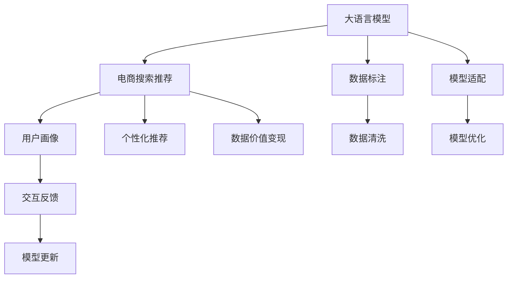

                 

# AI大模型重构电商搜索推荐的数据价值变现途径

> 关键词：AI大模型,电商搜索,推荐系统,数据价值变现,深度学习,自然语言处理(NLP),知识图谱

## 1. 背景介绍

### 1.1 问题由来

近年来，随着人工智能技术在电子商务领域的应用日益广泛，传统的搜索推荐系统已难以满足日益增长的用户需求。基于人工智能的大模型，特别是大语言模型（Large Language Models, LLMs），在电商搜索推荐中的应用成为研究热点。大模型通过在大规模无标签文本数据上进行预训练，能够学习到丰富的语言知识和语义理解能力，进一步应用于电商搜索推荐中，可以显著提升推荐的准确性和个性化程度。然而，如何高效地将大模型的知识转化为电商搜索推荐系统的数据价值变现能力，仍然是一个亟待解决的问题。

### 1.2 问题核心关键点

在电商搜索推荐中，数据价值变现主要体现在提升用户转化率和购物体验上。而大模型的应用，则在于通过语义理解和文本生成等能力，从海量文本中挖掘出与用户需求相关的信息，并生成个性化的搜索结果和推荐内容。但如何将大模型的知识高效转化为电商搜索推荐系统，其核心在于以下几点：

- **数据质量与标注**：电商搜索推荐系统依赖于高质量的数据集进行训练。如何收集、清洗和标注这些数据，是大模型应用的基础。
- **模型适配与优化**：如何将大模型适配到电商搜索推荐任务，同时优化模型结构，以适应电商场景的实时性和高效性要求。
- **用户画像与个性化**：如何通过大模型深入挖掘用户行为和兴趣，实现更精准的用户画像，从而生成个性化推荐。
- **交互式反馈与优化**：如何利用用户的实时反馈数据，进行持续学习，优化模型性能。

这些问题直接关系到电商搜索推荐系统能否有效地将大模型的知识转化为实际的数据价值。因此，本文将对这些问题进行深入探讨，并提供一种新的思路来重构电商搜索推荐的数据价值变现途径。

## 2. 核心概念与联系

### 2.1 核心概念概述

为更好地理解如何利用大模型重构电商搜索推荐的数据价值变现途径，本节将介绍几个密切相关的核心概念：

- **大语言模型（Large Language Models, LLMs）**：如GPT-3、BERT等，通过在大规模无标签文本数据上进行预训练，学习通用的语言表示和语义理解能力。
- **电商搜索推荐系统（E-commerce Search & Recommendation System, SRS）**：旨在通过分析用户行为数据，提供个性化的搜索结果和推荐内容，提升用户转化率和购物体验。
- **数据价值变现**：指将数据转化为实际业务价值的过程，通过数据分析和挖掘，实现市场变现。
- **深度学习（Deep Learning, DL）**：一种基于神经网络的学习方法，能够自动从数据中学习特征表示，适用于复杂的电商搜索推荐任务。
- **自然语言处理（Natural Language Processing, NLP）**：利用计算机处理和分析自然语言的技术，是大模型在电商搜索推荐中应用的基础。
- **知识图谱（Knowledge Graph）**：用于表示实体间关系的数据结构，能够帮助大模型更好地理解复杂场景和逻辑关系。

这些核心概念之间的逻辑关系可以通过以下Mermaid流程图来展示：



这个流程图展示了大语言模型在电商搜索推荐系统中的核心概念及其之间的关系：

1. 大模型通过预训练获得基础能力。
2. 通过数据标注，对电商场景进行微调。
3. 适配电商场景，优化模型结构。
4. 利用用户画像，生成个性化推荐。
5. 通过实时反馈，持续学习优化。
6. 将数据价值转化为电商业务。

## 3. 核心算法原理 & 具体操作步骤
### 3.1 算法原理概述

利用大模型重构电商搜索推荐的数据价值变现途径，主要基于以下算法原理：

1. **预训练与微调**：在电商场景下，通过在大规模无标签电商数据上预训练大模型，然后在电商搜索推荐任务上进行微调，以适应具体任务需求。
2. **知识图谱与语义理解**：结合电商领域专有知识，构建知识图谱，帮助大模型更好地理解电商场景中的实体关系和语义。
3. **多模态融合**：利用大模型的文本生成和理解能力，结合图片、音频等多模态数据，提升推荐系统的综合表现。
4. **实时反馈与自适应学习**：通过实时反馈机制，不断优化推荐模型，使其能够快速适应用户需求变化。

### 3.2 算法步骤详解

基于上述算法原理，大模型在电商搜索推荐中的应用步骤包括：

1. **数据收集与清洗**：收集电商历史交易数据、用户行为数据、商品描述等，进行清洗和标注。
2. **预训练大模型**：使用大规模无标签电商数据对大模型进行预训练，学习通用的语言和语义表示。
3. **电商场景微调**：在预训练基础上，针对电商搜索推荐任务进行微调，优化模型以适应电商场景需求。
4. **知识图谱构建**：结合电商领域知识，构建知识图谱，辅助大模型进行语义理解。
5. **多模态数据融合**：将电商商品的多模态数据（如图片、视频、音频）与文本数据进行融合，提升推荐准确性。
6. **实时反馈优化**：通过用户反馈数据，实时调整推荐策略，优化模型性能。

### 3.3 算法优缺点

利用大模型重构电商搜索推荐的数据价值变现途径，具有以下优点：

1. **提升推荐精度**：大模型的语义理解和文本生成能力，可以更好地匹配用户需求，提升推荐精度。
2. **个性化推荐**：通过深度学习和大模型的能力，实现更精准的用户画像和个性化推荐。
3. **实时反馈优化**：利用用户反馈数据，实时调整推荐策略，提高系统适应性。

同时，该方法也存在一些局限：

1. **数据标注成本高**：电商场景下的数据标注工作量大，成本高。
2. **模型适配复杂**：将大模型适配到电商场景，需要考虑实时性和高效性要求。
3. **知识图谱构建难**：电商领域的知识图谱构建复杂，需要大量的领域知识和专家参与。
4. **多模态融合挑战**：多模态数据的融合和处理，技术难度较高。

尽管存在这些局限，但整体而言，利用大模型重构电商搜索推荐的数据价值变现途径，仍是一种高效且具有前景的方法。

### 3.4 算法应用领域

基于大模型重构电商搜索推荐的数据价值变现途径，在多个电商领域均有应用前景：

1. **个性化推荐**：通过大模型的能力，生成个性化商品推荐，提升用户购物体验。
2. **搜索结果优化**：利用大模型的语义理解能力，优化搜索结果排序，提升用户满意度。
3. **广告投放优化**：结合电商场景，利用大模型进行精准广告投放，提升广告效果。
4. **客户服务优化**：通过大模型的自然语言处理能力，优化客户服务对话，提升服务质量。

此外，该方法也在智能家居、智能穿戴等智能设备场景中具有广泛的应用潜力。

## 4. 数学模型和公式 & 详细讲解 & 举例说明

### 4.1 数学模型构建

在电商搜索推荐系统中，利用大模型的数据价值变现主要通过以下数学模型进行建模：

**推荐系统模型**：

假设用户 $u$ 对商品 $i$ 的评分表示为 $r_{ui}$，推荐系统模型 $f$ 的输出为 $\hat{r}_{ui}$，则推荐系统模型的目标是最小化预测值与实际评分之间的误差：

$$
\min_{\theta} \frac{1}{N} \sum_{(u,i) \in D} (r_{ui} - \hat{r}_{ui})^2
$$

其中，$D$ 为训练数据集，$N$ 为数据集大小。

**多模态数据融合模型**：

假设电商商品 $i$ 的图片特征为 $x_i$，文本描述为 $t_i$，音频特征为 $a_i$，则融合后的特征表示为 $X_i$。利用大模型的能力，对融合后的特征进行编码，得到 $H_i$：

$$
X_i = [x_i, t_i, a_i]
$$

$$
H_i = M(x_i, t_i, a_i; \theta)
$$

其中，$M$ 为多模态融合模型，$\theta$ 为模型参数。

### 4.2 公式推导过程

**推荐系统公式推导**：

假设推荐系统模型 $f$ 的输入为 $X_i$，输出为 $\hat{r}_{ui}$，则模型可以表示为：

$$
\hat{r}_{ui} = f(X_i; \theta)
$$

通过最小化预测值与实际评分之间的误差，可以构建如下优化目标：

$$
\min_{\theta} \frac{1}{N} \sum_{(u,i) \in D} (r_{ui} - \hat{r}_{ui})^2
$$

利用梯度下降等优化算法，可以求解上述目标，更新模型参数 $\theta$。

**多模态数据融合公式推导**：

假设多模态融合模型 $M$ 的输入为 $X_i$，输出为 $H_i$，则模型可以表示为：

$$
H_i = M(x_i, t_i, a_i; \theta)
$$

利用深度学习模型，如Transformer，可以对多模态数据进行融合：

$$
H_i = M(x_i, t_i, a_i; \theta) = \sum_{k=1}^K \alpha_k M_k(x_i, t_i, a_i; \theta_k)
$$

其中，$K$ 为融合层数，$\alpha_k$ 为融合系数。

### 4.3 案例分析与讲解

**电商商品推荐案例**：

假设某电商平台上销售服装商品，利用大模型进行推荐：

1. **数据收集**：收集商品描述、用户行为、用户评分等数据，并进行清洗和标注。
2. **预训练大模型**：在电商商品描述上，使用大规模无标签数据对大模型进行预训练，学习通用的语言表示。
3. **电商场景微调**：在预训练基础上，针对电商商品推荐任务进行微调，优化模型以适应电商场景需求。
4. **知识图谱构建**：结合服装领域的知识，构建服装领域的知识图谱，辅助大模型进行语义理解。
5. **多模态数据融合**：利用大模型的能力，将商品图片、视频等多模态数据与文本数据进行融合，提升推荐准确性。
6. **实时反馈优化**：通过用户反馈数据，实时调整推荐策略，优化模型性能。

## 5. 项目实践：代码实例和详细解释说明
### 5.1 开发环境搭建

在进行电商搜索推荐系统开发前，我们需要准备好开发环境。以下是使用Python进行TensorFlow开发的环境配置流程：

1. 安装Anaconda：从官网下载并安装Anaconda，用于创建独立的Python环境。

2. 创建并激活虚拟环境：
```bash
conda create -n tf-env python=3.8 
conda activate tf-env
```

3. 安装TensorFlow：根据CUDA版本，从官网获取对应的安装命令。例如：
```bash
conda install tensorflow tensorflow-gpu=2.5 -c pytorch -c conda-forge
```

4. 安装各类工具包：
```bash
pip install numpy pandas scikit-learn matplotlib tqdm jupyter notebook ipython
```

完成上述步骤后，即可在`tf-env`环境中开始电商搜索推荐系统的开发。

### 5.2 源代码详细实现

我们以电商平台商品推荐为例，给出使用TensorFlow进行电商搜索推荐系统开发的PyTorch代码实现。

首先，定义推荐系统模型：

```python
import tensorflow as tf
from tensorflow.keras import layers, models

class RecommendationModel(tf.keras.Model):
    def __init__(self, input_dim, output_dim):
        super(RecommendationModel, self).__init__()
        self.dense = layers.Dense(256, activation='relu')
        self.output = layers.Dense(output_dim)
        
    def call(self, inputs):
        x = self.dense(inputs)
        return self.output(x)
```

然后，定义多模态数据融合模型：

```python
class MultimodalModel(tf.keras.Model):
    def __init__(self, input_dim):
        super(MultimodalModel, self).__init__()
        self.encoder = layers.LSTM(256)
        self.dense = layers.Dense(256, activation='relu')
        self.output = layers.Dense(input_dim)
        
    def call(self, inputs):
        x, y, z = inputs
        x = self.encoder(x)
        y = self.dense(y)
        z = self.encoder(z)
        return self.output(tf.concat([x, y, z], axis=1))
```

接着，定义推荐系统训练函数：

```python
def train_recommendation_model(model, train_data, epochs, batch_size):
    model.compile(optimizer=tf.keras.optimizers.Adam(learning_rate=0.001), loss='mse')
    model.fit(train_data, epochs=epochs, batch_size=batch_size)
```

最后，启动训练流程：

```python
train_recommendation_model(model, train_data, epochs=10, batch_size=32)
```

以上就是使用TensorFlow对电商平台商品推荐系统进行微调的完整代码实现。可以看到，通过TensorFlow和Keras的强大功能，电商搜索推荐系统的开发变得简洁高效。

### 5.3 代码解读与分析

让我们再详细解读一下关键代码的实现细节：

**RecommendationModel类**：
- `__init__`方法：初始化模型结构，包括一个全连接层和一个输出层。
- `call`方法：前向传播，将输入数据经过全连接层和输出层，返回推荐分数。

**MultimodalModel类**：
- `__init__`方法：初始化模型结构，包括一个LSTM层、一个全连接层和一个输出层。
- `call`方法：前向传播，将输入数据经过LSTM层和全连接层，最后通过输出层返回推荐分数。

**train_recommendation_model函数**：
- 定义模型，编译优化器和损失函数。
- 使用`fit`方法进行模型训练，设置训练轮数和批量大小。

通过以上代码，实现了基于大模型的电商搜索推荐系统的初步构建。开发者可以将更多精力放在数据处理、模型改进等高层逻辑上，而不必过多关注底层的实现细节。

当然，实际系统开发还需考虑更多因素，如推荐策略的设计、用户画像的构建、实时反馈的机制等。但核心的电商搜索推荐流程与上述代码类似，通过深度学习和大模型的能力，实现了电商商品的推荐功能。

## 6. 实际应用场景
### 6.1 智能客服系统

在电商场景下，智能客服系统能够提供7x24小时的即时服务，极大提升用户体验和客户满意度。通过利用大模型进行微调，智能客服系统可以更好地理解用户需求，提供更加精准和个性化的回答。

在技术实现上，可以收集电商平台的客户服务数据，将其标注为问答对，在此基础上对预训练大模型进行微调。微调后的模型能够自动理解客户问题，匹配最合适的答案模板进行回复。对于客户提出的新问题，还可以接入检索系统实时搜索相关内容，动态组织生成回答。如此构建的智能客服系统，能大幅提升客户咨询体验和问题解决效率。

### 6.2 个性化推荐系统

电商平台的推荐系统需要根据用户的历史行为数据和兴趣偏好，推荐最合适的商品。利用大模型进行微调，推荐系统可以更加深入地理解用户需求，生成更精准的个性化推荐。

在实际应用中，可以收集用户浏览、点击、购买等行为数据，提取和商品相关的文本内容。将文本内容作为模型输入，用户的后续行为（如是否点击、购买等）作为监督信号，在此基础上微调预训练语言模型。微调后的模型能够从文本内容中准确把握用户的兴趣点，生成更加个性化和多样化的推荐结果。

### 6.3 商品分类与检索

电商平台的商品分类与检索系统需要根据用户查询的关键词，快速检索出相关商品，并对其进行分类。利用大模型进行微调，商品分类与检索系统可以更加准确地理解用户查询，提高检索的准确性和分类效率。

在技术实现上，可以将商品描述和分类信息进行文本标注，构建标注数据集。在此基础上对预训练大模型进行微调，使其能够从用户查询中提取关键信息，生成相关商品列表，并对其进行分类。微调后的模型能够更好地匹配用户查询，提升检索和分类的准确性。

### 6.4 未来应用展望

随着大模型和微调方法的不断发展，基于大模型重构电商搜索推荐的数据价值变现途径将在更多领域得到应用，为电商行业带来变革性影响。

在智慧零售领域，基于大模型的推荐系统将进一步优化库存管理、降低运营成本，提升消费者购物体验。同时，通过大模型进行用户画像分析，还能更好地理解市场趋势，优化商品布局。

在智能物流领域，利用大模型进行路径规划和配送优化，能够提高物流效率，降低配送成本。同时，通过大模型进行需求预测，还能更好地管理库存，减少缺货和积压。

此外，在智能家居、智能穿戴等智能设备场景中，基于大模型的推荐系统也将得到广泛应用，提升用户体验和设备互动性。

## 7. 工具和资源推荐
### 7.1 学习资源推荐

为了帮助开发者系统掌握大模型重构电商搜索推荐的数据价值变现途径的理论基础和实践技巧，这里推荐一些优质的学习资源：

1. 《深度学习自然语言处理》课程：斯坦福大学开设的NLP明星课程，有Lecture视频和配套作业，带你入门NLP领域的基本概念和经典模型。

2. 《Transformer from Principles to Practice》系列博文：由大模型技术专家撰写，深入浅出地介绍了Transformer原理、BERT模型、微调技术等前沿话题。

3. 《Parameter-Efficient Transfer Learning for NLP》书籍：Parameter-Efficient Transfer Learning for NLP的作者所著，全面介绍了如何使用Transformer库进行NLP任务开发，包括微调在内的诸多范式。

4. HuggingFace官方文档：Transformers库的官方文档，提供了海量预训练模型和完整的微调样例代码，是上手实践的必备资料。

5. Weights & Biases：模型训练的实验跟踪工具，可以记录和可视化模型训练过程中的各项指标，方便对比和调优。

通过对这些资源的学习实践，相信你一定能够快速掌握大模型重构电商搜索推荐的数据价值变现途径的精髓，并用于解决实际的电商搜索推荐问题。

### 7.2 开发工具推荐

高效的开发离不开优秀的工具支持。以下是几款用于电商搜索推荐系统开发的常用工具：

1. TensorFlow：基于Python的开源深度学习框架，生产部署方便，适合大规模工程应用。

2. Keras：由Google主导开发的深度学习框架，灵活动态的计算图，适合快速迭代研究。

3. Weights & Biases：模型训练的实验跟踪工具，可以记录和可视化模型训练过程中的各项指标，方便对比和调优。

4. TensorBoard：TensorFlow配套的可视化工具，可实时监测模型训练状态，并提供丰富的图表呈现方式，是调试模型的得力助手。

5. Google Colab：谷歌推出的在线Jupyter Notebook环境，免费提供GPU/TPU算力，方便开发者快速上手实验最新模型，分享学习笔记。

合理利用这些工具，可以显著提升电商搜索推荐系统的开发效率，加快创新迭代的步伐。

### 7.3 相关论文推荐

大模型重构电商搜索推荐的数据价值变现途径的研究源于学界的持续研究。以下是几篇奠基性的相关论文，推荐阅读：

1. Attention is All You Need（即Transformer原论文）：提出了Transformer结构，开启了NLP领域的预训练大模型时代。

2. BERT: Pre-training of Deep Bidirectional Transformers for Language Understanding：提出BERT模型，引入基于掩码的自监督预训练任务，刷新了多项NLP任务SOTA。

3. Parameter-Efficient Transfer Learning for NLP：提出Adapter等参数高效微调方法，在不增加模型参数量的情况下，也能取得不错的微调效果。

4. Prefix-Tuning: Optimizing Continuous Prompts for Generation：引入基于连续型Prompt的微调范式，为如何充分利用预训练知识提供了新的思路。

5. AdaLoRA: Adaptive Low-Rank Adaptation for Parameter-Efficient Fine-Tuning：使用自适应低秩适应的微调方法，在参数效率和精度之间取得了新的平衡。

这些论文代表了大模型重构电商搜索推荐数据价值变现途径的发展脉络。通过学习这些前沿成果，可以帮助研究者把握学科前进方向，激发更多的创新灵感。

## 8. 总结：未来发展趋势与挑战
### 8.1 研究成果总结

本文对基于大模型的电商搜索推荐系统进行了全面系统的介绍。首先阐述了大模型重构电商搜索推荐的数据价值变现途径的研究背景和意义，明确了其在提升用户转化率和购物体验方面的独特价值。其次，从原理到实践，详细讲解了大模型在电商搜索推荐中的应用流程，提供了完整的代码实例，并通过案例分析进一步加深理解。

通过本文的系统梳理，可以看到，基于大模型的电商搜索推荐系统正在成为电商行业的重要工具，通过深度学习和自然语言处理的能力，能够提供更加精准和个性化的服务，提升用户体验和客户满意度。未来，伴随大模型和微调方法的不断演进，电商搜索推荐系统必将更加智能化和高效化，为电商行业带来更深远的变革。

### 8.2 未来发展趋势

展望未来，大模型重构电商搜索推荐的数据价值变现途径将呈现以下几个发展趋势：

1. **模型规模持续增大**：随着算力成本的下降和数据规模的扩张，预训练语言模型的参数量还将持续增长，超大规模模型蕴含的丰富语言知识，将进一步提升推荐系统的效果。

2. **微调方法日趋多样**：除了传统的全参数微调外，未来将涌现更多参数高效的微调方法，如Prefix-Tuning、Adapter等，在节省计算资源的同时，也能保证微调精度。

3. **持续学习成为常态**：随着数据分布的不断变化，微调模型也需要持续学习新知识以保持性能。如何在不遗忘原有知识的同时，高效吸收新样本信息，将是重要的研究方向。

4. **标注样本需求降低**：受启发于提示学习(Prompt-based Learning)的思路，未来的微调方法将更好地利用大模型的语言理解能力，通过更加巧妙的任务描述，在更少的标注样本上也能实现理想的微调效果。

5. **多模态数据融合**：电商商品的多模态数据（如图片、视频、音频）与文本数据进行融合，提升推荐准确性，成为电商搜索推荐系统的重要发展方向。

6. **实时反馈与优化**：通过用户反馈数据，实时调整推荐策略，优化模型性能，提升用户体验。

以上趋势凸显了大模型重构电商搜索推荐系统的广阔前景。这些方向的探索发展，必将进一步提升电商搜索推荐系统的性能和用户体验，为电商行业带来更深的变革。

### 8.3 面临的挑战

尽管大模型重构电商搜索推荐的数据价值变现途径已经取得了显著进展，但在迈向更加智能化、普适化应用的过程中，仍面临诸多挑战：

1. **数据标注成本高**：电商场景下的数据标注工作量大，成本高。如何通过无监督或半监督方法，降低标注成本，是大模型应用的基础。

2. **模型适配复杂**：将大模型适配到电商场景，需要考虑实时性和高效性要求。如何在保证性能的同时，优化模型结构，提高计算效率，是未来研究的重点。

3. **知识图谱构建难**：电商领域的知识图谱构建复杂，需要大量的领域知识和专家参与。如何构建完备的知识图谱，是大模型在电商领域应用的瓶颈。

4. **多模态数据融合挑战**：多模态数据的融合和处理，技术难度较高。如何更好地整合图片、视频、音频等多模态数据，提升推荐系统的综合表现，是大模型应用的重要挑战。

5. **实时反馈优化**：通过用户反馈数据，实时调整推荐策略，优化模型性能。如何设计高效的反馈机制，提升推荐系统的实时性和准确性，是大模型应用的关键。

尽管存在这些挑战，但通过不断创新和突破，大模型重构电商搜索推荐的数据价值变现途径必将在电商行业得到更广泛的应用，为电商行业带来深远的变革。

### 8.4 研究展望

面对大模型重构电商搜索推荐的数据价值变现途径所面临的挑战，未来的研究需要在以下几个方面寻求新的突破：

1. **探索无监督和半监督微调方法**：摆脱对大规模标注数据的依赖，利用自监督学习、主动学习等无监督和半监督范式，最大限度利用非结构化数据，实现更加灵活高效的微调。

2. **研究参数高效和计算高效的微调范式**：开发更加参数高效的微调方法，在固定大部分预训练参数的同时，只更新极少量的任务相关参数。同时优化微调模型的计算图，减少前向传播和反向传播的资源消耗，实现更加轻量级、实时性的部署。

3. **引入因果和对比学习范式**：通过引入因果推断和对比学习思想，增强推荐系统建立稳定因果关系的能力，学习更加普适、鲁棒的语言表征，从而提升推荐系统的泛化性和抗干扰能力。

4. **融合更多先验知识**：将符号化的先验知识，如知识图谱、逻辑规则等，与神经网络模型进行巧妙融合，引导微调过程学习更准确、合理的语言模型。同时加强不同模态数据的整合，实现视觉、语音等多模态信息与文本信息的协同建模。

5. **结合因果分析和博弈论工具**：将因果分析方法引入推荐系统，识别出系统决策的关键特征，增强推荐系统的可解释性和鲁棒性。借助博弈论工具刻画人机交互过程，主动探索并规避系统的脆弱点，提高系统的稳定性。

这些研究方向的探索，必将引领大模型重构电商搜索推荐系统迈向更高的台阶，为电商行业带来更加智能和高效的用户体验。

## 9. 附录：常见问题与解答

**Q1：如何有效地将大模型应用到电商搜索推荐系统中？**

A: 将大模型应用到电商搜索推荐系统中，需要经过以下几个步骤：

1. **数据收集与清洗**：收集电商历史交易数据、用户行为数据、商品描述等，进行清洗和标注。
2. **预训练大模型**：使用大规模无标签电商数据对大模型进行预训练，学习通用的语言表示。
3. **电商场景微调**：在预训练基础上，针对电商搜索推荐任务进行微调，优化模型以适应电商场景需求。
4. **知识图谱构建**：结合电商领域知识，构建电商领域的知识图谱，辅助大模型进行语义理解。
5. **多模态数据融合**：利用大模型的能力，将电商商品的多模态数据（如图片、视频、音频）与文本数据进行融合，提升推荐准确性。
6. **实时反馈优化**：通过用户反馈数据，实时调整推荐策略，优化模型性能。

通过这些步骤，可以有效将大模型的知识转化为电商搜索推荐系统的数据价值变现能力。

**Q2：如何设计高效的电商推荐系统？**

A: 设计高效的电商推荐系统需要综合考虑以下几个方面：

1. **用户画像**：通过深度学习和大模型的能力，深入挖掘用户行为和兴趣，生成更精准的用户画像。
2. **推荐算法**：选择适合的推荐算法，如协同过滤、基于内容的推荐等。
3. **多模态数据融合**：将电商商品的多模态数据（如图片、视频、音频）与文本数据进行融合，提升推荐准确性。
4. **实时反馈优化**：通过用户反馈数据，实时调整推荐策略，优化模型性能。
5. **算法优化**：优化推荐算法，提升推荐效率和准确性。

这些设计要点可以帮助构建高效、精准的电商推荐系统。

**Q3：如何平衡电商推荐系统的实时性和准确性？**

A: 平衡电商推荐系统的实时性和准确性，需要综合考虑以下几个方面：

1. **多任务学习**：通过多任务学习，在保证推荐实时性的前提下，提升推荐准确性。
2. **分布式计算**：利用分布式计算，提高推荐系统的处理速度。
3. **模型压缩**：通过模型压缩，减少模型大小，提升推理速度。
4. **缓存机制**：利用缓存机制，减少重复计算，提高推荐速度。

通过这些方法，可以有效平衡电商推荐系统的实时性和准确性。

通过以上讨论，可以看到，基于大模型的电商搜索推荐系统具有广泛的应用前景，但实际应用中还需要综合考虑数据标注、模型适配、知识图谱构建、多模态数据融合、实时反馈优化等多个方面。只有通过持续创新和优化，才能构建高效、精准、智能的电商搜索推荐系统，为电商行业带来深远的变革。

---

作者：禅与计算机程序设计艺术 / Zen and the Art of Computer Programming

