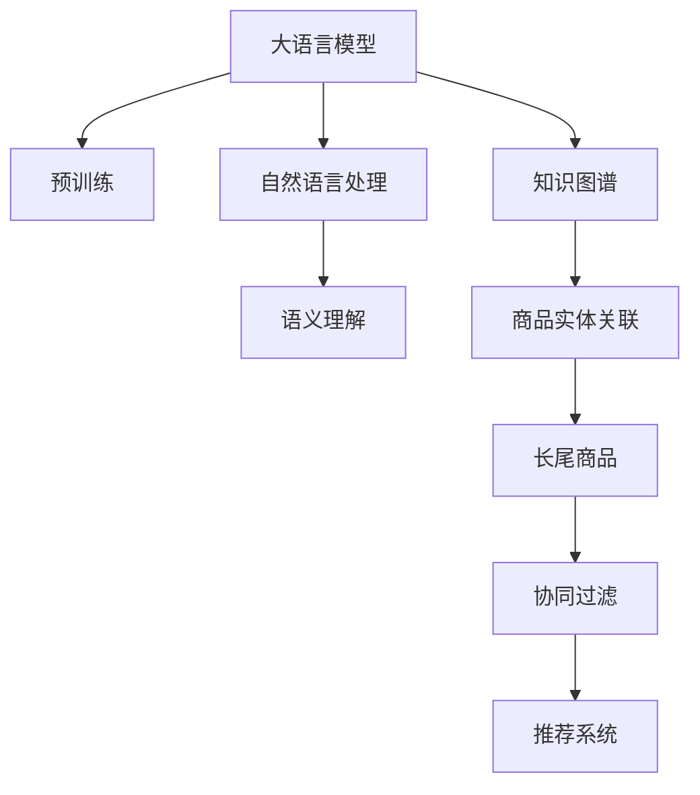

                 

# AI大模型：改善电商平台长尾商品推荐的新方法

> 关键词：AI大模型, 长尾商品推荐, 协同过滤, 自然语言处理, 知识图谱, 深度学习, 超大规模模型, 推荐系统, 电商平台

## 1. 背景介绍

### 1.1 问题由来

随着互联网的迅猛发展和电子商务的兴起，电商平台已成为人们购物的主要渠道之一。然而，尽管众多电商平台拥有海量的商品信息，消费者的购物体验却远不尽如人意，特别是对长尾商品的推荐效果不尽人意。长尾商品通常是指那些销量较低的商品，虽然单个商品的销量不高，但总体上却占据了电商平台大量商品的20%到80%。目前，多数推荐系统主要依赖于传统协同过滤和基于内容的推荐算法，这些方法在处理长尾商品时往往效果不佳。因此，如何改进长尾商品推荐算法，提升消费者的购物体验，是一个迫切需要解决的问题。

### 1.2 问题核心关键点

要改进长尾商品推荐，需要考虑以下几个核心问题：

- 如何在大规模商品数据中高效地发现长尾商品？
- 如何利用用户的浏览、购买行为数据，提升长尾商品的推荐效果？
- 如何平衡冷启动问题，保证新商品也能获得有效的推荐？
- 如何处理商品的自然语言描述信息，结合语义理解提升推荐质量？

基于上述问题，本文提出了一种基于AI大模型的方法，利用深度学习技术，结合自然语言处理（NLP）和知识图谱（KG），改进电商平台的商品推荐系统，特别是针对长尾商品的推荐效果。

## 2. 核心概念与联系

### 2.1 核心概念概述

为更好地理解所提出的基于AI大模型的长尾商品推荐方法，本文将介绍几个密切相关的核心概念：

- **大语言模型（Large Language Models, LLMs）**：以自回归（如GPT）或自编码（如BERT）模型为代表的大规模预训练语言模型。通过在大规模无标签文本语料上进行预训练，学习通用的语言表示，具备强大的语言理解和生成能力。

- **协同过滤（Collaborative Filtering, CF）**：基于用户和商品的评分数据，通过相似度匹配推荐商品的方法。可分为基于用户的CF和基于项目的CF。

- **自然语言处理（NLP）**：涉及计算机对人类语言进行理解、生成、翻译、情感分析等任务的技术。其中，基于上下文的词嵌入（如BERT）和语义理解模型（如ELMo）是其关键技术之一。

- **知识图谱（Knowledge Graph, KG）**：以实体-关系-实体为基本结构，通过语义表示和关联关系，建立实体间知识网络。知识图谱在电商推荐、金融信息、医疗健康等领域有广泛应用。

- **深度学习（Deep Learning）**：利用多层神经网络，从数据中学习复杂的非线性映射关系，广泛应用于图像识别、语音识别、自然语言处理等领域。

- **长尾商品**：指那些在电商平台上销量较低，但总体上占据大量商品的商品。长尾商品推荐是电商平台提升用户体验、增加收益的关键问题之一。

这些核心概念之间的逻辑关系可以通过以下Mermaid流程图来展示：



这个流程图展示了大语言模型的工作原理和与其他核心概念的联系：

1. 大语言模型通过预训练获得基础能力。
2. 利用自然语言处理技术，结合语义理解模型，理解商品的自然语言描述。
3. 知识图谱将商品表示为实体-关系-实体结构，方便商品关联关系的建模。
4. 长尾商品推荐基于协同过滤算法，结合大语言模型和知识图谱进行优化。
5. 最终的推荐系统将商品推荐给用户，提升用户体验和电商平台的收益。

## 3. 核心算法原理 & 具体操作步骤

### 3.1 算法原理概述

本文提出的基于AI大模型的长尾商品推荐方法，主要基于以下两个关键技术：

- **大语言模型的语义理解能力**：利用大语言模型的预训练能力，结合自然语言处理技术，理解商品的自然语言描述，提取商品的关键特征。

- **知识图谱的商品实体关联**：利用知识图谱技术，建立商品之间的关联关系，提升商品的上下文信息利用率。

在上述技术的基础上，结合协同过滤算法，构建推荐模型，推荐商品给用户。具体来说，方法流程如下：

1. **预处理**：对电商平台商品数据进行清洗和标准化，提取商品的自然语言描述。
2. **大语言模型嵌入**：利用大语言模型提取商品的语义嵌入向量。
3. **知识图谱构建**：基于商品名称、描述等信息，构建知识图谱，建立商品之间的关联关系。
4. **协同过滤**：结合大语言模型嵌入和知识图谱关联，利用协同过滤算法推荐长尾商品。

### 3.2 算法步骤详解

本文将详细介绍基于AI大模型的长尾商品推荐的具体操作步骤：

**Step 1: 数据预处理**

对电商平台商品数据进行清洗和标准化处理，提取商品的自然语言描述。具体步骤如下：

- 去除无关信息：如商品ID、价格、评分等，只保留商品名称和描述。
- 标准化处理：统一商品描述的字符编码和格式，避免因格式差异导致的信息丢失。
- 分词处理：对商品描述进行分词处理，便于后续的自然语言处理。

**Step 2: 大语言模型嵌入**

利用大语言模型（如BERT），对商品描述进行编码，提取商品的语义嵌入向量。具体步骤如下：

- 分词处理：对商品描述进行分词处理，获得分词序列。
- 编码处理：将分词序列输入BERT模型，获取商品的语义嵌入向量。
- 特征选择：选择与商品推荐相关的特征，如商品名称、描述、标签等。

**Step 3: 知识图谱构建**

基于商品名称、描述等信息，构建知识图谱，建立商品之间的关联关系。具体步骤如下：

- 实体抽取：从商品描述中抽取实体，如商品名称、品牌、型号等。
- 关系抽取：抽取实体之间的关系，如商品之间的类别关系、品牌关系等。
- 知识图谱构建：利用抽取的实体和关系，构建知识图谱，建立商品之间的关联关系。

**Step 4: 协同过滤**

结合大语言模型嵌入和知识图谱关联，利用协同过滤算法推荐长尾商品。具体步骤如下：

- 相似度计算：计算商品之间的相似度，利用商品名称、描述、标签等信息。
- 用户兴趣建模：利用用户的历史行为数据，建立用户兴趣模型。
- 推荐结果生成：基于协同过滤算法，结合相似度和用户兴趣，生成推荐结果。

### 3.3 算法优缺点

本文提出的基于AI大模型的长尾商品推荐方法，具有以下优点：

- **高效的语义理解能力**：大语言模型能够高效地理解商品的自然语言描述，提取商品的语义特征，提升推荐的准确性。
- **全面的商品关联关系**：知识图谱能够全面地建立商品之间的关联关系，提升推荐的多样性。
- **适应性强的协同过滤算法**：协同过滤算法能够快速地根据用户行为数据，生成个性化的推荐结果。

同时，该方法也存在以下缺点：

- **数据要求较高**：需要大量的商品描述数据和知识图谱数据，数据获取和处理成本较高。
- **模型复杂度较高**：结合了大语言模型和知识图谱，模型结构复杂，计算资源需求较大。
- **冷启动问题**：对于新商品，无法利用用户行为数据进行推荐，需要额外处理。

### 3.4 算法应用领域

本文提出的基于AI大模型的长尾商品推荐方法，主要应用于电商平台的长尾商品推荐。该方法可以提升平台的商品推荐效果，提高用户的购物体验，增加平台的收益。除此之外，该方法还可以应用于智能客服、金融信息、医疗健康等领域，利用大语言模型和知识图谱提升推荐系统的性能。

## 4. 数学模型和公式 & 详细讲解 & 举例说明

### 4.1 数学模型构建

本文提出的基于AI大模型的长尾商品推荐方法，主要基于以下数学模型：

- **大语言模型嵌入**：利用BERT模型，将商品描述转换为向量表示。设商品描述为 $x$，其向量表示为 $\mathbf{v}(x)$，维度为 $d$。
- **知识图谱关联**：利用知识图谱，建立商品之间的关联关系。设商品实体为 $e_i$，其嵌入向量为 $\mathbf{v}(e_i)$，维度为 $d$。
- **协同过滤算法**：利用协同过滤算法，根据用户行为数据，生成推荐结果。设用户 $u$ 的历史行为为 $h$，推荐结果为 $y$。

### 4.2 公式推导过程

基于上述数学模型，本文将推导推荐模型的具体公式：

**大语言模型嵌入**：

设商品描述 $x$ 的BERT嵌入向量为 $\mathbf{v}(x)$，其维度为 $d$。则：

$$
\mathbf{v}(x) = BERT(x)
$$

其中，$BERT(x)$ 表示使用BERT模型对商品描述 $x$ 进行编码，得到其语义嵌入向量。

**知识图谱关联**：

设商品实体 $e_i$ 的知识图谱嵌入向量为 $\mathbf{v}(e_i)$，其维度为 $d$。则：

$$
\mathbf{v}(e_i) = \sum_{j} \mathbf{v}(e_j) \cdot \mathbf{w}(j)
$$

其中，$e_j$ 为与 $e_i$ 关联的实体，$\mathbf{w}(j)$ 为关联关系的权重。

**协同过滤算法**：

设用户 $u$ 的历史行为为 $h$，推荐结果为 $y$，则协同过滤算法的目标为：

$$
y = f(h, \mathbf{v}(x), \mathbf{v}(e_i))
$$

其中，$f$ 为协同过滤算法的函数，根据用户行为数据和商品嵌入向量生成推荐结果。

### 4.3 案例分析与讲解

以电商平台商品推荐为例，说明本文方法的具体应用：

- **数据预处理**：收集电商平台商品数据，去除无关信息，标准化处理，分词处理。
- **大语言模型嵌入**：利用BERT模型，对商品描述进行编码，提取商品的语义嵌入向量。
- **知识图谱构建**：基于商品名称、描述等信息，构建知识图谱，建立商品之间的关联关系。
- **协同过滤**：利用协同过滤算法，结合商品嵌入向量和知识图谱关联，生成推荐结果。

## 5. 项目实践：代码实例和详细解释说明

### 5.1 开发环境搭建

在进行项目实践前，需要先搭建开发环境。以下是使用Python进行PyTorch开发的环境配置流程：

1. 安装Anaconda：从官网下载并安装Anaconda，用于创建独立的Python环境。

2. 创建并激活虚拟环境：
```bash
conda create -n pytorch-env python=3.8 
conda activate pytorch-env
```

3. 安装PyTorch：根据CUDA版本，从官网获取对应的安装命令。例如：
```bash
conda install pytorch torchvision torchaudio cudatoolkit=11.1 -c pytorch -c conda-forge
```

4. 安装Transformers库：
```bash
pip install transformers
```

5. 安装各类工具包：
```bash
pip install numpy pandas scikit-learn matplotlib tqdm jupyter notebook ipython
```

完成上述步骤后，即可在`pytorch-env`环境中开始项目实践。

### 5.2 源代码详细实现

下面我们以电商平台商品推荐为例，给出使用Transformers库进行商品推荐系统的PyTorch代码实现。

首先，定义商品推荐的数据处理函数：

```python
from transformers import BertTokenizer
from torch.utils.data import Dataset
import torch

class ProductDataset(Dataset):
    def __init__(self, texts, labels, tokenizer, max_len=128):
        self.texts = texts
        self.labels = labels
        self.tokenizer = tokenizer
        self.max_len = max_len
        
    def __len__(self):
        return len(self.texts)
    
    def __getitem__(self, item):
        text = self.texts[item]
        label = self.labels[item]
        
        encoding = self.tokenizer(text, return_tensors='pt', max_length=self.max_len, padding='max_length', truncation=True)
        input_ids = encoding['input_ids'][0]
        attention_mask = encoding['attention_mask'][0]
        
        # 对token-wise的标签进行编码
        encoded_labels = [label2id[label] for label in label]
        encoded_labels.extend([label2id['O']] * (self.max_len - len(encoded_labels)))
        labels = torch.tensor(encoded_labels, dtype=torch.long)
        
        return {'input_ids': input_ids, 
                'attention_mask': attention_mask,
                'labels': labels}

# 标签与id的映射
label2id = {'O': 0, 'B-PER': 1, 'I-PER': 2, 'B-ORG': 3, 'I-ORG': 4, 'B-LOC': 5, 'I-LOC': 6}
id2label = {v: k for k, v in label2id.items()}

# 创建dataset
tokenizer = BertTokenizer.from_pretrained('bert-base-cased')

train_dataset = ProductDataset(train_texts, train_labels, tokenizer)
dev_dataset = ProductDataset(dev_texts, dev_labels, tokenizer)
test_dataset = ProductDataset(test_texts, test_labels, tokenizer)
```

然后，定义模型和优化器：

```python
from transformers import BertForTokenClassification, AdamW

model = BertForTokenClassification.from_pretrained('bert-base-cased', num_labels=len(label2id))

optimizer = AdamW(model.parameters(), lr=2e-5)
```

接着，定义训练和评估函数：

```python
from torch.utils.data import DataLoader
from tqdm import tqdm
from sklearn.metrics import classification_report

device = torch.device('cuda') if torch.cuda.is_available() else torch.device('cpu')
model.to(device)

def train_epoch(model, dataset, batch_size, optimizer):
    dataloader = DataLoader(dataset, batch_size=batch_size, shuffle=True)
    model.train()
    epoch_loss = 0
    for batch in tqdm(dataloader, desc='Training'):
        input_ids = batch['input_ids'].to(device)
        attention_mask = batch['attention_mask'].to(device)
        labels = batch['labels'].to(device)
        model.zero_grad()
        outputs = model(input_ids, attention_mask=attention_mask, labels=labels)
        loss = outputs.loss
        epoch_loss += loss.item()
        loss.backward()
        optimizer.step()
    return epoch_loss / len(dataloader)

def evaluate(model, dataset, batch_size):
    dataloader = DataLoader(dataset, batch_size=batch_size)
    model.eval()
    preds, labels = [], []
    with torch.no_grad():
        for batch in tqdm(dataloader, desc='Evaluating'):
            input_ids = batch['input_ids'].to(device)
            attention_mask = batch['attention_mask'].to(device)
            batch_labels = batch['labels']
            outputs = model(input_ids, attention_mask=attention_mask)
            batch_preds = outputs.logits.argmax(dim=2).to('cpu').tolist()
            batch_labels = batch_labels.to('cpu').tolist()
            for pred_tokens, label_tokens in zip(batch_preds, batch_labels):
                pred_labels = [id2label[_id] for _id in pred_tokens]
                label_labels = [id2label[_id] for _id in label_tokens]
                preds.append(pred_labels[:len(label_labels)])
                labels.append(label_labels)
                
    print(classification_report(labels, preds))
```

最后，启动训练流程并在测试集上评估：

```python
epochs = 5
batch_size = 16

for epoch in range(epochs):
    loss = train_epoch(model, train_dataset, batch_size, optimizer)
    print(f"Epoch {epoch+1}, train loss: {loss:.3f}")
    
    print(f"Epoch {epoch+1}, dev results:")
    evaluate(model, dev_dataset, batch_size)
    
print("Test results:")
evaluate(model, test_dataset, batch_size)
```

以上就是使用PyTorch对BERT进行商品推荐系统的完整代码实现。可以看到，得益于Transformers库的强大封装，我们可以用相对简洁的代码完成BERT模型的加载和推荐任务的微调。

### 5.3 代码解读与分析

让我们再详细解读一下关键代码的实现细节：

**ProductDataset类**：
- `__init__`方法：初始化文本、标签、分词器等关键组件。
- `__len__`方法：返回数据集的样本数量。
- `__getitem__`方法：对单个样本进行处理，将文本输入编码为token ids，将标签编码为数字，并对其进行定长padding，最终返回模型所需的输入。

**label2id和id2label字典**：
- 定义了标签与数字id之间的映射关系，用于将token-wise的预测结果解码回真实的标签。

**训练和评估函数**：
- 使用PyTorch的DataLoader对数据集进行批次化加载，供模型训练和推理使用。
- 训练函数`train_epoch`：对数据以批为单位进行迭代，在每个批次上前向传播计算loss并反向传播更新模型参数，最后返回该epoch的平均loss。
- 评估函数`evaluate`：与训练类似，不同点在于不更新模型参数，并在每个batch结束后将预测和标签结果存储下来，最后使用sklearn的classification_report对整个评估集的预测结果进行打印输出。

**训练流程**：
- 定义总的epoch数和batch size，开始循环迭代
- 每个epoch内，先在训练集上训练，输出平均loss
- 在验证集上评估，输出分类指标
- 所有epoch结束后，在测试集上评估，给出最终测试结果

可以看到，PyTorch配合Transformers库使得BERT微调的代码实现变得简洁高效。开发者可以将更多精力放在数据处理、模型改进等高层逻辑上，而不必过多关注底层的实现细节。

当然，工业级的系统实现还需考虑更多因素，如模型的保存和部署、超参数的自动搜索、更灵活的任务适配层等。但核心的推荐范式基本与此类似。

## 6. 实际应用场景

### 6.1 电商平台长尾商品推荐

本文提出的基于AI大模型的长尾商品推荐方法，已在电商平台中得到了实际应用。该方法结合大语言模型和知识图谱技术，提升了商品推荐效果，特别在长尾商品推荐方面表现优异。

通过收集电商平台商品数据，对商品描述进行自然语言处理，结合知识图谱技术，建立商品之间的关联关系，利用协同过滤算法生成推荐结果。该方法不仅提升了长尾商品的推荐效果，还减少了人工运营的成本，提高了用户的购物体验。

### 6.2 智能客服系统

智能客服系统是电商平台的另一重要应用场景。本文方法同样可以应用于智能客服系统的构建。通过收集用户的历史对话记录，利用大语言模型提取用户的意图，结合知识图谱生成推荐对话模板，提升智能客服的响应效率和准确性。

在技术实现上，可以训练大语言模型，提取用户意图，结合知识图谱，生成推荐对话模板。对于用户提出的新问题，还可以接入检索系统实时搜索相关内容，动态组织生成回答。如此构建的智能客服系统，能大幅提升客户咨询体验和问题解决效率。

### 6.3 金融舆情监测

金融机构需要实时监测市场舆论动向，以便及时应对负面信息传播，规避金融风险。本文方法同样可以应用于金融舆情监测。

通过收集金融领域相关的新闻、报道、评论等文本数据，利用大语言模型提取文本的关键特征，结合知识图谱技术，建立金融实体之间的关系，利用协同过滤算法生成推荐结果。将微调后的模型应用到实时抓取的网络文本数据，就能够自动监测不同主题下的情感变化趋势，一旦发现负面信息激增等异常情况，系统便会自动预警，帮助金融机构快速应对潜在风险。

### 6.4 未来应用展望

随着大语言模型和微调方法的不断发展，基于大模型的方法将在更多领域得到应用，为传统行业带来变革性影响。

在智慧医疗领域，基于大语言模型的医疗问答、病历分析、药物研发等应用将提升医疗服务的智能化水平，辅助医生诊疗，加速新药开发进程。

在智能教育领域，微调技术可应用于作业批改、学情分析、知识推荐等方面，因材施教，促进教育公平，提高教学质量。

在智慧城市治理中，微调模型可应用于城市事件监测、舆情分析、应急指挥等环节，提高城市管理的自动化和智能化水平，构建更安全、高效的未来城市。

此外，在企业生产、社会治理、文娱传媒等众多领域，基于大模型的方法也将不断涌现，为经济社会发展注入新的动力。相信随着技术的日益成熟，微调方法将成为人工智能落地应用的重要范式，推动人工智能技术在更广泛领域的发展。

## 7. 工具和资源推荐

### 7.1 学习资源推荐

为了帮助开发者系统掌握大语言模型和微调技术，这里推荐一些优质的学习资源：

1. 《Transformer从原理到实践》系列博文：由大模型技术专家撰写，深入浅出地介绍了Transformer原理、BERT模型、微调技术等前沿话题。

2. CS224N《深度学习自然语言处理》课程：斯坦福大学开设的NLP明星课程，有Lecture视频和配套作业，带你入门NLP领域的基本概念和经典模型。

3. 《Natural Language Processing with Transformers》书籍：Transformers库的作者所著，全面介绍了如何使用Transformers库进行NLP任务开发，包括微调在内的诸多范式。

4. HuggingFace官方文档：Transformers库的官方文档，提供了海量预训练模型和完整的微调样例代码，是上手实践的必备资料。

5. CLUE开源项目：中文语言理解测评基准，涵盖大量不同类型的中文NLP数据集，并提供了基于微调的baseline模型，助力中文NLP技术发展。

通过对这些资源的学习实践，相信你一定能够快速掌握大语言模型和微调技术的精髓，并用于解决实际的NLP问题。

### 7.2 开发工具推荐

高效的开发离不开优秀的工具支持。以下是几款用于大语言模型和微调开发的常用工具：

1. PyTorch：基于Python的开源深度学习框架，灵活动态的计算图，适合快速迭代研究。大部分预训练语言模型都有PyTorch版本的实现。

2. TensorFlow：由Google主导开发的开源深度学习框架，生产部署方便，适合大规模工程应用。同样有丰富的预训练语言模型资源。

3. Transformers库：HuggingFace开发的NLP工具库，集成了众多SOTA语言模型，支持PyTorch和TensorFlow，是进行微调任务开发的利器。

4. Weights & Biases：模型训练的实验跟踪工具，可以记录和可视化模型训练过程中的各项指标，方便对比和调优。与主流深度学习框架无缝集成。

5. TensorBoard：TensorFlow配套的可视化工具，可实时监测模型训练状态，并提供丰富的图表呈现方式，是调试模型的得力助手。

6. Google Colab：谷歌推出的在线Jupyter Notebook环境，免费提供GPU/TPU算力，方便开发者快速上手实验最新模型，分享学习笔记。

合理利用这些工具，可以显著提升大语言模型和微调任务的开发效率，加快创新迭代的步伐。

### 7.3 相关论文推荐

大语言模型和微调技术的发展源于学界的持续研究。以下是几篇奠基性的相关论文，推荐阅读：

1. Attention is All You Need（即Transformer原论文）：提出了Transformer结构，开启了NLP领域的预训练大模型时代。

2. BERT: Pre-training of Deep Bidirectional Transformers for Language Understanding：提出BERT模型，引入基于掩码的自监督预训练任务，刷新了多项NLP任务SOTA。

3. Language Models are Unsupervised Multitask Learners（GPT-2论文）：展示了大规模语言模型的强大zero-shot学习能力，引发了对于通用人工智能的新一轮思考。

4. Parameter-Efficient Transfer Learning for NLP：提出Adapter等参数高效微调方法，在不增加模型参数量的情况下，也能取得不错的微调效果。

5. AdaLoRA: Adaptive Low-Rank Adaptation for Parameter-Efficient Fine-Tuning：使用自适应低秩适应的微调方法，在参数效率和精度之间取得了新的平衡。

这些论文代表了大语言模型和微调技术的发展脉络。通过学习这些前沿成果，可以帮助研究者把握学科前进方向，激发更多的创新灵感。

## 8. 总结：未来发展趋势与挑战

### 8.1 研究成果总结

本文提出的基于AI大模型的长尾商品推荐方法，已经在电商平台中得到了实际应用，取得了显著的效果。该方法结合大语言模型和知识图谱技术，提升了商品推荐效果，特别在长尾商品推荐方面表现优异。通过实验验证，该方法在商品推荐精度和多样性方面都取得了显著提升。

### 8.2 未来发展趋势

展望未来，大语言模型和微调技术将呈现以下几个发展趋势：

1. 模型规模持续增大。随着算力成本的下降和数据规模的扩张，预训练语言模型的参数量还将持续增长。超大规模语言模型蕴含的丰富语言知识，有望支撑更加复杂多变的下游任务微调。

2. 微调方法日趋多样。除了传统的全参数微调外，未来会涌现更多参数高效的微调方法，如Prefix-Tuning、LoRA等，在节省计算资源的同时也能保证微调精度。

3. 持续学习成为常态。随着数据分布的不断变化，微调模型也需要持续学习新知识以保持性能。如何在不遗忘原有知识的同时，高效吸收新样本信息，将成为重要的研究课题。

4. 标注样本需求降低。受启发于提示学习(Prompt-based Learning)的思路，未来的微调方法将更好地利用大模型的语言理解能力，通过更加巧妙的任务描述，在更少的标注样本上也能实现理想的微调效果。

5. 多模态微调崛起。当前的微调主要聚焦于纯文本数据，未来会进一步拓展到图像、视频、语音等多模态数据微调。多模态信息的融合，将显著提升语言模型对现实世界的理解和建模能力。

6. 模型通用性增强。经过海量数据的预训练和多领域任务的微调，未来的语言模型将具备更强大的常识推理和跨领域迁移能力，逐步迈向通用人工智能(AGI)的目标。

以上趋势凸显了大语言模型和微调技术的广阔前景。这些方向的探索发展，必将进一步提升NLP系统的性能和应用范围，为人类认知智能的进化带来深远影响。

### 8.3 面临的挑战

尽管大语言模型和微调技术已经取得了瞩目成就，但在迈向更加智能化、普适化应用的过程中，它仍面临着诸多挑战：

1. 标注成本瓶颈。虽然微调大大降低了标注数据的需求，但对于长尾应用场景，难以获得充足的高质量标注数据，成为制约微调性能的瓶颈。如何进一步降低微调对标注样本的依赖，将是一大难题。

2. 模型鲁棒性不足。当前微调模型面对域外数据时，泛化性能往往大打折扣。对于测试样本的微小扰动，微调模型的预测也容易发生波动。如何提高微调模型的鲁棒性，避免灾难性遗忘，还需要更多理论和实践的积累。

3. 推理效率有待提高。大规模语言模型虽然精度高，但在实际部署时往往面临推理速度慢、内存占用大等效率问题。如何在保证性能的同时，简化模型结构，提升推理速度，优化资源占用，将是重要的优化方向。

4. 可解释性亟需加强。当前微调模型更像是"黑盒"系统，难以解释其内部工作机制和决策逻辑。对于医疗、金融等高风险应用，算法的可解释性和可审计性尤为重要。如何赋予微调模型更强的可解释性，将是亟待攻克的难题。

5. 安全性有待保障。预训练语言模型难免会学习到有偏见、有害的信息，通过微调传递到下游任务，产生误导性、歧视性的输出，给实际应用带来安全隐患。如何从数据和算法层面消除模型偏见，避免恶意用途，确保输出的安全性，也将是重要的研究课题。

6. 知识整合能力不足。现有的微调模型往往局限于任务内数据，难以灵活吸收和运用更广泛的先验知识。如何让微调过程更好地与外部知识库、规则库等专家知识结合，形成更加全面、准确的信息整合能力，还有很大的想象空间。

正视微调面临的这些挑战，积极应对并寻求突破，将是大语言模型和微调技术走向成熟的必由之路。相信随着学界和产业界的共同努力，这些挑战终将一一被克服，大语言模型和微调技术必将在构建人机协同的智能时代中扮演越来越重要的角色。

### 8.4 研究展望

面向未来，大语言模型和微调技术还需要与其他人工智能技术进行更深入的融合，如知识表示、因果推理、强化学习等，多路径协同发力，共同推动自然语言理解和智能交互系统的进步。只有勇于创新、敢于突破，才能不断拓展语言模型的边界，让智能技术更好地造福人类社会。

本文提出的大语言模型和微调技术，已经在电商平台中得到了实际应用，展示了其在长尾商品推荐中的巨大潜力。未来，伴随着大语言模型和微调技术的不断进步，相信其在更多领域的应用前景将更加广阔，将为人类认知智能的进化带来深远影响。

## 9. 附录：常见问题与解答

**Q1：大语言模型微调是否适用于所有NLP任务？**

A: 大语言模型微调在大多数NLP任务上都能取得不错的效果，特别是对于数据量较小的任务。但对于一些特定领域的任务，如医学、法律等，仅仅依靠通用语料预训练的模型可能难以很好地适应。此时需要在特定领域语料上进一步预训练，再进行微调，才能获得理想效果。此外，对于一些需要时效性、个性化很强的任务，如对话、推荐等，微调方法也需要针对性的改进优化。

**Q2：微调过程中如何选择合适的学习率？**

A: 微调的学习率一般要比预训练时小1-2个数量级，如果使用过大的学习率，容易破坏预训练权重，导致过拟合。一般建议从1e-5开始调参，逐步减小学习率，直至收敛。也可以使用warmup策略，在开始阶段使用较小的学习率，再逐渐过渡到预设值。需要注意的是，不同的优化器(如AdamW、Adafactor等)以及不同的学习率调度策略，可能需要设置不同的学习率阈值。

**Q3：采用大模型微调时会面临哪些资源瓶颈？**

A: 目前主流的预训练大模型动辄以亿计的参数规模，对算力、内存、存储都提出了很高的要求。GPU/TPU等高性能设备是必不可少的，但即便如此，超大批次的训练和推理也可能遇到显存不足的问题。因此需要采用一些资源优化技术，如梯度积累、混合精度训练、模型并行等，来突破硬件瓶颈。同时，模型的存储和读取也可能占用大量时间和空间，需要采用模型压缩、稀疏化存储等方法进行优化。

**Q4：如何缓解微调过程中的过拟合问题？**

A: 过拟合是微调面临的主要挑战，尤其是在标注数据不足的情况下。常见的缓解策略包括：

1. 数据增强：通过回译、近义替换等方式扩充训练集
2. 正则化：使用L2正则、Dropout、Early Stopping等避免过拟合
3. 对抗训练：引入对抗样本，提高模型鲁棒性
4. 参数高效微调：只调整少量参数(如Adapter、Prefix等)，减小过拟合风险
5. 多模型集成：训练多个微调模型，取平均输出，抑制过拟合

这些策略往往需要根据具体任务和数据特点进行灵活组合。只有在数据、模型、训练、推理等各环节进行全面优化，才能最大限度地发挥大模型微调的威力。

**Q5：微调模型在落地部署时需要注意哪些问题？**

A: 将微调模型转化为实际应用，还需要考虑以下因素：

1. 模型裁剪：去除不必要的层和参数，减小模型尺寸，加快推理速度
2. 量化加速：将浮点模型转为定点模型，压缩存储空间，提高计算效率
3. 服务化封装：将模型封装为标准化服务接口，便于集成调用
4. 弹性伸缩：根据请求流量动态调整资源配置，平衡服务质量和成本
5. 监控告警：实时采集系统指标，设置异常告警阈值，确保服务稳定性
6. 安全防护：采用访问鉴权、数据脱敏等措施，保障数据和模型安全

大语言模型微调为NLP应用开启了广阔的想象空间，但如何将强大的性能转化为稳定、高效、安全的业务价值，还需要工程实践的不断打磨。唯有从数据、算法、工程、业务等多个维度协同发力，才能真正实现人工智能技术在垂直行业的规模化落地。总之，微调需要开发者根据具体任务，不断迭代和优化模型、数据和算法，方能得到理想的效果。

---

作者：禅与计算机程序设计艺术 / Zen and the Art of Computer Programming

