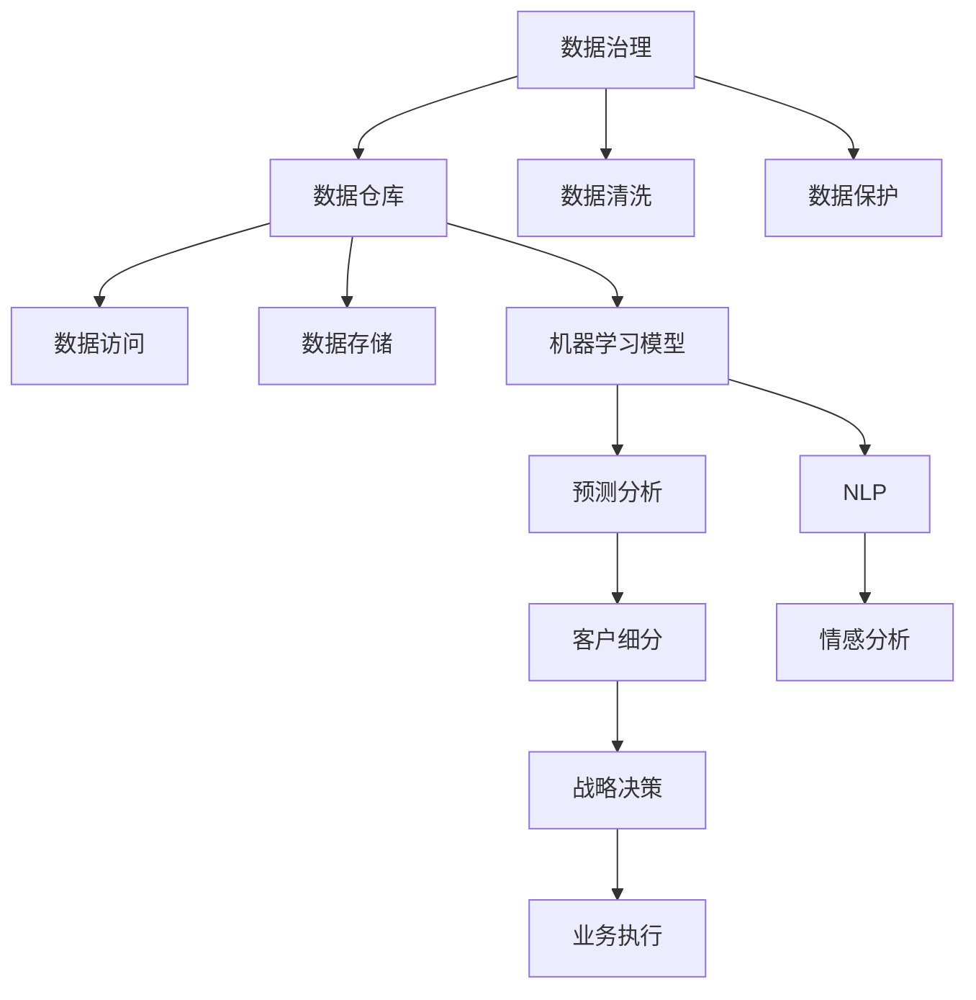

                 

# AI如何改变企业的决策过程

## 1. 背景介绍

### 1.1 问题由来

在数字化转型的浪潮下，企业决策过程正面临着前所未有的挑战和机遇。传统的决策方式以经验积累和人工分析为主，决策周期长、数据利用率低、响应速度慢，难以满足现代企业对快速响应和精准决策的需求。而随着人工智能（AI）技术的发展，企业可以利用AI工具来提升决策效率和质量，实现更加智能化的决策支持。

### 1.2 问题核心关键点

AI在企业决策中的应用，主要涉及以下几个关键点：

- **数据驱动**：通过收集、分析和利用大量数据，AI可以帮助企业发现潜在机会和风险，支持基于数据的决策制定。
- **模型预测**：利用机器学习模型，AI能够预测未来趋势、客户行为、市场变化等，辅助企业制定战略。
- **自动化流程**：AI技术可以自动化处理繁琐的决策辅助任务，如数据分析、数据清洗、预测模型训练等，减少人工干预。
- **智能推荐**：AI系统可以提供智能推荐，如供应链优化、产品推荐、客户细分等，提升决策效率。
- **人机协同**：AI与人类专家结合，可以提供更加全面、深入的决策支持，提升决策质量。

## 2. 核心概念与联系

### 2.1 核心概念概述

为更好地理解AI在企业决策中的应用，本节将介绍几个关键概念及其相互关系：

- **数据治理**：指对数据进行收集、清洗、存储、管理和保护的过程。数据治理是AI应用的基础，确保数据质量和可用性。
- **数据仓库**：集中存储企业内部和外部的数据，提供统一的数据访问接口。数据仓库支持多维度分析，为AI模型训练和应用提供数据支持。
- **机器学习模型**：通过训练数据集，利用算法构建的预测模型，用于解决分类、回归、聚类等任务。机器学习模型是AI在企业决策中的核心技术。
- **自然语言处理（NLP）**：使机器理解、处理和生成自然语言的能力。NLP在客户反馈分析、情感分析、文本挖掘等领域有广泛应用。
- **预测分析**：利用历史数据和模型，预测未来事件、客户行为等，支持战略决策。
- **数据可视化**：将复杂数据通过图表、地图等方式直观展示，帮助决策者理解数据和模型结果。

这些概念之间的逻辑关系可以通过以下Mermaid流程图来展示：



这个流程图展示了数据治理、数据仓库、机器学习模型、预测分析、NLP、数据可视化等概念之间的相互关系和作用路径：

1. 数据治理和数据仓库是AI应用的基础设施，负责数据的高效管理和存储。
2. 数据清洗和数据保护确保数据质量和隐私安全。
3. 机器学习模型、预测分析、NLP等技术基于数据仓库中的数据进行训练和应用。
4. 数据可视化工具辅助决策者理解模型和数据结果。
5. 预测分析、客户细分等模型和应用支持战略决策。
6. 战略决策通过业务执行系统转化为具体的行动方案。

## 3. 核心算法原理 & 具体操作步骤
### 3.1 算法原理概述

AI在企业决策中的应用，主要基于数据驱动和模型预测的原理。其核心思想是：

1. **数据驱动**：通过收集和分析历史和实时数据，利用数据驱动的决策支持系统（DSS），帮助企业进行决策。
2. **模型预测**：利用机器学习模型，预测未来趋势、客户行为、市场变化等，为决策提供量化依据。
3. **自动化流程**：将AI模型嵌入业务流程中，自动处理决策支持任务，减少人工干预。

### 3.2 算法步骤详解

基于数据驱动和模型预测的AI决策支持系统，通常包括以下关键步骤：

**Step 1: 数据准备与治理**

- **数据收集**：从内部系统（如ERP、CRM）和外部数据源（如社交媒体、公共数据）收集相关数据。
- **数据清洗**：处理缺失值、异常值、重复记录等问题，确保数据质量。
- **数据存储与治理**：使用数据仓库技术集中存储数据，实施数据治理策略，确保数据安全性和合规性。

**Step 2: 数据预处理与分析**

- **数据探索**：对数据进行可视化和统计分析，发现数据中的模式和异常。
- **特征工程**：选择和构建对决策有用的特征，如业务指标、时间序列、文本特征等。
- **模型训练**：选择合适的机器学习算法，在训练数据集上训练模型。

**Step 3: 模型部署与评估**

- **模型部署**：将训练好的模型集成到决策支持系统中，实现自动化预测和决策支持。
- **模型评估**：在测试数据集上评估模型性能，调整模型参数和特征工程策略。

**Step 4: 决策支持与优化**

- **实时预测**：利用模型对实时数据进行预测，支持业务决策。
- **反馈循环**：根据业务结果，对模型进行反馈和调整，优化决策效果。

### 3.3 算法优缺点

基于数据驱动和模型预测的AI决策支持系统，具有以下优点：

1. **高效准确**：通过自动化流程和模型预测，减少人工干预，提高决策效率和准确性。
2. **数据驱动**：利用大数据分析，支持基于事实的决策制定。
3. **灵活性强**：模型可以不断优化，适应不同的业务需求。
4. **决策透明**：通过可视化和报告，提高决策的透明度和可解释性。

同时，该方法也存在以下局限性：

1. **数据质量依赖**：数据清洗和特征工程的质量直接影响模型性能。
2. **模型过拟合**：模型可能在特定数据集上过拟合，泛化能力不足。
3. **成本高昂**：需要大量的数据和计算资源进行模型训练和优化。
4. **技术门槛高**：需要专业的数据科学家和算法工程师进行开发和维护。
5. **缺乏创新**：模型往往基于历史数据，难以应对全新的业务场景。

尽管存在这些局限性，但就目前而言，基于数据驱动和模型预测的AI决策支持系统仍是企业决策中的主流范式。未来相关研究的重点在于如何进一步提高数据质量和模型泛化能力，同时兼顾技术的可解释性和成本效益。

### 3.4 算法应用领域

基于AI的决策支持系统，已经在许多领域得到了广泛的应用，例如：

- **金融领域**：风险评估、信用评分、投资策略等。通过机器学习模型预测市场变化，优化投资组合。
- **制造业**：预测维护、生产调度、质量控制等。通过模型预测设备故障，优化生产计划。
- **零售行业**：客户细分、需求预测、供应链优化等。通过NLP技术分析客户反馈，改进产品和服务。
- **医疗行业**：疾病预测、治疗方案、资源调配等。通过模型预测病情发展，提高医疗决策的准确性。
- **市场营销**：市场细分、广告投放、客户行为分析等。通过预测模型优化营销策略，提升市场效果。

除了上述这些经典应用外，AI决策支持系统还被创新性地应用到更多场景中，如智能合约、个性化推荐、智能客服等，为各行各业带来了新的价值提升。

## 4. 数学模型和公式 & 详细讲解 & 举例说明

### 4.1 数学模型构建

在AI决策支持系统中，常用的数学模型包括线性回归、逻辑回归、决策树、随机森林、神经网络等。这里以线性回归模型为例，说明模型的构建和训练过程。

假设企业希望预测销售额，可以构建如下线性回归模型：

$$
y = \theta_0 + \theta_1 x_1 + \theta_2 x_2 + \cdots + \theta_n x_n + \epsilon
$$

其中，$y$ 为销售额，$x_i$ 为影响因素（如广告支出、季节性因素、竞争对手表现等），$\theta_i$ 为回归系数，$\epsilon$ 为随机误差项。

### 4.2 公式推导过程

线性回归模型的推导过程如下：

1. **最小二乘法**：求解回归系数 $\theta_i$，使预测值与真实值之差的平方和最小化。
2. **梯度下降**：通过梯度下降算法，更新回归系数，使得误差函数不断减小。

推导过程如下：

$$
\theta = (X^TX)^{-1}X^Ty
$$

其中 $X$ 为自变量矩阵，$y$ 为目标变量向量。

### 4.3 案例分析与讲解

以金融风险评估为例，利用线性回归模型预测贷款违约概率。假设数据集包含历史贷款记录，其中自变量包括借款人收入、信用评分、贷款金额等，目标变量为是否违约（0或1）。通过模型训练，可以得到以下回归系数：

$$
\theta = \begin{bmatrix}
\theta_0 \\
\theta_1 \\
\theta_2 \\
\cdots \\
\theta_n
\end{bmatrix}
$$

将新贷款申请的特征值输入模型，计算预测值 $\hat{y}$，即可判断该贷款是否违约。

## 5. 项目实践：代码实例和详细解释说明
### 5.1 开发环境搭建

在进行AI决策支持系统开发前，我们需要准备好开发环境。以下是使用Python进行TensorFlow开发的环境配置流程：

1. 安装Anaconda：从官网下载并安装Anaconda，用于创建独立的Python环境。

2. 创建并激活虚拟环境：
```bash
conda create -n tensorflow-env python=3.8 
conda activate tensorflow-env
```

3. 安装TensorFlow：从官网获取对应的安装命令，选择适当的安装方式（CPU或GPU）。
```bash
pip install tensorflow
```

4. 安装各类工具包：
```bash
pip install numpy pandas scikit-learn matplotlib tqdm jupyter notebook ipython
```

完成上述步骤后，即可在`tensorflow-env`环境中开始开发。

### 5.2 源代码详细实现

以下是一个简单的基于TensorFlow的线性回归模型，用于预测金融风险：

```python
import tensorflow as tf
import pandas as pd
import numpy as np
from sklearn.model_selection import train_test_split

# 加载数据
df = pd.read_csv('loan_data.csv')

# 数据预处理
X = df[['income', 'credit_score', 'loan_amount']]
y = df['default']

# 划分训练集和测试集
X_train, X_test, y_train, y_test = train_test_split(X, y, test_size=0.2, random_state=42)

# 定义模型
model = tf.keras.models.Sequential([
    tf.keras.layers.Dense(64, activation='relu', input_shape=[X_train.shape[1]]),
    tf.keras.layers.Dense(1, activation='sigmoid')
])

# 编译模型
model.compile(optimizer='adam', loss='binary_crossentropy', metrics=['accuracy'])

# 训练模型
model.fit(X_train, y_train, epochs=10, batch_size=32, validation_data=(X_test, y_test))

# 评估模型
model.evaluate(X_test, y_test)
```

### 5.3 代码解读与分析

让我们再详细解读一下关键代码的实现细节：

**数据加载**：
- 使用Pandas库加载贷款数据集，将数据转换为DataFrame格式。
- 提取自变量和目标变量，并对其进行分割，用于训练和测试。

**模型定义**：
- 定义包含两个全连接层的神经网络模型，使用ReLU激活函数。
- 输出层使用sigmoid激活函数，适合二分类问题。

**模型编译与训练**：
- 编译模型，选择Adam优化器和二分类交叉熵损失函数。
- 在训练集上训练模型，设置迭代轮数和批大小，并使用测试集进行验证。

**模型评估**：
- 在测试集上评估模型性能，输出准确率。

## 6. 实际应用场景

### 6.1 智能客服系统

基于AI决策支持系统的智能客服系统，可以广泛应用于企业客服部门。传统客服往往需要配备大量人力，高峰期响应缓慢，且服务质量难以保证。而使用AI决策支持系统，可以7x24小时不间断服务，快速响应客户咨询，用智能化的方式提升客户满意度。

在技术实现上，可以收集企业内部的历史客服对话记录，将问题和最佳答复构建成监督数据，在此基础上对决策支持系统进行微调。微调后的系统能够自动理解用户意图，匹配最合适的答案模板进行回复。对于客户提出的新问题，还可以接入检索系统实时搜索相关内容，动态组织生成回答。如此构建的智能客服系统，能大幅提升客户咨询体验和问题解决效率。

### 6.2 金融风险管理

金融企业需要实时监测市场风险，及时识别和应对潜在风险。传统的人工风险评估方式成本高、效率低，难以应对网络时代海量信息爆发的挑战。基于AI决策支持系统的风险评估模型，为金融风险管理提供了新的解决方案。

具体而言，可以收集历史贷款记录、市场数据等，构建监督数据集。利用机器学习模型，如线性回归、随机森林等，训练预测模型，评估贷款违约概率、市场波动风险等。将训练好的模型集成到决策支持系统中，实时监测市场变化，预测风险事件，及时调整投资策略，避免损失。

### 6.3 供应链优化

供应链是企业运营的核心环节，但传统的供应链管理面临诸多挑战，如需求预测不准、库存管理困难、物流成本高等。基于AI决策支持系统的供应链优化模型，能够提升供应链的透明度和响应速度，降低运营成本。

具体应用包括：

- **需求预测**：通过预测模型，基于历史销售数据和市场趋势，预测未来的产品需求，优化库存管理。
- **库存优化**：基于预测模型，动态调整库存水平，避免库存过剩或短缺。
- **物流优化**：优化物流路径和运输方式，降低运输成本和物流时间。

通过AI决策支持系统，企业可以更高效地管理供应链，提升运营效率。

### 6.4 未来应用展望

随着AI技术的发展，基于AI决策支持系统的应用场景将不断扩展。未来，AI将在更多领域发挥重要作用，包括但不限于：

- **智慧城市**：通过预测模型，优化城市交通、能源、环保等管理，提升城市治理水平。
- **智能制造**：通过预测模型，优化生产计划、质量控制，提升制造业的智能化水平。
- **个性化推荐**：通过模型预测用户行为，优化推荐算法，提升用户体验和业务收益。
- **智能营销**：通过模型预测客户需求，优化营销策略，提升营销效果。
- **健康管理**：通过预测模型，优化疾病预防和治疗方案，提升医疗服务质量。

AI决策支持系统的广泛应用，将为企业带来更高的效率、更好的决策质量，同时带来新的商业模式和竞争优势。

## 7. 工具和资源推荐
### 7.1 学习资源推荐

为了帮助开发者系统掌握AI在企业决策中的应用，这里推荐一些优质的学习资源：

1. **《深度学习》（Ian Goodfellow等著）**：深入介绍深度学习的基本原理和应用，包括神经网络、模型训练等。
2. **《Python深度学习》（Francois Chollet著）**：通过TensorFlow实现深度学习模型，讲解实用案例和最佳实践。
3. **《机器学习实战》（Peter Harrington著）**：介绍机器学习的基本概念和常用算法，并通过Python实现。
4. **Kaggle竞赛平台**：提供大量数据集和竞赛机会，帮助开发者实践机器学习算法，提升实战能力。
5. **Google Cloud AI Platform**：提供云端的AI开发环境，支持TensorFlow等框架，方便开发者进行模型训练和部署。

通过对这些资源的学习实践，相信你一定能够快速掌握AI在企业决策中的应用，并用于解决实际的决策支持问题。

### 7.2 开发工具推荐

高效的开发离不开优秀的工具支持。以下是几款用于AI决策支持系统开发的常用工具：

1. **TensorFlow**：基于Python的开源深度学习框架，支持分布式计算和模型优化，适用于大规模数据集和复杂模型。
2. **PyTorch**：基于Python的开源深度学习框架，灵活性高，适合研究性项目和快速迭代。
3. **Keras**：高层次的深度学习API，支持多种后端，易于上手和调试。
4. **Jupyter Notebook**：交互式的开发环境，支持Python、R等语言，方便代码编写和结果展示。
5. **Scikit-learn**：Python的机器学习库，提供常用算法和工具，适合数据处理和模型训练。

合理利用这些工具，可以显著提升AI决策支持系统的开发效率，加快创新迭代的步伐。

### 7.3 相关论文推荐

AI决策支持系统的研究源于学界的持续研究。以下是几篇奠基性的相关论文，推荐阅读：

1. **《Deep Learning》**（Ian Goodfellow等著）：介绍深度学习的基本原理和应用，涵盖神经网络、模型训练、数据处理等方面。
2. **《Machine Learning Yearning》**（Andrew Ng著）：讲解机器学习的工程实践，包括数据预处理、模型调参、模型评估等。
3. **《Large-Scale Machine Learning》**（Ian Goodfellow等著）：介绍大规模机器学习的方法和工具，涵盖分布式计算、模型优化等方面。
4. **《Adaptive Computation of Statistical Functions》**（Geoffrey Hinton等著）：介绍神经网络的反向传播算法，为深度学习提供理论基础。
5. **《Pattern Recognition and Machine Learning》**（Christopher Bishop著）：讲解模式识别和机器学习的基本理论，适合理论学习。

这些论文代表了大规模机器学习的研究进展，通过学习这些前沿成果，可以帮助研究者把握学科前进方向，激发更多的创新灵感。

## 8. 总结：未来发展趋势与挑战

### 8.1 研究成果总结

本文对AI在企业决策中的应用进行了全面系统的介绍。首先阐述了AI在决策支持中的背景和意义，明确了数据驱动和模型预测在决策中的重要性。其次，从原理到实践，详细讲解了机器学习模型的构建和应用过程，给出了决策支持系统的完整代码实例。同时，本文还探讨了AI决策支持系统在智能客服、金融风险管理、供应链优化等多个行业领域的应用前景，展示了AI决策支持系统的广阔潜力。此外，本文精选了AI决策支持系统的各类学习资源，力求为读者提供全方位的技术指引。

通过本文的系统梳理，可以看到，基于数据驱动和模型预测的AI决策支持系统正在成为企业决策中的重要工具，极大地提升了决策效率和质量。未来，伴随AI技术的持续演进，决策支持系统将在更多领域得到应用，为企业的智能化转型提供新的驱动力。

### 8.2 未来发展趋势

展望未来，AI决策支持系统将呈现以下几个发展趋势：

1. **模型多样化**：未来将出现更多类型的机器学习模型，如深度学习、强化学习、图神经网络等，适用于不同场景的决策支持需求。
2. **数据融合与集成**：不同类型的数据（如文本、图像、时间序列等）将通过融合与集成，形成更加全面的决策支持信息。
3. **实时性提升**：通过分布式计算和流式计算技术，AI决策支持系统将实现实时预测和决策支持，提升决策响应速度。
4. **交互性增强**：通过自然语言处理等技术，AI决策支持系统将更加智能，与人类交互更加自然、流畅。
5. **自动化与智能化**：AI决策支持系统将进一步自动化，与业务流程紧密结合，提升决策支持的智能化水平。
6. **伦理与隐私保护**：随着AI决策支持系统的广泛应用，如何保护数据隐私、确保决策公平，将成为重要的研究方向。

以上趋势凸显了AI决策支持系统的广阔前景。这些方向的探索发展，必将进一步提升决策支持的效率和质量，为企业的智能化转型提供新的技术支撑。

### 8.3 面临的挑战

尽管AI决策支持系统在企业决策中发挥了重要作用，但在实际应用过程中，仍面临诸多挑战：

1. **数据质量问题**：数据收集、清洗和标注质量直接影响模型的性能，如何保证数据质量，提高数据可用性，是重要的研究方向。
2. **模型泛化能力**：AI模型往往依赖于历史数据，如何提高模型在未知数据上的泛化能力，是未来研究的重点。
3. **计算资源限制**：大规模数据集和复杂模型需要大量的计算资源，如何优化模型和算法，降低计算成本，是实际应用中的重要问题。
4. **模型可解释性**：AI模型往往作为"黑盒"存在，难以解释其决策逻辑，如何在保证模型性能的同时，提高模型的可解释性，是重要的研究课题。
5. **隐私与安全问题**：AI决策支持系统需要处理大量敏感数据，如何保护数据隐私、确保数据安全，是应用中的重要问题。

尽管存在这些挑战，但通过不断探索和实践，相信AI决策支持系统将不断优化，更好地服务于企业决策，提升企业竞争力。

### 8.4 研究展望

面向未来，AI决策支持系统的研究需要在以下几个方面寻求新的突破：

1. **模型训练与优化**：开发更加高效、鲁棒的机器学习算法，提高模型训练效率和泛化能力。
2. **数据融合与处理**：研究多源数据融合与处理技术，提高数据的利用率和质量。
3. **交互与协同**：研究人机协同的决策支持系统，提升系统的智能交互能力和用户体验。
4. **伦理与隐私保护**：研究如何保护数据隐私和确保决策公平，提升AI系统的可信度。
5. **跨领域应用**：将AI决策支持系统应用于更多领域，如智慧城市、智能制造、个性化推荐等，推动跨领域创新。

这些研究方向的探索，将推动AI决策支持系统的进一步发展，为企业的智能化转型提供更加坚实的技术基础。总之，AI决策支持系统需要在数据质量、模型性能、计算效率、可解释性和隐私保护等多个维度不断优化，才能更好地服务于企业的决策需求。

---

作者：禅与计算机程序设计艺术 / Zen and the Art of Computer Programming

