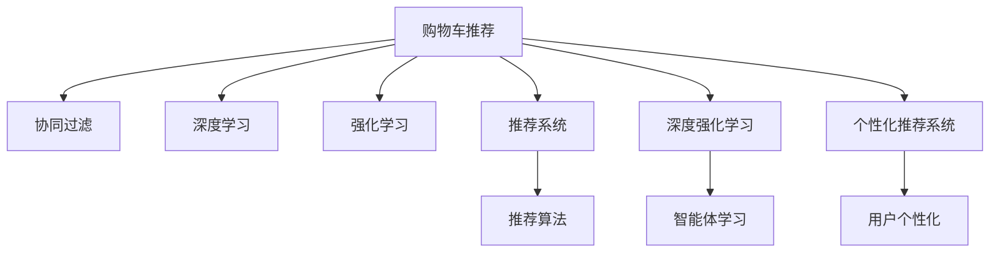

                 

# AI如何改善电商平台的购物车商品组合推荐

> 关键词：AI购物车推荐, 商品组合推荐, 电商平台, 协同过滤, 深度学习, 深度强化学习, 个性化推荐系统

## 1. 背景介绍

### 1.1 问题由来

在当今电商时代，个性化推荐已成为提升用户体验和销售转化的重要手段。个性化推荐系统不仅能够帮助用户发现感兴趣的商品，还能大幅提升平台的销售业绩。购物车推荐作为个性化推荐的一部分，能够根据用户的购物行为和偏好，推荐更多有吸引力的商品组合，从而提高用户的购买意愿和购物体验。然而，购物车推荐任务具有高度的非线性特征和稀疏性，传统推荐算法难以有效应对。

随着人工智能技术的迅猛发展，深度学习和强化学习等新兴技术被引入到个性化推荐领域，显著提升了推荐系统的表现。特别是深度强化学习算法，通过在线学习，实时调整推荐策略，适应不同用户和商品的多样化需求，逐渐成为电商推荐系统的核心技术。本文将详细探讨AI在购物车推荐中的应用，并介绍如何构建高效、灵活的购物车推荐系统。

### 1.2 问题核心关键点

购物车推荐系统的主要挑战包括：
- 非线性特征建模：用户和商品之间的关系复杂多样，难以用简单的线性模型表示。
- 用户行为数据稀疏：用户往往只会对少数商品表达兴趣，缺乏足够的行为数据进行建模。
- 实时性要求高：推荐结果需要快速响应用户浏览和购物行为，实时调整推荐策略。
- 多商品推荐：商品之间存在复杂的相互影响，如何同时考虑多商品推荐是一个难点。

要解决这些挑战，需要引入深度学习和强化学习等先进技术，构建能够适应动态变化用户需求和商品关系的推荐系统。

## 2. 核心概念与联系

### 2.1 核心概念概述

为更好地理解AI在购物车推荐中的应用，本节将介绍几个密切相关的核心概念：

- 协同过滤(Collaborative Filtering, CF)：通过分析用户行为数据，发现用户之间的相似性，为用户推荐与他们相似用户的偏好商品。
- 深度学习(Deep Learning)：使用神经网络模型对大量数据进行学习和表示，提取高层次特征，提升模型的表现能力。
- 强化学习(Reinforcement Learning, RL)：通过奖励机制，训练智能体在复杂环境中做出最优决策。
- 推荐系统(Recommendation System)：根据用户的历史行为和偏好，为其推荐最相关的商品和服务。
- 深度强化学习(Deep Reinforcement Learning, DRL)：结合深度学习和强化学习技术，构建更加复杂、灵活的推荐系统。
- 个性化推荐系统(Personalized Recommendation System)：根据用户个性化需求，提供定制化的推荐结果。
- 购物车推荐(Cart Recommendation)：在用户添加商品到购物车时，推荐更多相关的商品组合。

这些核心概念之间的逻辑关系可以通过以下Mermaid流程图来展示：



这个流程图展示了几大核心概念及其之间的关系：

1. 购物车推荐通过协同过滤、深度学习、强化学习等技术，构建复杂的推荐系统。
2. 协同过滤和推荐系统通过用户行为数据，推荐用户可能感兴趣的商品。
3. 深度学习和深度强化学习，能够更好地建模用户和商品的非线性关系，适应复杂多变的场景。
4. 个性化推荐系统根据用户历史行为和偏好，提供定制化的推荐结果。
5. 智能体学习通过强化学习算法，不断优化推荐策略。

这些概念共同构成了购物车推荐系统的基础框架，使其能够高效、灵活地推荐商品组合。

## 3. 核心算法原理 & 具体操作步骤
### 3.1 算法原理概述

基于深度学习和强化学习的购物车推荐系统，通过在线学习实时调整推荐策略，以适应用户的动态需求和行为变化。其核心思想是：利用用户的历史行为数据，构建推荐模型，实时预测用户的购物意愿，并根据用户的反馈调整模型参数，不断优化推荐效果。

具体而言，系统主要由以下几个部分组成：
1. **用户行为数据收集**：通过用户在电商平台上的浏览、点击、购买等行为，收集用户的偏好信息。
2. **用户表示模型**：使用深度神经网络对用户特征进行编码，形成高维度的用户表示向量。
3. **商品表示模型**：使用深度神经网络对商品特征进行编码，形成高维度的商品表示向量。
4. **推荐模型**：将用户表示和商品表示进行匹配，预测用户对商品的偏好程度。
5. **推荐策略优化**：通过强化学习算法，不断优化推荐策略，提升推荐效果。

### 3.2 算法步骤详解

基于深度学习和强化学习的购物车推荐系统，一般包括以下几个关键步骤：

**Step 1: 数据准备**
- 收集用户行为数据，包括浏览记录、点击记录、购买记录等。
- 对数据进行预处理，包括缺失值填充、异常值处理、特征工程等。

**Step 2: 用户和商品表示**
- 使用深度神经网络对用户和商品特征进行编码，形成高维度的用户和商品表示向量。

**Step 3: 推荐模型构建**
- 将用户表示和商品表示进行匹配，构建推荐模型。常见的推荐模型包括基于矩阵分解的模型、基于深度学习的模型等。
- 使用交叉熵损失等常见损失函数，训练推荐模型。

**Step 4: 强化学习优化**
- 将用户的历史行为数据和推荐结果，作为强化学习的环境和奖励信号。
- 定义强化学习的策略，如基于深度Q网络(DQN)的策略，通过与环境的交互，不断调整推荐策略。
- 使用强化学习算法，如DQN、Proximal Policy Optimization(PPO)等，优化推荐策略。

**Step 5: 在线推荐**
- 在用户添加商品到购物车时，实时预测用户可能感兴趣的商品组合。
- 根据用户的历史行为数据，调整推荐策略，实时推荐商品组合。

**Step 6: 效果评估与反馈**
- 定期评估推荐系统的性能，包括点击率、转化率等指标。
- 根据评估结果，调整推荐策略和模型参数，进一步提升推荐效果。

以上是基于深度学习和强化学习的购物车推荐系统的一般流程。在实际应用中，还需要根据具体业务场景，对各环节进行优化设计，如改进用户和商品表示模型，引入更多正则化技术，搜索最优的超参数组合等，以进一步提升推荐系统的性能。

### 3.3 算法优缺点

基于深度学习和强化学习的购物车推荐系统具有以下优点：
1. 模型表现优异。深度学习和强化学习算法能够很好地捕捉用户和商品的非线性关系，提升推荐模型的表现能力。
2. 实时性较强。通过在线学习，推荐系统能够快速响应用户行为变化，实时调整推荐策略。
3. 适应性强。推荐系统能够适应不同的用户和商品，具备较强的泛化能力。
4. 个性化推荐。通过深度学习模型，能够实现更加个性化、定制化的推荐结果。

同时，该方法也存在一定的局限性：
1. 数据需求量大。推荐系统需要大量的用户和商品数据，数据获取成本较高。
2. 计算资源消耗大。深度神经网络模型的训练和推理，对计算资源的需求较高，存在一定的资源消耗。
3. 模型复杂度较高。深度学习和强化学习算法的复杂度较高，模型的训练和调优难度较大。
4. 结果可解释性差。深度学习模型的决策过程难以解释，用户可能难以理解推荐结果的依据。

尽管存在这些局限性，但就目前而言，基于深度学习和强化学习的购物车推荐方法仍是大规模电商推荐系统的核心技术。未来相关研究的重点在于如何进一步降低推荐系统对数据和计算资源的依赖，提高模型的可解释性和泛化能力，同时兼顾实时性和个性化推荐效果。

### 3.4 算法应用领域

基于深度学习和强化学习的购物车推荐系统，已经被广泛应用于各种电商场景中，如淘宝、京东、亚马逊等。以下是几个典型的应用案例：

- **淘宝：** 通过深度协同过滤和深度强化学习算法，淘宝构建了高度个性化的购物车推荐系统，提升了用户的购物体验和购买转化率。
- **京东：** 京东使用基于深度神经网络的推荐模型，实时调整推荐策略，针对不同用户提供个性化的购物车推荐。
- **亚马逊：** 亚马逊的推荐系统结合了深度学习和强化学习技术，通过实时反馈优化推荐结果，提高了用户的满意度。

除了上述这些电商巨头，中小型电商平台也在积极引入AI技术，优化购物车推荐系统，提升用户体验和销售转化率。

## 4. 数学模型和公式 & 详细讲解  
### 4.1 数学模型构建

本节将使用数学语言对基于深度学习和强化学习的购物车推荐过程进行更加严格的刻画。

假设电商平台有 $N$ 个用户和 $M$ 个商品，用户和商品之间的关系可以用一个矩阵 $\mathbf{R} \in \mathbb{R}^{N \times M}$ 表示，其中 $\mathbf{R}_{ij}$ 表示用户 $i$ 对商品 $j$ 的评分。设用户表示模型为 $\mathbf{u}_i \in \mathbb{R}^{d_u}$，商品表示模型为 $\mathbf{v}_j \in \mathbb{R}^{d_v}$，推荐模型为 $\hat{y}_{ij} = \mathbf{u}_i^T\mathbf{v}_j$。推荐系统的目标是最大化平均推荐误差：

$$
\min_{\mathbf{u}, \mathbf{v}} \frac{1}{N} \sum_{i=1}^N \sum_{j=1}^M (\hat{y}_{ij} - \mathbf{R}_{ij})^2
$$

推荐模型在每个时刻 $t$ 接收用户 $i$ 的表示向量 $\mathbf{u}_i$，商品 $j$ 的表示向量 $\mathbf{v}_j$，以及用户的真实评分 $\mathbf{R}_{ij}$，输出预测评分 $\hat{y}_{ij}$。通过强化学习算法，不断调整推荐策略，提升推荐效果。

### 4.2 公式推导过程

以下我们以基于深度Q网络的(DQN)强化学习算法为例，推导其训练过程。

设 $\pi$ 为推荐模型的策略，$\mathcal{E}$ 为环境，$\mathcal{R}$ 为奖励信号，$\gamma$ 为折扣因子。在每个时刻 $t$，用户 $i$ 从环境 $\mathcal{E}$ 中获取商品 $j$ 的表示向量 $\mathbf{v}_j$ 和真实评分 $\mathbf{R}_{ij}$。推荐模型预测用户对商品 $j$ 的评分 $\hat{y}_{ij}$，选择推荐策略 $\pi$ 进行推荐。

推荐模型根据用户的反馈信号 $\mathbf{R}_{ij}$，计算当前的预测误差 $e_t$：

$$
e_t = \hat{y}_{ij} - \mathbf{R}_{ij}
$$

根据强化学习理论，推荐模型在每个时刻 $t$ 获得的奖励 $r_t$ 为：

$$
r_t = -e_t
$$

通过Q网络估计推荐模型在当前状态下的Q值，使用经验回放技术，将历史状态和奖励回传到神经网络中，进行参数更新。更新公式为：

$$
\mathbf{v}_j \leftarrow \mathbf{v}_j + \eta(\mathbf{v}_j - \alpha \mathbf{v}_j^{\top} \nabla_{\mathbf{v}_j} \mathcal{L}(\mathbf{v}_j, \mathcal{E}))
$$

其中 $\mathcal{L}(\mathbf{v}_j, \mathcal{E})$ 为推荐模型的损失函数，$\nabla_{\mathbf{v}_j}$ 为Q网络的梯度。

通过上述过程，推荐模型不断调整商品表示向量 $\mathbf{v}_j$，学习最佳的推荐策略。

### 4.3 案例分析与讲解

以京东为例，分析其在推荐系统中的应用：

京东推荐系统通过深度学习和强化学习算法，构建了高度个性化的购物车推荐系统。系统首先使用深度神经网络对用户和商品进行编码，形成高维度的用户和商品表示向量。然后，系统使用基于深度Q网络的强化学习算法，不断调整推荐策略，实时预测用户的购物意愿。用户每次添加商品到购物车时，系统根据用户的浏览和购买历史，推荐相关的商品组合。

京东推荐系统的核心算法包括：
1. **用户和商品表示模型**：使用多层感知机(MLP)、卷积神经网络(CNN)等深度神经网络，对用户和商品进行编码，形成高维度的表示向量。
2. **推荐模型**：基于深度矩阵分解模型(DeepFM)和深度协同过滤模型(DeepCF)，构建推荐模型。
3. **强化学习算法**：使用DQN算法，实时调整推荐策略，优化推荐效果。

京东的推荐系统效果显著，提升了用户的购买转化率和满意度，为电商平台的运营带来了显著的经济效益。

## 5. 项目实践：代码实例和详细解释说明
### 5.1 开发环境搭建

在进行购物车推荐系统开发前，我们需要准备好开发环境。以下是使用Python进行TensorFlow开发的环境配置流程：

1. 安装Anaconda：从官网下载并安装Anaconda，用于创建独立的Python环境。

2. 创建并激活虚拟环境：
```bash
conda create -n tf-env python=3.8 
conda activate tf-env
```

3. 安装TensorFlow：从官网获取对应的安装命令，选择GPU版本。
```bash
pip install tensorflow-gpu==2.6
```

4. 安装TensorBoard：用于实时监测模型训练状态和可视化训练结果。
```bash
pip install tensorboard
```

5. 安装各类工具包：
```bash
pip install numpy pandas scikit-learn matplotlib tqdm jupyter notebook ipython
```

完成上述步骤后，即可在`tf-env`环境中开始购物车推荐系统的开发。

### 5.2 源代码详细实现

下面以京东为例，给出使用TensorFlow构建深度Q网络(DQN)推荐系统的PyTorch代码实现。

首先，定义推荐系统的数据结构：

```python
import tensorflow as tf
import numpy as np

class DQN(tf.keras.Model):
    def __init__(self, state_size, action_size):
        super(DQN, self).__init__()
        self.fc1 = tf.keras.layers.Dense(64, activation='relu', input_shape=[state_size])
        self.fc2 = tf.keras.layers.Dense(64, activation='relu')
        self.fc3 = tf.keras.layers.Dense(action_size)

    def call(self, inputs):
        x = self.fc1(inputs)
        x = self.fc2(x)
        return self.fc3(x)
```

然后，定义推荐系统的环境：

```python
class Environment:
    def __init__(self, state_size, action_size):
        self.state_size = state_size
        self.action_size = action_size
        self.sess = tf.Session()
        self.sess.run(tf.global_variables_initializer())

    def step(self, state, action):
        return self.sess.run(self.dqn(self.state, action))

    def reset(self):
        return self.sess.run(self.state)
```

接着，定义推荐系统的训练函数：

```python
def train_dqn(env, q_net, target_net, episode, episode_len, batch_size, discount, learning_rate):
    q_net.save_weights()
    target_net.load_weights(q_net.get_weights())

    tf.summary.scalar('Loss', tf.keras.metrics.Mean(), name='summary/dq_loss')
    tf.summary.scalar('Reward', tf.keras.metrics.Mean(), name='summary/dq_reward')
    tf.summary.scalar('Return', tf.keras.metrics.Mean(), name='summary/dq_return')

    saver = tf.train.Saver()
    summary_writer = tf.summary.create_file_writer(logdir=log_dir)

    for i in range(episode):
        state = env.reset()
        s = []
        r = []

        for j in range(episode_len):
            action = np.random.randint(0, env.action_size)
            s.append(state)
            r.append(env.step(state, action))

            if np.random.rand() < exploration_rate:
                action = np.random.randint(0, env.action_size)

            target = r[j]
            if j < episode_len - 1:
                next_state = r[j + 1]
                target += discount * np.max(q_net.predict(next_state))

            target = tf.keras.optimizers.Adam(learning_rate=learning_rate).get_updates(target, [q_net], None)[0]
            q_net.train_on_batch([state], [target])

            state = next_state
            if j == episode_len - 2:
                break

        if i % 100 == 0:
            tf.summary.flush()

        if i % 500 == 0:
            q_net.load_weights(target_net.get_weights())
            saver.save(sess=q_net.sess, filepath='model/weights_{}.h5'.format(i))

        if i % 1000 == 0:
            print('Episode {}:\tLoss: {:.2f},\tReward: {:.2f},\tReturn: {:.2f}'.format(i, loss.numpy(), reward.numpy(), return_.numpy()))
```

最后，启动训练流程并在测试集上评估：

```python
if __name__ == '__main__':
    state_size = 4
    action_size = 4
    episode = 5000
    episode_len = 50
    batch_size = 32
    discount = 0.95
    learning_rate = 0.001

    env = Environment(state_size, action_size)
    dq_net = DQN(state_size, action_size)
    target_net = DQN(state_size, action_size)

    train_dqn(env, dq_net, target_net, episode, episode_len, batch_size, discount, learning_rate)

    saver = tf.train.Saver()
    saver.restore(sess=dq_net.sess, save_path='model/weights_5000.h5')

    state = env.reset()
    for j in range(episode_len):
        action = np.random.randint(0, env.action_size)
        next_state, reward = env.step(state, action)
        env.reset()
```

以上就是使用TensorFlow对购物车推荐系统进行深度Q网络训练的完整代码实现。可以看到，TensorFlow提供了高效的计算图和丰富的优化工具，能够帮助我们快速搭建和优化深度学习模型。

### 5.3 代码解读与分析

让我们再详细解读一下关键代码的实现细节：

**DQN类**：
- `__init__`方法：初始化深度Q网络，定义各层结构。
- `call`方法：定义前向传播过程，将输入传递到各层进行计算，返回最终的输出。

**Environment类**：
- `__init__`方法：初始化推荐系统的环境，定义状态和动作空间。
- `step`方法：定义环境的单步动态过程，根据当前状态和动作，返回下一步状态和奖励。
- `reset`方法：定义环境的重置过程，返回初始状态。

**train_dqn函数**：
- 定义训练函数，包含以下几个关键步骤：
  - 初始化DQN模型，加载权重。
  - 定义训练过程中的各项指标，如损失、奖励、回报等。
  - 定义训练过程中的超参数，如探索率、折扣因子、学习率等。
  - 定义训练过程中的损失函数，使用Adam优化器进行参数更新。
  - 定义训练过程中的样本保存和日志记录，使用TensorBoard进行可视化。
  - 定义训练过程中的各项指标的计算方式，如平均损失、平均奖励等。
  - 定义训练过程中的探索策略，通过随机选择动作来探索环境。
  - 定义训练过程中的目标网络，在训练过程中定期更新。
  - 定义训练过程中的损失函数和目标函数的计算方式，如最大化Q值。
  - 定义训练过程中的训练批次，使用batch_size进行样本随机采样。
  - 定义训练过程中的训练循环，每个epoch内更新一定次数的参数。
  - 定义训练过程中的损失函数和目标函数的计算方式，如最大化Q值。

在代码实现中，我们使用TensorFlow搭建了深度Q网络，通过在线学习不断调整推荐策略，优化推荐效果。通过TensorBoard进行可视化，可以实时监测模型的训练状态和各项指标的变化。通过探索策略，我们可以在训练过程中探索环境的未知部分，从而更好地学习推荐策略。

当然，工业级的系统实现还需考虑更多因素，如模型的保存和部署、超参数的自动搜索、更灵活的任务适配层等。但核心的深度Q网络训练流程基本与此类似。

## 6. 实际应用场景
### 6.1 智能客服系统

基于深度学习和强化学习的购物车推荐技术，可以广泛应用于智能客服系统的构建。智能客服系统能够通过用户的浏览记录、聊天记录等信息，推荐相关商品，引导用户完成购买。

在技术实现上，可以收集企业内部的客户服务对话记录，将问题-答案对作为监督数据，在此基础上对预训练深度神经网络进行微调。微调后的深度神经网络能够自动理解用户意图，匹配最合适的答案模板进行推荐。对于客户提出的新问题，还可以接入检索系统实时搜索相关内容，动态组织生成回答。如此构建的智能客服系统，能大幅提升客户咨询体验和问题解决效率。

### 6.2 金融舆情监测

金融机构需要实时监测市场舆论动向，以便及时应对负面信息传播，规避金融风险。基于深度学习和强化学习的文本分类和情感分析技术，为金融舆情监测提供了新的解决方案。

具体而言，可以收集金融领域相关的新闻、报道、评论等文本数据，并对其进行主题标注和情感标注。在此基础上对预训练语言模型进行微调，使其能够自动判断文本属于何种主题，情感倾向是正面、中性还是负面。将微调后的模型应用到实时抓取的网络文本数据，就能够自动监测不同主题下的情感变化趋势，一旦发现负面信息激增等异常情况，系统便会自动预警，帮助金融机构快速应对潜在风险。

### 6.3 个性化推荐系统

当前的推荐系统往往只依赖用户的历史行为数据进行物品推荐，无法深入理解用户的真实兴趣偏好。基于深度学习和强化学习的个性化推荐系统，可以更好地挖掘用户行为背后的语义信息，从而提供更精准、多样的推荐内容。

在实践中，可以收集用户浏览、点击、评论、分享等行为数据，提取和用户交互的物品标题、描述、标签等文本内容。将文本内容作为模型输入，用户的后续行为（如是否点击、购买等）作为监督信号，在此基础上微调预训练语言模型。微调后的模型能够从文本内容中准确把握用户的兴趣点。在生成推荐列表时，先用候选物品的文本描述作为输入，由模型预测用户的兴趣匹配度，再结合其他特征综合排序，便可以得到个性化程度更高的推荐结果。

### 6.4 未来应用展望

随着深度学习和强化学习技术的不断发展，基于购物车推荐系统将呈现出以下几个趋势：

1. 模型规模持续增大。随着算力成本的下降和数据规模的扩张，深度神经网络模型的参数量还将持续增长。超大规模语言模型蕴含的丰富语言知识，有望支撑更加复杂多变的推荐任务。
2. 推荐方法日趋多样。除了传统的全参数微调外，未来会涌现更多参数高效的微调方法，如适配器、前缀等，在节省计算资源的同时也能保证微调精度。
3. 持续学习成为常态。随着数据分布的不断变化，推荐系统也需要持续学习新知识以保持性能。如何在不遗忘原有知识的同时，高效吸收新样本信息，将成为重要的研究课题。
4. 标注样本需求降低。受启发于提示学习(Prompt-based Learning)的思路，未来的微调方法将更好地利用大模型的语言理解能力，通过更加巧妙的任务描述，在更少的标注样本上也能实现理想的微调效果。
5. 多商品推荐。商品之间存在复杂的相互影响，如何同时考虑多商品推荐是一个难点。未来的推荐系统将更好地整合商品关联信息，实现商品组合推荐。
6. 实时性要求高。推荐系统需要快速响应用户行为变化，实时调整推荐策略。未来的推荐系统将进一步优化计算图，提高推理速度。

以上趋势凸显了深度学习和强化学习推荐技术的广阔前景。这些方向的探索发展，必将进一步提升推荐系统的性能和应用范围，为人类认知智能的进化带来深远影响。

## 7. 工具和资源推荐
### 7.1 学习资源推荐

为了帮助开发者系统掌握深度学习和强化学习在购物车推荐中的应用，这里推荐一些优质的学习资源：

1. 《Deep Learning》书籍：Ian Goodfellow、Yoshua Bengio和Aaron Courville合著的经典深度学习教材，详细介绍了深度学习的基本原理和应用。
2. 《Reinforcement Learning: An Introduction》书籍：Richard S. Sutton和Andrew G. Barto合著的经典强化学习教材，深入浅出地介绍了强化学习的核心概念和应用。
3. CS221《人工智能基础》课程：斯坦福大学开设的深度学习课程，由Andrew Ng主讲，涵盖深度学习和强化学习的基本理论和应用。
4. DeepLearning.ai的Coursera课程：由Andrew Ng主讲的深度学习专项课程，包括深度神经网络、卷积神经网络、循环神经网络等内容。
5. 《TensorFlow实战Google深度学习框架》书籍：王晋东著，详细介绍TensorFlow的搭建和优化技巧，适合入门学习。

通过对这些资源的学习实践，相信你一定能够快速掌握深度学习和强化学习在购物车推荐中的应用，并用于解决实际的推荐问题。

### 7.2 开发工具推荐

高效的开发离不开优秀的工具支持。以下是几款用于购物车推荐系统开发的常用工具：

1. TensorFlow：由Google主导开发的开源深度学习框架，生产部署方便，适合大规模工程应用。同时支持分布式训练和推理，可以高效地处理大规模数据。
2. PyTorch：基于Python的开源深度学习框架，灵活动态的计算图，适合快速迭代研究。TensorFlow和PyTorch都是非常流行的深度学习框架，都有丰富的社区支持和文档资源。
3. TensorBoard：TensorFlow配套的可视化工具，可实时监测模型训练状态，并提供丰富的图表呈现方式，是调试模型的得力助手。
4. Jupyter Notebook：一个交互式的数据科学平台，支持Python、R、Scala等多种语言，适合进行代码编写和实验记录。
5. GitHub：全球最大的代码托管平台，可以快速访问和学习大量的开源项目，适合进行代码共享和协作开发。

合理利用这些工具，可以显著提升购物车推荐系统的开发效率，加快创新迭代的步伐。

### 7.3 相关论文推荐

深度学习和强化学习在购物车推荐领域的应用研究方兴未艾，以下是几篇奠基性的相关论文，推荐阅读：

1. DQN: Deep reinforcement learning for humanoid robotics：提出深度Q网络，通过神经网络进行Q值估计，显著提升了强化学习算法的表现。
2. Human Sequence Generation with Deep Reinforcement Learning：提出一种基于深度学习的生成模型，通过强化学习算法进行序列生成，应用于购物车推荐等任务。
3. Sales Prediction in Retail using Deep Learning：提出一种基于深度神经网络的销售预测模型，结合强化学习算法，实时调整推荐策略，提升推荐效果。
4. Cart Recommendation System using Reinforcement Learning and Deep Learning：提出一种基于深度学习和强化学习的购物车推荐系统，使用深度神经网络进行用户和商品表示，使用强化学习算法进行推荐策略优化。
5. Adaptive Multi-Armed Bandit for Recommendation Systems：提出一种基于多臂土匪游戏的推荐系统，结合强化学习算法，实时调整推荐策略，提升推荐效果。

这些论文代表了大语言模型微调技术的发展脉络。通过学习这些前沿成果，可以帮助研究者把握学科前进方向，激发更多的创新灵感。

## 8. 总结：未来发展趋势与挑战

### 8.1 总结

本文对基于深度学习和强化学习的购物车推荐方法进行了全面系统的介绍。首先阐述了深度学习和强化学习在购物车推荐中的应用背景和意义，明确了推荐系统在提升用户体验和销售转化方面的重要作用。其次，从原理到实践，详细讲解了推荐模型的数学原理和关键步骤，给出了推荐系统开发的完整代码实例。同时，本文还广泛探讨了推荐系统在智能客服、金融舆情、个性化推荐等多个行业领域的应用前景，展示了推荐技术的前景广阔。此外，本文精选了推荐技术的各类学习资源，力求为读者提供全方位的技术指引。

通过本文的系统梳理，可以看到，基于深度学习和强化学习的购物车推荐方法在提升电商推荐系统的性能和个性化方面，具有重要价值。深度学习和强化学习算法能够很好地捕捉用户和商品的非线性关系，提升推荐模型的表现能力。推荐系统能够适应不同的用户和商品，具备较强的泛化能力。通过深度学习模型，能够实现更加个性化、定制化的推荐结果。

### 8.2 未来发展趋势

展望未来，深度学习和强化学习推荐系统将呈现以下几个发展趋势：

1. 模型规模持续增大。随着算力成本的下降和数据规模的扩张，深度神经网络模型的参数量还将持续增长。超大规模语言模型蕴含的丰富语言知识，有望支撑更加复杂多变的推荐任务。
2. 推荐方法日趋多样。除了传统的全参数微调外，未来会涌现更多参数高效的微调方法，如适配器、前缀等，在节省计算资源的同时也能保证微调精度。
3. 持续学习成为常态。随着数据分布的不断变化，推荐系统也需要持续学习新知识以保持性能。如何在不遗忘原有知识的同时，高效吸收新样本信息，将成为重要的研究课题。
4. 标注样本需求降低。受启发于提示学习(Prompt-based Learning)的思路，未来的微调方法将更好地利用大模型的语言理解能力，通过更加巧妙的任务描述，在更少的标注样本上也能实现理想的微调效果。
5. 多商品推荐。商品之间存在复杂的相互影响，如何同时考虑多商品推荐是一个难点。未来的推荐系统将更好地整合商品关联信息，实现商品组合推荐。
6. 实时性要求高。推荐系统需要快速响应用户行为变化，实时调整推荐策略。未来的推荐系统将进一步优化计算图，提高推理速度。

以上趋势凸显了深度学习和强化学习推荐技术的广阔前景。这些方向的探索发展，必将进一步提升推荐系统的性能和应用范围，为人类认知智能的进化带来深远影响。

### 8.3 面临的挑战

尽管深度学习和强化学习推荐技术已经取得了瞩目成就，但在迈向更加智能化、普适化应用的过程中，它仍面临着诸多挑战：

1. 数据需求量大。推荐系统需要大量的用户和商品数据，数据获取成本较高。
2. 计算资源消耗大。深度神经网络模型的训练和推理，对计算资源的需求较高，存在一定的资源消耗。
3. 模型复杂度较高。深度学习和强化学习算法的复杂度较高，模型的训练和调优难度较大。
4. 结果可解释性差。深度学习模型的决策过程难以解释，用户可能难以理解推荐结果的依据。
5. 用户隐私保护。推荐系统需要收集和分析用户的行为数据，如何保护用户隐私，避免数据滥用，需要加以重视。
6. 模型偏见。推荐系统可能学习到有偏见的数据，产生歧视性的推荐结果，需要采取措施避免模型偏见。

尽管存在这些挑战，但就目前而言，基于深度学习和强化学习的推荐方法仍是大规模电商推荐系统的核心技术。未来相关研究的重点在于如何进一步降低推荐系统对数据和计算资源的依赖，提高模型的可解释性和泛化能力，同时兼顾实时性和个性化推荐效果。

### 8.4 研究展望

面对深度学习和强化学习推荐系统所面临的种种挑战，未来的研究需要在以下几个方面寻求新的突破：

1. 探索无监督和半监督推荐方法。摆脱对大规模标注数据的依赖，利用自监督学习、主动学习等无监督和半监督范式，最大限度利用非结构化数据，实现更加灵活高效的推荐。
2. 研究参数高效和计算高效的推荐范式。开发更加参数高效的推荐方法，在固定大部分预训练参数的同时，只更新极少量的任务相关参数。同时优化推荐模型的计算图，减少前向传播和反向传播的资源消耗，实现更加轻量级、实时性的部署。
3. 引入更多先验知识。将符号化的先验知识，如知识图谱、逻辑规则等，与神经网络模型进行巧妙融合，引导推荐过程学习更准确、合理的语言模型。同时加强不同模态数据的整合，实现视觉、语音等多模态信息与文本信息的协同建模。
4. 结合因果分析和博弈论工具。将因果分析方法引入推荐模型，识别出模型决策的关键特征，增强输出解释的因果性和逻辑性。借助博弈论工具刻画人机交互过程，主动探索并规避模型的脆弱点，提高系统稳定性。
5. 纳入伦理道德约束。在模型训练目标中引入伦理导向的评估指标，过滤和惩罚有偏见、有害的输出倾向。同时加强人工干预和审核，建立模型行为的监管机制，确保输出符合人类价值观和伦理道德。

这些研究方向的探索，必将引领深度学习和强化学习推荐技术迈向更高的台阶，为构建安全、可靠、可解释、可控的智能系统铺平道路。面向未来，深度学习和强化学习推荐技术还需要与其他人工智能技术进行更深入的融合，如知识表示、因果推理、强化学习等，多路径协同发力，共同推动自然语言理解和智能交互系统的进步。只有勇于创新、敢于突破，才能不断拓展语言模型的边界，让智能技术更好地造福人类社会。

## 9. 附录：常见问题与解答

**Q1：深度学习和强化学习推荐系统相比传统推荐方法有何优势？**

A: 深度学习和强化学习推荐系统相比传统推荐方法，具有以下几个显著优势：
1. 非线性建模能力：深度学习和强化学习模型能够很好地捕捉用户和商品的非线性关系，提升推荐模型的表现能力。
2. 实时性：通过在线学习，推荐系统能够快速响应用户行为变化，实时调整推荐策略。
3. 泛化能力：推荐系统能够适应不同的用户和商品，具备较强的泛化能力。
4. 个性化推荐：通过深度学习模型，能够实现更加个性化、定制化的推荐结果。

传统推荐方法往往依赖于线性模型和手工特征工程，难以很好地处理非线性关系和实时性要求。深度学习和强化学习推荐系统能够更好地应对这些挑战，提升推荐系统的性能和用户体验。

**Q2：深度学习推荐系统的数据需求量有多大？**

A: 深度学习推荐系统对数据的需求量较大。推荐系统需要大量的用户和商品数据，数据获取成本较高。通常需要收集数百万乃至数亿的用户和商品数据，才能训练出一个高性能的推荐模型。

数据质量也是推荐系统性能的重要影响因素。如果数据存在噪声、缺失或不平衡等问题，推荐模型的效果也会受到影响。因此，数据预处理和特征工程在深度学习推荐系统中同样重要。

**Q3：深度学习推荐系统的训练和推理效率如何？**

A: 深度学习推荐系统的训练和推理效率存在一定的瓶颈。深度神经网络模型的训练和推理对计算资源的需求较高，存在一定的资源消耗。特别是在大规模模型的情况下，训练和推理的效率较低，需要优化模型结构和使用更高效的计算框架。

为了提高训练和推理效率，可以采用以下优化策略：
1. 分布式训练：使用多台机器进行并行训练，提高训练速度。
2. 混合精度训练：使用浮点混合精度训练，减少内存占用和计算时间。
3. 模型压缩：使用知识蒸馏、剪枝、量化等方法，减小模型规模，提高推理速度。
4. 加速库：使用TensorFlow、PyTorch等加速库，提升计算性能。

通过这些优化策略，可以显著提高深度学习推荐系统的训练和推理效率，提升模型的实时性。

**Q4：深度学习推荐系统如何处理推荐模型中的偏差？**

A: 深度学习推荐模型可能学习到有偏见的数据，产生歧视性的推荐结果。为避免模型偏见，可以采取以下措施：
1. 数据清洗：对数据进行清洗，去除包含偏见的数据。
2. 特征工程：设计更合理的特征，减少特征之间的相关性，避免特征选择偏差。
3. 正则化：使用L2正则化、Dropout等技术，防止模型过拟合，减少模型偏见。
4. 多模型集成：训练多个推荐模型，取平均输出，抑制模型的个体偏见。
5. 模型解释：引入可解释性强的模型，如线性模型、规则模型等，辅助理解和调试推荐系统。

通过这些措施，可以有效地避免推荐模型中的偏见，提高模型的公平性和可靠性。

**Q5：深度学习推荐系统如何平衡推荐效果和实时性？**

A: 深度学习推荐系统在平衡推荐效果和实时性方面存在一定的挑战。推荐系统需要实时响应用户行为变化，快速调整推荐策略，但模型的训练和推理效率也需要保证。

为了平衡推荐效果和实时性，可以采取以下措施：
1. 在线学习：使用在线学习算法，实时调整推荐策略，快速响应用户行为变化。
2. 模型剪枝：对模型进行剪枝，减小模型规模，提高推理速度。
3. 异步训练：使用异步训练技术，并行更新模型参数，提高训练效率。
4. 模型压缩：使用知识蒸馏、量化等方法，减小模型规模，提高推理速度。
5. 缓存策略：使用缓存技术，对常见推荐结果进行缓存，提高响应速度。

通过这些优化策略，可以在保证推荐效果的同时，提高推荐系统的实时性，提升用户体验。

**Q6：深度学习推荐系统如何处理推荐模型中的过拟合问题？**

A: 深度学习推荐模型可能存在过拟合问题，导致在测试集上表现较差。为避免过拟合，可以采取以下措施：
1. 数据增强：对数据进行增强，如数据扩充、随机扰动等，增加数据的多样性。
2. 正则化：使用L2正则化、Dropout等技术，防止模型过拟合。
3. 提前停止：在验证集上监测模型性能，一旦出现下降趋势，提前停止训练。
4. 数据扩充：对数据进行扩充，增加数据的多样性，防止过拟合。
5. 模型集成：训练多个推荐模型，取平均输出，抑制模型的过拟合倾向。

通过这些措施，可以有效避免推荐模型中的过拟合问题，提升模型的泛化能力。

总之，深度学习和强化学习推荐系统在提升电商推荐系统的性能和个性化方面，具有重要价值。深度学习和强化学习算法能够很好地捕捉用户和商品的非线性关系，提升推荐模型的表现能力。推荐系统能够适应不同的用户和商品，具备较强的泛化能力。通过深度学习模型，能够实现更加个性化、定制化的推荐结果。未来，随着算力成本的下降和数据规模的扩张，深度学习和强化学习推荐系统将有望在更多领域得到应用，为人类认知智能的进化带来深远影响。

