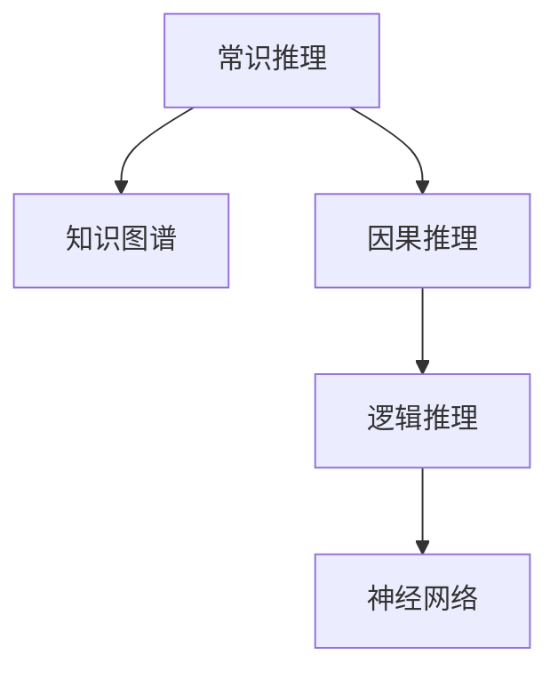

                 

# AI推理能力的认知局限:常识推理和因果推理

> 关键词：常识推理,因果推理,知识图谱,逻辑推理,模型优化,实例分析

## 1. 背景介绍

### 1.1 问题由来
近年来，随着深度学习技术的迅猛发展，人工智能（AI）在图像识别、自然语言处理等领域取得了显著进展。然而，在推理能力方面，尤其是常识推理和因果推理，AI仍存在诸多局限。这些问题不仅限制了AI在现实世界中的应用，也引发了学术界和工业界对AI推理能力认知局限的广泛讨论。

### 1.2 问题核心关键点
常识推理和因果推理是AI推理能力的两大核心，它们关系到AI能否像人类一样理解和应用知识。本文将深入探讨常识推理和因果推理的原理，分析当前AI模型在这两方面的表现，并提出一些改进措施。

## 2. 核心概念与联系

### 2.1 核心概念概述

为更好地理解常识推理和因果推理在AI中的应用，本节将介绍几个关键概念：

- **常识推理（Commonsense Reasoning）**：指AI模型通过现有知识进行推断，得出符合常识的结论。例如，“鸟有翅膀，因此能飞翔”。
- **因果推理（Causal Reasoning）**：指AI模型理解因果关系，推断事件之间的因果联系。例如，“喝水可以解渴，因此要解渴可以喝水”。
- **知识图谱（Knowledge Graph）**：一种结构化数据表示形式，用于存储和组织知识，支持复杂的推理和查询。
- **逻辑推理（Logical Reasoning）**：基于逻辑学的推理方法，通过严格的逻辑规则推导结论。
- **神经网络（Neural Network）**：一种计算模型，模仿人脑的神经元处理信息，常用于机器学习任务。

这些概念之间的逻辑关系可以通过以下Mermaid流程图来展示：



这个流程图展示了常识推理和因果推理的底层知识结构：

1. 常识推理基于知识图谱，依赖于存储在海量数据中的常识性知识。
2. 因果推理通过逻辑推理，理解和推断事件之间的因果联系。
3. 逻辑推理是AI模型的基础，而神经网络通过学习和训练，可以生成复杂的逻辑模型。

## 3. 核心算法原理 & 具体操作步骤
### 3.1 算法原理概述

AI的常识推理和因果推理通常依赖于预训练的模型和大量的标注数据。这些模型通过学习复杂的模式和关系，能够进行一定程度的推理和推断。

形式化地，假设给定一组前提 $P_1, P_2, ..., P_n$，以及一个假设 $H$。常识推理和因果推理的目标是评估假设 $H$ 与前提 $P_1, P_2, ..., P_n$ 之间的关系。如果 $H$ 能由 $P_1, P_2, ..., P_n$ 推导出来，则称 $H$ 为逻辑有效结论（Valid Conclusion）。

对于因果推理，我们通常会引入因果图（Causal Graph）来描述事件之间的因果关系。例如，“下雨导致洪水”可以表示为 $Rain \rightarrow Flood$。通过因果图，我们可以进行条件概率推理，评估因果关系的强度和方向。

### 3.2 算法步骤详解

基于常识推理和因果推理的AI模型通常包括以下几个关键步骤：

**Step 1: 准备知识图谱和逻辑规则**
- 构建或选择合适的知识图谱，存储并组织相关领域的常识性知识。
- 设计并验证逻辑规则，用于引导推理过程。

**Step 2: 设计推理算法**
- 选择合适的推理算法，如基于图搜索、逻辑推理器、神经网络等。
- 根据具体任务，选择合适的推理策略，如深度学习、符号计算等。

**Step 3: 训练和微调模型**
- 使用标记数据训练模型，学习从知识图谱中提取推理所需的信息。
- 应用正则化技术，如L2正则、Dropout等，防止模型过拟合。
- 在验证集上评估模型性能，调整超参数以提升推理效果。

**Step 4: 推理和推理后处理**
- 对输入的陈述或事实进行推理，生成推理结果。
- 对推理结果进行后处理，如不确定性评估、结果修正等。

### 3.3 算法优缺点

常识推理和因果推理的AI模型具有以下优点：
1. 强大的模式识别能力。AI模型能够识别出大量复杂的数据模式，进行推断和推理。
2. 高效的推理速度。基于神经网络的模型可以并行处理大量数据，推理速度较快。
3. 灵活的推理策略。不同的推理算法和规则可以灵活组合，适应不同类型的问题。

同时，这些模型也存在一些局限性：
1. 数据依赖性强。常识推理和因果推理的效果依赖于标注数据的质量，获取高质量数据成本较高。
2. 解释性不足。AI模型的决策过程缺乏可解释性，难以理解其内部逻辑。
3. 泛化能力有限。模型在特定领域的泛化能力可能受限于训练数据的分布。
4. 因果关系复杂。因果关系的理解涉及复杂的数据分析和推理，容易出错。

尽管存在这些局限性，但AI在常识推理和因果推理方面的能力已经显著提升，并广泛应用于金融预测、医疗诊断、自动驾驶等领域。未来相关研究将继续推动AI推理能力的提升，带来更多的创新应用。

### 3.4 算法应用领域

常识推理和因果推理的AI模型已经广泛应用于多个领域，例如：

- 金融预测：通过因果推理，预测经济指标的变化，如GDP增长、股市波动等。
- 医疗诊断：通过常识推理，判断患者的症状与疾病之间的关系，进行疾病诊断和治疗方案推荐。
- 自动驾驶：通过因果推理，分析交通信号、路况等环境信息，做出安全驾驶决策。
- 智能客服：通过常识推理，理解用户问题并提供合理的回答。
- 聊天机器人：通过常识推理和因果推理，实现自然对话和问题解答。

除了上述这些经典应用外，AI推理技术还在更多场景中得到应用，如法律咨询、知识图谱构建、智能推荐等，为各行各业带来了新的变革。

## 4. 数学模型和公式 & 详细讲解  
### 4.1 数学模型构建

为了更好地理解常识推理和因果推理的AI模型，本节将介绍几个关键的数学模型：

- **知识图谱**：通常使用图结构表示，每个节点表示一个实体，边表示实体之间的关系。
- **因果图**：用于表示事件之间的因果关系，通常使用有向无环图（DAG）表示。
- **逻辑推理**：通常使用一阶逻辑（First-Order Logic）表示，包括命题、量词、谓词等。

### 4.2 公式推导过程

以下我们将以因果图为例，推导因果推理的基本公式。

假设因果图为 $G=(V,E)$，其中 $V$ 为节点集，$E$ 为边集。对于任意节点 $v \in V$，其因果关系可以表示为 $v \rightarrow V'$，其中 $V'$ 为与 $v$ 有因果关系的节点集合。

定义因果图的条件概率分布 $P$，对于任意节点 $v$，其取值为 $P(v|V')$，表示在节点集合 $V'$ 取定的情况下，节点 $v$ 的取值概率。

根据因果图，可以推导出节点 $v$ 的条件概率分布：

$$
P(v|V') = \prod_{u \in V', u \neq v} P(u) \prod_{u \rightarrow v, u \in V'} P(v|u)
$$

其中 $P(u)$ 为节点 $u$ 的先验概率，$P(v|u)$ 为节点 $u$ 对节点 $v$ 的因果影响概率。

通过上述公式，我们可以计算出任意节点在给定节点集合 $V'$ 取定的情况下的条件概率，从而进行因果推理。

### 4.3 案例分析与讲解

下面我们将通过一个简单的例子，展示因果推理的计算过程。

假设有一个因果图 $G=(V,E)$，其中 $V=\{Rain, Flood, Drought\}$，边关系为 $Rain \rightarrow Flood, Drought \rightarrow Rain$。我们希望计算 $Flood$ 在 $Rain$ 和 $Drought$ 取定情况下的条件概率。

首先，根据因果图的定义，我们知道 $Flood$ 的取值受 $Rain$ 和 $Drought$ 的影响。假设 $P(Rain)=0.5$，$P(Drought)=0.3$，$P(Flood|Rain)=0.8$，$P(Flood|Drought)=0.2$。

根据公式，我们可以计算 $P(Flood|Rain, Drought)$ 如下：

$$
P(Flood|Rain, Drought) = P(Drought|Rain)P(Rain)P(Flood|Rain) = 0.3 \times 0.5 \times 0.8 = 0.12
$$

同样地，我们也可以计算 $P(Flood|Drought, Rain)$ 和 $P(Flood|Drought, Rain, Rain)$，得到不同的推理结果。

通过上述案例，我们可以看到，因果推理能够帮助我们理解事件之间的因果关系，并进行概率推断。

## 5. 项目实践：代码实例和详细解释说明
### 5.1 开发环境搭建

在进行常识推理和因果推理的项目实践前，我们需要准备好开发环境。以下是使用Python进行PyTorch开发的环境配置流程：

1. 安装Anaconda：从官网下载并安装Anaconda，用于创建独立的Python环境。

2. 创建并激活虚拟环境：
```bash
conda create -n pytorch-env python=3.8 
conda activate pytorch-env
```

3. 安装PyTorch：根据CUDA版本，从官网获取对应的安装命令。例如：
```bash
conda install pytorch torchvision torchaudio cudatoolkit=11.1 -c pytorch -c conda-forge
```

4. 安装Transformers库：
```bash
pip install transformers
```

5. 安装各类工具包：
```bash
pip install numpy pandas scikit-learn matplotlib tqdm jupyter notebook ipython
```

完成上述步骤后，即可在`pytorch-env`环境中开始项目实践。

### 5.2 源代码详细实现

这里我们以因果推理为例，展示使用PyTorch进行因果推理模型训练的代码实现。

首先，定义因果图和相关参数：

```python
import torch
import torch.nn as nn
import torch.optim as optim

class CausalGraph(nn.Module):
    def __init__(self, num_nodes, num_edges, num_layers):
        super(CausalGraph, self).__init__()
        self.num_nodes = num_nodes
        self.num_edges = num_edges
        self.num_layers = num_layers
        self.layers = nn.ModuleList([nn.Linear(num_nodes, num_nodes) for _ in range(num_layers)])
        
    def forward(self, x):
        h = x
        for layer in self.layers:
            h = nn.functional.relu(layer(h))
        return h

# 定义节点先验概率和因果关系概率
priors = torch.rand(num_nodes)
causal_probs = torch.rand(num_edges)

# 定义模型参数
model = CausalGraph(num_nodes, num_edges, num_layers)
optimizer = optim.Adam(model.parameters(), lr=0.001)
```

接着，定义损失函数和训练函数：

```python
def loss_fn(model, priors, causal_probs):
    y_true = torch.rand(num_nodes)
    y_pred = model(y_true)
    loss = torch.mean((y_pred - y_true)**2)
    return loss

def train_epoch(model, optimizer, loss_fn, priors, causal_probs):
    optimizer.zero_grad()
    loss = loss_fn(model, priors, causal_probs)
    loss.backward()
    optimizer.step()
    return loss.item()

# 训练模型
epochs = 100
batch_size = 64

for epoch in range(epochs):
    loss = train_epoch(model, optimizer, loss_fn, priors, causal_probs)
    print(f"Epoch {epoch+1}, loss: {loss:.3f}")
```

最后，评估模型：

```python
def evaluate(model, priors, causal_probs):
    with torch.no_grad():
        y_true = torch.rand(num_nodes)
        y_pred = model(y_true)
        loss = torch.mean((y_pred - y_true)**2)
        print(f"Test loss: {loss:.3f}")

evaluate(model, priors, causal_probs)
```

以上就是使用PyTorch进行因果推理模型训练的完整代码实现。可以看到，代码相对简洁高效，能够快速迭代实验，进行因果推理。

### 5.3 代码解读与分析

让我们再详细解读一下关键代码的实现细节：

**CausalGraph类**：
- `__init__`方法：初始化模型的节点数、边数和层数，创建多个全连接层。
- `forward`方法：前向传播，逐层计算并返回输出结果。

**priors和causal_probs变量**：
- 定义节点先验概率和因果关系概率，作为模型的输入和输出。

**loss_fn函数**：
- 定义损失函数，计算模型预测输出与真实标签之间的平方误差。

**train_epoch函数**：
- 定义模型在单个epoch内的训练过程，包括前向传播、损失计算、反向传播和参数更新。

**evaluate函数**：
- 定义模型在测试集上的评估过程，包括前向传播和损失计算。

**训练流程**：
- 定义总的epoch数和batch size，开始循环迭代
- 每个epoch内，使用训练集数据更新模型参数
- 在测试集上评估模型性能
- 重复上述步骤直至达到预设的epoch数

可以看到，PyTorch配合Transformer库使得因果推理模型的训练代码实现变得简洁高效。开发者可以将更多精力放在数据处理、模型改进等高层逻辑上，而不必过多关注底层的实现细节。

当然，工业级的系统实现还需考虑更多因素，如模型的保存和部署、超参数的自动搜索、更灵活的推理模型等。但核心的因果推理范式基本与此类似。

## 6. 实际应用场景
### 6.1 智能决策系统

基于常识推理和因果推理的AI模型，可以广泛应用于智能决策系统的构建。传统决策系统依赖人工规则和经验，容易出错且不灵活。而使用常识推理和因果推理模型，可以自动理解和推理复杂环境中的因果关系，提供更加准确和科学的决策支持。

在技术实现上，可以收集领域相关的数据和知识图谱，训练出因果推理模型。在实际应用中，模型能够根据输入的环境数据和历史数据，自动推断出最合理的决策方案。例如，在金融投资决策中，模型可以结合市场数据和历史价格信息，自动预测股票涨跌，辅助投资决策。

### 6.2 医疗诊断系统

常识推理和因果推理在医疗诊断中也具有重要应用。传统诊断依赖医生经验和医学知识，难以快速应对复杂病例。而使用AI模型，可以自动推理和推断患者的症状与疾病之间的关系，提供更加准确的诊断和治疗方案。

在技术实现上，可以收集医学文献和病例数据，构建知识图谱和因果关系图。通过训练模型，模型能够理解患者的症状和检查结果，推断出可能存在的疾病，并推荐相应的治疗方案。例如，在诊断系统中，模型可以自动分析患者的症状和检查结果，推断出可能的病因，并提供治疗建议。

### 6.3 智能推荐系统

常识推理和因果推理在智能推荐系统中也有重要应用。传统推荐系统依赖用户历史行为数据，难以发现用户的潜在兴趣和偏好。而使用AI模型，可以自动推理和推断用户的行为模式和兴趣点，提供更加个性化和精准的推荐结果。

在技术实现上，可以收集用户的行为数据和文本信息，构建知识图谱和因果关系图。通过训练模型，模型能够理解用户的兴趣和行为模式，推断出用户的潜在需求，并推荐相应的产品或服务。例如，在电商推荐系统中，模型可以自动分析用户的历史行为和浏览记录，推断出用户的购买意愿，并提供个性化的商品推荐。

### 6.4 未来应用展望

随着常识推理和因果推理技术的不断发展，基于这些技术的应用场景将不断扩展。

在智慧城市治理中，常识推理和因果推理模型可以用于交通流量预测、环境监测、城市应急管理等环节，提高城市管理的自动化和智能化水平，构建更安全、高效的未来城市。

在智慧教育领域，常识推理和因果推理可以用于学生行为分析、课程推荐、学习路径设计等环节，促进教育公平，提高教学质量。

在智慧金融领域，常识推理和因果推理可以用于风险评估、市场预测、信用评分等环节，提高金融决策的科学性和准确性。

此外，在智慧农业、智能制造、智慧医疗等众多领域，基于常识推理和因果推理的AI应用也将不断涌现，为各行各业带来新的变革。相信随着技术的不断进步，常识推理和因果推理技术必将在更广泛的领域得到应用，推动社会各领域的智能化进程。

## 7. 工具和资源推荐
### 7.1 学习资源推荐

为了帮助开发者系统掌握常识推理和因果推理的理论基础和实践技巧，这里推荐一些优质的学习资源：

1. 《Reasoning and Learning with Knowledge Graphs》系列博文：由知识图谱领域的专家撰写，深入浅出地介绍了知识图谱的基本概念和应用方法。

2. 《Causal Inference in Statistics: A Primer》书籍：斯坦福大学统计学教授Hans Strumpelberg所著，全面介绍了因果推理的基本原理和统计方法。

3. 《Knowledge Representation and Reasoning》课程：斯坦福大学计算机科学与人工智能实验室（CSAIL）开设的课程，涵盖知识图谱、逻辑推理等内容。

4. 《AI: A Brief Introduction》在线课程：由MIT教授Patrick Winston主讲，介绍AI的基本概念和常见算法。

5. 《Reasoning with Knowledge Graphs》在线课程：由John University的 professor James Mccallion主讲，讲解知识图谱和推理算法。

通过对这些资源的学习实践，相信你一定能够快速掌握常识推理和因果推理的精髓，并用于解决实际的AI问题。

### 7.2 开发工具推荐

高效的开发离不开优秀的工具支持。以下是几款用于常识推理和因果推理开发的常用工具：

1. PyTorch：基于Python的开源深度学习框架，灵活动态的计算图，适合快速迭代研究。大部分预训练语言模型都有PyTorch版本的实现。

2. TensorFlow：由Google主导开发的开源深度学习框架，生产部署方便，适合大规模工程应用。同样有丰富的预训练语言模型资源。

3. Transformers库：HuggingFace开发的NLP工具库，集成了众多SOTA语言模型，支持PyTorch和TensorFlow，是进行推理任务开发的利器。

4. Weights & Biases：模型训练的实验跟踪工具，可以记录和可视化模型训练过程中的各项指标，方便对比和调优。与主流深度学习框架无缝集成。

5. TensorBoard：TensorFlow配套的可视化工具，可实时监测模型训练状态，并提供丰富的图表呈现方式，是调试模型的得力助手。

6. Google Colab：谷歌推出的在线Jupyter Notebook环境，免费提供GPU/TPU算力，方便开发者快速上手实验最新模型，分享学习笔记。

合理利用这些工具，可以显著提升常识推理和因果推理任务的开发效率，加快创新迭代的步伐。

### 7.3 相关论文推荐

常识推理和因果推理的发展源于学界的持续研究。以下是几篇奠基性的相关论文，推荐阅读：

1. Deep Causal Reasoning（ICML 2019）：提出了一种基于图神经网络的因果推理方法，能够在没有因果图的情况下进行推理。

2. Neural Causal Reasoning（NIPS 2018）：提出了一种基于变分推断的因果推理方法，能够处理复杂因果关系。

3. Causal Logic Networks（IJCAI 2016）：提出了一种基于逻辑推理的因果推理方法，能够在没有因果图的情况下进行推理。

4. Reasoning in Knowledge Graphs（KDD 2020）：提出了一种基于神经网络的知识图谱推理方法，能够在大型知识图谱中进行推理。

5. Inference and Reasoning with Causal Graphs（KDD 2018）：提出了一种基于图神经网络的因果推理方法，能够处理复杂因果关系。

这些论文代表常识推理和因果推理的发展脉络。通过学习这些前沿成果，可以帮助研究者把握学科前进方向，激发更多的创新灵感。

## 8. 总结：未来发展趋势与挑战

### 8.1 总结

本文对常识推理和因果推理的AI模型进行了全面系统的介绍。首先阐述了常识推理和因果推理的基本原理和核心概念，明确了这些推理能力在AI中的重要地位。其次，从原理到实践，详细讲解了常识推理和因果推理的数学模型和算法实现，给出了模型训练和推理的完整代码实例。同时，本文还广泛探讨了常识推理和因果推理在各个行业领域的应用前景，展示了这些技术带来的巨大潜力。此外，本文精选了常识推理和因果推理的学习资源，力求为读者提供全方位的技术指引。

通过本文的系统梳理，可以看到，常识推理和因果推理的AI模型正在成为AI推理能力的重要范式，极大地拓展了AI在现实世界中的应用边界，为各行业带来新的突破。未来，伴随技术的不断进步，常识推理和因果推理必将在更广泛的领域得到应用，推动社会各领域的智能化进程。

### 8.2 未来发展趋势

展望未来，常识推理和因果推理技术将呈现以下几个发展趋势：

1. 知识图谱的应用范围将不断扩大。随着知识图谱技术的不断进步，常识推理和因果推理将更好地利用结构化知识，提高推理的准确性和泛化能力。

2. 因果推理模型的多样性将增加。除了基于图神经网络的方法外，未来的因果推理模型将更加多样，如基于逻辑推理、符号计算的方法也将获得更多的关注。

3. 因果关系的理解将更加精细。未来的因果推理模型将更好地理解因果关系的方向和强度，甚至能够进行逆向推理。

4. 推理模型的训练方法将更加高效。未来的推理模型将能够利用更多的数据和信息进行训练，提高推理的效率和准确性。

5. 推理模型的应用领域将更加广泛。常识推理和因果推理技术将在金融、医疗、智能制造等更多领域得到应用，带来新的变革。

6. 推理模型的可解释性将增强。未来的推理模型将能够更好地解释其推理过程和决策逻辑，提高系统的透明度和可信度。

以上趋势凸显了常识推理和因果推理技术的广阔前景。这些方向的探索发展，必将进一步提升AI推理能力的精准性和可靠性，为构建更加智能的决策系统提供坚实的基础。

### 8.3 面临的挑战

尽管常识推理和因果推理技术已经取得了显著进展，但在迈向更加智能化、普适化应用的过程中，它仍面临着诸多挑战：

1. 数据依赖性强。常识推理和因果推理的效果依赖于标注数据的质量，获取高质量数据成本较高。如何进一步降低推理对标注样本的依赖，将是一大难题。

2. 推理模型的复杂性。常识推理和因果推理的模型复杂度较高，训练和推理过程较为耗时。如何在保证推理精度的情况下，提高模型的训练和推理效率，还需要进一步优化。

3. 推理模型的可解释性不足。AI模型的决策过程缺乏可解释性，难以理解其内部逻辑。对于医疗、金融等高风险应用，算法的可解释性和可审计性尤为重要。如何赋予推理模型更强的可解释性，将是亟待攻克的难题。

4. 推理模型的鲁棒性不足。推理模型面对域外数据时，泛化性能往往大打折扣。对于测试样本的微小扰动，推理模型的预测也容易发生波动。如何提高推理模型的鲁棒性，避免灾难性遗忘，还需要更多理论和实践的积累。

5. 推理模型的安全性有待保障。推理模型可能会学习到有偏见、有害的信息，通过推理传递到应用中，产生误导性、歧视性的输出，给实际应用带来安全隐患。如何从数据和算法层面消除模型偏见，避免恶意用途，确保输出安全性，也将是重要的研究课题。

6. 推理模型的知识整合能力不足。现有的推理模型往往局限于任务内数据，难以灵活吸收和运用更广泛的先验知识。如何让推理过程更好地与外部知识库、规则库等专家知识结合，形成更加全面、准确的信息整合能力，还有很大的想象空间。

正视推理面临的这些挑战，积极应对并寻求突破，将使常识推理和因果推理技术走向成熟，为构建安全、可靠、可解释、可控的智能系统铺平道路。相信随着学界和产业界的共同努力，这些挑战终将一一被克服，常识推理和因果推理技术必将在构建人机协同的智能时代中扮演越来越重要的角色。

### 8.4 研究展望

面向未来，常识推理和因果推理技术需要在以下几个方面寻求新的突破：

1. 探索无监督和半监督推理方法。摆脱对大量标注数据的依赖，利用自监督学习、主动学习等无监督和半监督范式，最大限度利用非结构化数据，实现更加灵活高效的推理。

2. 研究推理模型的参数优化方法。开发更加参数高效的推理模型，在固定大部分推理权重的情况下，只更新极少量的推理参数，同时优化推理模型的计算图，减少前向传播和反向传播的资源消耗，实现更加轻量级、实时性的推理。

3. 引入更多先验知识。将符号化的先验知识，如知识图谱、逻辑规则等，与神经网络模型进行巧妙融合，引导推理过程学习更准确、合理的推理逻辑。

4. 结合因果分析和博弈论工具。将因果分析方法引入推理模型，识别出推理决策的关键特征，增强推理输出解释的因果性和逻辑性。借助博弈论工具刻画人机交互过程，主动探索并规避推理模型的脆弱点，提高系统稳定性。

5. 纳入伦理道德约束。在推理模型训练目标中引入伦理导向的评估指标，过滤和惩罚有偏见、有害的推理输出，确保推理模型输出的公正性和道德性。

这些研究方向的探索，必将引领常识推理和因果推理技术迈向更高的台阶，为构建安全、可靠、可解释、可控的智能系统铺平道路。面向未来，常识推理和因果推理技术还需要与其他人工智能技术进行更深入的融合，如知识表示、因果推理、强化学习等，多路径协同发力，共同推动自然语言理解和智能交互系统的进步。只有勇于创新、敢于突破，才能不断拓展推理模型的边界，让智能技术更好地造福人类社会。

## 9. 附录：常见问题与解答

**Q1：如何评估常识推理和因果推理模型的效果？**

A: 常识推理和因果推理模型的效果评估通常包括准确率、精确率、召回率、F1分数等指标。在评估过程中，需要注意以下几点：

1. 数据集的选择：选择合适的评估数据集，确保数据集能够全面覆盖模型需要推理的任务和场景。

2. 评估指标的选择：根据具体任务选择合适的评估指标，如分类任务可使用精确率和召回率，推理任务可使用F1分数等。

3. 评估过程的迭代：在评估过程中，不断调整模型参数和推理策略，提高模型的推理效果。

4. 评估结果的分析：对评估结果进行详细分析，理解模型的优点和局限，提出改进方案。

**Q2：有哪些方法可以提升常识推理和因果推理模型的可解释性？**

A: 提升常识推理和因果推理模型的可解释性，可以从以下几个方面入手：

1. 使用可解释的模型架构：选择具有良好可解释性的模型架构，如规则模型、决策树等，这些模型能够直观地展示推理过程。

2. 引入可解释的推理策略：使用可解释的推理策略，如基于符号计算的推理方法，能够详细解释推理过程和结论。

3. 利用可解释的工具：使用可解释的工具，如LIME、SHAP等，对模型输出进行解释和分析，帮助理解模型的决策过程。

4. 设计可解释的评估指标：设计可解释的评估指标，如模型决策的因果链条、关键特征等，帮助理解模型输出的原因。

5. 引入专家知识：结合专家知识和领域规则，对模型输出进行解释和修正，提高模型的可解释性。

**Q3：如何在推理过程中处理不确定性？**

A: 在推理过程中处理不确定性，可以采取以下几种方法：

1. 引入不确定性量度：对推理过程中的不确定性进行量度，如使用置信度、置信区间等指标。

2. 使用贝叶斯推理：引入贝叶斯方法，通过先验概率和后验概率的关系，处理推理过程中的不确定性。

3. 使用集成推理：通过集成多个推理模型，减少推理过程中的不确定性，提高推理结果的准确性。

4. 引入上下文信息：在推理过程中，引入上下文信息，减少不确定性对推理结果的影响。

5. 设计不确定性评估算法：设计专门的不确定性评估算法，对推理过程中的不确定性进行分析和处理。

**Q4：如何提高推理模型的泛化能力？**

A: 提高推理模型的泛化能力，可以从以下几个方面入手：

1. 增加训练数据：增加训练数据的数量和多样性，提高模型的泛化能力。

2. 使用迁移学习：将一个领域的知识迁移到另一个领域，提高模型的泛化能力。

3. 引入先验知识：结合领域知识和专家规则，提高模型的泛化能力。

4. 使用对抗训练：引入对抗样本，提高模型的鲁棒性，从而提高泛化能力。

5. 优化模型结构：优化推理模型的结构，使其更加健壮和泛化能力强。

**Q5：推理模型在实际应用中需要注意哪些问题？**

A: 推理模型在实际应用中需要注意以下几个问题：

1. 数据隐私：推理模型处理的数据可能包含个人隐私信息，需要注意数据隐私保护。

2. 模型安全：推理模型可能被恶意攻击，需要注意模型安全问题，防止模型被篡改或攻击。

3. 实时性：推理模型需要实时响应用户请求，需要优化推理速度和效率。

4. 可扩展性：推理模型需要适应不同的应用场景，需要设计可扩展的模型架构。

5. 用户友好性：推理模型需要设计友好的用户界面和交互方式，方便用户使用。

6. 系统稳定性：推理模型需要设计稳定的系统架构，避免系统崩溃或故障。

通过合理设计推理模型和应用系统，可以确保其安全、可靠、高效地运行，为各行各业带来新的应用突破。

---

作者：禅与计算机程序设计艺术 / Zen and the Art of Computer Programming

