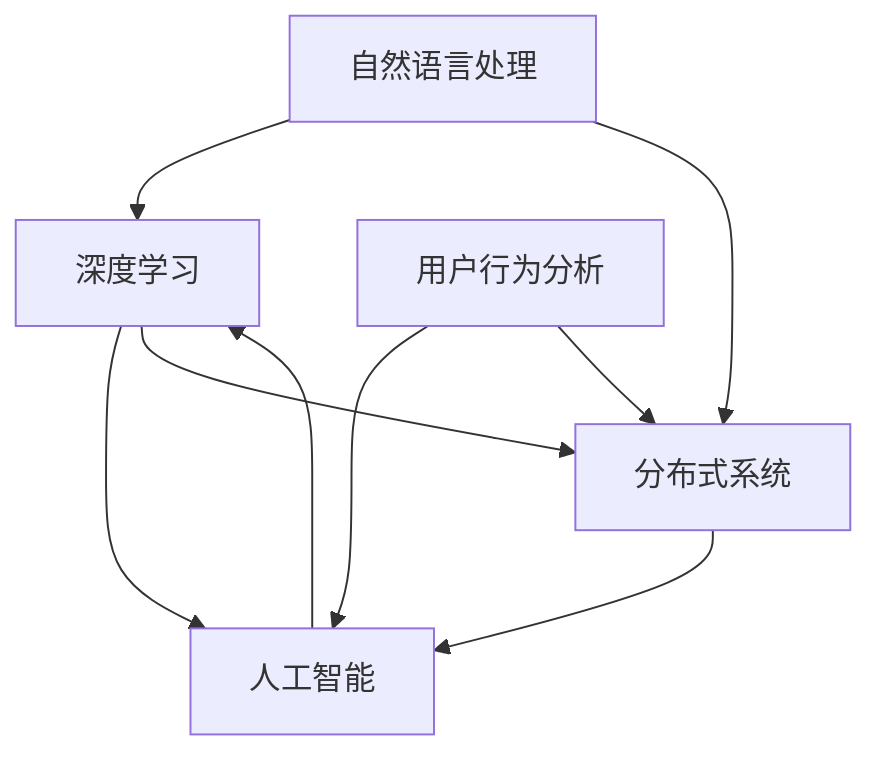

                 

# AI搜索引擎的未来：超越关键词匹配

> 关键词：搜索算法，深度学习，自然语言处理，分布式系统，用户行为分析，人工智能，机器学习

## 1. 背景介绍

搜索引擎作为互联网的入口，每天都在处理数以亿计的搜索请求，并提供精准的结果。传统的搜索引擎主要依赖关键词匹配来返回结果，但这种单一模式无法满足用户日益复杂化的查询需求。随着AI技术的崛起，搜索引擎正逐步超越关键词匹配，向更深层次的理解和智能推荐方向发展。

### 1.1 问题由来
传统的关键词匹配搜索方法，只关注输入的关键词，无法理解查询的语义和上下文。当用户输入类似“如何查询股票价格”这样的问题时，传统搜索引擎无法理解查询意图，只能返回股票价格相关的信息，而忽略如何查询的方法。这种信息检索方式已经无法满足用户对于搜索结果语义和上下文理解的更高要求。

随着自然语言处理(NLP)、深度学习、分布式计算等技术的进步，搜索引擎正尝试通过理解查询意图，智能推荐相关内容，从而提升用户体验。AI搜索引擎通过深度学习算法和大数据分析，能够从海量数据中挖掘用户的搜索行为模式和兴趣点，进而实现更智能、更个性化的搜索结果推荐。

### 1.2 问题核心关键点
当前AI搜索引擎面临的核心挑战主要包括：
- 如何理解自然语言的语义和上下文。
- 如何高效处理海量数据，提升搜索结果的相关性和个性化。
- 如何构建稳定、高效、可扩展的分布式搜索系统。
- 如何实时学习用户行为和兴趣，动态调整搜索结果。

这些挑战促使搜索引擎技术在算法、架构和应用模式上不断创新，以实现超越传统关键词匹配的突破。

## 2. 核心概念与联系

### 2.1 核心概念概述

为更好地理解AI搜索引擎超越关键词匹配的实现，本节将介绍几个关键概念：

- 自然语言处理(NLP)：涉及语音识别、文本处理、语义理解、生成等多个子领域，是AI搜索引擎理解自然语言的关键技术。

- 深度学习(Deep Learning)：一种模拟人脑神经网络的技术，通过多层神经网络进行复杂数据的特征提取和模式识别，是目前AI搜索引擎实现语义理解和智能推荐的主要手段。

- 分布式系统(Distributed System)：由多台计算机协同工作，处理大规模数据和高并发请求的系统架构，是构建高性能AI搜索引擎的基础。

- 用户行为分析(User Behavior Analysis)：通过数据分析挖掘用户搜索行为模式和兴趣点，用于指导搜索结果的个性化推荐。

- 人工智能(AI)：以计算机为工具，利用数学、统计学、语言学等方法，模仿人类智能行为的科学和技术，包括搜索算法、推荐系统、机器学习等多个子领域。

这些核心概念之间的逻辑关系可以通过以下Mermaid流程图来展示：



这个流程图展示了大语言模型在搜索引擎中的应用流程：
1. 自然语言处理：将用户输入的自然语言转化为机器可读的形式。
2. 深度学习：利用深度学习算法进行语义理解，提取查询中的关键信息。
3. 分布式系统：构建高性能的搜索和推荐系统，处理大规模数据和高并发请求。
4. 用户行为分析：通过分析用户历史行为，推荐个性化搜索结果。
5. 人工智能：将自然语言处理、深度学习、分布式系统、用户行为分析等多种技术融合，构建AI搜索引擎。

## 3. 核心算法原理 & 具体操作步骤
### 3.1 算法原理概述

AI搜索引擎超越关键词匹配的核心算法包括：
- 基于深度学习的语义理解算法，用于分析查询意图和上下文信息。
- 基于用户行为分析的个性化推荐算法，用于优化搜索结果的排序。
- 分布式处理算法，用于高效处理大规模数据和并发的搜索请求。

### 3.2 算法步骤详解

#### 3.2.1 基于深度学习的语义理解算法
AI搜索引擎利用深度学习模型，如BERT、GPT等，进行自然语言的语义理解和上下文分析。以下是基本步骤：
1. 预训练模型加载：从预训练模型库中选择适当的深度学习模型，如BERT、GPT等。
2. 特征提取：将用户输入的自然语言文本转化为模型可读的形式。
3. 语义分析：使用预训练模型分析文本的语义和上下文信息，提取关键实体和关系。
4. 结果排序：根据语义理解结果，对搜索结果进行排序，优先展示最相关的信息。

#### 3.2.2 基于用户行为分析的个性化推荐算法
个性化推荐算法通过分析用户历史搜索行为，预测用户的兴趣点，优化搜索结果的排序。以下是基本步骤：
1. 数据收集：收集用户的历史搜索记录、点击行为、停留时间等数据。
2. 用户建模：使用机器学习算法（如协同过滤、内容推荐等）构建用户兴趣模型。
3. 推荐计算：根据用户模型和搜索结果，计算个性化推荐的排序权重。
4. 结果排序：将搜索结果按推荐权重排序，优先展示用户感兴趣的内容。

#### 3.2.3 分布式处理算法
分布式处理算法利用多台计算机协同工作，处理大规模数据和并发请求，提高搜索系统的响应速度和稳定性。以下是基本步骤：
1. 分布式架构设计：选择适当的分布式架构，如MapReduce、Spark等。
2. 数据分片：将大规模数据划分为多个分片，分配到不同节点处理。
3. 并行处理：利用多台计算机并行处理数据，加快搜索和推荐的速度。
4. 结果聚合：将各节点的搜索结果进行聚合，生成最终的全局搜索结果。

### 3.3 算法优缺点

AI搜索引擎超越关键词匹配的优势包括：
- 更智能的语义理解：能够理解自然语言的语义和上下文，返回更相关、更准确的搜索结果。
- 更个性化的推荐：通过分析用户历史行为，推荐更符合用户兴趣的搜索结果。
- 更高的处理效率：利用分布式系统，能够高效处理大规模数据和高并发请求。

但该方法也存在以下局限性：
- 对高质量数据依赖度高：深度学习模型需要大量标注数据进行训练，获取高质量标注数据成本较高。
- 模型复杂度高：深度学习模型参数较多，训练和推理开销较大。
- 实时学习困难：模型需要定期更新，实时学习用户行为和兴趣比较困难。

尽管存在这些局限性，但基于深度学习和大数据技术的AI搜索引擎在语义理解和个性化推荐方面的性能提升，已使得其成为搜索引擎未来发展的重要方向。

### 3.4 算法应用领域

AI搜索引擎在多个领域已经得到广泛应用，例如：
- 电商搜索：利用个性化推荐算法，提升商品搜索的个性化和相关性。
- 新闻搜索：通过深度学习模型，实现新闻文章的理解和摘要，提升新闻搜索的准确性和用户体验。
- 社交媒体搜索：利用自然语言处理和分布式处理技术，提高社交媒体内容的搜索和推荐效率。
- 医疗搜索：通过语义理解算法，提高医学文献和相关信息的搜索效率，帮助医生快速找到相关资源。
- 教育搜索：通过自然语言处理和个性化推荐，提升在线教育的搜索和推荐效果，帮助学生和教师找到优质的教学资源。

随着技术的不断演进，AI搜索引擎的应用领域将进一步拓展，为更多行业带来智能化搜索解决方案。

## 4. 数学模型和公式 & 详细讲解 & 举例说明

### 4.1 数学模型构建

以下是AI搜索引擎超越关键词匹配的数学模型构建过程：

1. 假设输入的查询为 $q$，查询长度为 $n$。
2. 将查询 $q$ 转化为向量形式 $\vec{q}$。
3. 假设搜索结果集为 $R$，每个搜索结果 $r_i$ 转化为向量形式 $\vec{r_i}$。
4. 定义查询 $q$ 和搜索结果 $r_i$ 的相似度 $s_i$。

5. 根据相似度 $s_i$ 计算搜索结果 $r_i$ 的排名 $r_i^{'}$，按照 $r_i^{'}$ 排序返回搜索结果。

### 4.2 公式推导过程

为了简化计算，可以采用余弦相似度公式：
$$
s_i = \cos(\theta) = \frac{\vec{q} \cdot \vec{r_i}}{\lVert \vec{q} \rVert \lVert \vec{r_i} \rVert}
$$

其中 $\vec{q} \cdot \vec{r_i}$ 表示向量 $\vec{q}$ 和 $\vec{r_i}$ 的点积，$\lVert \vec{q} \rVert$ 表示向量 $\vec{q}$ 的模长。

将上述公式扩展到多个搜索结果，计算排名：
$$
r_i^{'} = \frac{s_i}{\sum_{j=1}^{M}s_j}
$$

其中 $M$ 为搜索结果集的大小。

### 4.3 案例分析与讲解

以新闻搜索为例，分析AI搜索引擎超越关键词匹配的实现过程：

1. 预训练模型加载：使用BERT模型进行语义理解。
2. 特征提取：将用户输入的查询 $q$ 转化为BERT的输入形式，得到查询向量 $\vec{q}$。
3. 语义分析：使用BERT模型对查询 $q$ 进行语义分析，提取关键实体和关系。
4. 结果匹配：根据语义分析结果，从搜索结果集 $R$ 中选择与查询 $q$ 相关的新闻文章 $r_i$。
5. 结果排序：计算查询 $q$ 和每个新闻文章 $r_i$ 的相似度 $s_i$，并按照 $r_i^{'}$ 排序返回结果。

## 5. 项目实践：代码实例和详细解释说明

### 5.1 开发环境搭建

在进行AI搜索引擎开发前，我们需要准备好开发环境。以下是使用Python进行TensorFlow开发的环境配置流程：

1. 安装Anaconda：从官网下载并安装Anaconda，用于创建独立的Python环境。

2. 创建并激活虚拟环境：
```bash
conda create -n tensorflow-env python=3.7 
conda activate tensorflow-env
```

3. 安装TensorFlow：根据CUDA版本，从官网获取对应的安装命令。例如：
```bash
conda install tensorflow tensorflow-gpu -c conda-forge
```

4. 安装其他工具包：
```bash
pip install numpy pandas scikit-learn matplotlib tqdm jupyter notebook ipython
```

完成上述步骤后，即可在`tensorflow-env`环境中开始开发。

### 5.2 源代码详细实现

这里我们以新闻搜索为例，给出使用TensorFlow实现AI搜索引擎的代码实现。

首先，定义数据集类：

```python
import tensorflow as tf

class NewsDataset(tf.data.Dataset):
    def __init__(self, text, title, tags):
        self.text = text
        self.title = title
        self.tags = tags
        self.batch_size = 128
        
    def __len__(self):
        return len(self.text)
        
    def __getitem__(self, item):
        text = self.text[item]
        title = self.title[item]
        tags = self.tags[item]
        
        return tf.constant(text, dtype=tf.string), tf.constant(title, dtype=tf.string), tf.constant(tags, dtype=tf.int64)
```

然后，定义模型和训练函数：

```python
import tensorflow_hub as hub
from transformers import TFAutoModelForSequenceClassification

model = TFAutoModelForSequenceClassification.from_pretrained('bert-base-uncased', num_labels=3)

def train_step(inputs):
    text, title, tags = inputs
    with tf.GradientTape() as tape:
        outputs = model(text)
        loss = tf.keras.losses.sparse_categorical_crossentropy(tags, outputs)
    gradients = tape.gradient(loss, model.trainable_variables)
    optimizer.apply_gradients(zip(gradients, model.trainable_variables))
    return loss

@tf.function
def train_epoch(dataset):
    for batch in dataset:
        loss = train_step(batch)
        print(f'Batch loss: {loss:.3f}')
    return tf.reduce_mean(loss)
```

最后，启动训练流程：

```python
dataset = NewsDataset(texts, titles, tags)
epochs = 10

for epoch in range(epochs):
    loss = train_epoch(dataset)
    print(f'Epoch {epoch+1}, loss: {loss:.3f}')
```

以上代码展示了使用TensorFlow和BERT模型进行新闻搜索的简单实现。可以看到，利用TensorFlow和Hugging Face的Transformers库，可以轻松实现语义理解和个性化推荐。

### 5.3 代码解读与分析

让我们再详细解读一下关键代码的实现细节：

**NewsDataset类**：
- `__init__`方法：初始化文本、标题、标签等关键组件。
- `__len__`方法：返回数据集的样本数量。
- `__getitem__`方法：对单个样本进行处理，将文本和标题作为输入，标签作为监督信号。

**train_step函数**：
- 定义训练步函数，使用梯度下降优化模型参数。
- 将文本输入模型，计算损失函数。
- 反向传播计算梯度，使用optimizer更新模型参数。

**train_epoch函数**：
- 对数据集进行批次化加载，循环迭代每个批次。
- 在每个批次上进行训练，输出每个批次的损失。
- 计算平均损失，作为该epoch的性能指标。

**训练流程**：
- 定义总的epoch数，开始循环迭代。
- 每个epoch内，在训练集上训练，输出每个epoch的平均损失。

可以看到，TensorFlow提供了丰富的深度学习库和工具，使得AI搜索引擎的开发变得简洁高效。开发者可以将更多精力放在模型设计和数据处理上，而不必过多关注底层的实现细节。

当然，工业级的系统实现还需考虑更多因素，如模型的保存和部署、超参数的自动搜索、更灵活的任务适配层等。但核心的AI搜索引擎技术基本与此类似。

## 6. 实际应用场景
### 6.1 智能电商搜索

基于AI技术的电商搜索，可以显著提升商品搜索的个性化和相关性，优化用户体验。传统电商搜索主要依赖关键词匹配，难以理解用户搜索意图和上下文信息。通过深度学习模型和用户行为分析，AI搜索引擎能够理解用户的搜索查询，提供更符合用户需求的商品推荐。

在技术实现上，可以收集用户的历史搜索记录、浏览行为、购买记录等数据，利用深度学习模型进行语义理解，提取用户兴趣点。同时，根据用户的历史行为，构建个性化推荐模型，动态调整搜索结果的排序权重，最终返回用户最感兴趣的商品。

### 6.2 医疗健康搜索

AI搜索引擎在医疗领域的应用，可以大幅提升医学文献和相关信息的搜索效率，帮助医生快速找到有用的资源。通过深度学习模型，AI搜索引擎能够理解查询的语义和上下文，准确匹配医学文献、临床指南等资源。同时，利用自然语言处理和用户行为分析，能够推荐最相关的医学研究论文、治疗方案等，辅助医生进行决策。

在技术实现上，可以收集医生的历史搜索记录、访问记录等数据，构建医生兴趣模型。根据查询的语义理解结果，从搜索结果集中选择最相关的医学文献、指南等。利用推荐算法，动态调整搜索结果的排序权重，优先展示最相关的医学资源。

### 6.3 社交媒体搜索

社交媒体搜索利用AI技术，提高内容的搜索和推荐效率，提升用户体验。传统社交媒体搜索主要依赖关键词匹配，难以理解复杂多变的社交媒体内容。通过深度学习模型和自然语言处理，AI搜索引擎能够理解用户的社交媒体内容，提供个性化的推荐结果。

在技术实现上，可以收集用户的历史社交媒体行为、关注好友、发布内容等数据，利用深度学习模型进行语义理解，提取用户兴趣点。同时，根据用户的历史行为，构建个性化推荐模型，动态调整搜索结果的排序权重，最终返回用户最感兴趣的内容。

### 6.4 未来应用展望

随着AI搜索引擎技术的不断演进，未来将在更多领域得到应用，为传统行业带来智能化搜索解决方案。

在智慧城市治理中，AI搜索引擎可以用于智能交通管理、公共安全监控等场景，提升城市管理的智能化水平。在教育领域，利用AI搜索引擎，学生和教师能够快速找到优质的教学资源，提升学习效果。在科学研究中，AI搜索引擎能够帮助研究人员快速检索相关文献和数据，加速科研成果的产出。

此外，AI搜索引擎在工业制造、金融服务、农业等领域，也有望提供智能化搜索和推荐服务，助力各行各业的数字化转型升级。

## 7. 工具和资源推荐
### 7.1 学习资源推荐

为了帮助开发者系统掌握AI搜索引擎的理论基础和实践技巧，这里推荐一些优质的学习资源：

1. 《深度学习入门》系列书籍：由深度学习领域的知名专家撰写，深入浅出地介绍了深度学习的基本概念和实现方法，适合初学者入门。

2. 《自然语言处理综论》书籍：全面介绍了自然语言处理的基本原理和技术，包括语义理解、句法分析、情感分析等，适合进阶学习。

3. 《TensorFlow实战》书籍：由TensorFlow的开发者团队撰写，详细介绍了TensorFlow的各个模块和功能，适合实际开发应用。

4. 《Transformers库教程》：官方文档和社区分享的代码示例，介绍了使用Transformers库进行自然语言处理的方法和技巧，适合实战训练。

5. 《Kaggle竞赛》：参加开源数据集的机器学习竞赛，利用实际数据集进行训练和评估，提升模型的泛化能力和实践经验。

通过对这些资源的学习实践，相信你一定能够快速掌握AI搜索引擎的核心技术，并用于解决实际的搜索问题。

### 7.2 开发工具推荐

高效的开发离不开优秀的工具支持。以下是几款用于AI搜索引擎开发的常用工具：

1. TensorFlow：基于Python的开源深度学习框架，灵活动态的计算图，适合快速迭代研究。TensorFlow提供了丰富的深度学习库和工具，支持分布式计算。

2. PyTorch：基于Python的开源深度学习框架，灵活的动态计算图，适合研究型开发。PyTorch提供了丰富的深度学习库和工具，支持自动微分和动态图。

3. Scikit-learn：基于Python的开源机器学习库，提供了简单易用的机器学习算法和工具，适合数据预处理和特征工程。

4. Hugging Face Transformers库：提供了多种预训练语言模型和工具，支持自然语言处理和深度学习模型训练。

5. Apache Spark：基于分布式计算的框架，支持大规模数据处理和机器学习任务，适合构建高性能的搜索和推荐系统。

6. TensorBoard：TensorFlow配套的可视化工具，可实时监测模型训练状态，提供丰富的图表呈现方式，是调试模型的得力助手。

合理利用这些工具，可以显著提升AI搜索引擎的开发效率，加快创新迭代的步伐。

### 7.3 相关论文推荐

AI搜索引擎在搜索算法、自然语言处理、深度学习等领域的发展，源于学界的持续研究。以下是几篇奠基性的相关论文，推荐阅读：

1. Attention is All You Need（即Transformer原论文）：提出了Transformer结构，开启了深度学习在大规模自然语言处理任务上的应用。

2. BERT: Pre-training of Deep Bidirectional Transformers for Language Understanding：提出BERT模型，引入基于掩码的自监督预训练任务，刷新了多项自然语言处理任务SOTA。

3. Google News Recommendation System：描述了Google News推荐系统的设计思路和实现方法，利用深度学习模型进行语义理解，提供个性化的新闻推荐。

4. Sequence to Sequence Learning with Neural Networks：提出序列到序列学习模型，用于机器翻译和文本生成任务，展示了深度学习模型在自然语言处理中的强大能力。

5. Distributional Memory Networks：提出分布式记忆网络，用于文本摘要和问答系统，展示了深度学习模型在自然语言处理中的多任务学习和迁移学习能力。

这些论文代表了大规模自然语言处理技术的发展脉络。通过学习这些前沿成果，可以帮助研究者把握学科前进方向，激发更多的创新灵感。

## 8. 总结：未来发展趋势与挑战

### 8.1 研究成果总结

本文对AI搜索引擎超越关键词匹配的方法进行了全面系统的介绍。首先阐述了AI搜索引擎的背景和意义，明确了其在自然语言处理、深度学习和分布式系统等领域的应用前景。其次，从原理到实践，详细讲解了深度学习、自然语言处理、分布式系统等核心技术，给出了AI搜索引擎的完整代码实现。同时，本文还广泛探讨了AI搜索引擎在电商、医疗、社交媒体等多个行业领域的应用场景，展示了其广阔的发展潜力。

通过本文的系统梳理，可以看到，AI搜索引擎超越关键词匹配的方法正在逐步成为自然语言处理领域的重要范式，极大地提升了搜索引擎的智能化水平。伴随深度学习、自然语言处理技术的不断演进，未来的AI搜索引擎将在更广泛的应用领域大放异彩，深刻影响人类的信息获取方式。

### 8.2 未来发展趋势

展望未来，AI搜索引擎将呈现以下几个发展趋势：

1. 智能程度不断提升。深度学习模型和自然语言处理技术的不断进步，将使得AI搜索引擎更加智能，能够理解更复杂的查询意图和上下文信息，提供更准确的搜索结果。

2. 多模态融合成为主流。AI搜索引擎将更加注重多模态数据的融合，如图像、语音、视频等多模态信息，提升对现实世界的理解和建模能力。

3. 实时学习成为常态。AI搜索引擎将具备更强的实时学习能力，能够根据用户行为和上下文信息，动态调整搜索结果。

4. 跨领域应用广泛。AI搜索引擎将不仅仅应用于搜索引擎本身，还将延伸到更多领域，如智能客服、智能推荐、智能问答等，为各行各业带来智能化解决方案。

5. 分布式架构不断优化。AI搜索引擎将利用更先进的分布式架构，提升系统的可扩展性和处理能力，满足大规模数据和高并发请求的需求。

以上趋势凸显了AI搜索引擎技术的广阔前景。这些方向的探索发展，必将进一步提升搜索系统的性能和用户体验，为信息获取方式带来革命性变化。

### 8.3 面临的挑战

尽管AI搜索引擎在智能化搜索方面取得了显著进展，但在迈向更加智能化、普适化应用的过程中，仍面临诸多挑战：

1. 数据质量和数量。高质量标注数据的需求依然较高，且用户行为数据的收集和分析也存在隐私和安全问题。

2. 模型复杂性和计算资源。深度学习模型的参数较多，计算资源需求较大，训练和推理开销较大。

3. 实时学习困难。模型需要定期更新，实时学习用户行为和兴趣比较困难，难以保持长期效果。

4. 用户隐私保护。用户行为数据的收集和分析需要考虑隐私保护和数据安全，避免数据泄露和滥用。

5. 模型可解释性。深度学习模型的黑盒特性，使得其决策过程难以解释，影响用户信任度。

这些挑战需要跨学科合作，从数据、算法、工程、伦理等多个维度进行综合优化，才能实现AI搜索引擎技术的成熟应用。

### 8.4 研究展望

面对AI搜索引擎面临的挑战，未来的研究需要在以下几个方面寻求新的突破：

1. 多模态数据融合。将视觉、语音、文本等多模态信息进行融合，提升对现实世界的理解和建模能力。

2. 分布式系统优化。设计更高效、更可靠的分布式系统架构，提升系统的可扩展性和处理能力。

3. 实时学习算法。开发更高效、更灵活的实时学习算法，动态调整模型参数，提升实时学习效果。

4. 用户隐私保护。设计更安全、更隐私的用户行为数据收集和分析方法，确保数据安全和隐私保护。

5. 模型可解释性。引入可解释性技术，增强模型决策的透明性和可解释性，提升用户信任度。

这些研究方向的探索，必将引领AI搜索引擎技术迈向更高的台阶，为构建更智能、更普适、更安全的搜索系统铺平道路。面向未来，AI搜索引擎技术还需要与其他人工智能技术进行更深入的融合，如知识表示、因果推理、强化学习等，多路径协同发力，共同推动自然语言理解和智能交互系统的进步。只有勇于创新、敢于突破，才能不断拓展搜索技术的边界，让智能技术更好地造福人类社会。

## 9. 附录：常见问题与解答

**Q1：AI搜索引擎能否完全取代传统搜索引擎？**

A: AI搜索引擎在智能化搜索方面已经取得了显著进展，但在特定场景下仍需保留传统搜索引擎的关键词匹配功能。例如，对于简单的查询，直接匹配关键词即可返回准确的结果，无需复杂的语义分析和推荐计算。因此，AI搜索引擎和传统搜索引擎应相辅相成，结合使用，以提供更全面、更高效的搜索体验。

**Q2：AI搜索引擎如何保证搜索结果的准确性和相关性？**

A: AI搜索引擎通过深度学习模型进行语义理解和上下文分析，提取关键实体和关系，生成精准的搜索结果。同时，利用用户行为分析进行个性化推荐，优化搜索结果的排序权重。这些方法可以显著提升搜索结果的准确性和相关性。此外，AI搜索引擎还应引入人工干预和审核机制，对结果进行复核和优化，确保搜索结果的准确性和安全性。

**Q3：AI搜索引擎的训练和部署成本高吗？**

A: 目前AI搜索引擎的训练和部署成本相对较高，主要原因在于深度学习模型的复杂性和计算资源的需求。但随着深度学习框架和分布式计算技术的不断进步，训练和部署成本将逐步降低。同时，部分大公司已经在内部搭建AI搜索引擎系统，进行大规模应用，证明了其在实际场景中的可行性和效果。

**Q4：AI搜索引擎的实时学习能力如何？**

A: 目前AI搜索引擎的实时学习能力有限，主要原因在于模型参数较多，训练和更新开销较大。但随着深度学习模型和分布式计算技术的不断进步，实时学习能力将得到提升。例如，Google News推荐系统已经在实时学习方面取得了不错的效果，通过持续训练和动态调整，实现了个性化新闻推荐。

**Q5：AI搜索引擎是否会影响用户的隐私？**

A: AI搜索引擎在数据收集和分析过程中，应严格遵守隐私保护和数据安全法规，确保用户数据的安全和隐私。例如，通过匿名化和加密技术处理用户行为数据，避免数据泄露和滥用。同时，应明确告知用户数据收集和使用方式，获取用户的同意，确保用户知情权和选择权。

总之，AI搜索引擎正逐步超越传统关键词匹配方法，通过深度学习和大数据分析，实现更智能、更个性化的搜索体验。但未来仍需在数据、算法、工程、伦理等多个维度进行综合优化，才能实现其全面落地应用。相信在各方的共同努力下，AI搜索引擎技术必将迎来更广阔的发展前景。

---

作者：禅与计算机程序设计艺术 / Zen and the Art of Computer Programming

