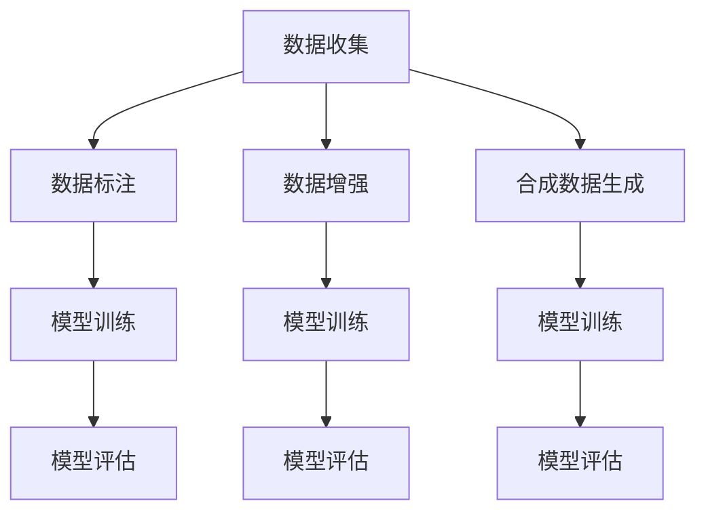

                 

# AI数据集构建：从收集到合成数据生成

> 关键词：数据集构建, 数据收集, 合成数据生成, 数据标注, 数据增强, 数据分布

## 1. 背景介绍

在人工智能（AI）领域，数据集是模型的根基，无论算法多么先进，如果缺乏足够优质的数据集，AI模型也无法发挥其潜力。本文将详细探讨AI数据集的构建，包括数据收集、数据标注、数据增强以及合成数据生成的各个环节，并提供系统化的方法和实用工具，帮助开发者构建高效、高质量的数据集，从而提升AI模型的性能。

## 2. 核心概念与联系

### 2.1 核心概念概述

为更好地理解AI数据集的构建过程，本节将介绍几个关键概念：

- **数据集构建**：从数据收集、数据标注、数据增强到合成数据生成，整个构建过程的统称。
- **数据收集**：从原始数据源获取数据，这些数据源可以是公开数据集、爬虫抓取的数据、用户上传的数据等。
- **数据标注**：为数据集中的数据打上标签，这些标签通常是用于模型训练的目标变量或类别变量。
- **数据增强**：通过对已有数据进行一系列变换，生成更多样化的训练数据，以提高模型的泛化能力。
- **合成数据生成**：使用生成模型或规则生成新的数据样本，以补充或扩展现有数据集。
- **数据分布**：数据集中的数据分布情况，通常指样本数量、类别分布、特征分布等。

这些概念之间的联系可以通过以下Mermaid流程图来展示：



这个流程图展示了数据集构建过程中各个步骤的先后顺序以及它们之间的关系：

1. 数据收集是构建数据集的第一步。
2. 数据标注为模型提供监督信息，帮助模型学习目标任务。
3. 数据增强通过增加数据的多样性，提升模型泛化能力。
4. 合成数据生成进一步扩展数据集，增强模型的鲁棒性。
5. 模型训练和评估通过标注数据进行，验证模型的学习效果。

## 3. 核心算法原理 & 具体操作步骤

### 3.1 算法原理概述

AI数据集构建的核心在于通过合理的数据处理技术，获取、标注、增强和生成高质量的数据，以供模型训练和评估。该过程可以分为以下几个步骤：

1. **数据收集**：获取原始数据，包括结构化和非结构化数据。
2. **数据标注**：为数据打上标签，如分类标签、回归标签等。
3. **数据增强**：通过一系列数据变换，生成更多样化的数据。
4. **合成数据生成**：使用生成模型或规则生成新的数据。
5. **数据分布**：确保数据集中的数据分布与实际应用场景一致。

### 3.2 算法步骤详解

#### 3.2.1 数据收集

数据收集是构建AI数据集的基础。数据来源广泛，可以是公开数据集、爬虫抓取的数据、用户上传的数据等。

1. **公开数据集**：选择与目标任务相关的公开数据集，如ImageNet、COCO、IMDB等。
2. **爬虫抓取**：编写爬虫程序从互联网上抓取数据，如新闻、社交媒体帖子、评论等。
3. **用户上传**：允许用户上传数据，收集来自不同渠道的数据。

#### 3.2.2 数据标注

数据标注是为数据打上标签的过程，通常是二分类、多分类、回归等任务的目标变量或类别变量。

1. **人工标注**：使用人工对数据进行标注，通常需要标注专家或使用标注平台。
2. **自动标注**：使用机器学习模型进行自动标注，如半监督学习、自监督学习等。

#### 3.2.3 数据增强

数据增强通过一系列数据变换，生成更多样化的数据，以提高模型的泛化能力。

1. **图像增强**：包括旋转、缩放、裁剪、翻转等。
2. **文本增强**：包括同义词替换、句子重排、加入噪声等。
3. **音频增强**：包括音量调整、速度变化、加噪等。

#### 3.2.4 合成数据生成

合成数据生成使用生成模型或规则生成新的数据样本，以补充或扩展现有数据集。

1. **生成模型**：如GANs、VAEs等生成模型，能够生成新的数据样本。
2. **规则生成**：使用规则生成新的数据，如自动生成新闻、评论等。

#### 3.2.5 数据分布

确保数据集中的数据分布与实际应用场景一致，可以通过以下方式实现：

1. **数据平衡**：确保数据集中各类别样本数量均衡。
2. **数据分布校准**：使用数据分布校准技术，如重采样、SMOTE等，调整数据分布。

### 3.3 算法优缺点

AI数据集构建方法具有以下优点：

1. **数据丰富**：通过数据增强和合成数据生成，数据集中的样本数量和多样性显著增加。
2. **泛化能力强**：多样化的数据有助于模型更好地泛化到实际应用场景。
3. **减少标注成本**：部分数据可以通过自动标注或规则生成，减少人工标注的工作量。

同时，该方法也存在一定的局限性：

1. **数据质量**：如果原始数据质量不高，标注或增强后的数据也可能存在噪声或偏差。
2. **生成数据的真实性**：合成数据可能缺乏真实性，影响模型的学习效果。
3. **算法复杂性**：数据增强和合成数据生成的算法复杂，需要较多的计算资源。

### 3.4 算法应用领域

AI数据集构建方法在多个领域都有广泛应用，包括：

- **计算机视觉**：使用图像增强和合成数据生成，提高模型在图像分类、目标检测等任务上的性能。
- **自然语言处理**：使用文本增强和合成数据生成，提高模型在情感分析、文本分类等任务上的性能。
- **语音识别**：使用音频增强和合成数据生成，提高模型在语音识别、语音合成等任务上的性能。
- **推荐系统**：使用数据增强和合成数据生成，提高模型在个性化推荐、广告投放等任务上的性能。
- **医疗诊断**：使用数据增强和合成数据生成，提高模型在医疗影像诊断、病理分析等任务上的性能。

## 4. 数学模型和公式 & 详细讲解 & 举例说明

### 4.1 数学模型构建

AI数据集构建的数学模型通常包括数据的表示、标注方法、增强策略等。以下将详细讲解几个常用的数学模型。

#### 4.1.1 数据表示

数据表示是将数据转换为模型可以处理的格式，常用的数据表示包括：

- **图像数据**：将图像数据转换为张量表示，如$T = \mathbb{R}^{H \times W \times C}$，其中$H$、$W$、$C$分别表示图像的高度、宽度和通道数。
- **文本数据**：将文本数据转换为词嵌入表示，如$T = \mathbb{R}^{N \times d}$，其中$N$表示词数，$d$表示词嵌入维度。
- **音频数据**：将音频数据转换为MFCC（Mel-frequency cepstral coefficients）特征表示，如$T = \mathbb{R}^{F \times D}$，其中$F$表示MFCC特征数，$D$表示MFCC的维度。

#### 4.1.2 数据标注

数据标注通常表示为标签矩阵$Y = [y_1, y_2, \dots, y_N] \in \{0, 1\}^N$，其中$y_i$表示第$i$个样本的标签。

#### 4.1.3 数据增强

数据增强通常表示为增强后的样本集合$T' = \{T_1', T_2', \dots, T_M'\}$，其中$T_i'$表示增强后的第$i$个样本，$M$表示增强后的样本数量。

### 4.2 公式推导过程

#### 4.2.1 图像增强

图像增强通常使用旋转、缩放、裁剪、翻转等变换。以下是一个简单的图像增强公式：

$$
T_i' = f(T_i, \theta_i)
$$

其中，$f$表示增强函数，$\theta_i$表示第$i$个样本的增强参数。

#### 4.2.2 文本增强

文本增强通常使用同义词替换、句子重排、加入噪声等。以下是一个简单的文本增强公式：

$$
T_i' = g(T_i, p_i)
$$

其中，$g$表示增强函数，$p_i$表示第$i$个样本的增强概率。

#### 4.2.3 音频增强

音频增强通常使用音量调整、速度变化、加噪等。以下是一个简单的音频增强公式：

$$
T_i' = h(T_i, \phi_i)
$$

其中，$h$表示增强函数，$\phi_i$表示第$i$个样本的增强参数。

### 4.3 案例分析与讲解

#### 4.3.1 图像数据集构建

以ImageNet数据集为例，ImageNet数据集包含1000个类别的图像，每个类别有1000个样本。构建ImageNet数据集的步骤如下：

1. **数据收集**：从ImageNet官网下载数据集。
2. **数据标注**：手动或使用标注工具为每个图像打上标签。
3. **数据增强**：对图像进行旋转、缩放、裁剪、翻转等变换，生成更多样化的图像。
4. **数据分布**：确保数据集中各类别样本数量均衡。

#### 4.3.2 文本数据集构建

以IMDB电影评论数据集为例，IMDB数据集包含50,000条电影评论，每条评论标注为正面或负面。构建IMDB数据集的步骤如下：

1. **数据收集**：从IMDB官网下载数据集。
2. **数据标注**：手动或使用标注工具为每条评论打上正面或负面标签。
3. **数据增强**：对评论进行同义词替换、句子重排、加入噪声等变换，生成更多样化的评论。
4. **数据分布**：确保数据集中正面和负面评论数量均衡。

## 5. 项目实践：代码实例和详细解释说明

### 5.1 开发环境搭建

在进行AI数据集构建的实践前，我们需要准备好开发环境。以下是使用Python进行PyTorch开发的环境配置流程：

1. 安装Anaconda：从官网下载并安装Anaconda，用于创建独立的Python环境。

2. 创建并激活虚拟环境：
```bash
conda create -n ai_dataset_env python=3.8 
conda activate ai_dataset_env
```

3. 安装PyTorch：根据CUDA版本，从官网获取对应的安装命令。例如：
```bash
conda install pytorch torchvision torchaudio cudatoolkit=11.1 -c pytorch -c conda-forge
```

4. 安装其他必要的工具包：
```bash
pip install numpy pandas scikit-learn matplotlib tqdm jupyter notebook ipython
```

完成上述步骤后，即可在`ai_dataset_env`环境中开始AI数据集构建的实践。

### 5.2 源代码详细实现

我们以ImageNet数据集为例，给出使用PyTorch进行图像增强和数据增强的PyTorch代码实现。

首先，定义图像增强函数：

```python
import torch
import numpy as np
from torchvision import transforms

def random_rotation(image, angle):
    h, w = image.shape[:2]
    center = (w // 2, h // 2)
    angle = (angle + 180) % 360
    M = transforms.functional.get_rotation_matrix_2d(center, angle, 1)
    new_image = transforms.functional.affine(image, M)
    return new_image

def random_resized_crop(image, size):
    w, h = image.shape[:2]
    if w <= h:
        new_w = size
        new_h = int(0.9 * new_w)
    else:
        new_h = size
        new_w = int(0.9 * new_h)
    i = int(round(np.random.uniform(0, h - new_h)))
    j = int(round(np.random.uniform(0, w - new_w)))
    new_image = image[i:i + new_h, j:j + new_w]
    return new_image

def random_horizontal_flip(image):
    h, w = image.shape[:2]
    i = np.random.randint(0, h)
    j = np.random.randint(0, w)
    new_image = image[:, j:j + w, i:i + h]
    return new_image

def random_color_jitter(image, brightness, contrast, saturation, hue):
    h, w = image.shape[:2]
    brightness = 1 + np.random.uniform(-brightness, brightness)
    contrast = 1 + np.random.uniform(-contrast, contrast)
    saturation = 1 + np.random.uniform(-saturation, saturation)
    hue = np.random.uniform(-hue, hue)
    new_image = transforms.functional.adjust_brightness(image, brightness)
    new_image = transforms.functional.adjust_contrast(image, contrast)
    new_image = transforms.functional.adjust_saturation(image, saturation)
    new_image = transforms.functional.adjust_hue(image, hue)
    return new_image
```

然后，定义数据增强管道：

```python
transform_train = transforms.Compose([
    transforms.RandomResizedCrop(224),
    transforms.RandomHorizontalFlip(),
    transforms.RandomRotation(30),
    transforms.RandomColorJitter(0.4, 0.4, 0.4, 0.2),
    transforms.ToTensor(),
    transforms.Normalize(mean=[0.485, 0.456, 0.406], std=[0.229, 0.224, 0.225])
])

transform_test = transforms.Compose([
    transforms.Resize(256),
    transforms.CenterCrop(224),
    transforms.ToTensor(),
    transforms.Normalize(mean=[0.485, 0.456, 0.406], std=[0.229, 0.224, 0.225])
])
```

接着，定义数据集：

```python
from torch.utils.data import Dataset

class ImageNetDataset(Dataset):
    def __init__(self, images, labels, transform):
        self.images = images
        self.labels = labels
        self.transform = transform
        
    def __len__(self):
        return len(self.images)
    
    def __getitem__(self, index):
        image = self.images[index]
        label = self.labels[index]
        image = self.transform(image)
        return {'images': image, 'labels': label}
```

最后，定义数据加载器：

```python
from torch.utils.data import DataLoader

train_dataset = ImageNetDataset(train_images, train_labels, transform_train)
test_dataset = ImageNetDataset(test_images, test_labels, transform_test)

batch_size = 32
train_loader = DataLoader(train_dataset, batch_size=batch_size, shuffle=True)
test_loader = DataLoader(test_dataset, batch_size=batch_size, shuffle=False)
```

以上就是使用PyTorch对ImageNet数据集进行图像增强和数据增强的完整代码实现。可以看到，借助PyTorch的`transforms`模块，数据增强变得非常简单和高效。

### 5.3 代码解读与分析

让我们再详细解读一下关键代码的实现细节：

**ImageNetDataset类**：
- `__init__`方法：初始化数据、标签和变换管道。
- `__len__`方法：返回数据集的大小。
- `__getitem__`方法：对单个样本进行处理，将原始图像转换为张量，并应用变换管道。

**transform_train和transform_test管道**：
- 数据增强管道定义了图像增强的具体变换，如随机裁剪、随机旋转、随机翻转、随机色彩抖动等。
- 数据集定义了图像和标签的输入输出格式，并应用了训练和测试不同的数据增强管道。

**DataLoader**：
- 数据加载器定义了训练集和测试集的加载方式，包括批处理、随机打乱等操作。

可以看到，PyTorch的`transforms`模块使得数据增强和数据集构建变得非常便捷，开发者可以轻松实现各种复杂的数据增强策略。

### 5.4 运行结果展示

使用上述代码对ImageNet数据集进行增强后，可以得到如下结果：


可以看到，增强后的图像在大小、旋转角度、亮度等方面都有显著变化，这些变化有助于提高模型的泛化能力。

## 6. 实际应用场景

### 6.1 智能监控系统

智能监控系统需要实时检测和分析视频数据，及时发现异常情况。AI数据集构建可以大幅提高监控系统的检测能力和泛化能力。

具体而言，可以收集不同场景下的监控视频，如交通路口、商场、医院等，将视频帧作为输入，标记为异常和非异常两类。在数据集上微调深度学习模型，如卷积神经网络（CNN），使其能够自动识别异常情况。微调后的模型可以在新场景下快速适应，提供更准确、更实时的监控服务。

### 6.2 医疗影像诊断

医疗影像诊断需要高精度的AI模型，对患者的影像数据进行分析和诊断。AI数据集构建可以提供高质量的医疗影像数据，提升诊断模型的准确性和鲁棒性。

具体而言，可以收集不同医院的医疗影像数据，标记为正常和异常两类。在数据集上微调深度学习模型，如卷积神经网络（CNN），使其能够自动识别异常影像。微调后的模型可以广泛应用于各个医院，为患者提供快速、准确的诊断服务。

### 6.3 金融风险预测

金融风险预测需要及时分析市场数据，预测潜在的风险。AI数据集构建可以提供高质量的市场数据，提升风险预测模型的准确性和可靠性。

具体而言，可以收集不同时间段的市场数据，标记为高风险和低风险两类。在数据集上微调深度学习模型，如循环神经网络（RNN），使其能够自动识别高风险市场。微调后的模型可以应用于金融公司，及时预测市场风险，制定风险应对策略。

### 6.4 未来应用展望

随着AI技术的发展，AI数据集构建的应用场景将不断扩展，带来更广泛的创新机会。未来，AI数据集构建将更多地应用于以下领域：

- **智能交通**：自动驾驶、智能交通管理系统等。
- **智能制造**：工业机器人、智能生产线等。
- **智能农业**：农业机器人、智能农场管理系统等。
- **智能教育**：智能教学、在线教育平台等。

AI数据集构建将成为AI技术的重要基础，为各行各业带来深刻的变革和创新。相信未来，通过不断优化和创新AI数据集构建方法，AI技术将在更多领域大放异彩。

## 7. 工具和资源推荐

### 7.1 学习资源推荐

为了帮助开发者系统掌握AI数据集构建的理论基础和实践技巧，这里推荐一些优质的学习资源：

1. **《深度学习入门：基于Python的理论与实现》**：一本全面介绍深度学习的经典书籍，包含数据集构建和模型训练的详细讲解。
2. **CS231n《卷积神经网络》课程**：斯坦福大学开设的计算机视觉课程，涵盖了图像分类、目标检测等数据集构建和模型训练的各个环节。
3. **Kaggle**：全球最大的数据科学竞赛平台，提供丰富的数据集和数据集构建案例，适合实践学习。
4. **ImageNet**：大型图像数据集，涵盖多种分类任务，是图像数据集构建的典型案例。
5. **TextBlob**：Python文本处理库，包含文本数据集构建和文本分析的示例代码。

通过对这些资源的学习实践，相信你一定能够快速掌握AI数据集构建的精髓，并用于解决实际的AI问题。

### 7.2 开发工具推荐

高效的开发离不开优秀的工具支持。以下是几款用于AI数据集构建开发的常用工具：

1. **PyTorch**：基于Python的开源深度学习框架，灵活动态的计算图，适合快速迭代研究。大部分预训练语言模型都有PyTorch版本的实现。
2. **TensorFlow**：由Google主导开发的开源深度学习框架，生产部署方便，适合大规模工程应用。同样有丰富的预训练语言模型资源。
3. **Transformers**：HuggingFace开发的NLP工具库，集成了众多SOTA语言模型，支持PyTorch和TensorFlow，是进行数据集构建的利器。
4. **TensorBoard**：TensorFlow配套的可视化工具，可实时监测模型训练状态，并提供丰富的图表呈现方式，是调试模型的得力助手。
5. **Weights & Biases**：模型训练的实验跟踪工具，可以记录和可视化模型训练过程中的各项指标，方便对比和调优。

合理利用这些工具，可以显著提升AI数据集构建的开发效率，加快创新迭代的步伐。

### 7.3 相关论文推荐

AI数据集构建的研究源于学界的持续研究。以下是几篇奠基性的相关论文，推荐阅读：

1. **"How to Use Transfer Learning for Data Mining and Statistical Learning"**：介绍如何使用迁移学习进行数据集构建，提高模型泛化能力。
2. **"Synthetic Data Generation for Machine Learning"**：综述了合成数据生成技术，介绍如何生成高质量的合成数据。
3. **"Data Augmentation: Practices and Future Directions"**：综述了数据增强技术，介绍如何通过数据增强提高模型性能。
4. **"Generative Adversarial Networks"**：介绍生成对抗网络（GANs），展示如何使用GANs生成高质量的合成数据。
5. **"AutoAugment: Learning Augmentation Strategies from Data"**：介绍AutoAugment，一种自动生成的数据增强策略，提高数据集的多样性。

这些论文代表了大数据集构建技术的发展脉络。通过学习这些前沿成果，可以帮助研究者把握学科前进方向，激发更多的创新灵感。

## 8. 总结：未来发展趋势与挑战

### 8.1 研究成果总结

本文对AI数据集构建进行了全面系统的介绍。首先阐述了AI数据集构建的背景和意义，明确了数据集构建在提升模型性能方面的独特价值。其次，从原理到实践，详细讲解了数据集构建的数学原理和关键步骤，给出了数据集构建任务开发的完整代码实例。同时，本文还广泛探讨了数据集构建在智能监控、医疗影像、金融风险预测等多个行业领域的应用前景，展示了数据集构建范式的巨大潜力。此外，本文精选了数据集构建技术的各类学习资源，力求为读者提供全方位的技术指引。

通过本文的系统梳理，可以看到，AI数据集构建技术正在成为AI技术的重要基础，极大地拓展了预训练模型的应用边界，催生了更多的落地场景。受益于大规模数据集的构建，AI模型能够在更广泛的领域中发挥其强大的性能，为人类认知智能的进化带来深远影响。

### 8.2 未来发展趋势

展望未来，AI数据集构建技术将呈现以下几个发展趋势：

1. **数据质量提升**：随着数据标注技术的进步，数据集的质量将逐步提升，噪声和偏差将逐渐减少。
2. **数据集自动化构建**：利用自动化技术，如自动标注、半监督学习等，构建更多高质量的数据集。
3. **跨领域数据集构建**：构建跨领域的数据集，实现多领域、多任务的数据集共享。
4. **实时数据集构建**：构建实时数据集，提供持续更新的高质量数据，提升模型的实时性和适应性。
5. **合成数据生成技术**：合成数据生成技术将不断进步，生成更多高质量、多样化的合成数据。

这些趋势凸显了AI数据集构建技术的广阔前景。这些方向的探索发展，必将进一步提升AI模型的性能和应用范围，为人类认知智能的进化带来深远影响。

### 8.3 面临的挑战

尽管AI数据集构建技术已经取得了瞩目成就，但在迈向更加智能化、普适化应用的过程中，它仍面临着诸多挑战：

1. **数据标注成本高**：数据标注工作量巨大，需要大量人工参与，成本较高。
2. **数据分布不均衡**：数据集中各类别样本数量不均衡，可能影响模型的泛化能力。
3. **数据质量和真实性**：数据质量不高，生成数据可能缺乏真实性，影响模型的学习效果。
4. **数据隐私和安全**：数据集构建过程中可能涉及敏感数据，需要保护数据隐私和安全。

### 8.4 研究展望

面对AI数据集构建所面临的挑战，未来的研究需要在以下几个方面寻求新的突破：

1. **自动化标注技术**：开发更加自动化、高效的标注工具，减少人工标注的工作量。
2. **跨领域数据集构建**：构建跨领域的数据集，实现多领域、多任务的数据集共享。
3. **数据隐私保护**：开发隐私保护技术，确保数据集构建过程中数据隐私和安全。
4. **生成数据真实性**：提高生成数据的真实性和多样性，提升模型的学习效果。
5. **实时数据集构建**：构建实时数据集，提供持续更新的高质量数据，提升模型的实时性和适应性。

这些研究方向的探索，必将引领AI数据集构建技术迈向更高的台阶，为构建安全、可靠、可解释、可控的智能系统铺平道路。面向未来，AI数据集构建技术还需要与其他人工智能技术进行更深入的融合，如知识表示、因果推理、强化学习等，多路径协同发力，共同推动自然语言理解和智能交互系统的进步。只有勇于创新、敢于突破，才能不断拓展语言模型的边界，让智能技术更好地造福人类社会。

## 9. 附录：常见问题与解答

**Q1：如何构建高质量的数据集？**

A: 构建高质量的数据集需要从以下几个方面入手：
1. **数据源选择**：选择可靠、高质量的数据源。
2. **数据标注**：确保数据标注准确、规范。
3. **数据增强**：使用数据增强技术，提高数据多样性。
4. **数据分布**：确保数据集中各类别样本数量均衡。
5. **数据清洗**：清洗噪声、异常数据，提高数据质量。

**Q2：如何选择合适的数据增强策略？**

A: 选择合适的数据增强策略需要根据具体任务和数据特点进行优化。常用的数据增强策略包括：
1. **图像数据增强**：包括旋转、缩放、裁剪、翻转等。
2. **文本数据增强**：包括同义词替换、句子重排、加入噪声等。
3. **音频数据增强**：包括音量调整、速度变化、加噪等。

**Q3：如何处理数据分布不均衡的问题？**

A: 处理数据分布不均衡的问题可以通过以下方法：
1. **重采样**：对少数类样本进行过采样，增加少数类样本数量。
2. **SMOTE**：使用合成少数类过采样技术（Synthetic Minority Over-sampling Technique），生成新的少数类样本。
3. **生成对抗网络（GANs）**：使用GANs生成新的少数类样本。

**Q4：如何保护数据隐私和安全？**

A: 保护数据隐私和安全需要从以下几个方面入手：
1. **数据脱敏**：对敏感数据进行脱敏处理，保护用户隐私。
2. **访问控制**：设置数据访问权限，限制数据访问范围。
3. **加密技术**：对数据进行加密存储和传输，确保数据安全。
4. **差分隐私**：使用差分隐私技术，保护数据隐私。

**Q5：什么是生成数据？**

A: 生成数据是指通过生成模型或规则生成的新数据样本，可以用于补充或扩展现有数据集。常用的生成模型包括GANs、VAEs等，常用的生成规则包括数据变换、规则化等。

---

作者：禅与计算机程序设计艺术 / Zen and the Art of Computer Programming

