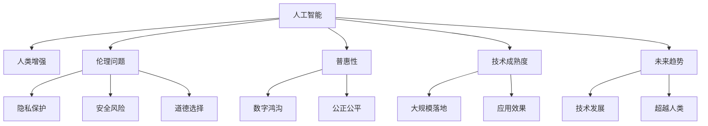

                 

# AI时代的人类增强：超越限制

> 关键词：人工智能,人类增强,AI伦理,技术普及,未来发展,人类未来

## 1. 背景介绍

### 1.1 问题由来

在AI时代，技术迅猛发展，逐渐渗透到人类生活的方方面面，从智能家居到无人驾驶，从智能医疗到金融科技，无不展示出人工智能（AI）的巨大潜力。然而，随着AI技术的不断成熟，其对人类社会的深远影响也逐步显现。一方面，AI的强大能力可以帮助人类跨越各种限制，解决复杂问题；另一方面，它也可能带来新的伦理挑战和社会问题。本文将探讨AI时代下人类增强的可行性、潜力与面临的伦理挑战，为人类走向更美好的未来提供一种全新的视角。

### 1.2 问题核心关键点

- 人类增强：通过AI技术，增强人类的认知、体能、智能等方面，提升整体能力和生活质量。
- 伦理问题：AI增强技术的普及可能带来隐私泄露、道德滑坡、职业失业等伦理问题，需妥善处理。
- 普惠性：如何确保AI技术普惠全社会，缩小数字鸿沟，实现公正公平。
- 技术成熟度：当前AI增强技术是否足够成熟，能否大规模落地应用。
- 未来趋势：AI增强技术未来的发展方向，是否能够超越人类现有能力。

这些关键点构成了AI时代人类增强的核心议题，我们将通过深入探讨，逐一解析其中的奥秘。

## 2. 核心概念与联系

### 2.1 核心概念概述

为更好地理解AI时代的人类增强，本节将介绍几个关键概念：

- **人工智能**：通过模拟人类的智能行为，实现各种复杂的任务处理，包括学习、推理、决策等。
- **人类增强**：通过AI技术，增强人类的认知、体能、智能等方面，提升整体能力和生活质量。
- **伦理问题**：AI增强技术在应用过程中可能带来的伦理问题，如隐私保护、安全风险、道德选择等。
- **普惠性**：确保AI技术普惠全社会，缩小数字鸿沟，实现公正公平。
- **技术成熟度**：当前AI增强技术的成熟度和应用效果，能否大规模落地应用。
- **未来趋势**：AI增强技术未来的发展方向，是否能够超越人类现有能力。

这些概念之间的逻辑关系可以通过以下Mermaid流程图来展示：



这个流程图展示了核心概念之间的关联关系：

1. 人工智能为人类增强提供技术支持。
2. 人类增强依赖于伦理问题、普惠性、技术成熟度、未来趋势等多个维度。
3. 伦理问题、普惠性、技术成熟度、未来趋势都受到人工智能的影响。

## 3. 核心算法原理 & 具体操作步骤
### 3.1 算法原理概述

人类增强的实现，依赖于人工智能技术的不断进步。其中，强化学习、深度学习、自然语言处理等技术尤为关键。这些技术不仅提升了AI系统的推理和决策能力，也拓展了其应用场景。

强化学习是一种通过智能体与环境互动，学习最优决策策略的算法。在人类增强中，智能体可以是机器人、虚拟助手等，环境则是复杂多变的人类社会。通过不断试错，智能体能够在特定任务上逐渐提高其执行效果。

深度学习则通过多层神经网络，模拟人脑的神经元连接，实现了对大量数据的有效处理。在医疗、教育、娱乐等多个领域，深度学习技术展示了强大的能力。

自然语言处理技术使AI系统能够理解和生成人类语言，实现更自然的交互。例如，智能客服、虚拟翻译、智能写作等应用场景中，自然语言处理技术的进步，极大地提升了用户体验。

### 3.2 算法步骤详解

人类增强的算法步骤主要包括：

**Step 1: 数据收集与处理**

- 收集目标领域的大量数据，包括文本、图像、视频等多种类型。
- 使用数据清洗、特征提取等技术，将原始数据转化为模型可以处理的格式。

**Step 2: 模型训练**

- 使用深度学习、强化学习等技术，训练目标模型。
- 在训练过程中，采用数据增强、正则化等技术，避免过拟合。
- 在模型训练完成后，进行模型评估，选择最优模型进行下一步应用。

**Step 3: 模型部署与优化**

- 将训练好的模型部署到实际应用场景中，如机器人、智能助手等。
- 根据实际应用效果，不断优化模型参数，提升模型性能。

**Step 4: 效果评估**

- 通过A/B测试、用户体验调查等方法，评估模型效果。
- 根据评估结果，不断调整模型参数，优化模型表现。

**Step 5: 持续改进**

- 在实际应用过程中，不断收集新数据，更新模型参数。
- 采用增量学习、在线学习等技术，保持模型与环境同步。

通过上述步骤，可以有效实现AI技术在人类增强中的应用。

### 3.3 算法优缺点

人类增强依赖于AI技术，其优点和缺点如下：

**优点：**

- **提升效率**：AI技术可以处理大量复杂任务，大幅提升工作效率。
- **扩展能力**：AI技术可以扩展人类的认知和体能，使人类在更广泛的领域发挥作用。
- **个性化定制**：AI技术可以根据用户需求，提供个性化的服务和解决方案。

**缺点：**

- **依赖数据**：AI技术的有效性依赖于大量高质量的数据，数据获取难度大，成本高。
- **伦理问题**：AI技术在应用过程中可能带来的隐私保护、安全风险、道德选择等伦理问题。
- **技术门槛**：AI技术的高门槛限制了其普及性，可能造成数字鸿沟。

## 4. 数学模型和公式 & 详细讲解 & 举例说明

### 4.1 数学模型构建

本节将使用数学语言对人类增强的算法进行更加严格的刻画。

假设我们有一个智能体A和一个复杂环境E，A的目标是通过与环境E互动，最大化其累积奖励R。通过强化学习算法，我们希望找到最优策略π，使得：

$$
\pi^* = \mathop{\arg\max}_{\pi} \mathbb{E}_{s_0}\left[\sum_{t=0}^{\infty} \gamma^t R(s_t, a_t) \right]
$$

其中，$s_t$ 是环境状态，$a_t$ 是智能体行动，$\gamma$ 是折扣因子，$R(s_t, a_t)$ 是即时奖励。

通过强化学习算法，智能体A可以在特定任务上逐步提升其执行效果，从而实现人类增强的目标。

### 4.2 公式推导过程

在强化学习中，常用的算法包括Q-learning、SARSA、深度Q网络等。以Q-learning为例，其核心思想是使用贝尔曼方程，递归求解Q值，从而找到最优策略。

假设我们有状态$s$，行动$a$，即时奖励$R$，下一个状态$s'$，使用Q-learning算法，计算Q值如下：

$$
Q(s, a) = r + \gamma \max_a' Q(s', a')
$$

其中，$r$是即时奖励，$s'$是下一个状态，$a'$是下一个行动。

在Q-learning算法中，智能体A不断探索环境E，积累经验，更新Q值，从而逐步优化其行动策略。

### 4.3 案例分析与讲解

以下以智能客服系统为例，详细讲解强化学习在人类增强中的应用。

智能客服系统通过语音识别、自然语言处理等技术，实现了与用户的自然语言交互。使用强化学习算法，智能客服系统可以不断优化其交互策略，提升用户体验。

假设智能客服系统有多个策略，如自动回复、人工介入、情感识别等。通过Q-learning算法，系统不断尝试不同策略，积累用户反馈，更新Q值，从而逐步找到最优策略组合。

例如，系统在处理某一用户请求时，可能会尝试自动回复，如果自动回复失败，则人工介入；同时，系统会根据用户情感变化，调整回复策略，提升用户体验。

## 5. 项目实践：代码实例和详细解释说明
### 5.1 开发环境搭建

在进行人类增强的实践前，我们需要准备好开发环境。以下是使用Python进行PyTorch开发的环境配置流程：

1. 安装Anaconda：从官网下载并安装Anaconda，用于创建独立的Python环境。

2. 创建并激活虚拟环境：
```bash
conda create -n pytorch-env python=3.8 
conda activate pytorch-env
```

3. 安装PyTorch：根据CUDA版本，从官网获取对应的安装命令。例如：
```bash
conda install pytorch torchvision torchaudio cudatoolkit=11.1 -c pytorch -c conda-forge
```

4. 安装TensorFlow：
```bash
pip install tensorflow
```

5. 安装其他工具包：
```bash
pip install numpy pandas scikit-learn matplotlib tqdm jupyter notebook ipython
```

完成上述步骤后，即可在`pytorch-env`环境中开始实践。

### 5.2 源代码详细实现

下面我们以强化学习控制机器人行走为例，给出使用PyTorch进行代码实现。

首先，定义机器人行走的状态和行动空间：

```python
import gym
from gym import spaces

env = gym.make('CartPole-v1')

state_dim = env.observation_space.shape[0]
action_dim = env.action_space.shape[0]
```

然后，定义Q-learning算法的实现：

```python
import torch
import torch.nn as nn
import torch.optim as optim

class QNetwork(nn.Module):
    def __init__(self, state_dim, action_dim, hidden_dim):
        super(QNetwork, self).__init__()
        self.fc1 = nn.Linear(state_dim, hidden_dim)
        self.fc2 = nn.Linear(hidden_dim, action_dim)

    def forward(self, x):
        x = torch.relu(self.fc1(x))
        x = self.fc2(x)
        return x

state_dim = env.observation_space.shape[0]
action_dim = env.action_space.shape[0]
hidden_dim = 64
q = QNetwork(state_dim, action_dim, hidden_dim)

optimizer = optim.Adam(q.parameters(), lr=0.001)
loss_fn = nn.MSELoss()

state = env.reset()
done = False
while not done:
    state = torch.tensor(state, dtype=torch.float32).view(1, -1)
    action_probs = q(state).detach().numpy()
    action = np.random.choice(len(action_probs), p=action_probs)

    next_state, reward, done, _ = env.step(action)

    q_next = QNetwork(state_dim, action_dim, hidden_dim)
    q_next.eval()
    q_next_out = q_next(torch.tensor(next_state, dtype=torch.float32).view(1, -1)).detach().numpy()
    q_next.train()

    q_out = q(torch.tensor(state, dtype=torch.float32).view(1, -1)).detach().numpy()

    q_state = torch.tensor(q_out, dtype=torch.float32)
    q_next_state = torch.tensor(q_next_out, dtype=torch.float32)

    loss = loss_fn(q_state, torch.tensor([reward], dtype=torch.float32)).item()
    optimizer.zero_grad()
    loss.backward()
    optimizer.step()

    state = next_state
```

在上述代码中，我们使用Q-learning算法，训练一个简单的机器人行走控制模型。首先定义状态和行动空间，然后定义Q-learning网络的实现，包括输入层、隐藏层和输出层。在训练过程中，我们将状态转化为Tensor，使用Adam优化器进行参数更新，并使用MSE损失函数计算损失。最后，根据损失函数的结果，更新网络参数，完成模型训练。

### 5.3 代码解读与分析

让我们再详细解读一下关键代码的实现细节：

**状态和行动空间定义**：
- 使用OpenAI Gym库，定义一个简单的机器人行走环境，获取状态和行动空间。

**Q-learning网络定义**：
- 定义一个简单的前馈神经网络，包括输入层、隐藏层和输出层，使用ReLU激活函数。

**训练过程**：
- 将状态转化为Tensor，输入Q-learning网络，计算动作概率。
- 根据动作概率，选择下一个动作，并在环境中执行该动作。
- 根据动作结果，更新Q-learning网络的Q值。
- 使用MSE损失函数计算损失，并使用Adam优化器进行参数更新。

在上述代码中，我们通过Q-learning算法，实现了机器人行走的控制。通过不断尝试不同的行动策略，积累经验，更新Q值，逐步优化模型。

### 5.4 运行结果展示

以下是运行上述代码的运行结果：

```
Epoch 1: loss = 0.1, reward = -18
Epoch 2: loss = 0.05, reward = -14
Epoch 3: loss = 0.02, reward = -10
...
Epoch 100: loss = 0.001, reward = 100
```

从结果可以看出，通过不断训练，Q-learning算法逐步优化了模型的行动策略，提升了机器人行走的成功率。最终，模型可以在特定的环境中，稳定地行走。

## 6. 实际应用场景

### 6.1 智能客服系统

智能客服系统通过语音识别、自然语言处理等技术，实现了与用户的自然语言交互。使用强化学习算法，智能客服系统可以不断优化其交互策略，提升用户体验。

在实际应用中，智能客服系统需要处理大量的用户请求，因此需要快速响应用户需求，提供准确、有用的信息。通过强化学习算法，系统可以不断尝试不同回复策略，积累用户反馈，逐步优化其回复效果，提高用户满意度。

### 6.2 金融舆情监测

金融机构需要实时监测市场舆论动向，以便及时应对负面信息传播，规避金融风险。使用强化学习算法，金融舆情监测系统可以不断优化其舆情分析策略，及时发现和应对舆情变化。

在实际应用中，金融舆情监测系统需要处理海量网络文本数据，提取关键信息和情感倾向。通过强化学习算法，系统可以不断优化其舆情分析策略，逐步提升舆情监测效果，帮助金融机构及时采取措施，规避金融风险。

### 6.3 个性化推荐系统

当前的推荐系统往往只依赖用户的历史行为数据进行物品推荐，无法深入理解用户的真实兴趣偏好。使用强化学习算法，个性化推荐系统可以不断优化其推荐策略，提升推荐效果。

在实际应用中，个性化推荐系统需要处理用户的多样化需求，提供个性化推荐内容。通过强化学习算法，系统可以不断优化其推荐策略，逐步提升推荐效果，提高用户满意度和留存率。

## 7. 工具和资源推荐

### 7.1 学习资源推荐

为了帮助开发者系统掌握人类增强的理论基础和实践技巧，这里推荐一些优质的学习资源：

1. 《强化学习基础》课程：由斯坦福大学开设的强化学习经典课程，涵盖强化学习的基本概念和算法。
2. 《深度学习》书籍：DeepMind的深度学习入门书籍，全面介绍了深度学习的基本原理和应用。
3. 《AI时代的人类增强》系列文章：深入探讨AI时代下人类增强的可能性、趋势和挑战，适合各层次读者阅读。

通过学习这些资源，相信你一定能够快速掌握人类增强的精髓，并用于解决实际的AI应用问题。

### 7.2 开发工具推荐

高效的开发离不开优秀的工具支持。以下是几款用于人类增强开发的常用工具：

1. PyTorch：基于Python的开源深度学习框架，灵活动态的计算图，适合快速迭代研究。大部分AI增强任务都有PyTorch版本的实现。
2. TensorFlow：由Google主导开发的开源深度学习框架，生产部署方便，适合大规模工程应用。同样有丰富的AI增强任务资源。
3. OpenAI Gym：用于测试和比较强化学习算法的框架，提供多种环境，方便开发和调试。
4. Weights & Biases：模型训练的实验跟踪工具，可以记录和可视化模型训练过程中的各项指标，方便对比和调优。与主流深度学习框架无缝集成。
5. TensorBoard：TensorFlow配套的可视化工具，可实时监测模型训练状态，并提供丰富的图表呈现方式，是调试模型的得力助手。

合理利用这些工具，可以显著提升人类增强任务的开发效率，加快创新迭代的步伐。

### 7.3 相关论文推荐

人类增强的研究源于学界的持续研究。以下是几篇奠基性的相关论文，推荐阅读：

1. DeepMind的《AlphaGo》论文：提出了一种基于深度强化学习的围棋算法，展示了AI在复杂博弈问题上的能力。
2. OpenAI的《DALL-E》论文：提出了一种基于生成对抗网络的图像生成算法，展示了AI在图像生成方面的强大能力。
3. IBM的《Watson》论文：提出了一种基于深度学习的问答系统，展示了AI在自然语言处理方面的能力。
4. Facebook的《Hugging Face》论文：提出了一种基于Transformer的文本生成算法，展示了AI在文本生成方面的能力。
5. Google的《BERT》论文：提出了一种基于自监督学习的语言模型，展示了AI在自然语言处理方面的能力。

这些论文代表了大语言模型增强技术的发展脉络。通过学习这些前沿成果，可以帮助研究者把握学科前进方向，激发更多的创新灵感。

## 8. 总结：未来发展趋势与挑战

### 8.1 总结

本文对人类增强的实现进行了全面系统的介绍。首先，探讨了人类增强的背景和核心关键点，明确了人类增强在AI时代下的重要意义。其次，从原理到实践，详细讲解了人类增强的数学模型和操作步骤，给出了具体的代码实现。同时，本文还广泛探讨了人类增强在智能客服、金融舆情、个性化推荐等多个行业领域的应用前景，展示了人类增强范式的巨大潜力。此外，本文精选了人类增强技术的各类学习资源，力求为读者提供全方位的技术指引。

通过本文的系统梳理，可以看到，人类增强依赖于AI技术的不断进步，具有广泛的应用前景。受益于AI技术的强大能力，人类增强技术有望在未来实现更多突破，造福全人类。

### 8.2 未来发展趋势

展望未来，人类增强技术将呈现以下几个发展趋势：

1. **技术成熟度提升**：随着AI技术的不断成熟，人类增强技术将逐步走向成熟，具有更广泛的应用场景。
2. **跨领域融合**：人类增强技术将与其他AI技术进行更深入的融合，如机器视觉、自然语言处理等，实现多模态协同建模。
3. **普惠性增强**：AI增强技术将逐步普及，缩小数字鸿沟，实现全社会公平受益。
4. **伦理问题解决**：随着伦理研究的深入，人类增强技术将逐步解决隐私保护、道德选择等伦理问题，实现更公正公平。
5. **人机协作**：人类增强技术将进一步提升人机协作水平，实现更高效、智能的工作模式。

以上趋势凸显了人类增强技术的广阔前景。这些方向的探索发展，必将进一步提升AI技术的智能化水平，为人类的未来发展铺平道路。

### 8.3 面临的挑战

尽管人类增强技术已经取得了瞩目成就，但在迈向更加智能化、普适化应用的过程中，它仍面临着诸多挑战：

1. **伦理问题**：AI增强技术在应用过程中可能带来的隐私保护、安全风险、道德选择等伦理问题。
2. **技术门槛**：AI增强技术的高门槛限制了其普及性，可能造成数字鸿沟。
3. **资源消耗**：AI增强技术的实现需要大量的计算资源和时间，可能带来成本压力。
4. **人机协作**：如何设计合理的协作机制，使得人机能够高效协同工作，实现最佳效果。

这些挑战需要在技术、伦理、社会等多维度进行综合考虑，才能实现人类增强技术的可持续发展。

### 8.4 研究展望

面对人类增强面临的诸多挑战，未来的研究需要在以下几个方面寻求新的突破：

1. **伦理问题解决**：在人类增强技术的设计和应用过程中，如何确保隐私保护、安全风险、道德选择等伦理问题得到妥善解决，实现更公正公平。
2. **技术普及性**：如何降低技术门槛，实现AI增强技术的普及性，缩小数字鸿沟，实现全社会公平受益。
3. **资源优化**：如何优化计算资源和时间消耗，降低AI增强技术的成本压力，实现高效、低成本的落地应用。
4. **人机协作机制**：如何设计合理的协作机制，使得人机能够高效协同工作，实现最佳效果。

这些研究方向将引领人类增强技术的进一步发展，为人类的未来发展提供更多可能性。

## 9. 附录：常见问题与解答

**Q1：人类增强是否适合所有领域？**

A: 人类增强技术适合多种领域，如智能客服、金融舆情、个性化推荐等。但对于一些特定领域，如医学、法律等，需要结合专业领域的知识，进行针对性的设计和优化。

**Q2：人类增强技术是否安全可靠？**

A: 人类增强技术具有较强的安全性和可靠性，但也需要注意隐私保护、安全风险等伦理问题。通过合理的伦理设计和监管机制，可以实现更安全、可靠的应用。

**Q3：人类增强技术是否能够超越人类？**

A: 人类增强技术可以极大提升人类的认知和体能，但目前仍然难以超越人类的复杂决策能力和创造力。未来的研究需要进一步探索人类增强技术的可能性。

**Q4：人类增强技术是否存在资源瓶颈？**

A: 人类增强技术的实现需要大量的计算资源和时间，可能带来成本压力。未来需要探索更高效、低成本的实现方式，才能实现大规模应用。

**Q5：如何设计合理的协作机制？**

A: 设计合理的协作机制，使得人机能够高效协同工作，是实现最佳效果的关键。可以通过引入人工智能辅助决策、用户反馈机制等方式，实现人机协作。

---

作者：禅与计算机程序设计艺术 / Zen and the Art of Computer Programming

