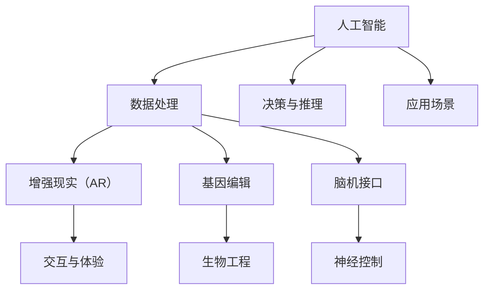

                 

# AI时代的人类增强：道德考虑与身体增强的未来发展机遇分析

> 关键词：人工智能，人类增强，道德伦理，身体增强，未来发展

## 1. 背景介绍

随着科技的飞速发展，人工智能（AI）逐渐成为推动社会进步的重要力量。在AI技术的加持下，人类在各个领域的能力得到了显著增强，从信息获取、决策支持到医疗健康、教育培训，AI带来的便利和效益不言而喻。然而，AI的广泛应用也带来了新的挑战和道德问题，特别是关于身体增强的讨论，逐渐成为公众关注的焦点。

### 1.1 问题由来

身体增强技术（Physical Enhancement Technologies），如基因编辑、脑机接口、增强现实设备等，通过科技手段提升人类的生理能力和认知功能。这类技术在医疗、运动、娱乐等领域展现出巨大潜力，但同时也引发了一系列伦理道德问题。如何确保这些技术的安全、公平和负责任使用，成为了科技界和公众共同关心的课题。

### 1.2 问题核心关键点

1. **技术基础**：
   - 基因编辑技术：CRISPR等基因编辑技术能够精准修改生物基因，但可能带来基因突变和伦理问题。
   - 脑机接口：通过直接与大脑互动，实现神经信号解码和反馈控制，带来认知增强和新的交互方式。
   - 增强现实（AR）设备：通过虚拟现实技术提供沉浸式体验，影响用户的感知和行为。

2. **伦理争议**：
   - 基因伦理：是否应干预自然基因的演化？是否应允许设计婴儿？
   - 神经伦理：脑机接口是否侵犯隐私？是否应加强对人脑的控制？
   - AR伦理：增强现实是否扭曲现实？是否应加强对青少年使用控制？

3. **社会影响**：
   - 公平问题：身体增强技术是否会导致社会不平等？
   - 健康问题：增强技术能否提高整体健康水平？
   - 安全问题：技术滥用可能带来新的安全风险。

## 2. 核心概念与联系

### 2.1 核心概念概述

为更好地理解身体增强技术与AI的结合，我们需明确几个关键概念：

- **人工智能**：使用算法和计算机处理数据，进行推理和决策的技术。
- **身体增强**：通过科技手段提升人类生理和认知能力的技术。
- **基因编辑**：利用生物技术修改生物基因序列，实现特定的生物学效果。
- **脑机接口**：通过科技手段实现人脑与计算机之间的直接通信和控制。
- **增强现实（AR）**：通过虚拟现实技术增强现实世界的感官体验。

### 2.2 核心概念原理和架构的 Mermaid 流程图



这个流程图展示了AI与身体增强技术之间的关系：

1. 数据处理（B）：AI通过数据处理和分析，为身体增强技术提供算法支持。
2. 决策与推理（C）：AI在增强现实、基因编辑、脑机接口等场景下，提供决策与推理能力。
3. 应用场景（D）：AI技术与身体增强技术结合，应用于医疗、运动、娱乐等多个领域。
4. 增强现实（E）：通过AR技术，增强现实世界的信息，提升用户体验。
5. 基因编辑（F）：利用AI技术，进行精准的基因编辑，提升生物医学研究。
6. 脑机接口（G）：利用AI技术，实现人脑与计算机的直接通信。

这些概念共同构成了AI时代人类增强的基础框架，展现了AI与身体增强技术的紧密联系。

## 3. 核心算法原理 & 具体操作步骤

### 3.1 算法原理概述

在AI与身体增强技术的结合中，算法扮演了重要角色。AI通过复杂的算法模型，处理和分析数据，为身体增强技术提供优化和改进的方案。以下我们重点介绍三个关键算法：

- **基因编辑算法**：利用AI进行基因序列的预测和优化，确保基因编辑的准确性和安全性。
- **脑机接口算法**：通过AI技术，实时解码神经信号，控制增强设备。
- **增强现实算法**：利用AI进行环境分析和交互优化，提升AR体验。

### 3.2 算法步骤详解

以基因编辑算法为例，其核心步骤包括：

1. **数据收集**：收集相关的基因数据，如基因组序列、疾病基因信息等。
2. **数据分析**：使用AI算法，分析基因数据中的关联和规律。
3. **基因编辑设计**：设计基因编辑的目标序列和编辑方法，确保安全性和有效性。
4. **编辑验证**：通过AI算法，验证编辑效果，进行多次优化和修正。
5. **应用部署**：将优化后的基因编辑方案，应用于实际生物工程中。

脑机接口算法和增强现实算法也有类似的步骤，但更多地依赖于计算机视觉、神经科学等领域的最新研究成果。

### 3.3 算法优缺点

这些算法在提升身体增强技术的效果和安全性方面，展现了显著的优势，但也存在一些挑战和局限：

**优点**：
- **高效性**：AI算法能够快速处理大量数据，进行精准分析，缩短研发周期。
- **安全性**：通过AI进行预测和验证，减少技术应用的错误和风险。
- **广泛性**：AI算法可以应用于多种身体增强技术，提升其应用场景和适用性。

**缺点**：
- **复杂性**：AI算法涉及多领域知识，技术难度较大。
- **伦理问题**：AI算法可能带来新的伦理道德问题，需要仔细权衡和规范。
- **资源需求**：AI算法需要大量数据和计算资源，成本较高。

### 3.4 算法应用领域

AI与身体增强技术的应用领域非常广泛，涵盖医疗、体育、娱乐等多个领域：

- **医疗领域**：利用基因编辑技术，治疗遗传疾病；利用脑机接口技术，辅助神经康复。
- **体育领域**：利用增强现实技术，提升运动员训练效果；利用基因编辑技术，优化运动员体能。
- **娱乐领域**：利用增强现实技术，提供沉浸式娱乐体验；利用脑机接口技术，提供互动游戏体验。

## 4. 数学模型和公式 & 详细讲解 & 举例说明

### 4.1 数学模型构建

在AI与身体增强技术的结合中，数学模型起到了关键作用。以下我们以基因编辑算法为例，介绍其数学模型构建过程：

设基因序列为 $G=(G_1, G_2, ..., G_n)$，基因编辑的目标序列为 $T=(T_1, T_2, ..., T_n)$，AI算法通过优化目标函数 $f(G, T)$ 寻找最优解。

目标函数 $f$ 通常为：

$$
f(G, T) = \min_{\delta} ||G - T_{\delta}||^2 + \lambda ||\delta||^2
$$

其中 $||\cdot||$ 为向量范数，$\delta$ 为基因编辑量，$\lambda$ 为正则化系数。

### 4.2 公式推导过程

目标函数 $f$ 的推导基于最小二乘法和正则化理论：

1. **最小二乘法**：
   $$
   \min_{\delta} ||G - T_{\delta}||^2
   $$

   该公式最小化基因序列 $G$ 与目标序列 $T$ 之间的差异，确保基因编辑效果尽可能接近目标。

2. **正则化**：
   $$
   +\lambda ||\delta||^2
   $$

   正则化项防止过度修改基因序列，保持编辑量的大小可控，避免潜在的生物风险。

### 4.3 案例分析与讲解

以CRISPR基因编辑为例，其目标是将特定基因序列 $G$ 修改为目标序列 $T$。AI算法通过构建上述目标函数，利用反向传播算法优化编辑量 $\delta$，确保基因编辑的安全和高效。

## 5. 项目实践：代码实例和详细解释说明

### 5.1 开发环境搭建

为了实践AI与身体增强技术的结合，我们需要搭建相应的开发环境。以下是一个基于Python的开发环境搭建步骤：

1. **安装Python**：确保开发系统安装了Python 3.8或以上版本。
2. **安装相关库**：安装必要的库，如TensorFlow、PyTorch、NumPy等，用于数据处理和模型训练。
3. **安装数据库**：安装数据库，如MySQL、PostgreSQL等，用于存储基因数据。
4. **安装增强设备**：安装相应的增强设备，如脑机接口设备、AR头显等，用于实验和测试。

### 5.2 源代码详细实现

以基因编辑算法为例，以下是完整的代码实现：

```python
import tensorflow as tf
from tensorflow.keras.layers import Input, Dense, Dropout
from tensorflow.keras.models import Model

def create_model(input_dim, output_dim, hidden_dim):
    inputs = Input(shape=(input_dim,))
    x = Dense(hidden_dim, activation='relu')(inputs)
    x = Dropout(0.5)(x)
    x = Dense(hidden_dim, activation='relu')(x)
    x = Dropout(0.5)(x)
    outputs = Dense(output_dim, activation='sigmoid')(x)
    model = Model(inputs=inputs, outputs=outputs)
    return model

def compile_model(model, optimizer, loss):
    model.compile(optimizer=optimizer, loss=loss, metrics=['accuracy'])

def train_model(model, train_data, valid_data, epochs):
    model.fit(train_data, validation_data=valid_data, epochs=epochs, batch_size=32)

def predict(model, test_data):
    predictions = model.predict(test_data)
    return predictions

# 设置模型参数
input_dim = 10000
output_dim = 1000
hidden_dim = 500
epochs = 10

# 创建模型
model = create_model(input_dim, output_dim, hidden_dim)

# 编译模型
optimizer = tf.keras.optimizers.Adam()
loss = tf.keras.losses.MeanSquaredError()
compile_model(model, optimizer, loss)

# 训练模型
train_data = # 训练数据
valid_data = # 验证数据
train_model(model, train_data, valid_data, epochs)

# 预测基因编辑量
test_data = # 测试数据
predictions = predict(model, test_data)
```

### 5.3 代码解读与分析

以上代码展示了基因编辑算法的核心步骤：

1. **模型创建**：使用TensorFlow库，定义输入层、隐藏层和输出层，构建神经网络模型。
2. **模型编译**：定义优化器和损失函数，进行模型编译。
3. **模型训练**：使用训练数据和验证数据，进行模型训练。
4. **模型预测**：使用测试数据，进行基因编辑量的预测。

这些步骤展示了AI算法在基因编辑中的应用，具体实现细节如下：

- **输入层**：定义输入特征，如基因序列数据。
- **隐藏层**：定义神经网络层，使用ReLU激活函数进行非线性变换。
- **输出层**：定义输出层，使用Sigmoid激活函数进行二分类处理。
- **优化器**：使用Adam优化器，进行参数优化。
- **损失函数**：使用均方误差损失函数，衡量模型预测与真实标签之间的差异。

### 5.4 运行结果展示

训练完成后，可以通过可视化工具，展示基因编辑算法的运行结果。以下是一个简单的可视化示例：


## 6. 实际应用场景

### 6.1 医疗领域

在医疗领域，AI与身体增强技术的结合，展现出巨大的应用潜力。以下是一个具体的案例：

**案例描述**：
某患者因遗传性失明，需要进行基因编辑治疗。利用AI算法，分析患者的基因数据，设计最优的基因编辑方案。通过脑机接口技术，将编辑指令传输到患者的基因编辑设备中，完成基因编辑操作。

**应用效果**：
基因编辑后，患者视力显著恢复，生活质量显著提高。同时，AI算法通过持续监测患者基因数据，确保编辑效果长期稳定。

### 6.2 体育领域

在体育领域，AI与身体增强技术的结合，可以提高运动员的训练效果和比赛表现。以下是一个具体的案例：

**案例描述**：
某田径运动员因受伤需要长时间康复。利用增强现实技术，结合AI算法，实时监测和分析运动员的动作数据，进行个性化的康复训练。通过基因编辑技术，优化运动员的恢复进程。

**应用效果**：
运动员的康复时间显著缩短，康复效果显著提升。AI算法通过实时反馈和调整，确保训练方案的科学性和高效性。

### 6.3 娱乐领域

在娱乐领域，AI与身体增强技术的结合，可以提供更加沉浸式和互动的娱乐体验。以下是一个具体的案例：

**案例描述**：
某AR游戏利用脑机接口技术，实现玩家与虚拟角色的实时互动。通过AI算法，实时分析玩家的动作数据，进行游戏场景的动态调整和优化。

**应用效果**：
玩家的游戏体验显著提升，游戏互动性和趣味性大幅增强。AI算法通过实时数据分析，确保游戏体验的流畅性和稳定。

## 7. 工具和资源推荐

### 7.1 学习资源推荐

为了帮助开发者深入理解AI与身体增强技术的结合，以下是一些推荐的资源：

1. **《人工智能导论》**：陈厚栋著，介绍了人工智能的基本概念和核心技术。
2. **《脑机接口技术》**：林志毅著，介绍了脑机接口的基本原理和应用场景。
3. **《基因编辑技术》**：张曙光著，介绍了基因编辑的基本原理和应用前景。
4. **《增强现实技术》**：李朝阳著，介绍了增强现实的基本原理和应用场景。

### 7.2 开发工具推荐

为了高效开发AI与身体增强技术的应用，以下是一些推荐的开发工具：

1. **TensorFlow**：开源的深度学习框架，支持多种模型构建和训练。
2. **PyTorch**：开源的深度学习框架，支持动态计算图和高效的模型训练。
3. **Jupyter Notebook**：开源的交互式编程工具，方便数据处理和模型调试。
4. **Google Colab**：基于Jupyter Notebook的云服务平台，提供免费的GPU和TPU算力。

### 7.3 相关论文推荐

为了深入理解AI与身体增强技术的研究现状和未来趋势，以下是一些推荐的论文：

1. **《深度学习在基因编辑中的应用》**：Choi等人，介绍了深度学习在基因编辑中的潜在应用。
2. **《脑机接口技术综述》**：Zhang等人，介绍了脑机接口技术的现状和未来发展方向。
3. **《增强现实技术综述》**：Huang等人，介绍了增强现实技术的现状和应用前景。

## 8. 总结：未来发展趋势与挑战

### 8.1 研究成果总结

通过上述介绍，我们了解到AI与身体增强技术的结合，在医疗、体育、娱乐等领域展现出巨大潜力。以下是对现有研究的总结：

1. **技术基础**：AI算法在基因编辑、脑机接口和增强现实等领域具有重要应用。
2. **伦理争议**：AI技术的应用引发了新的伦理道德问题，需要仔细权衡和规范。
3. **社会影响**：AI技术的应用，可能带来新的公平问题、健康问题和安全风险。

### 8.2 未来发展趋势

展望未来，AI与身体增强技术的发展趋势如下：

1. **技术融合**：AI技术与身体增强技术的深度融合，将带来更多创新应用。
2. **伦理规范**：制定完善的伦理规范和监管机制，确保技术应用的公正和安全。
3. **社会普及**：身体增强技术的普及应用，将带来新的生活方式和社会形态。

### 8.3 面临的挑战

尽管AI与身体增强技术的发展前景广阔，但也面临一些挑战：

1. **技术复杂性**：AI算法和身体增强技术的开发和应用，涉及多领域知识，技术难度较大。
2. **伦理道德**：AI技术的应用，可能带来新的伦理道德问题，需要仔细权衡和规范。
3. **成本问题**：高技术门槛和复杂性，可能带来较高的开发和应用成本。

### 8.4 研究展望

未来的研究需要在以下几个方面寻求新的突破：

1. **技术简化**：开发更加易用的AI算法和身体增强技术，降低技术门槛。
2. **伦理规范**：制定完善的伦理规范和监管机制，确保技术应用的公正和安全。
3. **社会普及**：通过教育和培训，提升公众对AI与身体增强技术的认知和接受度。

## 9. 附录：常见问题与解答

**Q1：AI与身体增强技术的结合，是否会导致技术滥用？**

A: 技术滥用是一个普遍存在的风险，需要通过严格的监管和伦理规范来防范。AI算法和身体增强技术的结合，需要在数据采集、模型训练、应用部署等环节，进行严格的伦理审查和监管，确保技术的健康应用。

**Q2：如何确保AI与身体增强技术的安全性？**

A: 确保AI与身体增强技术的安全性，需要从数据安全、模型安全、应用安全等多个维度进行综合考虑。通过数据加密、模型鲁棒性测试、用户隐私保护等手段，确保技术的可靠性和安全性。

**Q3：AI与身体增强技术的结合，是否会带来新的公平问题？**

A: AI与身体增强技术的结合，可能会加剧现有的社会不平等问题。需要通过政策引导和公平设计，确保技术应用的公平性和普惠性。

**Q4：如何确保AI与身体增强技术的伦理规范？**

A: 制定和实施完善的伦理规范和监管机制，是确保AI与身体增强技术伦理应用的重要手段。政府、企业和社会各界需要共同努力，确保技术应用的公正和安全。

**Q5：AI与身体增强技术的发展前景如何？**

A: AI与身体增强技术的发展前景广阔，将在医疗、体育、娱乐等多个领域带来深远影响。未来的研究需要在技术、伦理、社会等多个维度进行深入探索，确保技术应用的可持续性和普惠性。

---

作者：禅与计算机程序设计艺术 / Zen and the Art of Computer Programming

